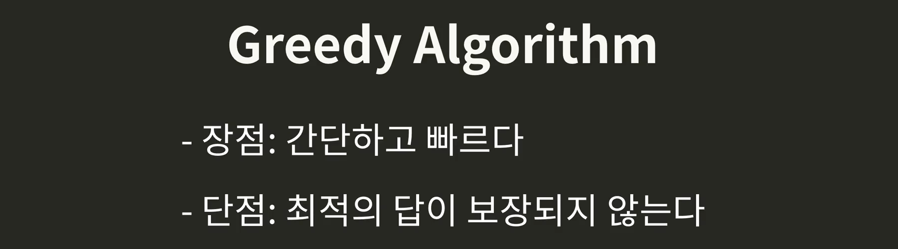
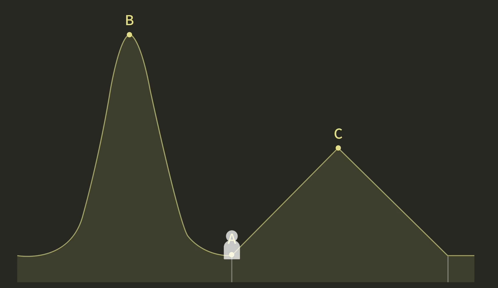
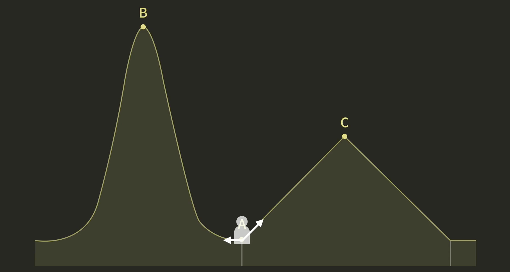
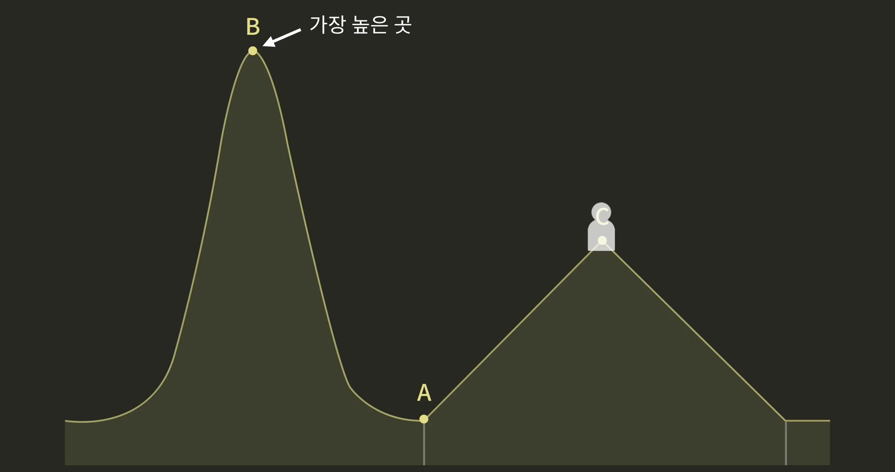
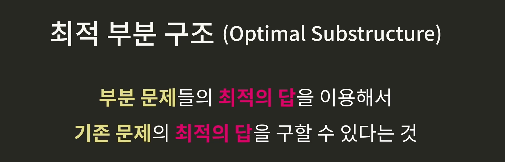
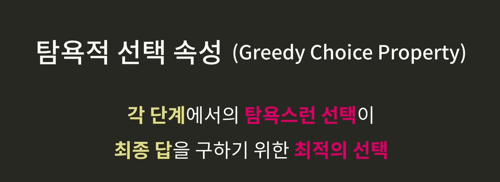
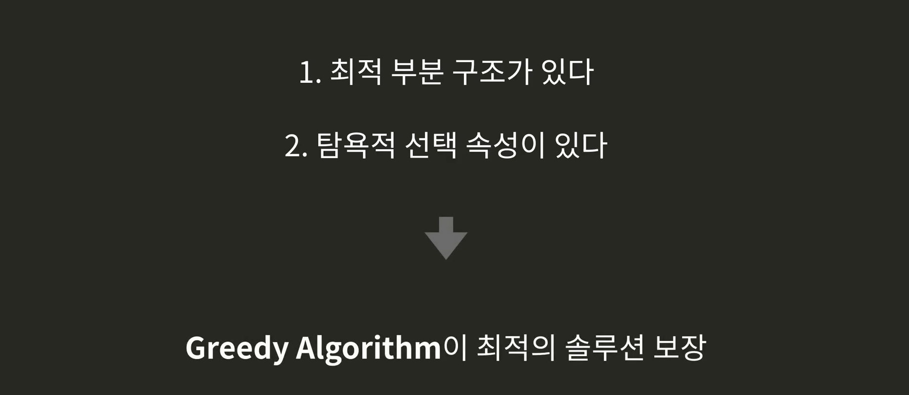
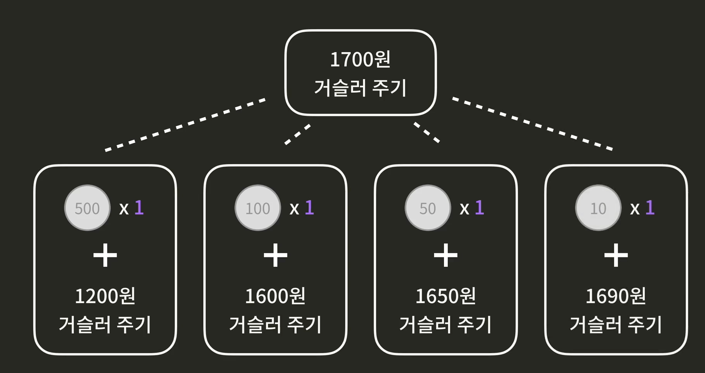
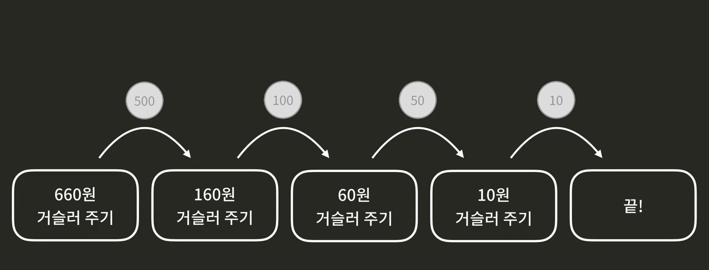

# Greedy Algorigthm

- #### Greedy Algorithm 소개

  미래를 내다 보지 않고, 당장 눈 앞에 보이는 최적의 선택을 하는 방식. 

  

  **목표를 달성하기 위해 매 순간마다 탐욕적인 선택을 하는 것.**

  빠르고 간단하지만, 최적의 답이 보장되지 않는것이 문제. 

  예를 들어, 등산을 하는데 현재 우리의 위치는 **A**.

   

  가장 높은 곳 까지 가고 싶음. Greedy Algorithm으로 한다면 현재 가장 좋아보이는 방향으로 감. 

  A지점을 기준으로 당장은 왼쪽보다 오른쪽의 경사가 더 가팔라 보임. 

  

  그래서 C로 도달하게 되겠지. 사실 B가 더 높은데, Greedy한 선택을 하다 보니깐 완벽하지 않은 답이 나온 것. 

  

  그럼 언제 사용하는 걸까?

  문제를 해결하는 다른 알고리즘들이 너무 느려서 사용하기 어려운 수준일 때. 그러면, 그나마의 대안으로 Greedy Algorithm을 사용할 수 있는 것. 

  아니면 **애초부터 완벽한 답 까지는 바라지도 않고, 그냥 적당한 답만 있어도 충분할 때**. 그럴때는 그냥 Greedy Algorithm을 사용하면 된다. 

  간혹 Greedy Algorithm이 최적의 답을 보장해주는 경우도 있음. 그럴 때는 Greedy Algorithm이 정확하면서도 효율적인 솔루션을 제공해 줌. 

  

  

- #### 언제 Greedy Algorithm을 사용할까?

  Greedy Algorithm은 다른 알고리즘들에 비해 일반적으로 간단한 대신, 최적의 답을 보장해 주지 않는 경우가 일반적임.  하지만 간혹 최적의 답을 구해주는 경우가 있긴 함. 

  문제에서 2가지 조건을 찾으면 됨. 

  1. **최적부분구조(Optimal Structure)**

     

  2. **탐욕적 선택 속성(Greedy Choice Property)**

     각 단계에서 탐욕적 선택을 하는 것이 최종 답을 구하기 위한 최적의 선택이라면이 문제는 탐욕적 선택 속성을 가지고 있는 것. 

     

  위 두가지 조건을 갖췄다면, 이 문제는 Greedy Algorithm을 사용해서 최적의 솔루션을 찾을 수 있는 것. 

  

  예시를 보자. 

  

  이 문제는 500원을 거슬러 준 후 1200원은 거슬러 주는 문제. 100원을 준 후 1600원을 최소한으로 거슬러 주는 문제, 이런식으로 나뉠 수 있음. 

  이 부분문제들에 대한 최적의 답을 구하고 비교하면 최적의 답을 구할 수 있음. 즉, 이 문제에는 최적부분구조가 있는 것. 

  

  

  **그렇다면 이 문제에 탐욕적 선택속성도 있을까?**

  *이 문제를 Greedy Algorithm으로 풀면 매 단계에서 어떤 탐욕적 선택을 할 수 있을까?*

  매 순간에서 최대한 큰 동전을 줘보자. 

  **매 순간마다 가장 큰 동전을 선택하는게 가장 최적의 선택이라는 것을 증명할 수 있으면 이 문제는 탐욕적 선택 속성이 있는 것.** 

  

  

  

  

  가능한 가장 큰 동전으로 주는 것이 무조건 좋다고 확신할 수 있음. 

  그러면 이 문제에는 **탐욕적 선택속성**이 있는 것. 

  