# 알고리즘 이란?

- #### 알고리즘 이란?

  **알고리즘이란?**

  평소에 “알고리즘”이란 말, 많이 들으시죠? 알고리즘이란, 어떤 문제를 해결하기 위한 자세한 방법입니다.

  예를 들어 라면을 만들기 위해서는 냄비에 물을 끓이고, 라면 봉지를 뜯고, 스프와 건더기를 넣고, 면을 넣고, 4분 정도 기다리면 되는데요.

  여기서 **우리가 해결하고 싶은 문제**는 라면을 끓이는 것이고, 방금 이야기한 **해결 방법**이 라면을 끓이는 문제에 대한 알고리즘입니다.

  그런데 친구 하나는 스프랑 건더기보다 면을 먼저 넣어야 더 맛있다고 생각합니다. 또 다른 친구는 면을 익히는 중에 면을 살짝씩 위로 들어올려서 공기에 접촉시켜주면 면이 더 탱탱해진다고 주장하네요.

  모두 목적은 같은데 방법이 조금씩 다릅니다. 같은 문제를 해결하기 위해서도 다양한 알고리즘이 존재하는 거죠.

  **좋은 알고리즘이란?**

  그렇다면 다양한 알고리즘 중에 좋은 알고리즘이란 무엇일까요? 좋은 알고리즘은 두 가지 조건을 충족시켜야 합니다.

  1. 문제를 해결하는 것.
  2. 문제를 더 잘 해결하는 것.

  봉지를 뜯지도 않고 봉지째 물에 넣어버리면 라면이 제대로 조리되지 않습니다. 1번 조건을 충족시키지 못하기 때문에, 제대로된 알고리즘이 아닌 거죠.

  그런데 라면을 잘 만들더라도 불을 약하게 하거나 해서 시간이 너무 오래 걸리면, 비효율적인 알고리즘이라고 할 수 있습니다. 이번에는 2번을 충족시키지 못하는 거죠.

  짧은 시간 안에 라면을 맛있게 만드는 방식이, 라면 끓이기 알고리즘 중에 가장 좋다고 할 수 있겠네요.

  **컴퓨터 알고리즘이란?**

  라면 끓이기 알고리즘은 우리 일상에서의 알고리즘인데, 그렇다면 컴퓨터 알고리즘이란 무엇일까요?

  > 컴퓨터 알고리즘이란, 컴퓨터가 어떤 문제를 해결하기 위해서 컴퓨터가 이해할 수 있는 방식으로 정리되어 있는 해결 방법입니다.

  예를 들어서 컴퓨터가 자주 마주하는 “정렬”이라는 문제가 있습니다. 뒤죽박죽 섞여 있는 숫자들을 순서대로 배치하는 문제인데요.

  ```python
  [9, 4, 10, 3, 5, 8, 12, 1] # 뒤죽박죽
  [1, 3, 4, 5, 8, 9, 10, 12] # 정렬됨
  ```

  우리는 정확하고 효율적으로 숫자들을 정렬하는 알고리즘을 찾아내야 합니다.

  그리고 이 알고리즘을 어떻게 구현하느냐? 당연히 프로그래밍을 이용해서 합니다. 그래서 프로그래밍과 알고리즘은 뗄래야 뗄 수 없는 관계인 거죠!


- #### 알고리즘이 바꾸는 세상

  **네비게이션 어플**

  두 회사에서 각각 네비게이션 어플을 출시했다고 가정해 보세요. 둘 다 디자인이 훌륭하고, 사용성도 나쁘지 않습니다. 그러면 저는 어떤 어플을 사용해야 할까요?

  우선 길을 정확하게 알려주고 도착 시간도 정확하게 알려줘야 합니다. 틀린 정보를 알려주는 어플은 그냥 안 쓰게 되겠죠. 그리고 두 번째로는 길을 빨리 알려줘야 합니다. 만약 길 한 번 찾아주는 게 2분씩이나 걸리면 답답해서 못 쓰겠죠.

  결론적으로 누가 더 정확하고 효율적인 알고리즘을 사용하는지가 중요합니다. 서비스의 성공 여부가 알고리즘에 달려 있는 것입니다.

  **영화 어플**

  예전에는 영화를 보고 싶으면 비디오나 DVD를 빌려 봤었는데, 요즘은 넷플릭스나 왓챠플레이 같은 서비스를 구독해서 볼 수 있습니다.

  영화를 직접 검색해서 볼 수도 있지만 보통은 넷플릭스가 추천해 주는 영화를 보는데요. 그냥 평점 순으로 추천해 주는 게 아니라, 데이터를 기반으로 개개인에 맞춰 영화를 골라주는 것입니다. 이것도 알고리즘의 역할이죠.

  넷플릭스에서는 추천 알고리즘을 개선하고 싶어서 대회를 열기도 했었는데, 1등한 팀은 무려 10억원이 넘는 상금을 받아갔습니다. 그만큼 넷플릭스라는 서비스에게 알고리즘이 중요한 역할을 차지하고 있는 거죠.

  **알고리즘의 중요성**

  네비게이션이나 영화 어플 말고도, 알고리즘은 거의 모든 분야에서 핵심적인 역할을 맡고 있습니다.

  예전에는 서비스를 만드는 것 자체만으로도 의미가 있었는데, 이제는 소프트웨어 개발에 대한 진입 장벽이 많이 낮아졌기 때문에 무언가 차별성이 필요합니다. 기술적으로 얼마나 잘 구현되었는지, 즉 알고리즘이 얼마나 좋은지에 따라 서비스의 성패가 갈리는 경우도 많습니다.
  

- #### 알고리즘을 모르는 개발자

  **알고리즘은 개발자의 기본 소양이다?**

  성공하신 개발자분들에게 조언을 구하면, 알고리즘을 꼭 배우라고 항상 말씀하십니다. 개발자가 알고리즘을 모르면 도대체 뭐가 어떻길래, 그런 말을 하는 걸까요?

  유능한 개발자들의 대부분은 알고리즘적 사고력을 갖추고 있고, 대표적인 알고리즘 정도는 다 꿰고 있습니다.

  개발자가 되면 이런 식의 대화가 오갑니다:

  > "여기서는 BFS 알고리즘을 써줘." "여기는 O(n)으로 작성해야 할 것 같은데?" "Divide and Conquer 방식으로 접근해보자."

  알고리즘에 대한 지식 없이는 원활한 소통이 어렵겠네요.

  **알고리즘은 개발자의 실력**

  소통의 문제를 떠나서, 알고리즘은 결과물에서도 차이를 만들어 냅니다.

  제가 웹 개발을 처음 했을 때, 알고리즘의 중요성을 뼈저리게 느낀 적이 있습니다. 분명 사용자 수는 천천히 늘어나는데, 사이트가 심각할 정도로 느려진 거죠. 아무리 봐도 뭐가 문제인지 모르겠는데, 알고리즘을 공부한 친구가 보더니 금방 해결됐습니다. 효율성에 대해서 조금만 신경 써도 쉽게 해결할 수 있는 부분이었습니다.

  어렵고 복잡한 문제를 푸는 사람에게나 알고리즘 공부가 필요한 줄 알았는데, 모든 프로그램에 알고리즘이 포함되어 있다는 걸 몸소 알게 되었고, 그래서 알고리즘 공부를 하면 평소 개발할 때에도 확실히 더 좋은 코드를 작성할 수 있다는 확신이 생겼습니다.

  여러분도 개발자로서 계속 레벨업을 하고 싶으시다면 알고리즘 공부는 필수적으로 해야 할 것입니다.

  **회사 가려면 알고리즘 잘해야 한다.**

  Google, Facebook, Amazon 등 대기업들을 포함한 대부분의 회사에서는 개발자를 뽑을 때 알고리즘 테스트를 진행합니다. 그중에서 대기업들은 특히 알고리즘을 거의 가장 중요한 평가 기준으로 봅니다.

  실무적인 경험이 부족하더라도 알고리즘적 사고력이 검증된 지원자라면, 나머지는 충분히 가르칠 수 있다고 판단을 하는 거죠. 반대로 알고리즘을 잘 모르는 개발자라면 좋은 대우를 받기 어렵다는 뜻입니다.

  취업이라는 현실적인 상황을 고려해도 알고리즘 공부는 의미 있는 투자라는 생각이 드네요!


- #### 알고리즘의 정석 수강 가이드

  **기본 구성**

  “알고리즘의 정석" 수업은 크게 네 개의 유닛으로 이루어져 있습니다. 각 유닛은 몇 개의 챕터로 이루어져 있고, 각 챕터는 여러 개의 레슨(영상, 노트, 과제, 퀴즈)으로 구성되어 있습니다.

  목차를 간단하게 살펴봅시다.

  **Unit 1: 좋은 알고리즘이란?**

  > 알고리즘이 대체 무엇?!

  알고리즘이 무엇인지 알아보고 그 중요성을 몸소 느껴보는 시간입니다. 알고리즘 세계에서의 공용어인 점근 표기법에 대해서도 공부합니다.

  - Chapter 1: 알고리즘이란?
  - Chapter 2: 하나의 문제, 여러 가지 알고리즘
  - Chapter 3: 알고리즘 평가법

  **Unit 2: 재귀 함수**

  > 재귀 함수랑 친해지기!

  재귀적 사고력은 다양한 알고리즘을 공부하기 위해 필수적이지만, 대부분 사람들이 초반에 굉장히 어려워합니다. 여러분이 재귀 함수와 친해질 수 있도록 다양한 난이도의 문제를 준비했습니다.

  - Chapter 4: 재귀 함수
  - Chapter 5: 재귀 함수 연습

  **Unit 3: 알고리즘 패러다임**

  > 나도 이제 알고리즘을 좀 안다!

  이 수업의 핵심 유닛입니다. 다양한 알고리즘 패러다임을 통해 문제를 분석해서 해결하는 방법을 공부합니다. 여지껏 해 왔던 순진한 방식이 아닌, 정말 효율적인 알고리즘을 생각해 내는 힘을 기를 수 있습니다.

  - Chapter 6: Brute Force
  - Chapter 7: Divide and Conquer
  - Chapter 8: Dynamic Programming
  - Chapter 9: Greedy Algorithm

  **Unit 4: 문제 해결 능력 기르기**

  > 배운 것들 써먹기!

  실전 문제들을 보고, 분석하는 단계부터 실제 알고리즘을 구현하는 단계까지 도전해 봅니다. 여러분의 뇌를 자극할 흥미로운 문제들이 준비되어 있습니다!

  - Chapter 10: 알고리즘 연습 Level 1
  - Chapter 11: 알고리즘 연습 Level 2
  - Chapter 12: 알고리즘 연습 Level 3

  **권장 학습법**

  기본적인 수업 진행 방식은 다른 코드잇 수업들과 유사합니다. 하지만 “알고리즘의 정석” 수업의 과제들은 전반적으로 많은 생각을 요구하기 때문에, 과제 제도를 조금 다르게 해 보았습니다.

  과제당 힌트를 여러 단계로 제공하고, 마지막 힌트를 누르면 모범 답안을 볼 수 있는 구조인데요. 때문에 원한다면, 제대로 학습하지 않고 아주 빠르게 수업을 마칠 수 있겠죠.

  하지만 이 수업의 핵심은 정보 습득이 아니라, 알고리즘적 사고력을 최대한 기르는 것입니다. 문제 하나하나를 소중하게 생각하고, 가능한 많은 시간을 들여 어떻게든 풀 수 있도록 해야 합니다. 아무리 고민해도 갈피를 못 잡겠으면 힌트 하나를 열고 다시 생각해 보세요. 또 오랜 시간을 들여 고민하다가 모르겠으면 힌트 하나를 더 열어 보세요. 커뮤니티에 질문을 해도 좋고요.

  많은 고민을 하면 결국 답을 보게 되더라도, 고민한 시간이 엄청난 자산이 될 것입니다. 반대로 너무 쉽게 포기하면, 그 과정에서 배울 수 있었던 것들을 모두 놓쳐 버리게 되는 거죠. 무엇보다 어려운 문제를 직접 풀었을 때의 그 희열을 못 느낀다는 건 굉장히 슬픈 일입니다!

  

# 하나의 문제, 여러가지 방법

- #### 하나의 문제를 해결하는 여러가지 방법

  알파벳 순으로 정렬된 도서관에서 *Romeo N Juliet*을 찾고 싶다면? 

  1. 제일 왼쪽부터 하나씩 보다가 로미오와 줄리에 있으면 뽑으면 됨 -> **선형탐색 알고리즘**
  2. 중간에 하나 뽑아, 이진검색으로 반씩 줄여감 -> **이진탐색 알고리즘**

  이런 방법들을 고민하고, 어떤 방식이 제일 좋은지 고민하는 것이 알고리즘 공부. 

- #### 선형탐색 알고리즘

  탐색문제

  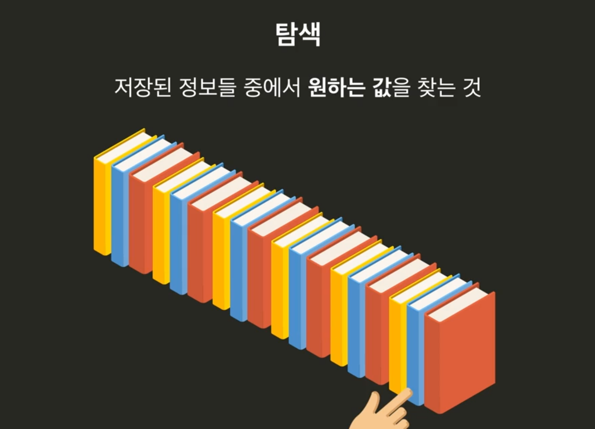

  **아래 파이썬 리스트에서 29를 찾고자 한다면.** 

  **첫번째**, 선형탐색은 앞에부터 차례대로 하나씩 보는 것. 

  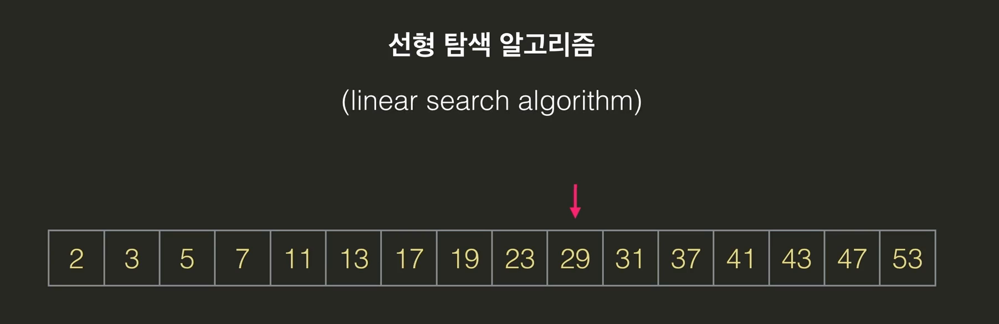

  **두번째**는, 중간을 보며, 위/아래를 판단하고 나머지 반씩 없애가는 것. 

  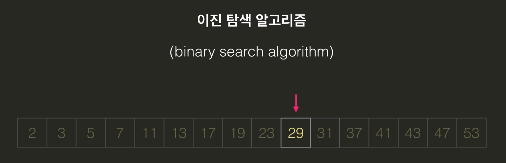

  이진탐색 알고리즘 파이썬 구현

  ```python
  def binary_search(element, some_list):
      start_index = 0
      end_index = len(some_list) - 1
  
      while start_index <= end_index:
          midpoint = (start_index + end_index) // 2
          if some_list[midpoint] == element:
              return midpoint
          elif some_list[midpoint] > element:
              end_index = midpoint - 1
          else:
              start_index = midpoint + 1
      return None
  
  
  print(binary_search(2, [2, 3, 5, 7, 11]))
  print(binary_search(0, [2, 3, 5, 7, 11]))
  # print(binary_search(5, [2, 3, 5, 7, 11]))
  # print(binary_search(3, [2, 3, 5, 7, 11]))
  # print(binary_search(11, [2, 3, 5, 7, 11]))
  ```


- #### 탐색 알고리즘 비교

  위 두 알고리즘 중에 뭐가 좋을까?

  먼저 선형탐색 알고리즘. 

  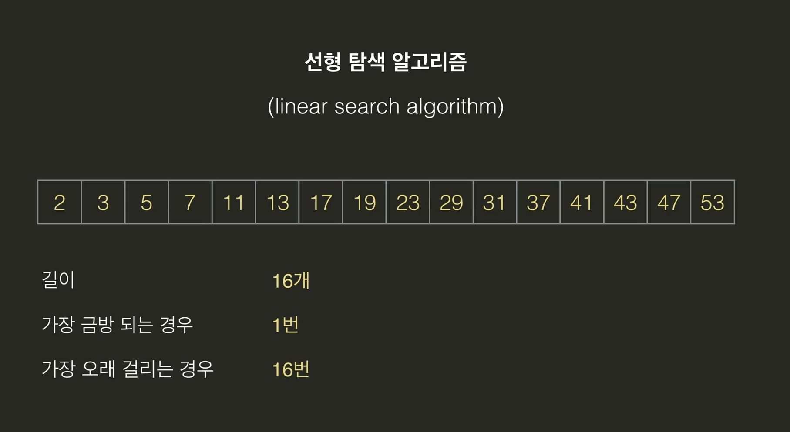

  이진탐색 알고리즘

  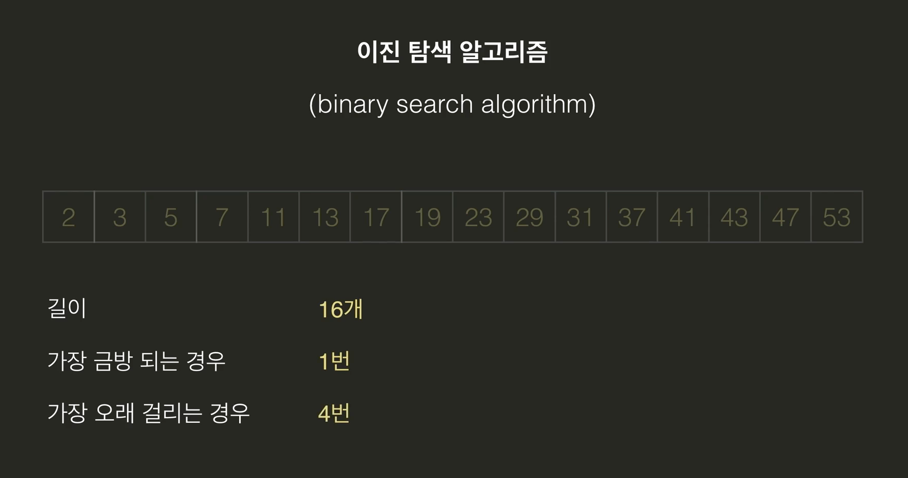

  정리하자면, 아래와 같이 선형탐색은 리스트 내부 원소가 많아질수록 걸리는 시간이 급격하게 커지는데, 이진탐색은 리스트의 길이가 길어져도 걸리는 시간이 아주 천천히 늘어남. 

  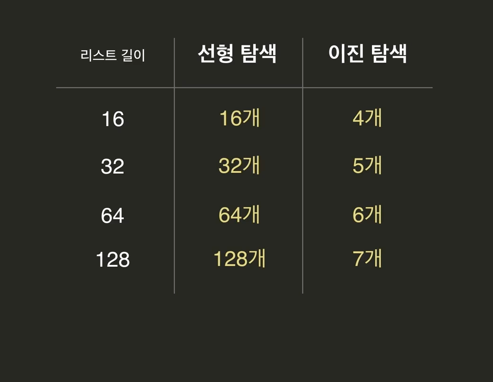

  만약 페이스북 23억명 중에 찾으려면? 

  

  다만, 이진탐색을 하려면 리스트가 정리가 되어 있어야 함. 뒤죽박죽 하면 어쩔 수 없이 선형탐색 밖에 방법이 없음. 


- #### 선택정렬(Selection Sort)

  정렬은 리스트의 원소들을 특정 순서로 정리하는 것. 

  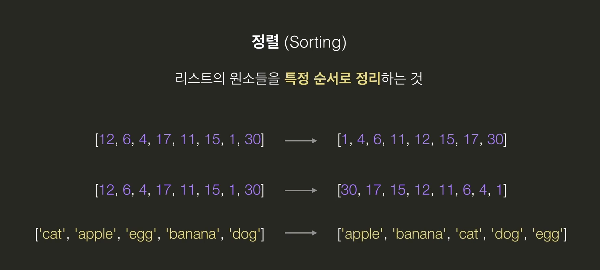

  파이썬에는 이미 정렬 관련된 함수들이 많이 있음. 

  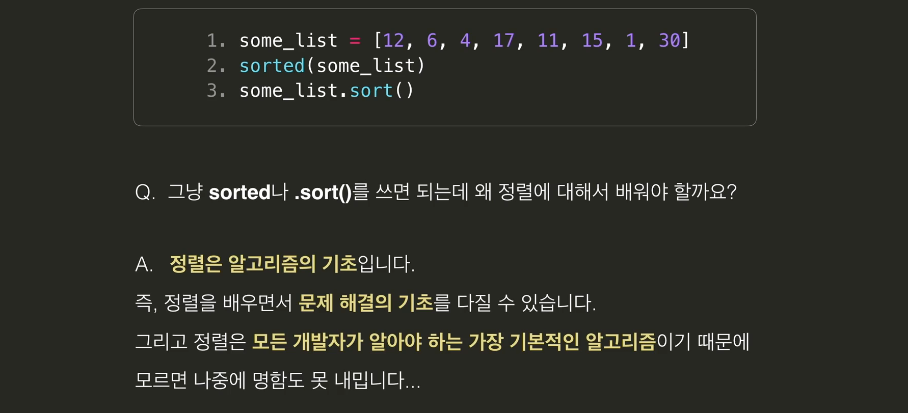

  **첫번째는 선택정렬(Selection Sort)**

  그냥 하나씩 뽑아서, 정렬하는 것. 

  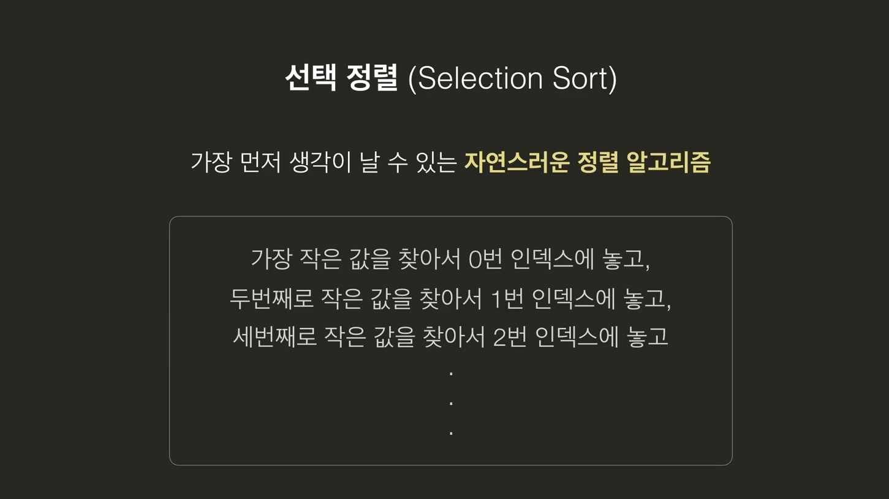

  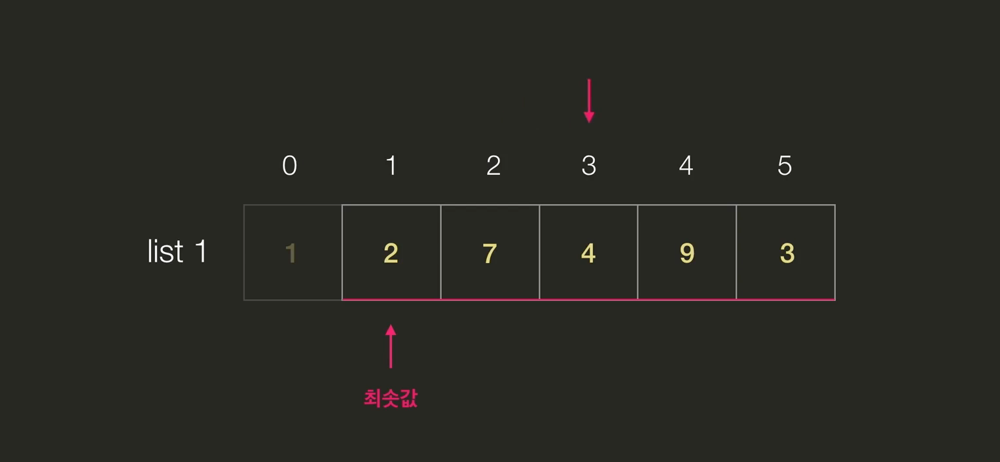

  그냥 이렇게 하나씩 넣는 것. 

- #### 삽입정렬(Insertion Sort)

  각 위치에 들어갈 알맞은 값을 찾는 선택정렬과 다르게, 

  삽입정렬은 각 값이 어떤 위치에 들어갈지 찾는 과정. 

  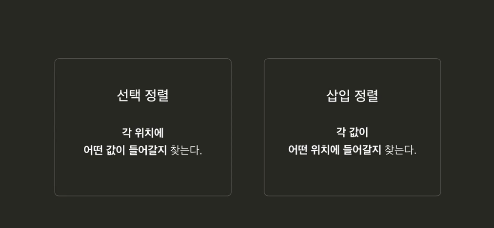

  아래에서 정렬을 해보자. 

  일단, 2를 정렬해보면, 2를 딱 보고 옆이랑 비교하면 옆이 4야. 그럼 4랑 자리 바꿔. 그리고 옆에 또 봐. 이런식으로 반복하는 것. 왼쪽이랑만 비교하면서 움직이면 되지. 차례대로 하나씩 보니깐. 

  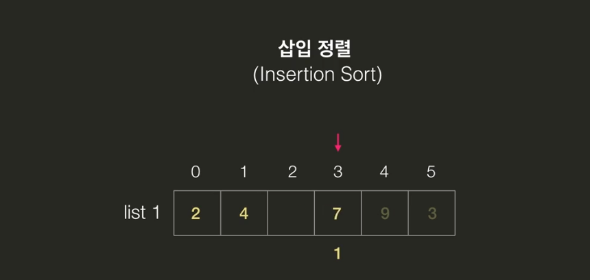

  


- #### 정렬 알고리즘 평가법

  우리는 일단 두 가지 정렬 방법을 살펴봤습니다. 그런데 사실 이 외에도 퀵 정렬, 힙 정렬, 거품 정렬 등 여러 정렬 알고리즘이 있는데요.

  그렇다면 이 많은 정렬 알고리즘 중 어떤 게 가장 좋을까요?

  *들어가보면 재밌음. https://www.toptal.com/developers/sorting-algorithms*

  이 [사이트](https://www.toptal.com/developers/sorting-algorithms)를 들어가면 여러 정렬 알고리즘의 퍼포먼스를 다양한 상황에서 살펴볼 수 있습니다.

  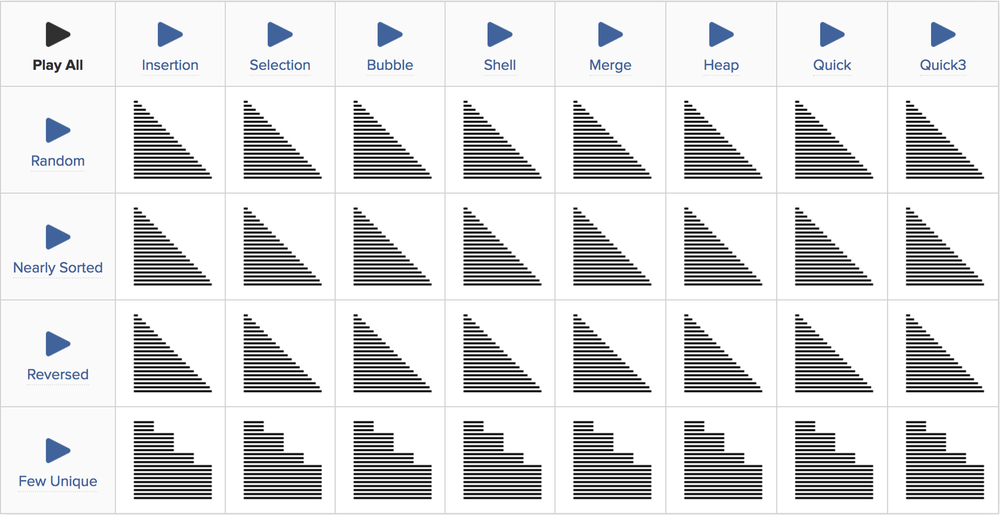

  예를 들어 이미 거의 정렬된 리스트를 정렬할 때는 삽입 정렬(Insertion Sort)이 가장 빠른 반면, 무작위 순서의 리스트를 정렬할 때는 힙 정렬(Heapsort)이 가장 먼저 끝나네요. 아예 정반대로 정렬된 리스트의 경우에는 삽입 정렬이 매우 오래 걸린다는 것도 볼 수 있죠. 선택 정렬(Selection Sort)과 합병 정렬(Merge Sort)은 상황에 영향을 받지 않고 일정한 시간이 소요된다는 점도 주목해 볼 만합니다.

  보시다시피 정렬 문제의 경우 "절대적인 좋은 답”이란 없습니다. 상황에 따른 각 알고리즘의 장단점을 파악해야 올바른 알고리즘을 선택할 수 있겠죠. 그렇기 때문에 문제를 해결하는 방법을 넘어서 알고리즘을 평가하는 능력을 길러야 합니다. 다음 챕터에서 배울 내용이 바로 “알고리즘 평가법”입니다.


# 알고리즘 평가법

- #### 평가의 두 기준: 시간과 공간

  시간이나 컴퓨터의 성능이 무제한이면 아무 알고리즘이나 사용해도 됨. 

  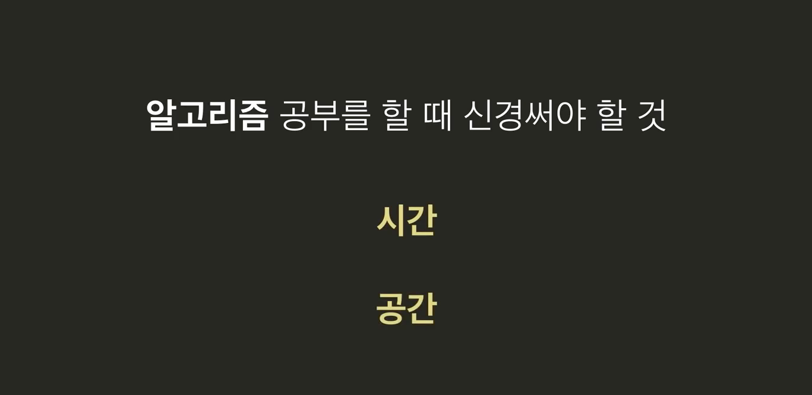

  좋은 알고리즘의 첫번째 기준은 **시간** : 당연히 빨리빨리 되야 좋은거지.  

  두번째 기준은 **공간**: 컴퓨터의 저장공간을 의미함. 메모리를 최대한 적게 사용해야 함. 

  둘 중에 굳이 더 중요한것을 찾아보라 하면 **시간**임. 용량은 돈 주고 늘릴 수 있는데, 시간은 살 수가 없음. 

- #### 시간복잡도

  우리는 문제를 빨리 해결하는 알고리즘을 원한다. 

  근데 뭐가 더 시간 적게 걸리는지 어떻게 알지? 각 알고리즘 돌려서 빨리 되는걸 찾아보면 되긴 하는데, 외부환경이 너무 많음. 컴퓨터 사양이나 그런 걸로 인해서 같은 코드여도 너무 달라짐. 

  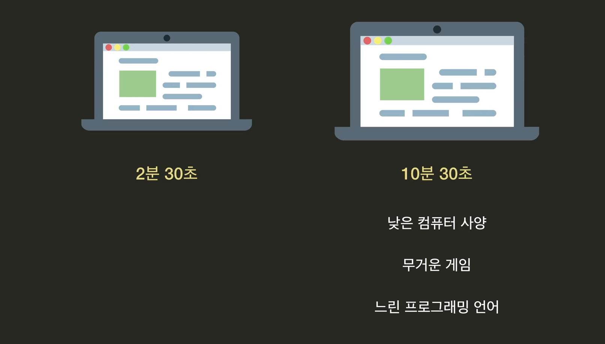

  그래서, 프로그램이 돌아가는 시간?으로 비교하는 것 자체가 그렇게 **합리적**이지가 않음. 

  그래서 컴퓨터 과학에서는 그냥 시간을 재는 것이 아니라, **시간복잡도**(**Time Complexity**)라는 개념을 사용함. 

  **시간 복잡도는 데이터가 많아질수록 걸리는 시간이 얼마나 급격히 증가하는가?**를 계산하는 것. 

  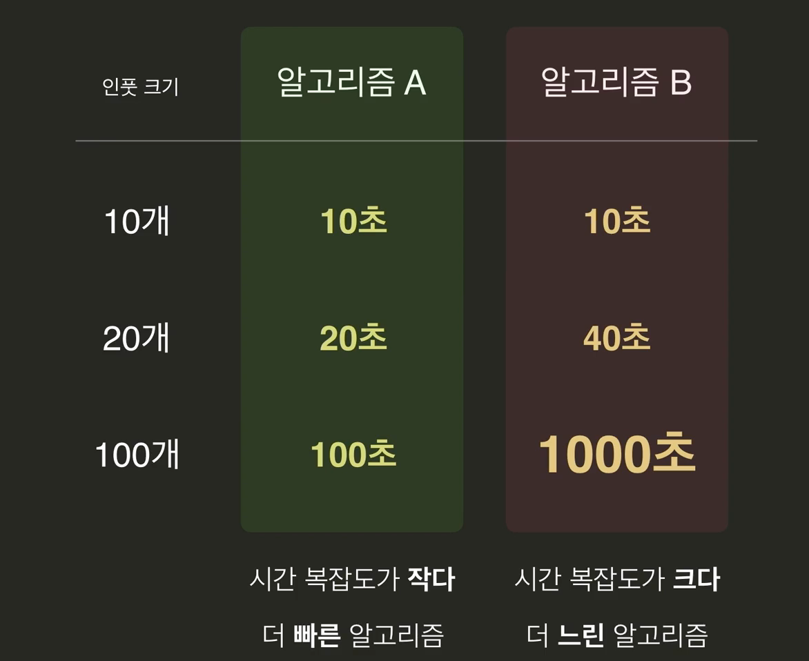

  *이 시간복잡도를 계산하기 위한 수학적인 개념은 다음 강의에서 나온다.* 

- #### 거듭제곱과 로그

  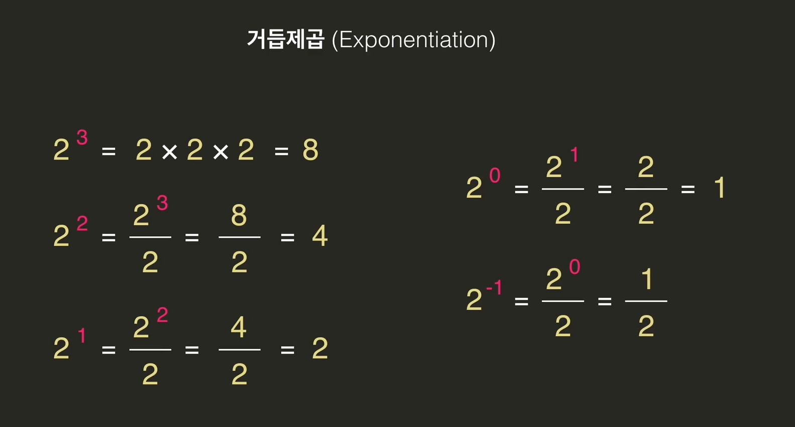

  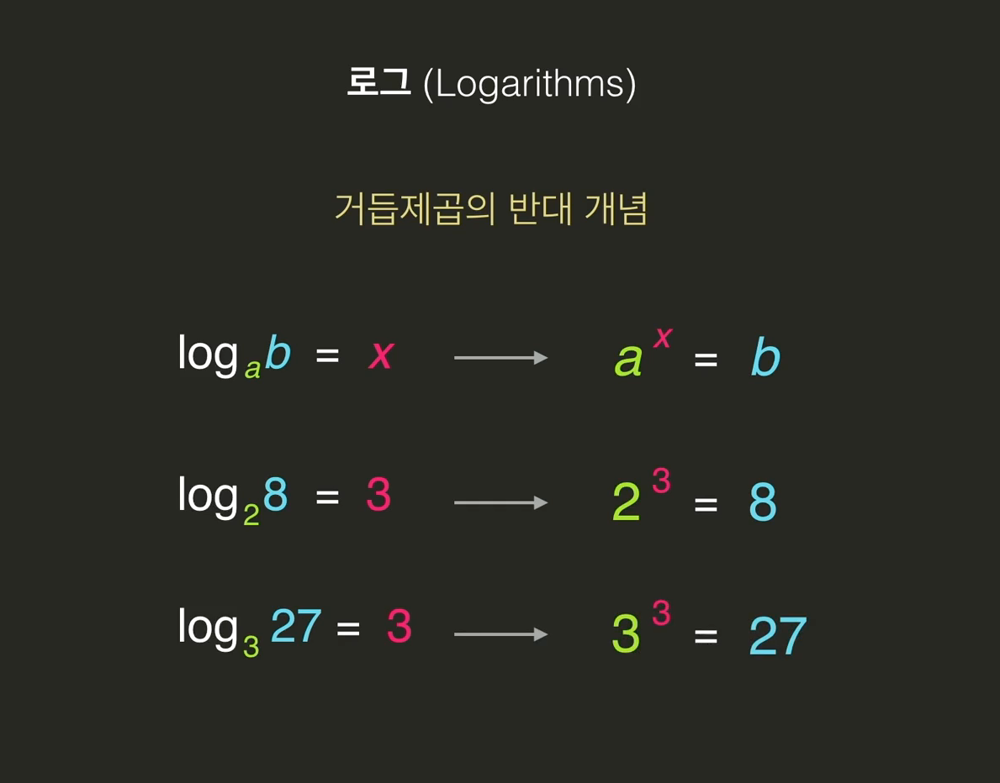

  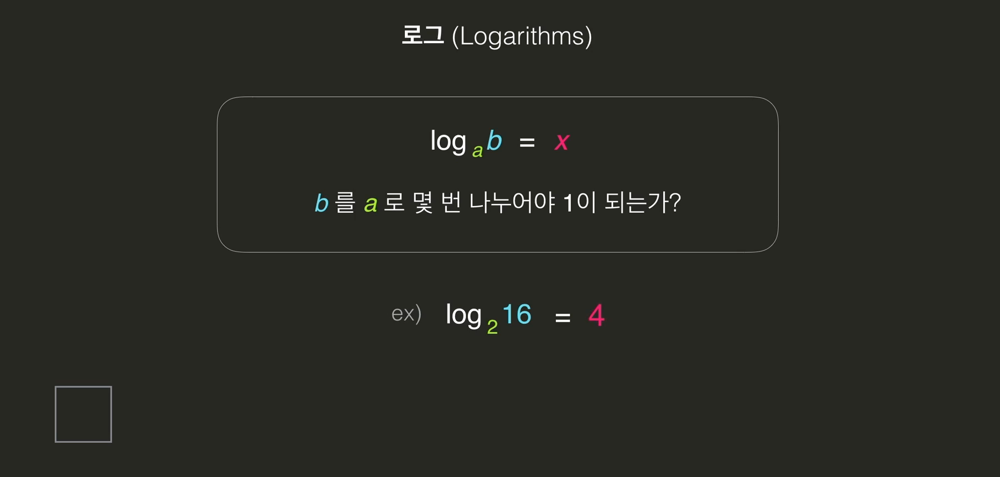

  특히 밑이 2인 로그를 lg라고 쓰기도 함. 

  


- #### 1부터 n까지의 합 

  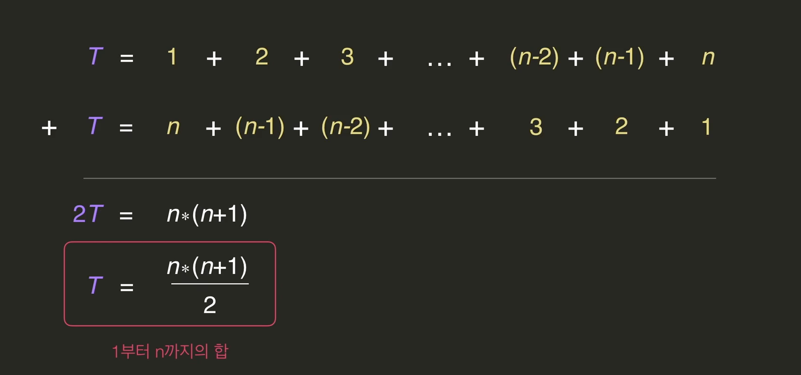


- #### 점근 표기법(Big-O Notation )

  https://feel5ny.github.io/2017/12/09/CS_01/

  알고리즘은 일반적으로 input의 크기에 따라 소요되는 시간이 달라짐. 

  당연하지만 보통 인풋 크기가 커질수록, 알고리즘이 실행되는데 더 많은 시간이 필요함. 

  **그래서 알고리즘의 소요시간을 인풋 크기에 대한 수식으로 나타낼 수 있음.**

  예를 들어서, 알고리즘의 인풋이 리스트라면 인풋 크기는 리스트의 길이겠지. 

  인풋의 크기가 n이라면, 알고리즘의 소요시간은 다양한 수식의 함수로 만들어질 수 있겠지. 

  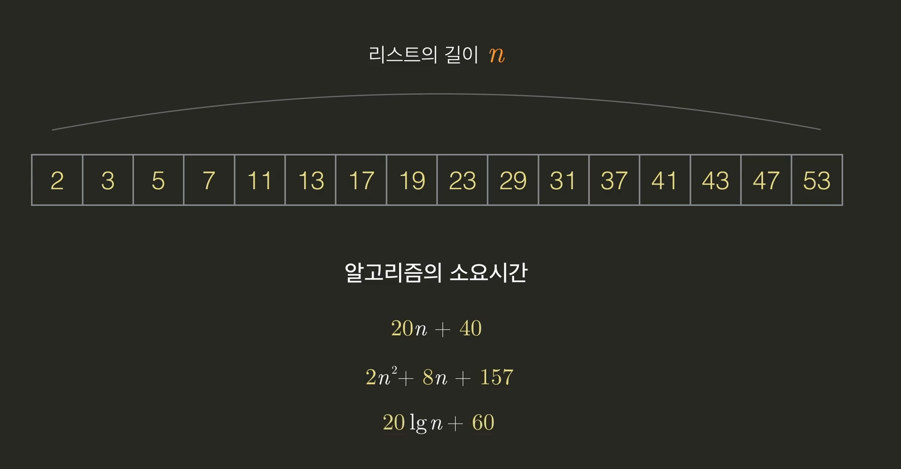

  소요시간 예시 수식들에서 상수항이나, 계수들은 환경적인 요소들로 달라짐. 즉, **수식 하나가지고 어떤 알고리즘을 완벽하게 표현하지는 못한다는 뜻**. 

  그래서, 다같이 점근표기법을 사용하자고 약속을 한 것.

  소요시간이 20n+40이라고 하면, 둘중에 n의 영향력이 더 큰 쪽은 당연히 20쪽. 그럼 그냥 40은 없애줌. 그리고, 앞에 붙은 20도 그냥 없애줌. 

  **Big-O of N, Big-O of N제곱, Big-O of N세제곱, Big-O of 로그 N** 이렇게 부름.  

  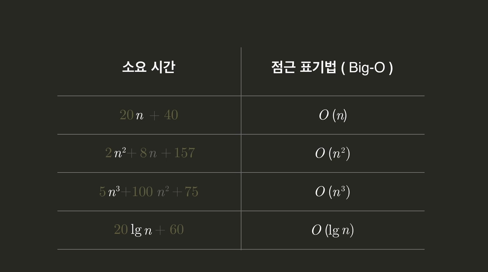

  근데 왜 이렇게 할까?

  **점근 표기법의 핵심은 n이 엄청 크다고 가정하는 것**. 왜 이렇게 가정을 하냐면, n이 애초에 별로 안크면 안좋은 알고리즘을 써도 아무 문제가 없고, 이걸 계산할 필요가 없음. 골치아프려면, 애초에 N이 꽤 큰 숫자인 상황을 가정해야 함. 

   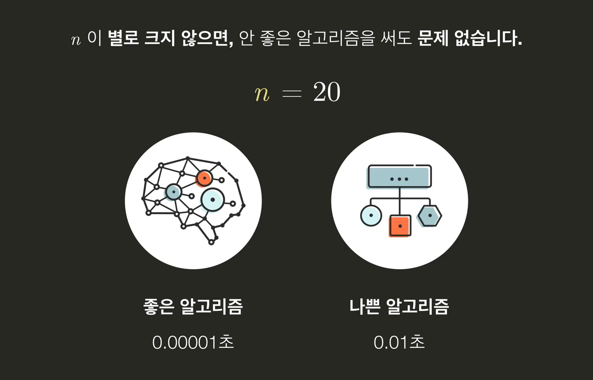

  n이 엄청 큰 경우에 우리가 좋은 알고리즘의 중요성을 실감하는 것. 

  그럼 n의 사이즈에 따른 알고리즘 하나를 가정해 보자. 

  **실제 걸리는 시간을 그려보면, n이 엄청 커질수록 계수가 낮은 항의 영향력이 너무 작아짐.  그러니깐 그냥 무시해버겠다는 것이 점근표기법의 룰 인 것.** 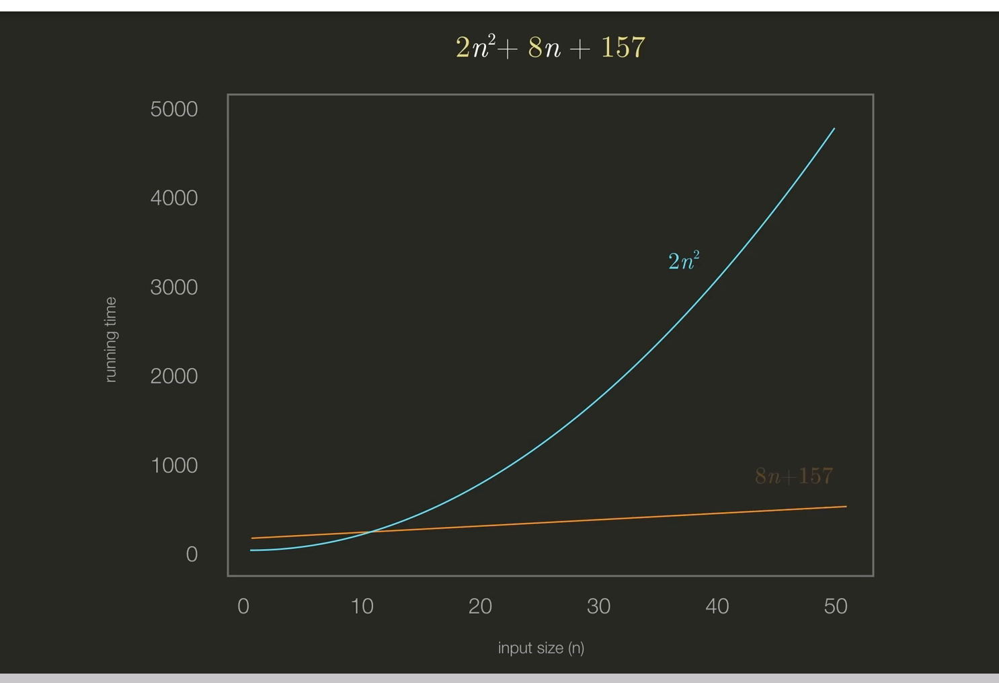

   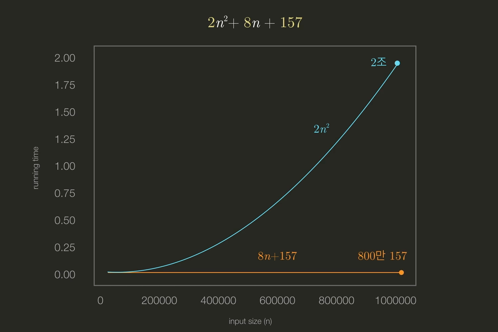

  1차항 앞의 계수를 엄청 크게 바꿔보면? 그래도 n이 커지면 별 영향이 없음. 2n^2말고는 무시해도 된다는게 룰임. 

  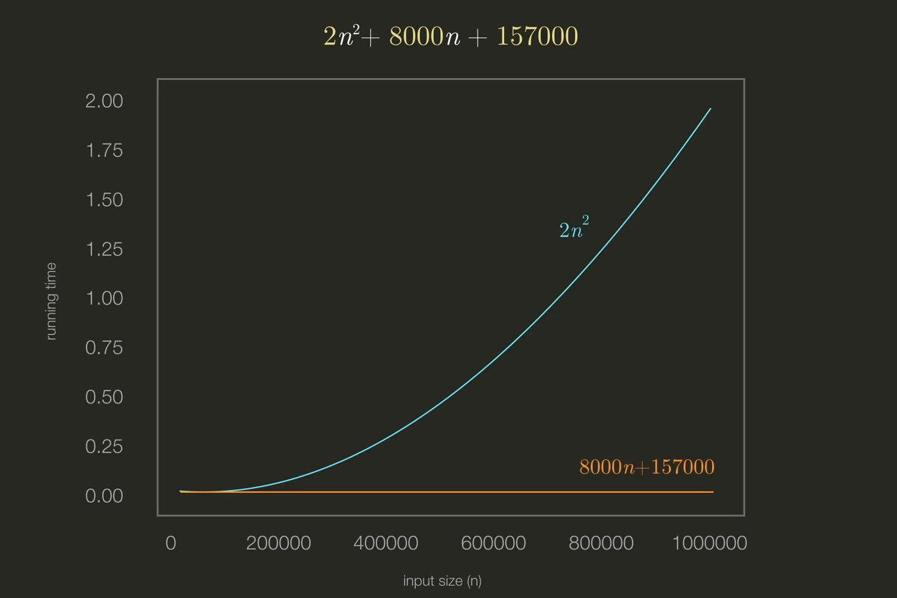

  그럼 이번에는 최고차항의 계수를 엄청 줄여도 영향력이 이렇게 차이가 날까? 추월하는 시점만 달라질뿐 그래프 똑같음. 

  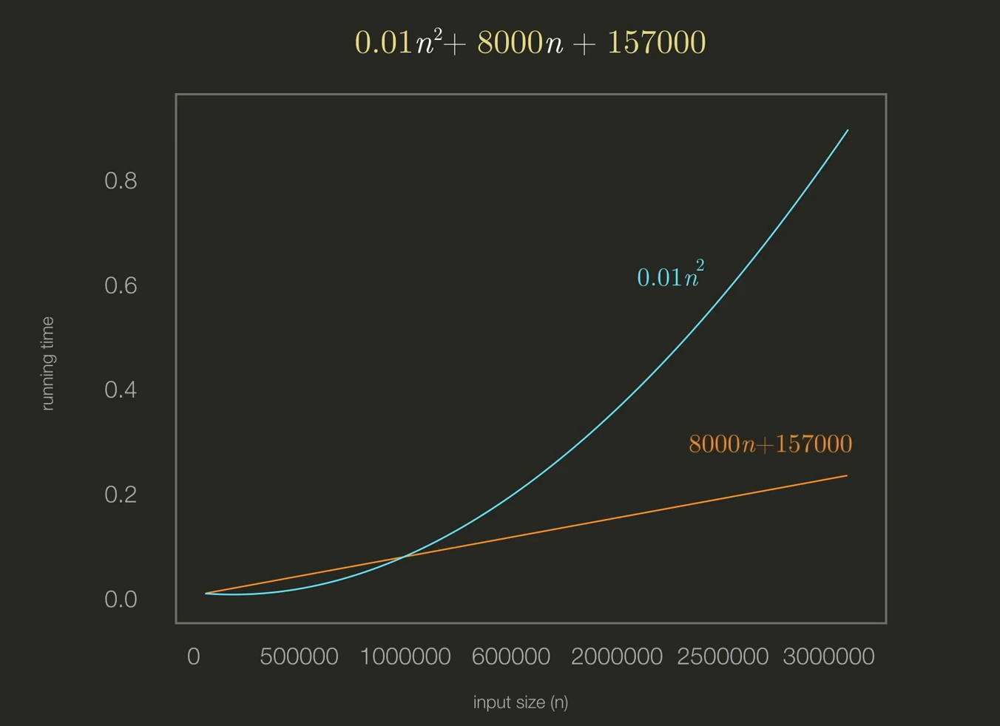

  애초에 우리는 절대적인 시간이 아니라 성장성을 보고 싶은 거야. 그러면 계수나 그런것 보다는 n제곱이라는 점이 더 중요한거야. 

  > 사실 당연한게, 우리는 성장성이나 변화 과정을 보고 싶은거야. 예를 들어 로그함수라고 할지라도 그 앞에 무슨 계수가 있고, 무슨 상수항을 더해도 그래프의 본 모습 자체가 변하지 않음. 그래서, 그 그래프의 모양을 결정하는 최고차항 혹은 그 한 항만 보겠다는 뜻. 


- #### 점근 표기법의 의미

  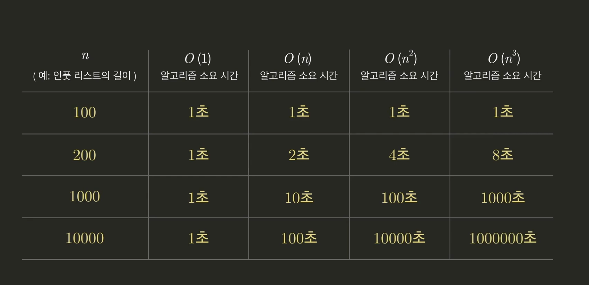

  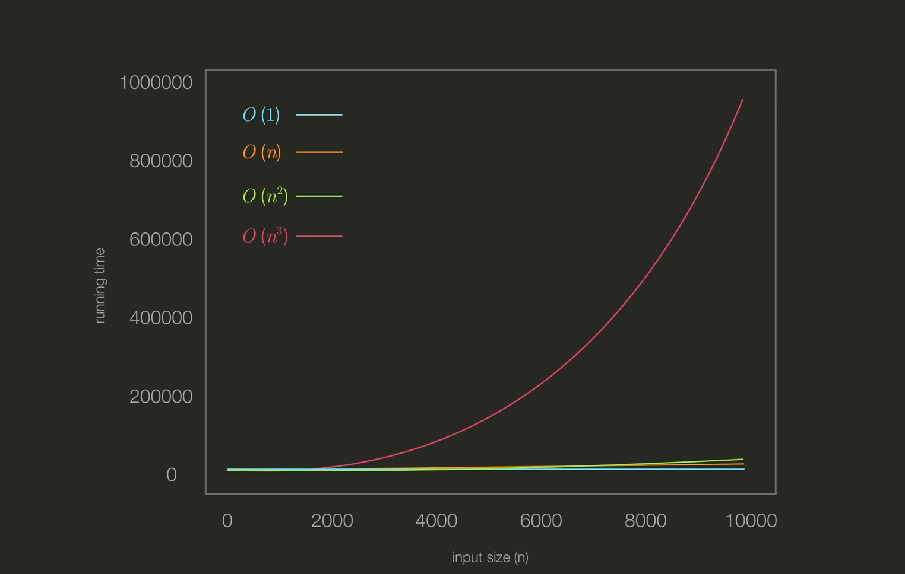

  이번에는 다른 가정을 해보자. 현재 4가지 알고리즘이 있는데, 각각 **다른 사양의 컴퓨터에서 실행시킨다고 해보자**. 

  각각 컴터를 20년된, 13년된, 8년된, 어제산 컴퓨터에서 실행시켜 본다고 해보자. 

  아무리 좋은 컴퓨터에서 실행시켜도, 알고리즘이 구리니깐 차이는 거의 비슷할정도로 크네. 

  즉, 알고리즘이 별로면 컴터 사양이 어쩌고 해도 한계가 있다는 뜻. 

  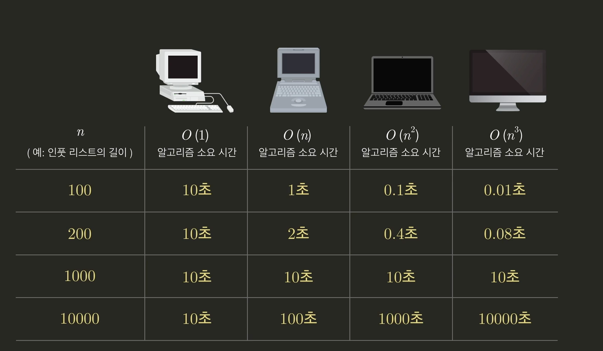


- #### 탐색알고리즘 평가하기

  선형 탐색 먼저 보자면, 

  i, len, while자체는 1초만에 실행된다고 해보자. 근데 이 반복문이 몇번 실행될까?

  바로 찾자마자 나오는 첫번째 있던 경우를 봐보자. 

  **최고의 경우**

  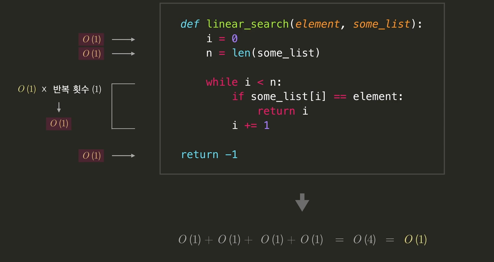 

  **최악의 경우라면?**

  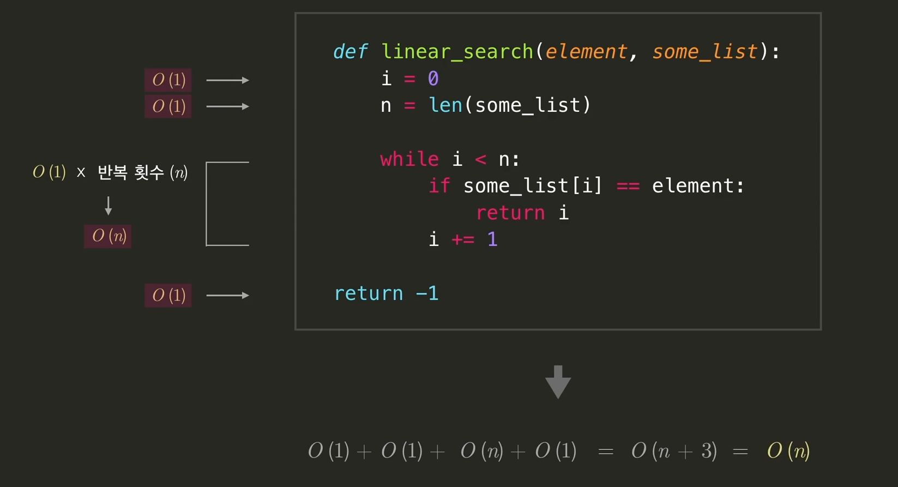

  그럼 이진탐색은?

  **최고의 경우**

  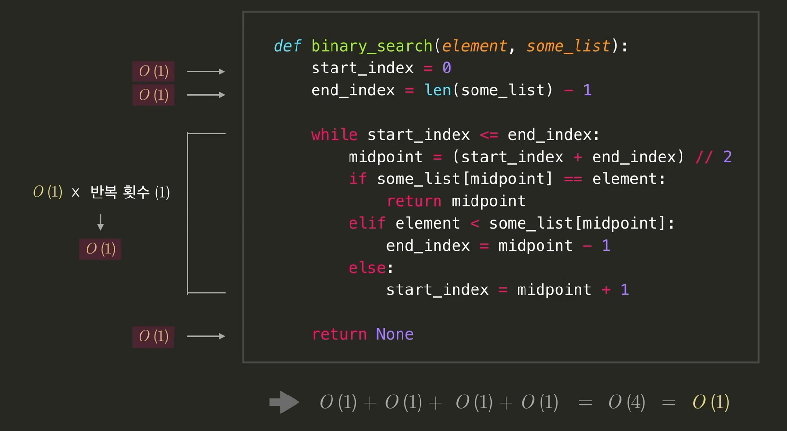

  > Q: 예제 코드에서 반복문을 한 번 실행할 때 시간복잡도가 왜 O(1)이 되는지 잘 모르겠어요. 예를 들어 이진 탐색에서 len(some_list)는 리스트의 길이가 증가할 때마다 연산횟수는 많아질 것이고, 반복문 내부에서도 조건문들 세 개를 위에서부터 순차적으로 검사해야 하니까 최고인 경우에는 첫 번째 조건만 검사하면 되지만 최악의 경우에는 조건 세 개를 검사해야 하니까 연산 횟수가 더 많아지는데 그래도 시간복잡도가 O(1)인 이유는 무엇인지 궁금합니다.
  >
  > A: 
  >
  > 우선 이진 탐색을 하면 `len(some_list)`는 1번 실행되고, `len()`의 시간복잡도는 O(1)입니다 (O(n) 이 아닙니다). 
  >  반복문 내부는 말씀 하신대로 최대 3개의 조건을 검사 해야하고 연산 횟수가 많아도 어떤 상수 입니다 (n이랑 상관이 없습니다). 이런 경우를 O(1)이라고 합니다.
  >  한번 시간복잡도에 대한 [추가 설명](https://feel5ny.github.io/2017/12/09/CS_01/) 을 읽어 보셔도 좋을 것 같습니다.

  

  최악의 경우(우리가 찾는 값이 리스트에 없는 경우)

  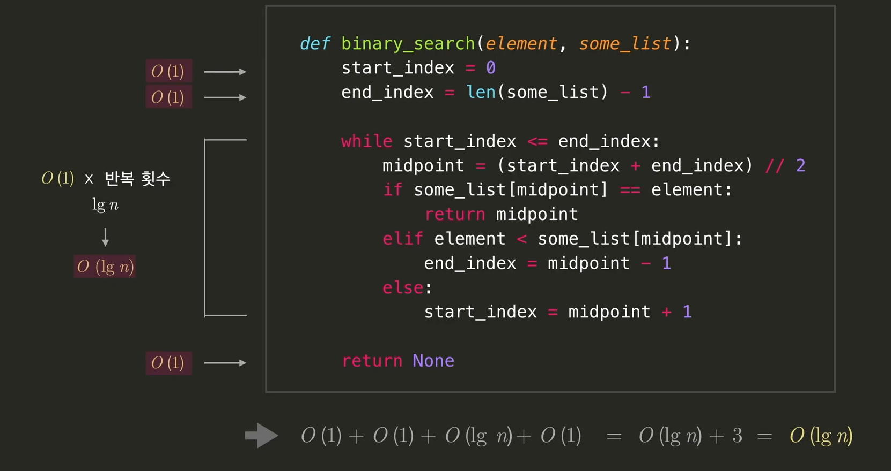

  정리하면 이렇긴 한데, 알고리즘을 평가할때는 안전하게 조금 보수적으로 판단하는게 나음. 

  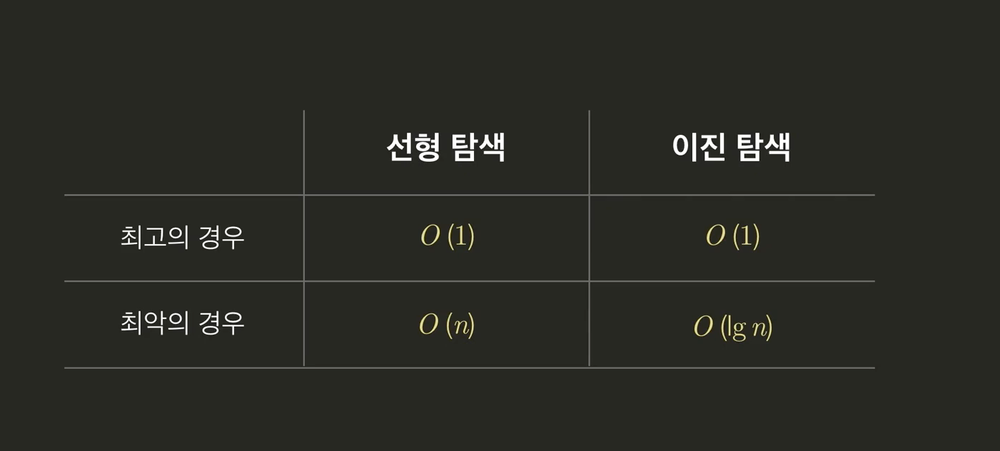

  이번 수업에서는 왠만하면, 최악의 경우를 위주로 볼 것. 

  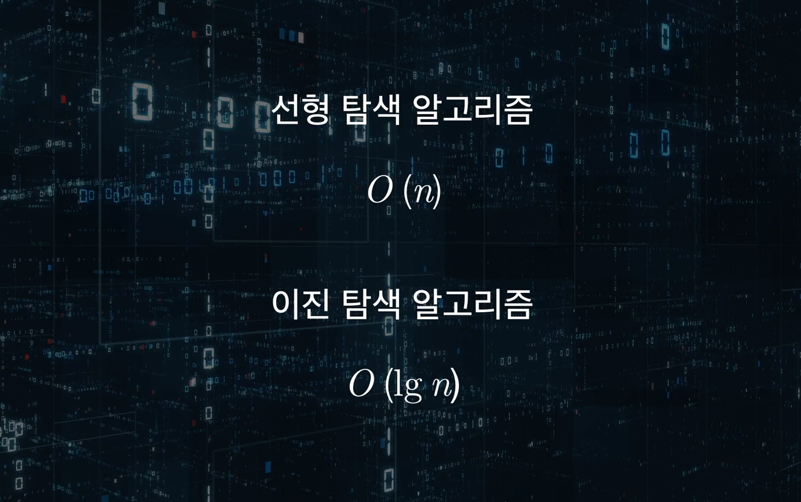


- #### 알고리즘 평가 주의사항

  점근 표기법으로 알고리즘을 평가할 때 주의해야 할 점 몇 가지만 알아봅시다.

  **점근 표기법에서 *n*은 무엇인가?**

  점근 표기법에서 *n*이 갖는 의미에 대해 착각하는 사람들이 많습니다. 하지만 사실 *n*은 점근 표기법에서 인풋 크기를 나타낼 때 가장 흔히 사용되는 문자일 뿐, 별다른 의미는 없습니다. 인풋 리스트의 크기를 x*x*라고 부르기로 하면 O(lg{x}),  *O*(lg*x*), O(x)*O*(*x*), O(x^2), *O*(*x*2) 등의 표기를 하겠죠.

  이번 수업에서는 다루지 않겠지만, “트리”나 “그래프” 같은 조금 특수한 자료 구조가 인풋으로 들어올 수도 있습니다. 트리와 그래프가 특수한 이유는 리스트처럼 “선형적”이지 않기 때문인데요. 예를 들어서 그래프는 꼭짓점(vertex)과 변(edge)으로 이루어져 있습니다. 꼭짓점의 개수를 *V*라고 하고 변의 개수를 *E*라고 하면, 두 꼭짓점 간 최단 경로를 찾는 BFS 알고리즘의 시간 복잡도는 O(V + E)*O*(*V*+*E*)입니다. 시간 복잡도를 표현하기 위해 두 개의 다른 문자를 쓴다는 점에서 조금 특이하네요.

  **(참고: "트리"나 "그래프"라는 개념을 몰라도 전혀 관계 없습니다.)**

  아마 이번 수업에서는 주로 *n*을 사용하겠지만, n*n*에 특별한 의미를 둘 필요는 없습니다!

  **코드의 모든 줄은 O(1)*O*(1)인가요?**

  아닙니다!

  인풋 크기와 상관 없이 실행되는 코드만 O(1)입니다. 그렇지 않은 코드는 시간 복잡도를 따져봐야 합니다.

  예를 들어서 `sorted` 함수나 `sort` 메소드를 사용하면 내부적으로 **O(nlg{n})**의 정렬이 이루어집니다.

  만약 리스트에서 `in` 키워드를 통해 값의 존재 여부를 확인하면 내부적으로 O(n)의 선형 탐색이 이루어집니다.

  그 외에도 알아야 할 것들이 많은데, 이번 수업에서는 아래의 몇 가지만 알아두세요.

  이 모든 것을 정말 제대로 이해하고 싶다면, 이후에 자료구조 수업을 수강하시면 됩니다!

  **List Operations**

  리스트의 길이를 n이라고 합시다.

  | Operation           | Code                               | Average Case  |
  | :------------------ | :--------------------------------- | :------------ |
  | 인덱싱              | `my_list[index]`                   | O(1)          |
  | 정렬                | `my_list.sort()` `sorted(my_list)` | *O*(*n*lg*n*) |
  | 뒤집기              | `my_list.reverse()`                | *O*(*n*)      |
  | 탐색                | `element in my_list`               | *O*(*n*)      |
  | 끝에 요소 추가      | `my_list.append(element)`          | *O*(1)        |
  | 중간에 요소 추가    | `my_list.insert(index, element)`   | *O*(*n*)      |
  | 삭제                | `del my_list[index]`               | *O*(*n*)      |
  | 최솟값, 최댓값 찾기 | `min(my_list)` `max(my_list)`      | *O*(*n*)      |
  | 길이 구하기         | `len(my_list)`                     | *O*(1)        |
  | 슬라이싱            | `my_list[a:b]`                     | *O*(*b*−*a*)  |

  **Dictionary Operations**

  | Operation            | Code                   | Average Case |
  | -------------------- | ---------------------- | ------------ |
  | 값 찾기              | `my_dict[key]`         | *O*(1)       |
  | 값 넣어주기/덮어쓰기 | `my_dict[key] = value` | *O*(1)       |
  | 값 삭제              | `del my_list[key]`     | *O*(1)       |


- #### 주요 시간 복잡도 총정리

  다른 개발자들과 함께 알고리즘에 대한 의논을 하게 되면, 자연스럽게 “시간 복잡도” 이야기가 나올 수밖에 없습니다. 시간 복잡도를 계산할 줄 알아야 원활한 대화가 이루어질 수 있겠죠.

  다행히, 알고리즘의 시간 복잡도는 대개 이 중 하나입니다.

  - *O*(1)
  - *O*(lg*n*)
  - *O*(*n*)
  - *O*(*n*lg*n*)
  - *O*(*n*2)
  - *O*(*n*3)
  - *O*(*n*4)
  - *O*(2*n*)
  - *O*(*n*!)

  이 중에서도 O(1),O*(lg*n), O(n), O(n*lg*n), O(n^2), O(n^3) 정도가 많이 사용되고, 나머지는 흔치 않습니다.

  **O(1)**

  O(1)은 인풋의 크기가 소요 시간에 영향이 없다는 뜻입니다.

  ```python
  # O(1) 함수
  def print_first(my_list):
      print(my_list[0]) 
  
  print_first([2, 3])
  print_first([2, 3, 5, 7, 11, 13, 17, 19, 23, 29, 31, 37, 41, 43, 47, 53])
  ```

  `print_first` 함수를 처음 호출할 때는 요소가 2개밖에 없는 리스트를 넘겨줬는데, 두 번째 호출할 때는 요소가 16개 있는 리스트를 넘겨줬습니다. 그런데 사실 두 경우 걸리는 시간은 거의 똑같습니다. 어차피 맨 앞에 있는 요소를 받아오는 것 뿐이니까, 리스트의 길이는 상관이 없는 거죠. 길이가 10만씩이나 되는 리스트를 넘겨줘도 똑같을 것입니다.

  나름의 팁을 드리자면, 반복문이 없으면 대체로 O(1)입니다.

  **O(n)**

  **Case 1**

  ```python
  # O(n) 함수
  def print_each(my_list):
      for i in range(len(my_list)):
          print(my_list[i])
  ```

  반복문이 있고, 반복되는 횟수가 인풋의 크기와 비례하면 일반적으로 O(n)입니다.

  **Case 2**

  ```python
  # O(n) 함수
  def print_half(my_list):
      for i in range(len(my_list) // 2):
          print(my_list[i])
  ```

  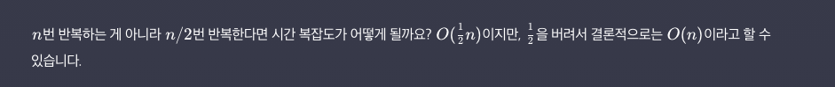

  **Case 3**

  ```python
  # O(n) 함수
  def print_three_times(my_list):
      for i in range(len(my_list)):
          print(my_list[i])
  
      for i in range(len(my_list)):
          print(my_list[i])
  
      for i in range(len(my_list)):
          print(my_list[i])
  ```

  위 코드의 경우 O(3n)인데, 결국에는 3을 버려서 이것 또한 O(n)이라고 할 수 있겠죠?

  #### O(n^2)

  그런데 반복문이 연속해서 나오는 게 아니라, 반복문 안에 반복문이 있는 경우가 있습니다.

  ```python
  # O(n^2) 함수
  def print_pairs(my_list):
      for i in range(len(my_list)):
          for j in range(len(my_list)):
              print(my_list[i], my_list[j])
  ```

  지금처럼 두 반복문 다 인풋의 크기에 비례하는 경우, O(n^2)이라고 할 수 있습니다.

  #### O(n^3)

  ```python
  # O(n^3) 함수
  def print_triplets(my_list):
      for i in range(len(my_list)):
          for j in range(len(my_list)):
              for k in range(len(my_list)):
                  print(my_list[i], my_list[j], my_list[k])
  ```

  동일한 원리로, 인풋의 크기에 비례하는 반복문이 세 번 중첩되면 O(n^3)이 되겠죠?

  #### *O*(lg*n*)

  #### Case 1

  ```python
  # O(lg n) 함수
  # 2의 거듭제곱을 출력하는 함수
  # (이번에는 인풋이 리스트가 아니라 그냥 정수입니다)
  def print_powers_of_two(n):
      i = 1
      while i < n:
          print(i)
          i = i * 2
  ```

  이번에는 반복문이 조금 특이합니다. `i`가 두 배씩 증가하네요.

  인풋 `n`이 `128`이면 반복문이 총 몇 번 실행될까요? `i`가 `1`일 때부터 `2`, `4`, `8`, `16`, `32`, `64`까지 총 7번 실행됩니다. lg128도 7인 건 우연이 아닙니다!

  `print_powers_of_two` 함수는O*(lgn*)입니다.

  **Case 2**

  ```python
  # O(lg n) 함수
  # 2의 거듭제곱을 출력하는 함수
  # (이번에는 인풋이 리스트가 아니라 그냥 정수입니다)
  def print_powers_of_two(n):
      i = n
      while i > 1:
          print(i)
          i = i / 2
  ```

  `i`를 `1`부터 시작해서 두 배씩 곱하는 게 아니라, `n`부터 시작해서 반씩 나눠봅시다. 이 경우에도 `i`가 `128`일 때부터 `64`, `32`, `16`, `8`, `4`, `2`까지 반복문이 7번 실행됩니다.

  두 경우 모두 O*(lgn*)입니다.

  # *O*(*n*lg*n*)

  *O*(*n*^2)은 O*(*n)과 *O*(*n*)이 중첩된 거죠? 같은 논리로, O*(*nlgn)은 O(n)과 O(lg*n*)이 겹쳐진 것입니다.

  ## Case 1

  ```python
  def print_powers_of_two_repeatedly(n):
      for i in range(n): # 반복횟수: n에 비례
          j = 1
          while j < n: # 반복횟수: lg n에 비례
              print(i, j)
              j = j * 2
  ```

  위 코드에서 for문의 반복횟수는 n에 비례하는데, while문의 반복횟수는 lg*n*에 비례합니다. while문이 for문 안에 중첩되어 있기 때문에 위 코드의 시간 복잡도는 O*(*n*lg*n)이라고 할 수 있습니다.

  ## Case 2

  ```python
  def print_powers_of_two_repeatedly(n):
      i = 1
      while i < n: # 반복횟수: lg n에 비례
          for j in range(n): # 반복횟수: n에 비례
              print(i, j)
          i = i * 2
  ```

  Case 1의 코드를 살짝 바꿔서 이제 for문이 while문 안에 중첩되어 있습니다. 이 경우에도 시간 복잡도는 O*(*n*lg*n)입니다.


- #### 코드가 있어야만 평가할 수 있나요?

  선형 탐색 먼저 봐보자. 

  아래 정도로 간단한 알고리즘은 코드 없이도 머릿속으로 떠올리고 판단이 가능함. 

  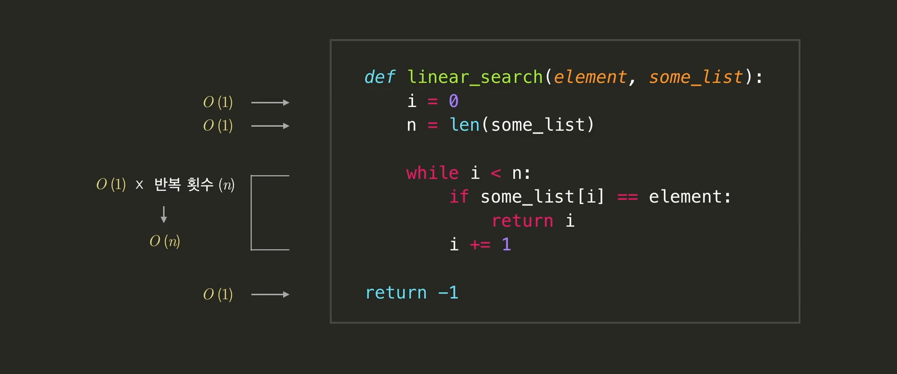

  머리로 계산하는 연습을 계손 해야함. 

  

  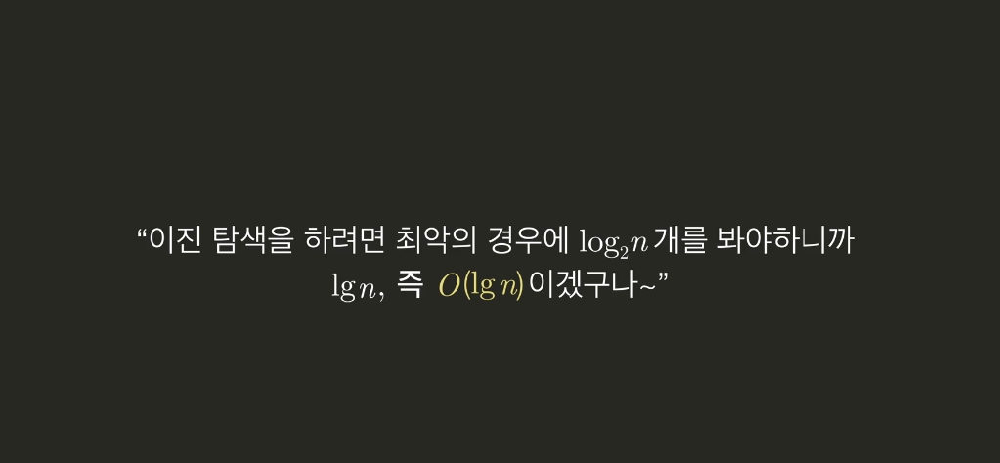


- #### 공간복잡도

  시간 복잡도(Time Complexity)는 인풋 크기에 비례하는 알고리즘의 실행 시간을 나타냅니다. 시간 복잡도를 잘 이해하셨다면 공간 복잡도도 어렵지 않습니다.

  공간 복잡도(Space Complexity)는 인풋 크기에 비례해서 알고리즘이 사용하는 메모리 공간을 나타냅니다. 물론 공간 복잡도도 점근 표기법으로 표현할 수 있기 때문에 간편하게 Big-O 표기법을 사용할 수 있습니다.

  간단한 예시 몇 가지만 봅시다.

  # O(1)

  ```python
  def product(a, b, c):
      result = a * b * c
      return result
  ```

  파라미터 `a`, `b`, `c`가 차지하는 공간을 제외하면 추가적으로 변수 `result`가 공간을 차지합니다. `result`가 차지하는 메모리 공간은 인풋과 무관하기 때문에 함수 `product`의 공간 복잡도는 *O(1)*입니다.

  # O(n)

  ```python
  def get_every_other(my_list):
      every_other = my_list[::2]
      return every_other
  ```

  인풋 `my_list`의 길이를 *n*이라고 합시다.

  파라미터 `my_list`가  차지하는 공간을 제외하면 추가적으로 변수 `every_other`가 공간을 차지합니다. `every_other`가 차지하는 공간은 어떻게 표현할 수 있을까요?

  리스트 `every_other`에는 `my_list`의 짝수 인덱스의 값들이 복사돼서 들어갑니다. 약 ***n/2***개의 값이 들어간다는 거죠. *O(n/2)*은 *O(n)*으로 나타낼 수 있기 때문에, `get_every_other` 함수의 공간 복잡도는 *O(n)*입니다.

  # O(n^2)

  ```python
  def largest_product(my_list):
      products = []
      for a in my_list:
          for b in my_list:
              products.append(a * b)
      
      return max(products)
  ```

  인풋 `my_list`의 길이를 *n*이라고 합시다.

  파라미터 `my_list`가 차지하는 공간을 제외하면 추가적으로 변수 `products`, `a`, `b`가 공간을 차지합니다. 우선 `a`와 `b`는 그냥 정수 값을 담기 때문에 O(1)이겠죠? 그렇다면 `products`가 차지하는 공간은 어떻게 표현할 수 있을까요?

  리스트 `products`에는 `my_list`에서 가능한 모든 조합의 곱이 들어갑니다. 그렇다면 총 n^2 개의 값이 들어가겠죠? 따라서 `largest_product`의 공간 복잡도는 O(n^2)입니다.


- #### 유용한 파이썬 기능 정리

  **type**

  ```python
  print(type([7, 5, 2, 3, 6])) # => <class 'list'>
  print(type(5))               # => <class 'int'>
  print(type(3.14))            # => <class 'float'>
  print(type(True))            # => <class 'bool'>
  print(type("True"))          # => <class 'str'>
  ```

  `type` 함수를 사용하면 파라미터의 데이터 타입이 리턴됩니다. 시간 복잡도는 O(1)입니다.

  **max, min**

  ```python
  print(max(2, 5))             # => 5
  print(max(2, 7, 5))          # => 7
  print(min(2, 5))             # => 2
  print(min(2, 7, 5, 11, 6))   # => 2
  ```

  `max` 함수를 사용하면 파라미터 중 가장 큰 값이 리턴되고, `min` 함수를 사용하면 파라미터 중 가장 작은 값이 리턴됩니다. 두 함수 모두 파라미터 개수가 유동적이기 때문에 원하는 만큼 넘겨 줄 수 있습니다.

  파라미터의 개수를 n이라고 하면, `max` 함수와 `min` 함수의 시간 복잡도는 *O(n)*입니다.

  **str**

  ```python
  my_str = str(257138)
  print(my_str)                # => 257138
  print(type(my_str))          # => <class 'str'>
  ```

  `str` 함수를 사용하면 숫자를 문자열로 바꿀 수 있습니다.

  파라미터를 n이라고 하고 n의 자릿수를 d라고 합시다. 그러면 `str` 함수의 시간 복잡도는 O*(log*n)으로 나타낼 수도 있고 ***O(d)***로 나타낼 수도 있습니다.

  > 여기서 *n*은 정수 257138을 의미하는데요. 이 정수는 숫자가 6개가 있잖아요? `str` 함수를 이용해서 정수를 문자열로 변환하는데 걸리는 시간은 257138라는 엄청 큰 숫자에 비례하는 게 아니라 자릿수에 비례합니다. 이걸 *d*를 써서 표현하면 O(d)*O*(*d*)인 거죠.
  >
  > 그리고 257138는 10진법을 이용하잖아요? 그렇기 때문에 257138은 자릿수가 몇 개인지 따져보면 *O*(log_10 *n*)라고 할 수 있습니다. 그러니까 O*(log*n)은 정수 *n*의 자릿수를 표현하는 거죠. 자릿수 d = O(log_{10}n)이기 때문에 *d*가 아닌 *n*을 써서 시간복잡도를 나타내면 O*(log*n) 이렇게 표현할 수 있는 거죠.
  >
  > 혹시 이해가 안 되시는 부분이 있으시면 다시 말씀해주시면 답변해드리겠습니다!

  **append, insert, del, index, reverse**

  ```python
  my_list = [7, 5, 2, 3, 6]
  
  my_list.append(9)            # 끝에 9 추가
  print(my_list)               # => [7, 5, 2, 3, 6, 9]
  
  my_list.insert(2, 11)        # 2번 인덱스에 11 추가
  print(my_list)               # => [7, 5, 11, 2, 3, 6, 9]
  
  del my_list[2]               # 2번 인덱스 값 삭제
  print(my_list)               # => [7, 5, 2, 3, 6, 9]
  
  my_index = my_list.index(9)  # 리스트에서 9의 인덱스
  print(my_index)              # => 5
  
  my_list.reverse()            # 리스트 뒤집기
  print(my_list)               # => [9, 6, 3, 2, 5, 7]
  ```

  `append` 메소드를 사용하면 리스트 끝에 새로운 값이 추가됩니다. 시간 복잡도는 O(1)입니다.

  `insert`, `del`, `index`, `reverse`는 모두 *O(n)*입니다.

  **sort, sorted**

  ```python
  my_list = [7, 5, 2, 3, 6]
  
  print(sorted(my_list))       # => [2, 3, 5, 6, 7]
  print(my_list)               # => [7, 5, 2, 3, 6]
  
  my_list.sort()
  print(my_list)               # => [2, 3, 5, 6, 7]
  ```

  `sort` 메소드와 `sorted` 함수는 리스트를 정렬시켜 줍니다. `sorted` 함수를 사용하면 정렬된 새로운 리스트가 리턴되고, `sort` 메소드는 그 리스트 자체를 정렬시켜 준다는 차이점이 있습니다.

  두 메소드의 시간 복잡도는 모두 O*(*n*lg*n)입니다.

  **slicing**

  ```python
  my_list = [7, 5, 2, 3, 6]
  
  print(my_list[1:4])          # => [5, 2, 3]
  print(my_list[:4])           # => [7, 5, 2, 3]
  print(my_list[1:])           # => [5, 2, 3, 6]
  print(my_list[:])            # => [7, 5, 2, 3, 6]
  print(my_list[::2])          # => [7, 2, 6]
  ```

  리스트 슬라이싱을 하면 리스트의 일부를 받아 올 수 있습니다. 리스트 슬라이싱의 시간 복잡도는 슬라이싱의 범위 길이에 비례합니다. `my_list[a:b]`를 하면 시간 복잡도는 O*(*b*−*a)입니다.

  **len**

  ```python
  my_list = [7, 5, 2, 3, 6]
  my_dict = {'a': 2, 'b': 3, 'c': 5, 'd': 7}
  my_string = 'hello world'
  
  print(len(my_list))          # => 5
  print(len(my_dict))          # => 4
  print(len(my_string))        # => 11
  ```

  `len` 함수를 사용하면 리스트, 사전, 문자열 등의 길이가 리턴됩니다. 시간 복잡도는 O(1)입니다.

  >안녕하세요, 리스트/사전/집합 등 파이썬 자료구조는 몇개의 요소가 들어있는지를(internal count) 내부적으로 저장합니다 (`.append()`같은 함수를 호출하면 internal count도 1이 증가합니다). 따라서 `len(자료구조)`을 실행하는 경우 `자료구조`의 internal count를 바로 return하면 되기 때문에 O(1)입니다.