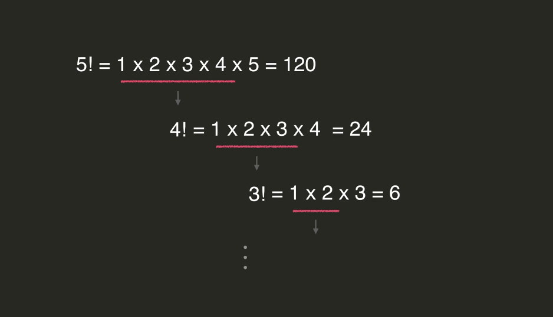

# 재귀함수(Recursive)

- #### 재귀함수 개요

  

  

  이제 0에서 반대로 하나씩 뒤에서 앞으로 가면서 끝나는 것. 

- #### 재귀 활용 예시

  

  

  재귀적으로 문제를 푼다는 것은 같은 형태의 더 작은 문제(부분 문제) 그 부분 문제의 답을 이용해서 원래 문제를 푸는 것. 

  

  

  5!의 부분문제는 4!, 4!의 부분문제는 3! 이런식으로 문제가 계속 작아짐. 

  

  재귀적으로 보자면, 2가지 경우로 나눌 수 있음. 

  

  재귀적으로 문제를 풀때는 항상 위처럼 나눠야함. base case는 문제가 충분히 작아서 바로 풀 수 있는 경우, recursive case는 부분적으로 부분문제를 풀어야 하는 경우. **base case없이 recursive case만 있으면 재귀적으로 계속 함수를 호출하고 끝나지가 않겠지**. 그래서 항상 재귀적으로 문제를 정리할 때는 **base case와 recursive case를 모두 생각해 내야 한다!**

  

  

- ### 재귀함수 vs 반복문

  재귀함수를 쓸 수 있는 경우는 반복문으로도 풀 수 있고, 반대도 마찬가지임. 

  

  근데 재귀함수에서는 치명적인 단점도 있음. 

  함수가 실행될 때, 함수가 실행되는 ***hello()*** 위치를 컴퓨터가 기억하고 있다가, 함수가 끝나면 내부적으로 그 위치를 지워버림. 

  이렇게 위치를 보관하는 곳을 call stack이라고 부르는데, 

  

  그런데 함수를 너무 많이 호출하게 되면, 콜스택이 너무 많이 쌓임. 계속해서 쌓이다가 결국 기록할 공간이 없어지면 프로그램이 죽어버림.

   

  콜스택이 너무 많이 쌓여서 한계점에 도달하면 프로그램 죽어버리는 것을 StackOverFlow에러라고 부름. 

  

  파이썬은 애초에 너무 심각한 상황을 방지하기 위해서 콜스택을 1000개까지만 허용해줌. 

  그래서 factorial같은 것 만들어놓고 2000이렇게 하면 RecursionError라고 뜨고 프로그램 바로 종료됨. 

  

  그렇다면 재귀함수는 언제 쓰는게 좋을까?

  *애초에 콜스택이 너무 많이 쌓일 것 같으면 반복문을 쓰는것이 우선.*

   

  