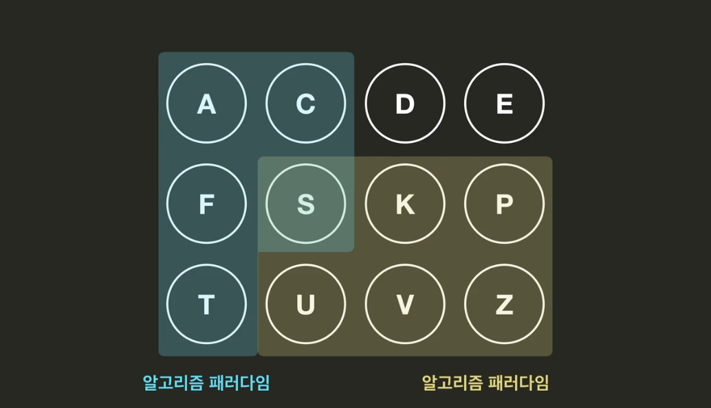
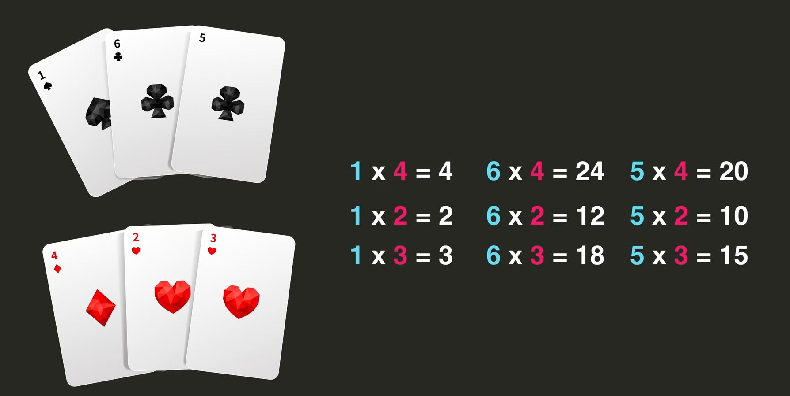
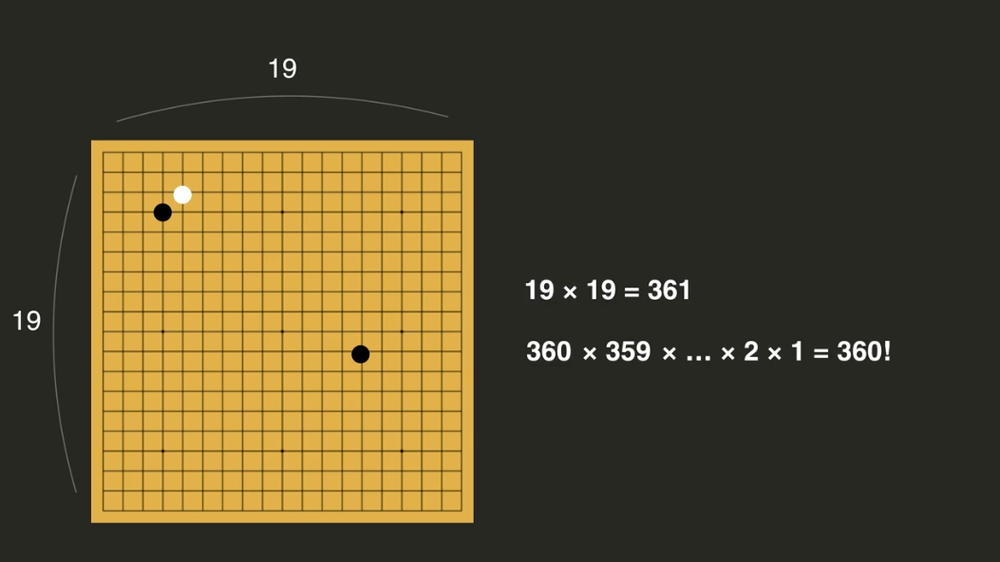
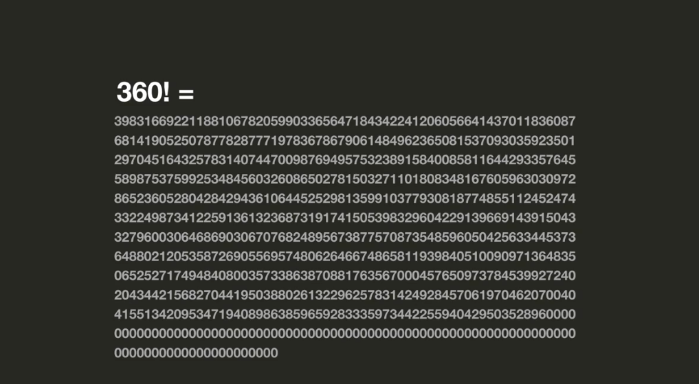
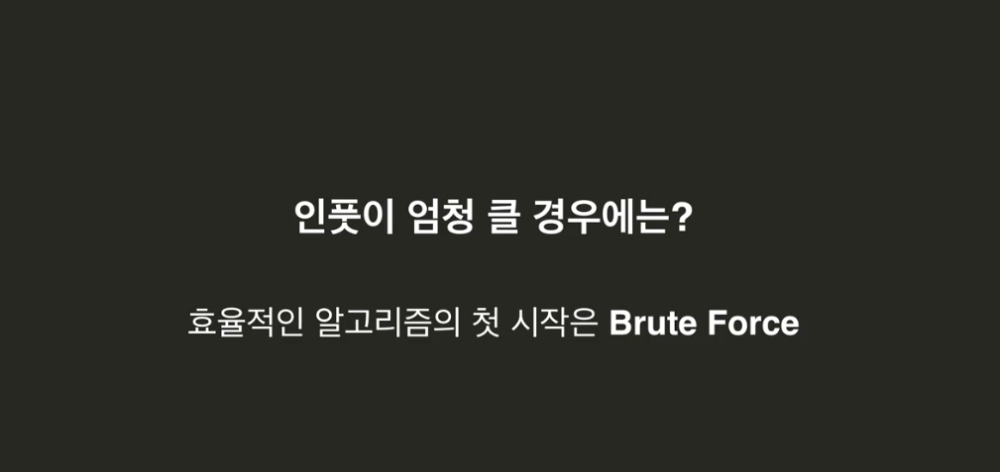

# Brute Force

- #### 알고리즘 패러다임

  다양한 문제를 풀다 보면, 다양한 문제를 풀기 위한 사고과정이 겹치는 경우가 많음. 접근법이 비슷비슷 한 경우. 

  이렇게 자주 나타나는 알고리즘 접근법들을 묶어서 알고리즘 패러다임 이라고 부름. 

  

  알고리즘 패러다임을 공부하다 보면, 새로운 문제를 봤을 때, 어떤식으로 해쳐나가야 할지 감이 좀 생김. 

  

- #### Brute Force

  암호학에 **Brute-Force Attack(무차별 대입공격)**이라는 것이 있음. 정말 무차별적으로 가능한 모든 방법을 다 시도하는 것을 뜻함. 예를들어 자물쇠를 0000부터 9999까지 다 해보는 거지. 

  고로 Brute-Force는 어떤 문제에 대해서 가능한 모든 경우를 다 시도하는 가장 순진한 알고리즘 접근법. 

  *카드 뭉치 두개에서 서로의 곱이 가장 큰 경우를 찾고 싶다면?*

  가능한 모든 조합을 다 시도하라는 것. 

  

- #### Brute Force 평가

  Brute Force는 올바른 답을 구할 것이라는 확신은 있음. 근데 당연히 비효율적이지. Input이 클수록 더 심해짐. 

  예를 들어, 이세돌 9단을 이길 수 있는 프로그램을 만들려고 한다면? Brute Force가 가능 할까? 이세돌 9단이 먼저 돌을 하나 놨으면, 내가 그 뒤로 모든 경우의수를 다 계산해? 360!이야. 

  

  겨우 첫돌 하나 놓고 나서 계산하는데 아래 숫자 봐봐. 

  

  이건 뭐 슈퍼컴퓨터가 계산해도 이세돌9단은 못이겨. 

  
  