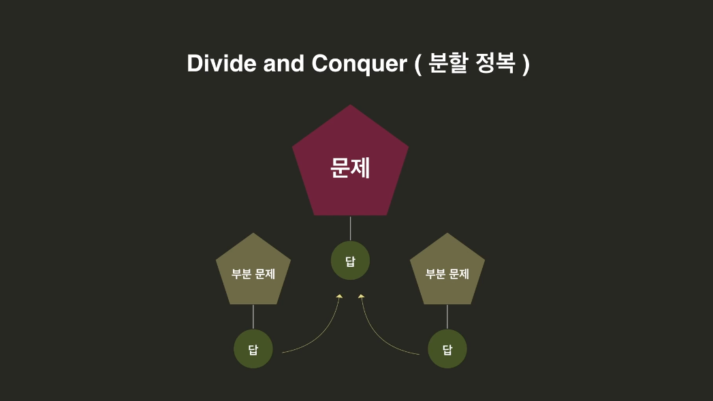
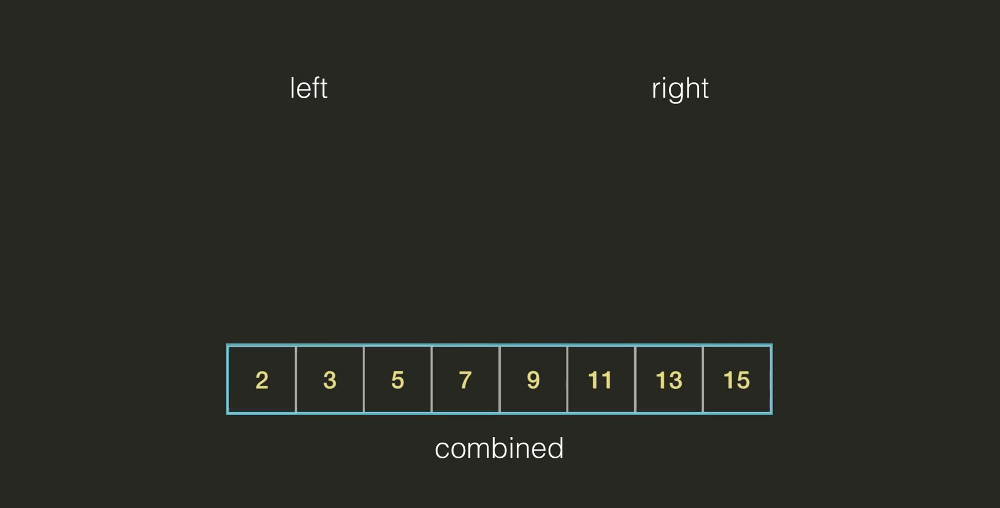
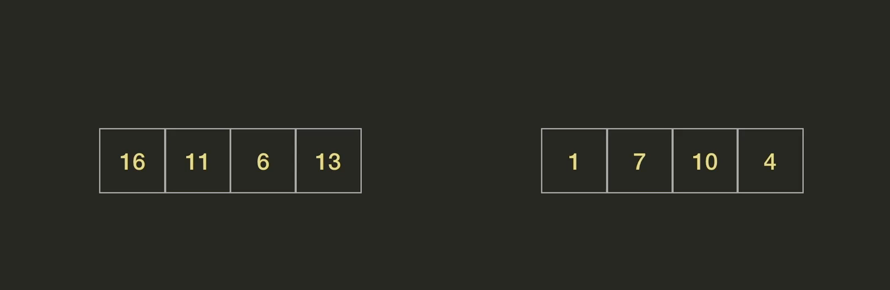
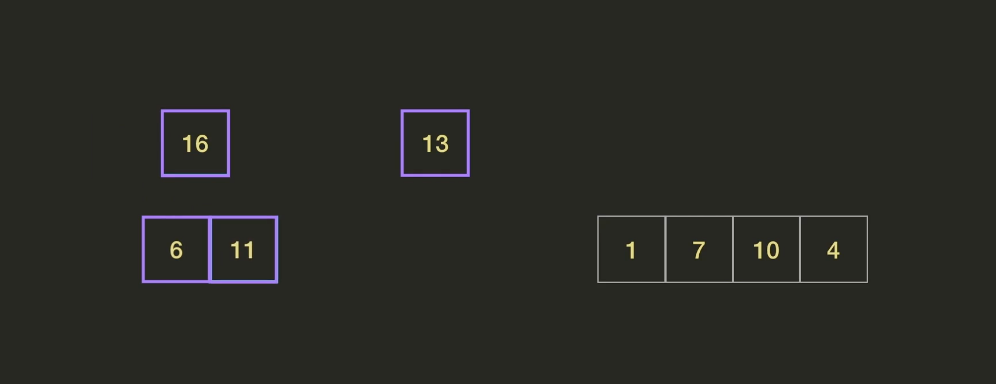

# Divide And Conquer

- #### Divide and Conquer 경고

  Dividde And Conquer(**분할정복**)을 공부하려면 재귀개념에 대해 확실히 알고 있어야 함. 

- #### Divide and Conquer 소개

  어떤 문제가 있는데 답을 바로 알아내기에는 문제가 너무 큰 경우. 그럼 이 문제를 부분문제로 나눠서 해결 하는 것. 각 부분문제를 풀고, 각 부분문제에 대한 솔루션들을 가지고 기존 문제를 해결하는 것. 

  

  예를 들어 어떤 문제를 해결하는 f라는 함수를 만들고 싶다고 해보자. f는 파라미터로 인풋 x를 받는다. 이 문제는 단순하게 해결되지 않기 때문에 divide and conquer를 사용하고 싶다. divide and conquer는 3 단계로 이루어진다. ***1. Divide 2. Conquer 3. Combine*** 

  

  Divide 단계에서는 x를 나눈다. 예를 들어 x1과 x2로 쪼갰다고 해보자. 그러면 conquer단계에서는 부분문제를 해결하기 위해 f(x1)과 f(x2)를 한다. 그렇게 해서 A라는 답과 B라는 답이 나왔다고 해보자. 부분문제를 푼다는 것을 부분문제를 **정복한다**고 표현하는 거지. 그리고 마지막 Combine단계에서는 A와 B를 사용해서 기존문제를 해결하는 f(x)를 계산하면 됨. 

  

  별로 안어려워 보이는데 뭐가 어렵다는 걸까?

  Conquer단계가 말로는 쉽지만, 실제로 동작방식을 생각해 보면 그렇게 간단하지는 않다. 만약 f(x1)과 f(x2)도 답을 딱 알아내기에는 문제가 너무 크면? 그럼 또 f(x1)과 f(x2)도 Divde and Conquer로 다시 풀어야 돼. 그럼 또 x1을 x3, x4로 나눠서 정복해야 함. 그런데, 그 f(x3), f(x4)도 너무 크다면? 또 Divide and Conquer를 해야 돼. 이런식으로 문제가 충분히 작아질 때 까지는 계속해서 문제를 나눠줘야 함. 이 과정이 일어나는 과정이 어려울 수 있다는 것. 

  

  

- #### Divide and Conquer 예시

  1부터 100까지 더하는 문제를 Divide and Conquer방식으로 풀어보자. 

  

  **일단 Divide**

  1~100까지의 합은 1~50까지의 합/51~100까지의 합 두가지로 나눌 수 있음. 두 문제는 1~100문제랑 동일한데 크기만 작아진 것. 

  

  이제 **Conquer** 위의 두 부분문제를 각각 해결하면 1~100의 합을 구할 수 있지. 

  그래서 그걸 가지고 Combine해서 1~100까지의 답을 구하는 거지. 

  

  **개략적으로 위와 같다는건데 그럼 내부적으로 어떻게 된다는 건지 1~8까지로 한번 봐보자.**

  *Divide*

  1~4의 합과 5~8까지의 합으로 나눠보자. 

  *Conquer*

  근데 이걸 구하려면 또 재귀적으로 Divide를 해야돼. 그걸 이제 끝까지 계속 Divide하다 보면, 값이 하나만 있는 애들만 나옴. 이렇게 문제가 충분히 작아진 경우를 **Base Case**라고 함. 이제 그걸 가지고 해결하면서 올라오면 되지. 

  

- #### 합병정렬

  앞에서 선택정렬과 삽입정렬을 봤음. 이번에는 Divide and Conquer를 사용하는 합병정렬을 보자. 

  

  합병정렬의 divide and conquer 적용 단계는 다음과 같다. 

  

  근데 두 리스트를 하나의 리스트로 합병하는게 뭐 어떻게 하라는 거야?

  두개의 정렬된 리스트가 있다고 해보자. 

  그럼 합쳐진 리스트에서 가장 앞에 들어갈 값은 양쪽 리스트의 가장 작은 값 둘중에 하나. 

  그리고, 남은 값중에 또 가장 왼쪽끼리 계속 비교해가면 되는 것. 

  

  

  오른쪽 리스트의 값이 다 끝나고 왼쪽리스트만 남으면 그냥 그거는 그대로 순서대로 붙여 넣으면 끝. 

  

  

- #### 합병정렬 진행과정

  아래 리스트를 정렬하려고 한다. 

  

  일단 Divide 단계. 리스트를 반씩 나눠준다. 

  

  아직도 리스트가 꽤 길어서 재귀적으로 또 나눈다. 

  

  아직도 리스트가 충분히 작지 않다. 리스트를 또 나눈다. 

  

  16과 11 각각의 리스트는 요소 자체가 하나밖에 없기 때문에 이미 정렬이 됬다고 볼 수 있지. -> **즉, 두 부분문제를 정복한 것.** 

  이제 16보다는 11이 크니깐 11, 16순서로 Combind

  

  그럼 이제 6, 13을 정렬하려고 하면 또 Divide 해서 6과 13으로 나눠주지. 그 다음에 부분문제가 됬으니깐 그것을 다시 정렬해 주면 6, 13 순으로 정렬돼.

   

  **그럼 이제 두 부분문제를 정복한 단계.**

  이제 Combine 단계에서 두 리스트를 또 합쳐주면 돼. 각 왼쪽씩 계속 비교하면서 하나씩 빼오면 돼. 

    

   

  그 반대쪽도 마찬가지로 하면 되지. 

  그럼 이제 왼쪽 절반과 오른쪽 절반이 완벽하게 정렬이 된 상태라고 한다면, 

  

  이제 제일 왼쪽꺼씩 보면서 정렬하면 끝. 

  

- #### 퀵 정렬

  Divide and Conquer를 사용하는 또 다른 정렬이 있음. 바로 **퀵 정렬(Quick Sorting)**

  Merge Sort에서는 문제를 작게 작게 나눠서 정렬하고, 마지막에 정렬된 리스트를 합쳤음. 

  

  

  **이 Combine이 꽤 어려웠음.**

  퀵 정렬은 완전히 반대로, Divide에서 대부분의 일을 하고 Combine단계에서는 하는 일이 없음. 

   Divide부터 살펴보자. Divide에서 리스트를 나누는 과정을 **Partition**이라고 부름. 

  Partition은 두 단계가 있음. 첫번째는 리스트에서 **Pivot** 즉 기준점을 정해주는 것. 우리는 그냥 편하게 마지막 값을 Pivot으로 정한다고 해보자. 

   

  두번째 단계는 이 Pivot을 기준으로 값들을 새롭게 배치하는 것. 

  그것을 기준으로 더 작은 값은 모두 왼쪽으로, 더 큰 값은 모두 오른쪽으로 오게 하는 것. 

  

  퀵정렬에서의 Divide는 방금 이 파티션을 하는 과정. 

  그리고, Conquer에서 Pivot 오른쪽에 있는 값들과 왼쪽에 있는 값들을 각각 정렬해 주는 것. 

  그냥 오른쪽 왼쪽을 정렬만 해주면 전체 리스트가 그대로 정렬이 되는 것. 

  

  그냥 Divide랑 Conquer만 거치면 정렬 끝. Combine은 할일이 없네. 

  

- #### 퀵 정렬 진행 과정 

  8개 짜리 리스트를 가지고 퀵 정렬을 해보자. 

  

  일단 파티션을 마지막에 있는 7로 잡아 보자. 

  그리고, 그 양옆으로 배치함. 

  

  오른쪽 왼쪽을 각각 정렬해 주면 됨. 

  왼쪽 먼저 보자면, 또 Divide and Conquer를 해야함. 마지막 4를 피봇으로 정해보자. 

  

  그리고, 4보다 큰 값은 다 4 오른쪽으로 보내고 4보다 작은 값은 4 왼쪽으로 보낸다. 

  이제 오른쪽 왼쪽은 모두 값이 1개 밖에 없어서 정렬할게 없다. 이 값이 1개 밖에 없는 바로 이 경우가 **base case**

  이제 7의 오른쪽을 정렬하면 됨. 

  

  13을 피봇으로 잡는다고 하면 똑같이 이번에도 양쪽으로 정렬시킨다. 

  

  그냥 이렇게 계속 반복하면 되겠지. 

- #### Partition 함수 설명

  퀵 정렬에서 가장 어려운 부분이 Divide 부분. 

  

  

  문제는 이 파티션을 어떻게 구현하느냐임. 

  일단 파라미터 3개를 받음. 

  start와 end는 파티션하려는 범위를 나타냄. 

  

  피봇이 진행되는 동안 전체 리스트는 4가지로 나눠짐. 

  **피봇 기준점, 피봇보다 작다고 판별된 small 그룹, 피봇보다 크다고 판단된 big group, 아직 비교하지 않은 Unkown 그룹.** 

  end의 값을 어차피 피봇으로 사용할 거니깐 p라는 변수에 넣어줌. big group이 시작되는 인덱스를 b, unknown이 시작되는 인덱스(우리가 지금 보고 있는 인덱스)를 i라고 하자. 

  

  시작할때는 i와 b 둘다 가장 왼쪽 인덱스를 가리킨다. 그리고 아직 아무것도 안봤기 때문에 모든 요소들이 Unknown 그룹. 

  

  일단 먼저 i가 가리키고 있는 16과 pivot을 비교한다. big group이네. 그러면 i만 오른쪽으로 한칸 간다. 

  

  그럼 이제 11과 7을 비교한다. 또 big group에 들어간다. 이번에도 I만 오른쪽으로 한칸 간다. 

  

  이제 6과 7을 비교하는데 6은 7보다 작다. 그러면 이제 b가 가리키고 있는 값과 i가 가리키고 있는 값의 자리를 바꾼다. 

  그리고 b와 i를 모두 오른쪽으로 한칸씩 움직인다. 

  

  그럼 이번에는 13은 7보다 크지. i를 오른쪽으로 한칸 이동한다. 

  

  그러면 이제 1과 7을 비교. b와 i의 자리를 바꾼다. 그리고 나서 b와 I를 둘다 한칸씩 오른쪽으로 이동. 

  

  다음 4과 7을 비교. b와 i의 자리를 바꾼다. 그리고 나서 b와 I를 둘다 한칸씩 오른쪽으로 이동. 

  

  마지막 10. i만 오른쪽으로 한칸 이동. 

  이제 i가 p까지 왔으면 b가 가리키는 값과 p가 가리키는 값의 위치 바꾸면 끝. 

  

  

