# Dynamic Programming

Dynamic Programming을 사용하기 위해서는 필요한 조건이 두가지가 있음. 

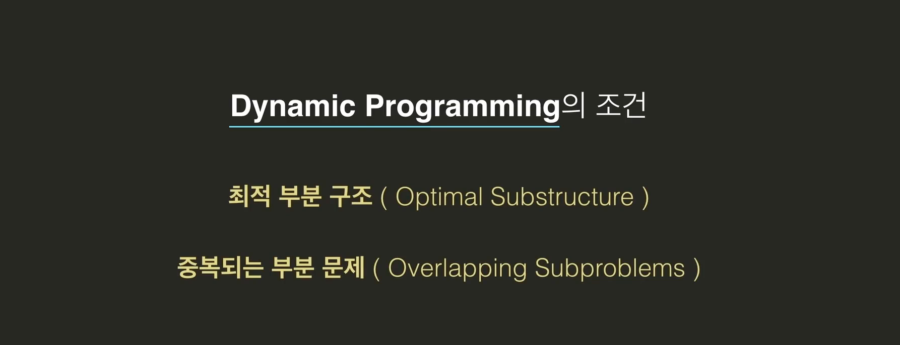

- #### 최적 부분 구조(Optimal Substructure)

  최적 부분구조가 있다는 것은 "**부분 문제들의 최적의 답을 이용해서 기존 문제의 최적의 답을 구할 수 있다는 것**". 

  

  피보나치수의 예시를 보면, *fib(5)*는 *fib(4)*와 *fib(3)*의 부분문제의 답을 구해서 그것을 이용해서 전체의 최적의 답을 찾을 수 있음. 그렇기 때문에 피보나치문제는 **최적부분구조**를 가지고 있는 것. 

  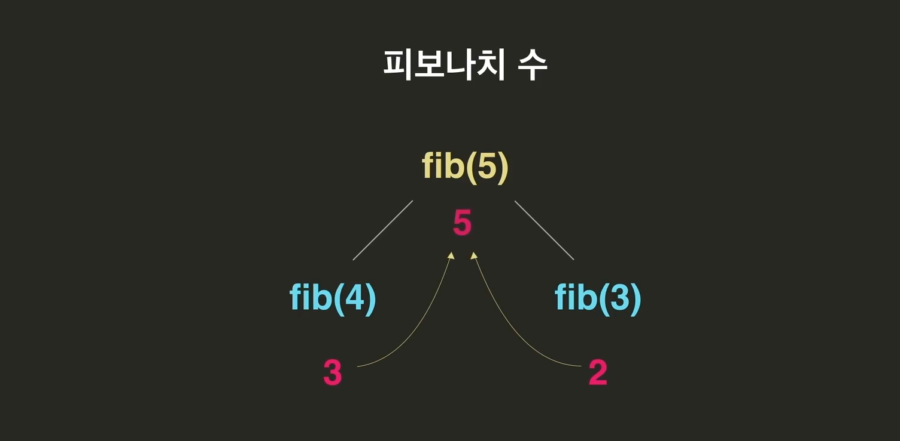

  서울에서 부산으로 가는 다양한 경로가 있는데, 그 중에서 최단경로로 가는 방법을 찾고 싶음. 근데 부산으로 가기 위해서는 무조건 **H, I, J**중에 하나를 거쳐 가야 함.  

  결국 서울에서 부산으로 가는 최단경로문제는 **서울에서 H로 가는 최단경로문제**, **서울에서 I로 가는 최단경로문제**, **서울에서 J로 가는 최단경로문제**를 풀어야 하는 것. 

  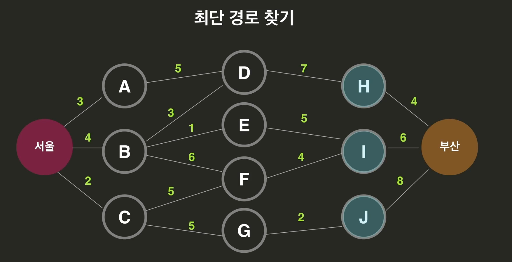

  H까지의 최단거리에 +4, I까지의 최단거리 +6, J까지의 최단거리 +8를 비교해보면 서울부터 부산까지의 최단거리를 알 수 있음. *이번에도 부분문제들의 최적의 답을 이용해서 전체문제의 최적의 답을 구한 것.* 

  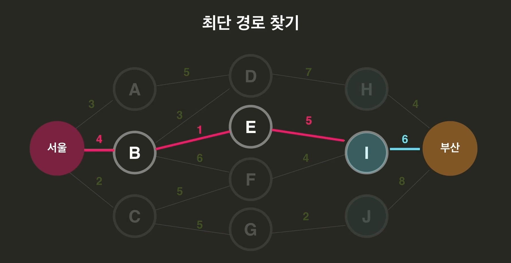

  아까 피보나치 처럼 부분문제의 답을 다 더한 것은 아니여도, 부분문제의 최적의 답을 **이용**해서 전체 문제의 최적의 답을 찾은 것이기 때문에 이 문제도 **최적부분구조**가 있는 것. 

- #### 중복되는 부분 문제(overlapping Subproblems)

  부분문제에서 재귀함수의 개념을 여러번 봤음. 

  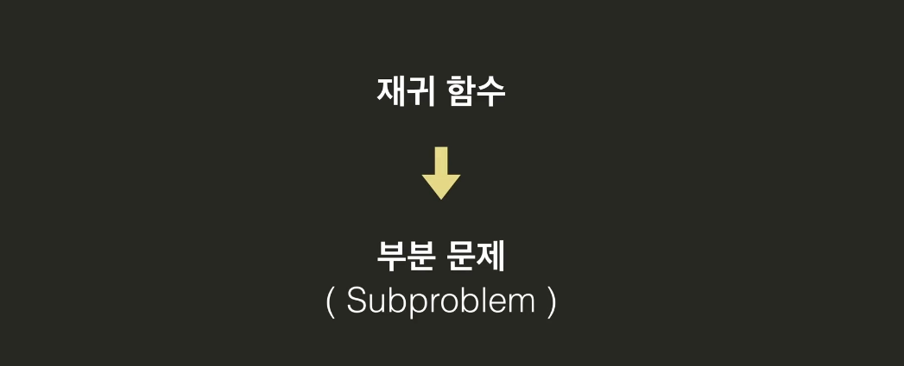*fib(5)*를 해결하기 위해서는 *fib(4)*와 *fib(3)*을 해결해야 함. 근데 *fib(4)*를 해결하기 위해선 *fib(3)*과 *fib(2)*를 해결해야 함. 

  아래가 해결을 위한 부분문제들 나열한 것인데, 잘 보면 중복되는 부분문제들이 있음. 

  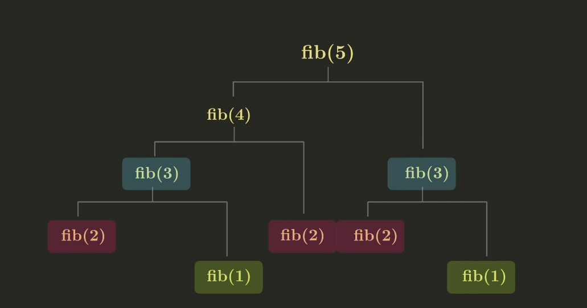

  *fib(7)*을 계산하려고 해도 중복으로 엄청 여러번 나옴.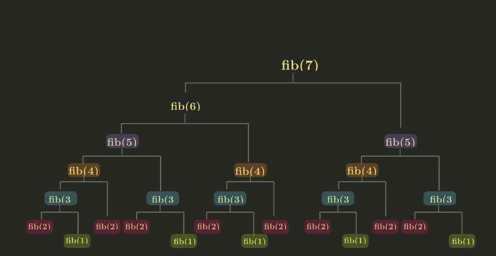

  이런것을 중복되는 부분문제 즉, **Overlapping Subproblem**이라고 부름. 이렇게 중복되는 부분문제를 여러번 계산하는 것은 굉장히 비효율적임. 이걸 해결하는 것이 이번 챕터에서 배울 Dynamic Programming. 

  다만, 문제를 부분문제로 나눈다고 해서 항상 중복되는 부분문제가 있는 것은 아님. 

  예를 들어 합병정렬은 오른쪽 절반과 왼쪽 절반을 해결하는 과정이 완전히 서로 아무 상관도 없음. 서로 겹치는게 없을 가능성이 높음. 즉 이런 경우는 합병되지 않는 부분문제(Non-Overlapping Subproblem)임. 

  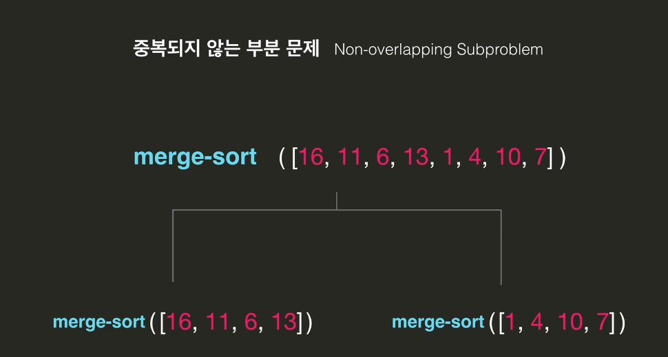

  

- #### Dynamic Programming

  

  이렇게 중복부분문제들이 있는 경우 똑같은 부분문제들을 여러번 풀어야 되는 비효율이 발생함. 이런 비효율을 해결하는 알고리즘이 바로 **Dynamic Programming**임. 

  즉 어떤 문제를 봤을 때, 최적부분구조가 있고 중복되는 부분문제들이 있으면 Dynamic Programming으로 문제를 해결하면 된다. 

  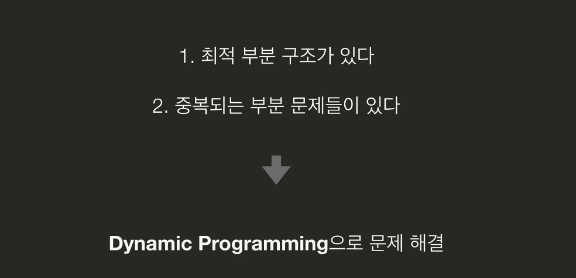

  **Dynamic Programming은 별게 아님. 그냥 한번 계산한 결과를 버리지 않고 재활용하는 방식.**

   

  피보나치 수열 문제로 예를 들자면, 중복되는 문제를 딱 한번씩만 풀자는 것. 

  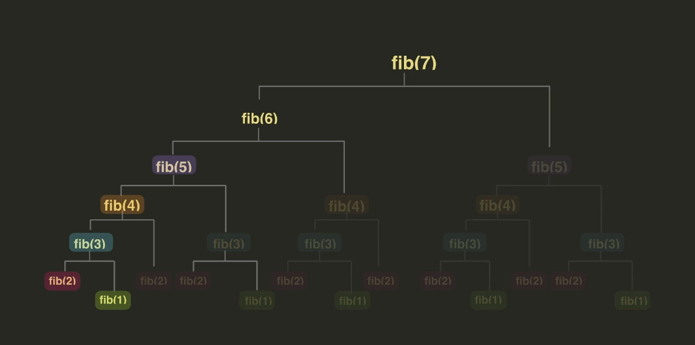

  Dynamic Programming을 구현하는 방식은 두가지로 나뉨. 첫번째는 **Memoization**, 두번째는 **Tabulation**임. 

  

- #### Memoization

  까페 알바를 하는데 아래 3가지를 동시에 시키는 경우가 엄청 많다고 해보자. 

  

  그래서 이 3개의 합을 그냥 계산대 옆에 메모로 붙여 놔. 

  중복되는 계산은 한번만 계산해서 메모해두고 그 다음부터는 그 메모를 참고만 하면 됨. 

  이런 방식을 **Memoization**이라고 부름. 

  

  시작하면서 옆에 파이썬 사전을 만들어 놓고, 한번 계산한 값은 옆에 모두 저장해 놓자. 이렇게 다시 쓸 값들을 저장해 놓는 공간을 **cache**라고 부른다. 

  우리는 각 부분문제를 딱 한번만 풀고, 두번째 나오면서 부터는 다 cache에서 가져다 썼음. 

  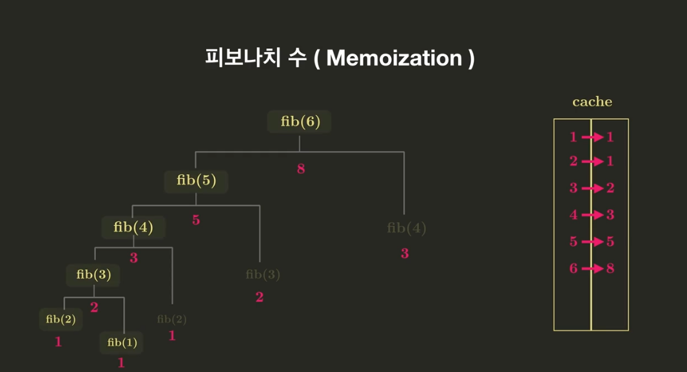

  

- #### Tabulation

  중복되는 부분문제를 사용하기 위해서, **Dynamic Programming**을 배워봤음. 그 중 **Memoization**을 먼저 함. 두번째는 중복되는 것 부터 푸는 **Tabulation**. 

  **Memoization같은 경우는 하향식 접근임.** Fib(6)을 구하기 위해서, fib(5), fib(4)를 구해야 하고, fib(4)를 구하려고 fib(4), fib(3)을 구해야 하고 이런식으로 흘러갔음. 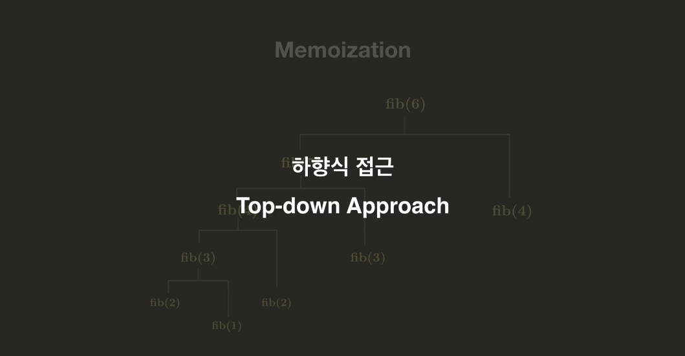 

  이번에는 반대로 **상향식 접근**. 

  

  이렇게 하면 중복되는 계산이 없음. 

  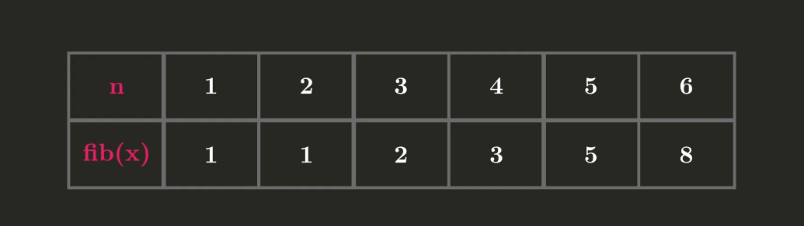

  이렇게 표를 채워가는 느낌임. 표가 영어로 table이라서, 이름이 **tabulation**인 것. 

  

  

- #### Memoization VS Tabulation

  둘 중 하나의 방법만 써야 한다면 뭘 써야 할까?

  공통점은 둘다 중복되는 계산의 비효율을 없애준다는 것. 

  

  가장 핵심적인 차이점이 있다면, Memoization은 일반적으로 재귀함수를 사용하고, Tabulation은 반복문을 사용한다는 것. 

  

  Memoization을 사용하면 stack에 너무 많이 쌓일 수 있음. 결국엔 과부하가 걸려서 오류가 날 수 있음 

  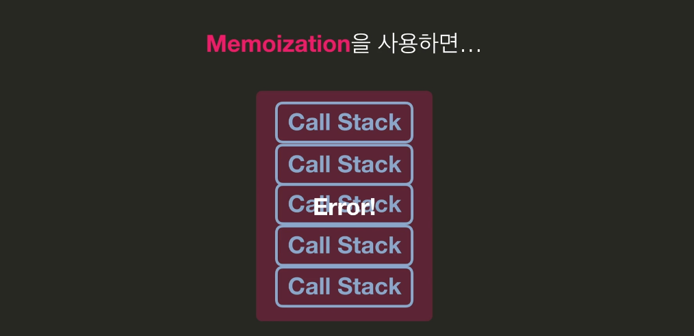

  반면 tabulation을 사용하면 반복문을 사용하기 때문에 그럴 위험은 없음. 

  그렇다면, **Memoization의 장점은**?

  Tabulation은 표를 하나씩 채우면서 올라가는 것이기 때문에 n번째 값을 구하기 위해 표를 모두 채워가면서 계산함. 그래서 어쩌면, *중간에 필요 없는 것들까지도 계산할 수 있음*.

  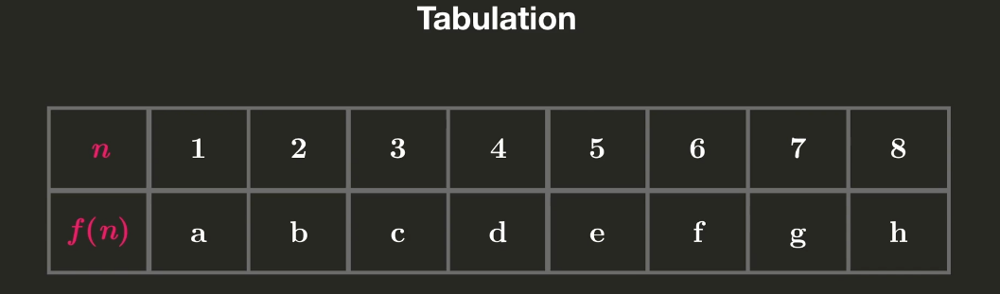 

  그러나 Memoization은 위에서부터 필요한 계산만 딱딱 요구를 하는 개념임. 필요없는 계산은 안해도 된다는 장점이 있음. 

  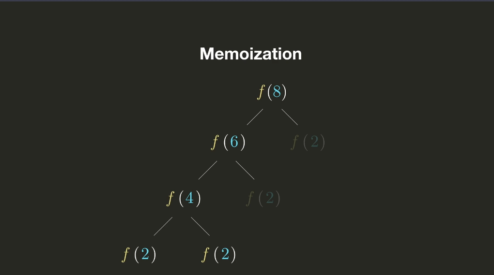

- #### Dynamic Programming 공간 최적화

  

  그런데 아직도 비효율이 조금 있음. 예를 들어, fib(5)를 계산하기 fib(4)아 fib(3)만 알면 됨. 마찬가지로 fib(20)을 계산하기 위해서는 fib(19)와 fib(18)만 알면 됨. 하지만, **우리는 현재까지 계산한 모든 피보나치 값들을 fib_table에 저장하고 있음**. 

  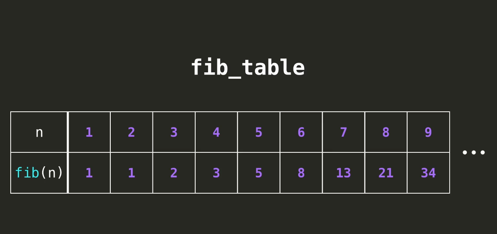

  이걸 더 효율적으로 하려면, 리스트 대신 가장 최근값들을 저장하는 변수 두개만 사용하면 됨. 

  아래의 두 값을 가지고 update해가면 끝이지. 

  

  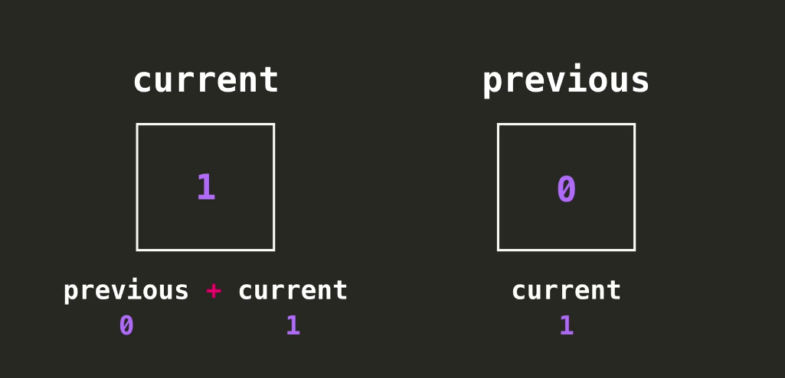

  이런식으로 계속 current = previous+current, previous = current 해나가면 원하는 피보나치 값을 찾아갈 수 있겠지. 

  

  