# Data Structure 1 

## 자료 구조란?

- 자료 구조란?

  자료구조란 우리가 데이터를 저장하고 관리하기 위해 사용하는 구조를 의미한다. 

  예를 들어 도서관에서 로미오와 줄리엣 이라는 책을 찾고 싶다면? 카테고리를 찾아가서, 가나다순으로 찾아 가야지. 중요한건 도서관에서 우리가 이렇게 로미오와 줄리엣을 찾을 수 있는 것은 이미 그 책이 일정한 구조 속에 있었기 때문. 

  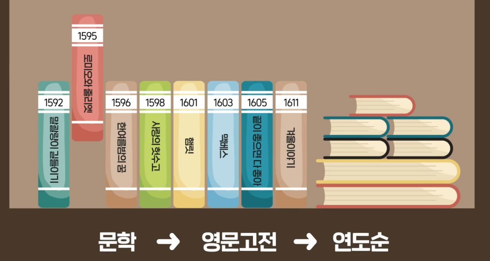

  이러한 구조가 유지되는 이유는 약속을 정하고, 그 약속대로 책을 정리하는 사서들이 있기 때문. 이 약속들 덕분에 누구나 쉽게 찾을 수 있는 것. 

  컴퓨터에 데이터를 정리할 때도, 도서관에 책을 정리하는 것처럼 일정한 구조에 맞게 저장을 함. 컴퓨터 과학에서는 이런 구조를 자료구조 라고 부른다. 

  

  프로그래밍을 하다 보면, 다양한 데이터를 다루게 됨. 어떤 데이터든 저장하고, 저장한 내용을 가지고 올 수 있어야 함. 데이터를 쉽게 찾기 위해서는 구조가 필요하다. 자료 구조에서는 데이터를 관리하는 다양한 방식을 배우고, 여러 상황에서 가장 적합한 구조를 고르는 방법을 배울 것. 


- #### 상황에 맞는 자료 구조

  본격적으로 자료 구조를 배우기 전에, 적합한 자료 구조를 고르지 못했을때의 비효율에 대해 알아보자. 

  사실 리스트와 세트는 자료 구조 이름은 아니다. 그냥 파이썬 자료형이 이름. 중요한 것은 두 가지가 서로 다른 구조/방식을 이용해서 자료를 저장한다는 것. 

  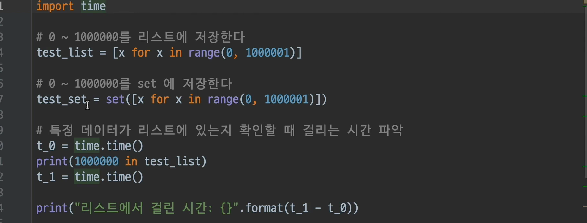

  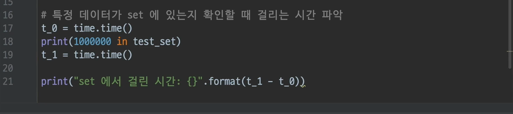

  time을 이용해서, 두가지가 같은 동작을 하는데 시간이 얼마나 차이나는지를 체크해봄. 

  실행해보면, 세트에 포함된 정수를 찾는 것이 리스트에서 찾는 것보다 훨씬 빠름. 3000배 더 걸려. 

  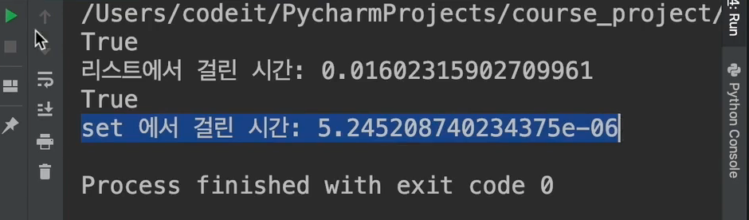

  이게 엄청 큰 차이. 

  방금 본 예시에서는 set를 쓰는게 리스트를 쓰는 것보다 더 효율적이였음. 그렇다고 해서 당연히 항상 좋은 것은 아님. 각 자료구조마다 장/단점이 있다. 

  **자료구조를 공부해야 어떤 자료구조들이 존재하고, 어떤 상황에 뭘 써야 하는지를 알 수 있다.**

   

## 컴퓨터가 데이터를 저장하는 법

- #### 스토리지 vs 메모리

  자료구조의 목적은 말그대로 **자료를 구조화 해서 데이터를 효율적으로 사용하는 것.**

  

  자료 구조를 배우려면, 컴퓨터에 데이터가 어떻게 저장되는지에 대한 최소한의  지식이 필요함. 

  **컴퓨터는 데이터를 크게 두 곳에 저장한다. 스토리지와 메모리.**

   

  스토리지는 데이터가 영구적으로 저장되는 곳. 우리가 컴퓨터에 저장하는 음악/사진/영화 등. 스토리지에 있는 데이터는 사용자가 직접 지우거나, 컴퓨터에 심각한 외부 충격이 있지 않은 이상은 영원히 저장됨. 

  

  

  스토리지는 영원히/많이 저장할 수 있는 대신, 데이터를 저장하는데도 오래 걸리고, 데이터를 받아오는데도 오래 걸린다. 

  약간 창고 같은 느낌임. 당장 필요한게 아니라, 나중에 두고두고 사용할 것들을 저장함. 

  **정확히 언제 사용할지 모르겠는 파일들을 저장한다.** 

  

  메모리는? 데이터를 임시로 저장하는 곳. 

  워드로 과제를 하고 있는데, 아직 저장 안눌렀다면? 메모리에 임시적으로 저장된 것. 

  컴퓨터 꺼지면, 작업중이였던 내용 다 날라감. 쓰다가 저장을 눌렀다면, **메모리에서 스토리지로 복사되는 거지.** 

  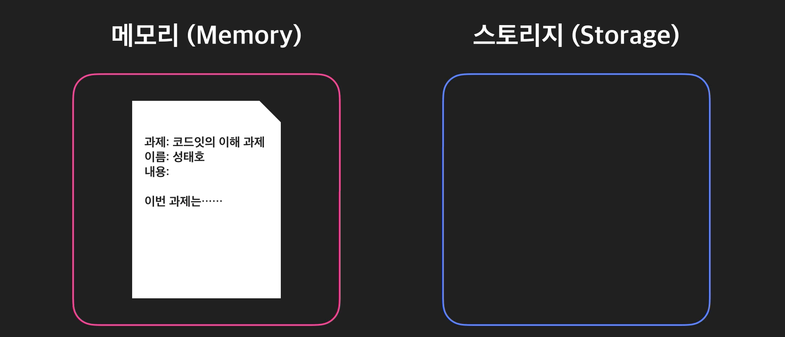

  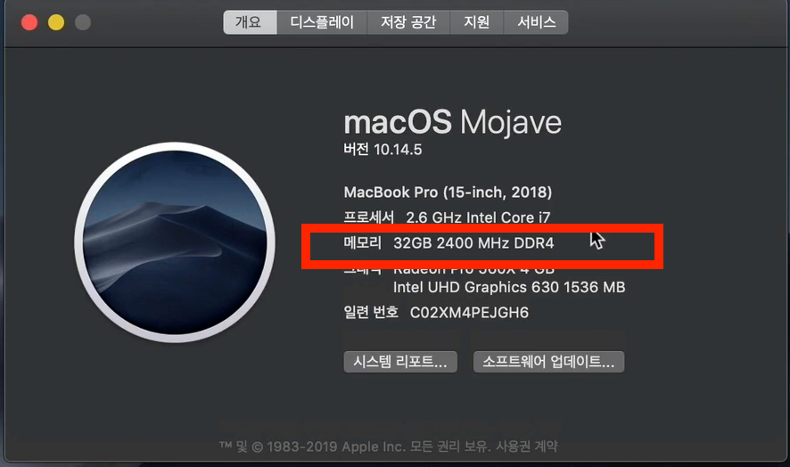

  보통은 컴퓨터의 스토리지 용량이 메모리 용량보다 큼. 작은 대신 메모리는 데이터를 저장하는 것과 가지고 오는 것을 엄청 빠르게 할 수 있음. 메모리는 책상 서랍 정도. 창고에 비해서 크기는 작지만, 물건을 빨리 가져올 수 있도록, 손 닿는 곳에 딱 있는 느낌. 그래서 메모리는 오래 보관하는 데이터가 아닌, 지금 당장 사용해야 하는 데이터를 저장함. 

  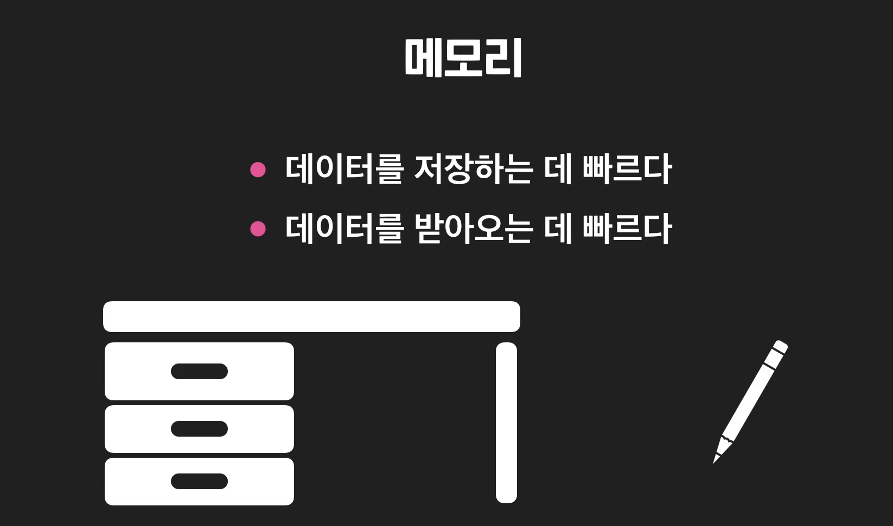

  근데 뭔지는 알겠는데, 왜 두가지가 다 필요한 걸까?

  *컴퓨터로 영화를 본다고 해보자.*

  영화는 스토리지에 저장되 있겠지. 근데, 영화를 본다는 것은 스토리지에서 한장면 한장면씩 빼오는 것.  이 한 장면 장면을 실시간으로 스토리지에서 뽑아 오면? 스토리지는 데이터를 가지고 오는데 시간이 오래걸림. 그러니깐, 이런식으로 가져오면 영화가 계속 끊길 수 밖에 없음. 스토리지의 이런 단점을 해결해 주는 것이 메모리. 영화를 키면 스토리지에 있던 영화를 메모리로 복사한다. 메모리는 받아오는게 빠르니깐, 쾌적하게 영화를 보게 해줌. 그 대신 영화를 끄면, 메모리에 있던 영화 데이터는 사라지고, 다시 스토리지에만 영화가 있겠지. 

  

  자료구조에서 하는 얘기는 대부분 메모리 얘기. 자료구조는 메모리에서 잘 사용하게 하는 것이 목적. 

- #### RAM : Random Access Memory

  비유를 하자면, 메모리는 일종의 긴 띠라고 볼 수 있음. 일정한 칸으로 나뉘져 있고, 각 칸에는 데이터를 저장할 수 있다. 그리고, 데이터를 찾을 수 있게끔, 각 칸은 자신만의 주소가 있다. 

  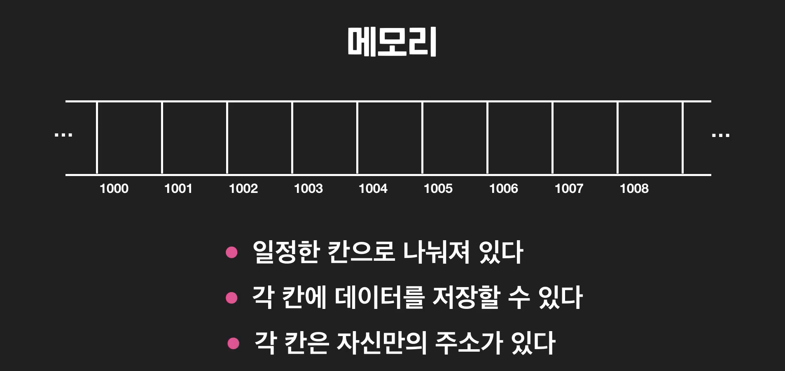

  예를 들어 아래와 같은 코드를 썻다면, 메모리 어딘가에 95를 저장하고 어딘가에 True를 저장했겠지. 

  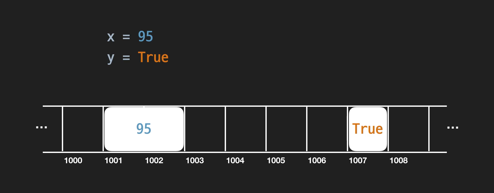

  그럼 어딘가 저장되어 있는 곳에서 컴퓨터는 어떻게 이 값들을 받아오게 될까?

  ram은 임의접근메모리라는 뜻. 임의 접근이라는 뜻은 저장 위치를 알면 접근할 때, 항상 일정한 시간이 걸린다는 뜻. 램은 데이터가 95라는 주소에 있던, 193이라는 주소에 있던, 152581이라는 주소에 있던, 다 한번에 찾을 수 있다는 뜻. 

  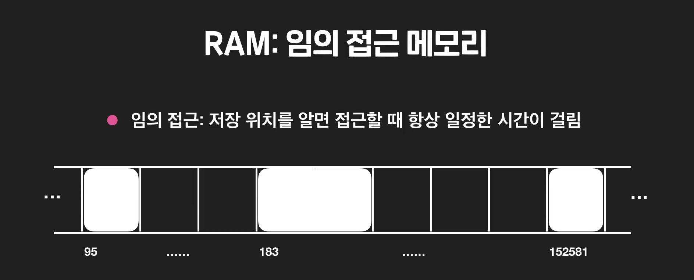

  시간복잡도로 얘기하자면 O(1)인 거지. 

  이게 사실 엄청 대단한거야. 비디오테이프였으면, 1시간 20분을 찾으려면 현재 위치부터 1시간 20분까지 테이프를 돌려야 되잖아. 이런 비디오테이프 같은 것을 순차접근이라고 하는데, 순차접근이면 저장된 위치까지 가는데 한 단계씩 거쳐야 하기 때문에 멀리까지 가려면 더 많은 시간을 써야 함. 

  

  근데 임의접근을 하면 주소와 상관없이 항상 일정하게 갈 수 있음. 

  **자료구조를 공부하면, 메모리에 데이터를 저장하고 찾고 이런 얘기를 계속 하게 되는데, 메모리는 임의접근으로 동작한다는것을 항상 기억하고 있어야 한다.** 

- #### 메모리의 기본 단위 : 바이트

  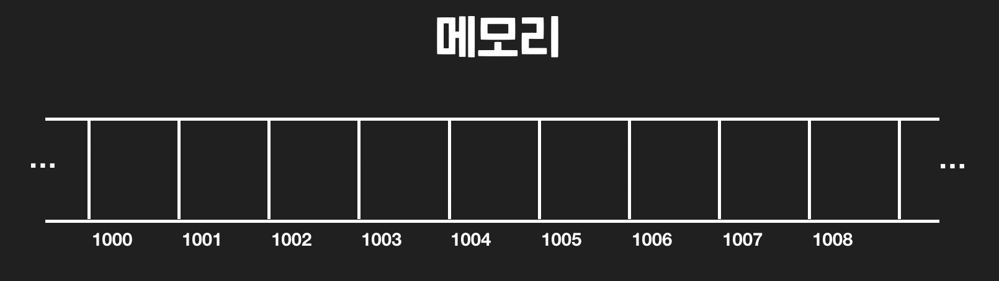

  메모리는 하나의 긴 띠라고도 표현했는데요. 이 띠는

  1. 일정한 칸으로 나눠져 있고
  2. 각 칸에 데이터를 저장할 수 있고
  3. 각 칸은 자신만의 주소가 있습니다

  이 메모리 한 칸이 저장할 수 있는 가장 기본적인 용량의 단위는 **바이트**, 영어로는 **byte**입니다. 자료 구조를 공부하면서 바이트라는 단위가 정확히 얼만큼의 정보를 저장하는 단위인지는 모르셔도 됩니다. 그냥 엄청 작은 단위라고만 알고 계시면 됩니다.

  바이트가 아닌 다른 크기의 용량을 담는 저장 장치들도 있긴 한데요. 대부분의 현대 컴퓨터 시스템들은 메모리 한 칸에 바이트만큼의 데이터를 저장합니다.

  일상 생활 속에서도 많은 분들께서 이미 바이트라는 용어를 들어보셨을 텐데요. 흔히 영상, 문서, 음성 파일이나, RAM 또는 컴퓨터의 스토리지의 크기를 표현할 때,

  - 160 킬로 바이트(kB)
  - 10 메가 바이트(MB)
  - 32 기가 바이트(GB)

  이런 식으로 많이 표현하는데요. 킬로 바이트, 메가 바이트, 기가 바이트는 그냥 데이터의 용량이 몇 바이트인지 표현한 겁니다. 정확히 얘기하자면,

  - 킬로 바이트 = 1,000 바이트
  - 메가 바이트 = 1,000,000 바이트
  - 기가 바이트 = 1,000,000,000 바이트

  이만큼의 저장 공간 용량들이죠.

  자료 구조를 배우면서 바이트나 다른 저장 공간 단위들을 심도 있게 다루지는 않을 건데요. 그래도 자료 구조에서는 이해하면 도움이 되는 개념/용어이니까,

  1. 바이트는 컴퓨터 저장 공간 용량을 나태내는 단위다.
  2. 메모리 한 칸에 담기는 데이터 용량은 1 바이트다.

  이 정도는 이해하고 넘어가시면 나중에 나오는 내용을 이해하는 데 조금 더 수월할 거예요!


- #### 레퍼런스

  사실 x=95를 저장했다고, **x는 95다** 라고 말하면 틀린 표현에 가까움. 왜냐면, x는 95라는 값 자체를 들고 있는 것이 아니라, 95라는 값이 저장된 주소를 가지고 있을 뿐이기 때문. 이 주소값을 이용해서 정수값 95라는 값을 찾아오는 것일 뿐임. 

  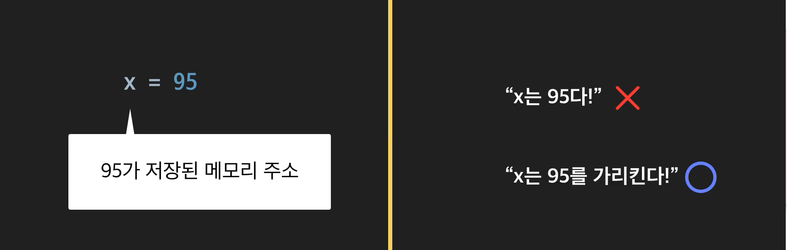

  이렇게 데이터에 접근하게 해주는 값을 레퍼런스 라고 함. 레퍼런스랑 주소는 또 살짝 다름. 주소는 메모리의 진짜 그 실질적인 주소를 나타내고, 레퍼런스는 살짝 추상적인 개념인데, **데이터에 접근할 수 있게 해주는 값을 포괄적으로 나타냄.** x =95같은거는 주소 자체가 레퍼런스 이기도 함. 근데 항상 그런 것은 아님. 

  그런데 사실 자료구조를 공부할때는 두 가지를 그냥 동일하다고 생각해도 아무 문제가 없음.  

  

  근데 변수에 레퍼런스가 들어 있으면, x+5하면, 주소값이랑 5를 더하는 거냐?

  당연히 아니지. 실제로 값을 사용할때는 파이썬이 저장된 값을 알아서 받아오는 것. 파이썬이 이런 과정을 다 추상화해놓고 해주기 때문에, 우리가 x가 95라고 착각하는 거야. 

  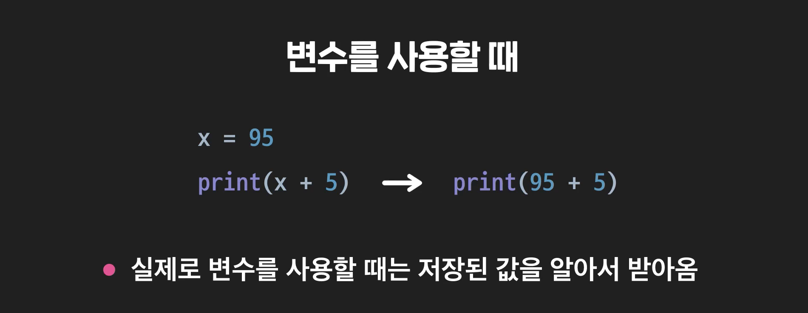


- #### 데이터의 주소

  **파이썬 id 함수**

  데이터가 저장되어 있는 주소를 알아내는 방법을 볼게요.

  `id` 함수를 이용하면 저장한 데이터의 메모리 주소를 정수로 표현한 값을 알아낼 수 있습니다. 여러 타입의 데이터를 저장하고 `id` 함수를 써서 메모리 주소를 출력시켜보겠습니다.

  ```python
  # 여러 데이터를 저장한다
  list1 = [1, 2]
  int1 = 0
  float1 = 3.14
  set1 = set()
  tuple1 = (2, 3)
      
  # 저장한 데이터의 메모리 저장 위치를 받아온다
  print(id(list1))
  print(id(int1))
  print(id(float1))
  print(id(set1))
  print(id(tuple1))
  
  
  140237662138184
  4450309504
  140237661913472
  140237664406888
  140237662993992
  ```

  데이터가 각각 다른 메모리 주소에 저장돼 있군요.

  주소는 코드를 돌릴 때마다 다르게 나오니까 여러분 컴퓨터에 다르게 출력되어도 놀라지 마세요!

  **같은 주소에 저장돼 있는 데이터**

  좀 당연한 말같이 들리실 수도 있는데요. 똑같은 주소에 저장돼 있는 데이터는 똑같은 데이터입니다.

  ```python
  # 리스트를 정의한다
  list1 = [1, 2]
  list3 = [1, 2, 3]
      
  # Aliasing을 통해 list1과 list2를 같게 한다
  list2 = list1
      
  # 두 데이터의 메모리를 출력한다
  print(id(list1))  # 140657629409160
  print(id(list2))  # 140657629409160
  print(id(list3))  # 140657629409096
  ```

  위 코드를 살펴봅시다. 세 변수 `list1`, `list2`, `list3`를 만들었습니다.

  `list1`은 정수 `1`, `2`를, 그리고 `list3`은 `1`, `2`, `3`을 담고 있는 리스트입니다.

  그리고 `list2`에  `list1`를 지정했습니다. 메모리에서 만든 하나의 같은 리스트를 `list1`, `list2`라는 두 개의 다른 변수가 가리키고 있는 거죠. 이렇게 여러 변수가 같은 메모리를 가리키는 것을 **Aliasing**이라고 합니다.

  `id` 함수를 써서 `list1`과 `list2`의 메모리 주소를 출력해 보면 같다고 나오죠? `list3`는 다른 주소에 저장되어 있습니다. `list1`과 `list2`는 서로 같은 리스트를 가리키고 있기 때문에 똑같은 메모리가 출력되고, `list3`는 전혀 다른 리스트를 가리키고 있기 때문에 다른 메모리가 출력되는 거죠.


## 배열(Array)

- #### 배열이란 

  (*사실 파이썬도 배열이 있고, C언어의 배열과 똑같음*)

  파이썬은 C언어를 기본으로 만들어 졌음. 파이썬 리스트는 C의 배열을 이용해서 만들어 졌음. 

  

  그런데, 파이썬 리스트와 C의 배열은 몇가지의 핵심적인 차이가 있음. 파이썬의 리스트는 append를 써서, 계속해서 리스트의 길이를 늘려갈 수 있음. 그러나, 

  1. C의 배열은 처음에 크기를 고정시켜놓고 시작함. 
  2. 그리고 배열의 각 요소를 다른 값으로 수정할 수는 있지만, 지우거나 삭제할 수는 없음. 
  3. 또한, C배열에서는 다 똑같은 값들만 담을 수 있다. 

  

  실제 쓰는 것을 보면, 정수 4개를 저장한다고 먼저 만들어. 이렇게 하면 배열이 쓸 공간을 미리 예약하는 것. C에서는 보통 정수 하나가 4바이트 이기 때문에, 총 16바이트를 예약한다. **연속적인 16칸을 예약한다.**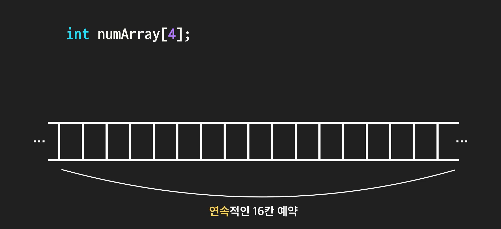

  사용할 메모리 공간을 정했으면, 채워넣는다. 각각 4칸씩 총 16칸을 차지하게 되는거지. 

  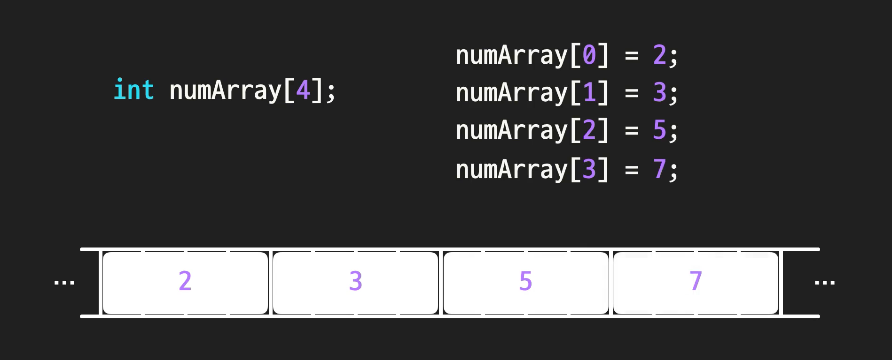

  그럼 파이썬 리스트는 어떻게 다를까? C의 경우는 2, 3, 5, 7이 메모리에 연속적으로 저장되었음. 파이썬 리스트는 좀 다른게 이 2, 3, 5, 7이 아예 서로 다른 곳에 저장되어 있을 수도 있음. 연속적인 공간에 있을 수도 있고, 아닐 수도 있음. 그리고, 이 공간에는 이 값들에 대한 레퍼런스 4개가 저장되어 있는 것. 이 칸들은 2, 3, 5, 7을 담고 있는게 아니라, 2, 3, 5, 7을 가리키고 있다. 

  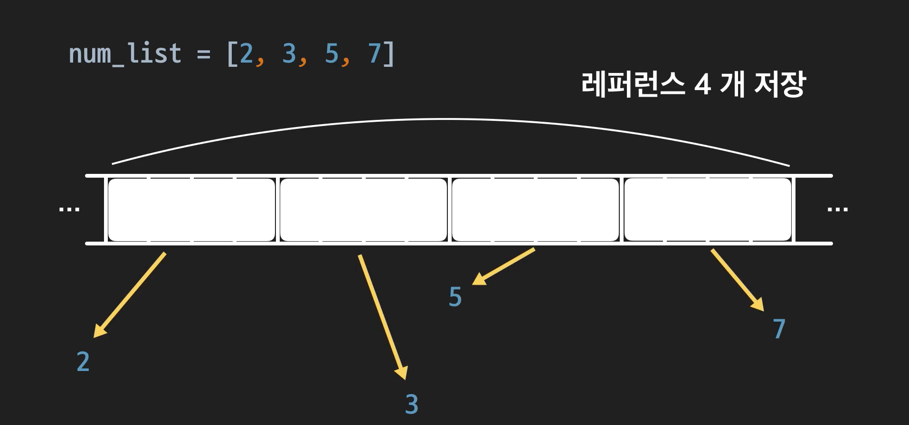

  어차피 값 자체를 여기다가 저장하는게 아니고, 레퍼런스만 저장하는 거기 때문에, 자료들의 크기가 일단 상관이 없어. 아무리 큰 값이여도 어차피 주소만 들어 있음. 그래서, 다양한 타입의 값들이 저장이 가능한 것. 

  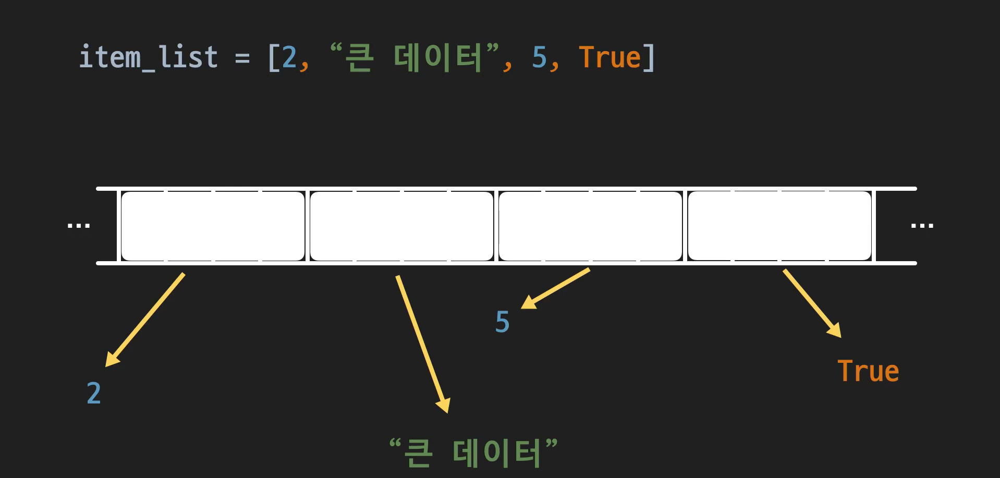

  가장 간단한 자료구조인 배열을 제대로 알아야 다른 자료구조도 제대로 공부할 수 있다. 


- #### 배열 인덱스를 이용한 데이터 저장/접근법

  C언어로 살펴봐보자. 정수 4개를 담는 배열을 셋팅함. 그러면 총 16바이트를 할당해야지. 그러면 일단 컴퓨터는 메모리에서 현재 사용하지 않는 공간 중, 16바이트만큼의 공간을 찾는다.

  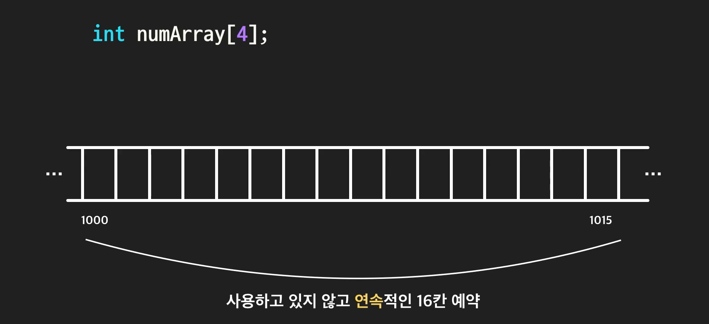 

  이 배열에 값들을 저장하고 싶다. 그러면 인덱스로 저장하면 됨. 

  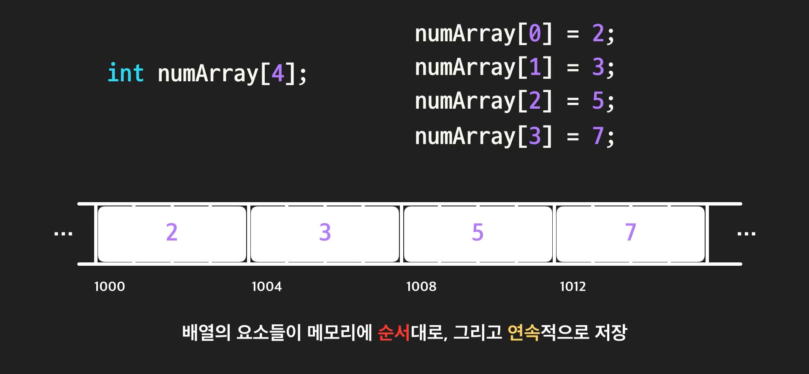

  저장된 데이터를 받아올때는 인덱스를 사용하면 됨. numArray는 이 주소가 시작되는 부분의 주소를 가지고 있음. 배열은 어차피 연속적으로 저장되어 있으니깐, **1000 + 4 * 2 = 1008** 부분부터 시작되는 주소를 찾으면 되겠지. 

  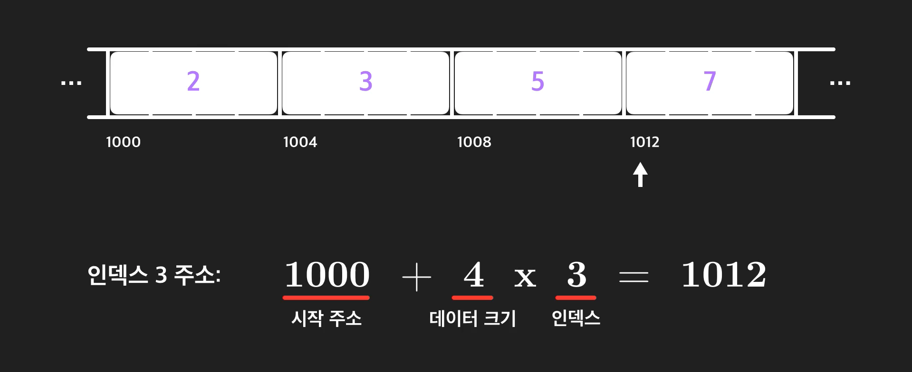

  이 배열이 시작하는 부분의 주소만 알면, 어떤 배열이든 주소를 쉽게 계산할 수 있지. 

  이제 다시 램을 들고와보자. 램은 "**임의 접근 메모리**" 임의접근메모리 라는 것은, 주소와 상관없이 효율적으로 찾아올 수 있는 것. O(1). 이것도 마찬가지지. 그냥 **O(1)**으로 주소를 받아올 수 있지. 

  사실 저장하는 것도 똑같아. 특정 인덱스의 값을 저장할 때, 값을 받아올때랑 똑같이 주소를 찾아서 O(1)으로 접근해서 저장하는 거지. **어떤 인덱스든 접근하는게 O(1)밖에 안걸리는게 배열의 가장 큰 장점임.**

  

  주소만 정확히 알고 있으면, 한번에 접근할 수 있는 램의 특성을 똑똑하게 이용하는 자료구조라고 할 수 있음. 

   

- #### 배열 탐색

  **접근은 인덱스를 주면 찾아오는거고, 탐색은 특정 조건을 만족하는 값을 찾아오는 것을 말한다.** 예를 들면 아래와 같은 경우를 말한다. 

  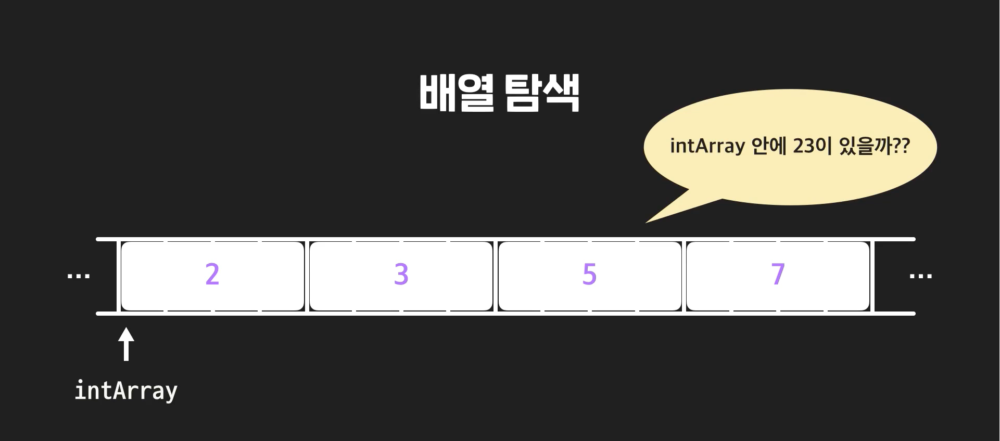

  배열에서 탐색은 접근보다 당연히 비효율적일 수 밖에 없다. 특정 조건을 만족하는 값을 찾기 위해, 하나하나 배열을 다 봐야 하기 때문. 아래처럼 다 봐야되잖아. 아래처럼 순서대로 하나씩 다 찾는 방법은 **선형탐색**이라고 하지. 배열이 특정 순서대로 정리되어 있지 않은 이상 이 방법 이상의 다른 방법은 없음. 

  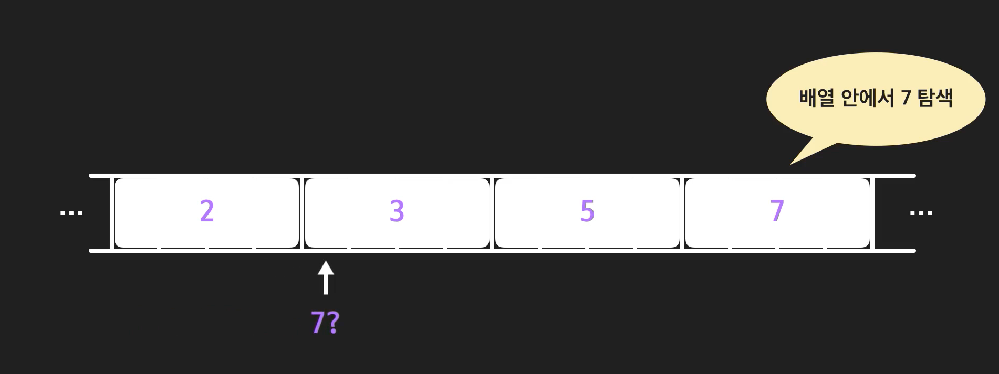

   배열 탐색의 효율성을 시간복잡도로는 어떻게 나타낼 수 있을까?

  운이 진짜 좋으면 0번 인덱스에서 바로 마주칠수도 있고, 운이 나쁘면 값이 아예 배열에 없겠지. 이 경우는 배열에 값이 5개가 있으면, 5개를 봐야 하고, 만개가 있으면 만개를 봐야 하는 것. O(N)이지. 

  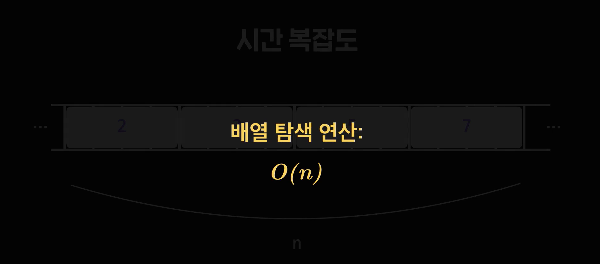

  요약해 보자면, 

  배열은 접근 연산은 아주 효율적이다. O(1)로 끝나지. 하지만, 특정 조건을 만족하는지 찾는 배열탐색 연산은 O(N)이 걸린다. 

  


- #### 정적배열

  사실 배열에는 정적배열과 동적배열이 있음. 차이는 간단함. 

  

  지금까지 봤던거는 정적 배열. 보통은 배열이라고 하면 정적배열을 말하는 거고, 일부러 동적이라는 말을 붙여야 동적배열을 나타내는 것. 앞으로도 배열이라고 말하면, 그냥 정적배열을 말하는 것이다. 

  정수값 5개를 저장할 수 있는 배열을 만들고, 5개를 담았다고 해보자. 

  근데, 여기서 13을 추가하고 싶다면? 이미 만들어져있는 배열이 꽉 찼다면, 이제 13을 추가할 수가 없다. 꼭 추가를 해야 하면, 유일한 해결책은 정수값 6개를 담을 수 있는 새로운 배열을 만드는 것. 

  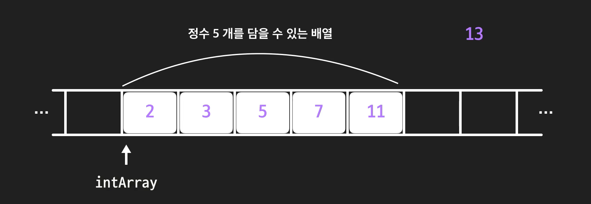

  새롭게 만들려면, 일단 새로운 메모리 공간을 확보하고, 여기에 2, 3, 5, 7, 11을 복사하고, 그 다음에 13을 넣으면 되지. 

  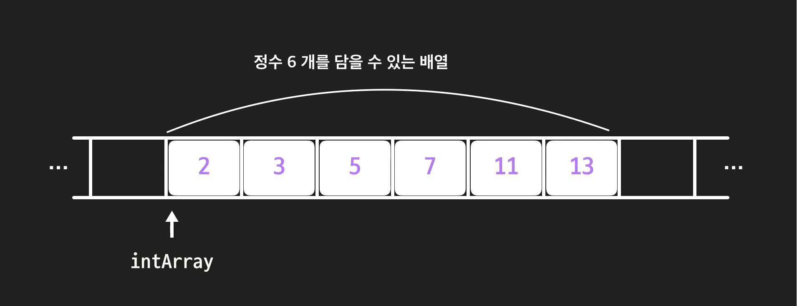

  근데 11 바로 뒤에 그냥 13 넣을거를 갔다가 엄청 불편하네. 이게 왜 안되는 걸까?

  **일단 배열을 정의하면, 메모리에서 쓸 수 있는 공간을 찾아야 함. 저장하려는 데이터의 타입과, 저장하려는 데이터의 갯수에 따라서 얼만큼의 공간이 필요한지가 정해진다. 이 메모리 공간은 쭉 연결된 공간이여야 함. **

  이미 11까지 다 저장된 상태에서 바로 다음 주소에 13을 추가하고 싶은데, 뒤에가 써도 되는 공간인지 자체를 알 수가 없어. 비어있으면 13을 저장해도 문제가 없겠지만, 비어있는지 자체도 알수가 없으니깐 위험한거야. 그래서, 배열은 이 리스크를 방지하는거야. 

  근데 이걸 또 여유롭게 쓰겠다고 처음부터 크게 정의하면?

  **낭비되는 공간이 너무 많아짐.** 

  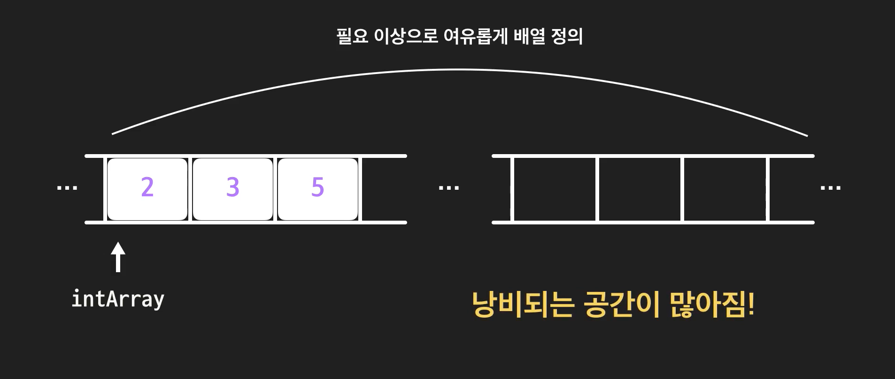

  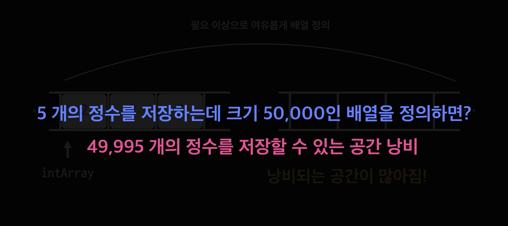


- #### 동적배열(Dynamic Array)

  동적배열은 상황에 맞게 크기가 변한다. 동적배열은 사실 정적배열을 이용해서 만들어 진 것. 이게 동적배열이 아니라, 정적 배열이였으면, 꽉 찼을 때 더 이상 값을 추가할 수가 없음. 

  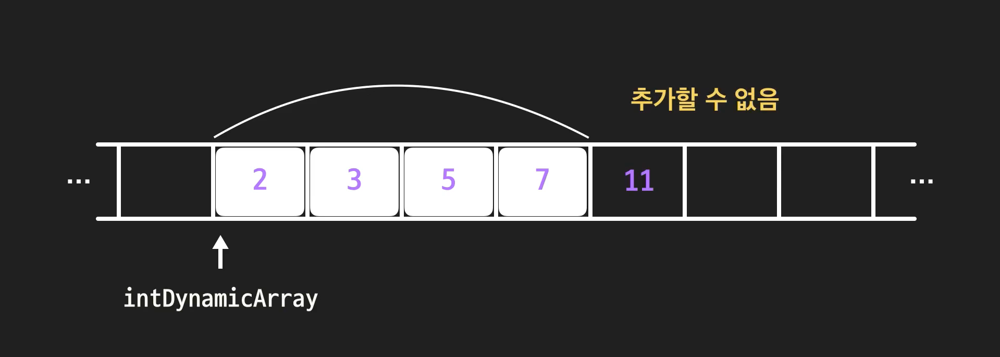

  근데 예약한 공간이 꽉찬거는 마찬가지인데 어떻게 값을 추가하는 걸까?

  1. 더 큰 메모리 공간 확보. 기존에 있던 배열보다 2배로 큰 배열을 만든다. 원래 정수 4개를 담을 수 있는 배열이였으면, 8개를 담을 수 있는 배열을 만든다는 말. 꼭 2배일 필요는 없고 정하기 나름인데, 일단 2배로 커진다고 해보자. 

  2. 기존에 값들을 복사하고, 추가하고 싶은 값을들 넣으면 됨. 어느정도 여유 공간을 확보해 놨기 때문에, 추가하면 됨. 

     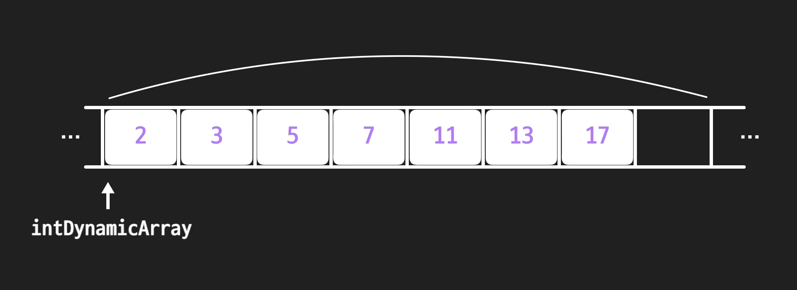

  3. 추가하다가, 또 다시 꽉찼는데 더 추가하고 싶으면 다시 2배 크기의 배열을 만든다. 메모리 공간만 확보 하면, 기존 배열을 복사하고 새 값을 추가하면 됨. 

     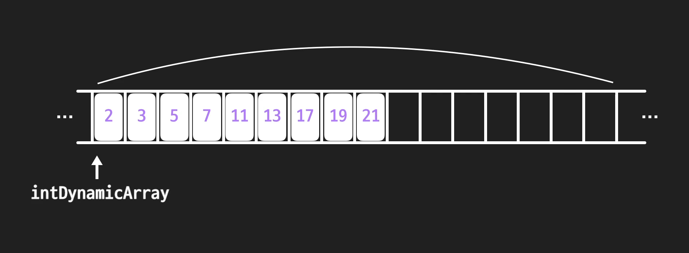

  **즉, 결국은 동적 배열과 결국은 내부적으로 정적 배열을 이용해서 만들어 진 것. 공간이 꽉 찰때마다 알아서 적당한 크기의 더 큰 정적 배열로 늘려주게끔 애초에 구현되어 있는 것.** 기존 배열이 꽉 찼을때 대충 2배 정도씩 늘려주면, 한동안 값들을 새로 추가해도 여유 공간이 조금씩 있지. 

  

  **개발자 입장에서는 배열의 크기에 대해서 신경 쓸 필요가 없기 때문에 굉장히 편하다.**

  

- #### 파이썬 리스트(동적 배열)의 비밀

  사실 우리는 이미 동적 배열을 사용하고 있었는데요. 파이썬 리스트가 바로 동적 배열입니다. C 배열을 이용해서 동적 배열을 구현한 거죠.

  보세요.

  이렇게 5개의 정수 값이 들어간 파이썬 리스트를 만들었습니다. 파이썬 리스트는 동적 배열이기 때문에, 내부적으로는 C 배열이 만들어진 거죠.

  ```python
  int_list = [2, 3, 5, 7, 11]
  ```

  여기에 새로운 값을 추가할 수도 있습니다.

  ```python
  int_list.append(13)
  ```

  우리 입장에서는 내부적으로 얼마나 큰 배열이 있는지 몰라도, 값을 맘대로 추가할 수 있습니다. 동적 배열이기 때문에 상황에 맞게 배열 크기가 조절되고 있는 거죠.

  자 그런데, 우리는 리스트를 사용할 때 현재 내부적으로 사용되고 있는 배열의 크기를 모릅니다. 아무리 저장한 데이터가 6개여도 내부적으로는 8개짜리 배열일 수도 있고, 12개짜리 배열일 수도 있고, 15개짜리 배열일 수도 있고… 알 수가 없습니다.

  그럼 만약 리스트의 길이를 출력하면 뭐가 나올까요? `len` 함수를 쓰면 길이를 알 수 있죠?

  ```python
  print(len(int_list))
  ```

  출력되는 결과를 보면…

  ```
  6
  ```

  `6`이라고 나오는데요. 실제 사용하고 있는 메모리 공간이 더 많을지라도, 파이썬은 개수를 셀 때 값을 저장해 놓은 공간에 대해서만 알려 줍니다. 그래서 우리는 나머지 공간에 대해서 전혀 신경을 안 써도 됩니다.

  오히려 채워지지 않은 공간을 접근하려고 하면…

  ```python
  print(int_list[9])
  ```

  오류가 납니다.

  우리가 미리 값을 저장해 놓은 공간에만 접근할 수 있도록 파이썬이 미리 처리를 해 놓은 겁니다.

  파이썬뿐만 아니라, 동적 배열을 자료형으로 제공하는 대부분의 언어들은 이렇게 실제 사용하는 배열의 크기와 상관없이 저장해 놓은 공간만 사용할 수 있게 처리를 해 줍니다.

  뒤 레슨들에서 이 여유 공간은 항상 빈칸으로 표시할 건데요. 이 공간은 항상 개발자들이 접근할 수 없다고 가정할게요.


- #### 동적 배열 추가 연산 시간 복잡도

  배열에 가장 끝에 새 값을 넣는 것을 영어로는 **append operation**이라고 말한다. 

  동적배열은 내부적으로는 정적 배열을 사용하는데, append operation을 할 때 케이스는 두가지가 있지. 

  

  **경우 1**에서는, 그냥 마지막 칸에 값 추가만 하면 돼. **O(1)**

  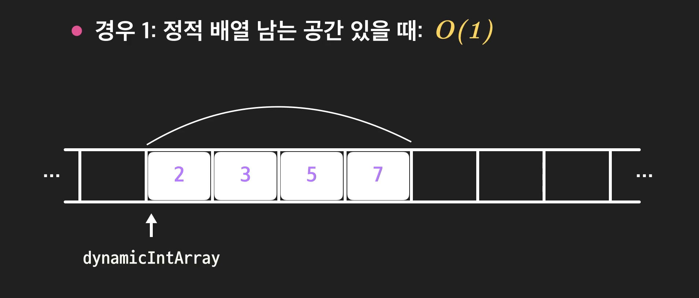

  **경우 2**의 경우는, 일단 2배로 큰 메모리 공간을 예약하고, -> 기존 값들을 새 배열로 복사 -> 새 값을 빈칸에 넣는다. 이 과정을 거쳐야함. 

  그럼 이건 시간이 얼마나 걸릴까? 기존 저장되어 있던 데이터의 갯수를 N이라고 해보자. 기존 N개를 새로운 N개에 복사해야 함. 이거는 일일이 하나씩 해야 한다. 이 복사만 **O(n)**이 걸린다. 그리고, 마지막 새 값 추가하는거 O(1)이니깐, 총 **O(n+1)**이 되겠지. 마지막 1은 무시해도 되니깐, 그냥 O(n)이 걸리는 것. 

  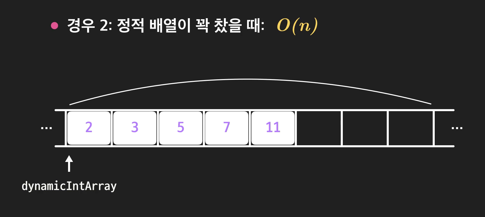

  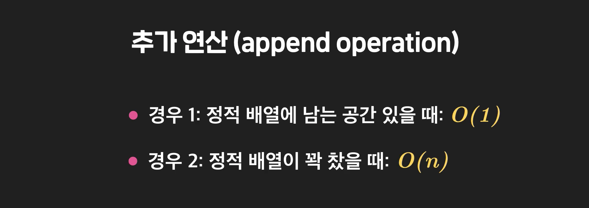

  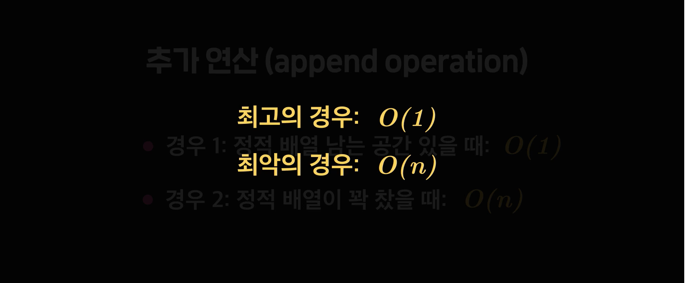

  

- #### 분할 상환 분석 개념

  동적 배열에 값을 추가하는데 걸리는 시간은, 최고의 경우는 O(1), 최악의 경우는 O(N)이 걸린다고 했음. 보수적으로 표현하기 위해서 보통 시간복잡도는 최악의 경우로 얘기 하지. 

  

  근데 O(N)인 경우는 내부 배열이 꽉 차있을때만 얘기하는 거잖아. O(1)인 경우는 빈 공간이 있는 경우잖아. 근데 따지고 보면, 꽉 차있는건 아주 가끔 그러는 거고, 대부분은 약간 비어있는 경우일꺼야. 보통은 최악의 경우로 말하는게 맞긴 한데, 이거는 약간 **비합리적**이잖아. 

  

  이런 상황을 대비해서, 시간 복잡도를 약간 다르게 계산하는 몇가지 방법이 있음. 그중 하나가 **분할상환분석(Amortized Analysis)**이야. 분할상환은 다른게 아니고 그냥 할부라는 뜻이야. 

  

  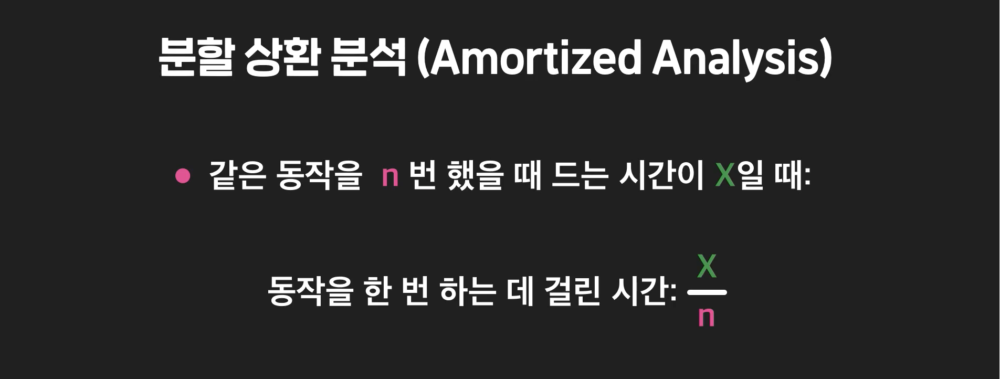

  즉, 분할상환분석은 최악의 경우로 말하는 것이 아니라 평균을 내서 말하는 것. 조금 더 **합리적**일 수 있겠지. 


- #### 분할 상환 분석 적용

  분할 상환 분석은 연산을 n번 했을 때 총 드는 시간 X를 n으로 나눠주는 “할부” 개념이라고 배웠는데요. 최악의 경우로 시간 복잡도를 얘기하는 것이 비합리적인 경우에 사용하죠. 이번 레슨에서는 동적 배열의 추가(append) 연산에 직접 분할 상환 분석을 해 봅시다.

  **동적 배열 동작**

  동적 배열에 추가를 할 때는:

  1. 새로운 인덱스에 데이터를 저장하는 시간
  2. 기존 배열의 크기가 부족해서 더 큰 배열을 만들고, 기존 배열의 데이터들을 옮기는 시간

  이 두 가지를 나눠서 생각하면 편합니다.

  우선 기억을 상기시키기 위해서 동적 배열에 데이터를 추가할 때 일어나는 일들을 쭉 나열해 볼게요.

  비어 있는 동적 배열에 추가 연산을 9번 한다고 가정합시다. 처음 시작할 때 동적 배열은 크기가 1인 배열입니다.

  1. 첫 번째 요소 추가:
     1. 그냥 새로운 데이터를 저장합니다.
  2. 두 번째 요소 추가:
     1. 배열이 꽉 찼습니다. 크기가 2인 배열을 새로 만들고 기존 데이터를 옮겨 저장합니다 (1 개 옮겨 저장)
     2. 맨 뒤 인덱스에 새로운 데이터를 저장합니다.
  3. 세 번째 요소 추가:
     1. 배열이 꽉 찼습니다. 크기가 4인 배열을 새로 만들고 기존 데이터를 옮겨 저장합니다 (2 개 옮겨 저장)
     2. 맨 뒤 인덱스에 새로운 데이터를 저장합니다.
  4. 네 번째 요소 추가
     1. 맨 뒤 인덱스에 새로운 데이터를 저장합니다.
  5. 다섯 번째 요소 추가
     1. 배열이 꽉 찼습니다. 크기가 8인 배열을 새로 만들고 기존 데이터를 옮겨 저장합니다 (4 개 옮겨 저장)
     2. 맨 뒤 인덱스에 새로운 데이터를 저장합니다.
  6. 여섯 번째 요소 추가
     1. 맨 뒤 인덱스에 새로운 데이터를 저장합니다.
  7. 일곱 번째 요소 추가
     1. 맨 뒤 인덱스에 새로운 데이터를 저장합니다.
  8. 여덟 번째 요소 추가
     1. 맨 뒤 인덱스에 새로운 데이터를 저장합니다.
  9. 아홉 번째 요소 추가
     1. 배열이 꽉 찼습니다. 크기가 16인 배열을 새로만들고 기존 데이터를 옮겨 저장합니다 (8 개 옮겨 저장)
     2. 맨 뒤 인덱스에 새로운 데이터를 저장합니다.

  이런 식으로 내부 배열이 꽉 찼을 때는 새로운 배열을 만들고, 기존 요소들을 복사하고, 새로운 요소를 저장하면 됩니다. 그리고 배열에 여유가 있으면 그냥 새로운 요소만 저장하면 되죠?

  **분할 상환 분석**

  분할 상환 분석을 하면 이 동작을 n 번 반복한다고 가정합니다. 총 걸리는 시간을 계산하기 쉽게 두 가지로 나눠서 생각해 볼 거라고 했잖아요?

  1. 새로운 데이터를 동적 배열 맨 끝에 단순히 저장하는 데 걸리는 시간
  2. 더 큰 배열을 만들고 그 배열에 기존의 데이터를 옮기는 데 걸리는 시간

  걸리는 두 시간을 각각 따로 계산해 볼게요.

  **배열 끝에 새로운 데이터 저장하는 데 걸리는 시간**

  먼저 새로운 데이터를 저장하는 데 걸리는 총 시간에 대해서 생각해 봅시다.

  | x 번째 추가 | 배열 끝에 데이터 저장하는 데 걸리는 시간 |
  | ----------- | ---------------------------------------- |
  | 1           | 1                                        |
  | 2           | 1                                        |
  | 3           | 1                                        |
  | 4           | 1                                        |
  | 5           | 1                                        |
  | 6           | 1                                        |
  | 7           | 1                                        |
  | 8           | 1                                        |
  | 9           | 1                                        |
  | …           | 1                                        |
  | n           | 1                                        |

  인덱스에 데이터를 저장하는 데 걸리는 시간은 1이라고 했잖아요? 이걸 총 n 번 하는 거니까 O(n)이 걸리겠죠?

  **새로운 배열에 데이터 옮기는 시간**

  이번에는 내부 배열이 꽉 차서 기존 데이터를 복사하는 데 걸리는 시간에 대해서 생각해 봅시다. 이 부분이 좀 어려우니까 집중해서 보세요.

  | x 번째 추가 | 배열 크기 | 새로운 배열에 요소 옮겨 저장하는 데 걸린 시간 |
  | ----------- | --------- | --------------------------------------------- |
  | 1           | 1         | 0                                             |
  | 2           | 2         | 1                                             |
  | 3           | 4         | 2                                             |
  | 4           | 4         | 0                                             |
  | 5           | 8         | 4                                             |
  | 6           | 8         | 0                                             |
  | 7           | 8         | 0                                             |
  | 8           | 8         | 0                                             |
  | 9           | 16        | 8                                             |
  | …           |           | 0                                             |
  | n           |           |                                               |

  새로운 배열에 기존 데이터를 옮겨 저장하는 시간은 위 표에 나와 있는대로 소요됩니다.

  표를 살펴봅시다. 2 번째, 3 번째, 5 번째, 9 번째 추가 때 배열의 크기를 늘려야 합니다. 그럴 때마다 데이터를 옮겨야 하는데요. 이때 데이터를 각각 1, 2, 4, 8 개씩 복사하고 붙여 넣습니다.

  데이터를 복사해서 붙여 넣는 총 시간 비용은 이 시간들을 더한 8 + 4 + 2 + 1인데요. 좀 더 일반화해서 생각할까요?

  추가 연산을 n 번 했을 때, 가장 마지막에 데이터를 m 개 옮겨서 저장했다고 합시다.

  

  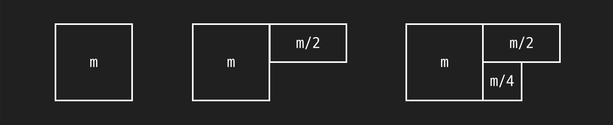

  처음에 이렇게 더해 주다가, 결국에는 이렇게 될 텐데요.

  

  도형에서 볼 수 있듯이 이런 식으로 어느 자연수든 반씩 줄여서 1까지 계속 더해주면 그 결과는 절대 2m을 넘을 수 없습니다. 정확히 말하면 딱 2m - 1이 되죠.

  근데 가장 최근에 데이터를 옮겨 저장할 때 8이 걸렸다는 건 무슨 의미일까요? 원래 배열의 수용 가능 크기가 8이었지만 크기가 부족해서 16개의 데이터를 담을 수 있는 새로운 배열로 복사했다는 얘기인데요. 그럼 결국에 현재 배열 안에 있는 데이터는 9개에서 16개 사이라는 말입니다. 16개보다 더 많은 요소가 있으면 가장 최근에 옮겨 저장한 요소의 수가 8이 아니라 16이겠죠?

  이 사실을 바탕으로 우리가 일반화할 때 사용했던 배열 안 요소 수 n과 가장 최근 옮겨 저장한 요소 수 m의 관계에 대해서 한 가지 사실을 알아낼 수 있는데요.

  가장 최근에 복사하는 데 걸린 시간이 8일 때, 배열 안에 있는 데이터는 9개에서 16개 사이입니다. 즉, m은 무조건 n보다 작다고 할 수 있습니다.

  추가 연산을 연속으로 n*n*번 하고, 가장 마지막에 옮겨 저장한 데이터 요소 수를 m이라고 할 때:

  - 복사해서 저장하는 데 걸리는 총 시간이 2m - 1이고
  - m은 n 보다 작습니다.

  이걸 다시 정리해서 나타내면:

  > 연속으로 추가 연산을 n 번을 하면 데이터를 옮겨서 저장하는 데 걸리는 총 시간은 2n 보다 작다!

  라고 할 수 있습니다.

  **두 경우 합치기**

  지금까지 나온 내용을 종합해 보면, 동적 배열에 n개의 데이터를 연속으로 추가하면:

  1. 새로운 데이터를 저장하는 데에는 n의 시간이 들고,
  2. 데이터를 옮겨 저장하는 데에는 2n보다 적은 시간이 걸리는데요.

  이 두 시간을 합치면 총 드는 시간은 3n보다 적은 시간이 걸리겠죠? 이걸 시간 복잡도로 표현하면 O(3n), 그러니까 O(n)이라고 할 수 있습니다.

  근데 이건 추가 연산을 한 번 하는 게 아니라 연속으로 n 번 하는 데 걸리는 시간 복잡도입니다.

  

  **최악의 경우 분석 vs. 분할 상환 분석 뭘 쓰면 되는 걸까**

  사실 분할 상환 분석을 한다고 꼭 시간 복잡도가 줄어드는 건 아닙니다. 보통은 할부 개념을 적용해도 시간 복잡도가 줄어들지 않죠.

  하지만 만약 최악의 경우보다 분할 상환 분석을 한 시간 복잡도가 더 적다면, 분할 상환 분석을 한 시간 복잡도를 사용합니다. 그러니까 “동적 배열의 끝에 데이터를 추가할 때는 O(1)이 걸린다.”라고 표현해도 된다는 거죠.

  보통은 혼란을 없애기 위해 좀 더 정확하게:

  > 동적 배열의 추가(append) 연산은 최악의 경우 O(n)이 걸리지만, 분할 상환 분석을 하면 O(1)이 걸린다.

  라고 표현할 수 있습니다!


- #### 동적 배열 삽입 연산

  지금까지는 동적배열의 끝에 데이터를 추가하는 방법만 봤음. 이번에는 배열의 아무 위치에나 새로운 데이터를 더하는 방법을 알아보자. 보통 추가, append라고 하면 배열의 끝에 데이터를 넣는 것을 의미하고, 삽입 insertion 이라고 하면 중간이나 어디 원하는 위치에다 데이터를 넣는 것을 의미한다. 

  

  삽입 연산도 마찬가지로, 여유공간이 있을때와 꽉 찼을 때 두가지로 나뉘어짐. 

  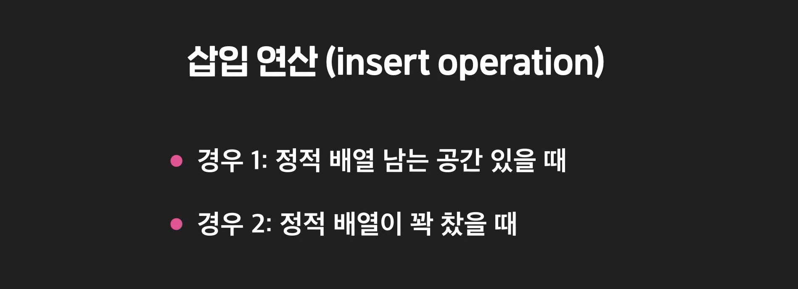

  경우 1부터 봐보자. 

  여기서 인덱스 3에 7을 추가하고 싶다. 이미 연속되서 저장되어 있으니깐, 인덱스 3에 저장하려면 배열에 틈을 벌리고 들어가야 한다. 

  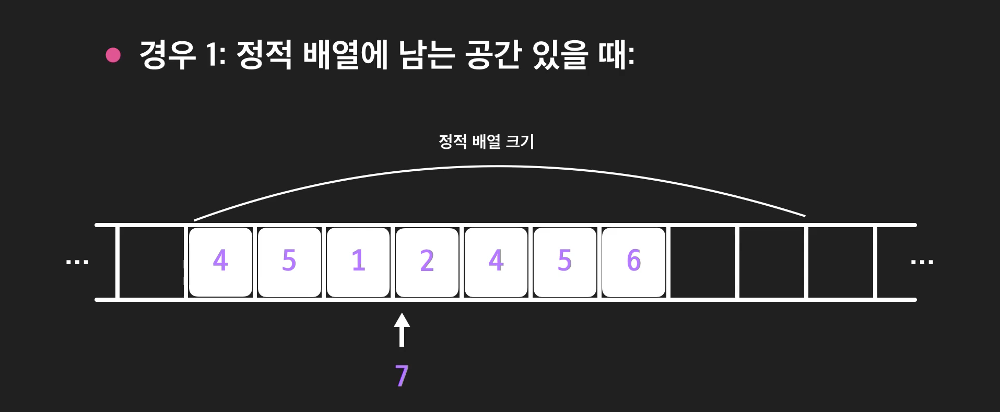

  그럼 인덱스 3 뒤의 모든 요소들을 한 인덱스씩 뒤로 밀어 넣어야 함. 

  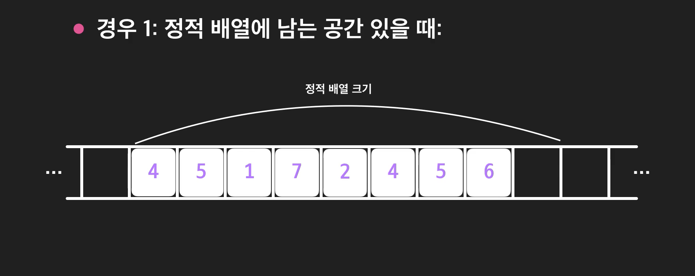

  그럼 시간 복잡도는 어떻게 될까? 여기서의 최악의 경우는 인덱스 0에 삽입할때임. 0번에 틈을 벌려주려면, n개를 일일이 옮겨줘야 함. 그리고, 마지막에 처음에도 넣어야지. 그러면 **O(n+1)**이 됨. 그러면 거기서 1무시하면, **O(n)**이 됨. 

  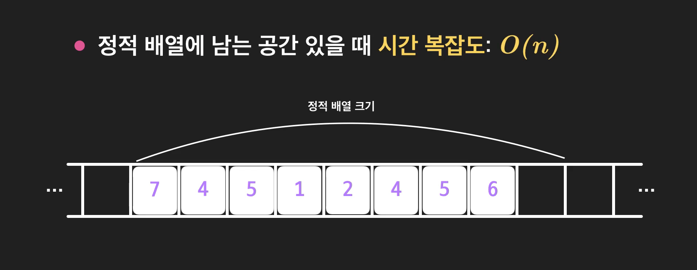

  **그렇다면 배열이 가득 차 있으면 어떻게 될까?**

  일단 공간이 부족하니깐, 10개짜리 배열을 만들어야 겠지. 그리고, 기존 데이터를 복사. 그리고 나서, 이제 위에 수용 공간이 남아 있는 경우를 반복하는 거지. 

  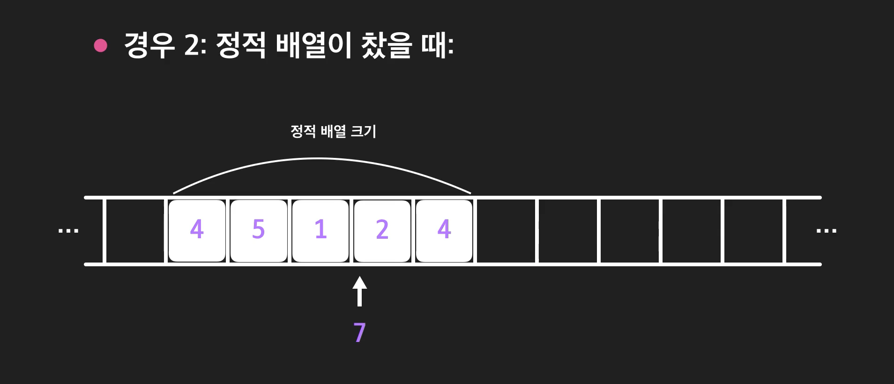

  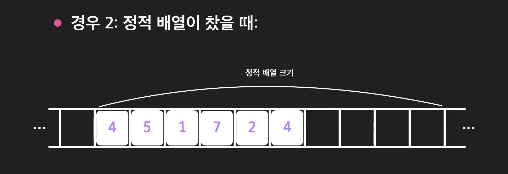

  이 경우 시간복잡도는 어떻게 될까?

  일단 새로 배열 만들고 하나 하나 복사하는데, **O(n)**

  그 다음, 원하는 요소가 있는 뒤에 애들을 한칸씩 뒤로 옮겨야 하지. 여기서도 최악인 경우로 하면, **O(n)**

  그리고, 이제 원하는 인덱스에 자리가 났으니깐 거기에 저장. **O(1)**

  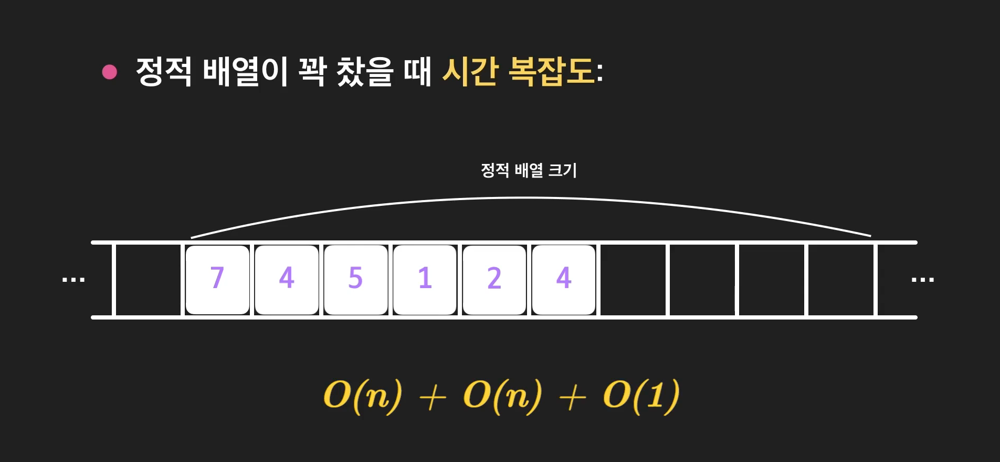

  다 더하면, O(2n+1)이니깐, 그냥 O(n)인 것. 

  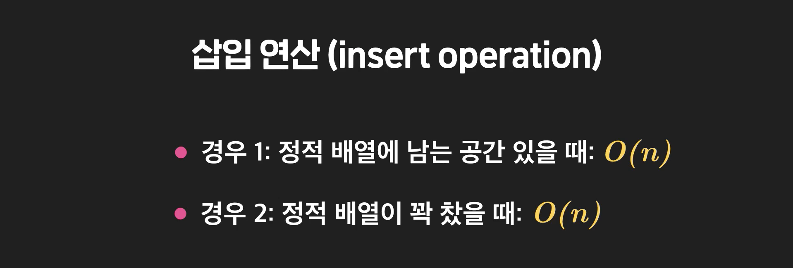

  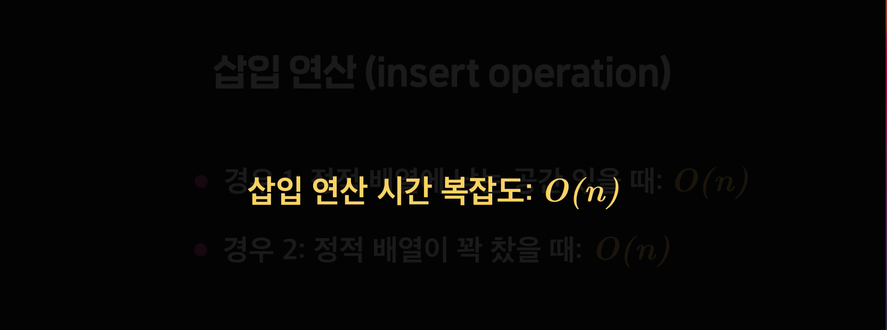


- #### 동적 배열 삭제 연산

  이번 레슨에서는 동적 배열에서 특정 위치에 있는 데이터를 지우는 삭제 연산에 대해서 배워 볼게요.

  **삭제 연산 동작**

  바로 예시를 볼게요. 이렇게 `2`, `3`, `5`, `7`, `11`이 있는 동적 배열에서 인덱스 1에 있는 `3`을 지우고 싶다고 할게요. 한 단계씩 봅시다.

  

  1. 인덱스 1 뒤에 있는 데이터를 모두 한 칸씩 앞으로 밀어서 저장합니다.
     1. 인덱스 1에 인덱스 2에 있던 `5`를 저장합니다
     2. 인덱스 2에 인덱스 3에 있던 `7`을 저장합니다
     3. 인덱스 3에 인덱스 4에 있던 `11`을 저장합니다
  2. 동적 배열은 배열의 크기와 개발자가 사용하는 인덱스들의 범위를 따로 관리합니다. 전에 [파이썬 리스트(동적 배열)의 비밀](https://www.codeit.kr/assignments/2181) 노트에서 말씀드렸는데 기억 나시나요? 데이터를 삭제했으니까 동적 배열에서 접근할 수 있는 인덱스 범위도 1을 줄여 줍니다.

  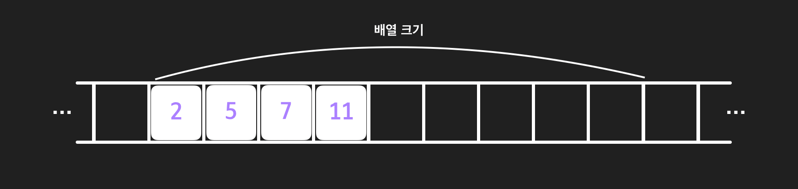

  동적 배열에 남은 데이터를 확인해보면 `2`, `5`, `7`, `11`입니다. 인덱스 1에 있는 데이터 `3`이 잘 삭제됐죠?

  요약하자면, 삭제 연산은 그냥 삭제하고 싶은 데이터 뒤에 있는 모든 데이터 요소들을 한 칸씩 앞으로 밀어서 저장하면 됩니다.

  **삭제 연산 시간 복잡도**

  삭제 연산의 시간 복잡도를 알아봅시다.

  전 레슨들에서는 데이터를 아무 위치에나 더해 주는 삽입(insert) 연산과 맨 끝에 더해주는 추가(append) 연산을 나눠서 생각했었는데요. 삭제 연산도 아무 위치의 데이터를 삭제할 때와 맨 뒤 데이터를 삭제할 때, 두 경우를 나눠서 생각할 수 있습니다.

  **맨 앞 데이터를 지울 때 (최악의 경우)**

  삭제 연산이 가장 오래 걸리는 경우는 가장 앞 인덱스에 있는 데이터를 지우는 경우입니다.

  가장 앞 데이터를 삭제할 때는 인덱스 1부터 끝까지 모든 요소들을 한 칸씩 앞으로 밀어서 저장해야 됩니다. 그러니까 삭제하기 전 배열 안에 총 n개의 데이터가 남아 있으면, 총 **n - 1개의 요소들을 하나씩 앞 칸으로 밀어서 저장해야 되는 거죠**. 이 횟수가 n에 비례하기 때문에 O(n)이 걸린다고 할 수 있죠. 왜 가장 앞 인덱스를 지우는 게 최악의 경우인지 알겠죠?

  종합해 보면 삭제 연산은 총 O(n)이 걸린다고 할 수 있습니다. 꽤 오래 걸리는 거죠.

  **맨 뒤 데이터를 지울 때**

  일단 아무 위치에 있는 데이터를 삭제할 때는 최악의 경우 O(n)이 걸린다고 했잖아요? 이번엔 맨 뒤 데이터를 삭제하는 데 얼마나 걸리는지 생각해 볼게요.

  맨 뒤 데이터를 삭제할 때는 아무 요소도 안 밀고 저장해도 되고, 그냥 동적 배열의 사용 공간을 한 인덱스 줄이면 됩니다.

  이건 배열에 데이터 요소가 몇 개가 있는지에 상관이 없이 일정한 시간에 할 수 있습니다. O(1)이라고 할 수 있는 거죠.

  **정리**

  정리해 볼게요.

  동적 배열의 아무 위치에 데이터를 삭제할 때는 원하는 위치 뒤에 있는 데이터를 옮겨 저장해야 됩니다. 그래서 최악의 경우 O(n)이 걸립니다.

  하지만 가장 뒤에 있는 데이터를 삭제할 때는 다른 데이터를 옮겨 저장할 필요가 없습니다. 따라서 O(1)이 걸립니다.


- #### 동적 배열 크기 줄이기

  동적 배열은 내부적으로 정해진 크기의 정적 배열을 사용하고 있습니다. 값을 추가하다가 내부 배열이 꽉 차면, 더 큰 내부 배열을 사용하도록 자동으로 늘려 주는 거죠. 반대로 삭제를 할 때에는 내부 배열의 크기를 줄이기도 하는데요...

  **왜 내부 배열의 크기를 줄여야 될까?**

  데이터 요소 10000 개가 들어 있는 동적 배열이 있다고 생각해 봅시다. 편의상 배열의 크기가 꽉 찼다고 생각할게요. 여기서 요소 9900 개를 삭제하면 100 개밖에 남지 않는데요. 그러면 나머지 9900 개의 요소를 저장할 수 있는 메모리는 낭비되겠죠? 동적 배열은 요소의 개수가 어느정도 줄어들면 내부 배열의 크기도 적절히 줄여서 공간을 좀 더 효율적으로 사용합니다.

  **내부 배열의 크기는 어떻게 줄어들까?**

  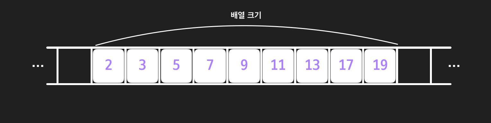

  위의 동적 배열 `int_array`를 봅시다. `int_array`는 9 개의 요소를 담고 있습니다. 내부 배열 크기가 9 개인 꽉 찬 동적 배열이라고 할게요.

  여기서 맨 뒤 요소 6 개를 삭제합니다.

  

  그럼 요소가 3 개로 줄어들죠? 그럼 정수 6 개를 저장할 수 있는 공간이 낭비되네요. 이렇게 낭비하는 공간이 너무 많아지는 경우에 내부 배열의 크기를 줄일 수 있습니다.

  그런데 정확히 어떤 시점에 줄이면 좋을까요?

  크기를 늘릴 때는 내부 배열이 꽉 찼을 때였는데요. 크기를 줄일 때는 내부 배열의 사용 비율이 특정 값 이하로 떨어질 때입니다.

  이 비율이 1/3이라고 가정하고 볼게요. 요소가 4 개에서 3 개로 줄어든 상황이라고 합시다. 내부 배열에 요소 9 개를 담을 수 있는데, 현재 사용 중인 공간은 3 칸밖에 없습니다. 그러니까 총 사용할 수 있는 공간 중 1/3밖에 사용을 안 하게 된 거죠.

  이때:

  1. 새로운 내부 배열을 정의합니다. 이번에는 크기가 3인 내부 배열을 만듭니다: 
  2. 그리고 기존의 3 개 요소를 새로 만든 내부 배열에 옮겨서 저장합니다: 

  전에는 6 칸을 낭비하고 있었는데 이제는 낭비하는 공간이 하나도 없습니다.

  내부 배열의 크기를 요소 수에 맞게 줄이면, 낭비하는 공간을 최소한으로 할 수 있습니다.

  그렇다고 방금 예시처럼 꼭 사용 비율이 ***1/3***일 때 크기를 줄여야 하는 것은 아닙니다.***1/2, 1/4, 1/5*** 일 때 줄일 수도 있죠. 개발자나 프로그래밍 언어에 따라 이 비율은 다릅니다.

  일단 저희는 생각하기 편하게 내부 배열의 크기를 늘릴 때에는 2 배로 늘리고, 줄일 때에는 요소 수가 크기의 **1/2**가 됐을 때 줄인다고 가정할게요.

  **시간 복잡도**

  **동적 배열 맨 끝 데이터 삭제 시간 복잡도**

  맨 끝 요소를 삭제했을 때 걸리는 시간 복잡도에 대해서 생각해 봅시다.

  최악의 경우를 가정합시다. 가장 오래 걸리는 경우는, 더 작은 배열로 모든 요소들을 옮겨 저장해야 될 때인데요.

  배열 안에 있는 요소 수가 n이라고 할 때, 총 n개의 데이터를 모두 새 배열에 복사해서 넣어야겠죠. 맨 뒤 데이터를 삭제하는 건 O(1)이 걸립니다. 하지만 n개의 데이터를 모두 새 배열에 복사해서 넣어야 되기 때문에 n에 비례하는 시간, O(n)이 걸립니다.

  **맨 끝 데이터 삭제 분할 상환 분석**

  하지만 내부 배열의 크기가 줄어드는 건 드문 경우입니다. 대부분의 경우 그냥 마지막 인덱스에 있는 데이터를 지워 주기만 하면 됩니다.

  위에서 봤던 예시를 다시 생각해 봅시다. 요소가 9 개에서 3 개로 줄어들 때까지, 그러니까 마지막 데이터 6 개를 삭제할 동안 배열의 크기를 조절할 필요가 없었습니다. 이 6 번은 그냥 O(1)로 맨 끝 데이터를 삭제한 거죠.

  근데 요소 수가 4 개에서 3 개로 줄어들 때에는, 마지막 데이터를 삭제하고 남은 3 개의 데이터를 새롭게 만든 더 작은 배열로 복사해서 저장했습니다. 이 경우에 O(n)이 걸린 거죠.

  동적 배열에서 마지막 데이터를 삭제할 때는 대부분의 경우 O(1)이 걸리지만, 드물게 O(n)이 걸립니다. 그렇기 때문에 추가 연산과 마찬가지로 분할 상환 분석을 적용할 수 있습니다. 분할 상환 분석을 적용하면 맨 끝 데이터 삭제 연산도 O(1)이 걸린다고 이야기할 수 있습니다.

  **정리**

  > 동적 배열에서 맨 끝 데이터를 삭제하는 연산은 최악의 경우 O(n)이 걸리지만, 분할 상환 분석을 적용하면 O(1)이라고 할 수 있다.

  > 사용 비율이 1/3일때 1/3으로 줄어들게 한다는 뜻. 


- #### 배열과 동적 배열 정리/비교

  n은 배열에 들어가 있는 데이터의 갯수를 의미. 

  접근은 특정 인덱스를 찾는 것. 

  탐색은, 특정 조건을 만족하는 것을 찾는 것. 

  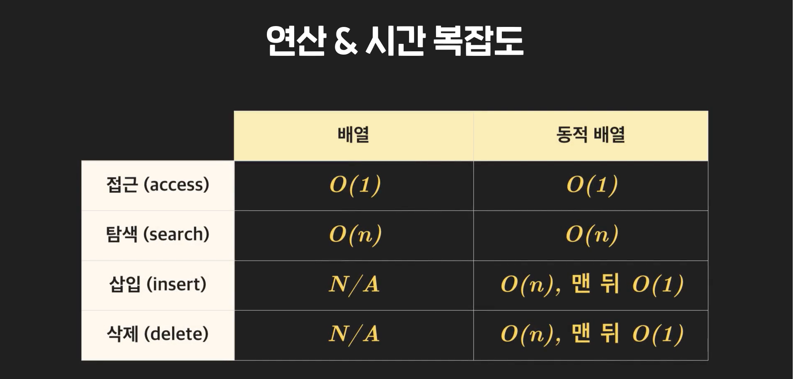

  낭비하는 공간은?

  일반 배열은 낭비할 것이 없음. 

  

  문제는 동적배열. 

  꽉 차 있으면 낭비 안하고 있을 수 있음. 

  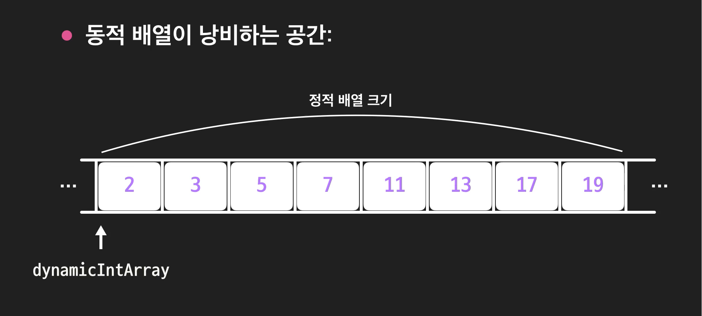

  But, 8개에서 9개가 되기만 해도, 크기는 2배로 늘어나니깐, 7개를 낭비하게 되는 것. 

  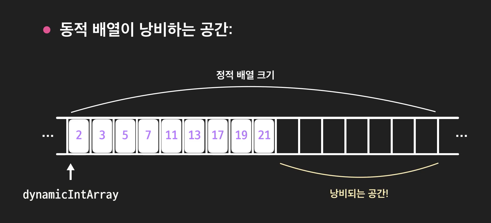

  **낭비하는 공간은 어떻게 표현할까?** 시간 복잡도 계산할 떄 처럼 최악의 경우를 생각해 볼 수 있다. 

  새로운 배열을 만들었을때가 낭비되는 공간이 제일 많겠지. 

  n-2개 낭비중이겠네. 

  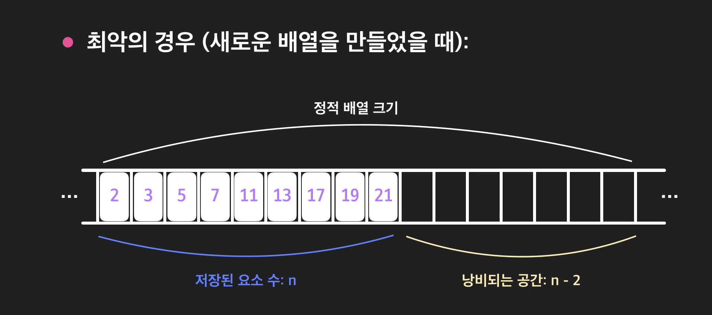

  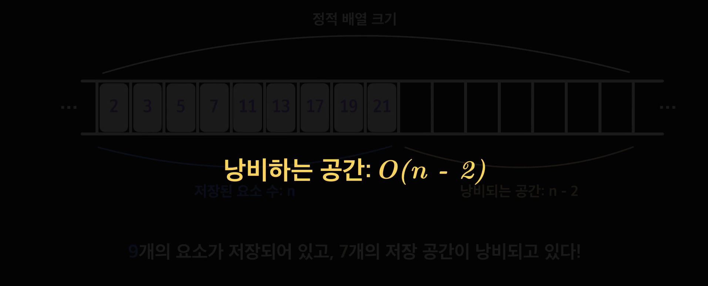


- #### 정적 배열에서 삽입과 삭제를 못하는 이유

  | 연산          | 배열 시간 복잡도 |
  | ------------- | ---------------- |
  | 접근 (access) | O(1)             |
  | 탐색 (search) | O(n)             |
  | 삽입 (insert) | N/A              |
  | 삭제 (delete) | N/A              |

  챕터 정리 레슨에서 배열에는 삽입과 삭제 연산을 자연스럽게 할 수 없다고 했습니다. 두 연산의 시간 복잡도를 N/A, 해당 사항 없음으로 표기했죠? 이번 노트에서 왜 그런지 알아볼게요. C 배열을 써서 보여드릴게요.

  **배열에 데이터 삽입을 못하는 이유**

  이건 정적 배열의 한계 레슨에서 이미 배운 내용이긴 한데요. 복습한다는 생각으로 보세요!

  ```python
  int numArray[4];
      
  numArray[0] = 2;
  numArray[1] = 3;
  numArray[2] = 5;
  numArray[3] = 7;
  ```

  배열에 삽입을 못하는 이유는 직관적입니다.

  이렇게 정수형 데이터 4 개를 저장하는 배열을 정의했다고 할게요. 배열은 크기가 정해져 있습니다. 더 많은 데이터 요소들을 저장하고 싶으면 더 큰 배열을 정의해야 되죠. 사용하고 싶은 요소 수에 따라 크기를 바꿀 수 있으면 그건 배열이 아니라 동적 배열이겠죠?

  크기가 고정되어 있는 배열에는 처음 정한 수보다 더 많은 데이터를 삽입할 수가 없는 거죠.

  **배열에 데이터 삭제를 못하는 이유**

  이번에는 삭제를 못하는 이유를 알아봅시다.

  ```python
  int numArray[4];
      
  numArray[0] = 2;
  numArray[1] = 3;
  numArray[2] = 5;
  numArray[3] = 7;
  ```

  정수 4개를 담을 수 있는 배열에 `2, 3, 5, 7`이 저장돼 있다고 할게요. 여기서 인덱스 1에 있는 `3`을 지우고 싶으면 어떻게 하면 될까요?

  동적 배열 삭제 연산처럼 배웠던 거처럼 인덱스 1 자리에 인덱스 2의 데이터를 저장하고, 인덱스 2에 인덱스 3 데이터를 저장해서 `2, 5, 7, 7` 이렇게 하면 될 거 같긴 한데요.

  여기서 문제는 인덱스 3에 저장되어 있던 `7`을 메모리에서 자연스럽게 지울 수 있는 방법이 마땅히 없습니다. 비었다는 것을 표시하기 위해서 파이썬에서는 `None`, 다른 언어들에서는 `Null` 이런 값을 넣는 걸 생각하실 수 있는데요. `numArray`는 정수형 데이터를 4 개를 저장합니다. `None`이나 `Null`은 정수형이 아닙니다. `numArray`의 인덱스 3에 저장할 수 없습니다.

  정리하자면 배열 `numArray`에서 인덱스 1을 지우기 위해서는 `2, 3, 5, 7`의 데이터를 `2, 5, 7`으로 만드는 게 아니라 `2, 5, 7, 7` 이런 식으로 밖에 못 만듭니다.

  지우고 싶은 요소를 “자연스럽게” 삭제할 수 없는 거죠.

  **동적 배열 삭제와 차이**

  배열을 사용하는 동적 배열에서는 어떻게 데이터를 삭제할 수 있는지 생각해볼게요.

  파이썬 리스트의 비밀 레슨 기억나시나요? 많은 언어들 자체적으로 제공하는 동적 배열은 사용하는 배열의 크기와 사용하는 인덱스 범위를 따로 처리한다고 했습니다.

  동적 배열이 내부적으로 정수 4개를 저장할 수 있는 배열에 `2`, `3`, `5`, `7`을 저장하고 있다고 할게요. 동적 배열에서 인덱스 1을 삭제하고 싶으면 인덱스 1에 5를 저장하고, 인덱스 2에 7을 저장합니다. 그럼 내부적으로는 `2, 5, 7, 7` 이렇게 저장되어 있을 텐데요. 그다음에 인덱스 3에 있는 7을 지우는 게 아니라 파이썬 내부적으로 개발자가 접근할 수 있는 인덱스 범위를 0 ~ 2로 만들어 버립니다. 더 이상 인덱스 3에 접근할 수 없게 만드는 거죠.

  실제로 인덱스 3에 어떤 값이 저장되어 있던 상관없이 개발자는 더 이상 거기 접근할 수 없습니다. 동적 배열에서 접근할 수 있는 데이터가 `2, 5, 7` 밖에 없으니까 실질적으로 삭제됐다고 할 수 있는 거죠.