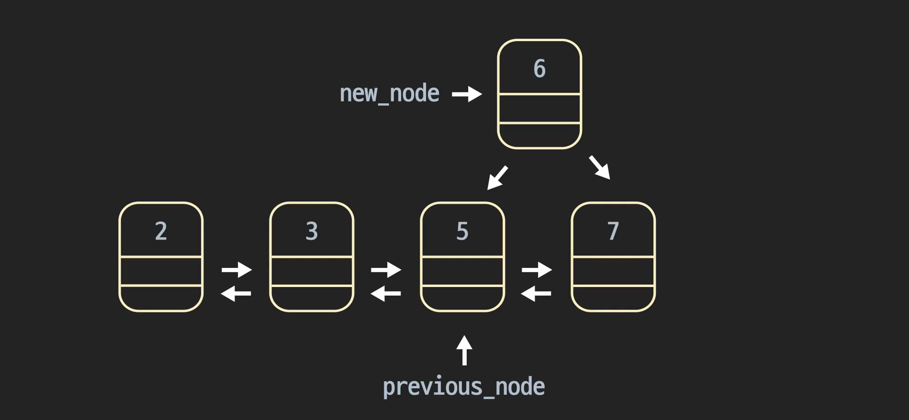

# Data_Structure_2 - LinkedList

현우 왈 

> 메모리라는 것은 엄청 긴 책장 같은 것. 1번 책장 자리 2번 책장 자리 이런식으로 책장 번호가 주솟값. 거기에 들어가는 것이 객체. 새로운 객체를 만들면 객체는 아무책장에 던져놓고 변수는 그 책장 번호만 기억하는 것. 
>
> 근데 1~255는 미리 책장에 만들어져 있어(하도 많이 쓰니깐). 그래서 새로 만들면, 추가적으로 안 만들고 그냥 원래 만들어져있는 애의 책장번호만 저장함. 그래서, a = 3, b = 3 id(a) == id(b) 하면 true가 나옴. 
>
> id(variable)했을 때 나오는 것이 이 책장번호임. 

- #### 링스드리스트 개념

  배열과 동적배열 모두, 데이터를 순서대로 저장했음. 링크드리스트도 배열이나 동적배열처럼 **데이터를 순서대로 저장**해준다. 그리고, 동적배열처럼 계속해서 **새로운 요소를 추가**해 줄 수 있는 개념. 

  

  링크드 리스트는 간단하게 얘기하자면, 노드라는 단위에 데이터를 저장하고, 데이터가 저장된 각 노드들을 순서대로 연결시켜서 만든 자료구조. 

  

  비유를 하자면, 노드를 그냥 박스라고 생각해보자. 박스가 5개가 있고, 각 박스에는 이름이 있다. 그리고 이 박스에는 칸막이 같은게 있어서 왼쪽가 오른쪽에 각각 무엇인가를 넣을 수 있다. 

  

  왼쪽에는 우리가 저장하고 싶은 값을 넣으면 된다. 2, 3, 5, 7, 11을 박스들에 넣어. 그런데 그것을 순서대로 나열하고 싶지. 2가 담겨 있는 박스 다음에 3이 담겨 있는 박스가 오기를 바라지. 그러면, 2가 담긴 박스 오른쪽 칸에 3이 담겨 있는 박스의 이름을 넣는 것. 이렇게 아래처럼 오른쪽 칸에 다음에 올 박스의 이름을 넣으면 되지. 11 다음에는 올 박스가 없으니깐 비워두면 되고. 

  

  여기 있는 이 박스들을 규칙 없이 그냥 흐트러져 있는 것처럼 보이지. 하지만, 오른쪽 칸에 다음 박스의 이름을 넣어서 순서를 만들어 준 것. 이런 식으로 연결지어줬다고 말할 수 있는 것. 이런 것을 링크드 리스트라고 부른다. 

  


- #### 링크드리스트 프로그래밍적으로 생각하기

  각 박스에는 이름이 있고, 칸막이 왼쪽에는 저장하고 싶은 정보를 넣고, 오른쪽에는 다음 박스의 이름을 넣는 것. 다음 박스의 이름을 보면서 따라가면 박스들의 순서를 따라갈 수 있음. 

  **그럼 실제 코드로는 이것을 어떻게 구현할 수 있을까?**

  우리는 박스 대신 **노드** 라는 단위를 사용할 것. 각 노드는 하나의 객체. 각 노드객체는 두가지 속성. 하나는 데이터라는 속성이고, 하나는 next 라는 속성. 박스랑 똑같지. 

  *data 속성에는 실제 데이터를 넣고, next 속성에는 다음 노드의 **레퍼런스**를 넣는 것.* 

  

  

  이런 노드 객체를 여러개 만들었다. 노드객체끼리는 서로 딱히 관계가 없음. 서로 메모리에서 여기저기 저장되있음. 연속적으로 저장되어 있는 것도 아님. 그런데, 각 노드는 다음 노드에 대한 **레퍼런스**가 있음. 노드 속성의 next속성을 보면, 다음 노드가 어디 저장되어 있는지를 알 수 있는 것. 맨 첫번째 노드의 **메모리 주소**만 알고 있으면, 각 노드를 타고 타고 모든 노드에 연결될 수 있음. 

  

  링크드리스트의 시작점 역할을 하는 이 맨 처음 노드를 **head**라고 부른다. head노드만 있으면 흩어져 있는 다른 노드들을 연결지어서 순서를 저장할 수 있는 것. 배열이나 동적배열처럼 정보를 원하는 순서로 저장할 수 있는 것. 

  

  앞으로 링크드 리스트 공부할때, 마치 이 객체들이 순서대로 있는 것 처럼 보여줄꺼임. 하지만, **실제 메모리에는 여기저기 흩어져 있다는 것을 꼭 기억하자.**

  

- #### 노드 클래스 만들기

  링크드 리스트는 노드 객체로 이루어져 있음. 실제로 만들어 보자. 

  노드 클래스를 정의 해야 한다. 

  ```python
  class Node:
      """링크드 리스트의 노드 클래스"""
      def __init__(self, data):
          self.data = data # 노드가 저장하는 데이터
          self.next = None # 다음 노드에 대한 레퍼런스
  ```

  노드 객체는 이게 전부임. 위 클래스로 실제 노드 객체를 만들어 보자. 

  2, 3, 5, 7, 11을 저장해보자. 

  보통 맨 앞 노드를 head node, 맨 뒤 노드를 tail node라고 부른다. 

  ```python
  # 데이터 2, 3, 5, 7, 11을 담는 노드 인스턴스를 생성
  head_node = Node(2)
  node_1 = Node(3)
  node_2 = Node(5)
  node_3 = Node(7)
  tail_node = Node(11)
  ```

  아직은 각자의 공간에 있음. 서로 아무 관련 없음. 

- #### 간단한 링크드 리스트 만들기

  위에서 만든 노드 객체들(*아직은 서로 연관성이 없음, 각자 메모리에 흩어져 있음*)을 서로 연결시켜 보자. 

  ```python
  # 노드들을 연결
  head_node.next = node_1
  node_1.next = node_2
  node_2.next = node_3
  node_3.next = tail_node
  ```

  노드에 저장된 데이터를 출력해보자. 

  ```python
  # 노드 순서대로 출력
  iterator = head_node
  while iterator is not None:
      print(iterator)
      iterator = iterator.next
  ```

  

  ```python
  # 노드 순서대로 출력
  iterator = head_node
  while iterator is not None:
      print(iterator.data)
      iterator = iterator.next
  ```

  > 2
  >
  > 3
  >
  > 5
  >
  > 7
  >
  > 11

- #### 링크드리스트 추가 연산

  링크드 리스트를 관리하는 클래스를 하나 만들어 보자. 

  ```python
  class LinkedList:
      """링크드 리스트 클래스"""
      def __init__(self):
          self.head = None
          self.tail = None
      def append(self, data):
          """링크드 리스트 추가 연산 메소드"""
          new_node = Node(data)
          if self.head is None: # 링크드 리스트가 비어 있는 경우
              self.head = new_node
              self.tail = new_node
  
          else: # 링크드 리스트가 비어 있지 않은 경우
              self.tail.next = new_node
              self.tail =new_node
  
  ```

  기존에 2, 3, 5, 7이 있을 때, 11을 추가하려고 하면 어떻게 해야 할까?

  일단 tail의 다음 노드로 new_node를 설정. 그리고, new_node를 tail로 설정. 

  

  실제로 확인해 보자. 

  ```python
  # 새로운 링크드 리스트 생성
  my_list = LinkedList()
  # 링크드 리스트 추가
  my_list.append(2)
  my_list.append(3)
  my_list.append(5)
  my_list.append(7)
  my_list.append(11)
  
  
  iterator = my_list.head
  
  while iterator is not None:
      print(iterator.data)
      iterator = iterator.next
  ```

  

- #### 링크드 리스트 __str__ 메소드

  **`__str__` 메소드**

  링크드 리스트를 클래스로 만들었으니까 링크드 리스트를 문자열로 표현해주는 `__str__` 메소드를 정의해봅시다. `__str__` 메소드가 기억 안 나시는 분들은 그냥 링크드 리스트를 출력할 때 자동으로 링크드 리스트의 내용을 사람들이 이해할 수 있는 문자열로 리턴해주는 메소드로 이해하시면 됩니다. (객체 지향 프로그래밍 코스를 참고하세요!)

  **링크드 리스트 `__str__` 메소드**

  ```python
  class LinkedList:
      """링크드  리스트 클래스"""
      def __init__(self):
          self.head = None  # 링크드 리스트의 가장 앞 노드
          self.tail = None  # 링크드 리스트의 가장 뒤 노드
  
      def append(self, data):
          """링크드 리스트 추가 연산 메소드"""
          new_node = Node(data)
          
          # 링크드 리스트가 비어 있으면 새로운 노드가 링크드 리스트의 처음이자 마지막 노드다
          if self.head is None:
              self.head = new_node
              self.tail = new_node
          # 링크드 리스트가 비어 있지 않으면
          else:
              self.tail.next = new_node  # 가장 마지막 노드 뒤에 새로운 노드를 추가하고
              self.tail = new_node  # 마지막 노드를 추가한 노드로 바꿔준다
  
      def __str__(self):
          """링크드 리스트를 문자열로 표현해서 리턴하는 메소드"""
          res_str = "|"
  
          # 링크드  리스트 안에 모든 노드를 돌기 위한 변수. 일단 가장 앞 노드로 정의한다.
          iterator = self.head
  
          # 링크드  리스트 끝까지 돈다
          while iterator is not None:
              # 각 노드의 데이터를 리턴하는 문자열에 더해준다
              res_str += f" {iterator.data} |"
              iterator = iterator.next  # 다음 노드로 넘어간다
  
          return res_str
  ```

  `__str__` 메소드는 문자열을 리턴하니까 일단 리턴 시킬 `res_str` 변수를 빈 문자열로 정의합니다. `iterator`을 써서 링크드 리스트를 도는 방법은 이미 배웠죠?

  1. `iterator` 변수를 링크드 리스트의 head를 가리키게 합니다
  2. `iterator` 변수가 `None`이 아닐 때까지 (링크드 리스트의 처음부터 끝 노드까지) `iterator` 변수의 `data`를 `res_str` 변수에 추가해 줍니다. `iterator` 변수의 `next` 속성을 이용해서 while 문을 돌 때마다 다음 노드로 갑니다.
  3. 링크드 리스트를 다 돈 후에 `res_str` 변수를 리턴합니다.

  한 번 제대로 코드를 작성했는지 확인해봅시다.

  ```python
  # 새로운 링크드 리스트 생성
  linked_list = LinkedList()
  
  # 링크드 리스트에 데이터 추가
  linked_list.append(2)
  linked_list.append(3)
  linked_list.append(5)
  linked_list.append(7)
  linked_list.append(11)
  ```

  영상에서와 동일하게 링크드 리스트에 노드를 추가해줬습니다.

  ```python
  print(linked_list)  # 링크드 리스트 출력
  ```

  그다음에 이렇게 링크드 리스트 인스턴스를 출력할 건데요. 이때 노트 위에서 정의한 `__str__` 메소드가 호출되는 거죠.

  ```
  | 2 | 3 | 5 | 7 | 11 |
  ```

  링크드 리스트의 내용이 원하는 대로 잘 출력되는군요! 앞으로 링크드 리스트에 저장되어 있는 데이터를 확인하기 위해서 `__str__` 메소드를 자주 쓸 건데요. 이번 노트에서 정의해놨으니까 다음 레슨들에서 그냥 자연스럽게 사용할게요.


- #### 링크드 리스트 접근

  접근 연산이라는 것은 아래처럼 특정 위치에 있는 데이터를 가지고 오거나 바꿔주는 연산. 

  

  링크드 리스트도 데이터를 순서대로 저장함. 고로, 원하는 위치에 접근할 수 있지. 다만, 링크드 리스트는 원하는 순서에 있는 노드를 리턴한다. 

  

  **링크드리스트의 접근연산은 헤드부터 시작해서 하나씩 돌면서 원하는 노드에 접근한다.** 

  **배열은 인덱스를 이용해서, 데이터가 저장된 주소를  계산할 수 있었음. 링크드리스트는 레퍼런스를 통해 순서를 저장하기 때문에 한번에 원하는 위치의 데이터에 접근할 수가 없다.** 

  > 이 말이 너무 어려운데, 생각해보면 배열은 시작 주소 + i*4 이런식으로 한번에 접근할 수 있었잖아. 그런데 링크드 리스트는 next에 다음 주소값이 저장되어 있으니깐 계산을 할 수가 없지. 

  

  >메모리라는 것은 엄청 긴 책장 같은 것. 1번 책장 자리 2번 책장 자리 이런식으로 책장 번호가 주솟값. 거기에 들어가는 것이 객체. 새로운 객체를 만들면 객체는 아무책장에 던져놓고 변수는 그 책장 번호만 기억하는 것. 
  >
  >근데 1~255는 미리 책장에 만들어져 있어(하도 많이 쓰니깐). 그래서 새로 만들면, 추가적으로 안 만들고 그냥 원래 만들어져있는 애의 책장번호만 저장함. 그래서, a = 3, b = 3 id(a) == id(b) 하면 true가 나옴. 
  >
  >id(variable)했을 때 나오는 것이 이 책장번호임. 
  >
  >파이썬에서는 어떤 변수에 객체를 넣는다는 것은 그 주솟값을 넣는다는 것. **iterator.next = instance** 를 넣는다는 것은 기존에 instance가 있으면 그 주솟값을 복사하는 것. 

  ```python
  
  class LinkedList:
      """링크드 리스트 클래스"""
      def __init__(self):
          self.head = None
          self.tail = None
  
      def find_node_at(self, index):
          """링크드 리스트 접근 연산 메소드. 파라미터 인덱스는 항상 있다고 가정"""
          iterator = self.head
          for _ in range(index):
              iterator = iterator.next
          return iterator
  
      def append(self, data):
          """링크드 리스트 추가 연산 메소드"""
          new_node = Node(data)
          if self.head is None: # 링크드 리스트가 비어 있는 경우
              self.head = new_node
              self.tail = new_node
  
          else: # 링크드 리스트가 비어 있지 않은 경우
              self.tail.next = new_node
              self.tail =new_node
  
      def __str__(self):
          """링크드 리스트를 문자열로 표현해서 리턴하는 메소드"""
          res_str = "|"
  
          # 링크드  리스트 안에 모든 노드를 돌기 위한 변수. 일단 가장 앞 노드로 정의한다.
          iterator = self.head
  
          # 링크드  리스트 끝까지 돈다
          while iterator is not None:
              # 각 노드의 데이터를 리턴하는 문자열에 더해준다
              res_str += f" {iterator.data} |"
              iterator = iterator.next  # 다음 노드로 넘어간다
  
          return res_str
  ```

  사용해보기 

  ```python
  
  # 새로운 링크드 리스트 생성
  my_list = LinkedList()
  # 링크드 리스트 추가
  my_list.append(2)
  my_list.append(3)
  my_list.append(5)
  my_list.append(7)
  my_list.append(11)
  
  
  # 링크드 리스트 노드에 접근 (데이터 가지고 오기)
  print(my_list.find_node_at(3).data)
  
  # 링크드 리스트 노드에 접근 (데이터 바꾸기)
  my_list.find_node_at(2).data = 13
  
  print("Print Entire List")
  print(my_list)
  ```

  > 2
  > 3
  > 5
  > 7
  > 11
  > 7
  > Print Entire List
  > | 2 | 3 | 13 | 7 | 11 |

  **링크드 리스트 접근 시간 복잡도**

  배열에서 접근할때 만큼 충분히 효율적이지가 않음. 링크드 리스트는 더 뒤에 있는 노드로 접근할수록 점점 더 드는 시간이 늘어남. 

  

  

  

  

- #### 링크드 리스트 탐색 연산

  ```python
  class Node:
      """링크드 리스트의 노드 클래스"""
  
      def __init__(self, data):
          self.data = data  # 실제 노드가 저장하는 데이터
          self.next = None  # 다음 노드에 대한 레퍼런스
  
  
  class LinkedList:
      """링크드 리스트 클래스"""
  
      def __init__(self):
          self.head = None  # 링크드 리스트의 가장 앞 노드
          self.tail = None  # 링크드 리스트의 가장 뒤 노드
  
      def find_node_with_data(self, data):
          """링크드 리스트에서 탐색 연산 메소드. 단, 해당 노드가 없으면 None을 리턴한다"""
          # 코드를 쓰세요
          iterator = self.head
          while iterator != None:
              if iterator.data == data:
                  return iterator
              iterator = iterator.next
          return None
  
  
  
      def append(self, data):
          """링크드 리스트 추가 연산 메소드"""
          new_node = Node(data)
  
          # 링크드 리스트가 비어 있으면 새로운 노드가 링크드 리스트의 처음이자 마지막 노드다
          if self.head is None:
              self.head = new_node
              self.tail = new_node
          # 링크드 리스트가 비어 있지 않으면
          else:
              self.tail.next = new_node  # 가장 마지막 노드 뒤에 새로운 노드를 추가하고
              self.tail = new_node  # 마지막 노드를 추가한 노드로 바꿔준다
  
      def __str__(self):
          """링크드  리스트를 문자열로 표현해서 리턴하는 메소드"""
          res_str = "|"
  
          # 링크드  리스트 안에 모든 노드를 돌기 위한 변수. 일단 가장 앞 노드로 정의한다.
          iterator = self.head
  
          # 링크드  리스트 끝까지 돈다
          while iterator is not None:
              # 각 노드의 데이터를 리턴하는 문자열에 더해준다
              res_str += " {} |".format(iterator.data)
              iterator = iterator.next  # 다음 노드로 넘어간다
  
          return res_str
  ```

  실행 코드 

  ```python
  
  # 새로운 링크드 리스트 생성
  linked_list = LinkedList()
  
  # 여러 데이터를 링크드 리스트 마지막에 추가
  linked_list.append(2)
  linked_list.append(3)
  linked_list.append(5)
  linked_list.append(7)
  linked_list.append(11)
  
  # 데이터 2를 갖는 노드 탐색
  node_with_2 = linked_list.find_node_with_data(2)
  
  if not node_with_2 is None:
      print(node_with_2.data)
  else:
      print("2를 갖는 노드는 없습니다")
  
  # 데이터 11을 갖는 노드 탐색
  node_with_11 = linked_list.find_node_with_data(11)
  
  if not node_with_11 is None:
      print(node_with_11.data)
  else:
      print("11를 갖는 노드는 없습니다")
  
  # 데이터 6 갖는 노드 탐색
  node_with_6 = linked_list.find_node_with_data(6)
  
  if not node_with_6 is None:
      print(node_with_6.data)
  else:
      print("6을 갖는 노드는 없습니다")
  ```

- #### 링크드 리스트 삽입 연산

  이번에는 중간에 새로운 노드를 삽입하는 방법을 살펴보자. 맨 뒤에 삽입하는 것은 append였고, 중간에 삽입하는 것은 insert after!

  ```python
  class LinkedList:
      """링크드 리스트 클래스"""
      def __init__(self):
          self.head = None
          self.tail = None
  
      def insert_after(self, previous_node, data):
          """링크드 리스트 주어진 노드 뒤 삽입 연산 메소드"""
          new_node = Node(data)
  
  ```

  삽입 연산은 두가지로 나뉘어짐 

  1. **맨 마지막에 삽입할 때**

     즉 이 경우는 previous node가 `tail_node`인 경우. 

     

     이 뒤는 그냥 append 함수랑 똑같지. 

     

     잘 보면 알겠지만, previous_node가 들어왔다는 것 자체가 그 linked_list가 비어있진 않다는 소리. 

  2. **두 노드 사이에 삽입할 때**

     new_node의 다음 노드가 원래 previous node의 다음 노드가 되게 하면 됨. 

     그리고, previous node의 next는 new_node 가 되게 하면 되지.

     

     ```python
     class LinkedList:
         """링크드 리스트 클래스"""
         def __init__(self):
             self.head = None
             self.tail = None
     
         def insert_after(self, previous_node, data):
             """링크드 리스트 주어진 노드 뒤 삽입 연산 메소드"""
             new_node = Node(data)
             if previous_node is self.tail:
                 previous_node.next = new_node
                 self.tail = new_node
             else:
                 new_node.next = previous_node.next
                 previous_node.next = new_node
     
     
     ```

     실행 코드

     ```python
     # 새로운 링크드 리스트 생성
     my_list = LinkedList()
     # 링크드 리스트 추가
     my_list.append(2)
     my_list.append(3)
     my_list.append(5)
     my_list.append(7)
     
     print(my_list)
     
     node_2 = my_list.find_node_at(2)
     my_list.insert_after(node_2, 6)
     print(my_list)
     ```

     >| 2 | 3 | 5 | 7 |
     >| 2 | 3 | 5 | 6 | 7 |

     ```python
     head_node = my_list.head
     my_list.insert_after(head_node, 9)
     print(my_list)
     ```

     >  | 2 | 9 | 3 | 5 | 6 | 7 |


- #### 링크드 리스트 삭제

  이전 노드를 받아서, 그 다음번째 노드를 삭제해 주는 메소드. 

  **링크드 리스트에서는 그냥 연결관계 끊어주면 그게 삭제**

  ```python
  def delete_after(self, previous_node):        
  ```

  이것도 한 경우씩 봐야 함. 

  1. *tail 노드를 삭제해야 되는 경우*

     

  2. *두 노드 사이 노드를 지울 때* 

     

     **+로 링크드리스트에서 데이터를 삭제할 때는, 지워주는 노드의 데이터를 리턴해 주는것이 관습**  

     ```python
        def delete_after(self, previous_node):
             """링크드 리스트 삭제 연산. 주어진 노드 뒤 노드를 삭제한다."""
             data = previous_node.next.data
             if previous_node.next is self.tail:
                 previous_node.next = None
                 self.tail = previous_node
             else:
                 previous_node.next = previous_node.next.next
     
             return data
     ```

     ```python
     # 새로운 링크드 리스트 생성
     my_list = LinkedList()
     # 링크드 리스트 추가
     my_list.append(2)
     my_list.append(3)
     my_list.append(5)
     my_list.append(7)
     my_list.append(11)
     
     print(my_list)
     
     node_2 = my_list.find_node_at(2)
     my_list.delete_after(node_2)
     print(my_list)
     ```

     >| 2 | 3 | 5 | 7 | 11 |
     >| 2 | 3 | 5 | 11 |

     ```python
     second_to_last_node = my_list.find_node_at(2)
     print(my_list.delete_after(second_to_last_node))
     print(my_list
     ```

     >11
     >| 2 | 3 | 5 |


- #### 링크드 리스트 시간 복잡도

  **링크드 리스트 연산들 시간 복잡도**

  이번 챕터 내내 링크드 리스트가 무엇이고 어떤 연산들을 할 수 있는지 봤는데요. 접근, 탐색, 삽입, 그리고 삭제 연산들을 봤습니다. 이 네 개의 연산들의 시간 복잡도를 평가해볼게요.

  **접근**

  접근부터 봅시다. 사실 접근은 이미 시간 복잡도를 알아봤는데요. 복습하는 느낌으로 볼게요. 인덱스 x에 있는 데이터에 접근하려면 링크드 리스트의 head 노드부터 x 번 다음 노드를 찾아서 가야 됩니다.

  원하는 노드에 접근하는 시간은 몇 번째 인덱스인지에 비례하는 건데요.

  그러니까 인덱스 1에 있는 노드는 head 노드에서 한 번만 다음 노드로 가면 되고 인덱스 5에 있는 노드는 head 노드에서 연속해서 5 번 이동하면 되는 거죠. 링크드 리스트 안에 있는 노드의 수를 n이라고 하면, 마지막 순서에 있는 노드에 접근해야 되는 최악의 경우에는 head 노드에서 총 n - 1 번 다음 노드로 가야 됩니다. 걸리는 시간은 n에 비례하기 때문에 접근 연산은 최악의 경우 O(n)의 시간 복잡도를 갖습니다.

  **탐색**

  링크드 리스트 탐색 연산은 배열을 탐색할 때와 같은 방법으로 합니다. 가장 앞 노드부터 다음 노드를 하나씩 보면서 원하는 데이터를 갖는 찾습니다. 이런 탐색 방법을 선형 탐색이라고 했는데요. 접근과 마찬가지로 링크드 리스트 안에 찾는 데이터가 없을 때 또는 찾으려는 데이터가 마지막 노드에 있는 최악의 경우, n 개의 노드를 모두 다 봐야 됩니다. 그렇기 때문에 탐색도 접근과 마찬가지로 최악의 경우 O(n)의 시간 복잡도를 갖습니다.

  **삽입/삭제**

  링크드 리스트의 삽입과 삭제 연산은 배열 삽입과 조금 차이가 있었는데요. `insert_after`, `delete_after` 메소드들을 한 번 살펴보세요.

  ```python
  def insert_after(self, previous_node, data):
      """파라미터 data를 데이터로 갖는 새로운 노드를 만들어서 node 파라미터 뒤에 삽입시킨"""
      new_node = Node(data) # 새로운 노드 만들기
  
      # tail 노드 다음에 새로운 노드를 삽입할 때
      if previous_node == self.tail: 
          previous_node.next = new_node
          self.tail = new_node
      # 두 노드 사이에 새로운 노드를 삽입할 때
      else:
          new_node.next = previous_node.next
          previous_node.next = new_node
  
  def delete_after(self, previous_node):
      """파라미터로 받은 노드 다음 노드를 삭제한다. 단, 파라미터 previous노드로 인해서 에러는 안 난다고 가정한다"""
      data = previous_node.next.data
  
      # 지우려는 노드가 tail 노드일 때
      if previous_node.next == self.tail:
          self.tail = previous_node
          self.tail.next = None
      # 두 노드 사이의 노드를 지울 
      else:
          previous_node.next = previous_node.next.next
  
      return data
  ```

  삽입, 삭제는 그냥 삽입, 삭제할 인덱스의 주변 노드들에 연결된 레퍼런스만 수정합니다

  그러니까 이 연산들이 실행되는데 걸리는 시간은 특정 값에 비례하지 않고 항상 일정하다는 말인데요. 파라미터로 받는 이 노드가 어떤 순서에 있는 노드든 상관없이 걸리는 시간은 변하지 않는 거죠. O(1)의 시간 복잡도를 갖는다고 할 수 있습니다.

  **시간 복잡도**

  모든 걸 종합해보면 이렇게 나타낼 수 있습니다.

  | 연산 | 시간 복잡도 |
  | ---- | ----------- |
  | 접근 | O(n)        |
  | 탐색 | O(n)        |
  | 삽입 | O(1)        |
  | 삭제 | O(1)        |

  접근과 탐색은 O(n), 삽입과 삭제는 O(1)이죠.

  **현실적인 삽입/삭제 시간 복잡도**

  하지만 조금 더 현실적으로 생각해봅시다. 삽입과 삭제 연산들은 특정 노드를 넘겨줘서 이 노드 다음 순서에 데이터를 삽입하거나 삭제했잖아요? 그럼 이 연산들에 넘겨주는 노드, 파라미터 `previous_node`를 먼저 찾아야 되는데요. head와 tail 노드는 항상 저장해주기 때문에 빨리 찾을 수 있는데, 나머지 노드들은 탐색이나 접근 연산을 통해서 가지고 와야 됩니다.

  그러니까 현실적으로는 이렇게 되는 거죠.

  | 연산                                | 링크드 리스트 |
  | ----------------------------------- | ------------- |
  | 접근                                | O(n)          |
  | 탐색                                | O(n)          |
  | 원하는 노드에 접근 또는 탐색 + 삽입 | O(n + 1)      |
  | 원하는 노드에 접근 또는 탐색 + 삭제 | O(n + 1)      |

  사실상 삽입과 삭제 연산은 접근 또는 탐색의 시간 복잡도인 O(n)를 공유한다고 볼 수 있습니다.

  **삽입 삭제 연산 특수 경우 시간 복잡도**

  근데 아까 얘기했듯이, head와 tail 노드는 항상 한 번에 찾을 수 있었죠? 접근하는데 O(1), 연산을 하는데 O(1)이 걸리는데요. 그렇기 때문에 이 두 노드와 관련. 있는 삽입이나 삭제 연산들은 O(1)로 할 수 있습니다. `append`, `prepend`, `pop_left` 메소드를 살펴보면 head 노드와 tail 노드를 한 번에 가지고 와서 레퍼런스를 바꿔주죠?

  ```python
  def pop_left(self):
      """링크드 리스트의 가장 앞 노드를 삭제해주는 메소드, 단 링크드 리스트에 항상 노드가 있다고 가정한다"""
      data = self.head.data  # 삭제할 노드를 미리 저장해놓는다
  
      # 지우려는 데이터가 링크드 리스트의 마지막 남 데이터일 때
      if self.head is self.tail:
          self.head = None
          self.tail = None
      else:
          self.head = self.head.next
  
      return data  # 삭제된 노드의 데이터를 리턴한다
  
  
  def prepend(self, data):
      """링크드 리스트의 가장 앞에 데이터 삽입"""
      new_node = Node(data)  # 새로운 노드를 만든다
  
      # 링크드 리스트가 비었는지 확인
      if self.head is None:
          self.tail = new_node
      else:
          new_node.next = self.head   # 새로운 노드의 다음 노드를 head 노드로 정해주고
  
      self.head = new_node   # 리스트의 head_node를 새롭게 삽입한 노드로 정해준다
  
  
  def append(self, data):
      """파라미터로 받은 데이터를 갖는 노드를 생성한다"""
      new_node = Node(data)
  
      # 링크드 리스트가 비어 있으면 새로운 노드가 링크드 리스트의 처음이자 마지막 노드다
      if self.head == None:
          self.head = new_node
          self.tail = new_node
      # 링크드 리스트가 비어 있지 않으면
      else:
          self.tail.next = new_node  # 가장 마지막 노드 뒤에 새로운 노드를 추가하고
          self.tail = new_node  # 마지막 노드를 추가한 노드로 바꿔준다
  ```

  링크드 리스트 안에 몇 개의 노드가 있던 상관없이, 항상 한 번에 받아와서 레퍼런스를 바꿔줍니다.

  이렇게 표현할 수 있겠네요.

  | 연산                  | 링크드 리스트 |
  | --------------------- | ------------- |
  | 가장 앞에 접근 + 삽입 | O(1 + 1)      |
  | 가장 앞에 접근 + 삭제 | O(1 + 1)      |
  | 가장 뒤에 접근 + 삽입 | O(1 + 1)      |

  양 끝에서 하는 삽입/삭제 연산들 중 유일하게 tail 노드를 삭제하는 경우는 빠졌죠?

  tail 노드를 삭제하기 위해서는 바로 전 노드가 필요한데요. 이 노드를 찾으려면 head 노드에서 n - 2번 다음 노드로 가야 됩니다. 접근하는데 O(n - 2), 그러니까 O(n)의 시간 복잡도가 걸립니다. 접근한 노드에서 다음 노드를 삭제하는 건 O(1)이 걸리잖아요?. 그러니까 tail 노드 전 노드에 접근해서 tail 노드를 삭제하는 건 O(n + 1), 결국 O(n)인 거죠.

  | 연산                                                | 링크드 리스트 |
  | --------------------------------------------------- | ------------- |
  | 가장 앞에 접근 + 삽입                               | O(1 + 1)      |
  | 가장 앞에 접근 + 삭제                               | O(1 + 1)      |
  | 가장 뒤에 접근 + 삽입                               | O(1 + 1)      |
  | 뒤에서 두 번째 노드 (tail 노드 전 노드) 접근 + 삭제 | O(n + 1)      |

  링크드 리스트 가장 뒤 노드 삭제 연산은 나머지 세 연산만큼 효율적으로 할 수 없습니다.


- #### 더블리 링크드 리스트

  이번 챕터 내내, 노드가 다음 노드에 대한 레퍼런스**만** 갖는 경우만 살펴봤음.  이런 링크드 리스트를 **싱글리 링크드** 리스트 라고 부른다. 

  

  더블리 링크드 리스트는 각 노드가, **이전/이후** 두 개의 주소 저장하고 있는 경우를 살펴볼 것. 

  

  싱글리 링크드 리스트 노드는 data와 next값을 들고 있었음. 

  

  prev하나 추가 되는 것. 

  

  코드에서도 그냥 한줄만 추가하면 됨. 

  

  **init메소드는 싱글리 링크드 리스트와 아예 동일함.** head와 tail만 알면 돼. 

  

   

- #### 더블리 링크드 리스트 겹치는 메소드

  **더블리 링크드 리스트 겹치는 연산들**

  > 접근: 어차피 해당 위치까지 가야함
  >
  > 탐색 : 어차피 하나씩 찾아봐야 함. 
  >
  > str : 어차피 데이터 하나씩 확인하는 과정. 

  사실 더블리 링크드 리스트는 `__init__` 메소드 말고도 싱글리 링크드 리스트에서 안 바꿔도 되는 메소드들이 좀 있는데요.

  구체적으로 말하면 `find_node_at`(접근 연산), `find_node_with_data`(탐색 연산), 그리고 `__str__`  메소드가 싱글리 링크드 리스트랑 겹칩니다.

  그래서 더블리 링크드 리스트를 배울 때도 이 메소드들은 이미 있다는 가정하에 배울 건데요. 참고하시기 편하게 아래에 메소드 별로 적어놨습니다.

  혹시 이번 노트에서 보시는 메소드 중에서 이해가 안 되는 부분이 있으면 챕터 앞 부분의 레슨들을 복습하시고 넘어가시는 걸 추천드릴게요.

  **접근**

  ```python
  def find_node_at(self, index):
      """링크드 리스트 접근 연산 메소드. 파라미터 인덱스는 항상 있다고 가정한다"""
      
      iterator = self.head  # 링크드 리스트를 돌기 위해 필요한 노드 변수
      
      # index 번째 있는 노드로 간다
      for _ in range(index):
          iterator = iterator.next
      
      return iterator
  ```

  **탐색**

  ```python
  def find_node_with_data(self, data):
      """링크드 리스트에서 주어진 데이터를 갖고있는 노드를 리턴한다. 단, 해당 노드가 없으면 None을 리턴한다"""
      iterator = self.head  # 링크드 리스트를 돌기 위해 필요한 노드 변수
      
      while iterator is not None:
          if iterator.data == data:
              return iterator
  
          iterator = iterator.next
  
      return None
  ```

  **`__str__` 메소드**

  ```python
  def __str__(self):
      """링크드 리스트를 문자열로 표현해서 리턴하는 메소드"""
      res_str = "|"
  
      # 링크드 리스트 안에 모든 노드를 돌기 위한 변수. 일단 가장 앞 노드로 정의한다.
      iterator = self.head
  
      # 링크드 리스트 끝까지 돈다
      while iterator is not None:
          # 각 노드의 데이터를 리턴하는 문자열에 더해준다
          res_str += " {} |".format(iterator.data)
          iterator = iterator.next  # 다음 노드로 넘어간다
  
      return res_str
  ```


- #### 더블리 링크드 리스트 추가 연산

  일단 더블리 링크드 리스트 끝에 새로운 값을 추가하는 연산을 만들어 보자. 

  이것도 링크드 리스트가 비어있는 경우와 아닌 경우로 나눠서 살펴봐야 함. 

  링크드 리스트가 비어있지 않은 경우를 보자. 

  

  ```python
      def append(self, data):
          """링크드 리스트 추가 연산 메소드"""
          new_node = Node(data)
  
          # 링크드 리스트가 비어 있는 경우
          if self.head is None:
              self.head = new_node
              self.tail = new_node
          else:
              # 링크드 리스트가 비어있지 않은 경우
              self.tail.next = new_node
              new_node.prev = self.tail
              self.tail = new_node
  ```

  결과 확인 

  ```python
  # 빈 링크드 리스트 정의
  my_list = LinkedList()
  my_list.append(2)
  my_list.append(3)
  my_list.append(5)
  my_list.append(7)
  
  print(my_list)
  ```

  >| 2 | 3 | 5 | 7 |


- #### 더블리 링크드 리스트 삽입 연산 개념

  더블리 링크드 리스트 양 끝이 아닌, 특정 노드 뒤에 삽입하는 경우를 보자. 

  

  삽입 연산은 **tail 노드 뒤**에 삽입할때, 그리고 **두 노드 사이**에 삽입할때 두 경우가 있음. 

  *1. previous node가 tail인 경우.* 

  ​	이건 **append**에서 했던 것과 동일함

  *2. 두 노드 사이에 삽입하는 경우*

  ​	

  이거 순서를 잘 안맞추면 꼬임. 

  먼저 new_node를 원래있던 리스트에 연결, 

  

  원래 노드들을 new_node에 연결해준다. 

  


- #### 더블리 링크드 리스트 삭제 연산 개념

  