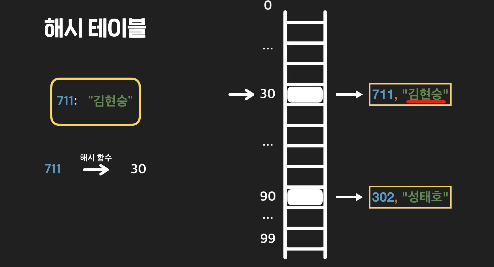
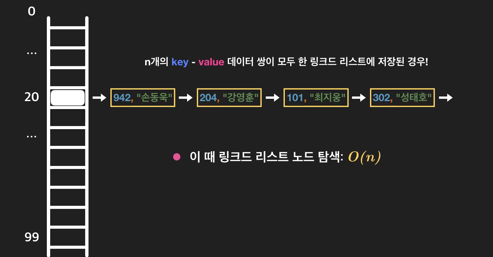
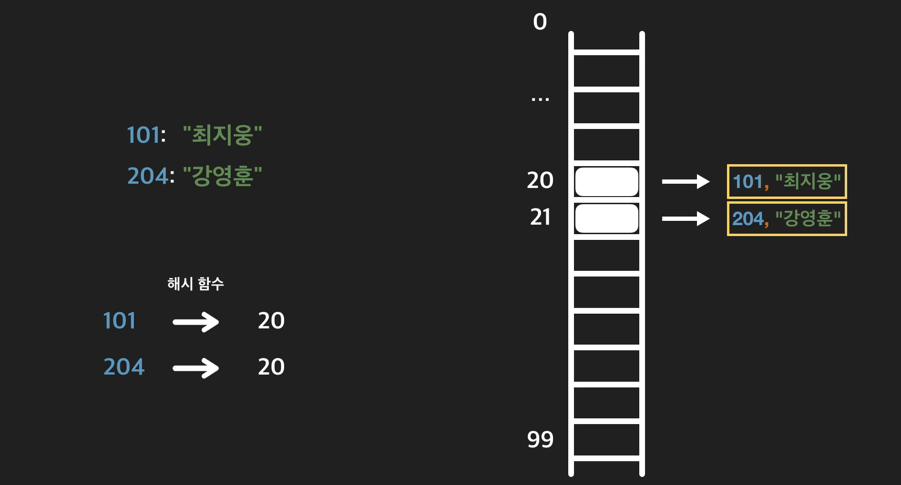
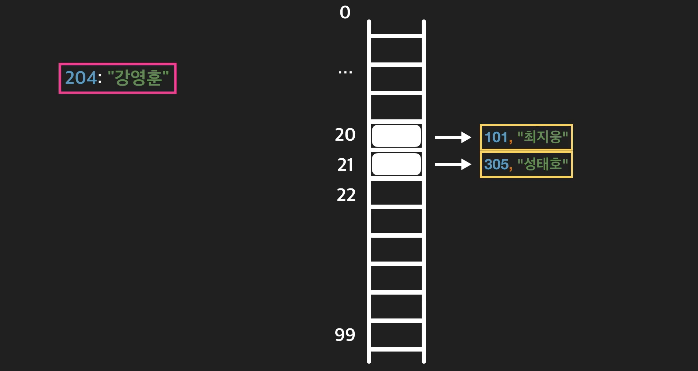
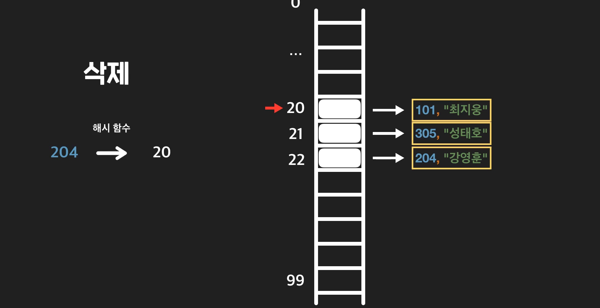

# Data Structure 3 - Hash Table

- #### key-value 데이터

  지금까지는 데이터를 순서대로 저장해주는 배열과 링크드 리스트에 대해서 배웠음. 근데 모든 데이터에 순서가 있는 것은 아니다. 예를 들어 아래, 입주민에 대한 데이터를 봐보자. 

  

  작은 호수부터 큰 호수까지 순서대로 데이터를 저장할 수 있지만, 어떤 호수에 누가 사는지 알고 싶을때 이 순서는 크게 의미는 없음. 이렇게 순서가 아니라, 이미 알고 있는 정보를 이용해서 정보를 검색하는 데이터 유형을 **key-value** 데이터라고 부른다. 

  key와 value를 합쳐서 **key-value** 쌍 이라고 부른다. 그리고, 하나의 **key**에는 하나의 **value**만 있어야 한다. 

  

  하나의 key에 여러개의 value가 있으면 안된다는 것. 

  


- #### Direct Access Table

  배열 인덱스 접근은 O(1)이였음. 인덱스는 순서에 대한 정보였음. 항상 0부터 n-1까지의 자연수였음. 인덱스를 key로 생각해보면 직관적으로 key-value쌍을 저장할 수 있음. 

  

  예시를 통해 무슨말인지 보자. 

  일단 가장 큰 호수를 마지막 인덱스로 갖는 **배열**을 만든다. 크기가 943인 배열. 

  

  그 다음에는 인덱스를 마치 호수라고 생각하고 데이터를 저장. 

  

  그럼 저장한 key-value데이터를 가지고 오고 싶으면 어떻게 할까?

  101호에 누가 사는지 알고 싶으면, 배열의 인덱스 101에 접근하면 되지. 배열의 가장 큰 장점은 인덱스를 이용한 접근이 항상 O(1)이 가능하다는 것인데, 호수를 인덱스로 사용하면 입주민 이름을 항상 O(1)으로 가져올 수 있음. 

  **지금 배열을 만든거잖아. 그러니깐 당연히 key를 이용한 접근인데 index를 이용한 접근처럼 되면서 O(1)이 되는거지.** 

  

  이렇게 배열의 인덱스를 키로 이용해서 데이터를 저장하고 가져오는 방식을 **Direct Access Table**이라고 부른다. 

  

  근데 딱봐도 문제가, 공간이 너무 많이 필요하잖아. 

  

  호가 2만호까지 있으면 어쩔꺼야. 

  가져오는 공간 효율적으로 만들려고 낭비하는 공간이 너무 많아짐. 

  


- #### 해시테이블의 개념

  Direct Access Table은 시간은 효율적이지만 공간이 효율적이지 않았음. 

  

  이번에는 시간고, 공간이 둘다 효율적인 **Hash Table**이라는 자료형을 배워보자. 

  해시테이블을 알아보기 전에, 해시함수라는 개념부터 알아보자. 해시함수를 이용하면, key가 아무리 커도 원하는 범위의 **자연수**로 바꿀 수 있음. 

  

  해시테이블은 이 해시함수와 배열을 같이 사용하는 자료구조. 

  **키를 바로 인덱스로 사용하지 않고, 해시함수로 넣고 리턴된 값을 인덱스로 사용한다.**  한 단계씩 보자면, 

  1. 일단 원하는 크기의 배열을 만든다.  

  2. 그리고 711 김현승 이라는걸 저장하고 싶으면, 711을 먼저 해시함수에 넣는다. 그래서 30이 리턴됬다고 하면 배열의 인덱스 30에 김현성을 711/김현승을 넣는다. 인덱스 30에 key와 value를 모두 저장 한다. 

     

     

  3. 가져올때도 동일함. 711호에 사는 입주민을 알고 싶으면, 해시함수에 먼저 넣고 그 인덱스에 접근하면 됨. 

     

  정리하자면 

  

  > 근데 여기서 의문이 생겨야돼. 
  >
  > 겹치면 어떻게 되는거야? 예를 들어 범위가 100개 사이에서 출력하는 해시함수인데 데이터 101개를 넣는다면?

  > 말씀하신 대로 해시함수의 입력값의 범위가 출력값의 범위보다 많다면(혹은 들어올 수 있는 입력값이 무한하다면) 소위 **비둘기집 원리**가 발생합니다.
  >
  > 비둘기집 원리라 함은 n개의 상자에 n+1마리의 비둘기를 넣는다면, 어느 한 상자에는 필연적으로 두 개 이상의 비둘기가 들어 있다는 것입니다.
  >
  > 즉, 원래는 다른 데이터지만 같은 키의 값을 갖게 되어 해시 충돌이 일어나게 됩니다.
  >
  > 그리고 지나친 해시 충돌은 해시테이블의 성능을 떨어트리게 됩니다.
  >
  > 더 자세한 내용을 알고 싶으시면 아래 링크 참고하셔서 읽어보는 것도 도움이 될 것 같습니다. 도움이 되었길 바랍니다!
  >
  > [[IT 기술면접 준비자료\] 해시(Hash)와 해시충돌(Hash Collision) (tistory.com)](https://preamtree.tistory.com/20)

  

- #### 해시함수

  영상에서는 그냥 해시 함수를 key를 넣었을 때 원하는 범위의 자연수를 리턴해주는 어떤 함수라고만 얘기했었는데요. 이번에는 해시 함수에 대해서 조금 더 알아보고 해시 함수를 구현할 수 있는 가장 간단한 방법들에 대해서 살펴볼게요.

  ```
  101호: 최지웅
  204호: 강영훈
  302호: 성태호
  711호: 김현승
  942호: 손동욱
  ```

  먼저 주어진 key를 원하는 범위의 자연수로 바꿔서 리턴해주는 것 말고 다른 해시 함수의 조건들을 볼게요.

  1. 한 해시 테이블의 해시 함수는 결정론적이어야 된다.

  - 똑같은 key를 넣었을 때는 항상 똑같은 결과가 나와야 한다는 건데요. 942를 해시 함수에 넣을 때 어쩔 때는 5이 나오고 어쩔 때는 10이 나오고 이러면 안 된다는 거죠. 942를 넣으면 항상 똑같은 결과가 나와야 됩니다.

  1. 결과 해시값이 치우치지 않고 고르게 나온다.

  - 그러니까 해시 함수에 101, 204, 302, 711, 942나 아무 숫자를 넣었을 때 항상 40만 나오면 안 된다는 거죠. 원하는 범위가 0 부터 100까지의 자연수면, 이 사이에 아무 두 숫자가 나올 확률이 최대한 비슷해야 됩니다..

  1. 빨리 계산할 수 있어야 된다.

  - 해시 테이블은 모든 연산을 할 때마다 해시 함수를 써야 되는데요. 해시 함수가 비효율적이면 해시 테이블도 비효율적일 수밖에 없겠죠?

  이 조건들이 조금 어렵게 느껴질 수도 있는데요. 사실 해시 함수를 만드는 건 생각보다 어렵지 않습니다. 이번 레슨에서는 가장 간단한 두 가지만 알아볼게요.

  **나누기 방법**

  가장 직관적이면서 쉬운 방법은 나누기 방식인데요. 자연수 key를 해시 테이블의 크기로 나눈 나머지를 리턴하는 함수입니다. 그러니까 저장해야 되는 키가 40, 120, 788, 2307이고 배열의 크기가 200이라고 할게요. 그럼 그냥 key를 200으로 나누어서 남는 나머지를 리턴한다는 거죠. 40을 넣으면 40, 120은 120, 788 은 180, 2307은 107가 리턴됩니다.

  나누기 방법을 코드로 나타내면 이렇게 됩니다.

  ```python
  def hash_function_remainder(key, array_size):
      """해시 테이블의 key를 나누기 방법으로 0 ~ array_size - 1 범위의 자연수로 바꿔주는 함수"""
      return key % array_size
  
  
  print(hash_function_remainder(40, 200))
  print(hash_function_remainder(120, 200))
  print(hash_function_remainder(788, 200))
  print(hash_function_remainder(2307, 200))
  40
  120
  188
  107
  ```

  어떤 키가 들어와도 0 ~ 원하는 정수 범위의 자연수로 바꿔줍니다.

  **곱셈 방법**

  다음으로 볼 방법은 곱셈 방법입니다. 곱셈 방법은 나누기 방법보다는 조금 까다로운데요.

  이해를 돕기 위해 예시로 key가 200이고 사용하려는 배열 크기가 30이라고 할게요.

  1. 먼저 0 < a < 1 인 아무 값 a를 정합니다. 일단 임의로 0.6666로 정할게요
  2. 그다음에 이 a에 key를 곱합니다. 그러니까 0.666에 200을 곱하면 133.32이 되는데 이때 정수 부분은 버리고 소수 부분만 남깁니다. 0.32가 남습니다.
  3. 마지막으로 남은 소수 부분에 배열의 크기를 곱해줍니다. 0.32 * 30 하면 9.6이 되죠. 이번엔 소수점 부분을 버리고 9만 남깁니다.

  단계가 조금 많아서 헷갈릴 수도 있는데요. 왜 이 방법이 원하는 범위의 자연수를 리턴하는지 생각해볼까요? a와 key를 곱한 값의 정수 부분을 버리면 그 결과 값은 0.xxxx 이런 식으로 0과 1 사이의 소수가 나올 수밖에 없겠죠? 0과 1 사이의 소수에 테이블의 크기를 곱해버리면, 다시 0과 테이블 크기 사이의 수가 나오죠. 그러니까 0.0001에 테이블 크기 30을 곱하면 0.003이 나오고 0.9999에 테이블 크기 30을 곱하면 29.997이 나오는데요. 항상 0보다 크거나 같고 테이블 크기인 30보다는 작은 숫자가 나옵니다. 그리고 여기서 소수점 뒷자리를 버리니까 원하는 범위의 자연수를 구할 수 있습니다.

  곱셈 방법도 코드로 작성해 볼까요?

  ```python
  def hash_function_multiplication(key, array_size, a):
      """해시 테이블의 key를 곱셈 방법으로 0 ~ array_size - 1 범위의 자연수로 바꿔주는 함수"""
      temp = a * key # a와 key를 곱한다
      temp = temp - int(temp) # a와 key를 곱한 값의 소숫점 오른쪽 부분만 저장한다
      
      return int(array_size * temp) # temp와 배열 크기를 곱한 수의 자연수 부분만 리턴한다
          
  
  print(hash_function_multiplication(40, 200, 0.61426212))
  print(hash_function_multiplication(120, 200, 0.61426212))
  print(hash_function_multiplication(788, 200, 0.61426212))
  print(hash_function_multiplication(2307, 200, 0.61426212))
  114
  142
  7
  20
  ```

  **정리**

  나누기 방법과 곱셈 방법은 해시 함수로 사용할 수 있는 가장 간단한 두 예시였는데요. 사실 key를 받아서 원하는 범위의 자연수를 리턴하면서:

  1. 결정론적이어야 된다.
  2. 원하는 범위의 자연수 하나하나가 리턴될 확률이 최대한 비슷해야 된다.
  3. 빨리 계산을 할 수 있어야 된다.

  이 세 조건을 만족하는 아무 함수나 만들면 해시 함수로 이용할 수 있습니다.


- #### 파이썬 hash 함수

  **파이썬 `hash` 함수**

  파이썬 언어도 내부적으로 `hash`라는 함수를 제공합니다. 근데 이건 우리가 방금 배운 해시 함수랑 조금 다른데요. 파이썬 해시 함수는 파라미터로 받은 값을 그냥 아무 정수로만 바꿔주는 함수입니다.

  저희가 배웠던 해시 함수와는 달리 특정 범위 안에 있는 정수가 아니라 **아무** 정수로 바꿔주죠.

  정수형, 소수형, 문자열 타입에 `hash` 함수를 호출했을 때 나오는 결과를 살펴볼게요.

  ```python
  # 정수 값
  print(hash(12345))  # 12345
  print(hash(12345))  # 12345
  
  # 다른 정수 값
  print(hash(12346))  # 12346 
  # 소수 값
  print(hash(15.1234))  # 284541027336970255
  print(hash(15.1234))  # 284541027336970255
  
  # 다른 소수 값
  print(hash(81.1234))  # 284541027336978513
  # 문자열
  print(hash("파이썬"))  # -8002119629611903017
  print(hash("파이썬"))  # -8002119629611903017
  
  # 다른 문자열
  print(hash("자바"))  # -8553573703343279427
  ```

  이런식으로 같은 값을 넣으면 항상 같은 정수를 리턴해주는 함수입니다. **이 때 중요한 점은 `hash` 함수에 서로 다른 두 값을 파라미터로 넣었을 때 같은 정수가 리턴될 수 없다는 건데요.**

  그러니까 `hash("파이썬")`이 `-8002119629611903017`이 리턴됐으면, 다른 그 어떤 값을 파라미터로 넣어도 `-8002119629611903017`가 나올 수 없습니다. 데이터를 자신만의 고유한 정수 값으로 바꿔주는 함수죠

  지금까지는 해시 함수에 key를 정수형으로만 생각했잖아요? 다른 타입의 데이터들을 자신만의 고유한 정수 값으로 바꿀 수 있으면 이제 정수 뿐만 아니라 다른 자료형들도 key로 사용할 수 있습니다. 해시 테이블에 저장할 수 있는 종류의 데이터를 더 폭 넓게 늘릴 수 있다는 말이죠. 과제에서 해시 테이블을 직접 구현할 때 이 `hash` 함수를 사용해서 해시 테이블에 key가 문자열인 데이터를 저장할 건데요. 그 때 그냥 “아 문자열을 고유한 정수 값으로 바꿔주는구나”라고 이해하시면 됩니다!

  **`hash` 함수의 한계**

  여기서 조심해야 되는 게 하나 있는데요. 파이썬 `hash` 함수는 언어 자체적으로는 불변 타입 자료형에만 사용할 수 있습니다.

  파이썬에서 여러분이 가장 많이 접해봤을 대표적인 불변 타입 자료형은:

  - 불린형
  - 정수형
  - 소수형
  - 튜플
  - 문자열

  이 정도가 있는데요. 이런 타입의 자료형만 `hash` 함수의 파라미터로 넘겨줄 수 있습니다.


- #### 해시테이블 충돌과 Chaning 개념

  배열과 해시함수 만으로 해시테이블을 사용할 수 있으면 좋겠지만 큰 문제가 하나 있음. 지금까지 고민하던 그것. 변환한게 똑같으면 어떻게 하냐는 거지. 

  

  한 인덱스의 두개의 데이터를 저장하는 경우가 생긴다면? 뭐 어떻게 해야 되냐? 이런 경우에 우리는 "**충돌(Collision)이 일어났다**"라고 말한다. 

  

  해시테이블을 사용하려면, 충돌을 잘 처리해야 함. 이번 레슨에서는 충돌을 처리하는 방법 중 하나인 체이닝에 대해서 알아본다. 

  **Chaining** : 충돌이 일어나면 그 값들을 쇠사슬처럼 엮겠다는 것. 

  우리는 링크드 리스트를 사용해서 Chaining을 해보자. 

  

  우리는 두 키 value의 데이터쌍을 저장하고 싶다고 해보자. 

  101, 최지웅이 먼저 해시 함수에 넣으니 20이 나왔다고 해보자. 

  그러면 20인덱스에 링크드 리스트를 저장한다. 단, 여기서 사용하는 노드는 이전 링크드 리스트와 조금 다름. Chaining을 하는 노드는 Key와 Value가 둘다 필요하겠지. 

  

  그 다음 Key 204, 강영훈도 해시함수에 넣었더니 20이 나왔다. 그러면, 그냥 이 링크드 리스트에 새로운 노드를 추가하면 끝이다. 

  체이닝이 별게 아니고, 충돌을 대비해서 각 인덱스에 링크드 리스트를 저장하는 것. 노드를 넣어 놓고, 다음 노드에 대한 레퍼런스를 넣어놔서 쇠사슬처럼 엮어 놓은 것. 별거는 아님. 

  

​	

- #### Chaining에서 사용하는 링크드 리스트 

  전 레슨에서도 보았듯이 Chaining을 이용하면 해시 테이블에서 충돌이 일어나도 key - value 쌍들을 모두 저장할 수 있습니다. 이번 챕터에서는 해시 테이블의 개념을 배우고 직접 구현해볼 건데요. 지난 챕터에서 만들었던 링크드 리스트 클래스도 한 번 해시 테이블에서 사용할 수 있게 바꿔볼게요.

  **더블리 링크드 리스트**를 이용하겠습니다.

  **Node 클래스**

  여기서는 크게 바꿀 건 없는데요. 영상에서 본 것처럼 그냥 링크드 리스트 노드가 변수 `data` 대신 `key`와 `value`를 저장하도록 해줄게요.

  ```python
  class Node:
      """링크드 리스트의 노드 클래스"""
      def __init__(self, key, value):
          self.key = key
          self.value = value
          self.next = None  # 다음 노드에 대한 레퍼런스
          self.prev = None  # 전 노드에 대한 레퍼런스
  ```

  **`LinkedList` 클래스**

  링크드 리스트 클래스에서는 필요한 메소드들만 가지고 와서 쓰면 됩니다. 노드 클래스랑 마찬가지로 그대로 사용할 수는 없고요. 조금씩 고쳐서 써야합니다.

  다행히 `__init__` 메소드는 바꾸지 않아도 됩니다.

  ```python
  class LinkedList:
      """링크드 리스트 클래스"""
      def __init__(self):
          self.head = None  # 링크드 리스트의 가장 앞 노드
          self.tail = None  # 링크드 리스트의 가장 뒤 노드
  ```

  **탐색 메소드**

  ```python
  def find_node_with_key(self, key):
      """링크드 리스트에서 주어진 데이터를 갖고있는 노드를 리턴한다. 단, 해당 노드가 없으면 None을 리턴한다"""
      iterator = self.head   # 링크드 리스트를 돌기 위해 필요한 노드 변수
  
      while iterator is not None:
          if iterator.key == key:
              return iterator
  
          iterator = iterator.next
  
      return None
  ```

  탐색 메소드는 이제 특정 데이터를 갖은 노드를 찾는 게 아니라 특정 key를 갖는 노드를 찾습니다. 이에 맞게 링크드 리스트를 처음부터 끝까지 돌면서 원하는 key를 갖는 노드를 리턴해주도록 수정해줍니다. 코드에서는 기존에 `data` 변수를 다 `key`로 바꿔주면 되죠.

  **추가 (맨 뒤 삽입) 메소드**

  ```python
  def append(self, key, value):
      """링크드 리스트 추가 연산 메소드"""
      new_node = Node(key, value)
  
      # 빈 링크드 리스트라면 head와 tail을 새로 만든 노드로 지정
      if self.head is None:
          self.head = new_node
          self.tail = new_node
      # 이미 노드가 있으면
      else:
          self.tail.next = new_node  # tail의 다음 노드로 추가
          new_node.prev = self.tail
          self.tail = new_node  # tail 업데이트
  ```

  추가 메소드 `append`는 이제 파라미터로 `data` 변수 대신 `key`와 `value`를 받습니다. 링크드 리스트에 데이터를 더해줄 때는 항상 새로운 노드를 만들어줘야 되는데요. 파라미터로 받은 정보를 key와 value를 갖는 새로운 노드를 만들어줍니다. 새 노드를 링크드 리스트에 연결해주는 부분 코드는 똑같습니다.

  **삭제 메소드**

  ```python
  def delete(self, node_to_delete):
      """더블리 링크드 리스트 삭제 연산 메소드"""
  
      # 링크드 리스트에서 마지막 남은 데이터를 삭제할 때
      if node_to_delete is self.head and node_to_delete is self.tail:
          self.tail = None
          self.head = None
  
      # 링크드 리스트 가장 앞 데이터 삭제할 때
      elif node_to_delete is self.head:
          self.head = self.head.next
          self.head.prev = None
  
      # 링크드 리스트 가장 뒤 데이터 삭제할 떄
      elif node_to_delete is self.tail:
          self.tail = self.tail.prev
          self.tail.next = None
  
      # 두 노드 사이에 있는 데이터 삭제할 때
      else:
          node_to_delete.prev.next = node_to_delete.next
          node_to_delete.next.prev = node_to_delete.prev
  ```

  원래 링크드 리스트 삭제 메소드에서는 노드를 삭제할 때 삭제하는 노드의 데이터를 리턴했는데요. 이 부분을 빼줄게요.

  나머지 부분은 바꿔줄 필요 없습니다. 더블리 링크드 리스트 삭제 메소드는 어차피 노드가 주어졌을 때 그 노드를 링크드 리스트에서 삭제해주죠? 기존 `data` 변수나 `key`, `value` 변수와 전혀 관계가 없는 메소드기 때문에 나머지 코드를 바꿀 필요가 없는 거죠.

  **문자열 메소드**

  문자열 메소드는 출력 형식을 조금 바꿔줄게요.

  ```python
  def __str__(self):
      """링크드 리스트를 문자열로 표현해서 리턴하는 메소드"""
      res_str = ""
  
      # 링크드 리스트 안에 모든 노드를 돌기 위한 변수. 일단 가장 앞 노드로 정의한다.
      iterator = self.head
  
      # 링크드 리스트 끝까지 돈다
      while iterator is not None:
          # 각 노드의 데이터를 리턴하는 문자열에 더해준다
          res_str += "{}: {}\n".format(iterator.key, iterator.value)
          iterator = iterator.next # 다음 노드로 넘어간다
  
      return res_str
  ```

  원래는 링크드 리스트에 2, 3, 5, 7, 11이 들어있으면 이런 식으로 링크드 리스트의 모든 `data` 변수를 한 줄에 순서대로 출력했잖아요?

  ```
  2 | 3 | 5 | 7 | 11
  ```

  이제는 key - value 쌍을 저장하니까 출력 형식도 바꿔주는 거죠.

  링크드 리스트에 `101: “최지웅”`, `204: “강영훈”`, `305: “성태호”`이 들어 있다고 할게요. 그러면 아래와 같이 이 링크드 리스트를 출력했을 때 한 줄에 한 key, value 쌍 하나씩 나오도록 바꿔준 거죠.

  ```
  101: 최지웅
  204: 강영훈
  305: 성태호
  ```


- #### Chaining을 쓰는 해시 테이블 탐색 연산

  해시테이블에서 쓰는 연산들은 크게 아래 세가지. 

  

  탐색부터 알아보자. 해시테이블은 데이터의 순서관계를 저장하지 않기 때문에 접근 연산이 없음. 바로 탐색연산. 해시테이블의 탐색 연산은 key를 받아서 거기에 해당되는 value를 리턴하는 연산. 

  

  키 101을 이용해서 value값을 찾고 싶다고 해보자. 

  일단, 당연히 101을 해시함수에 넣어야지. 

  

  그리고, 나서 링크드 리스트에 101이 저장되어 있는지를 탐색해야지. 링크드 리스트는 **선형탐색**이였지. 찾으면 value 리턴. 

  

  시간 복잡도는?

  링크드 리스트 탐색 연산 최악의 경우 따져보면, 저장하는 모든 key-value쌍이 하나의 인덱스에 있는 경우. 

  

  


- #### Chaining을 쓰는 해시 테이블의 삽입 연산 

  중간에 넣는것은 당연히 필요가 없어. 맨 뒤에 넣는 append만 알면 돼. 

  새로 넣고 싶다고 해보자. 

  

  일단 key를 해시함수에 넣는다. 그 결과값을 이용해서 배열의 인덱스에 접근한다. 그 인덱스에 저장된 링크드 리스트에 원하는 키를 갖는 노드가 있는지 탐색한다. Key-value 쌍 데이터는 하나의 key에 대해서 하나의 데이터만 있어야 하는데, 이미 205가 하나가 있네?

  링크드리스트에서 205: 강영훈을 넣으려는데 205:성태호가 있다? 그러면 **수정**이라는 뜻. 새로운 값으로 바꿔주면 된다. 

  탐색에 실패하면, 현재 205에 해당되는 데이터가 없다는 소리. 

  

  이 경우에는 맨 끝에 205:강영훈을 추가하면 됨. 

  

  삽입연산의 시간복잡도는 어떨까?

  여기서도 탐색연산의 최악의 경우는 모든 **key-value** 쌍이 한 링크드 리스트에 저장된 경우. 이것을 탐색하는데 걸리는 시간은 O(n)

  

  


- #### Chaining을 쓰는 해시 테이블 삭제 연산

  키를 해시함수에 넣고, 접근해서 탐색. 찾으면 지우면 됨. 

  

  시간복잡도 똑같아. 

  

  

- #### Chaining 을 쓰는 해시 테이블 평균 시간 복잡도 

  | 동작 (Operation) | 시간 복잡도 |
  | ---------------- | ----------- |
  | 탐색 (search)    | O(n)        |
  | 저장 (save)      | O(n)        |
  | 삭제 (delete)    | O(n)        |

  해시 테이블의 탐색, 저장, 삭제 연산들은 이런 시간 복잡도를 갖습니다. 세 연산 모두 key를 이용해서 저장된 링크드 리스트 노드를 탐색하는 과정을 포함하는데요. 링크드 리스트 탐색 연산은 링크드 리스트의 길이에 비례합니다.

  해시 테이블이 사용하는 링크드 리스트의 길이가 가장 길 경우는, 저장하는 모든 key - value 데이터 쌍이 하나의 링크드 리스트에 저장되는 경우입니다. 해시 테이블에 저장된 key - value 쌍의 수가 n이라고 하면 최악의 경우 링크드 리스트의 길이도 n인 거죠. 길이가 n인 링크드 리스트를 탐색하는 데 걸리는 시간은 O(n)입니다. 세 연산 모두 링크드 리스트를 탐색하는 단계를 포함합니다. 그렇기 때문에 세 연산은 최악의 경우 O(n)가 걸리죠.

  근데 해시 테이블의 모든 key - value 쌍이 모두 같은 링크드에 저장되는 건 거의 일어나지 않는 일일 텐데요. 이걸 이용해서 해시 테이블의 연산들을 평가하는 건 좀 불공평합니다.

  동적 배열 추가 동작은 분할 상환 분석을 이용해서 조금 더 합리적으로 시간 복잡도를 구했죠? 이번에는 최악의 경우만으로 연산을 효율성을 평가하는 게 불공평할 때 사용하는 방법 중 하나인 평균 시간 복잡도를 이용해서 해시 테이블 연산들을 분석해 볼게요.

  **해시 테이블 연산들 분해 분석**

  먼저 해시 테이블 연산들의 단계를 나눠서 볼까요?

  | 연산 (Operation) | 부분 단계들                                                  | 각 부분 단계 시간 복잡도 |
  | ---------------- | ------------------------------------------------------------ | ------------------------ |
  | 탐색 (search)    | 1. 해시 함수 계산 2. 배열 인덱스 접근 3. 링크드 리스트 탐색  | O(1 + 1 + n)             |
  | 저장 (save)      | 1. 해시 함수 계산 2. 배열 인덱스 접근 3. 링크드 리스트 탐색 4. 탐색한 노드 수정 or 링크드 리스트 앞에 노드 삽입 | O(1 + 1 + n + 1)         |
  | 삭제 (delete)    | 1. 해시 함수 계산 2. 배열 인덱스 접근 3. 링크드 리스트 탐색 4. 탐색한 노드 삭제 | O(1 + 1 + n + 1)         |

  

  **배열에 저장되어 있는 링크드 리스트들의 평균 길이**

  일단 일반적인 경우에 우리가 어떤 값들의 평균을 어떻게 구하는지 되짚어 볼게요. 가장 대표적인 예시인 평균 성적을 구하는 방법을 볼게요.

  평균 성적을 구할 때는 어떻게 구하죠? 모든 학생들의 성적을 다 합한 다음에 모든 학생 수로 나눕니다. 그러니까 5 명의 학생이 100점, 95점, 90점, 85점, 80점을 받았다고 합시다. 그럼 100 + 95 + 90 + 85 + 80을 총 학생 수인 5으로 나눠서 “평균 성적은 90이다” 라고 하는데요.

  마찬가지로 각 인덱스에 저장된 링크드 리스트들의 평균 길이를 구해볼게요.

  생각보다 간단한데요. 총 들어 있는 **key - value 쌍 수를 배열 인덱스 수**로 나눠주면 됩니다.

  그러니까 key - value 쌍은 10 개, 그리고 해시 테이블이 사용하는 배열의 크기가 20이면, *10/20* 이렇게 해서 사용되는 링크드 리스트의 길이는 평균적으로 0.5인 거죠.

  좀 더 일반화해서 표현해볼까요?

  1. 해시 테이블에 총 들어가 있는 key - value 쌍의 수: n
  2. 해시 테이블이 사용하는 배열의 크기: m

  라고 하면, 링크드 리스트들의 평균 길이는 *m/n* 라고 할 수 있습니다.

  앞에서 봤듯이, 해시 테이블의 세 연산의 시간 복잡도는 모두 링크드 리스트의 길이에 비례합니다. 이 링크드 리스트의 길이가 최악의 경우 n이어서 각 연산의 평균 시간 복잡도도 O(n)이였던 건데요.

  링크드 리스트들의 평균 길이가 *m/n* 이면 각 연산들은 “평균적으로 O(*m/n*)가 걸린다”라고 표현할 수 있겠죠?

  여기까지 이해하셨나요? 좋습니다.

  여기서 중요한 한 가지 가정을 하는데요. 해시 테이블을 만들 때 항상 충분히 여유롭게 총 저장하는 key - value 쌍 수와 해시 테이블이 사용하는 배열의 크기를 비슷하거나 작다고 가정을 합니다

  그러니까 해시 테이블을 사용할 때는 항상 어느 정도까지는 n = m이렇게 유지 시켜준다는 약속을 하는 건데요. 이 약속만 지켜주면, 해시 테이블 연산들이 O(*m/n*)이 걸리니까 n = m을 적용하면 다시 O(1)이라고 표현할 수 있습니다.

  **해시 테이블 평균 시간 복잡도 종합**

  | 연산 (Operation) | 평균 시간 복잡도 |
  | ---------------- | ---------------- |
  | 탐색 (search)    | O(1)             |
  | 저장 (insert)    | O(1)             |
  | 삭제 (delete)    | O(1)             |

  해시 테이블 평균 시간 복잡도를 위 표처럼 나타낼 수 있는 거죠. 실제로 해시 테이블을 사용할 때는 대부분의 경우 세 연산들이 그냥 O(1)이 걸린다고 가정하고 사용합니다.

  분할 상환 분석할 때와 마찬가지로 이 연산들의 최악의 경우 시간 복잡도가 O(n)인 것은 변하지 않습니다. 생각해보면 모든 key - value 쌍이 하나의 인덱스에 저장되는 일이 일어나기 쉽지는 않지만 실제 일어날 수도 있는 일이잖아요?

  이런 혼란을 줄이기 위해서 좀 더 정확하게는

  **“해시 테이블 삽입, 삭제, 탐색 연산들은 최악의 경우 O(n)이 걸리지만, 평균적으로는 O(1)이 걸린다”**

  라고 합니다.


- #### Open Addressing을 이용한 충돌 해결

  해시테이블에서의 충돌은 여러개의 key/value쌍을 같은 인덱스에 저장해야 하는 경우. 

  지금까지는 chaining을 통해서 충돌을 해결하는 방법을 했음. 그런데, 충돌을 해결하는 방법은 또 다른 방법도 있음. 

  **Open Addressing은 충돌이 발생했을 때, 다른 비어있는 인덱스를 찾아서 거기에 인덱스를 저장하는 방법.**

   두 호수를 넣으니깐 결과가 똑같이 나왔음. key/value 쌍을 같은 인덱스에 저장해야 함. 

  

  Open Addressing은 같은 인덱스에 두쌍을 저장하는 것이 아니라, 비어있는 다른 인덱스를 찾는다. 예를 들어 21을 찾아서 저장한다. 

  

  **근데 비어있는 것을 어떻게 찾지? 이 비어있는 것을 찾는 방법도 여러가지가 있지만, 선형탐사(**Linear Probing**) 부터 공부해 보자.** 

  

  204 강영훈을 저장하고 싶은데, 20 21 이미 차있음. 20에서 하나씩 더 큰 인덱스가 비었는지 확인하는 것. 비었으면 거기다가 저장하는 것. 

  

  


- #### Open Addressing 제곱 탐사

  영상에서는 Open addressing을 했을 때 빈 인덱스를 찾는 가장 기본적인 방법인 선형 탐사, 영어로 Linear probing에 대해서 배워봤는데요. Open addressing을 사용한다고 해서 꼭 선형 탐사를 사용해야 되는 건 아닙니다.

  이번 노트에서는 다른 방법 중 하나인 제곱 탐사, 영어로 **Quadratic Probing**에 대해서 알아볼게요.

  **제곱 탐사**

  Open addressing을 이용하는 해시 테이블이 있다고 할게요. 하얀 색으로 체워져 있는 칸들이 key - value 쌍들이 저장된 인덱스들이고, 검은 칸들이 비어 있는 인덱스라고 할게요.

  

  특정 값을 저장하려고 하는데 해시 함수의 결과가 10이 나왔다고 합시다. 인덱스 10에는 이미 데이터가 저장됐습니다.

  선형 탐사를 이용했을 때는 인덱스 11을 확인하고, 인덱스 11은 차 있으니까 인덱스 12를 확인하고 이런 식으로 해서 빈 인덱스를 찾았는데요. 제곱 탐사는 처음에 1의 제곱 뒤에 있는 인덱스를 확인합니다.

  1의 제곱은 1이니까 인덱스 11을 확인합니다. 인덱스 11은 차 있습니다.

  그다음에는 인덱스 11에서 2의 제곱 뒤에 있는 인덱스를 확인합니다. 2의 제곱은 4입니다. 인덱스 15를 확인합니다. 인덱스 15도 차 있습니다.

  그다음은 인덱스 15에서 3의 제곱 밑에 있는 인덱스를 확인합니다. 인덱스 24입니다. 인덱스 24는 비어 있습니다. 여기에 새로운 key - value 쌍 데이터를 저장합니다.

  제곱 탐사는 이런 방식으로 선형적으로 바로 다음 인덱스들을 하나씩 확인하지 않고, 제곱을 한 값들을 이용해서 인덱스를 찾습니다.


- #### Open Addressing 탐색/삭제 연산

  Open Addressing은 어떻게 탐색하고 삭제하는가?  

  **탐색**

  선형탐색을 이용해서 데이터를 넣었다면, 선형탐색을 이용해서 다시 찾아가면 됨. 20, 21, 22 이렇게 돌아가면서 찾는게 전부임. 

  

  근데 주의해야 하는 경우가 있음. 선형탐색을 하다가, 중간에 빈 인덱스를 찾으면 이것은 무슨 일일까?

  이 얘기는 key 204에 대한 데이터가 처음부터 저장되지 않았다는 것. 

  아직 못찾았는데 빈 인덱스가 나왔다? 그냥 저장 된 적이 없는거야(*삭제 하지 않았다면*). 

  

  **삭제**

  

  그냥 204를 찾고 삭제? 근데 이렇게 그냥 삭제해 버리면 문제가 생김. 그냥 삭제해버리면 어떻게 되냐면, 나중에 찾다가 없으면 멈춰버릴꺼 아녀. 그런걸 *방지해야 함. 903을 찾아야 하는데, index 22를 그냥 지워버려서 다 꼬인거지.* 인덱스 22가 다시 채워질 때 까지, 903은 찾을 수가 없어. 

  

  그럼 이런 상황 막으려면 어떻게 해야 할까? **DELETED**나 다른 약속된 표시를 해준다. 

  


- #### Open Addressing을 쓰는 해시 테이블 시간 복잡도

  Open Addressing을 사용하는 해시 테이블은 각각 탐색, 삽입, 삭제 연산들을 얼마나 효율적이게 하는지 알아봅시다.

  **연산들의 세부 단계들**

  Chaining과 마찬가지로 key를 해시 함수에 넣어서 삽입하고, 이 결과 값을 이용해서 인덱스에 접근하는 데 걸리는 시간은 O(1)입니다. 원하는 인덱스에 key - value 쌍을 저장하는 것도 마찬가지로 O(1)이죠.

  Open Addressing을 하게 되면 탐색, 삽입, 삭제 연산들 모두 인덱스를 찾는 탐사를 해야 합니다. 정확히 얘기하면 삽입 연산은 탐사를 통해서 빈 인덱스를 찾고, 탐색과 삭제 연산은 원하는 key를 갖는 데이터 쌍을 찾습니다. 탐사를 할 때 걸리는 시간을 알아볼게요.

  **탐사 최악의 경우**

  최악의 경우를 생각해봅시다. 어떤 경우에 가장 탐사를 많이 해야 될까요?

  해시 테이블이 사용하는 배열이 거의 꽉 찼을 때인데요. 예를 들어서 그림처럼 사용하는 배열이 인덱스 13 말고 모두 찼다고 생각해봅시다.

  

  여기에 새로운 key - value 쌍을 저장하고 싶으면 어떻게 할까요? key를 해시 함수에 넣었을 때 14가 리턴됐다고 할게요. 그럼 인덱스 14에서 선형 탐사를 이용해서 빈 인덱스를 찾아야 되는데요. 14, 15, 16… 이렇게 쭉 탐사를 하다가 마지막에 인덱스 13을 찾겠죠?

  그러니까 빈 인덱스를 찾기 위해 배열 안에 있는 모든 인덱스를 하나씩 다 확인해야 합니다. 해시 테이블 안에 저장된 key - value 쌍의 개수가 n일 때, n에 비례하는 시간이 걸리는 거죠.

  그럼 위에서 삽입한 인덱스 13에 저장한 데이터를 탐색하거나 삭제하고 싶을 때는 어떻게 할까요? key를 해시 함수에 넣으면 아까랑 똑같이 14가 나올탠데요. 다시 선형 탐사로 배열의 모든 인덱스를 다 돌아야 됩니다.

  이때도 마찬가지로 n에 비례하는 시간이 걸리는 거죠.

  탐사를 제외한 세 연산의 다른 모든 단계들은 O(1)이 걸렸는데요. 탐사는 최악의 경우 O(n)이 걸립니다. 세 연산 모두 탐사가 포함되기 때문에 아래 표에 나와 있는 거만큼 시간이 걸린다고 할 수 있습니다.

  **Open Addressing 연산 시간 복잡도**

  | 연산 | 시간 복잡도 (최악의 경우) |
  | ---- | ------------------------- |
  | 삽입 | O(n)                      |
  | 탐색 | O(n)                      |
  | 삭제 | O(n)                      |


- #### (중요) Open Addressing을 쓰는 해시 테이블의 평균 시간 복잡도

  

  ***chaining할때는 몰라도, Open Addressing할때는 key-value 쌍 수가 더 많을 수가 없지.*** 

  

  

  

  

  