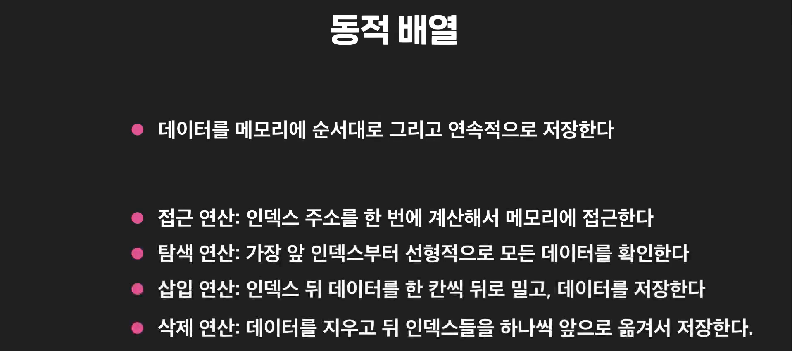
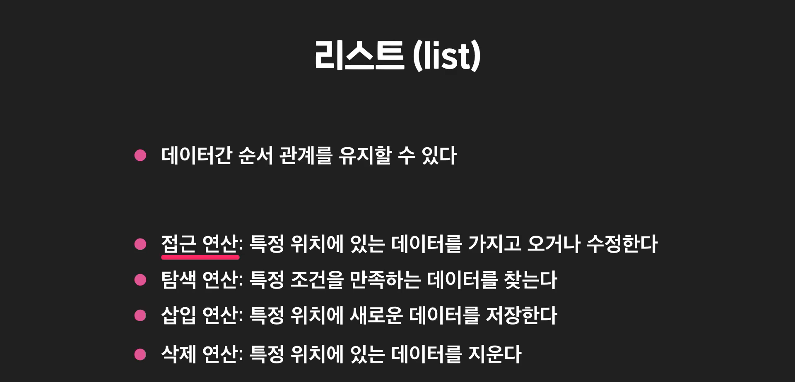
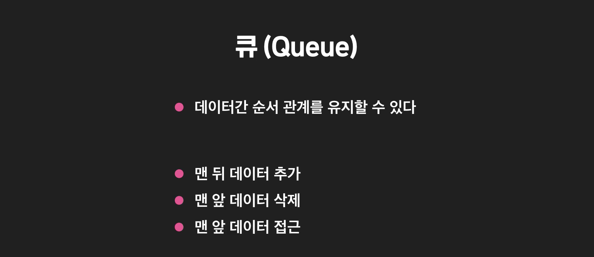

# Data Structure 4 - Abstract Data Type

추상자료형이라는 것은 어떤 기능들의 모음에 대해 지칭하는 것. 그 특정 추상자료형을 구현하기 위해서 자료구조라는 것이 존재하는 것. 예를 들어서 동적배열이나 링크드리스트는 리스트를 구현해 놓은 구현체임. 그런데 리스트를 구현한게 링크드리스트도 있고, 동적배열도 있잖아. 그러면, 그 중에서 어떤거를 쓸것인가를 또 고민할 수 있지. 파이썬의 경우는 우리가 리스트를 쓰면 자동으로 동적배열을 쓰도록 해 놓은 거고. 

어떤 **자료구조**에서도 기능만 쏙 빼놓고 생각하면 **추상자료형/인터페이스**가 되는 거야. 자료구조와 추상자료형이라는 것 자체도 경계가 모호하다. deque도 기능만 쏙 빼놓고 보면 추상자료형이지만, 구현된것을 보고 얘기하면 자료구조가 되는 것. 

- #### 기능 vs 구현

  

  기능은 연산이 "**무엇**"을 하는지에 대한 내용. 

  구현은 기능을 "**어떻게**" 하는지에 대한 내용

  


- #### 추상화

  **추상화는 구현을 몰라도, 기능만 알면 프로그래밍을 할 수 있게 해주는 개념.** 

  함수의 구현을 몰라도, 기능만 알면 함수를 충분히 사용할 수 있음. 

  

  이처럼 구현을 몰라도, 기능만 알면 사용할 수 있게 해주는 것을 "**추상화를 했다**"라고 말한다. 

  자료구조를 추상화 한것을 **추상자료형** 이라고 말한다. 

  자료형이 어떻게 구현되어있는지 몰라도, 기능만 알면 사용할 수 있게 해준 것. 

  


- #### 추상자료형 vs 자료구조

  인터페이스란 input/output의 형식을 의미한다. 인터페이스는 추상자료형까지 포괄하는 개념. 추상자료형은 기능의 집합을 의미함. 

  추상자료형은 자료구조를 추상화한 개념. 

  리스트는 기능들만 가지고 있음. 이 리스트를 어떻게 구현할 것인지는 추상자료형에 포함되지 않음. 

  

  그렇다면, 추상자료형과 자료구조의 차이는 뭘까? 동적 배열이 자료구조의 예시. 

  자료구조는 각 연산들을 구체적으로 어떻게 할거고 어떻게 구현할지까지 묶어놓은 개념. 

  

  **추상자료형은 그냥 기능만 나열한 내용이였는데, 자료구조는 구체적으로 구현까지 포함한 개념.**

   동적배열은 리스트의 모든 기능**(접근/탐색/삽입/삭제)**을 가지고 있음. 

  **" 리스트는 동적배열로 구현할 수 있다."** 

  **"링크드 리스트도 리스트를 구현할 수 있다."**

  그러니깐 리스트라는 추상 자료형을 동적배열이라는 자료구조로 구현할 수도 있고, 링크드 리스트라는 자료구조로 구현할 수도 있다. 

  

  그러면, 동적배열과 링크드 리스트 중에 뭘 사용해서 구현해야 하는 걸까? 이건 상황마다 다르겠지. 

  *근데 자료구조만 알면 될것 같은데, 추상자료형은 왜 배우는 걸까?*

  프로그래밍을 할 때, 자료구조를 떠올리는것 보다 추상자료형을 떠올리는게 편함. 

  예를 들어, *데이터를 메모리에 순서대로 저장하고 바꾸고 싶다.* 라는 것을 떠올리는 것은 쉽지만, 매번 구현까지 생각할수는 없어. 너무 복잡해. 

  그러니깐 구현이라는걸 생각 안해도 되는 리스트를 먼저 생각하게 되는 것. 

  

  

  


- #### 추상자료형 vs 자료구조 현실 비유

  **추상 자료형 vs 자료 구조 현실 비유**

  추상 자료형과 자료 구조의 차이를 좀 더 현실에 가까운 예시를 들어서 설명해 볼게요.

  사실 우리는 프로그래밍할 때 말고 실생활에서도 많은 물건들이나 개념들을 추상화해서 사용합니다. 남녀노소 누구나 가지고 있는 “핸드폰”도 추상화의 한 예시인데요.

  “핸드폰”이라는 개념을 어떻게 정의할 수 있을까요? 주변을 보면 핸드폰인 많은 물건들은 있지만 딱 “핸드폰은 X다”라고 하기 쉽지가 않습니다. 한 번 핸드폰의 가장 기본적인 기능들을 정리해서 핸드폰이 뭔지 간단하게 정의해볼게요.

  핸드폰은:

  특징

  - 전기선 없이 이곳저곳 들고 다닐 수 있다

  행동

  - 전화를 걸 수 있다
  - 전화를 받을 수 있다
  - 문자 메시지를 보낼 수 있다
  - 문자 메시지를 받을 수 있다

  이런 기능들을 갖는 것입니다. 핸드폰이 뭔지 물어봤을 때 딱 정확히 손가락으로 가리켜서 “이거다”라고 하기는 힘들지만 “저 기능들을 갖는 어떤 것이다”라고는 얘기할 수 있는 거죠.

  조금 다르게 생각해보면 저 기능들을 갖는 존재들을 다 핸드폰이라고도 할 수도 있습니다. 기술적으로 어떻게 구현했는지는 기계가 핸드폰인지 아닌지와 전혀 상관이 없습니다. 그러니까 핸드폰은 구현은 없고 기능으로만 정의한 개념인 **추상 자료형**과 비슷한 거죠.

  추상 자료형을 핸드폰에 비유할 수 있으면, 자료 구조는 뭐에 비유할 수 있을까요? 자료 구조는 핸드폰의 기능들을 가지고 있는 기계 모델들에 비유할 수 있습니다.

  아이폰 6s, 삼성 갤럭시 S10, LG v50 이렇게 특정 방식에 의해서 전화와 문자를 보내거나 받을 수 있는 것들이 자료 구조에 해당하는 거죠.

  실제로 어떤 모델 또는 회사인지에 따라 부수적으로 갖는 기능들도 다를 수도 있고 전화를 거는 구체적인 방식이 모두 다를 수는 있긴 합니다. 하지만 핸드폰의 모든 기능들을 모두 갖고 있습니다. 실질적으로 “핸드폰”의 기능을 모두 할 수 있으면, 그러니까 핸드폰을 “구현”하고 있으면 핸드폰이라고 부르고 사용할 수 있는 거죠.

  여러분들은 평소에 여러분의 핸드폰에 대해 어떤 식으로 얘기를 하시나요? “내 핸드폰 어딨지?”, “너 핸드폰 번호 뭐야?” 이런 식으로 실제 사용하는 핸드폰의 모델명 대신, 추상화해서 핸드폰이라고 표현하면서 사용하는 경우가 많을 텐데요. 물론 “내 갤럭시 S10” 어딨지 이런 식으로 구체적인 모델 이름을 사용해도 틀린 건 아니지만 일반적으로 그렇게 얘기하지는 않죠?

  **컴퓨터 과학에서 추상 자료형**

  추상 자료형의 개념도 똑같습니다. 추상 자료형 리스트에 대해서 생각해봅시다.

  특징

  - 데이터 사이 순서 관계를 유지할 수 있다

  연산

  - 접근 연산: 특정 위치에 있는 데이터를 가지고 오거나 수정할 수 있다
  - 탐색 연산: 특정 조건을 만족하는 데이터를 찾을 수 있다
  - 삽입 연산: 특정 위치에 새로운 데이터를 저장해줄 수 있다
  - 삭제 연산: 특정 위치에 데이터를 지울 수 있다

  핸드폰이라는 **추상적인 개념과 똑같이 이런 특징과 연산들을 가지는 존재를 “리스트”**라고 부르는 겁니다. 여러분들이 핸드폰을 찾을 때 “내 핸드폰 어딨지“ 이런 식으로 얘기하는 것처럼, 데이터를 저장하고 사용할 때도 “**리스트를 사용해야겠다!**”이런 식으로 추상적으로 얘기할 수 있는 거죠.

  **추상 자료형 vs 자료 구조 뭐가 더 중요할까?**

  추상 자료형과 자료 구조는 뭐가 더 중요한 건 없습니다. 그냥 서로 다른 개념이죠. 기능을 중점적으로 얘기하고 싶을 때나, 흐름을 생각할 때와 같이 구현에 집중할 필요가 없을 때 추상 자료형을, 그리고 코드의 성능을 분석하거나 최적화 시켜야 될 때나 (성능을 최대로 끌어올리고 싶을 때) 자료 구조를 중심적으로 생각하면 됩니다.

  핸드폰이라는 개념과 단어가 우리한테 굉장히 중요하고 널리 쓰이는 거 만큼, 정확히 어떤 핸드폰을 쓰는지, 그러니까 아이폰 6s, 삼성 갤럭시 S10, LG v50 중에 어떤 모델을 쓰는지도 많은 사람들한테 굉장히 중요합니다.

  그러니까 아이폰 6s보다는 아이폰 11 pro가 훨씬 빠르고, LG v50는 화면이 두 개고, 삼성 갤럭시 노트는 화면이 크고… 이런 구체적인 핸드폰의 세부 구현들도 핸드폰이라는 개념만큼 중요하다는 말이죠.

  컴퓨터 과학을 공부하는 우리에게 추상 자료형들과 자료 구조들의 개념이 모두 중요한 거랑 비슷하죠.

  추상적 자료형 : **기능의 집합**

  자료구조 : **추상적 자료형이 정의한 연산들을 구현한 구현체**

  > 리스트 라는게 어떤 실체가 아니였던 것. 그냥 기능들의 집합을 우리가 어떤 실체가 있는 것처럼 생각했던 것. A기능+B기능 = 리스트. 이런식으로 생각하고 있었던 것. 자료구조는 그 리스트를 구현하기 위한 구현체들을 의미함. 레고조각인거지. 

  인터페이스 라는 것은, 입출력 형식을 의미한다. **입출력 형식**이란 어떤 함수에 a를 넣고, b가 나오고 이런 것들을 의미. 그 입출력 되는 과정에서 어떤 함수의 기능이 더해지겠지. 그래서 입출력 형식이라는게 즉 **기능**을 말하는 것. 

  그럼 *함수의 인터페이스*는 넣는 Input과 나오는 Output을 의미하는데 *클래스의 인터페이스*는 뭘까? 그 내부에 있는 메소드들의 넣는값/빼는 값들의 총칭을 의미하겠지. 

  우리는 이제 사용하면서 list같이 넣는 인터페이스(input/output)만 알고서 추상자료형 사용하지. 그런데, 그 추상자료형 이라는것은 어떤 실체가 아니야. 우리는 **기능**만 알고 사용하는거야. 실제로는 그것을 어떤 방식으로 구현해 놨겠지. 그게 바로 **자료구조**야(자료구조라는게 클래스로 되어 있으니깐 자료구조의 인터페이스가 같다는 말은 그 클래스의 인터페이스가 같다는 말이 되겠지).


- #### 리스트의 개념

  

  파이썬은 추상화가 굉장히 많이 된, 고수준의 언어. 즉, 개발자들이 구현보다 기능에 집중할 수 있게 해준다는 뜻. 

  파이썬에서 우리가 생각하던 자료형들은 대부분 다 추상자료형이였음. 내부가 동적배열인지 링크드 리스트인지 어떻게 되있는지 생각 안하고, 기능만 알고 사용하고 있었던 것. 

  

  일단 리스트를 생각해 보자. 리스트라는 추상자료형은, 4가지 "**접근, 탐색, 삽입, 삭제**"를 약속한다. 

  먼저 **삽입 연산**

  

  그리고, **접근 연산**

  

  **탐색 연산**  

  

  **삭제 연산**

  

  물론 파이썬 리스트는 기능이 많지. 다만, **리스트**라는 추상자료형이 약속하는 것은 이 네가지이며, 리스트라는 말 자체가 이 4가지 기능을 일컫는 것. 

  우리는 리스트의 기능만 알고 사용한다. 구현은 몰라 우리도. 


- #### 리스트 구현 

  우리가 배웠던 자료구조 중에 리스트를 구현할 수 있는 것은 2가지. **동적배열**과 **링크드리스트**. 

  그럼 두 자료구조중 뭘 사용해야 할까?

  

  서로 효율적으로 연산할 수 있는 것들이 다름. 

  

  리스트를 사용하고 싶을 때 둘 중 어느 자료구조를 골라야 할까? 어떤 기능을 많이 사용할지를 생각해야 함. 

  각 자료형에서 많이 사용할 연산들의 시간복잡도를 비교해서 고르면 된다. 

  다만, 파이썬 리스트는 내부적으로 동적 배열 위주로 구현되어 있긴 함. 

  


- #### 큐 개념

  큐도 리스트와 마찬가지로 데이터간의 순서를 약속하는 추상자료형. 한국어로 큐는 "**대기열**"

  마트 계산대 대기열 생각해보면, 가장 뒤에서 삽입되고 앞에서 삭제되지. 

  FIFO(First In First Out - 가장 먼저 들어온 데이터가 가장 먼저 삭제된다)

  

  

  그럼 큐는 어떤 연산을 약속할까?

  

  파이썬에서는 deque라는 것을 이용해서 큐를 쓸 수 있다. 파이썬 Deque는 맨 앞과 맨 뒤에서 삽입과 삭제를 모두 할 수 있게 해주는 자료형 

  

  코드를 봐보면, 

  **맨 뒤 삽입 연산**

  

  **맨 앞 접근 연산**
  
  ```python
  queue[0]
  ```

  맨 앞 데이터 삭제 

  ````python
  queue.popleft()
  ````
  
  
  
- #### 큐 구현

  > 링크드리스트 같은 경우는 애초에 리스트 말고도 큐도 구현해 놓은 것. 
  >
  > 동적배열은 리스트를 구현해 놓은 것은 맞는데, 몇개 더해서 큐를 구현할 수있다는 것. 
  >
  > 인터페이스라는 것을 구현하기 위해서 꼭 하나의 자료구조만 쓰는게 아니야. 

  링크드리스트와 동적배열은 리스트라는 추상자료형을 구현해놓은 구현체인것은 맞음. 

  큐는 데이터의 순서를 유지시켜주는 추상자료형. 

  

  

  

  더블리 링크드 리스트가 더 효율적이겠지. 

  그래서 파이썬에서 큐로 사용하는 `deque`도 내부적으로는 더블리 링크드 리스트로 구현되어 있는 것. 

  


- #### 스택 개념

  스택 또한, 큐나 리스트와 마찬가지로 데이터간의 순서를 약속하는 추상 자료형. 

  

  스택은 쌓여있는 접시야. 데이터를 맨 끝에 추가하고, 맨 끝에서 삭제를 약속함. 

  

  

  이것도 deque를 이용해서 스택을 사용할 수 있음. 

  

  스택 **맨 끝에 데이터 추가 연산**

  

  **맨 끝 데이터 접근 연산**

  

  **맨 끝 데이터 삭제**

  

   

- #### 스택 구현

  스택도 두가지를 이용해서 구현 가능. 

  

  

  시간 복잡도 상으로는 둘중에 뭘로 구현해도 상관이 없음. 

  

  파이썬 리스트가 동적배열로 되어 있음. 그래서 stack을 사용할때는 이렇게 사용해도 됨. 

  

  빈 리스트를 써도 똑같이 효율적이라는 것. 

  *위에서 했던 것에서 메소드 까지 똑같음.* 

- #### 딕셔너리

  추상자료형으로서의 딕셔너리는 아래의 기능들을 의미함. 

  

  파이썬의 딕셔너리는 추상자료형의 이름 자체를 그대로 가지고 와서 사용한 경우. 

  

  한 키에 여러개의 value를 저장하면? 수정되는 것. 

  

  

  딕셔너리는 뭘로 구현할까?

  딕셔너리라는 추상자료형을 생각해보고, 뭘로 구현해볼까? 라는 구현체를 생각해보면 해시테이블로 할 수 있겠지. 

  실제로 파이썬 딕셔너리도 해시테이블로 구현되어 있음. 

  


- #### 세트 개념

  다음은 추상자료형 세트. 

  

  저장.

  

  중복데이터 저장하려고 하면, 그냥 아무것도 안일어남. 에러도 안남. 

  탐색 연산. 

  

  

- #### 세트 구현

  그럼 이 세트라는 추상자료형도 뭔가로 되어있겠지. 우리가 배운 자료구조 중에서 뭔가로도 되있을 것이고, 파이썬에서 쓰는 set자체도 이미 구현을 해놓은 것. 

  꼭 그래야 하는 것은 아니지만 세트는 보통 **해시테이블**을 사용해서 구현함. 

  해시테이블은 보통 key-value쌍을 저장하는데, 거기서 key만 저장하도록 바꾼 것. 

  

  해시테이블의 탐색과 삭제 연산은 value와 아무상관없이 key만 써서 했었음. key만 저장을 해도 그래서 아무 상관이 없는 것. 

  파이썬 세트도 key만 저장한 해시테이블을 사용해서 구현해 놓은 것. 

  

  

- #### 파이썬 자료형 주요 시간 복잡도 정리

  > 길이 확인의 경우 정확한 시간복잡도 계산하려면 C를 확인해야 함. 다만, 파이썬에서 알려주고 있음. 
  >
  > https://wiki.python.org/moin/TimeComplexity

  이번 노트에서는 파이썬 자료형들에서 많이 사용하는 연산들의 시간 복잡도를 정리해볼게요. 이 시간 복잡도를 바탕으로 파이썬 자료형들을 사용할 때 얼마나 효율적으로 하는지를 떠올릴 수 있겠죠? 혹시나 까먹으시면 필요할 때 언제든지 다시 와서 참고하세요!

  **리스트 (동적 배열)** - 동적배열로 구현되어 있음 in python 

  | 연산       | 예시                             | 시간 복잡도      |
  | :--------- | -------------------------------- | ---------------- |
  | 접근       | `list_1[0]`, `list_1[0] = 5`     | O(1)             |
  | 추가       | `list_1.append(2)`               | O(1) (분할 상환) |
  | 맨 뒤 삭제 | `list_1.pop()`                   | O(1) (분할 상환) |
  | 길이 확인  | `len(list_1)`                    | O(1)             |
  | 삽입       | `list_1.insert(3,` `"성태호")`   | O(n)             |
  | 삭제       | `del list_1[0]`, `list_1.pop(3)` | O(n)             |
  | 탐색       | `"이재하"` `in list_1`           | O(n)             |

  **deque (더블리 링크드 리스트)**

  | 연산       | 예시                           | 시간 복잡도 |
  | ---------- | ------------------------------ | ----------- |
  | 맨 앞 삭제 | `deque_1.popleft()`            | O(1)        |
  | 맨 앞 삽입 | `deque_1.appendleft("김신의")` | O(1)        |
  | 맨 뒤 삭제 | `deque_1.pop()`                | O(1)        |
  | 맨 뒤 삽입 | `deque_1.append("이규식")`     | O(1)        |
  | 길이 확인  | `len(deque_1)`                 | O(1)        |

  **딕셔너리 (해시 테이블)**

  | 연산      | 예시                                           | 시간 복잡도 |
  | --------- | ---------------------------------------------- | ----------- |
  | 탐색      | `dict_1["성태호"]`                             | O(1) (평균) |
  | 삽입      | `dict_1["강영훈"] = 100`                       | O(1) (평균) |
  | 삭제      | `del dict_1["강영훈"]`, `dict_1.pop("강영훈")` | O(1) (평균) |
  | 길이 확인 | `len(dict_1)`                                  | O(1)        |

  **세트 (해시 테이블)**

  | 연산      | 예시                                           | 시간 복잡도 |
  | --------- | ---------------------------------------------- | ----------- |
  | 탐색      | `"최지웅" in set_1`                            | O(1) (평균) |
  | 삽입      | `set_1.add("손동욱")`                          | O(1) (평균) |
  | 삭제      | `set_1.remove("김현승")` `set_1.pop("김현승")` | O(1) (평균) |
  | 길이 확인 | `len(set_1)`                                   | O(1)        |


- #### 파이썬 자료형 잘 고르기 

  **리스트**

  파이썬 리스트는 굉장히 활용 범위가 큰 자료형입니다. 프로그래밍을 할 때 사실상 리스트만 사용하면 대부분의 경우 필요한 기능을 모두 사용할 수 있죠. 너무 사용 가능 범위가 넓다 보니까 어떤 다른 자료형을 사용할지 생각하지 않고 바로 리스트를 사용해 버리는 경우가 많은데요. **무조건 리스트를 사용해버리면 효율적으로 프로그래밍을 하기 힘듭니다.**

  이게 무슨 말인지 안 와닿을 수도 있는데요. 코드 예시를 하나 볼게요.

  **바로 리스트를 사용할 때**

  여러 개의 데이터(정확히는 0부터 999999까지의 정수)를 저장한 후, 특정 데이터를 탐색하는 코드를 써볼 건데요. 대부분의 상황과 비슷하게 동적 배열로 구현돼 있는 파이썬 리스트를 사용하면 원하는 코드를 쓸 수 있습니다. 바로 해볼게요.

  ```python
  # 예시를 위해 사용할 모듈 import
  import time
  
  # 데이터를 리스트에 저장한다
  test_list = [x for x in range(0, 1000000)]
  
  # 특정 항목이 리스트에 있는지 확인할 때 걸리는 시간 파악
  t_0 = time.time()
  999999 in test_list # 리스트 탐색
  t_1 = time.time()
  
  print(f"리스트에서 특정 항목을 찾는데 걸린 시간: {t_1 - t_0}")
  ```

  먼저 파이썬 리스트에 0부터 999999까지의 정수 데이터를 저장했습니다. 딱히 순서 데이터가 필요한 건 아닌데요. 그냥 구체적으로 어떤 연산이 필요한지 생각하지 않고 생각해내기 가장 쉬운 리스트를 사용한 거죠. 여기 999999가 저장되었는지 키워드 `in`을 사용해서 확인을 해봅시다. 특정 데이터가 자료형 안에 있는지 탐색을 하는 거죠. 이때 파이썬의 `time` 모듈을 이용해서 시작할 때의 시간과 코드가 끝날 때의 시간을 받아올게요. 두 시간의 차이는 탐색 코드가 실행되는데 걸리는 시간이죠?

  ```
  리스트에서 특정 항목을 찾는데 걸린 시간: 0.013087987899780273
  ```

  시간이 0.013초 정도 걸리네요.

  **구체적으로 어떤 기능이 필요한지 생각해서 세트를 쓰는 경우**

  정확히 똑같은 기능을 파이썬 리스트가 아닌 세트를 통해서 해볼게요.

  ```python
  # 예시를 위해 사용할 모듈 import
  import time
  
  # 데이터를 set에 저장한다
  test_set = set([x for x in range(0, 1000000)])
  
  # 특정 항목이 set에 있는지 확인할 때 걸리는 시간 파악
  t_0 = time.time()
  999999 in test_set
  t_1 = time.time()
  
  print(f"세트에서 특정 항목을 찾는데 걸린 시간: {t_1 - t_0}")
  ```

  코드를 돌려보면…

  ```
  set에서 특정 항목을 찾는데 걸린 시간: 3.0994415283203125e-06
  ```

  0.00000309초가 걸렸습니다.

  **파이썬 리스트와 세트 비교**

  0.013초와 0.00000309초… 엄청 큰 차이가 아니라고 느껴지실 수도 있는데요. 지금은 탐색 연산을 한 번만 하지만 보통 많은 프로그램들은 이 연산을 반복적이게 하는 경우가 대부분인데요. 이 연산을 1000번 해야 되면 파이썬 리스트는 대략 13초가 걸리고 세트는 0.00309초가 걸립니다. 차이가 느껴지시죠?

  **파이썬 자료형을 잘 고른다는 것**

  자료형을 잘 고른다는 것은 현재 자신이 데이터에 하고 싶은 연산들이 뭐가 있고 얼마나 걸릴지에 대해서 잘 생각하는 겁니다. 초급자의 수준을 넘어서기 위해서는 파이썬 자료형 뒤에 가려진 자료 구조를 떠올릴 수 있어야 됩니다. 자료 구조를 떠올리면 각 연산의 시간 복잡도를 떠올릴 수 있기 때문이죠.

  위의 예시를 생각해볼게요. 리스트와 세트 모두 데이터를 저장할 수 있고, 저장한 데이터를 탐색할 수 있는 자료형입니다. 근데 리스트는 동적 배열, 세트는 해시 테이블로 구현돼 있죠?

  | 시간 복잡도 | 파이썬 리스트(동적 배열) | 파이썬 세트(해시 테이블) |
  | ----------- | ------------------------ | ------------------------ |
  | 탐색 연산   | O(n)                     | O(1)                     |

  그럼 위 표에서처럼, 쓰고 싶은 연산의 시간 복잡도를 생각해낼 수 있어야 된다는 거죠. 바로 이 차이가 위에서 본 리스트와 세트를 쓸 때 시간 차이를 만든 겁니다.

  세트뿐만 아니라 파이썬 deque를 쓸 때도 마찬가지죠. 더블리 링크드 리스트 연산들의 시간 복잡도를 생각할 수 있어야 되고 이 시간 복잡도를 바탕으로 파이썬 리스트와 비교해서 어떤 자료형을 쓸지를 정할 수 있어야 됩니다.

  **결론**

  프로그램이 아무리 좋은 기능을 갖고 있고 좋은 아이디어여도 클릭을 했을 때 13초를 기다려야 되면 사용하기 쉽지 않습니다. 반면 0.00309초면… 일반 사람들은 느낄 수도 없을 정도의 짧은 순간이죠.

  파이썬에서 어떤 자료형을 사용할 건지 잘 고르는 건 결국 어떤 자료 구조를 쓸 건지 고르는 것과 비슷합니다. 데이터에 어떤 관계가 필요하고 어떤 기능들을 사용할 건지 잘 생각하면 더 효율적인 프로그램을 쓸 수 있습니다.