# Data Structure 4 - Tree

- #### 계층적 관계

  트리는 데이터의 상-하 관계를 저장하는 구조. 

  

  그럼 상하관계라는 것은 무엇일까?

  상하관계는 조금 더 멋있는 표현으로 계층적 관계라고도 함. 예시로 회사 임직원들의 데이터를 봐보자. 

  아래와 같은 위 아래 관계를 상하관계 - 계층적관계라고 부른다. 

  

  

  계층적 관계가 있는 것은 어떻게 저장하고 사용해야 할까?

  배열, 링크드리스트는 계층적 관계가 아님. 선형적 구조인지라, 계층적 구조를 저장하기에 적합하지 않음. 해시테이블도 마찬가지. 

  

  **이번 토픽에서 배우는 트리를 통해서 이런 계층적 관계들을 저장하고 활용하는 다양한 방법들을 배우게 될 것.** 

  

- #### 트리란?

  링크드 리스트는 여러개의 데이터를 순서대로 저장하는 자료구조 였음. 노드가 기본 단위였음. 하나의 노드는 저장하려는 데이터와 다음 순서(혹은 이전순서까지)의 레퍼런스를 가지고 있었음. 즉, 여러 데이터 사이의 **앞과 뒤** 라는 순서를 저장할 수 있다는 말. 

  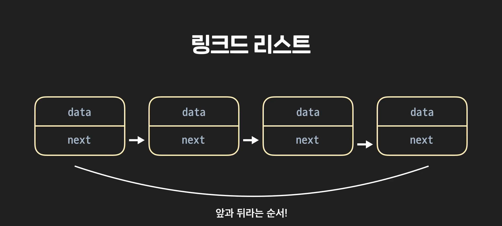

  트리 또한 링크드리스트와 똑같이 여러개의 **노드**로 이루어져 있다. 트리노드도 데이터를 저장하는 하나의 단위. 

  노드 A에 2가 저장되어 있다고 해보자. 그리고, 3이 저장된 B, 5가 저장된 C를 만들었다. 

  

  링크드리스트는 다음 노드를 가리키는 레퍼런스를 가지고 있었다. 트리 노드는 하위 관계를 가리키는 레퍼런스를 가지고 있음. **자식노드**. A에 B와 C를 가리키는 레퍼런스를 저장한다. 

  

  이렇게 아래로 뻗어나가는 구조를 만들 수 있지. 

  트리에서도 맨 꼭대기에 있는 노드는 특별하게 관리한다. Root 노드라고 부른다. 

  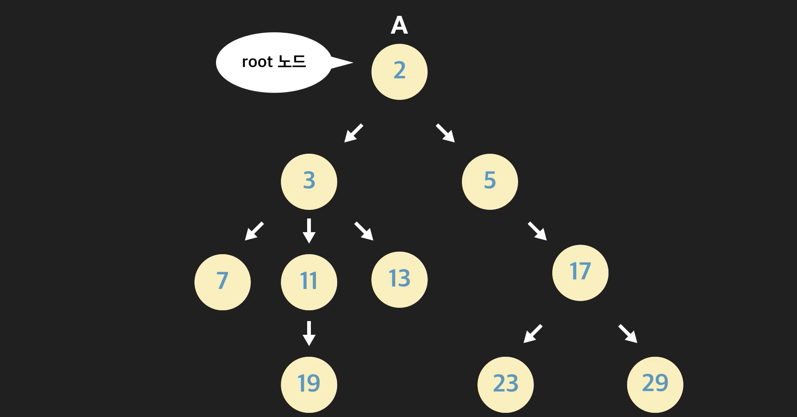

  

- #### 트리 용어

  트리에 대해서 더 깊이 배우기 전에 꼭 알아야하는 트리 관련 용어들을 배우고 갈게요. 앞으로 이 용어들을 다음 레슨들에서 자주 사용할 거니까 꼭 이해하고 외워두세요.

  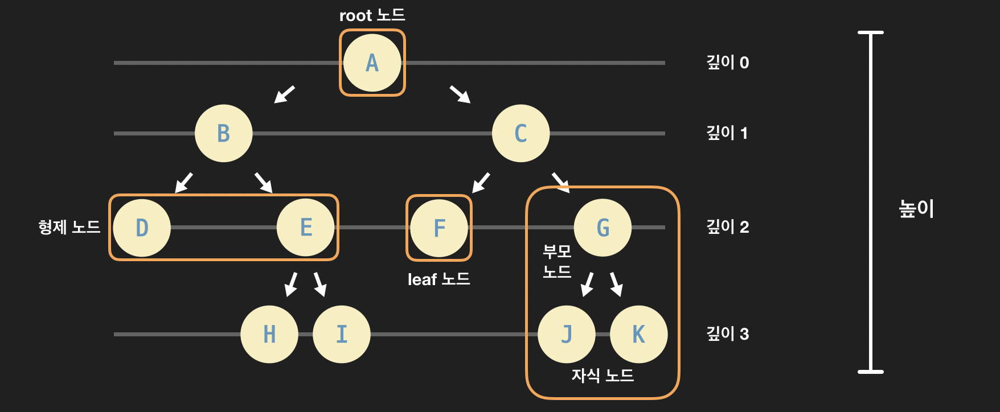

  - **root 노드(뿌리 노드)**: 트리의 시작 노드, 뿌리가 되는 노드를 말합니다. 보통 트리를 표현할 때 위 그림처럼 가장 위에 root 노드를 놓는 방식으로 나타냅니다.

  - **부모 노드**: 특정 노드의 **직속** 상위 노드입니다. 노드 G, J, K가 있는 노란색 박스를 살펴보면 G가 J와 K의 부모 노드입니다.

  - **자식 노드**: 특정 노드의 **직속** 하위 노드입니다. 부모 노드와 반대되는 개념인데요. 노드 G, J, K가 있는 노란색 박스를 살펴보면 J와 K가 G의 자식 노드입니다.

  - **형제 노드**: 같은 부모를 갖는 노드입니다. D와 E는 둘다 그 부모가 B죠? 이럴 때 D와 E는 서로 형제 노드입니다.

  - **leaf 노드** (잎/말단 노드): 자식 노드를 갖고 있지 않은, 가장 말단에 있는 노드입니다. 트리의 끝에 있다고 해서 root(뿌리) 노드와 반대되는 표현으로 leaf(잎) 노드라고 부릅니다. 위 그림에서 노란색 박스로 둘러싼 F가 leaf 노드입니다. F뿐만 아니라 D, H, I, J, K 모두 leaf 노드입니다.

  - **깊이**: 특정 노드가 root 노드에서 떨어져 있는 거리입니다. 깊이는 해당 노드로 가기 위해서 root 노드에서 몇 번 아래로 내려와야 하는지를 나타냅니다. 예를 들어 위 그림에서 root 노드의 자식 노드인 B와 C는 깊이가 1입니다. D, E, F, G는 깊이가 2이고, H, I, J, K는 깊이가 3입니다. 결국 깊이라는 건 특정 노드가 root 노드로부터 얼마나 멀리 떨어져 있는지를 나타냅니다.

  - **레벨**: 깊이 + 1. 깊이랑 거의 똑같은 개념입니다. 그냥 깊이에 1을 더한 값이죠. 레벨 1에 있는 노드들, 레벨 2에 있는 노드들… 이런식으로 특정 깊이인 노드들을 묶어서 표현할 때 사용하는 용어입니다.

  - **높이**: 트리에서 가장 깊이 있는 노드의 깊이입니다. 위 그림의 트리에서는 H, I, J, K가 가장 깊이 있는 노드들이고 그 깊이는 모두 3입니다. 그래서 트리의 높이는 3입니다.

  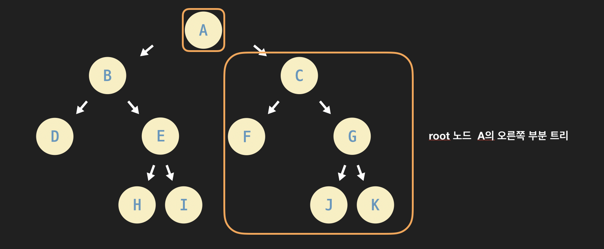

  - **부분 트리 (sub-tree)**: 현재 트리의 일부분을 이루고 있는 더 작은 트리를 말합니다. 위 그림의 트리는 root 노드가 A인 트리입니다. 그런데 이 트리를 좀더 작은 단위로 쪼개보면 더 작은 부분 트리들을 발견할 수 있습니다. 예를 들어 위 그림의 노란색 큰 박스 안을 보세요. 노란색 큰 박스 안에는 ‘C가 root 노드인 트리’가 있는데요. 이런 걸 바로 부분 트리라고 합니다. 지금 C가 A의 오른쪽 자식이죠? 그래서 노란색 큰 박스 안에 있는 부분 트리를 A의 “오른쪽 부분 트리”라고 합니다. 특정 노드를 root 노드라고 생각하고 바라본다면 여러 가지 부분 트리들을 발견할 수 있습니다. 하나의 전체 트리에 여러 부분 트리들이 존재하는 겁니다.


- #### 트리의 활용

  트리의 장점은 계층적 관계가 있는 데이터를 자연스럽게 저장할 수 있는 것. 

  트리를 활용하면 컴퓨터 과학의 다양한 문제들을 매우 기발하게 해결할 수 있다. 

  예를 들면, 정렬문제나 압축문제 같은 문제를 트리로 해결할 수 있음. 

  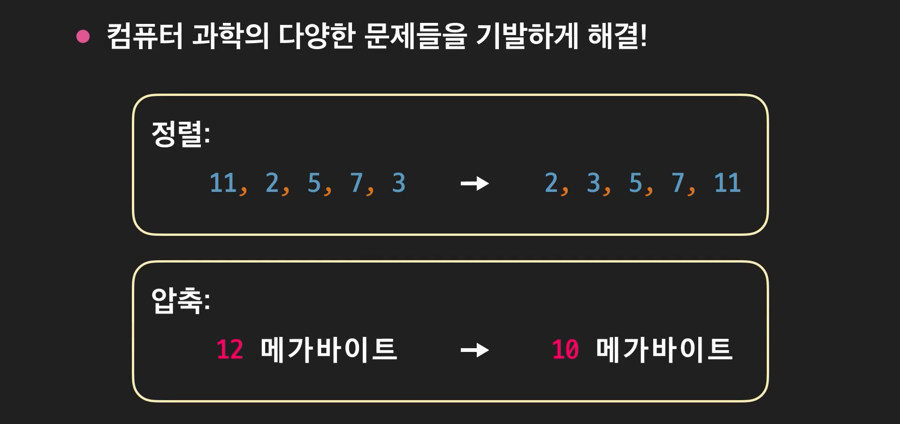

  또한 다양한 추상자료형을 구현하는데 쓸 수 있음. 

  파이썬에서 아래와 같은 것들이 트리로 구현되어있다 그런게 아니라, 트리로 아래와 같은 것들을 구현할 수 있다는 거지. 

  

  


- #### 이진트리

  트리에는 여러 종류가 있다. 생김새나 기능에 따라 다양하게 분류됨. 

  각 노드가 최대 2개의 자식만 가질 수 있으면 **이진트리**라고 부른다.

  

  자식이 최대 2개밖에 안되니깐, *왼쪽자식, 오른쪽자식* 이렇게 구분해서 말할 수 있다. 

  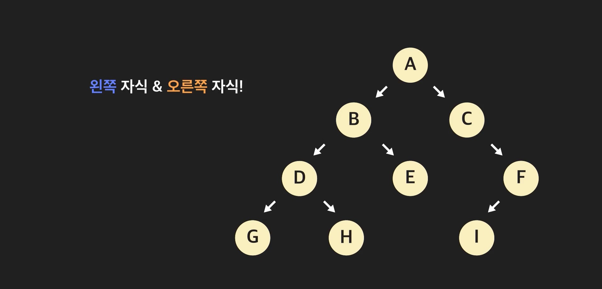

  

- #### 이진트리 구현

  > 다시 한번 짚고 가면, 자료구조란 추상자료형을 만들어 내는 자료를 저장하는 방식들. 

  아래의 이진트리를 컴퓨터로 저장하고 싶다면 어떻게 할 수 있을까?

  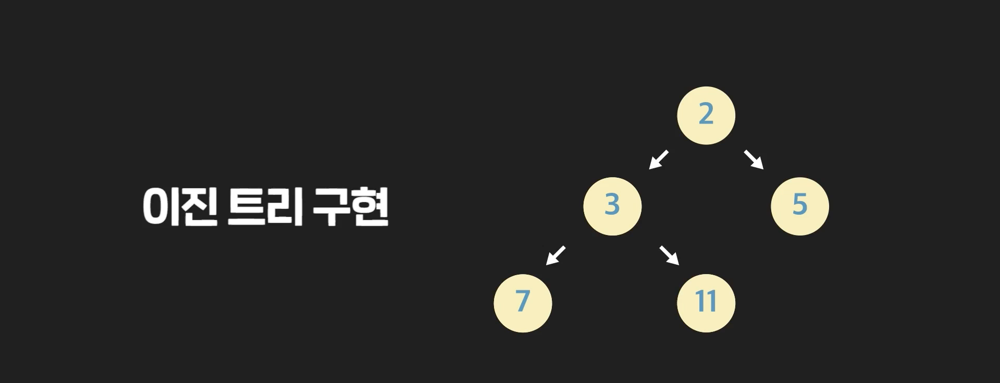

  먼저 트리의 기본 데이터단위인 노드를 만들어야 한다. 

  ```python
  class Node:
      """이진 트리 노드 클래스"""
      def __init__(self, data):
          """데이터와 두 자식 노드에 대한 레퍼런스를 갖는다"""
          self.data = data
          self.left_child = None
          self.right_child = None
  
  ```

  그 다음 일단 데이터 넣으면서 생성해주면 되지. 

  ```python
  # 노드 인스턴스 생성
  root_node = Node(2)
  node_B = Node(3)
  node_C = Node(5)
  node_D = Node(7)
  node_E = Node(1)
  ```

  이제 연결만 해 주면 돼. 

  그 다음 계층적 관계를 만들면 돼. 

  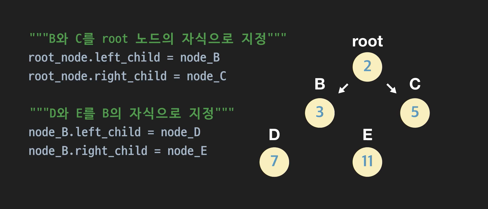

  ```python
  class Node:
      """이진 트리 노드 클래스"""
      def __init__(self, data):
          """데이터와 두 자식 노드에 대한 레퍼런스를 갖는다"""
          self.data = data
          self.left_child = None
          self.right_child = None
  
  # 노드 인스턴스 생성
  root_node = Node(2)
  node_B = Node(3)
  node_C = Node(5)
  node_D = Node(7)
  node_E = Node(1)
  
  # B와 C를 root 노드의 자식으로 지정
  root_node.left_child = node_B
  root_node.right_child = node_C
  
  # D와 E를 B 노드의 자식으로 지정
  node_B.left_child = node_D
  node_B.right_child = node_E
  
  # root 노드에서 왼쪽 자식 노드 받아오기
  test_node_1 = root_node.left_child
  
  print(test_node_1.data)
  ```

  


- #### 이진트리 종류

  트리에는 여러 종류가 있다고 했죠? 그리고 우리는 그 중 하나인 이진 트리를 배웠는데요. 사실 이진 트리도 다시 여러 종류로 분류할 수 있습니다.

  이진 트리의 종류에 어떤 것들이 있는지 살펴봅시다.

  **정 이진 트리 (Full Binary Tree)**

  먼저 “정 이진 트리”라는 게 있습니다. 영어로는 **"full binary tree"**라고 부르는데요. 모든 노드가 2개 또는 0개의 자식을 갖는 이진 트리입니다.

  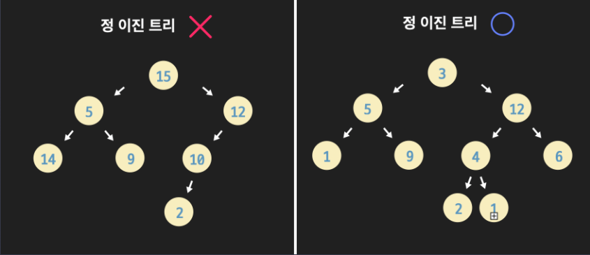

  왼쪽 그림의 이진 트리를 보면 12의 자식은 10 밖에 없습니다. 또 10은 자식이 2 밖에 없죠. 그러니까 왼쪽은 정 이진 트리가 아닙니다.

  반면에 오른쪽 그림의 이진 트리는 모든 노드가 2개 또는 0개의 자식을 갖는 걸 볼 수 있습니다. 이런 트리가 바로 정 이진 트리입니다. 별로 어렵지 않죠?

  **완전 이진 트리 (Complete Binary Tree)**

  그 다음 “완전 이진 트리”라는 게 있습니다. 영어로는 **"complete binary tree"**라고 부릅니다. 이진 트리에서 노드의 깊이를 레벨이라고 해봅시다. 이진 트리 중에서도 마지막 **레벨 직전의 레벨까지는 모든 노드들이 다 채워진 트리를 “완전 이진 트리”**라고 합니다. 그리고 한 가지 조건이 더 있는데요. 마지막 레벨에서는 노드들이 다 채워질 필요는 없더라도, 왼쪽부터 오른쪽 방향으로는 노드들이 다 채워져야 합니다.

  아래 트리는 완전 이진 트리입니다. 마지막 레벨을 제외한 모든 레벨에서 노드들이 꽉 차 있고, 마지막 레벨에서는 노드들이 왼쪽에서 오른쪽 방향으로 차 있는 거 보이시죠? 방금 말한 조건을 만족하기 때문에 완전 이진 트리인 거죠.

  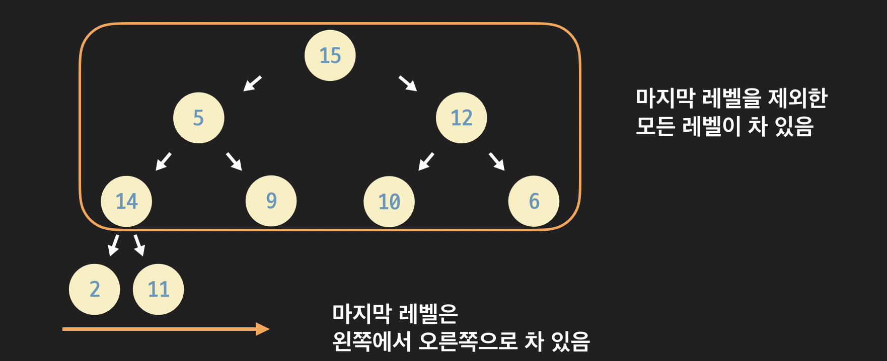

  완전 이진 트리가 아닌 트리들도 좀 볼게요.

  

  왼쪽 그림의 이진 트리를 봅시다. 레벨 4가 마지막 레벨인데 12의 오른쪽 자식이 없어서 레벨 3에 빈 부분이 생겼습니다. 마지막 레벨 직전 레벨까지는 노드로 다 채워져야 하는데 그렇지 않으므로 완전 이진 트리가 아닙니다.

  이번엔 오른쪽 그림의 이진 트리를 봅시다. 마지막 레벨 직전 레벨까지는 노드로 다 채워지긴 했습니다. 하지만 마지막 레벨에서 노드들이 왼쪽에서 오른쪽으로 가득 채워지지 않아 왼쪽에 빈 공간이 생겼습니다. 그래서 완전 이진 트리가 아닙니다.

  완전 이진 트리가 되기 위한 조건이 무엇인지 확실하게 이해하고 넘어가세요.

  **완전 이진 트리의 높이**

  완전 이진 트리에는 아주 중요한 성질이 하나 있습니다. 그건 바로 트리의 높이와 관련된 성질인데요. 완전 이진 트리 안에 저장된 노드가 n개라고 할 때, 높이는 항상 lg(n)에 비례합니다. 그림으로 표현하면 아래와 같은데요.

  

  왜 그런건지 설명할게요.

  완전 이진 트리는 마지막 레벨 직전 레벨까지는 모두 노드로 가득 채워져 있습니다. 이때 완전 이진 트리에는 노드가 모두 몇 개 있을까요?

  - 레벨 1에 1개
  - 레벨 2에 2개
  - 레벨 3에 4개
  - 레벨 4에 8개

  이런 식으로 노드 개수가 늘어나는데요. 레벨이 하나씩 증가할 때마다 이전 레벨에 있는 노드 개수의 2배를 더 담을 수 있습니다.

  이 내용을 표로 정리해볼게요.

  

  
  
  > 지금 여기서 오류 있는게, lg(5)하면 2.3얼마가 나옴. 그러면 h는 2로 나오잖아. 
  >
  > 애초에 레벨 0부터 시작하던가, 아니면 h+1을 해서 계산을 하던가 해야 함. 
  
  어쨋든 그게 중요한게 아님. 여기서 중요한 것은, log계산을 통해서 n개가 있을때 총 몇층이 있는지, m번째는 몇 층에 있는지 추측이 가능하다는 것을 알게 된게 가장 중요함. 그리고, 가장 중요한 것은 
  
  **완전이진트리**에 접근하는 시간복잡도는 **O(lg(n))**이라는 것이 가장 중요함. 
  
  
  
  **포화 이진 트리 (Perfect Binary Tree)**  		
  
  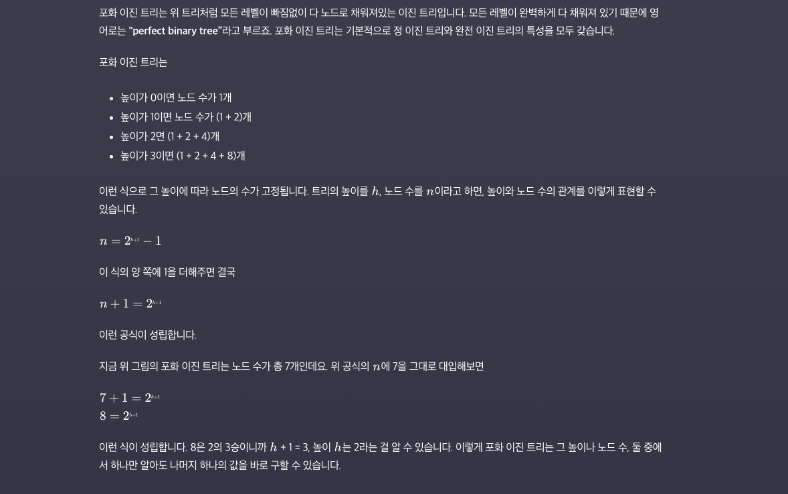


- #### 완전 이진 트리 배열로 구현하기

  **완전 이진 트리 배열 (파이썬 리스트)에 저장하기**

  이진 트리를 구현하는 방법, 기억 나시나요? 먼저 노드 클래스를 정의하고, 여러 개의 노드 인스턴스를 생성한 후, 이 인스턴스들을 서로 연결시켜서 트리를 만들었잖아요?

  이번 레슨에서는 트리를 파이썬의 리스트로 구현해보겠습니다. 하지만 이 방법은 모든 이진 트리에 쓸 수 있는 방법은 아니구요. 완전 이진 트리인 경우에만 쓸 수 있는 방법입니다.

  바로 예시를 볼게요. (완전 이진 트리가 뭔지 기억이 안 나시면 바로 전 노트를 복습하고 오세요!)

  이런 완전 이진 트리가 있다고 합시다.

  

  이 완전 이진 트리는 아래처럼 리스트에 저장할 수 있습니다.

  ```python
  complete_binary_tree = [None, 1, 5, 12, 11, 9, 10, 14, 2, 10]
  ```

  0번째 인덱스를 `None`으로 두고, 1번째 인덱스부터 root 노드를 시작으로, 그 다음에 깊이가 1인 노드들을 왼쪽에서 오른쪽 방향 순으로, 그 다음에 깊이가 2인 노드들을 왼쪽에서 오른쪽 방향 순으로 차례대로 리스트에 저장하면 됩니다.

  지금 위 그림을 보면 각 노드 위에 빨간 색의 작은 숫자가 있죠? 빨간 색 작은 숫자는 각 노드의 리스트 내에서의 인덱스를 나타냅니다. 그러니까 리스트에서 5번째 노드는 노드 9입니다.

  **자식 노드를 찾는 방법**

  이진 트리에서 각 노드는 기본적으로 자식 노드들을 가리키는 레퍼런스를 가져야합니다. 그래야 부모 노드가 자식 노드에 접근할 수 있을 테니까요? 그렇다면 이렇게 리스트에 노드들이 저장된 경우에는 부모 노드가 자식 노드에 어떻게 접근할 수 있을까요?

  트리의 이미지를 다시 봅시다.

  

  지금 2번째 노드(노드 5)의 왼쪽 자식 노드를 찾고 싶다고 합시다.

  그럼 먼저 노드의 인덱스 2에 2를 곱합니다. 4죠? 그 다음 리스트의 4번째 인덱스에 있는 노드를 찾으면 됩니다. 노드 11이 있죠? 제대로 찾았습니다.

  이런 식으로 특정 부모 노드의 왼쪽 자식 노드를 찾고 싶을 때는, **부모 노드가 저장된 인덱스에 2를 곱해준 값을 인덱스**로 생각하고 리스트에서 찾으면 됩니다.

  이번에는 3번째 노드(노드 12)의 오른쪽 자식 노드를 찾아 볼게요.

  이번에도 노드의 인덱스 3에 2를 곱합니다. 그리고 1을 더해주는데요. 그럼 7입니다. 이번에는 리스트의 7 번째 인덱스를 보면 노드 14가 있습니다. 맞게 찾았네요.

  어떤 식으로 자식 노드들을 찾을 수 있는지 이제 알겠죠?

  **부모 노드 찾기**

  비슷한 방식으로 특정 노드의 부모 노드도 찾을 수 있는데요.

  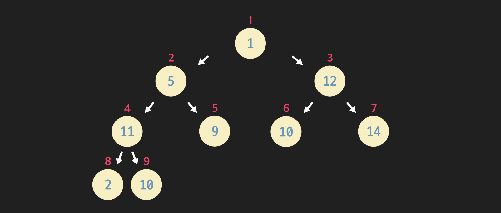

  여기서 6번째 노드(노드 10)의 부모를 찾으려면 6을 2로 나누면 됩니다. 리스트의 3번째 인덱스에 있는 노드 12를 잘 찾았네요.

  그럼 자식 노드의 인덱스가 홀수일 때는 어떻게 할까요? 7번재 노드(노드 14)의 부모 노드를 찾고 싶다고 합시다. 이때는 7을 2로 나눈 후 정수 값만 가져오면 됩니다. 그 값은 3이죠? 그럼 리스트의 3번째 인덱스에 있는 노드 12를 잘 찾을 수 있습니다.

  완전 이진 트리는 그것이 가지는 특수한 2가지 성질:

  - 마지막 레벨 직전의 레벨까지는 노드들로 가득 차 있음
  - 마지막 레벨은 왼쪽에서 오른쪽 방향으로 노드들로 가득 차 있어야 함(오른쪽은 비어있어도 되지만 왼쪽은 비어있으면 안 됨)

  때문에 이렇게 각 노드를 리스트에 저장한 후에도 부모 노드와 자식 노드를 손쉽게 찾을 수 있습니다.

- 