# Data Structure 4 - Tree

- #### 계층적 관계

  트리는 데이터의 상-하 관계를 저장하는 구조. 

  

  그럼 상하관계라는 것은 무엇일까?

  상하관계는 조금 더 멋있는 표현으로 계층적 관계라고도 함. 예시로 회사 임직원들의 데이터를 봐보자. 

  아래와 같은 위 아래 관계를 상하관계 - 계층적관계라고 부른다. 

  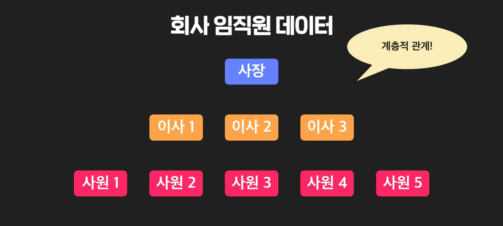

  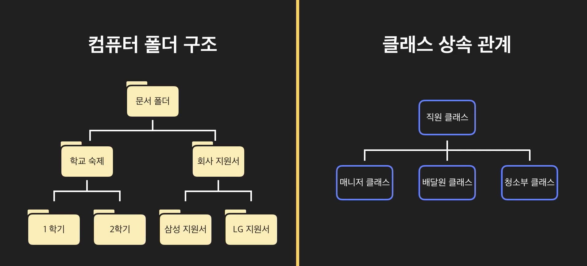

  계층적 관계가 있는 것은 어떻게 저장하고 사용해야 할까?

  배열, 링크드리스트는 계층적 관계가 아님. 선형적 구조인지라, 계층적 구조를 저장하기에 적합하지 않음. 해시테이블도 마찬가지. 

  

  **이번 토픽에서 배우는 트리를 통해서 이런 계층적 관계들을 저장하고 활용하는 다양한 방법들을 배우게 될 것.** 

  

- #### 트리란?

  링크드 리스트는 여러개의 데이터를 순서대로 저장하는 자료구조 였음. 노드가 기본 단위였음. 하나의 노드는 저장하려는 데이터와 다음 순서(혹은 이전순서까지)의 레퍼런스를 가지고 있었음. 즉, 여러 데이터 사이의 **앞과 뒤** 라는 순서를 저장할 수 있다는 말. 

  

  트리 또한 링크드리스트와 똑같이 여러개의 **노드**로 이루어져 있다. 트리노드도 데이터를 저장하는 하나의 단위. 

  노드 A에 2가 저장되어 있다고 해보자. 그리고, 3이 저장된 B, 5가 저장된 C를 만들었다. 

  

  링크드리스트는 다음 노드를 가리키는 레퍼런스를 가지고 있었다. 트리 노드는 하위 관계를 가리키는 레퍼런스를 가지고 있음. **자식노드**. A에 B와 C를 가리키는 레퍼런스를 저장한다. 

  

  이렇게 아래로 뻗어나가는 구조를 만들 수 있지. 

  트리에서도 맨 꼭대기에 있는 노드는 특별하게 관리한다. Root 노드라고 부른다. 

  

  

- #### 트리 용어

  트리에 대해서 더 깊이 배우기 전에 꼭 알아야하는 트리 관련 용어들을 배우고 갈게요. 앞으로 이 용어들을 다음 레슨들에서 자주 사용할 거니까 꼭 이해하고 외워두세요.

  

  - **root 노드(뿌리 노드)**: 트리의 시작 노드, 뿌리가 되는 노드를 말합니다. 보통 트리를 표현할 때 위 그림처럼 가장 위에 root 노드를 놓는 방식으로 나타냅니다.

  - **부모 노드**: 특정 노드의 **직속** 상위 노드입니다. 노드 G, J, K가 있는 노란색 박스를 살펴보면 G가 J와 K의 부모 노드입니다.

  - **자식 노드**: 특정 노드의 **직속** 하위 노드입니다. 부모 노드와 반대되는 개념인데요. 노드 G, J, K가 있는 노란색 박스를 살펴보면 J와 K가 G의 자식 노드입니다.

  - **형제 노드**: 같은 부모를 갖는 노드입니다. D와 E는 둘다 그 부모가 B죠? 이럴 때 D와 E는 서로 형제 노드입니다.

  - **leaf 노드** (잎/말단 노드): 자식 노드를 갖고 있지 않은, 가장 말단에 있는 노드입니다. 트리의 끝에 있다고 해서 root(뿌리) 노드와 반대되는 표현으로 leaf(잎) 노드라고 부릅니다. 위 그림에서 노란색 박스로 둘러싼 F가 leaf 노드입니다. F뿐만 아니라 D, H, I, J, K 모두 leaf 노드입니다.

  - **깊이**: 특정 노드가 root 노드에서 떨어져 있는 거리입니다. 깊이는 해당 노드로 가기 위해서 root 노드에서 몇 번 아래로 내려와야 하는지를 나타냅니다. 예를 들어 위 그림에서 root 노드의 자식 노드인 B와 C는 깊이가 1입니다. D, E, F, G는 깊이가 2이고, H, I, J, K는 깊이가 3입니다. 결국 깊이라는 건 특정 노드가 root 노드로부터 얼마나 멀리 떨어져 있는지를 나타냅니다.

  - **레벨**: 깊이 + 1. 깊이랑 거의 똑같은 개념입니다. 그냥 깊이에 1을 더한 값이죠. 레벨 1에 있는 노드들, 레벨 2에 있는 노드들… 이런식으로 특정 깊이인 노드들을 묶어서 표현할 때 사용하는 용어입니다.

  - **높이**: 트리에서 가장 깊이 있는 노드의 깊이입니다. 위 그림의 트리에서는 H, I, J, K가 가장 깊이 있는 노드들이고 그 깊이는 모두 3입니다. 그래서 트리의 높이는 3입니다.

  

  - **부분 트리 (sub-tree)**: 현재 트리의 일부분을 이루고 있는 더 작은 트리를 말합니다. 위 그림의 트리는 root 노드가 A인 트리입니다. 그런데 이 트리를 좀더 작은 단위로 쪼개보면 더 작은 부분 트리들을 발견할 수 있습니다. 예를 들어 위 그림의 노란색 큰 박스 안을 보세요. 노란색 큰 박스 안에는 ‘C가 root 노드인 트리’가 있는데요. 이런 걸 바로 부분 트리라고 합니다. 지금 C가 A의 오른쪽 자식이죠? 그래서 노란색 큰 박스 안에 있는 부분 트리를 A의 “오른쪽 부분 트리”라고 합니다. 특정 노드를 root 노드라고 생각하고 바라본다면 여러 가지 부분 트리들을 발견할 수 있습니다. 하나의 전체 트리에 여러 부분 트리들이 존재하는 겁니다.


- #### 트리의 활용

  트리의 장점은 계층적 관계가 있는 데이터를 자연스럽게 저장할 수 있는 것. 

  트리를 활용하면 컴퓨터 과학의 다양한 문제들을 매우 기발하게 해결할 수 있다. 

  예를 들면, 정렬문제나 압축문제 같은 문제를 트리로 해결할 수 있음. 

  

  또한 다양한 추상자료형을 구현하는데 쓸 수 있음. 

  파이썬에서 아래와 같은 것들이 트리로 구현되어있다 그런게 아니라, 트리로 아래와 같은 것들을 구현할 수 있다는 거지. 

  

  


- #### 이진트리

  트리에는 여러 종류가 있다. 생김새나 기능에 따라 다양하게 분류됨. 

  각 노드가 최대 2개의 자식만 가질 수 있으면 **이진트리**라고 부른다.

  

  자식이 최대 2개밖에 안되니깐, *왼쪽자식, 오른쪽자식* 이렇게 구분해서 말할 수 있다. 

  

  

- #### 이진트리 구현

  > 다시 한번 짚고 가면, 자료구조란 추상자료형을 만들어 내는 자료를 저장하는 방식들. 

  아래의 이진트리를 컴퓨터로 저장하고 싶다면 어떻게 할 수 있을까?

  

  먼저 트리의 기본 데이터단위인 노드를 만들어야 한다. 

  ```python
  class Node:
      """이진 트리 노드 클래스"""
      def __init__(self, data):
          """데이터와 두 자식 노드에 대한 레퍼런스를 갖는다"""
          self.data = data
          self.left_child = None
          self.right_child = None
  
  ```

  그 다음 일단 데이터 넣으면서 생성해주면 되지. 

  ```python
  # 노드 인스턴스 생성
  root_node = Node(2)
  node_B = Node(3)
  node_C = Node(5)
  node_D = Node(7)
  node_E = Node(1)
  ```

  이제 연결만 해 주면 돼. 

  그 다음 계층적 관계를 만들면 돼. 

  

  ```python
  class Node:
      """이진 트리 노드 클래스"""
      def __init__(self, data):
          """데이터와 두 자식 노드에 대한 레퍼런스를 갖는다"""
          self.data = data
          self.left_child = None
          self.right_child = None
  
  # 노드 인스턴스 생성
  root_node = Node(2)
  node_B = Node(3)
  node_C = Node(5)
  node_D = Node(7)
  node_E = Node(1)
  
  # B와 C를 root 노드의 자식으로 지정
  root_node.left_child = node_B
  root_node.right_child = node_C
  
  # D와 E를 B 노드의 자식으로 지정
  node_B.left_child = node_D
  node_B.right_child = node_E
  
  # root 노드에서 왼쪽 자식 노드 받아오기
  test_node_1 = root_node.left_child
  
  print(test_node_1.data)
  ```

  


- #### 이진트리 종류

  트리에는 여러 종류가 있다고 했죠? 그리고 우리는 그 중 하나인 이진 트리를 배웠는데요. 사실 이진 트리도 다시 여러 종류로 분류할 수 있습니다.

  이진 트리의 종류에 어떤 것들이 있는지 살펴봅시다.

  **정 이진 트리 (Full Binary Tree)**

  먼저 “정 이진 트리”라는 게 있습니다. 영어로는 **"full binary tree"**라고 부르는데요. 모든 노드가 2개 또는 0개의 자식을 갖는 이진 트리입니다.

  

  왼쪽 그림의 이진 트리를 보면 12의 자식은 10 밖에 없습니다. 또 10은 자식이 2 밖에 없죠. 그러니까 왼쪽은 정 이진 트리가 아닙니다.

  반면에 오른쪽 그림의 이진 트리는 모든 노드가 2개 또는 0개의 자식을 갖는 걸 볼 수 있습니다. 이런 트리가 바로 정 이진 트리입니다. 별로 어렵지 않죠?

  **완전 이진 트리 (Complete Binary Tree)**

  그 다음 “완전 이진 트리”라는 게 있습니다. 영어로는 **"complete binary tree"**라고 부릅니다. 이진 트리에서 노드의 깊이를 레벨이라고 해봅시다. 이진 트리 중에서도 마지막 **레벨 직전의 레벨까지는 모든 노드들이 다 채워진 트리를 “완전 이진 트리”**라고 합니다. 그리고 한 가지 조건이 더 있는데요. 마지막 레벨에서는 노드들이 다 채워질 필요는 없더라도, 왼쪽부터 오른쪽 방향으로는 노드들이 다 채워져야 합니다.

  아래 트리는 완전 이진 트리입니다. 마지막 레벨을 제외한 모든 레벨에서 노드들이 꽉 차 있고, 마지막 레벨에서는 노드들이 왼쪽에서 오른쪽 방향으로 차 있는 거 보이시죠? 방금 말한 조건을 만족하기 때문에 완전 이진 트리인 거죠.

  

  완전 이진 트리가 아닌 트리들도 좀 볼게요.

  

  왼쪽 그림의 이진 트리를 봅시다. 레벨 4가 마지막 레벨인데 12의 오른쪽 자식이 없어서 레벨 3에 빈 부분이 생겼습니다. 마지막 레벨 직전 레벨까지는 노드로 다 채워져야 하는데 그렇지 않으므로 완전 이진 트리가 아닙니다.

  이번엔 오른쪽 그림의 이진 트리를 봅시다. 마지막 레벨 직전 레벨까지는 노드로 다 채워지긴 했습니다. 하지만 마지막 레벨에서 노드들이 왼쪽에서 오른쪽으로 가득 채워지지 않아 왼쪽에 빈 공간이 생겼습니다. 그래서 완전 이진 트리가 아닙니다.

  완전 이진 트리가 되기 위한 조건이 무엇인지 확실하게 이해하고 넘어가세요.

  **완전 이진 트리의 높이**

  완전 이진 트리에는 아주 중요한 성질이 하나 있습니다. 그건 바로 트리의 높이와 관련된 성질인데요. 완전 이진 트리 안에 저장된 노드가 n개라고 할 때, 높이는 항상 lg(n)에 비례합니다. 그림으로 표현하면 아래와 같은데요.

  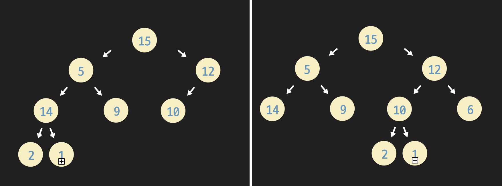

  왜 그런건지 설명할게요.

  완전 이진 트리는 마지막 레벨 직전 레벨까지는 모두 노드로 가득 채워져 있습니다. 이때 완전 이진 트리에는 노드가 모두 몇 개 있을까요?

  - 레벨 1에 1개
  - 레벨 2에 2개
  - 레벨 3에 4개
  - 레벨 4에 8개

  이런 식으로 노드 개수가 늘어나는데요. 레벨이 하나씩 증가할 때마다 이전 레벨에 있는 노드 개수의 2배를 더 담을 수 있습니다.

  이 내용을 표로 정리해볼게요.

  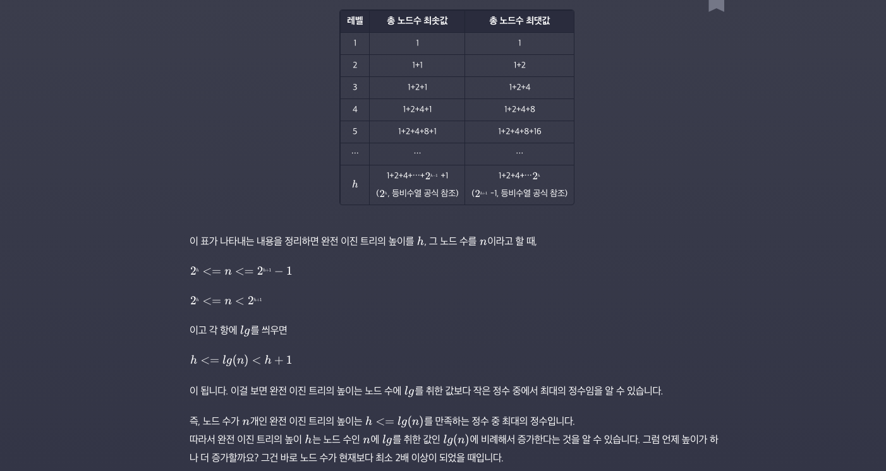

  
  
  > 지금 여기서 오류 있는게, lg(5)하면 2.3얼마가 나옴. 그러면 h는 2로 나오잖아. 
  >
  > 애초에 레벨 0부터 시작하던가, 아니면 h+1을 해서 계산을 하던가 해야 함. 
  
  어쨋든 그게 중요한게 아님. 여기서 중요한 것은, log계산을 통해서 n개가 있을때 총 몇층이 있는지, m번째는 몇 층에 있는지 추측이 가능하다는 것을 알게 된게 가장 중요함. 그리고, 가장 중요한 것은 
  
  **완전이진트리**에 접근하는 시간복잡도는 **O(lg(n))**이라는 것이 가장 중요함. 
  
  
  
  **포화 이진 트리 (Perfect Binary Tree)**  		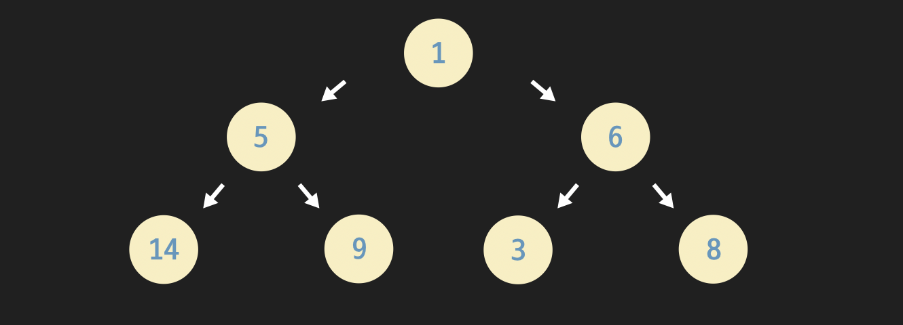
  
  


- #### 완전 이진 트리 배열로 구현하기

  **완전 이진 트리 배열 (파이썬 리스트)에 저장하기**

  이진 트리를 구현하는 방법, 기억 나시나요? 먼저 노드 클래스를 정의하고, 여러 개의 노드 인스턴스를 생성한 후, 이 인스턴스들을 서로 연결시켜서 트리를 만들었잖아요?

  이번 레슨에서는 트리를 파이썬의 리스트로 구현해보겠습니다. 하지만 이 방법은 모든 이진 트리에 쓸 수 있는 방법은 아니구요. 완전 이진 트리인 경우에만 쓸 수 있는 방법입니다.

  바로 예시를 볼게요. (완전 이진 트리가 뭔지 기억이 안 나시면 바로 전 노트를 복습하고 오세요!)

  이런 완전 이진 트리가 있다고 합시다.

  

  이 완전 이진 트리는 아래처럼 리스트에 저장할 수 있습니다.

  ```python
  complete_binary_tree = [None, 1, 5, 12, 11, 9, 10, 14, 2, 10]
  ```

  0번째 인덱스를 `None`으로 두고, 1번째 인덱스부터 root 노드를 시작으로, 그 다음에 깊이가 1인 노드들을 왼쪽에서 오른쪽 방향 순으로, 그 다음에 깊이가 2인 노드들을 왼쪽에서 오른쪽 방향 순으로 차례대로 리스트에 저장하면 됩니다.

  지금 위 그림을 보면 각 노드 위에 빨간 색의 작은 숫자가 있죠? 빨간 색 작은 숫자는 각 노드의 리스트 내에서의 인덱스를 나타냅니다. 그러니까 리스트에서 5번째 노드는 노드 9입니다.

  **자식 노드를 찾는 방법**

  이진 트리에서 각 노드는 기본적으로 자식 노드들을 가리키는 레퍼런스를 가져야합니다. 그래야 부모 노드가 자식 노드에 접근할 수 있을 테니까요? 그렇다면 이렇게 리스트에 노드들이 저장된 경우에는 부모 노드가 자식 노드에 어떻게 접근할 수 있을까요?

  트리의 이미지를 다시 봅시다.

  

  지금 2번째 노드(노드 5)의 왼쪽 자식 노드를 찾고 싶다고 합시다.

  그럼 먼저 노드의 인덱스 2에 2를 곱합니다. 4죠? 그 다음 리스트의 4번째 인덱스에 있는 노드를 찾으면 됩니다. 노드 11이 있죠? 제대로 찾았습니다.

  이런 식으로 특정 부모 노드의 왼쪽 자식 노드를 찾고 싶을 때는, **부모 노드가 저장된 인덱스에 2를 곱해준 값을 인덱스**로 생각하고 리스트에서 찾으면 됩니다.

  이번에는 3번째 노드(노드 12)의 오른쪽 자식 노드를 찾아 볼게요.

  이번에도 노드의 인덱스 3에 2를 곱합니다. 그리고 1을 더해주는데요. 그럼 7입니다. 이번에는 리스트의 7 번째 인덱스를 보면 노드 14가 있습니다. 맞게 찾았네요.

  어떤 식으로 자식 노드들을 찾을 수 있는지 이제 알겠죠?

  **부모 노드 찾기**

  비슷한 방식으로 특정 노드의 부모 노드도 찾을 수 있는데요.

  

  여기서 6번째 노드(노드 10)의 부모를 찾으려면 6을 2로 나누면 됩니다. 리스트의 3번째 인덱스에 있는 노드 12를 잘 찾았네요.

  그럼 자식 노드의 인덱스가 홀수일 때는 어떻게 할까요? 7번재 노드(노드 14)의 부모 노드를 찾고 싶다고 합시다. 이때는 7을 2로 나눈 후 정수 값만 가져오면 됩니다. 그 값은 3이죠? 그럼 리스트의 3번째 인덱스에 있는 노드 12를 잘 찾을 수 있습니다.

  완전 이진 트리는 그것이 가지는 특수한 2가지 성질:

  - 마지막 레벨 직전의 레벨까지는 노드들로 가득 차 있음
  - 마지막 레벨은 왼쪽에서 오른쪽 방향으로 노드들로 가득 차 있어야 함(오른쪽은 비어있어도 되지만 왼쪽은 비어있으면 안 됨)

  때문에 이렇게 각 노드를 리스트에 저장한 후에도 부모 노드와 자식 노드를 손쉽게 찾을 수 있습니다.

- #### 트리 순회

  자료 구조에 있는 모든 데이터를 도는 것을 순회라고 한다. 우리는 저장된 모든 데이터를 출력하는 예시를 볼 것. 

  

  선형 데이터 구조는 앞부터 뒤까지 순회하면 되는데, 트리는 앞과 뒤라는 선형적인 관계가 없음. 그러므로, 어떤 순서로 데이터를 출력하는지가 조금 직관적이지 않을 수 있음. 

  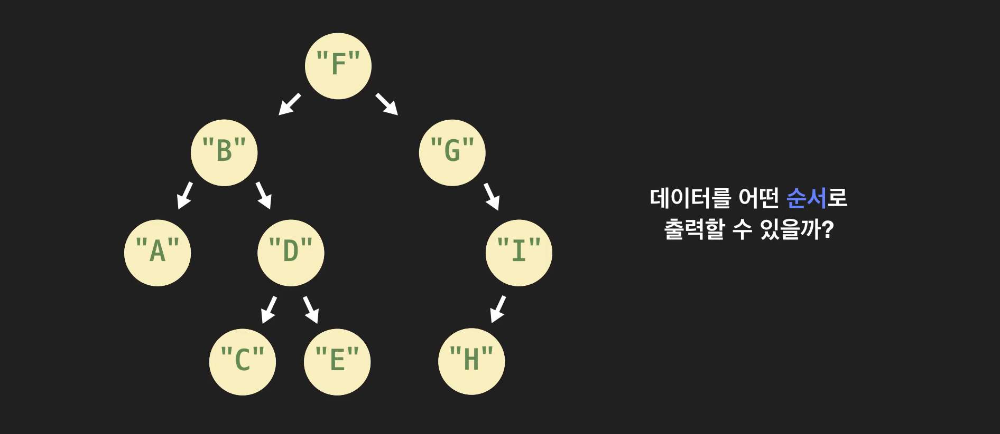

  어떤 방법을 써도 순회하면 되긴 하는데, 우리는 대표적인 방법 3가지를 봐보자. 

  선형적 자료구조를 순회할때는 주로 반복문을 썻지만, 트리를 순회할때는 보통 **재귀함수**를 사용한다. 

  traverse는 루트 노드를 받아서 쭉 돌고 온다. 

  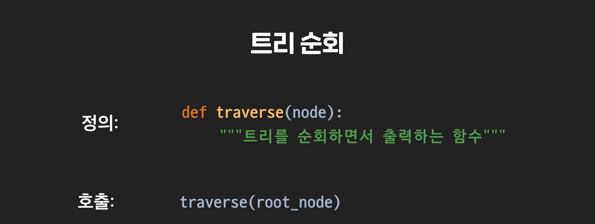

  트리순회는 크게 3가지 부분동작이 있다. 

  1. **재귀적**으로 왼쪽 부분 트리 순회

     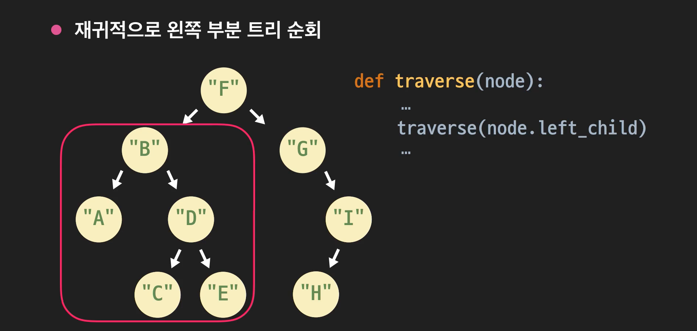

  2. 두번째는 오른쪽 부분 트리 순회

     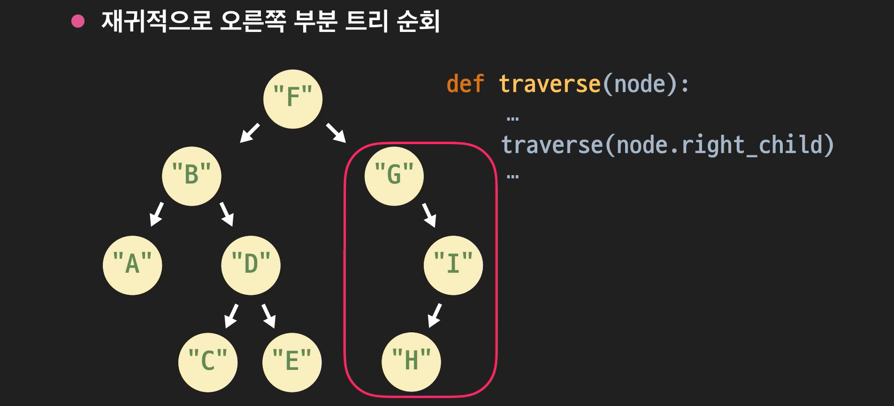

  3. 현재 노드 출력

     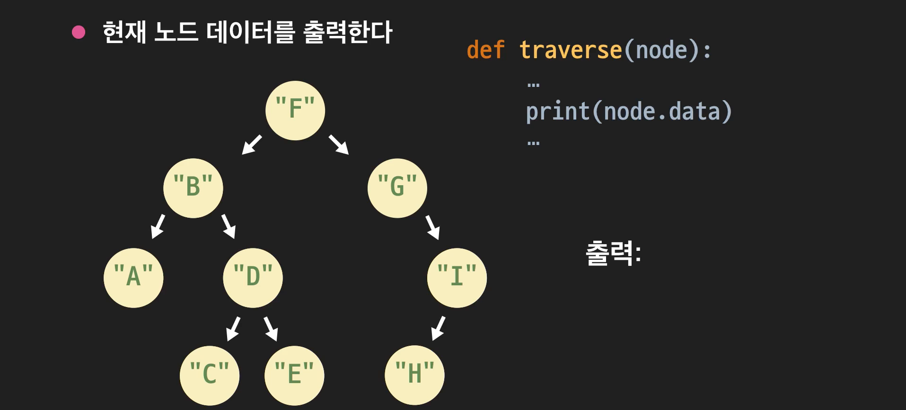

     

  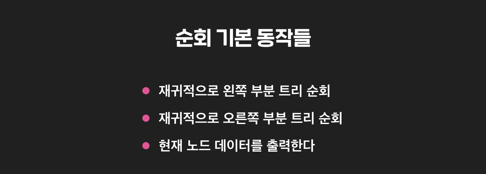


- #### 트리순회 pre-order

  

  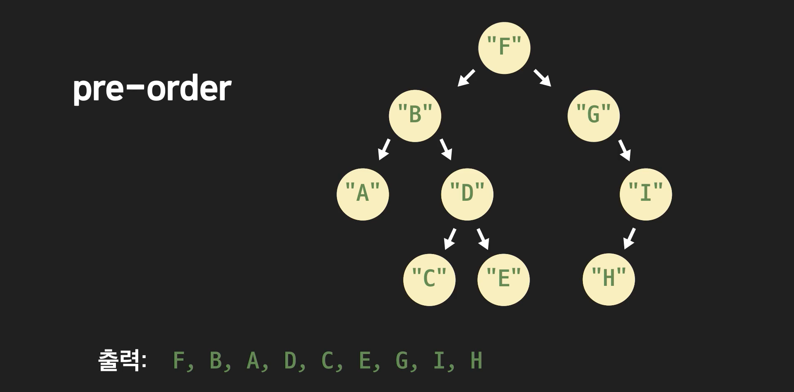

  


- #### 트리 순회 : post-order

  


- #### 트리 순회 : in-order

  

  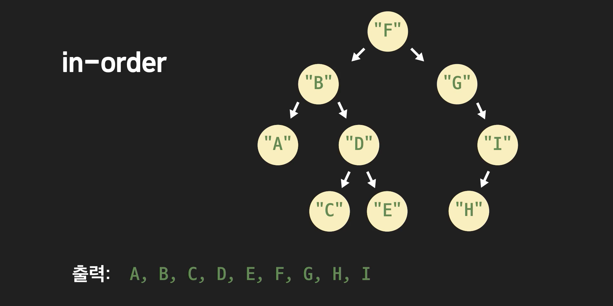

  **가장 중요한 것은 트리를 순회하면 노드 사이에 선형적 순서를 만들 수 있다는 것.** 

  

  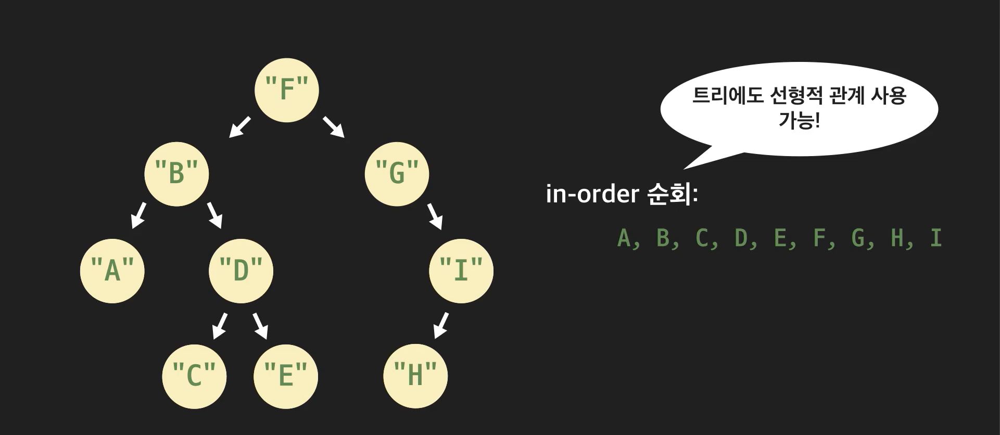


- #### 힙

  힙은 두개의 조건을 만족하는 트리. 

  왜 높이가 **O(lg(n))**으로 시간복잡도로 표현이 될까? 예를 들어 링크드리스트에서는 원소 찾는데 걸리는 시간은 n에 비례했음. 그런데, 완전이진트리에서는 h에 비례하는데 h는 lg(n)에 비례하잖아. 그래서, 이렇게 표현해 놓은 것. **탐색할때 걸리는 시간이 O(lg(n))이라는 것**. 

  **형태속성과 힙속성 두가지를 만족해야 함**.

  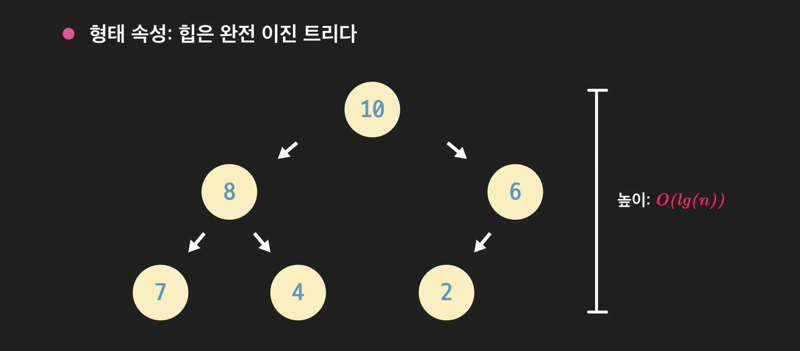

  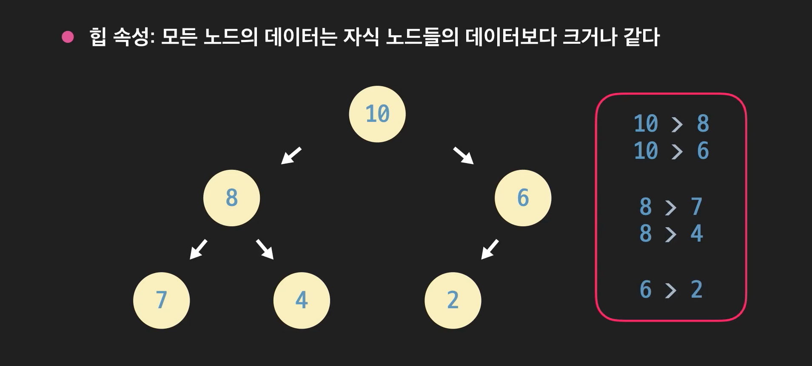

  

  이전 챕터 에서는 힙을 활용하는 두 가지 방법에 대해 공부할 것. 

  힙을 활용해서 정렬 문제를 해결해 보고, 추상자료형 우선순위 큐 라는 것을 만들어 볼 것. 

  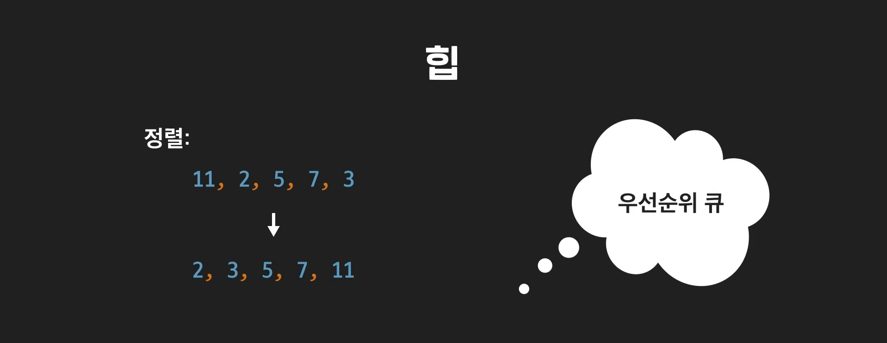


- #### 정렬 문제

  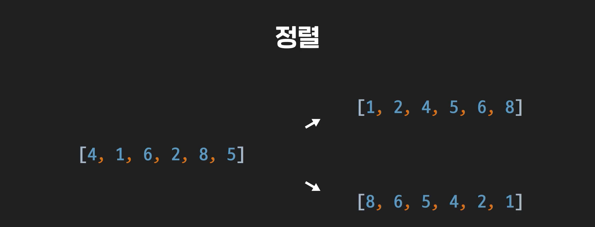

  정렬하는 알고리즘은 굉장히 많음. 그 중에서 힙을 사용해서 정렬해 볼 것. 힙을 사용해서 정렬하는 알고리즘은 **힙 정렬** 이라고 부른다. 

  


- #### 배열로 구현한 힙

  힙은 일단 어떻게 구현할까?

  

  아래에서 노드 위에 있는 숫자들은 동적배열의 인덱스를 나타낸다. 앞에 과제에서 했던 것처럼 파이썬 리스트로 구현해 놓은 것. 

  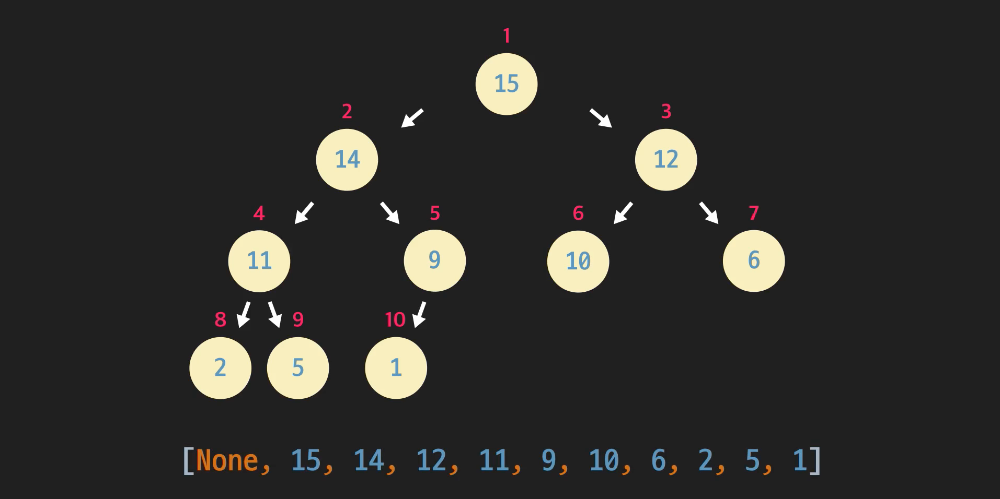

  지난 과제에서 했던 것처럼 위/아래, 즉 부모 자식은 찾는 방법이 굉장히 간단했음. 

  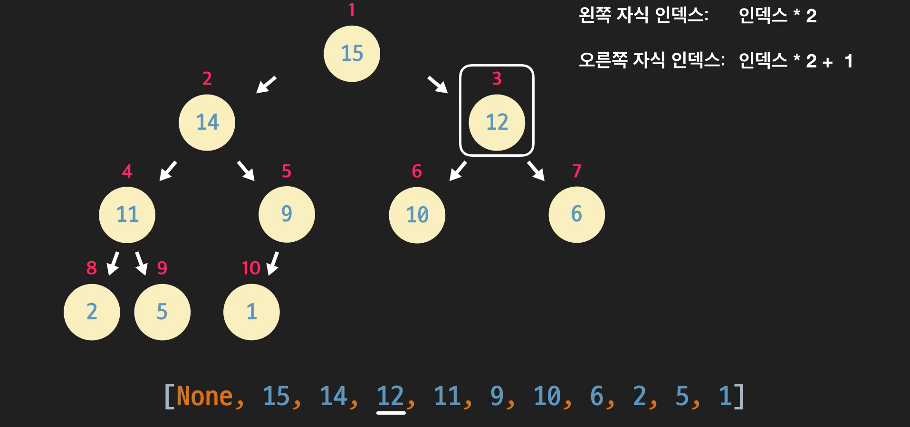

  

- #### 힙 만들기

  동적배열로 구현한 아래 완전이진트리는 힙이 맞을까?

  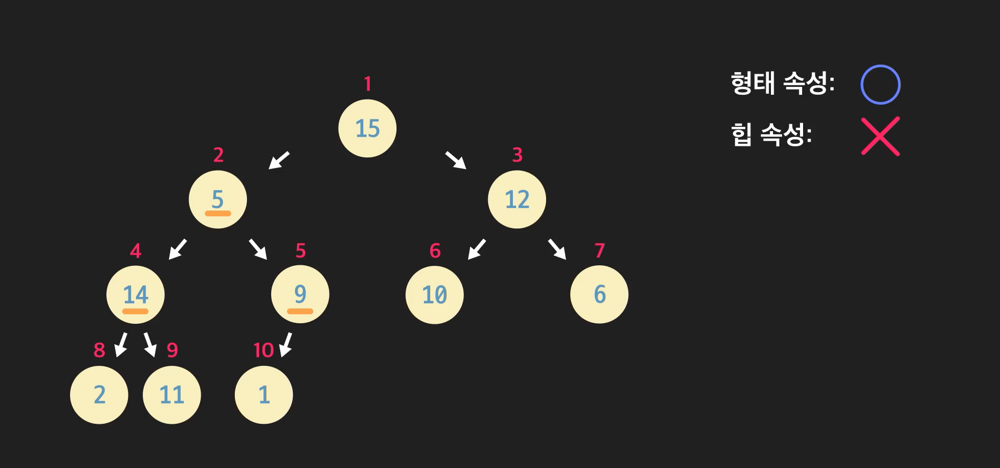

  이걸 힙으로 만들려면 어떻게 할까?

  5, 14, 9를 비교해서 제일 큰것을 위로 올려준다. 

  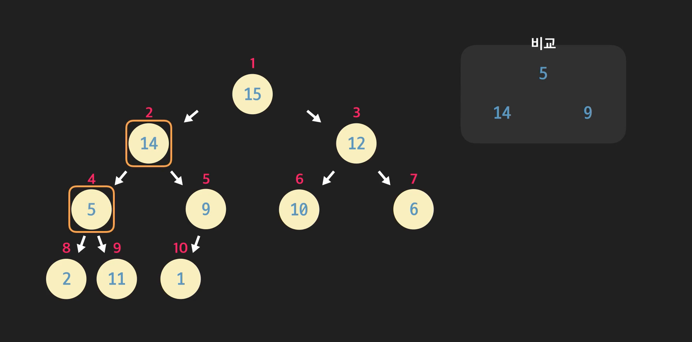

  또 아래로 가면서 계속 확인한다. 

  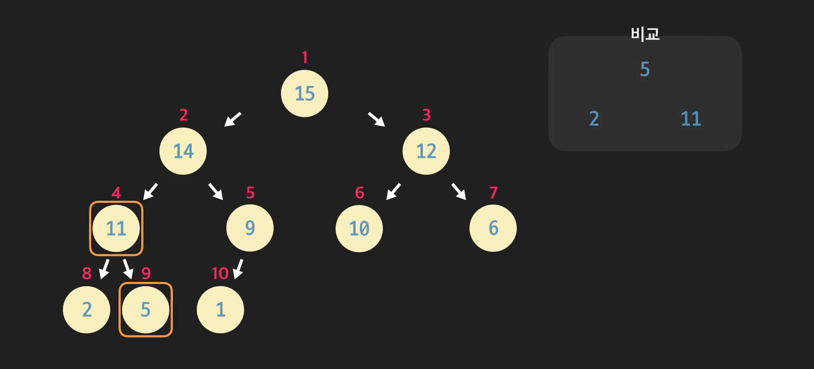

  이렇게 돌아다니면서, 힙 속성을 지키지 않는 애들을 재배치 해주면 된다. 이런 알고리즘을 **heapify**라고 부른다. 

  **heapify**는 파라미터로 어떤 노드 하나를 받는다. 그리고, 왼쪽자식 오른쪽 자식을 본다음에 가장 큰것을 부모노드로 만들어 준다. 

  힙 속성이 충족될떄 까지 반복한다. 

  시간복잡도를 봐보자. 최악의 경우는 파라미터로 루트 노드를 넘겼는데 이게 leaf 노드까지 내려가는 것. 

  그러면, 총 이 트리의 높이 만큼 확인하고 재배치 시키게 되지. 

  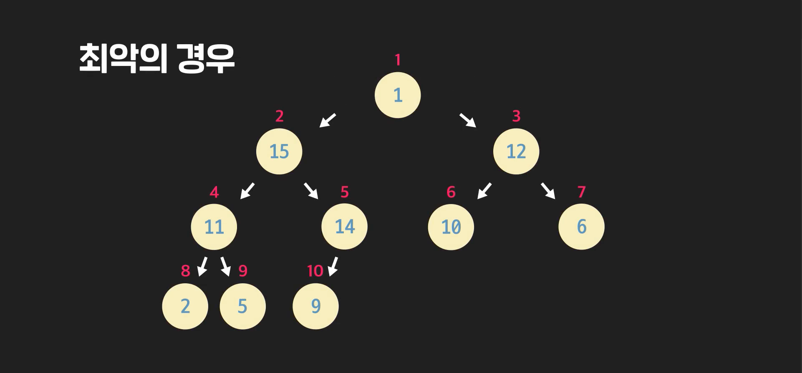

  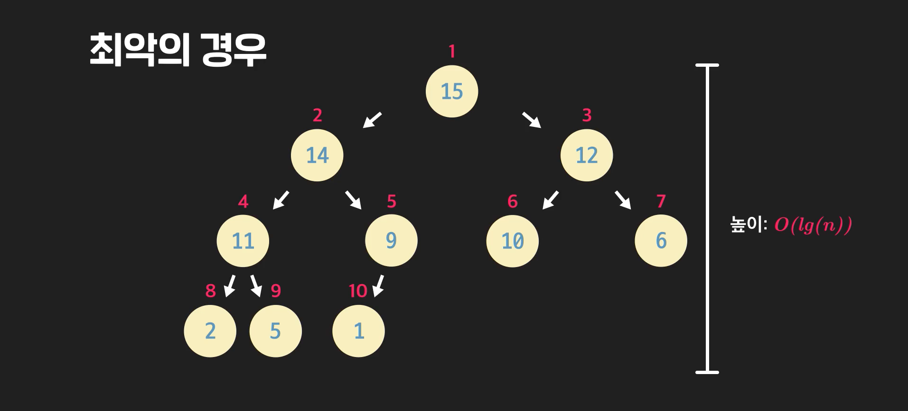

  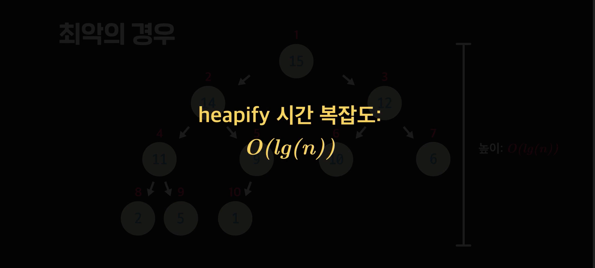


- #### 힙 만들기 2

  **heapify는 아래부터 위로 올라가면서 호출해야 제 기능을 한다. 실제로 해보면, 반례가 많다.** 

  heapify에 노드를 넣으면 해당 노드가 힙 속성을 지킬 수 있도록 위치가 재배치된다. 

  그그럼 heapify에 노드 1부터 10까지를 넣고 호출하면 어떻게 될까? 일단 노드 **10, 9, 8, 7, 6**은 leaf 노드임. heapify를 해도 바뀌는게 없음. 

  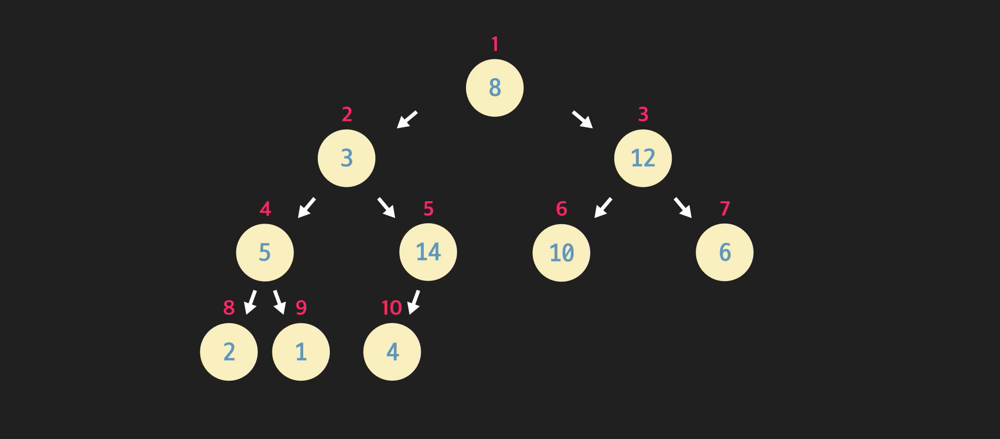

  노드 10부터 3까지 heapify를 호출해 준 뒤 노드 2를 heapify를 호출할 차례가 왔다고 해보자. 

  노드 3부터 10까지는 이미 heapify를 한번씩 호출했음. 고로 그 아래 노드들은 이미 힙 속성을 지키고 있다고 확신할 수 있음. 

  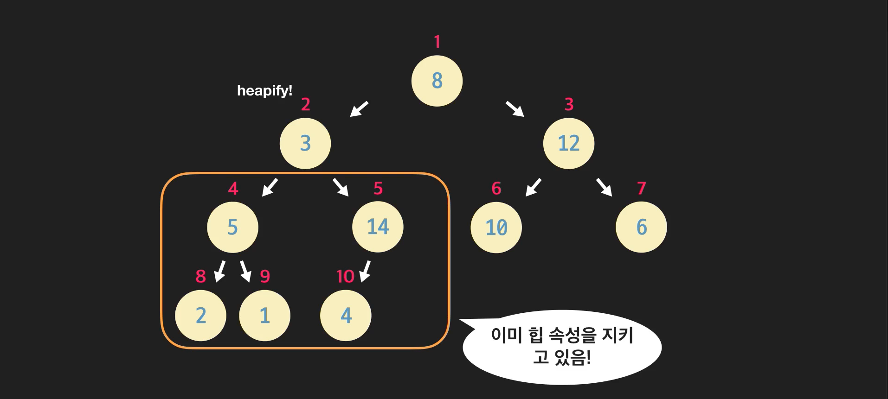

  이제 2를 heapify 호출해 주면, 이제 왼쪽 부분 노드는 다 heapify를 지키고 있게되는 것. 

  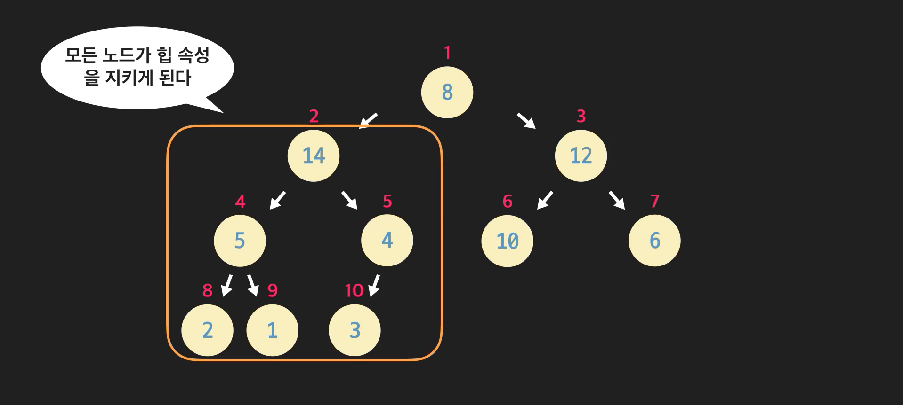

  다음 루트노드의 heapify를 호출할 차례라고 해보자. 이때도 마찬가지로, 루트노드 밑에의 모든 노드들은 heap속성을 지키고 있다. 이제 루트에 heapify를 호출해 주면, 힙 안의 모든 노드들이 힙 속성을 지키고 있다고 확신할 수 있는 것. 

  

  즉, 마지막 인덱스 부터 첫번째 인덱스까지 차례로 호출하면 heap으로 만들 수 있다는 말이다. 

  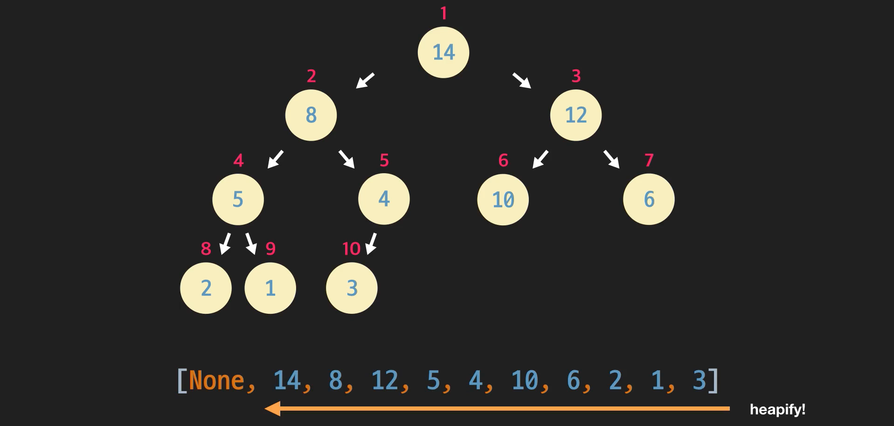

  시간복잡도를 분석해 보자. 

  **힙을 만드는데는 시간이 얼마나 걸릴까?**

  > 지금 애초에 전제가 잘못됬음. 파이썬으로 구현하면 아래처럼 시간복잡도 안나옴. 파이썬으로 구현하면, 그냥 탐색 O(1) 이렇게 나오지 지금 아래처럼 나왔다는 것은 이유가 뭐냐면, 내가 딱 자식만 알 수 있어서 내려가야 되는 자료구조 이런거를 생각해야 하는 것. 그러면, 탐색이 최대 lg(n)이고 바꾸는것은 선형으로 바꾸고 그것을 n번 한다는 것. 

  일단 특정 노드의 heapify를 호출하는 것은 **O(lg(n))**이 걸린다(탐색). heapify를 만들려면, n개의 노드에 모두 호출해야 한다. 즉, **n*O(lg(n))**이라는 것. 

  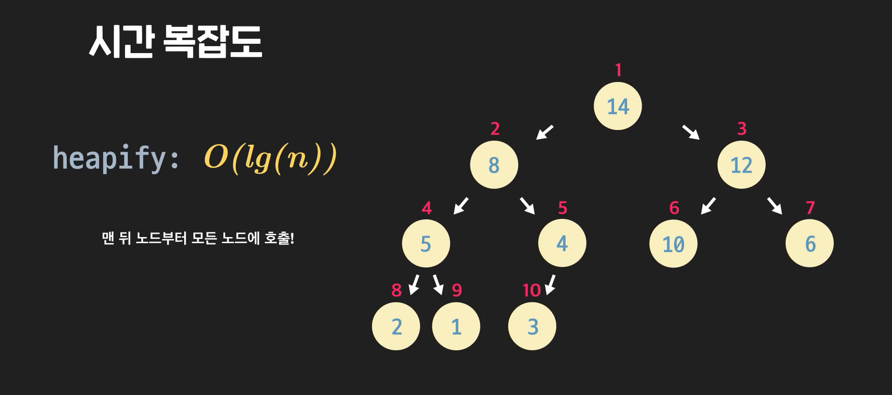

  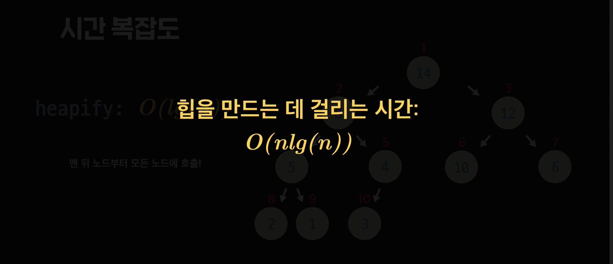

  지금 파이썬 리스트로 구현해놓은거 이런거를 보면 안돼. 힙이라는거는 애초에 무슨 리스트 안에 들어있는 개념이 아니야. 말 그대로, 서로 아래 자식 노드 오른쪽/왼쪽/자신의 데이터만 물고 있는 자료구조야. 그러면 탐색하게 하려면 내려가는데 걸리는 시간은 그 층수에 비례하겠지. 

  

- #### 힙 정렬

  

  힙을 이용해서 데이터를 정렬할 수 있다. 

  아래같은 힙이 있다. 여기서, 루트노드와 3을 바꿔준다. 그러면 이제 힙속성이 무너졌음. 

  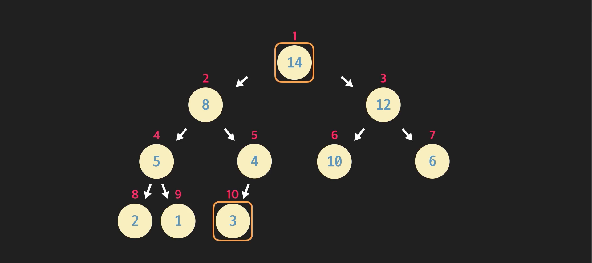

  아래같은 트리가 있고, 힙 속성을 맞추기 위해 root 노드의 **heapify**를 호출한다. 

  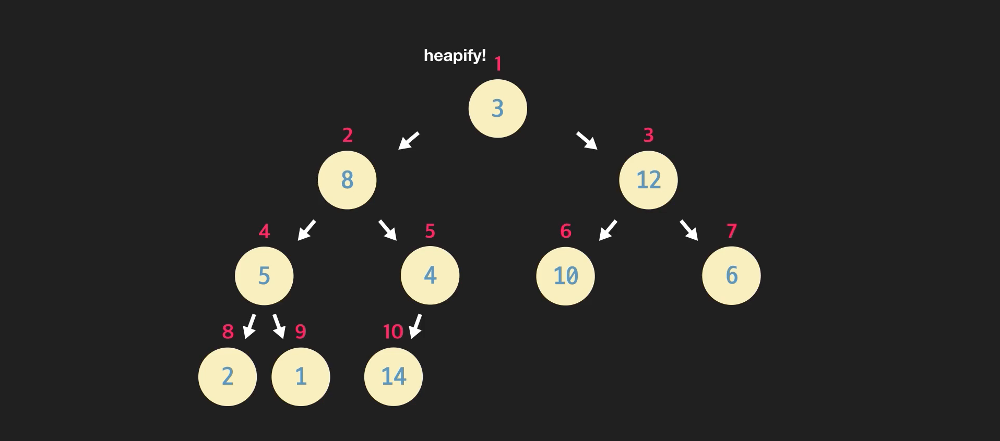

  그런데 여기서 중요한게 index 10은 이제 없는 인덱스 취급을 해준다. 실제로 데이터가 저장되어 있기는 하지만, 마치 없는 것처럼 무시하자는 것. 이해를 돕기 위해서 연결이 안되있는 것처럼 끊어 놓을께. 

  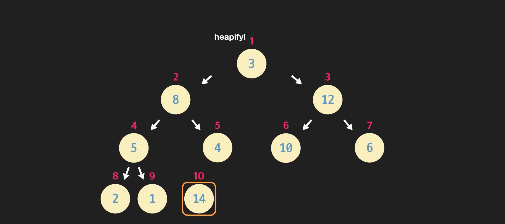

  그럼 이제 root 노드에 heapify하니깐, 아래처럼 됬음. 

  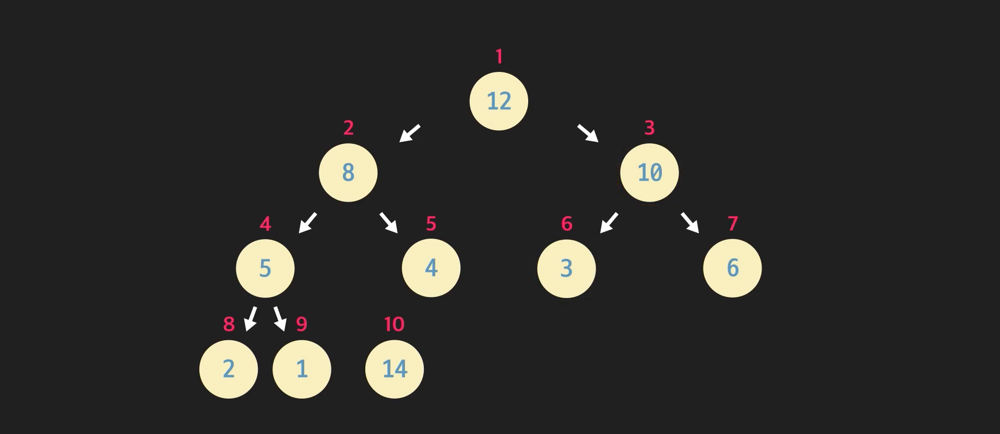

  이제 루트 노드를 또 마지막 노드와 바꿔주는데, 10번째 노드는 무시하기로 했으니깐, 루트 9와 바꿔주는 것. 

  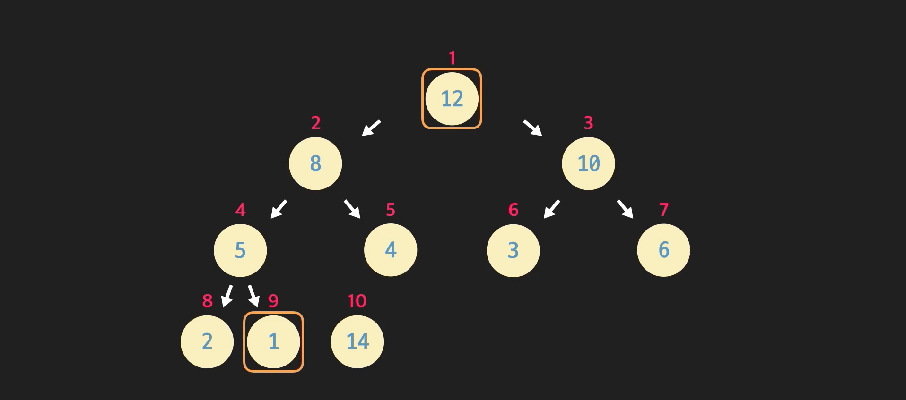

  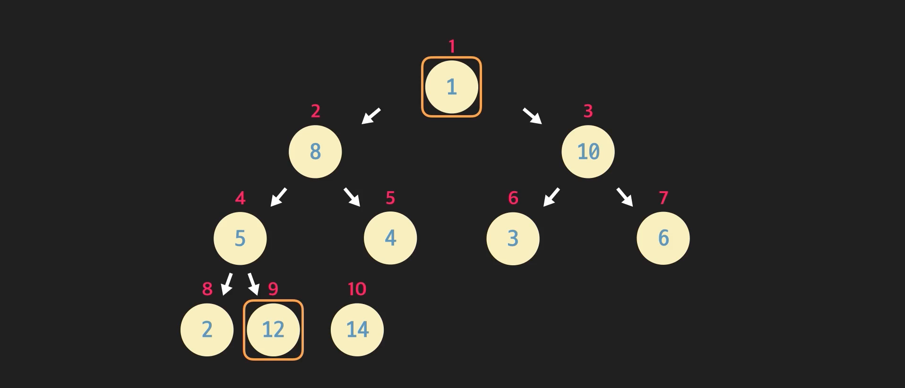

  이제 또 heap 속성 맞춰주기 위해서, 루트 노드에 **heap** 속성을 호출한다. 아까처럼 **9**는 없는 인덱스 취급 해 줘야지 . 

  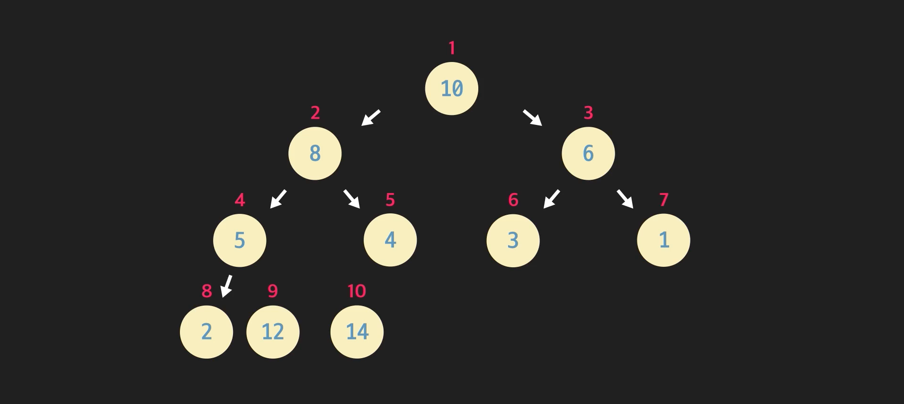

  이렇게 바꾸고, heapify 바꾸고를 계속해서 반복하는 것. 

  그렇게 바꾸고 나면 아래처럼, 나옴. 결국 우리는 파이썬 리스트로 이것들을 구현했으니깐 마지막에는 아래같은 리스트가 나오는 것. 

  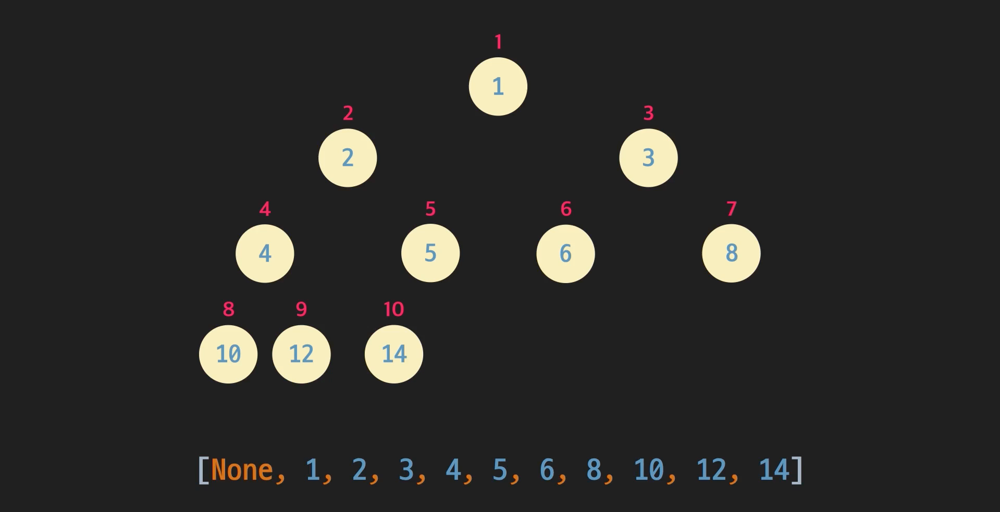

  일반화 하면 아래와 같다. 

  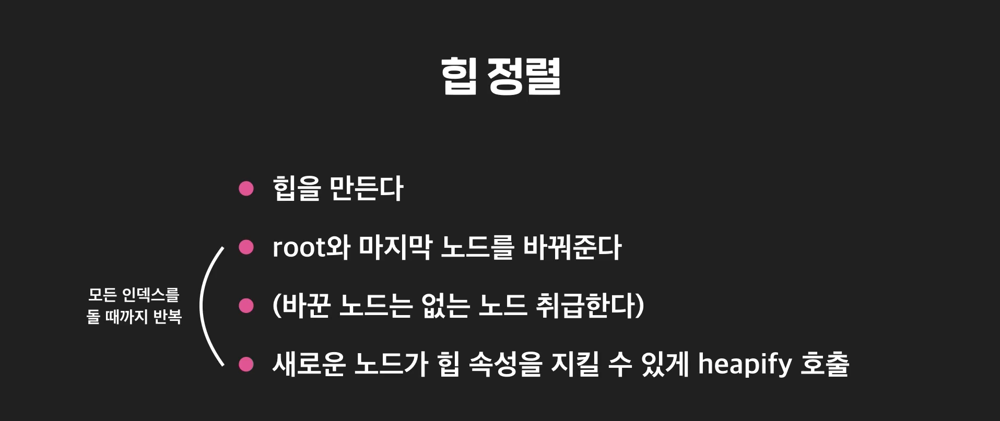

  만약 내림차순으로 정렬시키고 싶었다면 어떻게 해야 할까?

  힙 속성 자체를 반대로 바꾸고, 그대로 적용하면 됨. 즉, 힙 속성에서 위로 갈수록, 더 작은 놈이 나오는 힙을 만들면 되지.

  


- #### 힙 정렬 시간복잡도 + 평가

  **힙 정렬 시간 복잡도**

  힙 정렬이 얼마나 효율적인 정렬 방법인지 알아볼게요. 힙 안에 있는 노드의 개수를 n이라고 했을 때 힙 정렬의 시간 복잡도는 어떻게 될까요? 힙 정렬의 각 단계를 보면서 생각해볼게요. 힙 정렬의 각 단계는 아래와 같은데요.

  1. 먼저 리스트를 힙으로 만듭니다.
  2. root 노드와 마지막 노드의 위치를 바꿉니다. 마지막 위치로 간 기존의 root 노드는 이제 힙에서 없다고 가정합니다.
  3. 새로운 root 노드가 힙 속성을 지킬 수 있게 heapify합니다.
  4. 힙에 남아있는 노드가 없도록 단계 2 ~ 3을 반복합니다.

  1번째 단계인 리스트를 힙으로 만드는 데 걸리는 시간은 O*(*n*lg(*n*))입니다. 그 이유는 이전 영상에서 배웠습니다. 한 번의 heapify를 할 때의 시간 복잡도가 O*(lg(*n*))이고 노드의 수가 총 n개이므로 그렇다고 했었죠?

  2번째 단계는 그냥 두 노드의 위치를 바꿔 주는 작업이기 때문에 노드의 개수 n과는 상관없이 항상 O(1)입니다.

  3번째 단계는 새로운 root 노드에 heapify를 하는 겁니다. 이때의 시간 복잡도는 O*(lg(*n*))이라고 했죠? 그럼 2번째 단계와 3번째 단계를 합치면O*(lg(*n*)+1), 즉, O*(lg(*n*))입니다.

  4번째 단계는 2~3 단계를, 힙에 남아있는 노드가 없을 때까지 반복합니다. 힙에는 총 n개의 노드가 있으므로 2, 3, 4단계의 시간 복잡도를 종합하면 O*(*n*lg(*n))이라고 할 수 있겠네요.

  정리하면

  - 힙을 만드는 데 O*(*n*lg(*n))
  - 만든 힙에서 매번 root 노드를 뽑고 남은 것들을 다시 힙으로 만들어주는 작업을 반복하는 데 O*(*n*lg(*n))이 걸립니다.

  그럼 힙 정렬의 총 시간 복잡도는 O*(*n*lg(*n*)+*n*lg(*n*))으로 O*(2*n*lg(*n*))이고,  시간 복잡도에서 상수는 무시되니까 결국 O*(*n*lg(*n))이라고 할 수 있습니다.

  힙 정렬은 O(*n*lg(*n*))의 시간 복잡도를 가지는 정렬 알고리즘인 겁니다.

  **다른 정렬 알고리즘들과의 비교**

  다른 정렬 알고리즘들에 비해 이게 얼마나 빠른 건지 생각해봅시다. 아래 표에는 힙 정렬과 가장 대표적인 정렬 알고리즘 4개의 시간 복잡도가 있습니다.

  | 정렬 알고리즘 | 시간 복잡도                         |
  | ------------- | ----------------------------------- |
  | 선택 정렬     | O(n^2)                              |
  | 삽입 정렬     | O(n^2)                              |
  | 합병 정렬     | *O*(*n*lg(*n*))                     |
  | 퀵 정렬       | 평균 O*(*n*lg(*n*)) (최악 O*(*n*2)) |
  | 힙 정렬       | *O*(*n*lg(*n*))                     |

  힙 정렬은 선택 정렬과 삽입 정렬 (O*(*n*2))보다는 좋고, 합병 정렬과 퀵 정렬 (*O*(*n*lg(*n)))과는 비슷한 성능을 내는 정렬 방법이라는 걸 알 수 있습니다.


- #### 우선순위 큐 

  힙은 보통 2가지로 사용됨. 하나는 위에서 봤던 정렬. 나머지 하나는 **우선순위 큐**라는 추상자료형을 만들기 위해서 사용된다. 

  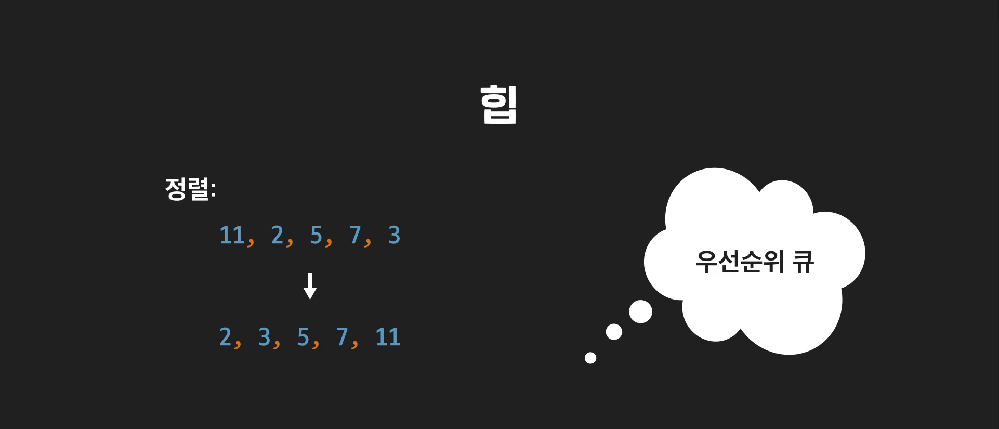

  **우선순위 큐란 무엇일까?**

  일단 예전에 배웠던 큐와 굉장히 비슷하다(FIFO). 

  우선순위 큐는 각 데이터가 우선순위를 가지고 있고, 그 우선순위가 높은 것이 먼저 나온다. 

  

  

  예를 들어, 가장 큰 데이터가 가장 먼저 나오는 우선순위 큐가 있다고 해보자. 코드를 보면서 이해해보자. 어떤 순위로 들어가는지는 상관이 없다. **데이터를 삭제될때는 가장 큰 순서대로 삭제**된다. 가장 큰 데이터부터 처리하고 싶을때, 우선적으로 쓸 수 있는 추상자료형이다. 예를 들어, 고객문의 처리하는데 가장 등급 높거나 불만도 높은 것부터 처리해 줄때. 

  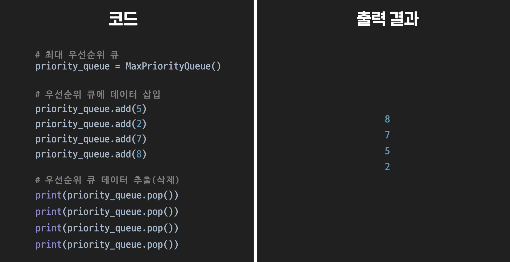

  **이제 힙을 사용하면 우선순위 큐를 효율적으로 구현할 수 있다.** 

  

  

- #### 힙에 데이터 삽입하기

  힙으로 우선순위 큐를 구현하기 위해서는 힙에 데이터를 삽입하고 삭제하는 방법을 알아야 한다. 

  아래 힙에 데이터 15를 삽입하고 싶다고 해보자. 

  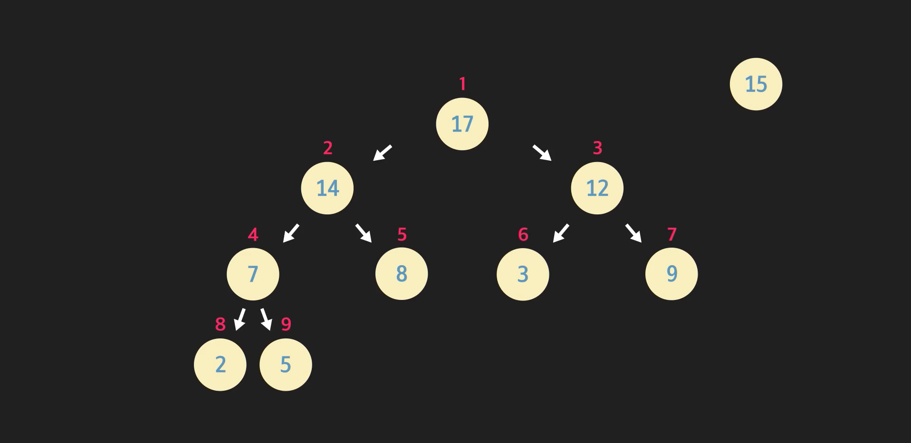

  일단 힙의 가장 마지막 인덱스에 15를 삽입한다. 15는 지금 힙속성을 어기고 있지. 

  부모노드와 바꾸고 비교. 

  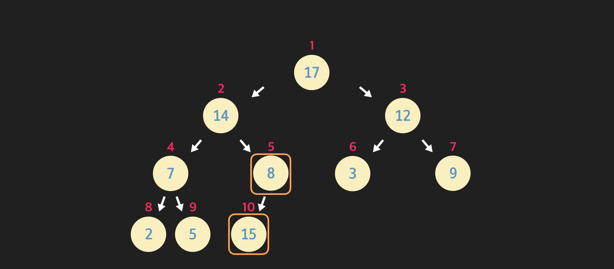

  바꾼뒤에 또 새로운 부모 노드와 비교. 

  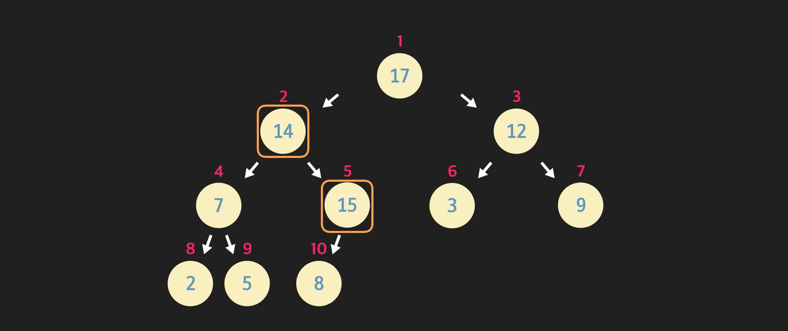

  그리고, 또 부모와 비교. 

  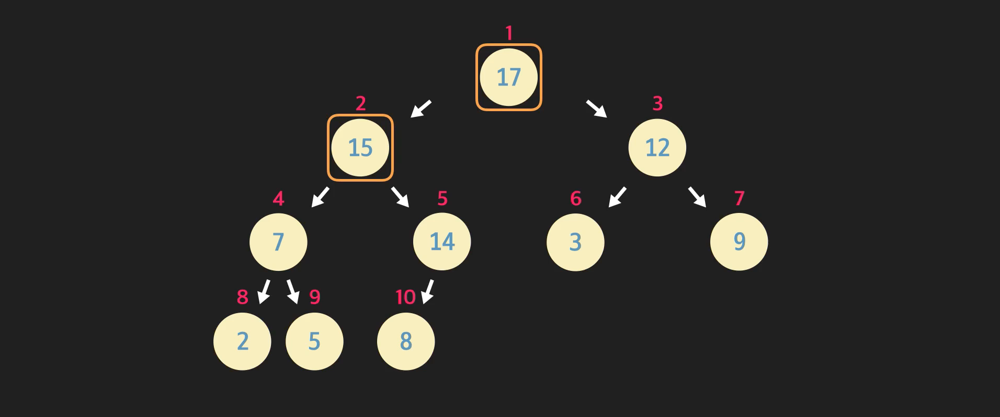

  이런식으로 제자리 찾을때 까지 가면 됨. 

  heapify는 자식으로 내려가면서 찾는 알고리즘이였음. 지금은 위로 가면서 찾는거라 조금 다르지. 

  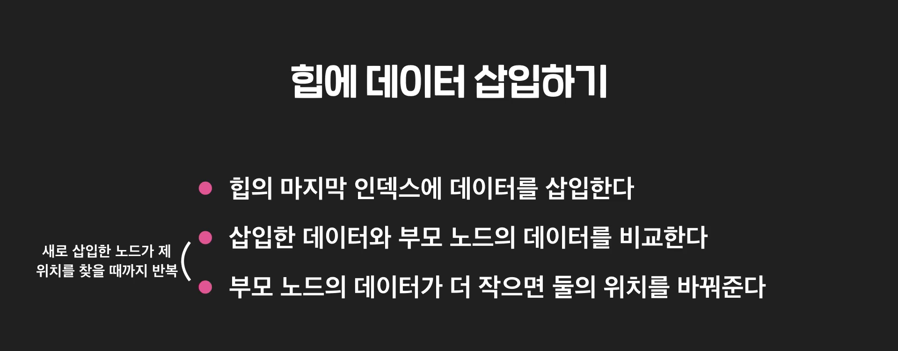

  

- #### 힙에서 최고 우선순위 데이터 추출하기

  힙에서 가장 우선순위 높은 데이터 추출하는 방법을 보자. 우선순위는 우리가 정하기 나름인데, 여기서는 가장 큰 데이터가 가장 우선순위가 높다고 해보자. 

  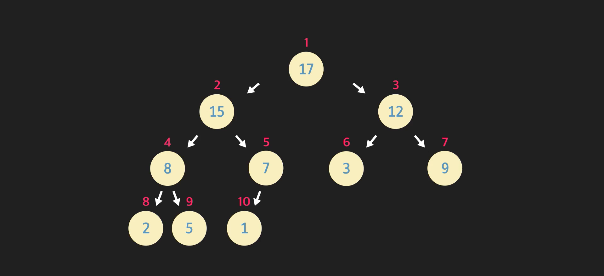

  루트 노드에 가장 큰 값이 있음. 루트 노드와 마지막 노드를 바꿔준다. 그리고 마지막 노드를 지우면서, 이 마지막 노드의 값을 어떤 변수에 저장해 놓는다. 

  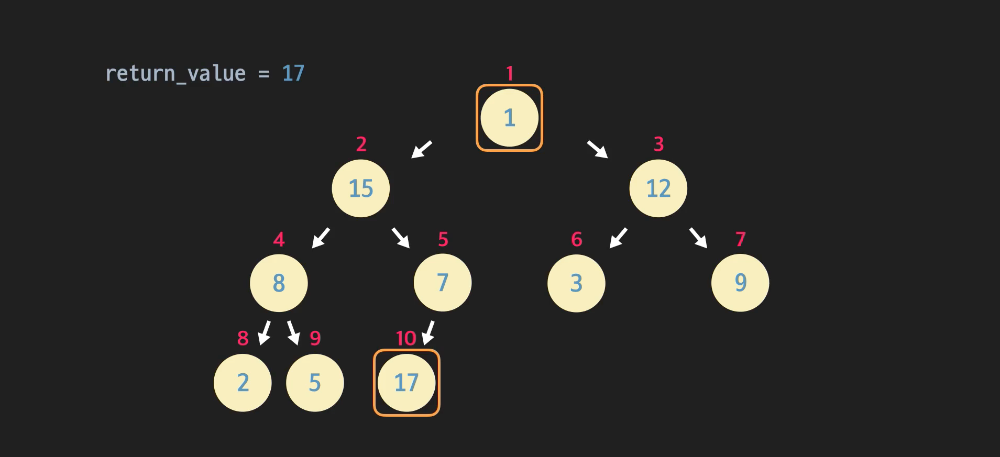

  그리고, 1이 힙속성을 어기고 있으니깐, heapify를 다시 적용해야지. 그럼 1은 다시 제 위치를 찾아왔음. 

  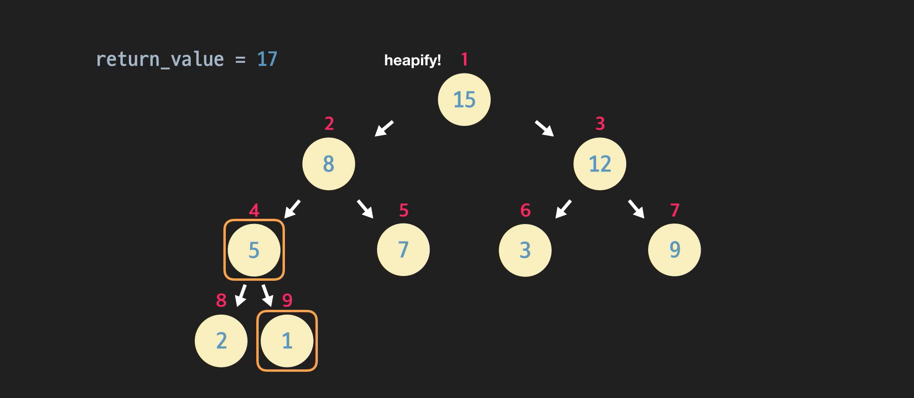

  그리고 그냥 17을 리턴하면 됨. 이렇게 하면, 가장 우선순위가 높은 17이 추출되는 동시에 힙 속성이 망가지지 않음. 

  **일반화 하자면 다음과 같다.**

  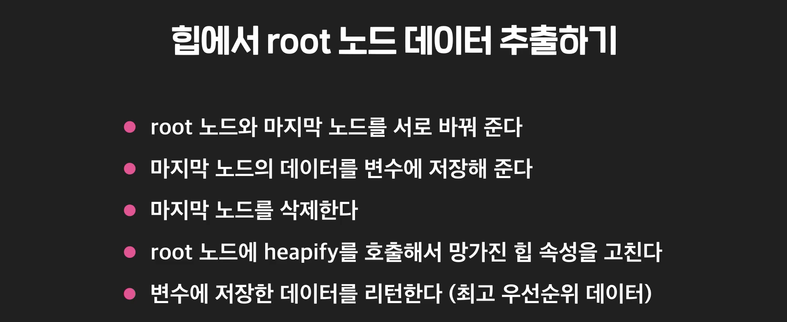

   

  

- #### 힙 삽입, 추출 시간복잡도

  **힙의 삽입 연산 시간 복잡도**

  힙의 데이터(노드) 삽입의 시간 복잡도는 어떻게 될까요?

  힙 안에 총 n개의 노드가 있다고 가정하고 데이터 삽입의 3단계를 다시 볼게요.

  1. 힙의 마지막 인덱스에 노드를 삽입합니다.
  2. (1)삽입한 노드와 그 부모 노드를 비교해서 부모 노드가 더 작으면 둘의 위치를 바꿉니다. (2)삽입한 노드와 그 부모 노드를 비교해서 부모 노드가 더 크면 그대로 둡니다.
  3. 2-1의 경우에는 삽입한 노드가 올바른 위치를 찾을 때까지 단계 2를 반복합니다.

  - 1단계

  먼저 힙의 마지막에 노드를 삽입해야 합니다. 저희는 힙을 동적 배열로 구현했는데요. 동적 배열에 원소를 추가하는 것의 시간 복잡도를 분할 상환 분석하면 O(1)입니다.

  - 2단계

  (1) 삽입된 노드의 값과 부모 노드의 값을 비교하는 건 O(1)이 걸립니다.  (2) 삽입된 데이터가 더 큰 경우 부모 노드와의 위치를 바꿔주는 것도 마찬가지로 O(1)이 걸리죠.

  즉, 2단계에서는 O(2)이 걸리는데 이건 O(1)과 같습니다.

  - 3단계

  최악의 경우 2단계를 몇 번이나 반복해야할까요? 최악의 경우는 삽입한 데이터가 leaf 노드부터 시작해서 root 노드까지 올라가는 경우인데요. 그럼 힙의 높이만큼 2단계를 반복해야합니다. 힙의 높이는 lg(*n*)에 비례하니까 시간은 O*(lg(*n*))입니다. 이 말은, 2단계의 시간인 O*(1)를 최대 O*(lg(*n*))번 반복할 수 있다는 말이니까 결국 시간 복잡도는 *O*(lg(*n*))이 걸립니다.

  이것들을 모두 정리해보면

  - 1단계의 O(1)
  - 2단계, 3단계의 O*(lg(*n))

  를 더해서 O*(1+lg(*n))이 되고 이건 곧 *O*(lg(*n*))과 같습니다.

  결론적으로, 힙에 데이터(노드)를 삽입하는 연산의 시간 복잡도는 O*(lg(*n))입니다.

  **힙의 추출 연산 시간 복잡도**

  이제 힙에서 가장 우선 순위가 높은 데이터(노드)를 추출하는데 시간이 얼마나 걸리는지 알아봅시다. 이번에도 힙에 있는 노드의 개수를 n이라고 할게요.

  단계별로 나눠서 봅시다.

  1. root 노드와 마지막 노드의 위치를 바꿉니다.
  2. 마지막 위치로 간 원래 root 노드의 데이터를 별도 변수에 저장하고, 노드는 힙에서 지웁니다.
  3. 새로운 root 노드를 대상으로 heapify해서 망가진 힙 속성을 복원합니다.
  4. 2단계에서 따로 저장해 둔 최우선순위 데이터를 리턴합니다.

  - 1단계

  root 노드와 마지막 노드의 위치를 바꾸는 건 노드의 개수랑은 전혀 상관 없이 O(1)이 걸립니다.

  - 2단계

  데이터를 변수에 지정하는 건 O(1)이 걸립니다. 저희는 힙을 동적 배열로 구현했는데요. 동적 배열에서 마지막 인덱스의 원소를 삭제하는 건 분할 상환 분석을 하면 O(1)이 걸립니다. 이 단계는 총 O(1 + 1)이 걸리니까 O(1)이 걸리는 겁니다.

  - 3단계

  새로운 root 노드를 대상으로 heapify를 호출해서 망가진 힙 속성을 복원하는 단계입니다. 이전에 heapify는 O*(lg(*n))가 걸린다고 배웠습니다.

  - 4단계

  변수를 리턴하는 건 한 번에 할 수 있습니다. O(1)이죠.

  총 걸리는 시간을 더하면 O*(1+1+lg(*n*)+1)이네요. 여기서 1은 다 무시해도 되니까, 힙에서 가장 우선 순위가 높은 데이터를 추출하는 연산의 시간 복잡도는 *O*(lg(*n*))인 겁니다.


- #### 힙으로 구현한 우선순위 큐 평가

  우선순위 큐를 구현할 때는 힙 말고도 다른 자료 구조들을 활용할 수도 있습니다. 예를 들어

  - 정렬된 동적 배열
  - 정렬된 더블리 링크드 리스트

  으로도 우선순위 큐를 구현할 수 있는데요. 이번 레슨에서는 이 방법들을 사용하는 것과 힙을 사용하는 걸 한 번 비교해볼게요.

  **정렬된 동적 배열**

  먼저 정렬된 동적 배열부터 봅시다. 정렬된 동적 배열으로도 우선순위 큐를 구현할 수 있습니다. 데이터를 삽입하거나 추출해도, 동적 배열이 늘 정렬된 상태를 유지하게 하면 되는데요.

  일단 동적 배열에 데이터가 정렬된 채(오름차순 또는 내림차순)로 있다고 가정하고 새로운 데이터를 삽입할 때를 생각해봅시다. 새로운 데이터를 정렬된 동적 배열에 삽입하려면 크게 두 가지 작업을 해야합니다.

  (1) 먼저 새로운 데이터가 어느 위치에 들어가야 하는지를 찾고 (2) 그 위치에 데이터를 넣어야 합니다.

  - 삽입할 위치를 찾는 것은 이진 탐색을 사용하면 O*(lg(*n))이 걸립니다.
  - 그리고 그 위치에 데이터를 삽입하는 건 최악의 경우 O(n)이 걸립니다. 

  예를 들어 `[3, 5, 6, 8, 9]` 이런 동적 배열이 있다고 합시다. 여기에 1을 삽입하려면 맨 앞에 삽입해야 하고 그럼 기존의 3, 5, 6, 8, 9를 각각 한 인덱스씩 뒤로 밀어서 저장해야 합니다. 바로 이럴 때 O(n)이 걸리는 거죠.

  그럼 삽입 연산은 총 O*(lg(*n*)+*n) 이 걸리고 이는 곧 *O*(*n*)과 같습니다.

  결국, 정렬된 동적 배열에 데이터를 삽입하는 연산은 **O(n)**이 걸립니다.

  데이터를 추출하는 연산은 얼마나 걸릴까요? 동적 배열이 항상 정렬된 상태라면 가장 우선순위가 높은 데이터는 항상 배열의 끝에 있을 겁니다. 그래서 추출할 때는 그냥 마지막 데이터를 삭제함과 동시에 리턴하면 됩니다.

  동적 배열 맨 뒤에 있는 데이터를 추출하는 연산은 O(1)이 걸립니다.

  결국, 정렬된 동적 배열에서 가장 우선순위가 높은 데이터를 추출하는 연산은 O(1)이 걸립니다.

  **정렬된 더블리 링크드 리스트**

  이번엔 정렬된 더블리 링크드 리스트로 우선순위 큐를 구현한다고 생각해봅시다.

  우선 데이터 삽입이 얼마나 걸릴까요? 일단 데이터를 삽입해야 하는 위치를 찾아야 하는데요. 링크드 리스트에서는 이럴 때 선형 탐색을 해야 합니다. 그러니까 헤드 노드에서부터 순서대로 하나씩 노드를 확인하면서 삽입할 위치를 찾아야 하는데요. 총 노드 수가 n이라고 했을 때, 최악의 경우 n개의 노드를 다 봐야 합니다.

  예를 들어, `| 3 | 5 | 6 | 8 | 9 |` 이렇게 정렬된 더블리 링크드 리스트에서 10를 삽입하고 싶으면 선형 탐색으로 3부터 9까지를 다 확인해야 합니다.

  9 뒤에 삽입해야 한다는 걸 알기 위해 n개의 노드를 다 봐야 하는 거죠. 그러니까 삽입할 위치를 찾는 단계는 O(n)이 걸립니다.

  그러면 삽입은 얼마나 걸릴까요? 위치만 정해지고 나면 링크드 리스트에서 데이터를 삽입하는 건 O(1)에 할 수 있습니다.

  결국, 정렬된 더블리 링크드 리스트에 데이터를 삽입하는 것은 O(1 + n)이 걸리고, 이건 O(n)과 같습니다.

  그럼 데이터 추출은 얼마나 걸릴까요? 더블리 링크드 리스트에서 마지막 데이터를 추출하는 데에는 O(1)이 걸립니다.

  결국, 정렬된 더블리 링크드 리스트에서 가장 우선순위가 높은 데이터를 추출하는 데 O(1)이 걸리는 거죠.

  **힙**

  힙으로 우선순위 큐를 구현했을 때는 어땠나요? 힙에 데이터를 삽입하는 연산과 추출하는 연산의 시간 복잡도는 모두 O*(lg(n*))이었습니다.

  위 내용을 모두 정리하면 아래 표와 같습니다.

  |                             | 데이터 삽입  | 데이터 추출  |
  | --------------------------- | ------------ | ------------ |
  | 정렬된 동적 배열            | O(n)         | O(1)         |
  | 정렬된 더블리 링크드 리스트 | O(n)         | O(1)         |
  | 힙                          | *O*(lg(*n*)) | *O*(lg(*n*)) |

  우선순위를 사용할 때

  - 정렬된 동적 배열이나 정렬된 더블리 링크드 리스트를 사용하면 데이터를 추출할 때 더 효율적
  - **힙을 사용하면 데이터를 삽입할 때 더 효율적**

  이라는 것을 알 수 있습니다.

  **우선순위 큐는 뭐로 구현하는 게 가장 좋을까?**

  **만약 새로운 데이터를 삽입할 일이 많으면 힙으로, 기존 데이터를 추출할 일이 더 많으면 정렬된 동적 배열이나 정렬된 더블리 링크드 리스트로 구현하는 게 좋을 겁니다.**

  이렇게 우선순위 큐와 같은 어떤 추상 자료형을 구현할 때는 특정 방식이 항상 더 낫다고 단정하기 힘듭니다. 단지, 개발자가 처한 상황에 따라 정답이 달라질 뿐이고, 개발자는 이러한 것을 잘 판단해야겠죠.


