# Binary Search Tree

- #### 이진 탐색 트리란?

  지난 번에 했던 트리는 힙. 힙은 데이터 정렬 혹은, 우선순위 큐 라는 추상자료형을 만들 때 사용되었음. 

  이진탐색 트리는 주로, 세트나 딕셔너리 구현하는데 사용되어짐. 

  

  우선 이진탐색트리가 어떻게 동작하는지를 살펴보자. 

  이진탐색트리는 이진트리면서 동시에, 한가지 속성을 지켜야함. 

  어떤 노드를 기준으로 왼쪽에 있는 모든 노드는 그 노드보다 작아야 하고, 오른쪽에 있는 모든 노드는 그 노드보다 커야 함. 

  이런 속성을 바로 "**이진탐색트리 속성**"이라고 말한다. 

  

  이 특징이 이제, 루트노드 뿐만이 아닌 모든 노드에 들어가야 함. 

  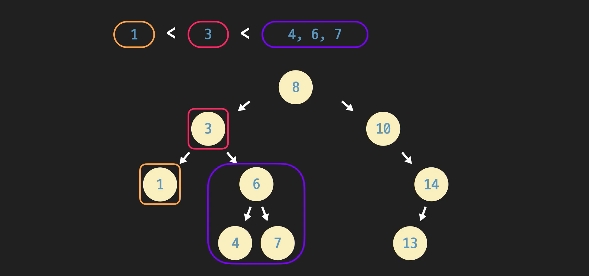

  이진탐색트리를 사용하면, 데이터를 찾는게 엄청 쉬움. 예를 들어 4를 찾고 싶다고 한다면, 작고 크고로 오른쪽 왼쪽으로 가면 돼. 각 왼쪽 오른쪽으로 가면서 데이터를 탐색해 갈 수 있음. 

  

- #### 이진탐색트리 노드 구현

  힙은 항상 완전이진트리였기 때문에 배열로 구현했음. 이진탐색트리는 이진트리이지만 완전이진트리라는 보장은 없다. 보통은 파이썬 리스트나 배열 등으로 구현하지 않는다. 

  

  부모 링크만 추가하면 됨. 각 노드는 자식들과 부모에 대한 레퍼런스를 모두 저장하고 있다. 

  

  ```python
  
  class Node:
      """이진 탐색 트리 노드 클래스"""
      def __init__(self, data):
          self.data = data
          self.parent = None
          self.left_child = None
          self.right_child = None
  
  # 노드 인스턴스 생성
  node_0 = Node(5)
  node_1 = Node(3)
  node_2 = Node(7)
  
  node_0.left_child = node_1
  node_0.right_child = node_2
  
  node_1.parent = node_0
  node_2.parent = node_0
  ```

  

  노드 클래스 뿐만이 아니라, 이진탐색트리 자체도 클래스로 만들면 조금 더 쉽다. 

  ```python
  
  class Node:
      """이진 탐색 트리 노드 클래스"""
      def __init__(self, data):
          self.data = data
          self.parent = None
          self.left_child = None
          self.right_child = None
  
  class BinarySearchTree:
      """이진탐색트리 클래스"""
      def __init__(self):
          self.root = None
  
  bst = BinarySearchTree()
  ```

  아직은 생성하는 기능만 있고, 추가 등의 기능은 없음. 다음 레슨부터 어떻게 해야 되는지 알아볼 것. 


- #### 이진탐색트리 출력

  **in-order 순회**

  이진 탐색 트리에는 굉장히 재미있는 특성이 하나 더 있는데요. 전에 배웠던 in-order 순회, 기억나시나요?

  이런 트리를:

  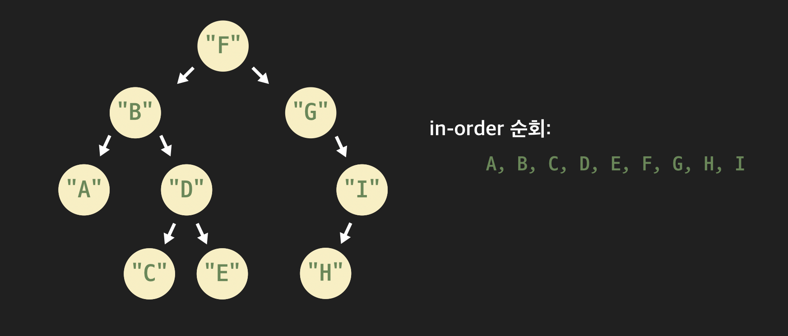

  in-order 순회하면서 노드의 값을 출력하면 A, B, C, D, E, F, G, H, I의 순서대로 출력됩니다.

  기억이 안 나는 분들을 위해 다시 정리하면 in-order 순회는

  1. 왼쪽 부분 트리를 in-order 순회한다
  2. 현재 노드의 데이터를 출력한다
  3. 오른쪽 부분 트리를 in-order 순회한다

  의 순서로 전체 트리를 순회합니다. 그래도 기억이 안 나시면 챕터 1을 복습하고 오세요.

  **in-order 순회와 이진 탐색 트리**

  이진 탐색 트리를 in-order 순회하면 저장된 데이터들을 정렬된 순서대로 출력할 수 있습니다. 아래와 같은 이진 탐색 트리가 있다고 했을 때

  

  트리의 root 노드(8이 있는 노드)를 in-order 순회 함수의 파라미터로 넘겨주면 트리 안에 있는 데이터를:

  1, 3, 4, 6, 7, 8, 10, 13, 14

  처럼 정렬된 순서대로 출력할 수 있는 거죠.

  **BinarySearchTree 클래스**

  이전에 구현해 본 in-order 순회 함수를 재활용해서 이진 탐색 트리를 나타내는 BinarySearchTree 클래스에 트리 속의 데이터를 순서대로 출력하는 메소드, `print_sorted_tree` 메소드를 작성할게요.

  ```python
  def print_inorder(node):
      """주어진 노드를 in-order로 출력해주는 함수"""
      if node is not None:
          print_inorder(node.left_child)
          print(node.data)
          print_inorder(node.right_child)
  
  
  class BinarySearchTree:
      """이진 탐색 트리 클래스"""
      def __init__(self):
          self.root = None
  
  
      def print_sorted_tree(self):
          """이진 탐색 트리 내의 데이터를 정렬된 순서로 출력해주는 메소드"""
          print_inorder(self.root)  # root 노드를 in-order로 출력한다
  ```

  이제 트리를 출력할 때는 `print_sorted_tree` 메소드를 사용하겠습니다!


- #### 이진탐색트리 삽입

  당연하지만, 삽입한 뒤에도 이진탐색트리여야지. 

  

  13을 저장하는 새로운 노드를 만든다. 그리고, 어디에 저장해야 할지 위치를 알아내야 함. 

  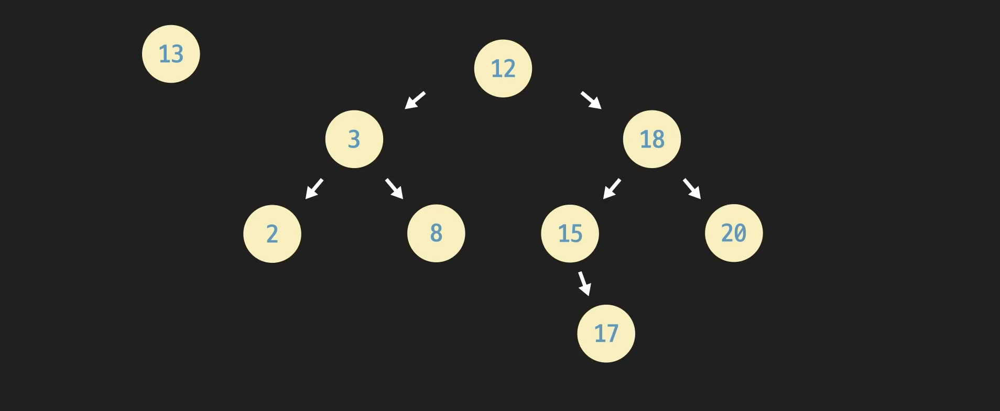

  루트 노드 부터 시작하는거지. 일단 18로 가. 그리고 18보다 작으니깐 15로 가. 그리고 15보다 작어. 거기에 노드가 없으면 추가하면서 가면 됨. 

  

  일반화 하자면 다음과 같다. 

  

  그러면 시간복잡도는 어떨까? 트리의 높이를 h라고 해보자. 

  최악의 경우는 트리의 높이만큼 비교하면서 내려와야 함. 예를 들어 아래에서 16을 넣는다고 하면 17을 아래까지 가지고 와야 함. 트리높이 보다 1만큼 더 비교해야 함. 

  

  즉, 시간복잡도는 **O(h)**가 걸린다는 뜻. 

  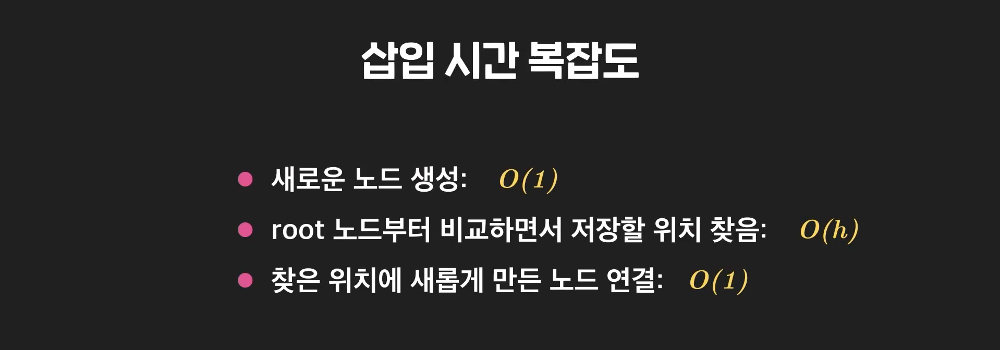

  

- #### 이진탐색트리 탐색

  

  탐색은 왼쪽 오른쪽으로 오며가며 찾으면 끝. 

  

  

  **시간복잡도는?**

  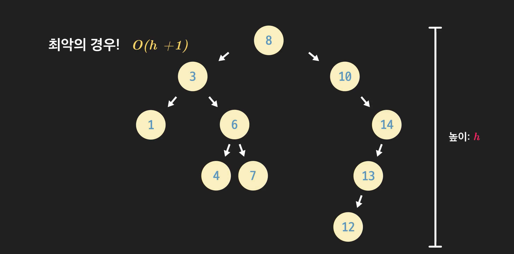

  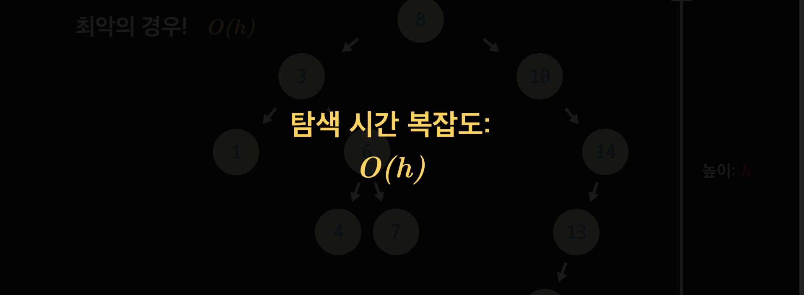


- #### 이진탐색트리 삭제 1

  삭제할때는 여러가지 경우를 고려해야 한다. 

  일단 그 데이터를 저장하고 있는 노드에 접근해야 한다. 이때는 그냥 이전에 했던 탐색연산을 사용하면 됨. 

  

  이제 찾았으면 경우의수가 있음. 

  **경우1. 지우려는 노드가 leaf 노드일때**

  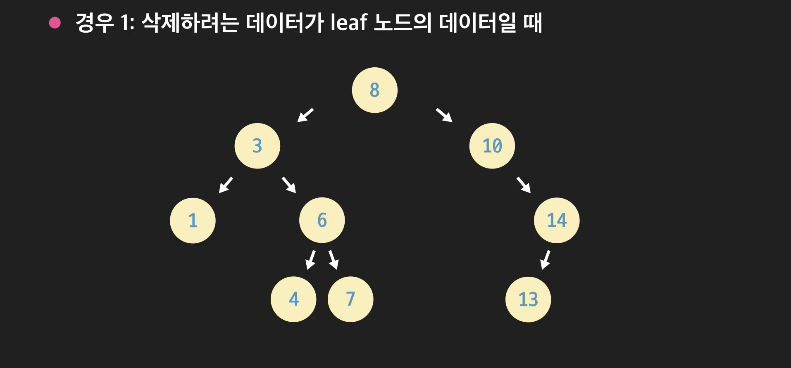

  이때는 그냥, 부모 6의 오른쪽 자식 레퍼런스를 None으로 지정해 주면 됨. 

  

  오른쪽, 왼쪽 자식인지만 확인하면 됨. 

  **경우2. 삭제하려는 노드가 하나의 자식 노드만 있을 때**

  

  이때는 그냥 자식이 부모의 자리 차지하게 하면 된다. 14를 8의 오른쪽 자식 노드로 지정하면 끝. 

  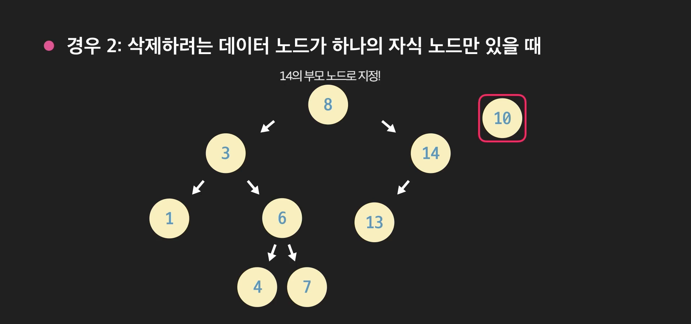


- ####  이진탐색트리 삭제2

  마지막 경우는 삭제하려는 데이터의 노드가 두개의 자식이 있을 때. 

  

  자식이 두개인 노드를 삭제하려면 이 노드를 다른 노드가 매꿔줘야 한다. 

  **일단 지우려는 노드의 오른쪽 자식으로 가야 한다.**

  16을 루트로 갖는 부분트리에서 가장 작은 노드를 찾는다. 

  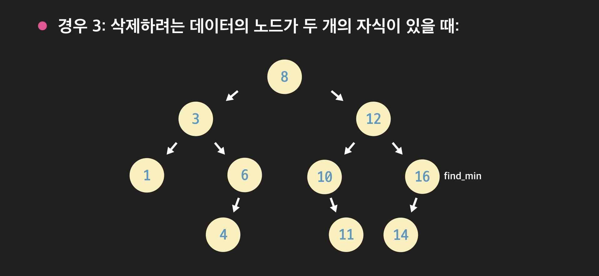

  어떻게 되는 걸까?

  일단 12의 오른쪽 부분에 있는 모든 데이터는 왼쪽 부분에 있는 모든 데이터 보다 크다. 

   고로, 12를 14로 바꿔도 왼쪽에 있는 모든 부분트리는 14보다 작을 수 밖에 없다. 마찬가지로 14는 12 오른쪽의 부분트리에서 가장 작은 데이터를 찾은 것. 고로 14가 12를 대체해도, 오른쪽 부분에 있는 모든 데이터는 14보다 크다. 

  이진탐색트리에서는 어떤 노드보다 큰 모든 노드 중 가장 작은 노드를 **successor**라고 부른다. 

  지금 14는 12보다 큰 데이터들 중 가장 작기 때문에 12의 successor라고 볼 수 있다. 

  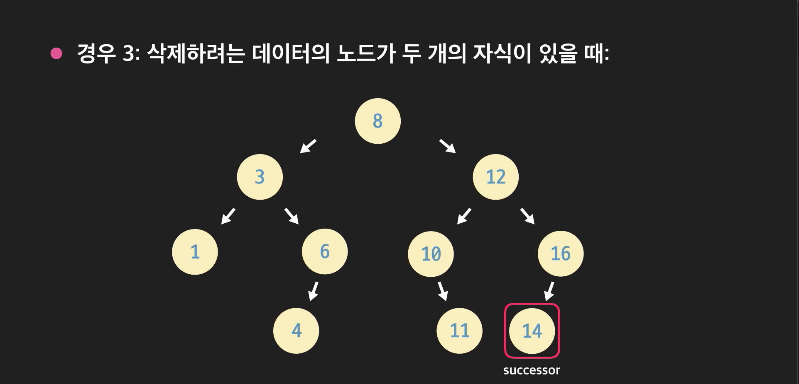

  그럼 이것을 어떻게 대체할까? 노드 자체를 대체하는 것이 아니라, 노드에 있는 데이터만 대체하는 것. 그 다음 successor노드를 삭제한다. 이때 지우려는 successor노드는 왼쪽 자식이 있을 수가 없다. leaf노드거나 오른쪽 노드만 있을 수 있다. 이게 당연한게, **제일 작은거** 찾은거잖아. 

  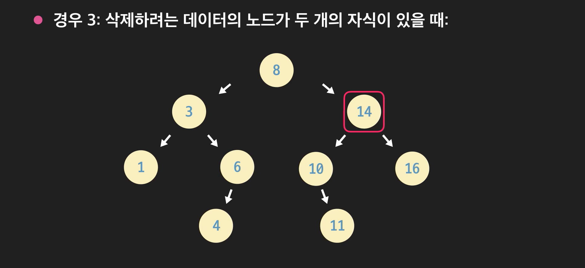successor를 삭제할때는 아래의 경우들을 고려해야 한다. 

  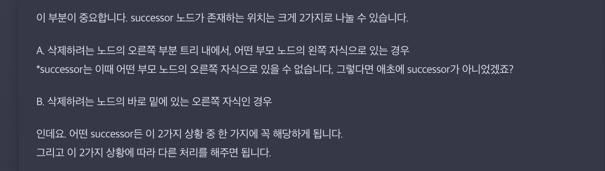


- ####  이진탐색트리 삭제 연산 시간 복잡도

  **이진 탐색 트리 삭제 연산 시간 복잡도**

  이번 레슨에서는 삭제 연산의 각 경우들의 시간 복잡도들에 대해서 생각해볼게요.

  **탐색**

  일단 삭제 연산은 공통적으로 삭제하려는 데이터를 갖는 노드를 탐색해야 합니다. 영상에서 봤듯이, 이진 탐색 트리의 높이를 h라고 했을 때, 탐색 연산은 O(h)의 시간 복잡도가 걸립니다.

  데이터를 삭제할 때의 3가지 경우를, 일단 공통 단계인 탐색을 제외하고, 그러니까 이미 지우려는 노드를 찾았다고 가정하고 생각해볼게요.

  **삭제 경우 1: 지우려는 데이터 노드가 leaf 노드일때**

  이때는 탐색한 노드의 부모에서 자식 레퍼런스를 None으로 지정해주면 됐죠? 걸리는 시간이 노드 개수나 트리 높이에 비례하지 않습니다. O(1)이 걸리죠.

  **삭제 경우 2: 지우려는 데이터 노드가 하나의 자식이 있을 때**

  삭제하려는 노드의 부모의 자식을 삭제하려는 노드의 자식으로 만들어 줬는데요. 이때는 어떤 노드인지와 상관없이 그냥 레퍼런스 2개만 연결시켜주면 됩니다. 이 경우도 O(1)이 걸립니다.

  **삭제 경우 3: 지우려는 데이터 노드가 두 개의 자식이 있을 때**

  이 경우 좀 여러 개의 단계가 있었죠?

  1. 먼저 지우려는 데이터 노드의 successor 노드를 찾는다
  2. 지우려는 노드에 successor 노드의 데이터를 저장한 후
  3. successor 노드를 지운다

  이렇게 세 단계로 이뤄졌었는데요.

  1단계부터 살펴볼게요.

  successor 노드를 구하는 연산은 얼마나 걸릴까요? successor 노드는 삭제하려는 노드의 오른쪽 자식을 `find_min` 메소드의 파라미터로 넘겨줘서 구했었는데요. 과제에서 구현한 `find_min` 메소드는 총 O(h)이 걸린다고 했잖아요? 그렇기 때문에 1단계는 O(h)이 걸립니다.

  2단계는 단순히 노드에 데이터를 넣는 단계라서 O(h)가 걸리고(여기도 지금 전제가 빠져있음. 그 데이터를 가지고 가서 넣으려면 한 단계씩 접근해야 된다고 전제하고 있음),

  3단계는 successor가 오른쪽 자식 노드가 있으면 O(2), 없으면 O(1)이 걸리기 때문에(이전 과제의 해설을 잘 살펴보면 왜 그런지 알 수 있습니다), 결국 O(1)이 걸립니다.

  합쳐 보면 총 O(h + h + 1)이 걸리는 건데요. 결국에 세 번째 경우는 탐색을 제외하고 O(h)이 걸리는 거죠?

  **정리**

  정리해볼게요.

  삭제 연산 시 3가지 경우들의 시간 복잡도를 표로 나타내면:

  |        | 탐색 | 탐색 후 단계들 |
  | ------ | ---- | -------------- |
  | 경우 1 | O(h) | O(1)           |
  | 경우 2 | O(h) | O(1)           |
  | 경우 3 | O(h) | O(h)           |

  이렇게 됩니다. 이제, 탐색 후 단계들의 시간 복잡도에, 방금 잠시 제외해두었던 탐색 연산 자체의 시간 복잡도 O(h)까지 더해주면

  |        | 탐색 + 탐색 후 단계들 |
  | ------ | --------------------- |
  | 경우 1 | O(h)                  |
  | 경우 2 | O(h)                  |
  | 경우 3 | O(h)                  |

  각 경우의 시간 복잡도는 결국 이렇게 됩니다. 어떤 경우든 O(h)이 걸리네요. 삭제 연산도 나머지 연산들과 마찬가지로 총 O(h)의 시간 복잡도를 가지는군요.


- #### 이진탐색트리 높이 h 분석

  **이진 탐색 트리 높이**

  트리의 높이가 h라고 할 때, 이진 탐색의 가장 기본적인 연산들: 탐색, 삽입, 삭제의 시간 복잡도는 모두 O(h)입니다. 따라서 이진 탐색 트리는 높이가 낮을수록 여러 연산을 하기에 효율적이라는 것을 알 수 있는데요. 이번 레슨에서는 이진 탐색 트리의 높이, h에 대해서 좀 더 깊이 알아볼게요.

  이진 탐색 트리는 완전 이진 트리가 아닌 경우가 더 많습니다. 그렇기 때문에 노드가 n개 있을 때, 높이 h가 항상 O*(lg(*n))이라고 할 수 없습니다.

  최악의 경우를 예로 들자면, 이진 탐색 트리의 높이는 O*(*n)이 될 수 있는데요. 이진 탐색 트리에 데이터로 1, 2, 3, 4, 5, 6을 순서대로 삽입하면:

  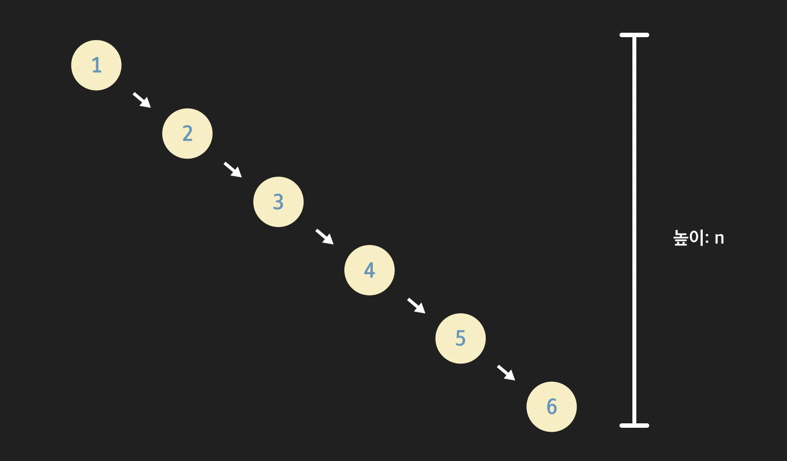

  이진 탐색 트리가 이렇게 되겠죠? 노드의 개수가 n일 때, 트리의 높이도 n입니다. 이런 식으로 트리 안에서 노드가 직선적인 모양으로 저장됐을 때 “*트리가 한쪽으로 편향됐다 또는 치우쳤다*”라고 표현합니다.

  반대로 이진 탐색 트리가 이런 식으로 저장됐다고 합시다.

  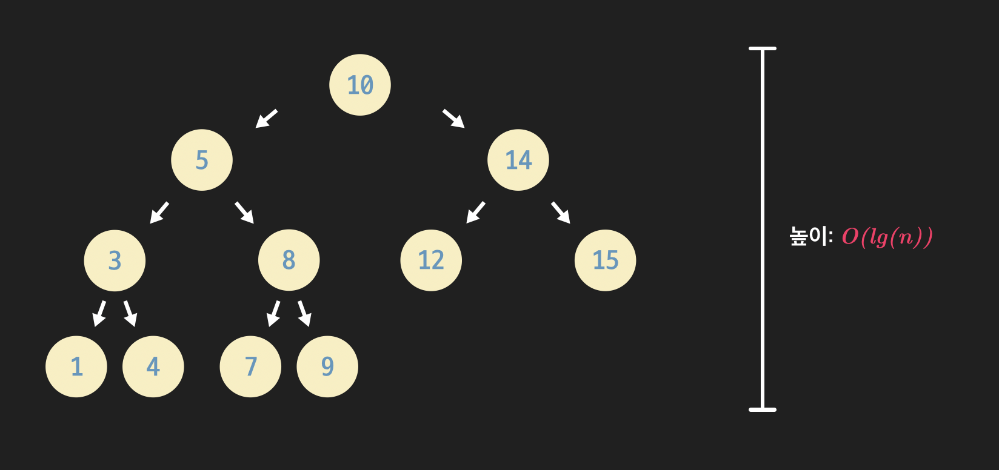

  root 노드를 기준으로 트리의 왼쪽과 오른쪽이 균형을 이루는 모습인데요. 이런 균형잡힌 모양이 될수록 이진 탐색 트리의 높이는 작아지겠죠? 트리의 높이가 작을수록, 그러니까 그 높이가 lg(*n*)에 가까울수록 “**트리가 균형이 잡혔다**”라고 합니다.

  이진 탐색 트리 연산들의 시간은 모두 그 높이 h에 비례합니다. 그럼 결론적으로

  - *편향된 트리일수록 연산들이 비효율적으로,*
  - *균형이 잡힌 트리일수록 연산들이 효율적으로*

  이루어진다고 볼 수 있습니다.

  **이진 탐색 트리 평균 높이**

  최악의 경우 이진 탐색 트리의 높이는 n이 되지만, 항상 최악의 경우가 일어나는 건 아닙니다. 이진 탐색 트리의 높이가 평균적으로는 어떻게 되는지 생각해봅시다.

  총 n개의 데이터를 이진 탐색 트리에 삽입하면, 삽입을 할 때 그 순서의 경우의 수는 n! 입니다. 그러니까 1 ~ 6의 정수 데이터를 삽입하는 경우, 총 경우의 수는 6 * 5 * 4 * 3 * 2 * 1입니다. 수학적으로 모든 순서의 확률이 동일하다고 가정하고 이 경우들의 평균 높이를 계산하면 O*(lg(*n))이 됩니다.

  그러니까 “**평균적으로 이진 탐색 트리의 높이 h는 O*(lg(*n))이다**” 라고 할 수 있긴 합니다. 하지만 이진 탐색 트리에 삽입 연산과 삭제 연산들을 반복적으로 계속 하면 높이가 *O*(lg(*n*))일 거라는 보장을 할 수 없죠. 실제로 생각보다 균형을 잃기 쉽습니다.

  **정리**

  정리하자면,

  이진 탐색 트리의 n개의 데이터들이 임의의 순서대로 삽입되었다고 가정을 하면 트리의 높이 h는 평균적으로 O*(lg(*n))으로 표현할 수 있습니다. 이걸 이진 탐색 트리의 탐색, 삽입, 삭제 연산에 적용해보면 세 연산의 시간 복잡도는 모두 평균적으로는 *O*(lg(*n*))인 거죠.

  | 이진 탐색 트리 연산 | 시간 복잡도                        |
  | ------------------- | ---------------------------------- |
  | 삽입                | O(h)(평균적 O*(lg(*n)), 최악 O(n)) |
  | 탐색                | O(h)(평균적 O*(lg(*n)), 최악 O(n)) |
  | 삭제                | O(h)(평균적 O*(lg(*n)), 최악 O(n)) |

  하지만 삽입과 삭제 연산들을 반복하다보면 이진 탐색 트리의 노드들이 한쪽으로 편향될 수 있기 때문에 이진 탐색 트리의 연산들의 시간 복잡도는 보통 높이 그대로 O(h)로 표기합니다.


- #### 이진탐색트리로 딕셔너리 구현하기

  챕터 초반에 이진 탐색 트리를 이용하면 추상 자료형 딕셔너리를 구현할 수 있다고 했잖아요? 딕셔너리 (또는 맵)는 key - value 데이터 쌍을 찾고, 저장하고, 지울 수 있게 해주는 추상 자료형인데요. 혹시나 잘 모르시거나 기억이 안 나신다면 기본 자료 구조 토픽을 복습하고 오시는 걸 추천드립니다. 이진 탐색 트리를 사용해서 어떻게 딕셔너리를 구현할 수 있는지 알아보겠습니다.

  **이진 탐색 트리 노드**

  이전에는 이진 탐색 트리의 노드 클래스를 이렇게 정의했었죠?

  ```python
  class Node:
      """이진 탐색 트리 노드 클래스"""
      def __init__(self, data):
          self.data = data
          self.parent = None
          self.left_child = None
          self.right_child = None
  ```

  여기서 조금만 바꿔주면 되는데요.

  딕셔너리용 이진 탐색 트리 노드

  ```python
  class Node:
      """이진 탐색 트리 노드 클래스"""
      def __init__(self, key, value):
          self.key = key
          self.value = value
          self.parent = None
          self.left_child = None
          self.right_child = None
  ```

  이렇게 이진 탐색 트리 노드를 새롭게 정의해주면 됩니다. 전에는 노드의 데이터, 변수 `data`를 이용해서 원하는 노드를 삽입, 삭제, 탐색했던 거 기억 나시나요? 이렇게 노드를 새롭게 정의하면 노드를 `data`가 아닌 변수 `key`를 사용해서 찾고 저장하고 지웁니다.

  그러니까 특정 key가 주어졌을 때, 이 key에 해당하는 노드를 찾고, 저장하고 지울 수 있는 거죠.

  다행히 크게 바뀌는 게 없는데요. 이진 탐색 트리 클래스의 연산들도 이 새로운 노드 클래스의 내용에 맞게 수정해주기만 하면 됩니다.

  이렇게 하면 이제 이진 탐색 트리 노드에 key - value 데이터 쌍을 자연스럽게 저장할 수 있는 거죠.

  **시간 복잡도**

  어차피 연산들 자체는 data 변수 대신 key를 사용하는 것으로 바뀌었을 뿐입니다. 노드에 data 대신 key - value 두 변수를 저장한다고 시간 복잡도가 바뀌는 건 없겠죠?

  | 이진 탐색 트리 연산                     | 시간 복잡도                        |
  | --------------------------------------- | ---------------------------------- |
  | key를 이용한 key - value 데이터 쌍 삭제 | O(h) (평균 시간 복잡도 O(lg(*n*))) |
  | key를 이용한 노드 또는 value 탐색       | O(h) (평균 시간 복잡도 O*(lg(n*))) |
  | key - value 쌍 삽입                     | O(h)(평균 시간 복잡도 O(lg(n)))    |

  세 가지 연산을 모두 O(h)로 할 수 있습니다.


- #### 이진탐색트리 평가

  이진 탐색 트리가 다른 자료 구조들에 비해서 실제로 얼마나 효율적인지 살펴봅시다.

  **비교**

  이진 탐색 트리와 용도가 비슷한 자료 구조가 뭐가 있었는지 생각해볼까요?

  일단 이진 탐색 트리를 사용하는 가장 대표적인 예시는 추상 자료형, 세트(set)와 딕셔너리(dictionary)를 구현하는 건데요. 해시 테이블을 사용해도 두 추상 자료형을 구현할 수 있었던 거, 기억 나시나요? 기본 자료 구조 토픽에서 배웠던 해시 테이블의 시간 복잡도를 가지고 와서 이진 탐색 트리와 나란히 놓고 봅시다.

  |      | 이진 탐색 트리                         | 해시 테이블            |
  | ---- | -------------------------------------- | ---------------------- |
  | 삽입 | O(h)(평균적 O*(lg(*n)), 최악 *O*(*n*)) | 평균적 O(1), 최악 O(n) |
  | 탐색 | O(h) (평균적 O*(lg(*n)), 최악 O(n)     | 평균적 O(1), 최악 O(n) |
  | 삭제 | O(h) (평균적 O*(lg(*n*)), 최악 O(n)*   | 평균적 O(1), 최악 O(n) |

  삽입, 탐색, 삭제… 세 연산 모두 이진 탐색 트리보다 해시 테이블을 사용하는 게 더 효율적인데요.

  그럼 이진 탐색 트리는 언제 사용하는 걸까요?

  이진 탐색 트리에서 할 수 있고, 해시 테이블에서 할 수 없는 게 뭐가 있을지 생각해봅시다.

  이진 탐색 트리는 데이터 사이에 순서를 저장해주는 자료 구조입니다. 저희는 이전에 in-order 순회를 단순히 트리 안에 있는 데이터를 출력하는 용도로 사용했었죠? 이런 출력 용도가 아니라도 모든 데이터를 정렬된 상태로 가지고 오거나, 정렬된 상태로 무언가 하고 싶을 때도 in-order 순회를 통해 모든 데이터를 빠르게 정렬해서 가지고 올 수 있습니다.

  반면 해시 테이블은 데이터 사이에 순서 관계를 저장할 수 없는 자료 구조입니다. 데이터를 정렬하고 싶으면 순서를 저장하는 다른 자료 구조에 똑같은 데이터를 저장한 뒤에 정렬시켜야하죠.

  세트와 딕셔너리는 데이터 사이에 순서 관계를 약속하지 않는 추상 자료형이긴 합니다. 하지만 이 두 가지를 사용하면서도 데이터 사이의 순서 관계를 저장해야하는 경우들이 생길 수 있는데요. 이런 경우에는 해시 테이블을 사용하기 힘들겠죠? 이럴 때 바로 이진 탐색 트리를 사용해야 합니다.

  **정리**

  정리를 하면 추상 자료형, 세트나 딕셔너리를 코드로 구현할 때, 일반적인 경우에는 해시 테이블을 사용하는 게 이진 탐색 트리를 사용하는 것보다 더 효율적입니다. 하지만 **세트의 데이터나 딕셔너리의 key를 정렬된 상태로 사용하고 싶을 때는 이진 탐색 트리를 사용해야 하구요.** 물론 이때는 해시 테이블 때보다는 연산의 효율성은 조금 포기해야겠죠.