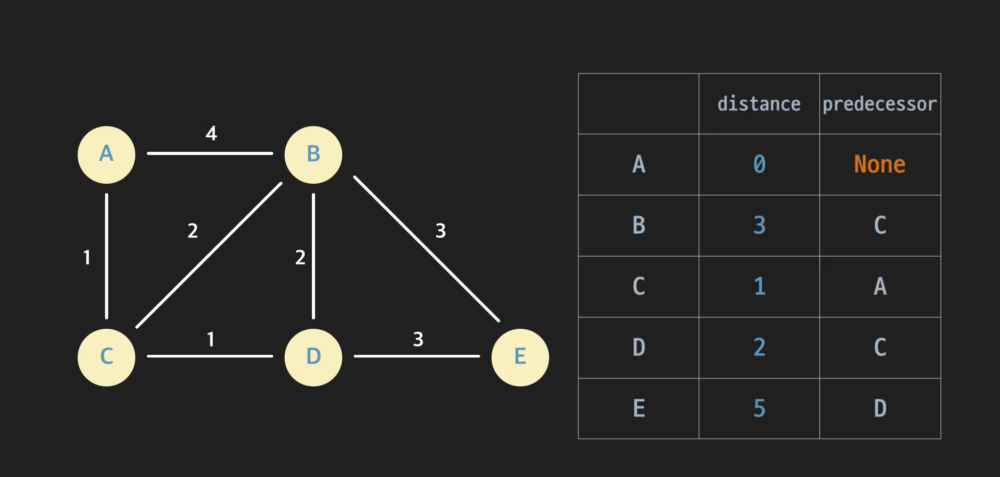

# Data_Structure_8-Dijkstra 

- #### Dijkstra 알고리즘

  이  알고리즘은 가중치래프에서 최단경로를 찾는 방법. 이 방법 사용하기 위해서는 그래프 노드에 3가지 변수를 저장해야 한다. 

  

  일단 distance변수는 시작점에서, 이 노드까지의 거리이다. 그런데 시작점에서 이 노드로 오는 경로는 여러개 이다. 어떤 값을 저장해야 할까?

  최단거리 예상치라고 생각하면 된다. 이게 무슨말이냐면, 우리가 노드를 한꺼번에 다 방문하는게 아니라 하나씩 방문하잖아. 이 distance는 현재까지 아는 정보로 계산한 최단거리를 의미한다. 

  

  아래 그래프에서 ABD경로는 찾았지만, ACD경로는 아직 못찾았다고 가정해 보자. 그럼 현재까지 아는 선에서, A부터 D까지의 최단경로는 ABD이다. 

  ACD가 더 짧더라도 그것은 아직 못봤으니깐. 일단 6을 저장하고, 더 짧은 경로를 찾으면 수정해주면 된다는 것. 

  

  

  다음은 **Predecessor**변수. 

  현재까지 찾은 최단 경로에서 바로 직전의 노드를 저장하는 것.

  

  위랑 똑같이, ABD는 찾았지만, ACD는 못찾았다고 가정하면, 그럼 여기서 D의 predecessor는 이 경로에 있는 직전 노드 즉, B가 되는 것. 

  

  D로 오는 더 짧은 경로를 찾으면 그때, D의 predecessor를 수정해 주면 된다. 

  마지막으로 **Complete** 변수. 어떤 노드를 완전히 파악했는지 표시해 두는 변수. 

  

  노드를 하나씩 방문하다 보면, 확실히 최단경로를 찾았다면 그때 True로 바꿔 주는 것. 

  

- #### 엣지 Relaxation

  다익스트라 알고리즘에서는 노드를 하나씩 방문한다. 방문하면서 해당 노드의 Distance, Predecessor를 업데이트 해주는 것. 이것을 **Relaxation**이라고 부른다. 

  

  예시를 보자. 

  A의 distance는 3이고, B의 distance는 7이다. 그리고, A와 B사이 가중치는 2이다. 

  일단 relaxation한다는 것은, A의 디스턴스와 엣지 A, B의 가중치와 더한 후 B와 비교한다. 

  5는 7보다 작다. 이게 무슨 말일까? 

  B의 distance가 7이라는 것은, 현재까지 아는 정보로 시작점에서 B까지의 최단거리는 7이라는 뜻. 근데, A들렀다 가는게 5야. 그러면, 시작점에서 B까지의 경로중에 더 짧은 거리를 발견한 것. 

  

  그러면 이제 B의 distance를 5로 바꿔줘야지. 그리고, B의 predecessor를 5로 바꿔준다. 

  

  반대로 이런 경우도 생각해 보자. 

  A는 Distance가 3이고, B는 7. 그리고, edge A-B는 가중치가 6. 

  이번에도 A의 distance와 엣지(A, B)의 가중치를 더한다. 그리고 이것을 distance 7과 비교한다. 

  이럴때는 아무것도 안해줘야지. 

  

  

  이와 같은 과정을 "**엣지 A B를 Relax한다**"라고 말한다. 

- #### Dijkstra 알고리즘

  *distance, predecessor, complete변수를 저장한다는 것을 기억하자.* 

  distance와 predecessor는 표로, 그리고 complete는 색으로 나타낸다. 처음 초기화 값은 **무한대**와 **None**. 아직 방문한 노드들도 없기 때문에, Complete도 *False*로 초기화. 

  

  일단 시작노드로 간다. 시작노드에서 시작노드 자신의 거리는 0. distance = **0**, predecessor = **None**  

  

  그 다음 Complete처리가 되지 않은 노드중, 가장 distance가 작은 노드를 보면, distance가 0인 A. 그 다음 A의 엣지들을 본다. 연결된 엣지의 노드가 complete된 노드면 건너 뛴다. 아직은 Complete처리된 노드가 없기 때문에, **edge A, B**와 **edge A, C**를 다 relax 해 주면 된다. 

  일단 A, B를 relax해보자. B의 distance는 무한대. 그리고, 0의 distance는 0이고 엣지의 가중치는 4이다. 더하면, 4 이다. 

  무한대 보다 작으니깐, B의 distance는 4로 바꿔주고, predecessor는 A로 수정. 

  

  그리고, 이제 edge A, C도 relax해줘야 함. 

  C의 distance는 무한대, 그리고, A+edge 하면 1. C도 1로 초기화하고, predecessor 수정. 

  

  다 됬으면, 이제 A를 Complete처리한다. 즉, Complete 변수를 True로 바꾸는 것. 

  그리고, 다음은 Complete되지 않은 노드 중, 가장 작은 노드를 고른다. C이다. 

  

  C의 엣지들을 모두 relax해준다(다만, Complete된 엣지들은 다 무시한다).  그 후에 C는 complete처리. 

  

  이번에 또다시, complete안된거 중에서, distance가 가장 작은 노드를 고른다. 

  그럼 이번에는 distance가 2인 D. 

  이렇게 끝까지 가면 된다. 

  모든 노드 complete됬다. 알고리즘 종료한다. 

  

  이제 최단 거리를 알고 싶으면, distance를 이용하면 되고, 최단 경로를 알고 싶으면 predecessor를 이용해서 역추적 하면 끝임. 

  

  

- #### Dijkstra로 찾은 경로가 최단 경로인 이유

  Djkstra 알고리즘을 이해하려면, 먼저 최단 경로의 성질을 좀 이해해야 합니다. 이 성질에 대해서 알아본 다음에 Dijkstra 알고리즘으로 구한 경로가 왜 최단 경로인지를 알아볼게요.

  **최단 경로 문제와 최적 부분 구조(Optimal Substructure)**

  Dijkstra로 구한 경로가 왜 최단 경로인지 보기 전에 먼저 최단 경로의 중요한 성질 하나를 짚고 넘어갈게요.

  

  이 그래프를 봅시다. A에서 E까지의 최단 경로는 A - C - D - E입니다. 여기서 부분 경로를 봅시다. 부분 경로는 그냥 경로 안에 있는 경로인데요. 예를 들어 A - C - D, C - D - E, 이런 건 다 A - C - D - E 안에 있는 경로들이죠? 이런 걸 부분 경로라고 합니다.

  자, 여기서 특별한 성질 하나를 알려드릴게요. **만약 A - C - D - E가 A에서 E까지의 최단 경로라면, A - C - D는 A에서 D까지의 최단 경로고, C - D - E는 C에서 E까지의 최단 경로입니다. 최단 경로 안에 있는 부분 경로들은 모두 최단 경로라는 거죠.**

  이걸 어떻게 증명할 수 있을까요?

  최단 경로 안에 있는 부분 경로들이 최단 경로가 아니라고 가정을 해 볼게요.

  예를 들어서 A - C - D - E가 A에서 E까지의 최단 경로인데, A에서 D까지의 최단 경로는 A - C - D가 아니 라 A - B - D라고 가정하는 거죠. 이게 말이 될까요?

  A - B - D가 A - C - D보다 더 짧다면, A에서 D까지의 최단 경로는 A - C - D - E가 아니라 A - B - D - E가 되어야 합니다. 애초에 우리가 가정한 게 말이 안 된다는 거죠. 최단 경로 안에 있는 부분 경로가 최단 경로가 아닌 건 말이 안 된다는 겁니다. 그러니까 최단 경로 안에 있는 부분 경로는 무조건 최단 경로라고 확신할 수 있습니다.

  그럼 이 성질은 뭘 의미할까요? A에서 E까지의 최단 경로를 찾는 문제는 A에서 D까지의 최단 경로를 찾는 문제와도 연관이 있고, A에서 B까지의 최단 경로를 찾는 문제와도 연관이 있고, A에서 C까지의 최단 경로를 찾는 문제와도 연관이 있습니다. 최단 경로를 구하기 위해서 부분 최단 경로를 이용할 수 있다는 거죠.

  **Dijkstra 알고리즘 증명**

  Dijsktra 알고리즘을 처음 시작할 때를 생각해봅시다. 노드 A를 시작점으로 했다고 할게요. A의 distance는 0, predecessor는 None이라고 설정합니다.

  

  그 다음에는 A와 인접한 노드들을 도는데요. 이미 방문한 노드는 무시합니다. 일단 B와 C는 다 방문한 적이 없습니다. B부터 볼게요. 엣지 A - B와 A - C를 relax해줍니다.

  그 다음에 A를 방문했다는 표시를 해주고, 방문하지 않은 노드 중 distance가 가장 작은 C를 가지고 옵니다. 여기서 여러분께 말씀 안 드린 한 가지 정보가 있습니다. 바로 이때의 C의 distance 1은 A에서 C까지의 최단 경로 거리라고 확신할 수 있다는 건데요.

  

  A에서 C까지 가는 많은 경로가 있습니다. 어떻게 바로 한 번에 **1이 최단 거리라는 걸 알 수 있을까요?** 같이 한 번 생각해봅시다.

  A는 인접한 노드가 B와 C, 딱 두 개밖에 없습니다. 그럼 A에서 C로 가는 모든 경로는 A에서 B를 지나가거나 A에서 C를 지나가거나, B와 C 중 하나는 무조건 지나갈 수 밖에 없는데요. 엣지 (A, C)는 1입니다. C를 지나가는 경로는 일단은 1인 거죠. 그럼 이번에는 A에서 시작해서 B를 지나가는 경로들에 대해서 생각해볼까요? 예를 들어서 A - B - C, A - B - D - C 이런 경로들이 있는데요. B를 지나가는 모든 경로의 공통점은 엣지 A - B를 지나간다는 점입니다. 근데 생각해보면 A에서 C를 가는 경로가 이미 A에서 B로 가는 경로보다 작습니다. 그러니까 A - B의 거리가 이미 4니까 B를 지나가는 다른 모든 경로는 기본적으로 현재 C의 distance 보다는 클 수 밖에 없죠. 그렇기 때문에 바로 C의 distance 1이 A에서 C까지 가는 모든 경로중 최단 거리라고 확신할 수 있습니다.

  이런식으로 Dijkstra에서는 방문하지 않은 노드들 중 distance가 가장 작은 노드를 고르잖아요? C의 distance가 시작점에서 C까지의 최단 거리라고 확신할 수 있었는데요. **이렇게 각 단계에서 distance가 가장 작은 노드는 이미 최단 거리를 저장하고 있다고 확신할 수 있습니다.**

  좀 더 봅시다. C는 이미 최단 거리를 구했으니까. 이번에는 C의 엣지를 relax 해줄게요. 현재 남은 노드들 중 distance가 가장 작은 노드가 D가 됐는데요. 이때도 마찬가지로 **D의 distance가 A에서 D까지의 최단 거리라고 확신할 수 있습니다.**

  

  왜 그런지 볼게요.

  D까지 가능 경로 중 최단 경로가 될 수 있는 모든 경로들에 대해서 생각해봅시다. D는 인접한 노드 C, B, E가 있습니다. 그럼 D까지 가는 최단 거리는

  1. C까지 가는 최단 거리 + 엣지 (C, D)의 가중치
  2. B까지 가는 최단 거리 + 엣지 (B, D)의 가중치
  3. E까지 가는 최단 거리 + 엣지 (E, D)의 가중치

  이렇게 세 가지 가능성 밖에 없잖아요?

  지금까지 A에서 D까지의 최단 경로는 A - C - D경로고, `distance`는 2인데요. 그러니까 위에 세 가지 가능성을 살펴봤을 때 경우 1인데요. 어떻게 나머지 두 개의 경우들을 보지도 않고 *지금 경로보다 더 길다고 확정지을 수 있을까요?*

  증명을 위해 현재 찾은 경로보다 더 짧은 경로가 있다고 할게요. 그리고 이게 B를 통해서 D를 오는 경로라고 할게요. 그 말은 B까지 가는 최단 경로 거리 + 엣지 (B, D)의 가중치가 2 보다 작다는 말인데요. 이건 말이 안 되죠? 만약 B까지 2 보다 짧은 경로가 있었으면 B의 `distance`가 D보다 작아야 하는데요. D는 이미 최단 거리가 확정된 노드들을 제외하고 `distance`가 가장 작은 노드를 선택한 노드입니다. 그러니까 B까지 가는 최단 경로 중 거리가 D의 `distance`인 2 보다 작은 경로는 없다고 확정 지울 수 있습니다.

  **정리**

  정리해볼게요.

  1. Dijkstra 알고리즘은 반복문을 돌면서 최단 경로를 이미 찾은 노드를 하나씩 찾아줍니다.

     1. 처음에는 시작 노드의 최단 경로를 확정 지었고, 그 다음에는 C의 최단 경로를 확정 지었습니다.

  2. 그리고 최단 경로를 이미 찾은 노드의 엣지들을 모두 relax 해줬습니다.

     1. 최단 경로는 다른 노드들까지의 최단 경로 + 현재 노드기 때문에, 이미 확정난 최단 경로들로 다른 노드들까지의 최단 거리 예상치(`distance`)를 구하는 거죠.

  3. 매 단계에서 이 **`distance`**

     가 가장 작은 노드는 최단 거리를 이미 찾았다고 확신을 할 수 있습니다.

     1. 노드 D까지 가는 최단 거리는 이 세 가지 가능성 중 하나일 수밖에 없습니다. (최적 부분 구조)
        1. C까지 가는 최단 경로 거리 + 엣지 (C, D)의 가중치
        2. B까지 가는 최단 경로 거리 + 엣지 (B, D)의 가중치
        3. E까지 가는 최단 경로 거리 + 엣지 (E, D)의 가중치
     2. D가 선택됐다는 건 현재 찾은 경로( A - C - D)의 거리가 B까지 가는 최단 거리, E까지 가는 최단 거리보다 작기 때문입니다. 그렇기 때문에 반복문이 한 번 실행될 때마다 `distance`가 가장 작은 노드가 최단 거리 노드라고 확신할 수 있죠.