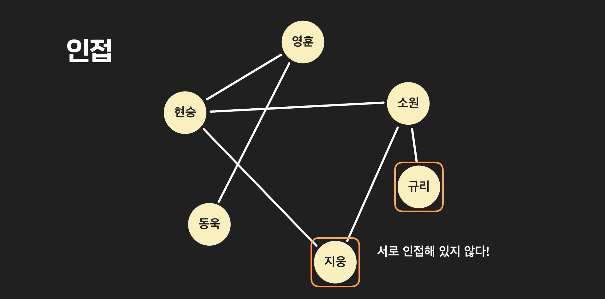
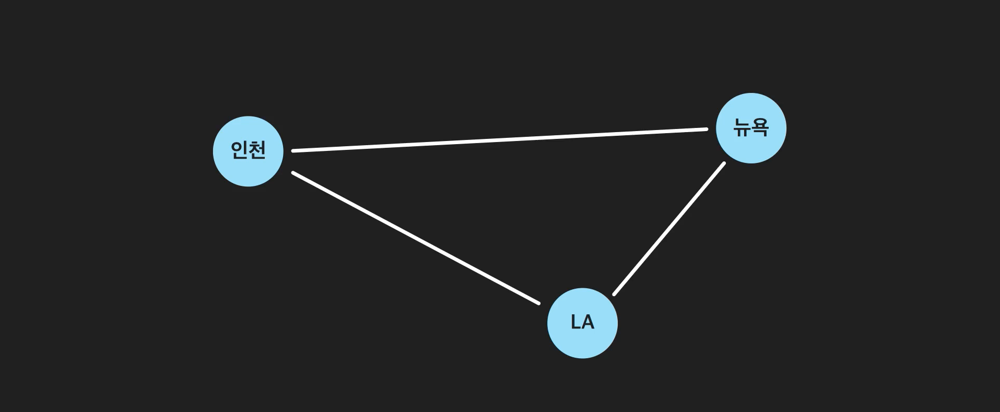

# Graph

- #### 연결관계 데이터와 그래프

  연결관계가 있다는 것은 무엇이고 왜 중요할까?

  

  우리가 자료구조를 공부하는 이유 중 하나는 상황에 맞게 데이터를 저장하고 사용하기 위해서. 데이터 사이의 관계에 따라 적절한 자료구조를 고르고 사용해야 하는 것. 예를 들어 선형적 자료구조를 저장하고 싶으면 배열이나 링크드 리스트, 계층적 자료구조를 저장하고 싶으면 트리를 쓰고 해야 함. 

  그러면 그래프는 어떤 상황에 쓰일까? **연결관계**를 저장하기 위해 사용된다. 

  예를 들어 위치데이터. 

  

  사회 연결망 데이터. 

  

  예를 들어 인터넷은 수 많은 컴퓨터들 간의 연결관계 등 연결관계를 나타내야 하는 데이터는 우리 삶 속에 무궁무진하게 많다. 

  


- #### 그래프 기본

  친구관계 데이터를 통해 그래프의 기본개념들에 대해 먼저 알아보자. 

  링크드리스트의 노드의 경우, 데이터와 next/prev 데이터를 저장해서 선형적인 데이터를 만들었다. 

  

  그래프도 노드라는 단위를 사용한다. 

  친구관계를 나타내니깐 여기서는 하나의 노드가 하나의 사람. 

  

  **이제 이 노드들 사이에 친구라는 관계를 만들어 주고 싶다.**

  이 노드 사이에 친구관계를 만들어 주고 싶음. 그래프에서는 이렇게 노드들 사이의 관계를 "**엣지**"라고 한다. 아래처럼 연결하면 서로 사이에 친구관계가 있다는 것을 의미함. 그리고 이 엣지들을 (현승, 영훈)엣지 혹은 (영훈, 현승)엣지 이렇게 부른다. 

  

  나머지 엣지들도 추가해 보자. 

  

  이제 그래프에서 자주 사용하는 용어를 몇개 살펴보자. 

  두 노드가 서로 엣지로 연결되있을때, "**서로 인접해있다.**" 라고 표현한다. 

  

  지웅과 규리 사이에는 서로 엣지가 없기 때문에, **"서로 인접해있지 않다."** 라고 표현한다. 

  

  **지웅과 규리**는 서로 친구가 아님. 하지만, 둘다 소원과 친구임. 

  이때 지웅과 규리를 잇는 이 길을 경로라고 한다. **지웅-소원-규리 경로**. 

  지웅과 규리는 연결되어 있지는 않지만, 서로 소원을 통해 연결되있음. 

  이럴 때는, 지웅과 규리는 **"지웅-소원-규리"경로를 통해 연결됬다.** 라고 이야기 한다. 

  

  이때 이 지웅과 규리 경로의 거리는 **2이다.**

  

  그런데 지웅과 규리 사이에는 지웅-소원-규리 경로도 있지만, **지웅-현승-소원-규리** 경로도 있다. 이거 말고도 두 노드 사이에는 엄청 많은 경로가 존재할 수 있다. 

  두 노드 사이의 경로들 중 특별한 경로들이 몇가지가 있다. 

  

  일단 두 노드들 사이의 가장 거리가 작은 경로를 **최단경로**라고 한다. 

  위 같은 경우는 지웅-소원-규리 경로보다 짧은 경로(거리2)는 없다. 이게 **최단 경로**이다. 

  특정 노드에서 다시 그 노드로 돌아오는 경로를 **사이클**이라고 한다. **지웅-현승-소원-지웅** 경로. 이렇게 지웅으로 시작해서 다시 돌아오는 경로를 사이클이라고 한다. 

  

  그리고 **차수**의 개념. 한 노드가 가지고 있는 엣지의 수를 **차수**라고 한다. 지금 같은 경우는 차수가 각 노드의 친구 수를 나타낸다. 

  

  

- #### 방향 그래프

  친구관계라는 것은 쌍방향임. 현승과 영훈이 친구면 영훈과 현승도 친구. 이렇게 엣지가 쌍방향이면 오히려 방향이 없다고 이야기 할 수도 있음. 그래서 이런 그래프를 **무방향그래프(Undirected Graph)**라고 부른다. 

  

  방향이 존재하는 관계도 있다. 예를 들면 인스타그램의 팔로우 같은 관계. 

  

  이제 이런 관계를 그래프로 표현하면 다음과 같지. 이런 엣지를 **현승을 떠나서 지웅으로 들어가는 엣지**라고 부른다. 

  

  이렇게 방향 있는 노드 적을때는, 쓸 때도, **(현승, 지웅)** 이렇게 떠나는 노드를 앞에 쓰고 들어가는 노드를 뒤에 쓰는 것. 

  

  **그런데 방향성이 있다고 해서 쌍방향이 불가능한것은 아니다.**

  서로를 향해 쏘는 엣지를 두개 다 만들어 주면 되지. 

  

   엣지에 방향이 생기면 무방향 그래프와 달라지는 부분이 생긴다. 

  첫번째는 **경로**

  당연히 경로에도 방향이 있다. 

  

  그리도 노드의 **차수**

  방향그래프에서는 각 노드가 차수가 두가지씩 있다. **입력차수**와 **출력차수**를 같이 고민한다. 

  


- #### 가중치 그래프

  항공경로 데이터를 그래프로 나타내는 예시를 봐보자. 

  각각은 공항을 의미하고, 서로 오가는 비행기가 있으면 서로 연결되어 있다. 

  

  연결되있긴 한데, 서로 가는 시간이 다름. 이것을 다 똑같은 엣지로 나타내는것은 살짝 불공평하잖아. 이럴 떄는, 엣지에 특정 숫자값을 지정해 줄 수 있는 가중치 그래프라는 것을 사용한다. 

  

  가중치 그래프를 통해서 공항들의 연결관계를 조금 더 정확하게 나타낼 수 있다. 공항데이터 이외에도 사용하는 경우는 무궁무진하다. 

  **가중치 그래프를 사용하면 경로의 거리 개념이 조금 바뀐다.** 

  무가중치그래프에서 거리는 단순히 엣지의 수였음. 가중치그래프에서 거리는 경로에 있는 모든 그래프의 가중치의 합. 

  


- #### 그래프 용어/성질 정리

  **그래프 기본 용어**

  

  - **노드**: 그래프에서 하나의 데이터 단위를 나타내는 객체. SNS 그래프에서는 하나의 유저가 하나의 노드입니다. 위 그래프에서는 노란색 원이 노드를 나타냅니다.
  - **엣지**: 그래프에서 두 노드의 직접적인 연결 관계 데이터. 예를 들어, 페이스북 유저 그래프에서는 두 유저의 친구 관계에 해당하는 데이터입니다. 위 이미지에서는 흰 선들이 그래프의 엣지에 해당하죠. 두 노드 사이에 엣지가 있을 때, “*두 노드는 인접해 있다*” 라고 표현합니다. 엣지가 갖는 특성에 따라 그래프의 종류가 나뉘기도 하는데요.
    - *방향 그래프 (directed graph)*: 방향 그래프에서는 엣지들이 방향을 갖습니다. 인스타그램의 팔로우 관계처럼 한 유저가 다른 유저를 팔로우하는 일방적인 관계를 나타낼 수 있게 해줍니다.
    - *가중치 그래프 (weighted graph)*: 가중치 그래프에서는 엣지들이 연결 관계뿐만 아니라 어떤 정보를 나타내는 수치를 가집니다. 그 정보는 예를 들자면 친구 관계에서는 친밀도, 위치 정보 그래프면 두 장소 사이의 거리같은 것입니다.
  - **차수**: 하나의 노드에 연결된 엣지들의 수입니다.
    - 무방향 그래프에서는 하나의 노드에 연결된 엣지들의 수를 나타내고, 방향 그래프에서는 노드를 떠나는 엣지의 수를 출력 차수, 노드에 들어오는 엣지의 수를 입력 차수로 구별해서 부릅니다.
    - 위 그래프에서 현승 노드의 차수는 3, 영훈 노드의 차수는 2입니다.
  - **경로**: 한 노드에서 다른 노드까지 가는 길. 지웅 노드와 규리 노드는 서로 인접해 있지 않은데요. 그래도 지웅 노드에서 규리 노드로 갈 수 없는 건 아닙니다. 지금 지웅과 규리는 둘 다 소원 노드와 친구인데요. 그래서 “지웅 - 소원 - 규리” 이 길을 따라가면 지웅 노드에서 규리 노드로 갈 수 있습니다. “지웅 - 소원 - 규리” 이런 길을 경로라고 합니다.
    - 경로의 거리
      - *비가중치 그래프*: 한 경로에 있는 엣지의 수.
      - *가중치 그래프*: 한 경로에 있는 엣지의 가중치의 합.
    - 최단 경로: 두 노드 사이의 경로 중 거리가 가장 짧은 경로.
    - 사이클: 한 노드에서 시작해서 같은 노드로 돌아오는 경로.

  **연결된 그래프**

  그래프는 여러 개의 노드와 엣지들을 갖는데요. 그렇다고 해서 그래프 안에 있는 모든 노드들이 서로 경로를 통해 연결될 필요는 없습니다.

  SNS 유저 그래프를 만든다고 생각해볼게요. 세상의 모든 유저들이 서로 어떻게든 꼭 연결되어 있는 것은 아니죠?

  그래서 아래 그림처럼 서로 연결된 노드들이, 서로 나눠져 있을 수도 있습니다. 보기에는 2개의 무리로 나눠져 있지만 어쨌든 하나의 SNS 유저 그래프라고 할 수 있습니다.

  

  조금 더 극단적인 예시를 보면 심지어 이렇게 아예 엣지가 없고 노드만 있는 그래프도 있을 수 있는 거죠.

  


- #### 그래프 노드 구현

  노드를 먼저 구현해 보자. 다른 것 했던 것처럼, 클래스로 만들어 주면 끝이다. 

  

  

  그래프에서는 대부분 모든 노드가 다 동일함. head node 같은 것을 따로 찾을 수가 없음. 

  그러면 얘네들을 한번에 접근할 수 있도록 만들어 주면 되지. 

  1. **배열에 넣으면 됨.** 

     고유 인덱스만 알고 있으면 바로바로 빼서 쓸 수 있겠지. 

     

  2. **해시테이블에 저장.**

     파이썬 딕셔너리(해시테이블로 되어 있음)에 저장하면 되지(다만 지하철역이 같은 역이 있으면 안되지. 예를 들어 SNS유저 저장하는데, 이름 똑같으면 어떻게 해. 이메일 주소 등을 써야 겠지). 

     

     


- #### 엣지 구현	

  보이는 노드들을 인스턴스로 만들어서 리스트에 저장했다고 해보자. 인덱스는 다음과 같다. 

  

  인접행렬을 통해 구현하자. 인접이라는 말은 두 노드가 연결되었다는 말이고, 행렬은 2차원 배열을 의미한다. 

  

  인접행렬은 노드들 간의 연결관계를 나타내는 2차원 행렬을 의미한다. 

  

  인접해있으면 1, 인접 안했으면 0. 간단하지. 

  

  만약 가중치가 있다면? 가중치를 입력해주면 되지.

  

  그럼 방향 그래프를 사용할 때는 어떻게 해야 할까? 이것도 행이 쏘는 쪽, 열이 받는 쪽으로 해서 써 주면 되지. 

  

  **그렇다면 가지고 오는 방법은 무엇일까?**

  그냥 행렬에서 뽑아오면 되지. 

  

  그럼 만약 한 노드가 연결된 모든 노드를 가지고 오고 싶다면?

   그 행이나 그 열 통으로 가져오면 되지. 

  

  


- #### 엣지 구현 2 : 인접 리스트

  엣지를 구현하는 또 다른 방법은 인접리스트. 

  딕셔너리에 노드들을 저장했다면, 아래와 같이 이름을 호출해서 가지고 올 수 있음. 

  

  인접리스트는 뭘까?

  **인접** : 두 노드가 연결되어 있는 경우

  **리스트** : 순서정보를 저장할 수 있는 자료형. 

  

  인접리스트 사용하기 위해서는 각 노드에, 빈 파이썬 리스트 instance 변수를 만든다. 

  여기에 역 노드들을 저장해 주면 되는 것. 그래프 노드가 연결된 노드들에 대한 리스트를 저장하는 것. 

  

  무방향 그래프의 경우에는, A와 B가 연결되어 있으면 A의 인접리스트에 B를 넣고, B의 인접리스트에 A를 넣는다. 

  

  하지만, 방향에서는 A를 떠나 B로 들어가는 엣지가 있으면, A의 인접리스트에는 B를 넣고 B의 인접리스트는 내비둔다. 

  

  가중치 그래프라면? 가중치도 같이 튜플로 묶어서 넣어 주면 된다. 

  

  *인접리스트를 잘 구현하면, 아래와 같은 모양이 된다.*

  

   


- #### 인접 행렬 vs 인접 리스트

  이번 챕터에서는 그래프의 엣지를 저장하는 두 가지 방법, 인접 행렬과 인접 리스트를 봤는데요. 마지막으로는 이 두 방법을 사용했을 때 공간과 시간을 얼마나 효율적으로 사용할 수 있는지를 알아볼게요.

  **복잡도 표현 기호**

  그 전에 먼저 여러분이 하셔야할 게 있습니다. 보통 다른 자료 구조들을 공부할 때는 들어있는 데이터 수를 n이라고 했잖아요. 예를 들어 배열에 들어있는 데이터의 수, 트리의 노드의 수 이런 걸 이용해서 각 자료 구조의 효율성을 나타낼 때 n을 사용했는데요. 그래프를 분석할 때는 다른 알파벳들을 씁니다.

  

  첫 번째는 V입니다. V는 그래프 안에 있는 **모든 노드들의 집합**입니다. 그래프에 있는 하나의 데이터 객체를 노드라고도 부르지만 Vertex라는 표현을 사용하기도 하는데요. Vertex의 가장 앞 알파벳을 따서 V라고 하는 거죠. 위 그래프에서 영훈, 현승, 동욱, 지웅, 규리, 소원 노드들을 합쳐서 V라고 하는 거죠.

  두 번째는 E입니다. E는 그래프 안에 있는 모든 엣지들의 집합입니다. 엣지를 영어로 쓰면 Edge입니다. Edge의 가장 앞 알파벳을 따서 E를 사용합니다.

  원래 V와 E는 노드와 엣지의 수를 나타내는 건 아닌데요. 점근 표기법에서 사용할 때 V는 모든 노드의 수, 그리고 E를 모든 엣지의 수로 사용하기도 합니다. 저희도 그냥 각각 노드와 엣지의 수로 두 알파벳을 사용할게요.

  그러니까 위에서는 V는 6, E도 6인 거죠.

  여기서 재밌는 사실이 하나가 있는데요. 바로 V와 E의 관계입니다. 노드 수가 V일 때 그래프 안에는 최대 몇 개의 엣지가 있을 수 있을까요? 모든 노드가 서로 다른 모든 노드에 연결되어 있는 경우가 엣지가 가장 많을 때인데요. 이때 무방향 그래프는  *(V 제곱)/ 2*, 방향 그래프는 V 제곱 개의 엣지를 갖습니다. 두 경우 모두 V 제곱에 비례하는 만큼의 엣지를 가질 수 있는 거잖아요? 그렇기 때문에 E는 최악의 경우 V 제곱에 비례합니다.

  그래프를 배울 때는 O(n), O*(lg(*n*)) 이런 점근 표기법 대신 O*(*V*), O*(*E), *O*(lg(*V*)) 이렇게 표시를 하기 때문에 좀 낫설게 느껴지실 수도 있는데요. 그냥 n 대신 다른 알파벳을 쓰는 것일 뿐, 더 어려운 내용은 없으니까 걱정하지 마세요!

  **노드를 저장하는 공간**

  일단 인접 행렬을 사용하던 인접 리스트를 사용하던 노드들을 저장해야 되는데요. 노드의 개수를 V로 나타낸다고 했죠? 총 V개의 노드를 저장하기 때문에 노드를 저장하는 데는 O(V)의 공간을 사용한다고 할 수 있습니다.

  **인접 행렬이 차지하는 공간**

  인접 행렬이 차지하는 공간에 대해서 생각해봅시다. 인접 행렬을 정의할 때 어떻게 했는지 기억나시나요? “총 노드의 수 x 총 노드의 수” 만큼의 행렬을 만들었잖아요? 그러니까 총 노드가 5개일 때 5 x 5 크기의 행렬을 만들었습니다. 그리고 여기에 노드들 간의 인접 데이터를 저장했죠. 두 노드가 인접했을 때 1, 아닐 때 0, 기억 나시죠?

  

  이걸 가지고 인접 행렬이 사용하는 공간에 대해서 한 번 생각해봅시다. 그래프 안에 있는 노드의 수가 V라고 할 때 인접 행렬은 V * V크기의 행렬을 저장하고 각 요소들이 0 또는 1을 저장했는데요. 그럼 총 V^2 개의 정수를 저장한 거죠? 그렇기 때문에 인접 행렬은 총 V^2에 비례하는 공간, O(V^2)의 공간을 사용합니다.

  **인접 리스트가 차지하는 공간**

  인접 리스트는 얼만큼의 공간을 사용할까요? 인접 리스트는 각 노드가 자신과 인접한 노드들을 가리키는 레퍼런스를 저장하고 있습니다.

  일단 모든 노드는 하나의 인접 리스트를 갖습니다. 그러니까 총 V개의 배열 또는 파이썬 리스트를 저장해야되는 거죠. V에 비례하기 때문에 일단 최소 O(V) 만큼의 공간을 차지하는 거죠.

  

  그럼 엣지를 저장하는데는 얼만큼의 공간을 사용할까요? 모든 노드에 저장된 엣지 데이터를 다 합치면 무방향 그래프일 때 2E, 방향 그래프일 때는 E입니다 (무방향 그래프는 똑같은 엣지를 2개씩 저장하기 때문이죠). 총 저장하는 레퍼런스 수는 E에 비례한다고 할 수 있죠. O(E)입니다.

  이걸 합쳐보면 인접 리스트 자체를 저장하는데 O(V), 엣지를 저장하는데 O(E)을 사용하기 때문에 총  O(V + E)을 사용합니다. V와 E, 둘 중 어떤 게 더 큰지는 알 수 없기 때문에 두 알파벳 중 하나를 골라서 그거만으로 점근 표기법을 쓸 수는 없고요, 그냥 O(V + E)만큼의 공간을 사용한다고 표현합니다.

  그럼에도 불구하고 E는 최악의 경우 (모든 노드가 서로 다른 모든 노드에 연결됐을 경우) V 제곱에 비례한다고 했잖아요? 그렇기 때문에 O(V + E)라고 볼 수도 있지만 E = O(V^2)라는 최악의 경우를 생각하면 인접 리스트도 O(V^2)의 공간을 차지한다고 할 수 있습니다.

  하지만 좀 더 공간 복잡도를 현실적으로 표기하기 위해서 주로 O(V + E)라고 하죠.

  **두 노드가 연결됐는지 확인하는 데 걸리는 시간**

  인접 행렬을 이용하면 두 노드가 인접했는지 아닌지를 O(1)으로 알아낼 수 있습니다. 예를 들어 3에 해당하는 노드와 5에 해당하는 노드가 서로 인접해 있는지 알고 싶다고 할게요. 그럼 `adjacency_matrix[3][5]`  이런 식으로 인덱스를 사용하면 바로 알아낼 수 있죠.

  인접 리스트는 어떨까요?

  ```python
  gangnam_station = stations["강남"]
  seocho_station = stations["서초"]
      
  print(seocho_station in gangnam_station.adjacent_stations)
  ```

  이런 식으로 한 노드의 리스트 안에 특정 역이 저장됐는지를 탐색해야 되는데요. 선형 탐색을 해야되기 때문에 리스트 안에 있는 데이터를 다 돌아아 합니다. 몇 개의 데이터가 있는지에 따라 다르겠지만 최악의 경우 V개의 요소를 확인해야하는 거죠.

  **한 노드에 연결된 모든 노드들을 알아내는데 걸리는 시간**

  저희 토픽에서는 그래프를 사용할 때 주로 한 노드에 연결된 모든 노드를 갖고 오는 작업을 많이 할 건데요. 그럼 이 작업을 많이 할 때는 어떤 방법을 사용하는 게 좋을까요?

  인접 행렬을 사용할 때 이 작업을 할 때는 시간이 얼만큼 걸리는지 생각해봅시다. 인접 행렬에서는 한 노드를 나타내는 배열, 또는 파이썬 리스트 전체를 다 돌아야지만 그 노드가 연결된 다른 노드들을 갖고 올 수 있습니다. 그러니까 리스트 안에 있는 데이터를 하나씩 돌면서 0인지 1인지를 확인해야 되는 거죠. 모든 리스트 안에는 총 V개의 데이터 요소가 들어 있으니까 매번 V번 돌아야 되는 거죠.

  인접 리스트를 쓸 때는 각 노드가 자신과 인접한 노드들에 대한 레퍼런스만 갖고 있습니다. 물론 최악의 경우 한 노드가 다른 모든 노드들과 연결돼 있으면, 인접 행렬과 마찬가지로 총 V번 돌아서 인접한 노드들을 가지고 와야되긴 한데요. 이런 경우는 그렇게 많지 않습니다. **대부분의 경우 인접 행렬을 사용하는 거보다 더 빨리 실행되죠.**

  결국에 저희가 사용할 용도로는 인접 리스트를 사용하는 게 인접 행렬을 사용하는 것보다 좀 더 효율적이라는 말인데요. 그렇기 때문에 저희는 항상 **인접 리스트를 사용해서 그래프를 구현하겠습니다.**


- #### 그래프 탐색이란?

  보통 자료구조에서 탐색은 주어진 조건을 만족하는 데이터를 찾아내는 것이였음. 그러나, 그래프에서는 조금 다름. 그래프에서는 하나의 시작점 노드에서 연결된 노드들을 모두 찾는 것을 의미한다. 

  

  시작점 노드는 우리가 정하기 나름이고, 이 시작점으로부터 다른 노드들을 찾아가는 것. 

  예를 들어 아래같은 무방향 노드들이 있다고 해보자. B에서 탐색을 시작한다. 그리고, B와 엣지로 연결된 모든 노드들을 찾는 것. 더 이상 찾을 수 있는 노드가 없을때까지 진행된다. 즉 아래 그림에서는 A부터 G까지 싹다 돌아야 끝나겠지. 

  

  그래프를 탐색하면 그래프의 구조에 대해서 의미있는 정보들을 알아낼 수 있다. 

  일단 노드들이 경로를 통해 연결이 됬는지 안됬는지를 알아낼 수 있다. 

  

  그리고 두 사람 사이 최소 몇다리를 건너서 친구인지, 최단거리를 알아낼 수 있다는 것. 

  

  그래프 탐색 알고리즘은 각 노드들을 어떤 순서로 탐색하는지에 따라 크게 두 종류로 나눠진다. 

  

  

- **BFS(Breadth First Search) 개념** 

  Breadth는 너비를 의미한다. 즉, BFS는 너비를 우선적으로 놓고 탐색하겠다는 말. 근데 너비를 우선적으로 탐색하겠다는 말이 무엇일까?

  

  노드  A에서 탐색 시작(탐색 마치면 회색으로 표시). A에서 인접한 노드 탐색. 

  

  이처럼 시작점에서 가까운 노드들부터 펼쳐 나가는 방법. 그래프를 봤을 때, 수직적으로가 아니라 수평적으로 깊이보다는 너비를 우선적으로 탐색한다. 

  

  

- #### 큐

  BFS 알고리즘에 대해서 본격적으로 시작하기 전에 미리 알아야 할 추상 자료형이 있는데요. 이미 기본 자료형 토픽에서 배운 내용이긴 하지만 한 번 더 짚고 넘어갈게요.

  # 큐

  복습할 추상 자료형은 바로 큐입니다. 기본 자료형 토픽에서 조금 더 구체적인 설명이 있긴 하니까 여기서는 좀 더 간략하게 알아볼게요.

  큐는

  - 맨 뒤에 데이터 삽입
  - 맨 앞 데이터 삭제
  - 맨 앞 데이터 접근

  이런 기능들을 약속하는 추상 자료형입니다. 데이터를 가장 뒤에 추가하고, 가장 앞에서 삭제할 수 있는 추상 자료형이죠. 이런 식으로 데이터를 앞에서만 삭제하고 맨 뒤에만 삽입하는 걸 FIFO(First-in-first-out)이라고도 합니다. 그러니까 First-in: 가장 먼저 들어온 데이터가, first-out: 가장 먼저 삭제된다는 말입니다.

  **파이썬에서 큐 사용하기**

  파이썬에서는 자료형 `deque`으로 큐를 쓰는데요. `deque` 코드로 큐의 기능들을 복습해 볼게요.

  ```python
  from collections import deque
  
  queue = deque()
  ```

  변수 `queue`에 빈 `deque`를 만들어줬습니다.

  ```python
  # 큐 맨 끝에 뒤에 데이터 추가
  queue.append("태호")
  queue.append("영훈")
  queue.append("현승")
  queue.append("지웅")
  
  # 큐 데이터를 출력한다
  print(queue)  # 태호, 영훈, 현승, 지웅
  ```

  그리고 이렇게 문자열 “태호”, “영훈”, “현승”, “지웅”을 저장했다고 할게요. `print` 함수를 써서 `queue`를 출력하면 데이터가 저장한 순서대로 있는 걸 확인할 수 있습니다.

  ```python
  # 큐 마지막 데이터를 삭제한다
  # 보통 큐에서도 마지막 데이터를 삭제하면 해당 메소드가 삭제한 데이터를 리턴한다
  print(queue.popleft())  # 태호
  print(queue.popleft())  # 영훈
  print(queue.popleft())  # 현승
  
  # 큐 데이터를 출력한다
  print(queue)  # 지웅
  ```

  데이터를 삭제할 때는 `popleft` 메소드를 사용하면 가장 앞에 있는 데이터를 삭제할 수 있습니다. 보통 큐는 삭제하는 데이터를 리턴하기 때문에 가장 앞 데이터를 “추출한다” 아니면 “꺼내온다”라고도 할 수 있죠.

  큐는 BFS 알고리즘에서 굉장히 중요한 역할을 합니다. 혹시 BFS를 보다가 큐에 대해서 모르시겠는 부분이 있으면 꼭 복습하고 다시 보세요.


- #### BFS 알고리즘

  일단 아래와 같은 그래프와 빈 큐가 있다고 가정한다. 

  

  일단 시작점 하나를 받는다. 지금은 A. 

  일단 A를 방문했다고 표시한 후, 큐에 넣는다. 그리고 큐에 들어있는 노드가 없을 때까지 반복문을 돈다. 반복문에서는

  1. 일단 큐의 가장 앞 노드를 꺼낸다. 

  2. 그리고 A에 인접한 모든 노드를 돈다(이때 이미 방문한 노드들은 건너 뛴다)

  3. 이제 인접한 노드가 B지. B를 방문한 노드라고 표시하고 큐에 넣는다. 그리고, C도 방문한 노드라고 표시하고 큐에 넣는다. 

     

  4. 이제 A와 인접한 모든 노드를 처리했다. 그러면, 다시 큐의 맨 앞을 꺼낸다. 이제 다시 B와 인접한 노드들을 돈다. 

     

     그럼 A, D와 인접해있지. A는 이미 방문한 노드니깐 건너 뛴다. 그 다음 D를 본다. D를 방문한 노드라고 표시하고 큐에 넣어 준다. 

     

  5. 그럼 이제 큐에 가장 앞에 있는거 C니깐 다시 뽑는다. 인접한 애들 돈다. A는 이미 방문했고, E를 방문표시하고 큐에 넣고,  F도 방문표시하고 큐에 넣는다. 

     

  이와 같은 과정을 계속 반복하는게 트리의 **BSF** 탐색이다. 

  큐에 아무것도 없을때까지 실행하면, A에서 연결된 모든 노드를 방문한 것이 된다. 

  

  노드들 방문되는 순서 다시 생각해보면,  A, B, C, D, E, F, G, H 이렇게 너비 우선적으로 탐색된다. 

  일반화 해보면 다음과 같다. 

  

  

- 