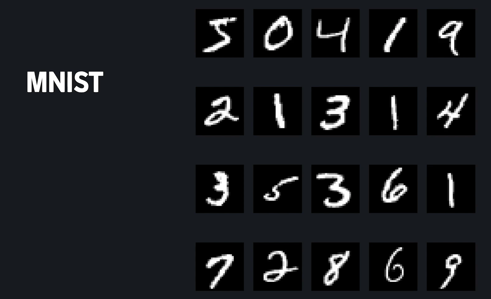
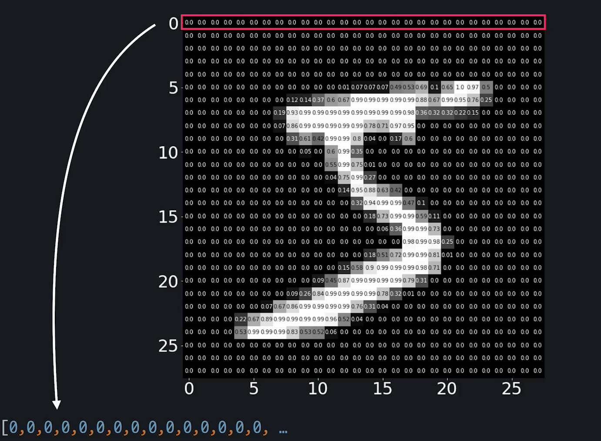
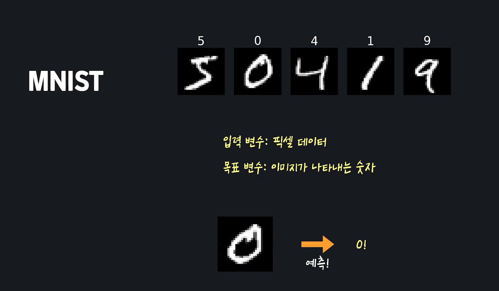

# Deep Learning

- #### 들어가기 전에

  머신 러닝보다 조금 더 폭넓은 분야인 인공 지능은 기계, 또는 프로그램을 인간처럼 행동하거나 생각하게 만드는 학문입니다.

  하지만 기계를 인간처럼 행동하게 하는 건 쉽지 않았는데요. 이 난제를 풀기 위해서 수많은 연구원들은 다양한 시도를 했습니다. 결국엔 사람의 뇌와 신경계가 어떻게 작동하는지 알아내서, 이걸 컴퓨터에 적용하면 컴퓨터가 인간처럼 행동할 수 있을 거라고 생각하게 됐는데요. 이렇게 만들어진 알고리즘이 바로 이번 토픽의 주제, 인공 신경망, 영어로는 **Artificial Neural Network**입니다.

  미디어에서 흔히 이야기하는 **딥 러닝**이 바로 인경 신경망을 기반으로 만든 알고리즘들을 모아서 부르는 용어입니다. 딥 러닝 알고리즘들은 많은 분야에서 기존에 사용했던 다른 알고리즘들보다 훨씬 더 좋은 성능을 냅니다. 이미지를 보고 인식을 하는 컴퓨터 비젼, 인간의 언어를 다루는 자연어 처리, 자동차가 스스로 운전을 하게 하는 자율 주행 등 수많은 분야에서 비약적 발전을 이끌어냈죠.

  인공 신경망이 무엇이고, 다양한 분야에서 왜 여러 알고리즘들보다 더 성능이 더 좋게 나오는지 등, 지금 당장 너무 많은 걸 전달해 드리려고 하는 건 큰 의미가 없을 거 같은데요. 여기까지만 하고 바로 이번 토픽 구성에 대해서 말씀드릴게요.

  이번 토픽에서는 인공 신경망 **이론**에 대해서 집중적으로 공부합니다. 인공 신경망을 파이썬 라이브러리들을 사용해서 간단하게 구현/사용하는 내용은 **다른 토픽**에서 자세하게 다룰 테니까요. 여기서는 최대한 이론을 이해하는 데 초점을 맞추시고 공부하시길 바랍니다.

  지금 보고 계신 첫 번째 챕터에서는 개념적으로, 그리고 시각적으로 인공 신경망이 뭔지 설명드리고, 인공 신경망에 대한 배경지식들을 배워볼 거고요.

  두 번째 챕터에서는, 개념 위주로만 설명드린 인공 신경망을 수학적으로, 그리고 프로그래밍적으로 어떻게 표현할 수 있는지를 배워보겠습니다.

  세 번째 챕터에서는 인공 신경망을 학습시키는 방법을 보겠습니다.

  마지막 네 번째 챕터에서는 기본 개념들을 넘어서 인공 신경망을 더 깊게 이해하는 시간을 가져보겠습니다.

  본격적으로 시작하기 전에 두 가지 당부의 말씀을 드릴게요.

  1. 우선 인공 신경망 토픽은 여러분이 코드잇의 머신 러닝 코스를 이미 학습하셨다는 가정하에 진행됩니다. 혹시 행렬 연산, 로지스틱 회귀, 경사 하강법, 정규화 이런 용어들을 모르시거나 기억이 안 나시는 분들은 꼭 코드잇 머신 러닝 코스를 수강하시거나 복습하고 오시길 바랍니다.
  2. 또, 인공 신경망은 다른 머신 러닝 알고리즘들에 비해서 수학적으로 이해하기 어려운 개념들이 더 많이 있습니다. 최대한 쉽게 설명하려고 할 건데요. 한 번에 이해가 안 되는 게 오히려 당연합니다. 이해가 안 되는 부분이 있으면 그냥 넘어가거나 포기하지 마시고, 영상을 멈추고 생각을 해보시거나, 질문을 남겨서 해당 부분들을 꼭 이해하고 넘어가시길 바랍니다.

- #### MNIST 데이터셋

  손글씨로 쓴 숫자들을 모아놓은 흑백 이미지 데이터. 

  

  각 MNIST이미지는 28x28픽셀의 이미지. 

  

  MNIST는 흑백 이미지 데이터. 그렇기 때문에 하나의 픽셀은 흰색, 검은색, 회색의 어딘가 중에 한 색을 나타냄. 밝음의 정도를 0과 1사이의 숫자로 나타내기로 함. 픽셀이 아예 검정색이면 0, 흰색이면 1로 표현하겠다는 말. 이렇게 나타내는 것을 **회색척도** 라고 부르기도 함. 

  > 영상에서는 픽셀의 색은 밝기 정도를 나타내는(회색 척도) 0~1 사이의 소수로 저장돼있다고 소개해드렸는데요.
  >
  > 사실 MNIST의 각 픽셀 데이터가 원래 회색 척도를 나타내는 건 맞지만 0~1 사이의 소수가 아니라 **0~255의 자연수**로 표현됩니다.
  >
  > 아예 흰 색인 데이터는 255, 아예 검은색인 데이터는 0, 이렇게요.
  >
  > 하지만 **픽셀 데이터는 많은 경우 코드잇 머신 러닝 코스에서 배운 min-max normalization이라는 전처리를 적용해서 사용합니다.** 그냥 0~255 사이의 자연수로 이뤄져 있는 각 픽셀 데이터를 모두 최댓값에서 최솟값을 뺀 값으로 (255 - 0 = 255) 나눠준다고 생각하시면 됩니다. 예를 들어 픽셀 값 100인 데이터는 100/255 = 0.39가 되는 거죠. 그럼 모든 데이터가 0~1 사이 소수로 바뀝니다. 이렇게 min-max normalization을 적용하는 이유는 신경망 모델의 학습 속도와 정확도를 향상시킬 수 있기 때문입니다.
  >
  > 데이터를 미리 처리해서 사용하는 경우가 많다 보니까 저희는 처음부터 그냥 0~1 사이의 데이터로 이뤄져 있다고 소개해드렸는데요. 처음부터 0~1 사이의 소수로 저장돼있던 거로 생각하셔도 전혀 문제가 없습니다.

  

  이런 픽셀정보는 파이썬 리스트처럼 한줄로 표현함. 가장 윗줄부터 차례대로 리스트 처럼 표현함. 이런식으로 784개의 픽셀이 순서대로 저장되어 있는 것. 즉 우리의 눈에는 그냥 5의 손글씨로 보이는 이 이미지가 컴퓨터에는 784개의 픽셀로 이루어진 리스트로 나타나는 것. 

  

  그리고, 각 숫자마다 어떤 숫자를 나타내는지 정답도 적혀 있음. 이미지 픽셀이 **입력변수**, 이미지가 나타내는 숫자가 **목표변수**로 사용됨. 그래서 프로그램이 처음보는 픽셀을 보고 어떤 숫자인지 예측할 수 있게 하는것이 목적. 

  

  참고: http://yann.lecun.com/exdb/mnist/index.html

- #### MNIST데이터와 로지스틱 회귀 

  