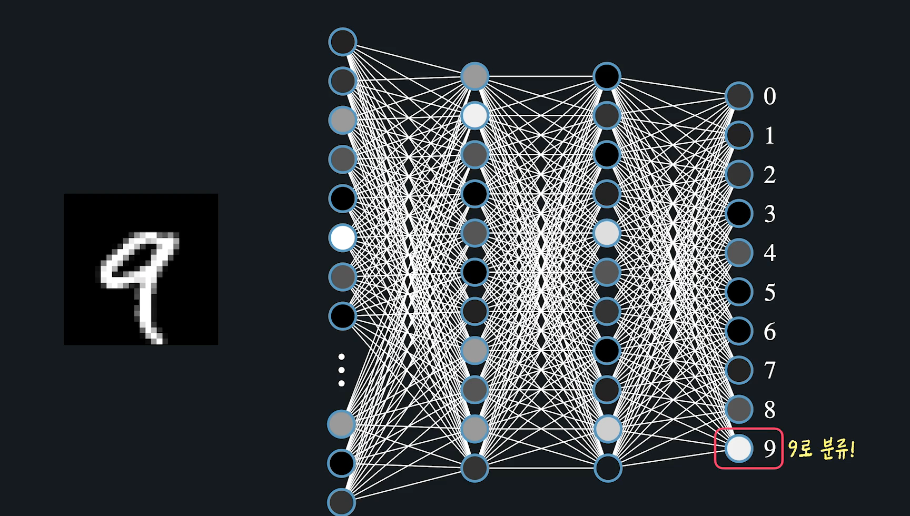
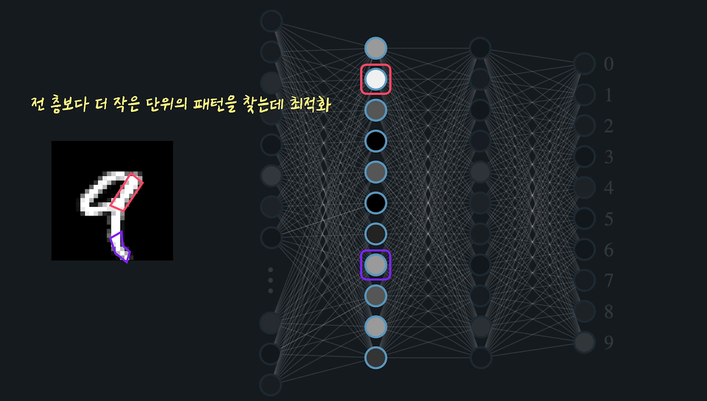
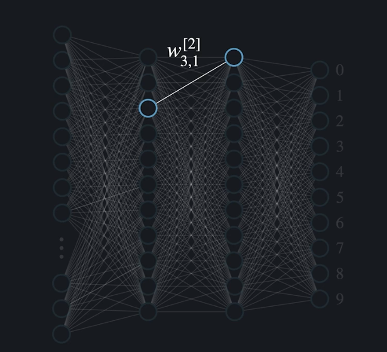
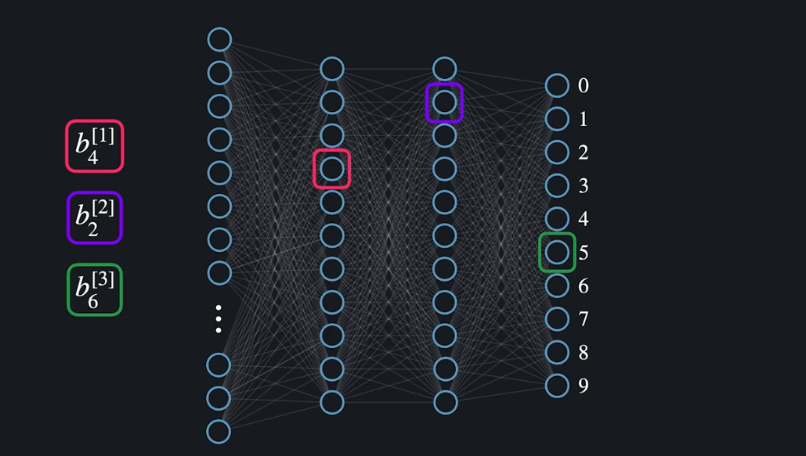
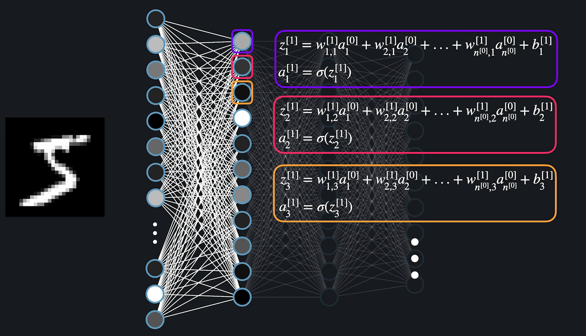
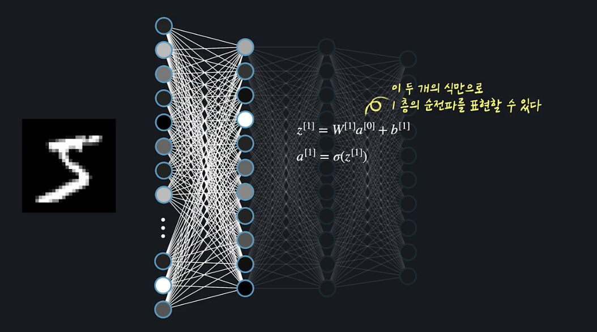
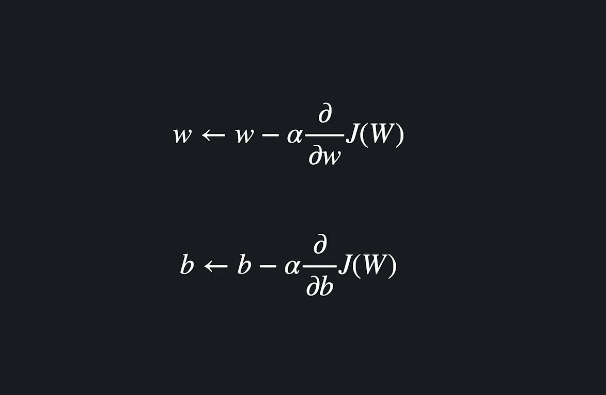

# Deep Learning

- #### 들어가기 전에

  머신 러닝보다 조금 더 폭넓은 분야인 인공 지능은 기계, 또는 프로그램을 인간처럼 행동하거나 생각하게 만드는 학문입니다.

  하지만 기계를 인간처럼 행동하게 하는 건 쉽지 않았는데요. 이 난제를 풀기 위해서 수많은 연구원들은 다양한 시도를 했습니다. 결국엔 사람의 뇌와 신경계가 어떻게 작동하는지 알아내서, 이걸 컴퓨터에 적용하면 컴퓨터가 인간처럼 행동할 수 있을 거라고 생각하게 됐는데요. 이렇게 만들어진 알고리즘이 바로 이번 토픽의 주제, 인공 신경망, 영어로는 **Artificial Neural Network**입니다.

  미디어에서 흔히 이야기하는 **딥 러닝**이 바로 인경 신경망을 기반으로 만든 알고리즘들을 모아서 부르는 용어입니다. 딥 러닝 알고리즘들은 많은 분야에서 기존에 사용했던 다른 알고리즘들보다 훨씬 더 좋은 성능을 냅니다. 이미지를 보고 인식을 하는 컴퓨터 비젼, 인간의 언어를 다루는 자연어 처리, 자동차가 스스로 운전을 하게 하는 자율 주행 등 수많은 분야에서 비약적 발전을 이끌어냈죠.

  인공 신경망이 무엇이고, 다양한 분야에서 왜 여러 알고리즘들보다 더 성능이 더 좋게 나오는지 등, 지금 당장 너무 많은 걸 전달해 드리려고 하는 건 큰 의미가 없을 거 같은데요. 여기까지만 하고 바로 이번 토픽 구성에 대해서 말씀드릴게요.

  이번 토픽에서는 인공 신경망 **이론**에 대해서 집중적으로 공부합니다. 인공 신경망을 파이썬 라이브러리들을 사용해서 간단하게 구현/사용하는 내용은 **다른 토픽**에서 자세하게 다룰 테니까요. 여기서는 최대한 이론을 이해하는 데 초점을 맞추시고 공부하시길 바랍니다.

  지금 보고 계신 첫 번째 챕터에서는 개념적으로, 그리고 시각적으로 인공 신경망이 뭔지 설명드리고, 인공 신경망에 대한 배경지식들을 배워볼 거고요.

  두 번째 챕터에서는, 개념 위주로만 설명드린 인공 신경망을 수학적으로, 그리고 프로그래밍적으로 어떻게 표현할 수 있는지를 배워보겠습니다.

  세 번째 챕터에서는 인공 신경망을 학습시키는 방법을 보겠습니다.

  마지막 네 번째 챕터에서는 기본 개념들을 넘어서 인공 신경망을 더 깊게 이해하는 시간을 가져보겠습니다.

  본격적으로 시작하기 전에 두 가지 당부의 말씀을 드릴게요.

  1. 우선 인공 신경망 토픽은 여러분이 코드잇의 머신 러닝 코스를 이미 학습하셨다는 가정하에 진행됩니다. 혹시 행렬 연산, 로지스틱 회귀, 경사 하강법, 정규화 이런 용어들을 모르시거나 기억이 안 나시는 분들은 꼭 코드잇 머신 러닝 코스를 수강하시거나 복습하고 오시길 바랍니다.
  2. 또, 인공 신경망은 다른 머신 러닝 알고리즘들에 비해서 수학적으로 이해하기 어려운 개념들이 더 많이 있습니다. 최대한 쉽게 설명하려고 할 건데요. 한 번에 이해가 안 되는 게 오히려 당연합니다. 이해가 안 되는 부분이 있으면 그냥 넘어가거나 포기하지 마시고, 영상을 멈추고 생각을 해보시거나, 질문을 남겨서 해당 부분들을 꼭 이해하고 넘어가시길 바랍니다.

- #### MNIST 데이터셋

  손글씨로 쓴 숫자들을 모아놓은 흑백 이미지 데이터. 

  

  각 MNIST이미지는 28x28픽셀의 이미지. 

  

  MNIST는 흑백 이미지 데이터. 그렇기 때문에 하나의 픽셀은 흰색, 검은색, 회색의 어딘가 중에 한 색을 나타냄. 밝음의 정도를 0과 1사이의 숫자로 나타내기로 함. 픽셀이 아예 검정색이면 0, 흰색이면 1로 표현하겠다는 말. 이렇게 나타내는 것을 **회색척도** 라고 부르기도 함. 

  > 영상에서는 픽셀의 색은 밝기 정도를 나타내는(회색 척도) 0~1 사이의 소수로 저장돼있다고 소개해드렸는데요.
  >
  > 사실 MNIST의 각 픽셀 데이터가 원래 회색 척도를 나타내는 건 맞지만 0~1 사이의 소수가 아니라 **0~255의 자연수**로 표현됩니다.
  >
  > 아예 흰 색인 데이터는 255, 아예 검은색인 데이터는 0, 이렇게요.
  >
  > 하지만 **픽셀 데이터는 많은 경우 코드잇 머신 러닝 코스에서 배운 min-max normalization이라는 전처리를 적용해서 사용합니다.** 그냥 0~255 사이의 자연수로 이뤄져 있는 각 픽셀 데이터를 모두 최댓값에서 최솟값을 뺀 값으로 (255 - 0 = 255) 나눠준다고 생각하시면 됩니다. 예를 들어 픽셀 값 100인 데이터는 100/255 = 0.39가 되는 거죠. 그럼 모든 데이터가 0~1 사이 소수로 바뀝니다. 이렇게 min-max normalization을 적용하는 이유는 신경망 모델의 학습 속도와 정확도를 향상시킬 수 있기 때문입니다.
  >
  > 데이터를 미리 처리해서 사용하는 경우가 많다 보니까 저희는 처음부터 그냥 0~1 사이의 데이터로 이뤄져 있다고 소개해드렸는데요. 처음부터 0~1 사이의 소수로 저장돼있던 거로 생각하셔도 전혀 문제가 없습니다.

  

  이런 픽셀정보는 파이썬 리스트처럼 한줄로 표현함. 가장 윗줄부터 차례대로 리스트 처럼 표현함. 이런식으로 784개의 픽셀이 순서대로 저장되어 있는 것. 즉 우리의 눈에는 그냥 5의 손글씨로 보이는 이 이미지가 컴퓨터에는 784개의 픽셀로 이루어진 리스트로 나타나는 것. 

  

  그리고, 각 숫자마다 어떤 숫자를 나타내는지 정답도 적혀 있음. 이미지 픽셀이 **입력변수**, 이미지가 나타내는 숫자가 **목표변수**로 사용됨. 그래서 프로그램이 처음보는 픽셀을 보고 어떤 숫자인지 예측할 수 있게 하는것이 목적. 

  

  참고: http://yann.lecun.com/exdb/mnist/index.html

- #### MNIST데이터와 로지스틱 회귀 

  픽셀을 받아서 학습하고, 그 픽셀로 어떤 숫자인지 예측하는 것을 학습. 이걸 간단히 로지스틱 회귀를 사용해서 해보자. 

  입력변수 하나일때 어떻게 했었지? *픽셀 하나로 이미지가 5인지 아닌지 예측한다고 해보자.* 

  로지스틱 함수의 목적은 이 데이터에 가장 잘 맞는 Sigmoid를 찾아내는 것. 

  모델이 얼마나 좋은지를 나타내는 손실함수(로지스틱의 경우는 LogLoss)를 정의하고, Gradient Decsent를 사용해서 최적의 세타들을 찾아내지. 참고로 아래에서 세타 0을 바꾸면 곡선을 좌우로 와리가리 칠 수 있고, 세타1을 바꾸면 곡선의 휜 정도를 바꿀 수 있었음. 	

  

  *잘 맞는 가설함수를 찾은 뒤에는 이걸 사용해서 다른 이미지들을 분류하면 됨.*

  그 가설함수에 픽셀 데이터값을 넣고 그게 0.5를 넘으면 이 '**픽셀은 5를 나타낸다.**' 0.5보다 낮으면 '**이 픽셀은 5가 아니다.**' 이렇게 함.  

  MNIST데이터는 픽셀 데이터 하나가 아니라 784개로 이루어져있음. 위처럼 시각적으로 나타내는 것은 불가능함. 

  

  데이터를 다르게 나타낼 수 있는 방법은 없을까?

  우리는 총 784개의 feature가 있고, 항상 1인 X0(*상수항 세타0와 곱해지는 값*)이 있어서 총 784+1 = **785개**의 Feature가 있음. 

  아래 그림처럼 이 Features를 동그라미로 표현하고 세타 값들을 선으로 표현해봄. 그리고 그 각각의 세타값과 Feature들을 곱한 후에 더해줌.  그리고 그걸 다시  Sigmoid값에 넣어야지. 그 마지막 값이 0.5가 넘냐 안넘냐에 따라 이미지가 5인지 아닌지로 판단하는 것. 

  

  예를 들어, 아래의 데이터를 넣었다고 한다면, 숫자들의 실제 픽셀의 색을 동그라미 안에 표현한다고 해보자. 그리고, 마지막 시그모이드에 넣은 Value값도 0과 1사이의 숫자이기 때문에 똑같이 회색척도로 사용해보면 색을 칠해 볼 수 있지. 

  **어쨋든 그 결과가 0.65니깐, 5로 분류가 가능하다는 것.** 

  

  **세타와 X값들을 곱한 결과가 클수록 시그모이드 씌우면 1에 가깝고, 작을수록 0에 가까운 값이 나온다.**

   

  **로지스틱 모델을 학습시킨다는 것은 이 세타값들을 계속 바꿔본다는 것. 실제 5의 픽셀값이 주어졌을때는 결과가 최대한 1에 가깝게 나오고, 5가 아닌 값이 들어왔을 때는 최대한 0에 가까운 결과가 나오게 만드는 세타값들을 찾아내는 과정.** 

  학습된 세타들은 픽셀 값들이 주어졌을 때, 5인지를 잘 찾아내는 값들로 채워졌을 것. 이번에는 이 세타값들을 한 줄이 아니라, 28*28로 시각화 해보자. **세타값이 낮으면 빨간색, 높으면 진한 초록색으로 표현한다고 해보자(검정색은 0에 가까운 값이라고 생각해보자 ).** 

  일반적으로 이미지가 5가 되기 위해 하얀색이 되어야 하는 부분은 초록색이 많고, 5 이외의 다른 이미지에서 하얀색이여야 하는 부분들은 빨간색인게 보임. 

  > 이걸 좀 더 생각해보면, 뭔가 5가 되기 위해 하얀색이 되어야 되는 부분을 딱 넣으면 세타가 엄청 증폭시켜서 전체 값을 키움. 5랑 비슷할 수록 세타값이 증폭시키는 부분이 많아지니깐 전체 값도 엄청 커짐. 5랑 다를 수록 5랑 겹치는 부분이 적어지닌깐 증폭되는 부분들이 적지. 
  >
  > 5랑 상관없는 곳이 하얀색이 들어오면 x가 커도 그 부분은 증폭이 안됨. 증폭 안되는 부분이 많으니깐, 전체 아웃풋 값도 별로 안커짐.  

  

  5가 아니라 다른 것들을 분류하는 세타들을 학습 시켜도 마찬가지겠지. 

  

  

  **만약 8인지 아닌지를 분류하는 것이 아니라, 어떤 숫자인지를 알아맞추는 모델을 학습시키고 싶다면?**

  각 숫자에 대해서 로지스틱 모델을 학습시키면 되겠지. 아래서 한 박스가 모델 하나. 모든 숫자에 대해서 0~9까지 총 10개의 모델을 학습시키고, 모든 모델에 넣어본 다음 가장 높은 값이 리턴되는 것으로 추측하면 되겠지. 

  

  **시각적으로 표현해보면?**

  왼쪽 동그라미는 각  features, 오른쪽 동그라미는 결과값(시그모이드까지 같이 들어있다고 생각하자). 그리고 각 선들은 각 세타값들. 

  

- #### 사람의 신경계

  신경계란 몸 안팎에서 일어나는 변화로 인한 자극을 빠르게 전달해서 그에 대한 반응을 생성하는 기관들. 강아지를 보거나 뜨거운 것을 만지거나 했을 때, 각 정보들을 뇌까지, 그리고 뇌 안에서도 다양한 부분들에 전달하여 적정한 명령을 내리게 하는 것. 뇌까지 정보를 전달하고, 뇌에서 다른 기관으로 뇌의 명령을 전달하는 기관들도 신경계에 포함됨. 

  

  신경계는 뉴런이라는 가장 기본 구성단위로 구성되어 있음. 뉴런은 앞에서 정보를 받아서 그것을 처리한 후 전달함. 정보는 전기나 화학적 신호를 통해서 전달되는데, 일정량 이하의 자극에 대해서는 뉴런이 신호를 보내지 않고 기준 이상일때는 신호를 보내게 됨. **정보를 전달할 때 뉴런이 활성화되었다** 라고 표현함. 

  

  인간의 신경계는 수 많은 뉴런이 엮여있는 형태로 이루어져 있음. 이 뉴런들을 서로 다양한 자극들과 명령들을 전달하게 됨. 예를 들어 발에서 뾰족한 걸 밟으면 촉각 신경세포에서 수 많은 뉴런들을 거쳐서 뇌까지 정보가 전달되고, 뇌 안에서도 해당 내용을 담당하는 곳까지 정보가 전달됨. 우리의 뇌는 이 전달된 정보를 통해 뾰족한 것을 밟았다는 것을 인지하고 그에 맞는 명령을 전달하게 됨. 

  우리는 흔히 어떤일을 반복해서 하면 계속 더 잘하게 됨. 공을 차는 것을 계속 연습하면 더 잘 차게 되고, 한 사람을 여러번 보면 더 잘 인식하게 됨. 이런 학습은 어떻게 이루어 질까? 학습이라는 것 자체가 뇌 안의 수 많은 뉴런들 사이의 연결관계가 끊기고 생기고 바뀌면서 이루어 지는 것. 

  

  

- #### 인공뉴런

  인공신경망은 인간의 신경계와 똑같이 기본단위가 뉴런이고 수 많은 뉴런들을 엮어서 사용하게 됨. 인공신경망에서 사용하는 뉴런을 **인공뉴런** 이라고 부름. 

  

  로지스틱 회귀를 보자. 이미지 5인지 아닌지 판단하는 로지스틱 회귀 모델을 학습시켰다고 해보자. 

  이 모델을 생물학적 뉴런과 비교하면, 픽셀 데이터가 자극에 대한 정보라고 생각할 수 있다. 시각적 자극을 종합해서 처리했다고 생각할 수 있음. 그리고 마지막 시그모이드로 0과 1 사이 값을 리턴하는 것은 뉴런이 얼마나 활성화 됬는지를 나타내는 것이라고 할 수 있음. 

  

  조금 더 쉽게 생각하면 인공뉴런은 **여러 숫자들을 받아서 하나의 숫자를 리턴하는 함수**. 

  

  인공뉴런을 쓸때는 관행상 세타값들은 가중치(Weight)라고 부름. 각 세타 값들은 결과에서 각 픽셀이 얼마나 중요한지를 나타내니깐. 즉, **출력에 영향을 미치는 비중을 나타냄**. 앞으로도 W라는 기호로 쓰겠음. 세타0은 무조건 상수항이랑 곱해지니깐, **Bias**라고 부르게 됨. 변수로는 b로 나타내게 됨. 

  

  당연하지만, 인공신경망을 쓴다고 꼭 시그모이드를 써야 하는 것은 아님. 보통 입문을 시그모이드로 하고 점차 넓혀 나감. 

  종합한 정보를 처리하는 마지막 함수는 **활성함수**라고 부름. 지금은 활성함수가 시그모이드 인 것. 

- #### 인공신경망

  인공신경망도 수 많은 인공 뉴런들이 연결되어 있는 형태. 

  

  맨 앞에부터 보자면, 얘네는 입력변수를 받아들이는 뉴런. 총 784개가 있다고 해보자.

  각 뉴런 하나에 픽셀 값 하나를 넣지. 여기서는 따로 픽셀값을 처리하거나 하지는 않지만 일관성을 위해서 얘네도 뉴런이라고 부름. 

   

  인공신경망에는 **층** 이라는 개념이 있음. 아래의 하나하나를 층 이라고 표현함. 

  

  맨 앞 층은 입력 변수를 받아들이기 때문에 **입력층**이라고 부름. 그리고, **그 뒷 층들의 각 뉴런들은 앞 층 뉴런의 출력을 인풋으로 받는 로지스틱 모델이 됨.** 

  

  5를 넣었다고 가정해보면, 아래처럼 계산되겠지. 모든 *시그모이드(픽셀들가중치 + 편향)* 기호로 표현되어 있긴 하지만, 실제 숫자겠지. *뉴런의 출력이라고 말함*. **출력값도 픽셀과 마찬가지로 0과 1 사이의 값이 됨.** 

  

  밑에 뉴런도, 각 숫자값을 넣어서 계산함. 이렇게 해당 층의 모든 뉴런을 계산하고, 그 값들을 인풋으로 사용해서 다음 층의 뉴런을 계산하고 이 과정을 반복함.

  

  입력 층 부터 시작해서 층 단위로 뉴런의 출력을 계산하게 됨. 

  

  마지막 층에는 10개의 뉴런이 있는데, 얘들은 각각 0부터 9까지의 숫자를 나타내게 됨. 그리고 이 뉴런들이 얼마나 활성화 되는 지에 따라, 어떤 값이 나오는지에 따라 이미지를 분류하게 되는 것. 지금같은 경우는 가장 많이 활성화된 5로 분류해야겠지. 하얀색이 1, 검은색이 0이였으니깐. 

  

  그냥 이렇게 하는게 인공신경망이야. 

  

  **마지막 층을 출력층, 그리고 입력층과 출력층 사이의 숨어있는 층들을 은닉층 이라고 부름.** 

  

  같은 값을 넣어도, 가중치와 편향의 값들에 따라 출력층에 다른 결과가 나오게 되는 것. 우리의 목표는 가중치와 편향을 바꿔보면서 최적의 값을 찾는 것. 

  

  이제 MNIST 데이터를 계속 분류해보면서 가중치와 편향의 최적값을 찾아 나가게 됨. 인간의 뇌도 어떤 일을 반복하고 연습할때, 뉴런들 사이의 연결이 끊기거나 더 강해지고 없어지고 하면서 잘 하게 되는 것과 같은 것. 

  

- #### 신경망 안에서 일어나는 일들

  신경망 안에서 어떤 일들이 일어나기를 기대하는 것일까?

  단순 로지스틱 회귀로 MNIST데이터를 예측 할 때, 세타 값들은 해당 숫자에 해당되는 위치의 각 픽셀을 증폭시는 그런 식의 역할을 했음. 즉, 5인 이미지에서 하얀색인 픽셀 값들은 증폭시켜주고, 5 이외의 다른 숫자에서 하얀색인 픽셀들은 감소시켜주는 그런 역할. 

  

  인공신경망 안에는 로지스틱 회귀가 엄청 많이 있음. 그러므로, 각 뉴런은 숫자 자체가 아니라 더 작은 패턴들을 찾아내는데 최적화됨. 예를 들자면, 아래와 같음. 

  

  

  

  그냥 이해해 보자면 그렇다는 거야. 실제로는 인간이 이해하기 힘든 패턴에 대해서 활성화 되는 경우가 대부분임. 뭔가 패턴을 찾고 있긴 한데, 인간이 이해할 수 있는 패턴이 아닌 경우가 대부분. 

  

  이해를 돕기 위해서 그냥 우리가 이해할 수 있는 패턴을 찾아낸다고 하는 중. 

  한층 더 앞으로 가면 더 작은 단위의 패턴들을 찾아내게 됨. 

  

  개별로는 큰 의미가 없던 픽셀데이터에서 시작해서 층을 넘어갈 때 마다 더 고차원적인 패턴을 찾아냄. 

  

  처음에 생 데이터 만으로는 큰 의미가 없던 MNIST픽셀 데이터에서 시작해서, 다음 층으로 넘어갈 수록 더 고차원적인 패턴들에 의해서 뉴런들이 활성화되고,  마지막 층까지 갔을때는, 가장 고차원적인 패턴인 이미지를 판단하는 것. 

  **로지스틱 하나를 써서, 전체 이미지에 대한 패턴을 찾아내는 것에서 발전시킨 것.**

   **뉴런들을 더 작은 패턴을 찾아내는데 특화 시킨 것. 더 작은 단위의 패턴을 다음 층의 인풋으로 사용해서 더 섬세하게 예측 하는 것**

   

- #### 층과 뉴런(Notation) - 중요함. 

  신경망이 어려워 보이는 요소가 수학적 약속들이 뭘 의미하는지를 몰라서 그럼. 수학적 표현을 확실하게 짚고 가야 앞으로 안 헷갈림. 

  - **층** : 층은 입력 층을 제외하고, 첫번째 은닉층 부터 Count. 마지막 output layer가 3번째 층인 것. 신경망의 총 층수를 이야기 할 때도, 입력층을 **제외한 나머지 층이 총 몇층인지를 세서 말하는 것**. 그리고 이 총 Layer 수를 L로 나타냄. 이 신경망은 **L=3**인 신경망. 다만, 그렇다고 해서 입력층이 아예 층이 아닌것은 아님. 보통 0번째 층 이라고 말함(그래도 총 층 수에는 포함이 안된다는 것을 기억할 것). 

    

  - **뉴런의 출력** : a라는 변수로 표현함. 뉴런이 얼마나 활성화 되어 있는지를 나타냄. 고로 활성화를 뜻하는 영단어 **activation**에서 따온 것. 신경망 안에는 수 많은 뉴런들이 있음. 이 뉴런들의 출력을 구별할 방법이 필요함. 구별할 수 있는 첫번째 방법은 뉴런이 어떤 층에 있는지. 이걸 a와 우측 위의 숫자와 대괄호를 이용해서 나타냄. n번째 층의 출력은 a[n]이렇게 나타냄.

    

    하나의 층에도 여러개의 뉴런이 있음. 그 중에서 위에서 몇번째 뉴런의 출력을 나타내는지도 표시할 수 있어야 함. 오른쪽 아래 숫자를 사용해서 나타내야 함. 첫번째 층 위에서 4번째 뉴런의 출력은 a[1]4 이렇게 나타내야겠지. 

    

    그리고, 각 층의 뉴런 수는 n을 사용해서 나타냄. 0번째 층의 뉴런 수는 n[0], 세번째 층의 뉴런 수는 n[3] 이런식으로. 

    

    조금 응용해보면, 2번째 층의 마지막 뉴런 출력은 아래처럼 출력하면 되겠지. a[2]두번째 층의, 마지막이니깐 마지막 숫자 = n[2]겠지. 

    

    뉴런의 출력을 나타낼 때는 그냥 이렇게 할 수도 있고, 묶어서 벡터로 할 수도 있지. 묶어서 표현할때는 층 정보만 표시하면 되겠지. 

    

    

- #### 가중치와 편향 나타내기

  신경망 안에는 가중치가 엄청나게 많음. 각 가중치도 뉴런의 출력과 비슷함. 각 가중치를 표현할 수가 있어야 함. 일단 층으로 구분이 가능하겠지. 그런데 가중치는 층과 층 사이에 있어서, 어떤 층인지 얘기하기 어려운 부분이 있음. **항상 뒤에 있는 층에 속한다고 본다.** 

  

  

  각 층 안에도 가중치가 엄청 많이 있음. 애네도 똑같이 오른쪽 아래 숫자들을 사용해서 구분함. 여기가 표현이 특이함. **오른쪽 위의 대괄호에는 몇번째 층의 가중치 인지를 쓰고, 오른쪽 아래에는 앞층의 몇번째에서 현재 층의 몇으로 오는지를 써야 함.** 

  

  

  ​		이제 모든 가중치들을 구분할 수 있지. 가중치도 하나 하나 일일이 표현할 수 있지만, 묶어서 벡터로 표현하는 경우가 훨씬 많겠지. 근데 뉴런과 다르게 가중치는 앞층의 어떤 뉴런과 뒷 층의 어떤 뉴런이 연결되었는지에 대한 정보가 있기 때문에 **행렬**로 나타냄. 

  아래 예시로 보면, 첫번째 층은 n[1]개의 뉴런, 뒷층은 n[2] 개의 뉴런이 있으니깐, 아래와 같은 행렬로 표현이 가능함. *지금 잘 보면, 행렬에서 인덱스 표시하는 것과 반대로 되어 있음.* 

  

  각 편향을 타나내는 법. 편향도 층으로 구분할 때 오른쪽 위에 대괄호와 숫자를 사용함. 

  

  편향도 정확히 어떤 뉴런의 편향인지를 나타내야 함. 

  

  편향도 실제로는 다 숫자들인것을 잊지 말자. 

  그리고 편향도 실제로는 벡터로 더 많이 쓰겠지. 

  

​			**결론적으로 이제 a, w, b를 사용하여 신경망의 모든 요소들을 표현할 수 있다.** 

​			

				

- #### 입력변수와 목표변수

  학습에 사용할 데이터를 표현하는 방법. 앞에서 했던 것과 동일함. 행 하나가 하나의 데이터. 총 데이터의 갯수는 **m**을 사용해서 나타냄. 각각의 열은 어떤 픽셀인지를 나타냄. 총 픽셀 수는 n[0]으로 나타내겠지. 입력층의 총 뉴런 수니깐. 

  가장 뒤에 있는 열은 이미지가 어떤 숫자인지를 나타냄.

  

  우리의 목표는 이 784개의 픽셀을 입력변수로 사용해서, 목표변수를 예측하는 모델을 학습시키는 것. 

  

  입력변수부터 나타냄. 입력변수는 x를 사용해서 나타냄. 

  n번째 데이터의 입력변수는 x(n)으로 나타내면 되지. 아래는 i번째 데이터의 입력변수. 이렇게 나타난 입력변수는 하나의 값이 아니라, 여러개의 값이 들어있는 벡터겠지. 당연히. 

  i번째 데이터를 나타내는 벡터 중에서도 정확히 몇번째 feature인지를 나타낼 때는 오른쪽 아래다가 쓰면 됨. 

  

  목표변수는 y를 사용해서 나타냄. 그런데 여기서 주의해야 할게, 4와 9는 단순히 카테고리 같은 의미인데 숫자 그대로 사용하면 4는 9보다 5만큼 작음. 신경망이 이런 숫자간의 크고 작음까지 학습하면 큰일남. **이럴 때 one-hot encoding을 사용하는 거지**. 

  다시 생각해보면 위에서 한 열이였던 output 데이터를 이 종류만큼으로 나타냄. 해당 숫자의 열은 1 나머지는 0으로 채워 넣으면 끝. 아래처럼 하면, 숫자 자체가 갖는 정보를 배제해서 더욱 정확한 표현이 가능. 

  

  그럼 이렇게 바꾼 목표변수를 어떻게 표현할까?

  **목표 변수도 one-hot encoding 전에는 하나의 값이였다면, 이제는 하나의 벡터가 됬음.** 

  여기도 해당 벡터 안에서 어떤 원소를 표현하는지 나타낼 수 있음. 

  

  

- #### 순전파(Forward Propagation)

  신경망은 주어진 뉴런들에 대해서 아웃풋 층이 얼마나 활성화 됬는지를 보고 에측. 뉴런의 활성도는 곧 뉴런의 출력을 의미함. 단순히 그 값을 notation으로 하는 것 말고도 계산을 할 수 있어야 겠지. 이 계산과정을 **"Forward Propagation"**이라고 말함. 

  

  그 동안 배웠던 것들을 활용해서 순전파를 수학적으로 나타내 보자. 한 단계씩 보면, 일단 입력층은 그냥 데이터가 들어오는 층. 이 입력층으로 1개의 사진이 들어오면서 784개의 픽셀들이 들어오게 되지. 그냥 회색 컬러로 표현되었지만, 사실은 0과 1사이의 소숫값(Normalization전에는 0에서 255까지의 수). 입력층 뉴런들은 이걸 따로 처리하지 않고, 그냥 출력으로 내보내게 됨. 

  

  이제 이 입력층의 값들이 1층의 첫번째 값부터 들어가기 시작. 수학적으로 표현해 보자면. 일단 **지금 뉴런 하나하나는 하나의 로지스틱 회귀 모델임을 잊지 말 것.** 

  이 값은 값이 너무 복잡해 지는 것을 막기 위해서, z라고 부름. z[1]1이니깐, 1층의 첫번째 값의 계산값을 의미함. 그  z를 이 시그모이드에 넣으면 이 뉴런의 출력을 구할 수 있게 되는 것. 아래처럼 첫번째 층의 모든 뉴런들의 출력을 계산하면 되지. 

  

  

  이제 첫번째 층의 모든 뉴런들이 계산되었으니깐, 이걸 입력으로 써서 두번째 층을 계산하면 됨. 

  

  이렇게 끝까지 계산하면 됨. 

- #### 순전파 행렬 연산

  식을 너무 많이 써야 함. 뉴런 하나만 계산하려고 해도 식이 이렇게 김. 

  

  행렬 연산으로 표현하면 쉽지. 그리고 첫번째층 모든 뉴런들에 대한 출력 벡터를 z[1]이라고 하면, 아래처럼 계산할 수 있음. 어떻게 되는지 하나씩 해보면 되지. 

  

  

  그리고 이제 여기 모든 원소들에 sigmoid를 입혀주면 활성을 계산할 수 있음. 그건 그냥 아래처럼 표현하면 끝. 

  

  조금 더 일반화 해보면, l층 뉴런들의 출력은 아래와 같이 나타내며 됨. 

  

  이제 마지막층까지 순전파 과정을 쉽게 나타낼 수 있음. 식으로 쭉 풀어보면 아래와 같음. 

  

  

  

- #### 가설함수와 손실함수

  신경망도 똑같아. 우리의 목표는 목표를 잘 예측할 수 있는 가중치와 편향을 찾는 것. 

  

  첫번째는 이미 할 수 있음. 입력변수를 받아서 순전파로 보내고, 그 다음에 출력층 뉴런 활성화 정도로 가장 활성화 되는 뉴런으로 분류하면 됨. 순전파의 가설함수는 그냥, 입력값들을 가지고, 마지막 출력층을 계산해주는 함수. 굳이 함수로 표현하자면, 마지막 층 출력을 계산하는 것으로 하면 됨. 가중치와 편향들을 합쳐서 W로 나타낸다고 해보면 됨. **이 식에서는 h도, w, x모든 것들이 하나의 값이 아니라 벡터임.** 

  그럼 이제 해야되는거는, 성능이 어떤지, 그리고 그 성능에 따라서 가중치와 편향을 어떻게 바꿔갈 수 있는지를 알아야함. 그 기준이 손실함수. 앞에서도 했지만, 손실함수는 J로 표현하고 가중치와 편향들에 따라 값이 결정되기 때문에 W로 쓰면 됨(*가설함수와 마찬가지로 가중치와 편향을 합쳐서 W로 표현했음*). 처음에는 어떤 값을 여기에 넣어야 되는지를 모르니까나 임의의 값으로 초기화했다고 해보자. 그리고 이 MNIST데이터를 가설함수에 넣었다고 해보자. 

  

  넣은게 5니깐, 출력층에서 5를 표현하는 뉴런이 가장 활성화 되야 겠지. 근데 가중치와 편향을 임의로 골랐기 때문에 결과는 쌩뚱맞을 수 밖에 없음. 

  

  이 손실함수는 여러가지가 있는데, 수업에서는 여기서도 평균제곱오차를 사용할 것. i번째 이미지를 넣었더니 출력이 아래와 같이 나왔다고 해보자. 그리고 목표변수를 가지고 온다. 그리고 그 차이를 구해. 그리고 그 오차값들을 모두 제곱해줌. 

  
  
  
  그럼 이제 차이가 많이 날수록 제곱값이 커지고, 적게 날수록 작아지지. 그리고, 이 벡터 안에 있는 제곱값들을 모두 더함. 그럼 아래 식처럼 됨. k는 뭐냐고? 이건 가설함수로 계산/5된 k번째 뉴런의 출력을 나타내고, y는 목표값의 k번째를 나타냄. **지금은 하나의 이미지에 대해서만 한거를 의미하는데, 이거를 모든 이미지마다 계산해서 싹 다 더해주는 것.** 
  
  
  
  

- #### 경사하강법 복습

  **우리의 궁극적인 목표는 최적의 가중치와 편향을 찾아내서 손실함수의 결과가 작게 나오게 하는 것.** 여기서도 경사하강법을 사용함. 
  
  문제를 단순화해서 하나의 가중치와 하나의 편향만 있다고 가정해 보자. 경사하강버버은 임의의 W와 b에서 시작해서 손실함수가 가장 빠르게 줄어드는 방향으로  변수들을 계속 업데이트 해주는 최적화 방법. 
  
  함수를 미분해서 유용한 정보를 얻음. 함수를 미분하면, 변수를 늘릴 때, 함수의 출력이 비율적으로 얼마나 늘어나거나 줄어드는지 알 수 있음. 
  
  예를 들어 아래 함수에서 x=2일때 미분값이 라는 말은, 저 점에서 x를 늘리면 함수값이 2에 비례하는 정도로 늘어난다는 말. 기울기가 -4라는 말은 저 점에서 x를 늘릴때 y는 -4에 비례하는 정도로 줄어든다는 뜻. 
  
  
  
  현재 점(벡터)에서 특정 방향을 내적하면, 그 방향으로 갈 떄의 기울기가 나옴. 가장 최고로 빨리 아래로 내려가는 방법은? Gradient Vector를 내적하는 것. 
  
  
  
  식으로 표현하자면 아래와 같음. 학습률은 미분값을 그대로 빼면, 변화가 너무 크거나 작을 수 있으니깐, 그것을 조절해 주는 변수. 
  
  
  
  w=3, b=5라고 해보자. 손실함수를 w로 편미분하고 3을 대입하면 2가 나오고, b로 편미분하고 현재 b를 대입하면 -4가 나옴.  