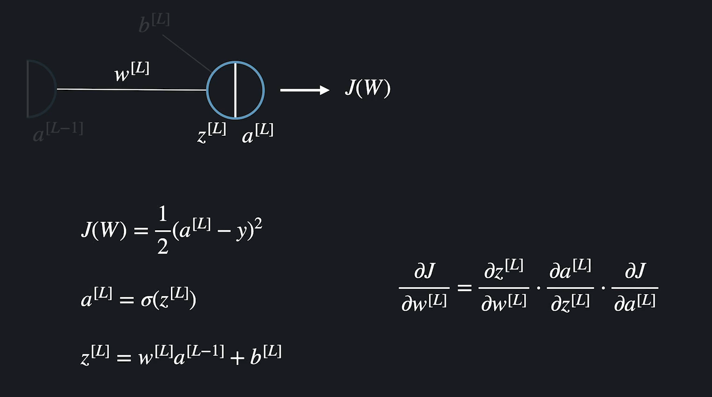
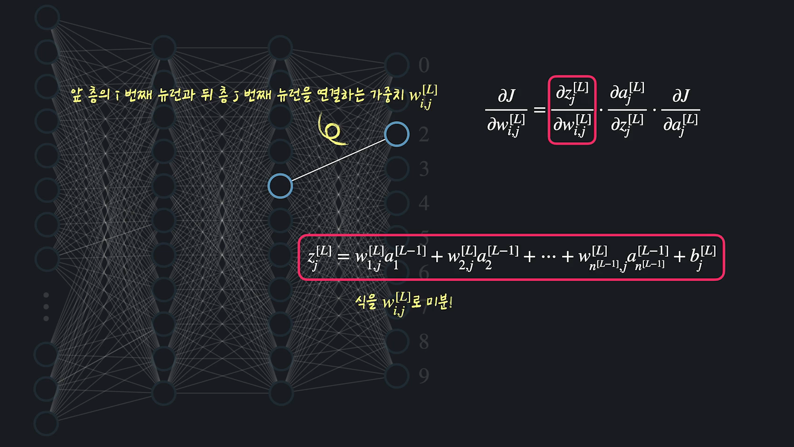
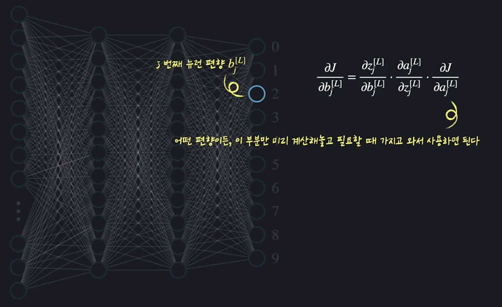
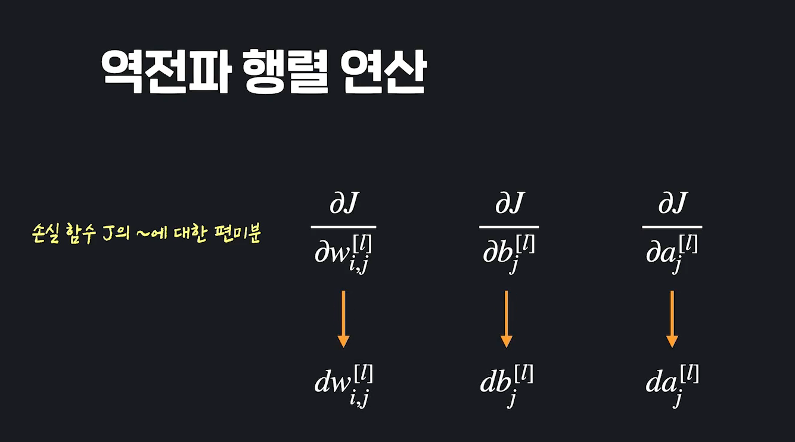

# Deep Learning 2

- #### 경사하강법 복습

  **우리의 궁극적인 목표는 최적의 가중치와 편향을 찾아내서 손실함수의 결과가 작게 나오게 하는 것.** 여기서도 경사하강법을 사용함. 
  
  문제를 단순화해서 하나의 가중치와 하나의 편향만 있다고 가정해 보자. 경사하강법은 임의의 W와 b에서 시작해서 손실함수가 가장 빠르게 줄어드는 방향으로  변수들을 계속 업데이트 해주는 최적화 방법. 
  
  함수를 미분해서 유용한 정보를 얻음. 함수를 미분하면, 변수를 늘릴 때, 함수의 출력이 비율적으로 얼마나 늘어나거나 줄어드는지 알 수 있음. 
  
  예를 들어 아래 함수에서 x=2일때 미분값이 라는 말은, 저 점에서 x를 늘리면 함수값이 2에 비례하는 정도로 늘어난다는 말. 기울기가 -4라는 말은 저 점에서 x를 늘릴때 y는 -4에 비례하는 정도로 줄어든다는 뜻. 
  
  
  
  현재 점(벡터)에서 특정 방향을 내적하면, 그 방향으로 갈 떄의 기울기가 나옴. 가장 최고로 빨리 아래로 내려가는 방법은? Gradient Vector를 내적하는 것. 
  
  
  
  식으로 표현하자면 아래와 같음. 학습률은 미분값을 그대로 빼면, 변화가 너무 크거나 작을 수 있으니깐, 그것을 조절해 주는 변수. 
  
  
  
  w=3, b=5라고 해보자. 손실함수를 w로 편미분하고 3을 대입하면 2가 나오고, b로 편미분하고 현재 b를 대입하면 -4가 나옴.  **이런식으로 GD를 빼면서 업데이트 해 가는 것이 손실함수를 가장 빨리 줄이는 방향으로 w와 b를 업데이트 해 가는 것.** 
  
  
  
  이것을 충분히 많이 반복하면, 손실함수의 극소점에 해당하는 w와 b를 찾을 수 있다. 
  
  
  
  근데 신경망에는 이 가중치와 편향이 수 없이 있음. 변수가 늘어났다고 해서 변하는 건 없음. **그냥 모든 가중치와 편향을 업데이트 해 가는 과정임. 결국은 이 GD를 충분히 반복하면, 똑같은 과정으로 나온다는 것.** 결국 이것을 충분히 반복하면, 손실함수의 극소점을 찾아가는 방향으로 업데이트 해 간다는 것.  
  
  


- #### 신경망 손실함수 경사 계산이 복잡한 이유

  신경망에서는 각 변수들에 대한 편미분을 찾는 것이 훨씬 더 복잡하다. 왜냐고?

  로지스틱 모델 하나가 있다고 해보자. 경사하강법을 사용해서 이것을 하나의 MNIST데이터를 사용해서 학습시키고 싶다고 해보자. GD하려면, 각 가중치에 대한 손실함수에 대해 편미분 값을 구해야 함. 가중치를 구한다는 것은 각 가중치를 바꿨을 때, 손실 함수가 어떻게 변하는지 알아본다는 것. 하나짜리에서 세타를 조금 올리면, 아웃풋도 조금 변하고, 손실함수도 조금 변함. **층이라는 개념도 없고, 출력 뉴런도 하나밖에 없기 때문에, 가중치와 편향의 변화에 따른 손실함수의 변화가 제한적이였음**. 

  

  신경망은?

  똑같이 이미지 하나 가지고 신경망을 학습시킨다고 해보자. 

  아래 가중치에 대한 편미분을 알고 싶다고 해보자. 아래 빨간박스의 가중치 하나에 대한 편미분만 계산하려고 해도 다 난리가 남. **신경망의 손실함수는 보기에는 똑같아 보여도 사실 엄청나게 복잡한 합성함수**.

  

- #### 신경망 손실함수의 볼록도

  머신 러닝 코스에서 선형 회귀와 로지스틱 회귀를 공부할 때, 이 두 알고리즘들의 손실 함수(각각 평균 제곱 오차와 로그 손실 함수)는 아래로 볼록한(convex) 함수라고 했는데요. 아래로 볼록하다는 건 손실 함수가 변수 ***θ***에 대해서 함수가 이런 식으로 된다는 말입니다.

  

  함수에 극소점이 하나밖에 없으며, 최소점입니다.

  그렇기 때문에, 어느 지점에서 경사 하강법을 시작해도, 충분히 많은 반복을 하면 결국에는 손실 함수의 **최소점**에 해당하는 *θ* 값들을 구할 수 있다고 했습니다. 기억나시죠?

  ##### 신경망 손실 함수 볼록도

  아쉽게도 이번 토픽에서 배우는 신경망의 손실 함수는 아래로 볼록하지 않습니다. 선형 회귀와 마찬가지로 평균 제곱 오차를 사용하고 있긴 해도, 너무 복잡한 합성 함수기 때문이죠. 손실 함수로 로그 손실 함수나 다른 함수를 사용해도 마찬가지입니다.

  손실 함수가 아래로 볼록하지 않다는 말은 단순화해서 시각적으로 표현하자면 이런 식으로 생겼다는 말입니다.

  

  여러 개의 극소점들이 있고 이 중에서 가장 손실이 작은 점만이 최소점입니다. 그렇기 때문에 이번 챕터에서 임의로 값들을 초기화하고 경사 하강법을 해도 손실을 **가장** 작게 만드는 가중치 *w*와 편향 *b* 값들을 찾는다고 할 수는 없습니다. 오히려 나머지 극소점들 중 하나를 찾을 가능성이 더 큰 거죠.

  찾은 지점이 최소점이라는 보장이 없어도 신경망에서는 가중치와 편향을 최적화하기 위해서 경사 하강법을 사용합니다.

  **첫 번째 이유**는 가중치와 편향에 어떤 값이 들어가야 될지 전혀 모르는 상황에서, 어떤 임의 값에서 시작해도 그 값들보다는 손실을 줄일 수 있기 때문이고요.

  **두 번째 이유**는 이렇게 해서 찾은 극소점들에서 얻는 성능이 많은 경우 충분히 좋게 나오기 때문입니다.

  ***손실 함수가 볼록하지 않다는 문제점을 극복하기 위한 한 가지 방법은 무게와 편향 값들을 임의로 초기화를 여러 번해서 경사 하강법을 많이 해본 이후, 가장 성능이 좋게 나온 모델을 사용하는 겁니다.***


- #### 합성함수와 연쇄법칙

  합성함수란? 함수 안에 다른 함수가 들어있는 함수. 

  신경망의 손실함수를 생각해보면, 손실함수는 마지막 층 뉴런의 출력을 사용해서 예측이 얼마나 정확한지를 계산함. 마지막 층 뉴런들의 출력값인 a[L]이 손실함수의 변수. 

  근데 a[L]은 어떤 출력값이긴 하지만, 그 값이 또다른 변수로 인해 결정되는 함수이기도 함. 왜냐면 그 안에 또 a[L-1]이 있음. a[L-1]도 마찬가지임. 쭉 앞으로 이어짐. 

  

  이 각 뉴런들이 얼마나 복잡한 함수인지 알겠지? 

  

  합성함수는 조금 다른 방식으로 미분함. 

  **Chain Rule**

  

  

  **Chain Rule이 있으면, 아무리 복잡한 합성함수가 있어도, 미분값을 구할 수가 있음.**

   


- #### Back Propagation

  합성함수 미분법 배웠으니깐, 이거로 이제 신경망을 학습시켜 봐야함. 

  문제를 단순화해서 신경망의 층이 3개가 있고, 각 층에는 노드가 1개씩만 있다고 해보자. 신경망에서는 미분값을 뒤에서 앞으로 가면서 구해. 그래서 역전파(Back Propagation이라고 부르는 것)

  

  5 하나에 대해서 신경층 학습시킨다고 해보자. 그럼 손실함수는? 

  이 손실함수는 마지막 층의 가중치로 편미분 해보자. 

  

  자세히 보기 위해 확대해보면, 

	
	
	
	
	이제 이 그림을 사용해서 손실함수를 가중치로 미분해 보자. W가 바뀔 때, J가 어떻게 바뀌는 지를 알고 싶은 것. 
	
	**w가 바뀌면, z -> a> J 순으로 바뀌어감.** 그걸 연쇄법칙을 적용하면 아래와 같이 표현할 수 있음. 
	
	
	
	미분 해보면, 
	
	
	
	실제 값을 넣으면 구할 수가 있음. 
	
	b에 대한 미분도 구해야지. 
	
	
	
	
	
	여기서 z[L]을 a[L-1]로 편미분한 값도 미리 계산해 놓자. 
	
	
	
	
	
	**그럼 지금까지 한것만 정리해보면, J를 w[L], b[L], a[L-1]에 대해서 편미분 한 값을 계산했음.**
	
	 
	
	그럼 이제, 이전 한 층 더 앞으로 간 편미분을 계산해 보자. w[L-1]을 변화시키면 뒤로 쭉 이어짐. 똑같이 다 따로 계산해서 곱해주면 끝임. 복잡할 뿐 어렵지 않음. 아래 식만 다 곱하면 결국 값이 나오는 것. 
	
	
	
	계산할게 엄청 많아 보이는데, 처음부터 다 계산해야 하는 것은 아님. 마지막 3개를 보면, 이거 앞에서 계산했었잖아. 
	
	
	
	
	
	편향에 대한 편미분도 똑같이 계산할 수 있음. 
	
	
	
	
	
	여기서도 J를 편미분 한 값을 계산해 놓고 그 뒷층 계산할때 사용하면 되지. 
	
	
	
	**하나 더 앞으로 가서 계산해보자.**
	
	 
	
	
	
	
	
	

- #### **Generalization Of Back Propagation(역전파 일반화)**

  각 층의 뉴런이 여러개인 경우를 봐보자. 데이터는 하나라고 해보자. 앞에서 한거랑 아무 차이도 없음. 

  

   L-1층의  i번째 뉴런과, L층의 j번째 뉴런을 연결하는 가중치로 편미분 해보자. 여러개라고 해도, 편미분 해보면, 전층에서 연결된 뉴런의 출력만 남지. 

  

  

  

  

  **여기서 중요한 것은 가중치에서 일어나는 변화는 바로 뒷 층에서 하나의 뉴런의 출력에만 영향을 미칠 수 밖에 없다는 것.** 그래서 어떤 가중치여도, J를 그 연결되는 뉴런의 a값으로 편미분한 값만 알면, 그냥 간단하게 사용할 수 있음. 

  

  편향도 마찬가지. 편향도 가중치와 마찬가지로 하나의 뉴런의 출력에만 영향을 미침. 얘도 그럼 가중치가 그 연결된 뉴런의 출력을 어떻게 바뀌는지만 알면, 그 뉴런부터 맨 앞 J까지 가는 것은 미리 계산해놓고 대입만 하면 됨. 

  

  **이 계산을 해당 층의 모든 가중치와 편향에 반복해서 계산하면 됨.** 뉴런의 숫자가 많아진 것을 제외하고는 위에서 한거랑 아예 똑같음. 

  뉴런의 출력, a에 대한 편미분을 구하는 것만 조금 바뀌는 것. 가중치와 편향을 바꿀때는 a의 손실함수에 대한 편미분이 계산되어 있다는 전제 하에 가중치와 편향은 하나의 뉴런의 출력에 대한 편미분 값만 계산하면 됬음. 뉴런의 출력 a에 대한 편미분은 뒷층 모든 뉴런의 출력에 영향을 미침. 

  

  **그럼 손실함수 어떻게 바뀌는지 어떻게 알지?** 뒤에 10개 뉴런을 바꿨을 때, 손실함수에서 바뀌는 변화들 싹다 더해줘야 함(지금 앞에서처럼 **a[L-1]**이 바뀔때 뒤가 어떻게 되는지 미리 계산하고 있음). 모든 뉴런에 대해서 더해주는 의미로서 시그마를 썼음. 

  

  그 계산을 풀면 아래처럼 나옴. 

  

  이제 이걸 마지막에서 두번째 층 모든 뉴런에 대해서 계산 반복해야 함. 

  

  그럼 이렇게 까지 했으면, 가중치, 편향 뉴런의 출력에 대한 모든 편미분을 계산한 것. **이 계산을 앞에서 계속 반복하면 됨.** 

  

  이제 다시 그 앞층의 i번째 뉴런과 뒷층 j번째 뉴런을 연결하는 가중치에 대한 편미분을 구하고 싶다면? 이런거 할때 다 그냥 가져와서 사용하면 되는거야. 

  

  

  그리고, 첫번째 층 뉴런의 출력을 또 다시 J에 대해 편미분 할 때는? 앞으로 계속 엮여서 감.

  

  **그냥 이런 단순한 과정을 신경망 내 모든, 값에 대한 편미분 구할 때 까지 반복하면 됨.** 

  일반화 하면 다음과 같음. 

  

  

  


- #### 신경망 경사하강(Gradient Descent)

  이미지 하나가 아니라 모든 편미분에 대한 것을 구하고 싶은 것. 이거는 간단함. 지금까지 했던 과정을 모든 이미지들에 대해서 반복해 주면 됨. 진짜 하나씩 다 해보면 이런식으로 정리가 되겠지. 

  아래 데이터는 이미지 하나하나에 대해서 가중치와 편향을 바꿨을때 손실함수가 어떻게 바뀌느냐에 대한 평균임. *예를 들어 첫번째 열의 5라는 데이터를 넣었을때, w1,1[3]을 바꾸면, 손실함수가 0.5만큼 늘고, 이런식임.* 

  

  가중치를 바꿨을 때, 하나의 이미지가 아니라, 전체에 대한 손실함수가 어떻게 변하는지를 알고 싶으면 평균을 계산해야 함. **이 평균이 우리가 계산하려고 했던 모든 데이터에 대한 손실함수이 편미분 값들임.** 즉 손실함수의 gradient vector인 것. 

  ㅋ

  **Gradient Vector를 구했으니깐, 경사하강을 하면 됨.**

   


- #### 벡터의 외적곱

  코드잇 머신 러닝 코스에서는 두 가지의 행렬 연산에 대해서 알아봤습니다. 좀 더 구체적으로는 **행렬 곱셈**, **요소별 곱하기**에 대해서 배웠습니다. (혹시 기억이 안 나시는 분들은 꼭 복습하고 와주세요!)

  역전파를 순전파랑 마찬가지로 행렬 연산으로 표현하기 위해서는 이 두 가지 곱셈법말고도 **벡터의 외적곱**이라는 연산을 알고 계셔야 합니다**.**

  

  


- #### **역전파(Back Propagation) 행렬연산**

  일단 notation이 너무 복잡하니깐, 간단하게 표현해보자. 어차피 모든 것은 다 J를 편미분 하는 값임. 

  앞에서  w, a, b 값들을 행렬과 벡터로 표현했었음. 편미분 값들도 그렇게 표현할 수 있겠지. 

  

  

  이제 문제는 편미분 계산을 어떻게 행렬로 표현할 것인가? 편향 먼저

  **요소별 곱하기(같은 차원의 벡터를 같은 자리끼리 곱하는 것)를 사용하면 됨.** 

  

  

  

  한방에 묶어서 간소하게 표현이 가능함. 

  

  **다음은 가중치 편미분 값 계산하기**

  

  db는 이미 계산해 놨으니깐, 그대로 대입만 하면 됨. 

  그리고 앞부분 미분을 풀어주면, 아래처럼 나옴. 

  

  

  이제 이걸로 행렬 연산으로 묶기만 하면 됨. **벡터의 외적곱**

  

  

  그 다음  a에 대한 편미분 값을 구하면 됨. 

  

  

  

  한 층의 da[l-1]을 모두 묶어서 표현하면 아래처럼 나옴. 

  

  그걸 가중치 행렬 w와 db를 사용해서 아래처럼 나타낼 수 있음. 

  

  이제 정리하자면, 역전파는 가장 뒷층에서 한 층씩 돌면서 아래 세 가지를 계산해 가는 알고리즘임. 

  


- #### 역전파(Back Propagation) 구현 흐름

  식이 복잡해도 우리의 목표는 하나. 모든 층에 대해서 아래의 두가지를 계산하는 것. 

  

  이제 하나의 데이터가 있고, 그 값에 대해서 신경망의 db, dW를 구하고 싶다고 해보자. *아래 그림은 한 층에서 일어나는 계산을 하나의 박스로 표현한 것.* 

   1. 일단 본격적인 신경망을 구현하기에 앞서 신경망 내부의 모든 **W와 b값들을 임의의 값으로 초기화한다**. 이 값들은 따로 변수로 저장해놓은 상태. 

   2. 일단 순전파를 하는것. 순전파를 하면서, z[1], a[1], z[2], a[2], z[3], a[3]이런것들이 계산되기 시작하는데 이 친구들은 역전파에 사용되므로 따로 다 저장해 둬야 함. 계산은 행렬 연산으로 해 가면 되겠지. 

      

  3. 이제 다시 역전파로 와보자. 무엇보다도 해야되는거는 마지막 층의 a값들로 J를 편미분한 값을 구해야 함(그거부터 해야 뭐라도 할 수가 있으니깐). 아래 식을 a1, a2로 하나씩 미분해보면, 다 아래 빨간박스 처럼 나옴. 

     

     

  4. 이 값을 역전파 과정에 넘겨줌. 이 정보와 다른 값들을 가지고  **db, dW, da**를 계산할 수가 있음. 

     

  5. 이제 계속 앞으로 가면서 이 과정을 반복하면 됨. 

     

  6. 여기까지 했으면, 하나의 이미지에 대해서, 편미분 값을 계산한 것. 이 수업에서 한 것 처럼 이거로 데이터를 싹다 돌면서 편미분 값의 표를 만들고, 표를 만들어서 평균값을 계산해도 되고. 아니면 애초에 J를 쓸때 m=1-> n[L]로 가는 J를 사용해도 됨. ***어차피 두 식이 똑같음***. 

  7. 이제 이걸로 경사하강 1회 할 수 있는 것. 

     

  8. **이 과정을 충분히 반복하다 보면, J를 충분히 줄이는 w와 b의 조합을 찾게 되는 것.** 


- #### 정리

  

  

  

- 예시 과제 

  ```python
  
  # 인공 신경망 구현에 사용할 라이브러리 임포트
  import numpy as np
  import pandas as pd
  # import matplotlib.pyplot as plt
  
  # numpy 임의성 조절
  np.random.seed(42)
  
  # 데이터 셋 가지고 오기
  dataset = pd.read_csv('./data/MNIST_preprocessed.csv', sep=',', header=None).values
  
  # 입력, 목표 변수 데이터 셋 나누기
  X = dataset[:, 0:784]
  Y = dataset[:, 784:]
  
  # training, testing 데이터 셋 나누기
  X_train, X_test = X[0:250,], X[250:,]
  Y_train, Y_test = Y[0:250,], Y[250:,]
  
  def sigmoid(x):
      """시그모이드 함수"""
      return 1/(1 + np.exp(-x))
  
  def d_sigmoid(x):
      """시그모이드 미분 함수"""
      return (np.exp(-x))/((np.exp(-x)+1)**2)
  
  def initialize_parameters(neurons_per_layer):
      """신경망의 가중치와 편향을 초기화해주는 함수"""
      L = len(neurons_per_layer) - 1  # 입력층을 포함함 층 개수 저장
      parameters = {}
      
      # 1층 부터 L 층까지 돌면서 가중치와 편향 초기화
      for l in range(1, L+1):
          parameters['W' + str(l)] = np.random.randn(neurons_per_layer[l], neurons_per_layer[l-1]) * np.sqrt(1. / neurons_per_layer[l])
          parameters['b' + str(l)] = np.random.randn(neurons_per_layer[l]) * np.sqrt(1. / neurons_per_layer[l])
          
      return parameters
  
  def feed_forward(x, parameters):
      """순전파 함수"""
      cache = {'a0': x}
      L = len(parameters) // 2
      
      for l in range(1, L+1):
          # 전 층 뉴런의 출력, 현재 층 뉴런들의 가중치, 편향 데이터를 가지고 온다.
          a_prev = cache['a' + str(l-1)]
          W = parameters['W' + str(l)]
          b = parameters['b' + str(l)]
          
          # 데이터로 z와 a를 계산한다.
          z = W @ a_prev + b
          a = sigmoid(z)
  
          # 결과 값을 캐쉬에 저장한다.
          cache['z' + str(l)] = z
          cache['a' + str(l)] = a
                  
      return a, cache
  
  def compute_accuracy(x_val, y_val, parameters):
      """테스트 데이터에서 예측값들의 성능을 계산하는 함수"""
      predictions = []
  
      for x, y in zip(x_val, y_val):
          output, _ = feed_forward(x, parameters)
          pred = np.argmax(output)
          predictions.append(pred == np.argmax(y))
  
      return np.mean(predictions)
  
  def compute_loss(x_val, y_val, parameters):
      """학습 데이터에서 현재 모델의 손실을 계산하는 함수"""
      loss = 0
      
      for x, y in zip(x_val, y_val):
          output, _ = feed_forward(x, parameters)
          loss += np.mean((output - y)**2) / 2
          
      return loss / len(x_val)
  
  def back_prop(prediction, y, cache, parameters):
      """역전파 함수"""
      gradients = {}
      L = len(cache) // 2
      da = (prediction - y) / y.shape[0]
      
      for layer in range(L, 0, -1):
          # 역전파 행렬 연산을 사용해서 각 요소에 대한 편미분 계산
          # 코드를 쓰세요
          db = d_sigmoid(cache['z'+str(layer)])*da
          dW = np.outer(db, cache['a'+str(layer-1)])
          da = parameters['W'+str(layer)].T.dot(db)
          # 계산한 편미분 값들을 저장
          gradients['dW' + str(layer)] = dW
          gradients['db' + str(layer)] = db
      
      # 계산한 편미분 값들 리턴
      return gradients
  
  def update(parameters, gradients, alpha, m):
      """계산한 경사로 가중치와 편향을 업데이트 하는 함수"""
      L = len(parameters) // 2
      
      for layer in range(1, L+1):
          parameters['W'+str(layer)] -= alpha * gradients['dW'+str(layer)] / m
          parameters['b'+str(layer)] -= alpha * gradients['db'+str(layer)] / m
      
      return parameters
  
  def train_nn(X_train, Y_train, X_test, Y_test, neurons_per_layer, epoch, alpha):
      """신경망을 학습시키는 함수"""
      parameters = initialize_parameters(neurons_per_layer)
      loss_list = []
      m = X_train.shape[0]
      
      # epoch 번 경사 하강을 한다
      for i in range(epoch):
          parameters_copy = parameters.copy()
          
          # 모든 이미지에 대해서 경사 계산 후 평균 계산
          for x, y in zip(X_train, Y_train):
              prediction, cache = feed_forward(x, parameters)
              gradients = back_prop(prediction, y, cache, parameters)
              parameters_copy = update(parameters_copy, gradients, alpha, m)
          
          # 가중치와 편향 실제로 업데이트
          parameters = parameters_copy
          loss_list.append(compute_loss(X_train, Y_train, parameters))
          print('{}번째 경사 하강, 테스트 셋에서 성능: {}'.format(i+1, round(compute_accuracy(X_test, Y_test, parameters), 2)))     
              
      return loss_list, parameters
  
  
  """디버깅을 위한 시각화 코드(쥬피터를 사용하시면 실행 코드 가장 아래줄에 넣어주세요!)
  plt.plot(loss_list)
  plt.show()
  """
  
  # 실행 코드
  neurons_per_layer = [784, 128, 64, 10]
  parameters = initialize_parameters(neurons_per_layer)
  
  loss_list, parameters = train_nn(X_train, Y_train, X_test, Y_test, neurons_per_layer, 25, 300)
  
  
  ```

  