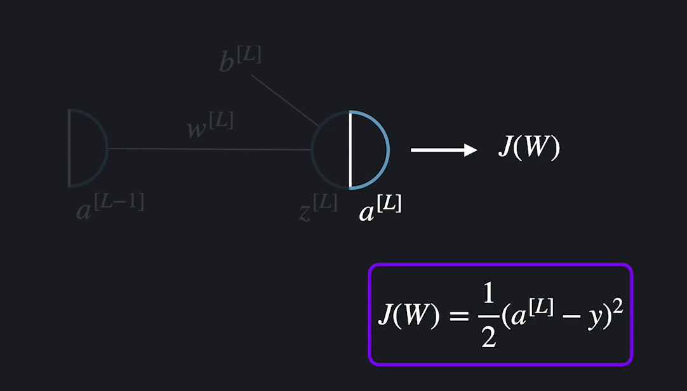

# Deep Learning 2

- #### 경사하강법 복습

  **우리의 궁극적인 목표는 최적의 가중치와 편향을 찾아내서 손실함수의 결과가 작게 나오게 하는 것.** 여기서도 경사하강법을 사용함. 
  
  문제를 단순화해서 하나의 가중치와 하나의 편향만 있다고 가정해 보자. 경사하강법은 임의의 W와 b에서 시작해서 손실함수가 가장 빠르게 줄어드는 방향으로  변수들을 계속 업데이트 해주는 최적화 방법. 
  
  함수를 미분해서 유용한 정보를 얻음. 함수를 미분하면, 변수를 늘릴 때, 함수의 출력이 비율적으로 얼마나 늘어나거나 줄어드는지 알 수 있음. 
  
  예를 들어 아래 함수에서 x=2일때 미분값이 라는 말은, 저 점에서 x를 늘리면 함수값이 2에 비례하는 정도로 늘어난다는 말. 기울기가 -4라는 말은 저 점에서 x를 늘릴때 y는 -4에 비례하는 정도로 줄어든다는 뜻. 
  
  
  
  현재 점(벡터)에서 특정 방향을 내적하면, 그 방향으로 갈 떄의 기울기가 나옴. 가장 최고로 빨리 아래로 내려가는 방법은? Gradient Vector를 내적하는 것. 
  
  
  
  식으로 표현하자면 아래와 같음. 학습률은 미분값을 그대로 빼면, 변화가 너무 크거나 작을 수 있으니깐, 그것을 조절해 주는 변수. 
  
  
  
  w=3, b=5라고 해보자. 손실함수를 w로 편미분하고 3을 대입하면 2가 나오고, b로 편미분하고 현재 b를 대입하면 -4가 나옴.  **이런식으로 GD를 빼면서 업데이트 해 가는 것이 손실함수를 가장 빨리 줄이는 방향으로 w와 b를 업데이트 해 가는 것.** 
  
  
  
  이것을 충분히 많이 반복하면, 손실함수의 극소점에 해당하는 w와 b를 찾을 수 있다. 
  
  
  
  근데 신경망에는 이 가중치와 편향이 수 없이 있음. 변수가 늘어났다고 해서 변하는 건 없음. **그냥 모든 가중치와 편향을 업데이트 해 가는 과정임. 결국은 이 GD를 충분히 반복하면, 똑같은 과정으로 나온다는 것.** 결국 이것을 충분히 반복하면, 손실함수의 극소점을 찾아가는 방향으로 업데이트 해 간다는 것.  
  
  

- #### 신경망 손실함수 경사 계산이 복잡한 이유

  신경망에서는 각 변수들에 대한 편미분을 찾는 것이 훨씬 더 복잡하다. 왜냐고?

  로지스틱 모델 하나가 있다고 해보자. 경사하강법을 사용해서 이것을 하나의 MNIST데이터를 사용해서 학습시키고 싶다고 해보자. GD하려면, 각 가중치에 대한 손실함수에 대해 편미분 값을 구해야 함. 가중치를 구한다는 것은 각 가중치를 바꿨을 때, 손실 함수가 어떻게 변하는지 알아본다는 것. 하나짜리에서 세타를 조금 올리면, 아웃풋도 조금 변하고, 손실함수도 조금 변함. **층이라는 개념도 없고, 출력 뉴런도 하나밖에 없기 때문에, 가중치와 편향의 변화에 따른 손실함수의 변화가 제한적이였음**. 

  

  신경망은?

  똑같이 이미지 하나 가지고 신경망을 학습시킨다고 해보자. 

  아래 가중치에 대한 편미분을 알고 싶다고 해보자. 아래 빨간박스의 가중치 하나에 대한 편미분만 계산하려고 해도 다 난리가 남. **신경망의 손실함수는 보기에는 똑같아 보여도 사실 엄청나게 복잡한 합성함수**.

  

- #### 신경망 손실함수의 볼록도

  머신 러닝 코스에서 선형 회귀와 로지스틱 회귀를 공부할 때, 이 두 알고리즘들의 손실 함수(각각 평균 제곱 오차와 로그 손실 함수)는 아래로 볼록한(convex) 함수라고 했는데요. 아래로 볼록하다는 건 손실 함수가 변수 ***θ***에 대해서 함수가 이런 식으로 된다는 말입니다.

  

  함수에 극소점이 하나밖에 없으며, 최소점입니다.

  그렇기 때문에, 어느 지점에서 경사 하강법을 시작해도, 충분히 많은 반복을 하면 결국에는 손실 함수의 **최소점**에 해당하는 *θ* 값들을 구할 수 있다고 했습니다. 기억나시죠?

  ##### 신경망 손실 함수 볼록도

  아쉽게도 이번 토픽에서 배우는 신경망의 손실 함수는 아래로 볼록하지 않습니다. 선형 회귀와 마찬가지로 평균 제곱 오차를 사용하고 있긴 해도, 너무 복잡한 합성 함수기 때문이죠. 손실 함수로 로그 손실 함수나 다른 함수를 사용해도 마찬가지입니다.

  손실 함수가 아래로 볼록하지 않다는 말은 단순화해서 시각적으로 표현하자면 이런 식으로 생겼다는 말입니다.

  

  여러 개의 극소점들이 있고 이 중에서 가장 손실이 작은 점만이 최소점입니다. 그렇기 때문에 이번 챕터에서 임의로 값들을 초기화하고 경사 하강법을 해도 손실을 **가장** 작게 만드는 가중치 *w*와 편향 *b* 값들을 찾는다고 할 수는 없습니다. 오히려 나머지 극소점들 중 하나를 찾을 가능성이 더 큰 거죠.

  찾은 지점이 최소점이라는 보장이 없어도 신경망에서는 가중치와 편향을 최적화하기 위해서 경사 하강법을 사용합니다.

  **첫 번째 이유**는 가중치와 편향에 어떤 값이 들어가야 될지 전혀 모르는 상황에서, 어떤 임의 값에서 시작해도 그 값들보다는 손실을 줄일 수 있기 때문이고요.

  **두 번째 이유**는 이렇게 해서 찾은 극소점들에서 얻는 성능이 많은 경우 충분히 좋게 나오기 때문입니다.

  ***손실 함수가 볼록하지 않다는 문제점을 극복하기 위한 한 가지 방법은 무게와 편향 값들을 임의로 초기화를 여러 번해서 경사 하강법을 많이 해본 이후, 가장 성능이 좋게 나온 모델을 사용하는 겁니다.***

- #### 합성함수와 연쇄법칙

  합성함수란? 함수 안에 다른 함수가 들어있는 함수. 

  신경망의 손실함수를 생각해보면, 손실함수는 마지막 층 뉴런의 출력을 사용해서 예측이 얼마나 정확한지를 계산함. 마지막 층 뉴런들의 출력값인 a[L]이 손실함수의 변수. 

  근데 a[L]은 어떤 출력값이긴 하지만, 그 값이 또다른 변수로 인해 결정되는 함수이기도 함. 왜냐면 그 안에 또 a[L-1]이 있음. a[L-1]도 마찬가지임. 쭉 앞으로 이어짐. 

  

  이 각 뉴런들이 얼마나 복잡한 함수인지 알겠지? 

  

  합성함수는 조금 다른 방식으로 미분함. 

  **Chain Rule**

  

  

  **Chain Rule이 있으면, 아무리 복잡한 합성함수가 있어도, 미분값을 구할 수가 있음.**

   

- #### Back Propagation

  합성함수 미분법 배웠으니깐, 이거로 이제 신경망을 학습시켜 봐야함. 

  문제를 단순화해서 신경망의 층이 3개가 있고, 각 층에는 노드가 1개씩만 있다고 해보자. 신경망에서는 미분값을 뒤에서 앞으로 가면서 구해. 그래서 역전파(Back Propagation이라고 부르는 것)

  

  5 하나에 대해서 신경층 학습시킨다고 해보자. 그럼 손실함수는? 

  이 손실함수는 마지막 층의 가중치로 편미분 해보자. 

  

  자세히 보기 위해 확대해보면, 

	
	
	
	
	이제 이 그림을 사용해서 손실함수를 가중치로 미분해 보자. W가 바뀔 때, J가 어떻게 바뀌는 지를 알고 싶은 것. 
	
	**w가 바뀌면, z -> a> J 순으로 바뀌어감.** 그걸 연쇄법칙을 적용하면 아래와 같이 표현할 수 있음. 
	
	
	
	미분 해보면, 
	
	
	
	실제 값을 넣으면 구할 수가 있음. 
	
	b에 대한 미분도 구해야지. 
	
	
	
	
	
	여기서 z[L]을 a[L-1]로 편미분한 값도 미리 계산해 놓자. 
	
	
	
	
	
	**그럼 지금까지 한것만 정리해보면, J를 w[L], b[L], a[L-1]에 대해서 편미분 한 값을 계산했음.**
	
	 
	
	그럼 이제, 이전 한 층 더 앞으로 간 편미분을 계산해 보자. w[L-1]을 변화시키면 뒤로 쭉 이어짐. 똑같이 다 따로 계산해서 곱해주면 끝임. 복잡할 뿐 어렵지 않음. 아래 식만 다 곱하면 결국 값이 나오는 것. 
	
	
	
	계산할게 엄청 많아 보이는데, 처음부터 다 계산해야 하는 것은 아님. 마지막 3개를 보면, 이거 앞에서 계산했었잖아. 
	
	
	
	
	
	편향에 대한 편미분도 똑같이 계산할 수 있음. 
	
	
	
	
	
	여기서도 J를 편미분 한 값을 계산해 놓고 그 뒷층 계산할때 사용하면 되지. 
	
	
	
	**하나 더 앞으로 가서 계산해보자.**
	
	 
	
	
	
	
	
	

- #### **Generalization Of Back Propagation(역전파 일반화)**

  