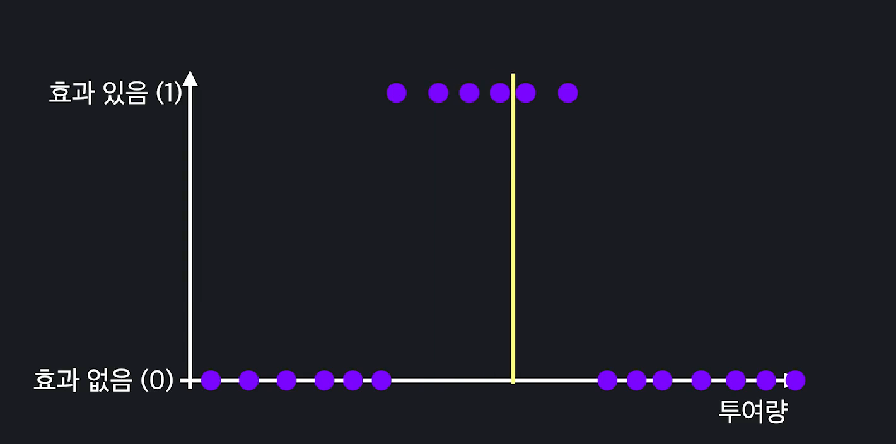
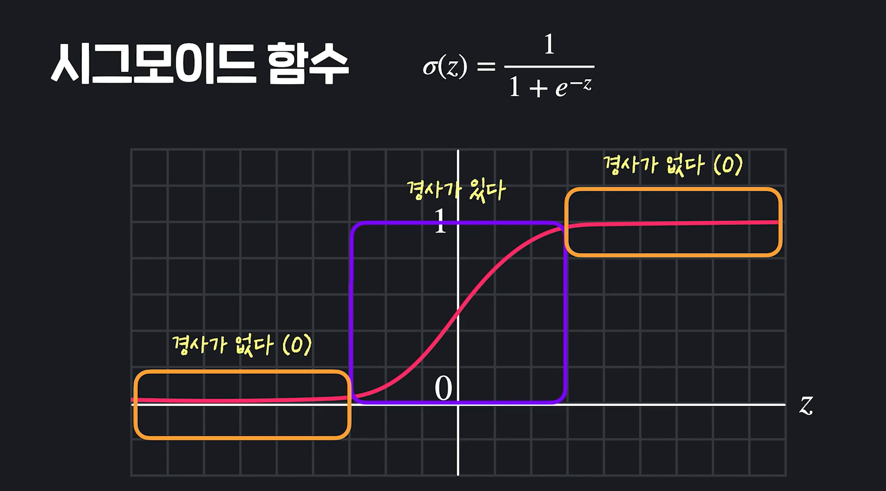
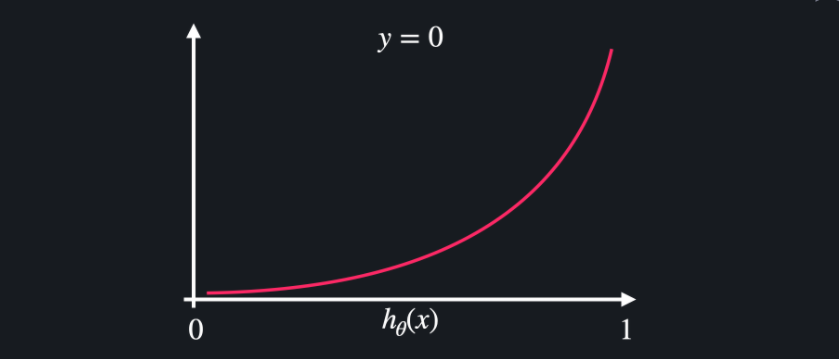

# Deep Learning 3

- #### 신경망과 다양한 데이터

   이번에는 이미지가 아니라, 표 데이터를 다룰때 신경망을 어떻게 쓰는지 보게 될 것. 신경망에서는 MNIST데이터든, 표 데이터든 바뀌는 것은 아무것도 없음. 

  지금까지 했던것은, 이미지 데이터를 픽셀로 표현해서 표 데이터로 만든 다음에 신경망에 돌린 것. 표 데이터는 이미 표로 정리되어 있기 때문에, 그냥 사용하면 되는 것.

  예를 들어 여러 환자에 대한 데이터가 있다고 해보자. 입력변수는 환자에 대한 다양한 수치들. 해당 환자가 독감에 걸렸는지 안걸렸는지가 출력변수. 

  

  그럼 그냥 신경망의 입력층에, 각 층에 환자의 feature들이 하나씩 들어가겠지. 784개의 뉴런 대신, 4개의 뉴런만 사용하면 되겠지. 그리고, 숫자 10개중 하나로 분류하는게 아니라, 독감 환자인지 아닌지를 분류하는 것. 출력층에서는 뉴런을 1개만 쓰면 되겠지. **일반적으로 은닉층의 뉴런갯수는 입력층과 출력층 사이의 갯수로 정하게 됨.** 

  

  이제 나머지는 다 똑같아. 뉴런의 갯수만 생각하면 나머지는 다 똑같음. 

- #### 신경망의 비선형성

  선형적인 머신러닝에 대해서 봐보자. 

  대표적인 선형적인 알고리즘인 로지스틱회귀에 대해서 봐보자. 약 투여에 따른 효과 있고, 없었던 상황에 대해서 생각해보자. 로지스틱회귀의 목적은 데이터에 가장 잘 맞는, 시그모이드 함수를 찾는 것이였음. 이 함수에 입력변수를 넣었을 때, 결과값이 0.5가 넘으면 효과가 있는 것이였고, 0.5보다 낮으면 효과가 없는 것으로 예측하는 알고리즘 이였음. 

  

  변수 하나일때, 여기서 실질적으로 데이터를 분류하는 기준은 0.5인 점의 x좌표 찾으면 10을 넘었냐 안넘었냐였음. 데이터를 두개로 나누는 결정선을 바로 **결정경계(Decision Boundary)**라고 했던 것. 

  

  만약 feature가 두개라면 어떻게 될까? 

  

  **어쨋든 로지스틱 회귀를 사용하면, 선형적인 결정경계만 얻을 수 있음.** 

  만약에 데이터가 아래처럼 있으면 어떻게 될까? 데이터를 잘 분리하는 기준을 찾는 것이 어려워짐. 이런 데이터를 보고 **선형분리불가능**하다고 말함. 영어로 linearly inseparable. 

  

  

  **그러니깐 이런 경우는 로지스틱 회귀라는 알고리즘 자체가 안먹히는 거지.** 

  이럴때 신경망을 사용하면, 훨씬 더 복잡한 결정경계를 찾아낼 수 있음. 

  

  

  위같은 경우는 매우 간단한 결정경계에 속함. 훨씬 더 복잡한 결정경계도 찾아낼 수 있음. 

  

  **신경망의 이런 비선형성은 은닉층의 활성함수를 통해 이뤄진다.** *활성함수는 전 층 뉴런들의 출력과 가중치를 곱하고 편향을 더한 후 시그모이드에 넣는 것*. 

  

  **지금까지는 시그모이드를 활성함수로 사용했는데, 당연히 꼭 시그모이드를 사용해야 하는 것은 아니겠지.** 이때 은닉층의 활성함수가 주로 **비선형함수**를 사용함. 비선형함수는 그냥 선형함수가 아니라는 말. 

  

  활성함수로 사용했던 시그모이드도 비선형 함수지. 

  신경망도 결국 인풋을 받아서, 아웃풋을 계산하는 하나의 함수. 입력층으로 들어간 데이터는 각 층을 넘어갈때마다 활성함수를 넘어가지. 이 활성함수가 비선형이면, **결국 신경망 이라는 함수도 엄청나게 복잡한 비선형 합성함수가 되는 것.** 

  시그모이드를 예로 들면, 시그모이드로 처리된게 또 시그모이드를 넘어가고 이렇게 층마다 반복되는 것. 그리고, 이 비선형함수로 결정경계를 만들면 비선형적이게 나옴. 

  반면, 활성화함수가 선형이면, 신경망도 결국 선형함수가 나오고, 결정경계도 선형함수가 나옴. 

  **참고: 신경망을 학습시켜서 분류할 때, 마지막에 output레이어가 그 분류해야 되는 수 만큼 나오고, 그 중에 점수가 제일 큰 놈으로 선택하게 됨. 어쨋든 그 선택을 하게 되는 것 까지가 신경망임. 그러면 좌표들이 찍혀 있고, a가 b, c 보다 큰 구역, b가 a, c보다 큰 구역, c가 a, b보다 큰 구역이 결정되는 경계가 생기겠지. 우리가 모르는 사이에 딥러닝 내부에서 그것을 결정하는 경계가 생긴다는 뜻.** 그 결정경계가 활성함수가 주로 비선형 함수이면, 비선형으로 나오고, 활성함수가 선형이면 주로 선형으로 나온다는 뜻. 

- #### 로지스틱회귀가 선형 모델(선형의 결정경계를 갖는 모델)인 이유

  

  

> 생각해보면, 결정경계는 분류모델일때 필요한건데, 신경망은 애초에 분류모델에서 그만큼 아웃풋 레이어가 늘어나고, 그 중에 제일 확률 높은애로 가는건데 결정경계 얘기가 왜필요하지?

- #### 은닉층 활성함수

  은닉층에서 쓰이는 활성함수 몇개와 각각의 특징들을 살펴보자. 

  1. **시그모이드 함수** 

     입력변수에 어떤 값이 들어와도 0과 1사이로 바꿔주는 함수. 

     근데 큰 단점이 있음. 중간은 경사가 있고, z값이 커지거나 작아지면 경사가 거의 없음. 신경망은 경사하강법을 이용해서 학습을 하는데, 손실함수에 시그모이드 함수가 많이 포함되어 있으면, 경사가 거의 0에 수렴하는 경우가 많이 생김. 손실함수의 경사가 0에 가까워 지면, 경사하강법을 아무리 많이 해도, 가중치와 편향이 바뀌질 않음. 

     **요약하자면, 가설함수에 시그모이드가 많이 포함되어 있으면, 손실함수에도 시그모이드가 많이 포함될수 밖에 없고, 그러면 경사가 0에 가까운 부분이 많이 포함됨. 그 경우 Gradient Descent를 해도 엄청 조금씩만 업데이터 되거나 거의 업데이트가 안되겠지(편미분값이 다 0에 가까우니깐).** 이 문제를 기울기소실문제라고 함. 이 기울기소싦문제 때문에, 시그모이드는 처음에 신경망 나왔을때는 인기가 많았는데, 그 뒤로는 인기가 많이 사그라들었음. 

     

     실제 경사하강 식에서, 이 편미분값들이 다 0으로 바뀐다고 생각해봐. 업데이트가 잘 안될 수 있음. **편미분이라는게, 나 빼고 나머지 변수들은 다  상수로 고정시킨 상태에서의 나의 기울기를 구한 값이잖아. 근데 전체 경사가 0에 가까우면 편미분 값들도 다 0에 가까울 수 밖에 없지. 그러면, 업데이트가 안되지.** 

     

     편미분이라는것은, 나머지 변수들을 상수 취급 한 다음에 편미분하는 그 변수의 방향으로 갈때만 어떤 기울기가 나오는지를 본거야(2차원에서 하나의 점에서 기울기를 구하라고 하면 방향이 무한대 갯수가 있으니깐).  그럼 gradient는 뭐야? 각각의 점에 대해서 **어느 방향으로 함수가 커지고 있는지를 나타내는 것이 gradient임.** 4차원이라고 한다면,  아래처럼 나옴. 

     강의: https://www.youtube.com/watch?v=bUNqn1G1O7E

     

2.   **Tanh** 

   tanh를 활성함수로 사용하면, 입력변수를 -1에서 1 사이 값들로 바꿀 수 있음. 

   문제는 시그모이드랑 마찬가지의 기울기 소실 문제가 있지. 

   

3. **ReLU**

   z값이 0보다 작으면 0을, z값이 0보다 크면 그 값을 그대로 리턴하는 함수. 특정 z이하에서는 아예 활성화가 안되고, 일정 기준을 넘으면 그 값을 그대로 리턴함. 실제 생물학적 뉴런과 비슷하게 활성화 되는 함수. 

   장점은 2가지. 첫번째는 기울기 소실 문제가 시그모이드나 tanh보다 훨씬 적게 일어난다는 것. 근데 그럼에도 여기도, ***z가 0보다 작으면 기울기 소실 문제가 일어나긴 하지. 하지만, 기울기 소실되는 범위 자체는 훨씬 줄어든 상태***. 그리고, 실제로도 성능도 더 좋게 나옴. 

   

   ReLU는 게다가 사라지는 기울기 문제를 더 많이 개선할 수 있는 방법이 있음. 

   0보다 작은 부분에 살짝 기울기를 주면 되지. 이렇게 바꾼 함수를 **leaky ReLU**라고 부름. 

   

   두번째 장점은 기울기가 0 아니면 1이기 때문에 경사계산이 훨씬 빠르다는 것. 시그모이드 같은 애들은 미분값을 일일이 계산해야 하지만, ReLU는 기울기가 0이나 1로 이미 정해져있으니깐 뭘 계산하고 할것도 없음. **은닉층 활성함수로 가장 많이 사용되는 함수임**. 

   

   **어떤거 사용해야 할지 모르겠으면, 일단 ReLU쓰고 시작하면 됨**. 

- #### 출력층 활성함수

  1. **시그모이드**

     모든 값을 0과 1 사이로 몰아줌. 그 값이 확률 이라는 개념을 적용해서 해석했었음. 그 결과에 확률적인 해석을 할 수 있다는 것이 장점. 

     

     예를 들어 강아지 사진을 분류하는 모델이 있고, 아래 뉴런은 모델의 마지막 층 뉴런. 마지막층이 0.4이면, 이 사진이 강아지일 확률이 40%라고 해석하는 것. 

     

     종류가 여러개면? 

     아래 처럼 숫자가 나오면, 확률이 제일 큰 강아지(0.9)로 분류가 가능함. 그런데 이상한 점이 있음. 문제는 확률들을 모두 더하면 1이 되야 되는데, 1이 넘어가 버림. 그러면, 아무리 **출력이 가장 큰 뉴런을 선택한다고 해도 확률적인 문제가 불명확해짐**. 

     

     **그래서 여러 종류의 분류를 해야 하는 다중분류 문제에서는 시그모이드를 활성함수로 사용할 수 있긴 하지만, 다른것을 사용하는 경우가 더 많음.** 

  2. **Softmax(소프트맥스 함수)**

     다중 분류 문제에서 주로 사용함. 출력층 뉴런들의 z값은 이미 계산되있다고 할때,  각각의 e의 z승을 계산한다. 그 다음 그 z들의 크기의 비중을 구하는 것. 

     

     출력값들의 합이 항상 1이 나오기 때문에, 확률적으로 해석하는것도 훨씬 더 명확해짐. 내용을 식으로 표현하면 아래와 같아짐. 

     

  3. 선형함수

     앞에서는 신경망의 비선형성(비선형적인 결정경계)을 위해서 신경망에서는 은닉층 활성함수로 선형함수를 사용하지 않는다고 했음. **비선형성은 이미 은닉층들에서 해결이 됨**. 출력층에서 하나 선형함수 써도 비선형적임. 걱정할 필요가 없음. 이 선형함수는 답이 분류가 아니라, 회귀 문제를 풀 때 사용할 수 있음. 회귀문제에서는 마지막층에 어차피 뉴런이 하나밖에 없고, 이 **z**를 그대로 예측 값으로 사용함. 

     예를 들어 목표변수가 집값이면, 신경망을 똑같이 학습시켜 주면, 신경망의 뉴런들이 집값을 잘 맞추도록 알아서 학습이 됨. 

     즉, 회귀문제 풀고 싶으면 다 똑같고 선형함수를 활성함수로 쓰기만 하면 됨. 

     

     

     

- #### 신경망 손실함수

  이번 레슨에서는 신경망에서 사용하는 손실 함수들에 대해서 알아볼게요. 사실 손실 함수는 예측한 값이 실제 값에서 얼마나 벗어났는지를 계산할 수 있는 아무 함수나 쓸 수 있습니다.

  근데 손실 함수도 각 상황에 조금 더 적합한 게 있는데요. 이번 레슨에서는 손실 함수 몇 개와 쓰임새에 대해서 배워보겠습니다.

  

  ##### 이분적 분류

  이분적 분류 문제에서는 주로 코드잇 머신 러닝 코스에서 로지스틱 회귀를 공부할 때 배웠던 로그 손실, 또는 cross entropy라는 손실 함수를 사용합니다. 식은 좀 복잡해 보일 수 있는데요. 이렇게 됩니다.

  

  이분적 분류 문제는 두 개의 종류의 목표 변수를 각각 1과 0으로 놓고 이걸 예측하는 머신 러닝 모델을 만드는데요.  로그 손실을 사용하면, 분류 문제에서 예측에 많이 벗어난 데이터를 훨씬 더 많이 강조할 수 있습니다.

  *1인 경우*

  실제 아웃풋이 1인 경우에 대해서 봅시다.

  

  이 그래프를 보시면, 왼쪽으로 갈수록 손실이 커지는데, 처음에는 슬슬 커지다가 급격하게 가팔라집니다. h(x)가 1에서 멀어질수록 잘 못하고 있는 거니까, 손실을 엄청나게 키우는 거죠.

  *0인 경우*

  이번에는 실제 아웃풋이 0인 경우에 대해서 봅시다.

  

  이 그래프는 오른쪽으로 갈수록 손실이 커지고, 처음에는 슬슬 커지다가 그래프가 급격하게 가팔라집니다. h(x)가 0에서 멀어질수록 못하고 있는 거라서, 손실을 엄청나게 키우는 겁니다.

  *다중 분류*

  

- #### 다양한 경사하강법

  지금까지 경사하강 과정을 보면, 한번 경사하강을 할 때 마다, 모든 학습데이터를 다 사용했음. **이 경사하강법을 배치경사하강법(Batch Gradient Descent) 이라고 말함**. 실제로 신경망 자체가 데이터를 엄청나게 많이 사용하고, 가중치와 편향이 많아서 계산할 것 자체도 엄청 많음. 그래서 계산 자체가 시간이 너무 오래 걸림. 

  

  1. 확률적 경사하강법(Stochastic Gradient Descent)

     한번 경사하강을 할 때 마다, 모든 데이터를 사용하는 것이 아닌, 임의로 한 데이터를 사용함. 계산이 훨씬 빨라짐. 중복되는 데이터를 써도 상관이 없음. 충분히 많이 반복해서 극소점에 수렴하게만 만들면 됨. 

     

  배치 경치 경사하강법은 어떤 점으로 내려갈지를 엄청 오랫동안 계산해서 엄청 정확하게 한 걸음씩 내려가는 것. 확률적 경사하강법은 많은 생각 안하고 조금 부정확하더라도 일단 보이는대로 빨리빨리 내려오는 것. 다만, **확률적 경사하강법의 단점은 내려가는 방향이 가장 빨리 내려가는 방향은 아니라는 것. 그리고 극소점 주변까지 와서도 머뭇거리고 주변 맴돌면서 쉽게 수렴 안할 수가 있다는 것.** 

  

  

 2. 미니배치 경사하강법(Mini Batch Gradient Descent)

    이 방법은 방금 본 배치와 확률적 경사하강법의 타협점. 학습 데이터셋을 임의로 같은 크기의 여러 데이터 셋으로 나눔. 예를들어 50개의 동일한 데이터셋으로 나누는 것. 한번 경사하강을 할 때 마다, 나뉘어진 작은 데이터셋 하나를 사용하는 것.  미니배치만 사용해도, 모든 데이터를 다 사용하는 것 보다 계산이 훨씬 빠르겠지. 그리고 학습데이터 딱 하나를 사용하는 것 보다는 더 정확하고. 

    

- #### 신경망의 정규화

  이전 머신러닝챕터 More_Fast_Accurate의 정규화 개념 복습. 

  > Normalization은 목표가 입력변수를 일정 어느정도 조정해서, 등고선의 크기를 너무 왜곡되지 않게 만들고 Gradient Descent를 조금 더 빠르게 하려는 것. Regularization같은 경우는 세타 값이 너무 크지 않게 만드는 것이 목표(세타값이 너무 크면 와리가리가 심해져서 Overfit 될 가능성이 높기 때문).

  이번 레슨에서는 신경망에서 정규화를 하는 방법에 대해서 알아보겠습니다. 정규화는 이미 코드잇 머신 러닝 코스에서 다룬 내용이긴 한데요. 복습할 겸 필요성과 개념에 대해서 먼저 간단하게 짚고 넘어간 다음 신경망에서 정규화를 하는 방법에 대해서 알아볼게요.

  **과적합의 문제는 세타 값이 너무 큰 것 자체보다도, 세타 값들 사이의 밸런스가 무너진 것이 문제. 확률적으로 overfitting일 가능성이 높다고 판단함** 

  

  

  

  

  

  