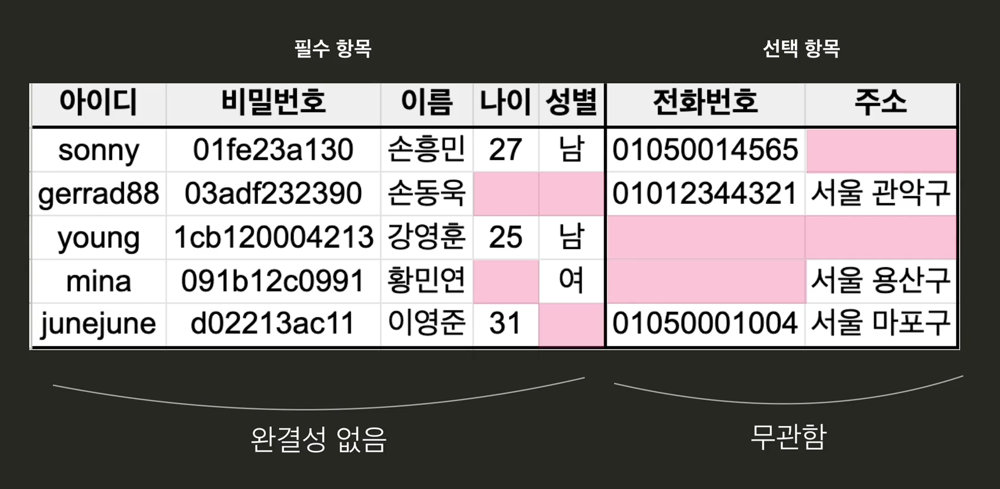
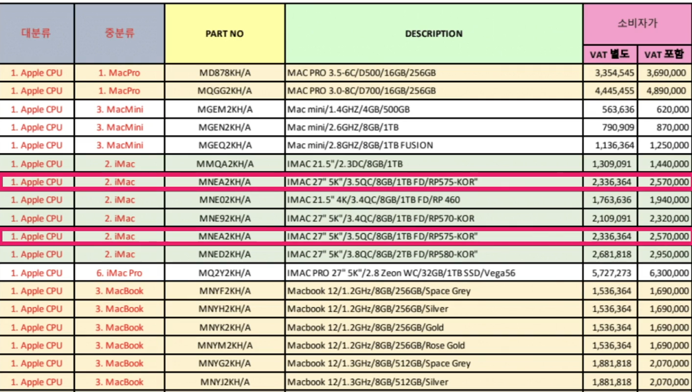
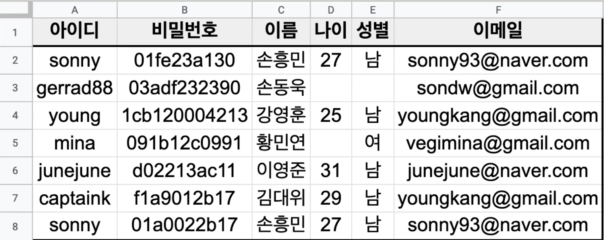
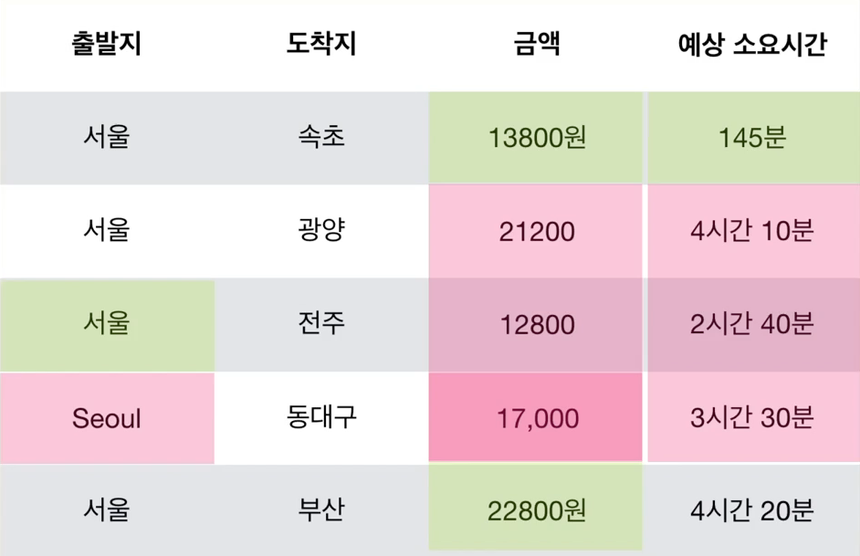
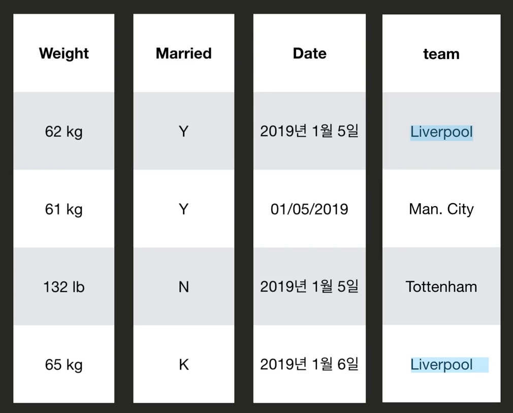
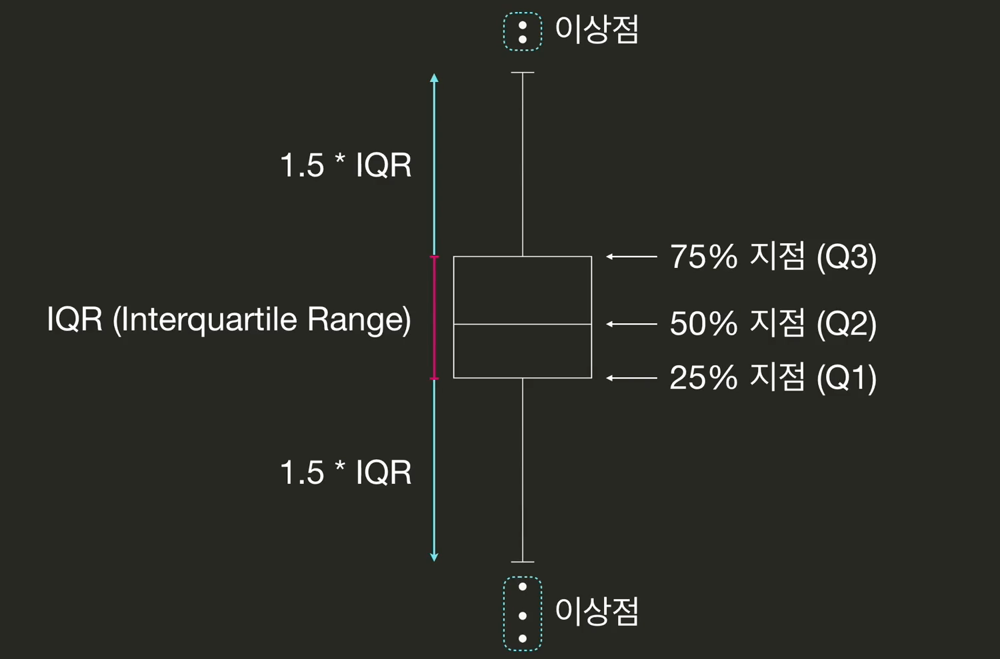
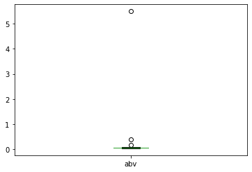
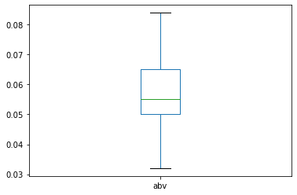
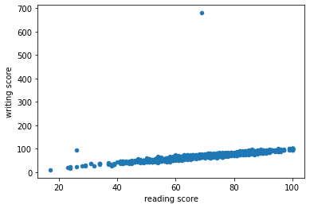
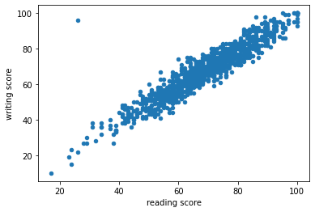

# Data Quality & Data Cleaning

- 일단 좋은 데이터가 가장 중요함. 대부분의 데이터는 그렇게 마음에 들지 않음. 
- Garbage In, Garbage Out


### 좋은 데이터란 무엇인가?

#### 좋은 데이터의 기준

1. **완결성 Completeness**

   *필수적인 데이터는 모두 기록되어 있어야 함.* 

   예를 들어, 어떤 사이트에 회원가입을 하는데 필수항목과 선택항목이 있음. 

   

   필수항목이 비어 있으면, 완결성이 없는 것. 선택항목은 비어있어도 괜찮음. 

   

   보통 회원가입 할때, 필수항목이 비어 있으면, 뒤로 넘어가지를 않음. 데이터의 완결성을 위해 검사를 하는 것. 

   그럼 우리 데이가 완결성이 있는지 어떻게 확인할 수 있을까?

   **결측값(채워져야 하는데 비어 있는 값)**이 있는지 확인하여야 함. 

   Pandas DataFrame에서 결측값은 NaN(Not A Number)으로 확인할 수 있음. 


2. **유일성 Uniqueness**

   동일한 데이터가 불필요하게 중복되어 있으면 안됨. 

   예를 들어

   애플 제품들의 가격표가 있는데, 여기에 동일한 제품들이 2번 나오면? 이 데이터는 유일성이 없는 것. 

   

   그런데 유일성이 없응면 왜 문제가 생길까? 어떤 제품 가격 수정해야 하는데, 하나만 수정하고 실수로 하나 까먹으면? 그럼 수정 안된 데이터는 틀린 데이터가 되는 것. 

   또한 어떤 곳에 5년 전에 회원가입을 하고, 다시 회원가입을 sonny로 하면? 로그인 처리 어떻게 될꺼야? 이멩일, 주민등록번호, 휴대폰 번호 등이 중복되어 있으면 문제가 발생할 수 밖에 없음. 

   


3. **통일성 Conformity** 

   데이터가 동일한 형식(데이터타입, 단위, 포맷)으로 저장되어 있어야 함. 

   하단의 데이터를 보면, 출발지는 영어와 한글, 금액은 원과 쉼표, 예상 소요시간은 분과 시간 등 통일성이 어긋남. 

   

   그 외에도 무게의 단위, 뜬금없는 글자(K), 날짜 형식, 띄어쓰기 등 굉장히 많은 방식으로 통일성을 어길 수 있음. 

   


4. **정확성 Accuracy**

   데이터가 정확해야 한다는 것. 주로 데이터를 모으는 과정에서 문제 발생함. 예를 들어, 키를 측정하는데 한 그룹은 신발을 신고 측정, 다른 그룹은 신발을 벗고 측정 이런 방식으로 문제가 발생함. 

   이상점(Outlier) 등을 보면 확인해볼 필요가 있음. 


#### Coding

**결측값 찾아내기** 하단과 같은 표가 있음. NaN이 조금 보임

|      |  야구 |  축구 |    배구 | 남자농구 | 여자농구 |
| ---: | ----: | ----: | ------: | -------: | -------: |
| 연도 |       |       |         |          |          |
| 2008 | 10881 | 11642 |  1253.0 |     4208 |     1329 |
| 2009 | 11562 | 10983 |  1471.0 |     4152 |     1206 |
| 2010 | 11402 | 12873 | **NaN** |     3870 |      705 |
| 2011 | 13055 | 10709 |  1774.0 |     3955 |     1445 |
| 2012 | 13747 |  7157 | **NaN** |     4537 |     1150 |
| 2013 | 11373 |  7656 | **NaN** |     4092 |     1237 |
| 2014 | 11429 |  8115 |  1967.0 |     4458 |     1417 |
| 2015 | 10357 |  7720 |  2311.0 |     3953 |     1480 |
| 2016 | 11583 |  7854 |  2336.0 |     3543 |     1425 |
| 2017 | 11668 |  6502 |  2425.0 |     3188 |     1097 |

```python
df.isnull() # 결측값에 대해 True로 리턴해줌. 
```

|      |  야구 |  축구 |     배구 | 남자농구 | 여자농구 |
| ---: | ----: | ----: | -------: | -------: | -------: |
| 연도 |       |       |          |          |          |
| 2008 | False | False |    False |    False |    False |
| 2009 | False | False |    False |    False |    False |
| 2010 | False | False | **True** |    False |    False |
| 2011 | False | False |    False |    False |    False |
| 2012 | False | False | **True** |    False |    False |
| 2013 | False | False | **True** |    False |    False |
| 2014 | False | False |    False |    False |    False |
| 2015 | False | False |    False |    False |    False |
| 2016 | False | False |    False |    False |    False |
| 2017 | False | False |    False |    False |    False |

```python
df.isnull().sum() 
```

```
야구      0
축구      0
배구      3
남자농구    0
여자농구    0
dtype: int64
```

결측값이 있을 때, 가장 좋은 방법은 결측값을 제대로된 데이터로 채워 넣는 것. 다시 조사를 하든, 찾든. 

그게 불가능하다면? 

1. *그대로 두기* -> 어떨 때는 결측값의 존재 자체가 나름대로 의미가 있을 수도 있음. 
2. *결측값이 있는 레코드를 아예 지워버리기.* 

```python
df.dropna() # 새로운 데이터프레임
df.dropna(inplace = True) # 기존 df에서 결측값들 레코드 삭제됨. 
```

3. 지금 보면, 배구에만 유난히 결측값이 많음. **배구** 자체를 포기할수도 있음. 

```python
df.dropna(axis='columns') # 결측값이 있는 컬럼이 지워짐	
df.dropna(axis='rows') # 결측값이 있는 row가 지워짐	
```

4. 결측값을 뭔가 다른 데이터로 채워주기. 

   ```python
   df.fillna(0) # 0으로 대체
   ```

   근데 어떤 값으로 대체해야할지가 애매하잖아. 

   가장 많이 하는 것은 해당 컬럼의 **평균값/중간값**으로 대체하는 것. 

   ```python
   df.mean()
   ```

   ```
   야구      11705.700000
   축구       9121.100000
   배구       1933.857143
   남자농구     3995.600000
   여자농구     1249.100000
   dtype: float64
   ```

   ```python
   df.fillna(df.mean()) # 결측값이 해당 컬럼의 평균값으로 대체됨. 
   df.fillna(df.mean(), inplace=True)
   ```

   ```python
   df.fillna(df.median(), inplace=True) # 결측값이 해당 컬럼의 중간값으로 대체됨. 
   ```

   


**중복값 찾아내기** 

- row와 column이 중복될 수 있음. 

- row 중복되는 경우(index가 중복됨). 근데 육안으로 보고 어떻게 찾냐. 

  | 08월 02일 | 40   | 26   | 20   | 41   | 26   | 19   | 20   | 39   | 25   | 24   | 33   | 29   | 22   | 24   | 22   | 27   | 32   | 25   |
  | --------: | ---- | ---- | ---- | ---- | ---- | ---- | ---- | ---- | ---- | ---- | ---- | ---- | ---- | ---- | ---- | ---- | ---- | ---- |
  | 08월 01일 | 33   | 26   | 22   | 40   | 24   | 18   | 26   | 35   | 20   | 26   | 36   | 30   | 23   | 28   | 21   | 25   | 30   | 20   |
  | 07월 31일 | 18   | 26   | 17   | 23   | 23   | 17   | 23   | 21   | 19   | 20   | 21   | 21   | 22   | 19   | 22   | 25   | 28   | 19   |
  | 07월 31일 | 18   | 26   | 17   | 23   | 23   | 17   | 23   | 21   | 19   | 20   | 21   | 21   | 22   | 19   | 22   | 25   | 28   | 19   |
  | 07월 30일 | 10   | 28   | 14   | 15   | 18   | 14   | 24   | 14   | 17   | 15   | 15   | 15   | 18   | 15   | 20   | 22   | 29   | 17   |

  `df.index.value_counts()` value_counts로 찾으면 됨. 

  ```
  07월 31일    2
  07월 21일    1
  07월 18일    1
  08월 09일    1
  07월 29일    1
  ```

  `df.loc['07월 31일']` 실제로 이렇게 써보면 두줄 나옴. 

  사실 이런 과정도 필요 없고

  ```python
  df.drop_duplicates() # 이거만 하면 알아서 지워줌. 
  df.drop_duplicates(inplace= True)
  ```

- Columns이 중복되는 경우. 하나는 **강원**, 하나는 **강원.1**로 나옴. 

  ```python
  df.columns.value_counts() 
  ```

  `df.T` 를 해서, row와 Columns을 바꾼 상태에서, drop_duplicates() 해보기. **drop_duplicates()는 이름은 다른데 안에 내용이 같아서 같은걸로 인식하고 판다스가 없앤 것**. 

  ```python
  df.T.drop_duplicates() # 이렇게 하니깐, 하나가 사라짐. 강원.1이 없어졌음. 
  ```

  ```python
  df = df.T.drop_duplicates().T # 그 다음 이렇게 다시 row/column 바꾸고 df에 저장하면 됨. 
  ```


#### 이상점(Outlier) 찾아내기

- 이상점이란 다른 값들과 너무 동떨어져 있는 데이터. 

- 이상점을 판단하는 기준은? 절대적인 방법은 없고 다양한 방법이 있음. 

  박스플롯에 보면, 75/50/25% 지점이 모두 나와 있음. 이 중에 75%지점과 25%지점의 차이를 IQR이라고 부름(**Interquartile Range**). 25% 지점에서 1.5xQR이상 밑으로 떨어진 바깥이면 이상점. 75%지점에서 1.5xIQR이상 위로 넘어가면 그것도 이상점이라고 봄. 절대적인 기준은 없으나, 판다스 박스플롯에서 이렇게 기준을 정한 것. 

  

  **이상점은 어떻게 해야 할까?**

  이상점이 잘못된 데이터라면 정보를 고쳐주거나 아예 없애야지. 

  그러나, 제대로된 정보라면? 분석에 방해가 된다면 없애버리는게 나을 수도 있고, 어떨 때는 이 자체가 의미있는 정보일 수도 있음. 이런 것은 상황에 맞게 판단해야 하는 부분. 

**For example**

**수제 맥주 데이터 이상점 제거하기**

|  abv |   ibu |   id | name |               style |              brewery_id | ounces |      |
| ---: | ----: | ---: | ---: | ------------------: | ----------------------: | -----: | ---- |
|    0 | 0.050 |  NaN | 1436 |            Pub Beer |     American Pale Lager |    408 | 12.0 |
|    1 | 0.066 |  NaN | 2265 |         Devil's Cup | American Pale Ale (APA) |    177 | 12.0 |
|    2 | 0.071 |  NaN | 2264 | Rise of the Phoenix |            American IPA |    177 | 12.0 |
|    3 | 0.075 |  NaN | 2262 |       Sex and Candy |            American IPA |    177 | 12.0 |
|    4 | 0.077 |  NaN | 2261 |        Black Exodus |           Oatmeal Stout |    177 | 12.0 |
|  ... |   ... |  ... |  ... |                 ... |                     ... |    ... | ...  |

```python
df.plot(kind='box', y='abv') 
```



누가 봐도 딱 이상점 알아보게 점 찍혀있음. 근데 이걸 어떻게 지워야 되지?

일단 25, 75% 지점을 봐야지 

```python
df['abv'].describe()
```

```python
count    2190.000000
mean        0.060186
std         0.117010
min         0.032000
25%         0.050000
50%         0.055000
75%         0.065000
max         5.500000
Name: abv, dtype: float64
```

혹은, 하단처럼 하면 해당 부분을 구해 올 수 있음. 

```python
df['abv'].quantile(0.25)
df['abv'].quantile(0.75)
```

```python
q1 = df['abv'].quantile(0.25)
q3 = df['abv'].quantile(0.75)
iqr = q3 - q1
(df['abv'] < q1 - 1.5*iqr) | (df['abv'] > q3 + 1.5*iqr)
# 이 조건을 충족하면 이상점이라고 판단할 수 있겠지. Boolean Return, True가 이상점. 
```

```python
condition = (df['abv'] < q1 - 1.5*iqr) | (df['abv'] > q3 + 1.5*iqr)
df[condition]
```

|      |   abv |  ibu |   id |                name |                   style | brewery_id | ounces |
| ---: | ----: | ---: | ---: | ------------------: | ----------------------: | ---------: | :----: |
|  963 | 0.172 |  NaN | 3691 |      Chamisul Fresh |                    Soju |        993 | 12.17  |
| 1856 | 0.400 |  NaN | 3012 |          Grey Goose |                   Vodka |        893 | 25.26  |
| 2250 | 5.500 | 40.0 |  145 | Silverback Pale Ale | American Pale Ale (APA) |        424 | 12.00  |

이 데이터를 보니깐, 마지막은 도수가 5.5가 아니라 0.055일 것 같아. 

```python
df.loc[2250, 'abv'] = 0.055
```

나머지 두개는 그냥 데이터 자체가 잘못된것 같음. 지워야 할듯. 

```python
df[condition].index
df.drop(df[condition].index, inplace=True) # index에 있는, 값 두개가 지워짐. 
```

> 참고
> 두 메소드는 다음과 같은 차이가 있어요!!
>
> - `df.drop()` : 지정된 행이나 열을 삭제하는 메소드 ([공식문서](https://pandas.pydata.org/pandas-docs/stable/reference/api/pandas.DataFrame.drop.html))
> - `df.dropna()` : 결측치 발생 시 지정된 행이나 열을 삭제하는 메소드 ([공식문서](https://pandas.pydata.org/pandas-docs/stable/reference/api/pandas.DataFrame.dropna.html))
>
> 이 때는 단순히 지정한 행인 `remove`를 지우기 위함이라 `df.drop`을 사용하는 것이 맞습니다ㅎㅎ


이제 박스플롯 다시 그려보면 매우 깔끔하게 나옴. 




**관계적 이상점(Relational Outlier)**

- 키 188인데 몸무게가 42면? 약간 이상하지. 두 변수의 관계를 생각해 봤을때 이상한 데이터들이 있음. 
- 학생들 시험 점수가 있는데, 읽기와 쓰기 점수의 연관성 살펴보고 싶음. 

| gender | race/ethnicity | parental level of education |              lunch | test preparation course | math score | reading score | writing score |      |
| -----: | -------------: | --------------------------: | -----------------: | ----------------------: | ---------: | ------------: | ------------: | ---- |
|      0 |         female |                     group B |  bachelor's degree |                standard |       none |            72 |            72 | 74   |
|      1 |         female |                     group C |       some college |                standard |  completed |            69 |            90 | 88   |
|      2 |         female |                     group B |    master's degree |                standard |       none |            90 |            95 | 93   |
|      3 |           male |                     group A | associate's degree |            free/reduced |       none |            47 |            57 | 44   |
|      4 |           male |                     group C |       some college |                standard |       none |            76 |            78 | 75   |
|    ... |            ... |                         ... |                ... |                     ... |        ... |           ... |           ... | ...  |

```python
df.corr()
```

|               | math score | reading score | writing score |
| ------------: | ---------: | ------------: | ------------: |
|    math score |   1.000000 |      0.810412 |      0.513623 |
| reading score |   0.810412 |      1.000000 |      0.582378 |
| writing score |   0.513623 |      0.582378 |      1.000000 |

```python
df.plot.scatter(x='reading score', y='writing score')
```



유난히 떨어져 보이는 점이 있음. 누가 봐도 이상점. 거기다가 100점만점인데 무슨 700점이야. 누가봐도 잘못된 정보임. 지금 이런 정보 때문에 correlation값 까지 영향을 받는 것. 

저 이상점만 일단 삭제해보자. 

```python
df['writing score'] > 100
df[df['writing score'] > 100]
```

|      | gender | race/ethnicity | parental level of education |        lunch | test preparation course | math score | reading score | writing score |
| ---: | -----: | -------------: | --------------------------: | -----------: | ----------------------: | ---------: | ------------: | ------------: |
|   51 |   male |        group E |          associate's degree | free/reduced |               completed |         77 |            69 |           680 |

```python
df.drop(df[df['writing score'] > 100].index, inplace=True)
df.plot.scatter(x='reading score', y='writing score')
df.corr()
```



|               | math score | reading score | writing score |
| ------------: | ---------: | ------------: | ------------: |
|    math score |   1.000000 |      0.810627 |      0.802853 |
| reading score |   0.810627 |      1.000000 |      0.943248 |
| writing score |   0.802853 |  **0.943248** |      1.000000 |

그래프나 상관계수가 차이가 엄청 많이 남. **근데 아직도 똑 떨어진 점 하나가 있음.**

이 점을 한번 찾아보면, 쓰기는 90보다 높고, 읽기는 40보다 낮음. 

```python
df[(df['writing score'] > 90) & (df['reading score'] < 40) ]
```

|      | gender | race/ethnicity | parental level of education |    lunch | test preparation course | math score | reading score | writing score |
| ---: | -----: | -------------: | --------------------------: | -------: | ----------------------: | ---------: | ------------: | ------------: |
|  373 | female |        group D |                some college | standard |               completed |         82 |            26 |            96 |

이 학생의 성적을 보자면? 뭔가 사정이 있었던 것 같아. 근데 좀 애매한게 이게 진짜일수도 있긴 한데, 그래도 여기선 지워보자. 

```python
df.drop(df[(df['writing score'] > 90) & (df['reading score'] < 40) ].index, inplace=True)
df.plot.scatter(x='reading score', y='writing score')
df.corr()
```


|               | math score | reading score | writing score |
| ------------: | ---------: | ------------: | ------------: |
|    math score |   1.000000 |      0.817735 |      0.802722 |
| reading score |   0.817735 |      1.000000 |      0.954440 |
| writing score |   0.802722 |      0.954440 |      1.000000 |