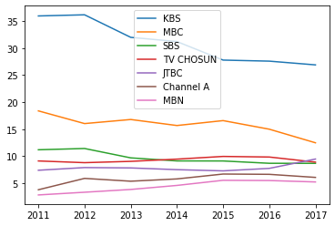
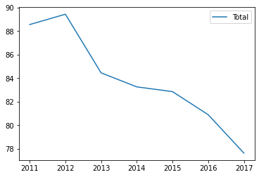
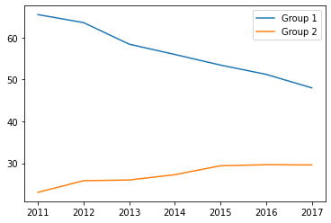
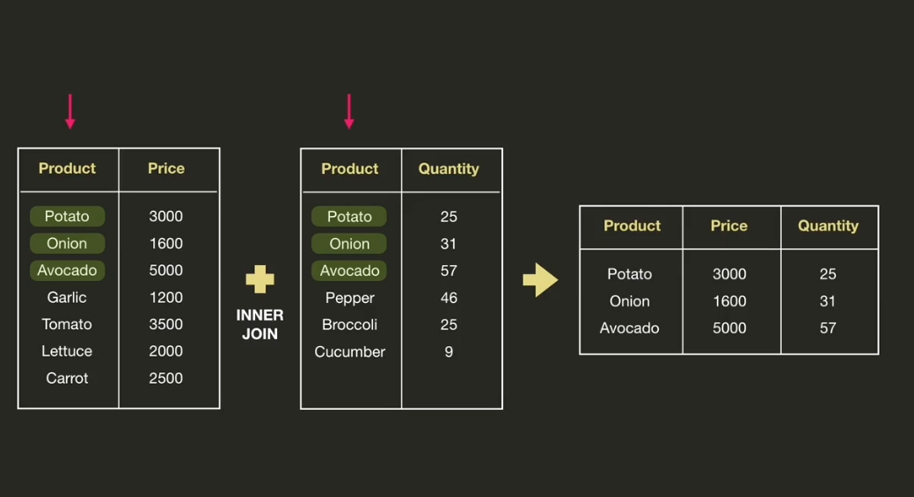
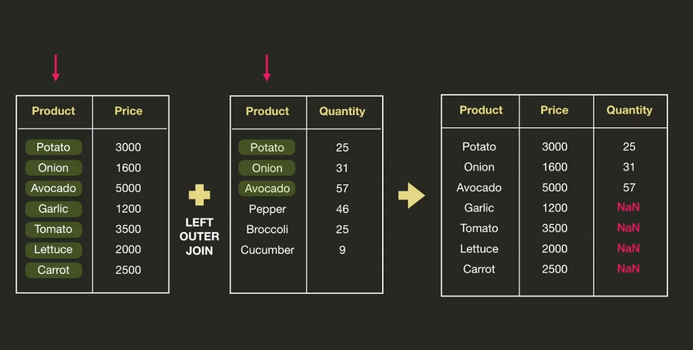
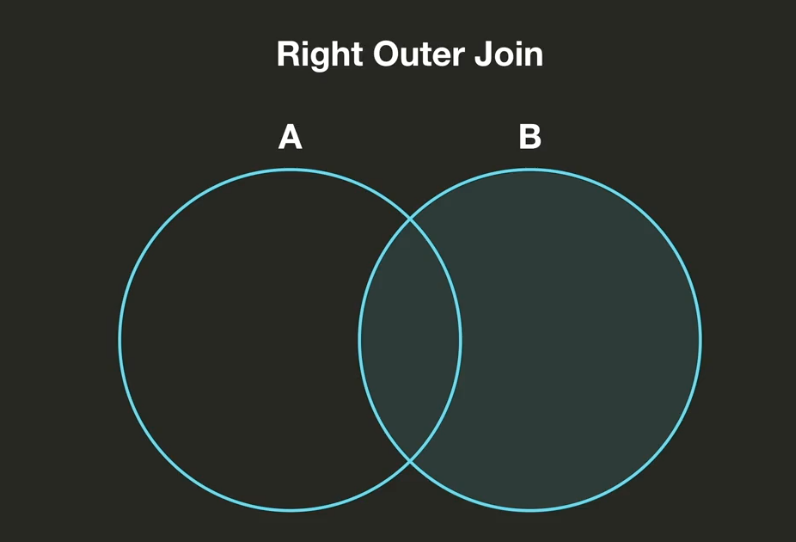
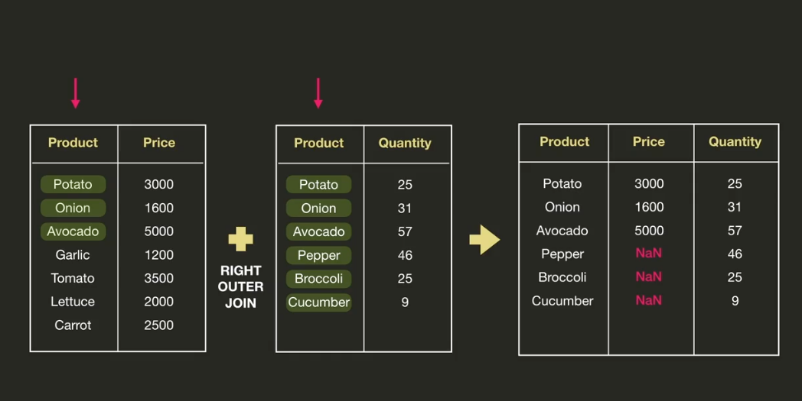
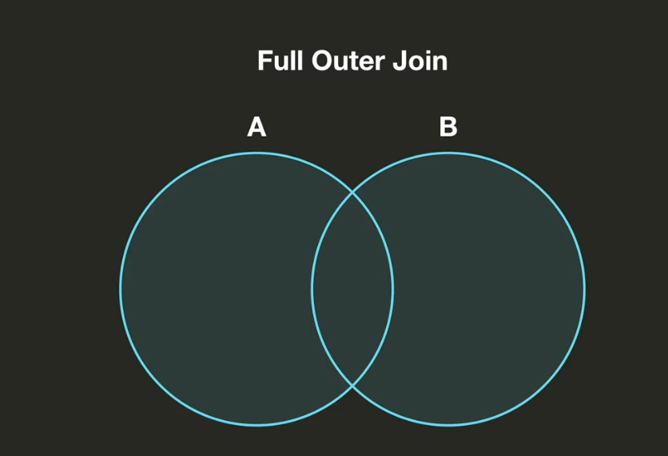
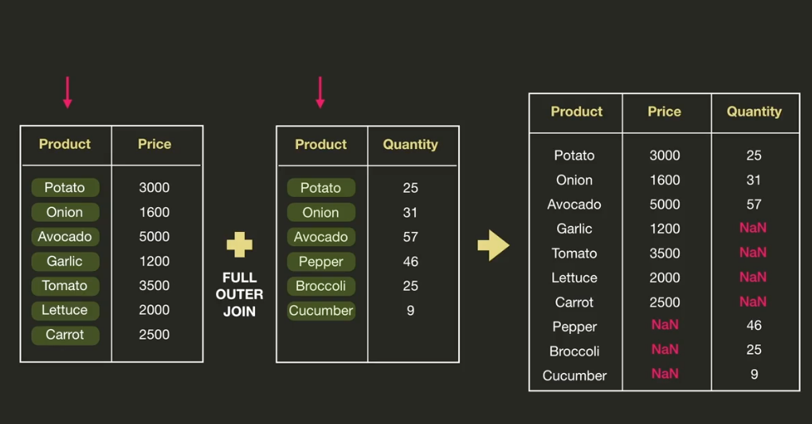

# Finding New Insights

- 기존 데이터만으로 분석을 하는 것이 아닌, 새로운 열들을 추가하며 인사이트를 얻을 수 있음. 
- 기존 데이터

|      |    KBS |    MBC |    SBS | TV CHOSUN |  JTBC | Channel A |   MBN |
| ---: | -----: | -----: | -----: | --------: | ----: | --------: | ----: |
| 2011 | 35.951 | 18.374 | 11.173 |     9.102 | 7.380 |     3.771 | 2.809 |
| 2012 | 36.163 | 16.022 | 11.408 |     8.785 | 7.878 |     5.874 | 3.310 |
| 2013 | 31.989 | 16.778 |  9.673 |     9.026 | 7.810 |     5.350 | 3.825 |
| 2014 | 31.210 | 15.663 |  9.108 |     9.440 | 7.490 |     5.776 | 4.572 |
| 2015 | 27.777 | 16.573 |  9.099 |     9.940 | 7.267 |     6.678 | 5.520 |
| 2016 | 27.583 | 14.982 |  8.669 |     9.829 | 7.727 |     6.624 | 5.477 |
| 2017 | 26.890 | 12.465 |  8.661 |     8.886 | 9.453 |     6.056 | 5.215 |

- `df.plot()` 현재 그래프. 방송사들의 시청률 추이. 

  

- `df['KBS']+df['MBC']+df['SBS']+df['TV CHOSUN']+df['JTBC']+df['Channel A']+df['MBN']`

  각 해의 메이저 방송사들의 총 시청률의 합. 

  더 간단하게 하려면, `df['Total'] = df.sum(axis='columns')`

  |      |    KBS |    MBC |    SBS | TV CHOSUN |  JTBC | Channel A |   MBN |  Total |
  | ---: | -----: | -----: | -----: | --------: | ----: | --------: | ----: | -----: |
  | 2011 | 35.951 | 18.374 | 11.173 |     9.102 | 7.380 |     3.771 | 2.809 | 88.560 |
  | 2012 | 36.163 | 16.022 | 11.408 |     8.785 | 7.878 |     5.874 | 3.310 | 89.440 |
  | 2013 | 31.989 | 16.778 |  9.673 |     9.026 | 7.810 |     5.350 | 3.825 | 84.451 |
  | 2014 | 31.210 | 15.663 |  9.108 |     9.440 | 7.490 |     5.776 | 4.572 | 83.259 |
  | 2015 | 27.777 | 16.573 |  9.099 |     9.940 | 7.267 |     6.678 | 5.520 | 82.854 |
  | 2016 | 27.583 | 14.982 |  8.669 |     9.829 | 7.727 |     6.624 | 5.477 | 80.891 |
  | 2017 | 26.890 | 12.465 |  8.661 |     8.886 | 9.453 |     6.056 | 5.215 | 77.626 |

  `df.plot(y='Total')`이제 이 y로 그래프를 그려보면, 총 시청률이 계속 떨어지고 있다는 것을 알 수 있음. 

  

  

- 다음은 지상파와 종편의 시청률 비교

  ```python
  # df['KBS']+df['MBC']+df['SBS']
  df['Group 1']=df.loc[:, 'KBS':'SBS'].sum(axis='columns')
  df['Group 2']=df.loc[:, 'TV CHOSUN':'MBN'].sum(axis='columns')
  df
  ```

  |      |    KBS |    MBC |    SBS | TV CHOSUN |  JTBC | Channel A |   MBN |  Total | Group 1 | Group 2 |
  | ---: | -----: | -----: | -----: | --------: | ----: | --------: | ----: | -----: | ------: | ------: |
  | 2011 | 35.951 | 18.374 | 11.173 |     9.102 | 7.380 |     3.771 | 2.809 | 88.560 |  65.498 |  23.062 |
  | 2012 | 36.163 | 16.022 | 11.408 |     8.785 | 7.878 |     5.874 | 3.310 | 89.440 |  63.593 |  25.847 |
  | 2013 | 31.989 | 16.778 |  9.673 |     9.026 | 7.810 |     5.350 | 3.825 | 84.451 |  58.440 |  26.011 |
  | 2014 | 31.210 | 15.663 |  9.108 |     9.440 | 7.490 |     5.776 | 4.572 | 83.259 |  55.981 |  27.278 |
  | 2015 | 27.777 | 16.573 |  9.099 |     9.940 | 7.267 |     6.678 | 5.520 | 82.854 |  53.449 |  29.405 |
  | 2016 | 27.583 | 14.982 |  8.669 |     9.829 | 7.727 |     6.624 | 5.477 | 80.891 |  51.234 |  29.657 |
  | 2017 | 26.890 | 12.465 |  8.661 |     8.886 | 9.453 |     6.056 | 5.215 | 77.626 |  48.016 |  29.610 |

  ```python
  df.plot(y=['Group 1', 'Group 2'])
  ```

  


### 문자열 필터링 하기

특정 잡지에서 선정한 500대 명반

```python
df = pd.read_csv('resources/albums.csv', encoding='latin1')
df
```

|      | Number | Year |                                 Album |         Artist |     Genre |                      Subgenre |
| ---: | -----: | ---: | ------------------------------------: | -------------: | --------: | ----------------------------: |
|    0 |      1 | 1967 | Sgt. Pepper's Lonely Hearts Club Band |    The Beatles |      Rock | Rock & Roll, Psychedelic Rock |
|    1 |      2 | 1966 |                            Pet Sounds | The Beach Boys |      Rock |    Pop Rock, Psychedelic Rock |
|    2 |      3 | 1966 |                              Revolver |    The Beatles |      Rock |    Psychedelic Rock, Pop Rock |
|    3 |      4 | 1965 |                  Highway 61 Revisited |      Bob Dylan |      Rock |         Folk Rock, Blues Rock |
|    4 |      5 | 1965 |                           Rubber Soul |    The Beatles | Rock, Pop |                      Pop Rock |
|  ... |    ... |  ... |                                   ... |            ... |       ... |                           ... |

- `df['Genre'].unique()` 장르들 중에서, Blues관련된 장르들만 쭉 뽑아내려면?

```python
df[df['Genre']=='Blues']
```

위처럼 하면, 딱 장르가 정확히  *Blues*인 애들만 나옴.  

```python
df['Contains Blues']=df['Genre'].str.contains('Blues')
```

위처럼 하면, 장르에 Blues가 포함되어 있는 애들이 모두 나옴. 

| Number | Year | Album |                                Artist |          Genre |  Subgenre |                Contains Blues |       |
| -----: | ---: | ----: | ------------------------------------: | -------------: | --------: | ----------------------------: | ----- |
|      0 |    1 |  1967 | Sgt. Pepper's Lonely Hearts Club Band |    The Beatles |      Rock | Rock & Roll, Psychedelic Rock | False |
|      1 |    2 |  1966 |                            Pet Sounds | The Beach Boys |      Rock |    Pop Rock, Psychedelic Rock | False |
|      2 |    3 |  1966 |                              Revolver |    The Beatles |      Rock |    Psychedelic Rock, Pop Rock | False |
|      3 |    4 |  1965 |                  Highway 61 Revisited |      Bob Dylan |      Rock |         Folk Rock, Blues Rock | False |
|      4 |    5 |  1965 |                           Rubber Soul |    The Beatles | Rock, Pop |                      Pop Rock | False |
|    ... |  ... |   ... |                                   ... |            ... |       ... |                           ... | ...   |

근데 보다 보면, *Blues*가 앞에 있는 애들도 있고, *Blues*가 뒤에 있는 애들도 있음. *Blues*가 앞에 있는 애들만 필터링 하려면?  

**`df[df['Genre'].str.startswith('Blues')]`**

#### 


#### 문자열 분리

- 전국 공원 데이터에서 관할구역을 컬럼을 만들고 싶다면? **'광주광역시'**이 부분만 따로 떼와야함. 

|      |    관리번호 |           공원명 | 공원구분 |               소재지도로명주소 |     전화번호 |
| ---: | ----------: | ---------------: | -------: | -----------------------------: | -----------: |
|    0 | 29170-00001 |     문화근린공원 | 근린공원 |      광주광역시 북구 대천로 86 | 062-410-6438 |
|    1 | 29170-00002 |  두암제1근린공원 | 근린공원 |      광주광역시 북구 삼정로 36 | 062-410-6438 |
|    2 | 29170-00003 | 첨단체육근린공원 | 근린공원 | 광주광역시 북구 임방울대로 877 | 062-410-6438 |
|    3 | 29170-00004 |  일곡제1근린공원 | 근린공원 |      광주광역시 북구 일곡로 55 | 062-410-6438 |
|    4 | 29170-00005 |  일곡제2근린공원 | 근린공원 |     광주광역시 북구 설죽로 526 | 062-410-6438 |

```python
df['소재지도로명주소'].str.split()
```

상단처럼 하면, 띄어쓰기로 싹다 나눠서 각 행별 리스트로 리턴함. 

```python
df['소재지도로명주소'].str.split(n=1)
```

 위처럼 n=1 파라미터를 넣어 주면, 첫번째 띄어쓰기와 나머지로 나눠줌. 

> ```
> 0                [광주광역시, 북구 대천로 86]
> 1                [광주광역시, 북구 삼정로 36]
> 2             [광주광역시, 북구 임방울대로 877]
> 3                [광주광역시, 북구 일곡로 55]
> 4               [광주광역시, 북구 설죽로 526]
>                    ...             
> 8117     [충청남도, 홍성군 홍성읍 오관리 472 일원]
> 8118     [경상북도, 영양군 영양읍 군민회관길 42-6]
> 8119    [경상북도, 영양군 입암면 신구리 산27-5번지]
> 8120      [경상북도, 영양군 수비면 발리리 산48번지]
> 8121      [경상북도, 영양군 영양읍 삼지리 200번지]
> Name: 소재지도로명주소, Length: 8122, dtype: object
> ```

```python
df['소재지도로명주소'].str.split(n=1, expand=True)
```

`expand= True`로 넣어놓으면, 아예 새로운 데이터프레임을 리턴하게 됨. 

|      |          0 |                               1 |
| ---: | ---------: | ------------------------------: |
|    0 | 광주광역시 |                  북구 대천로 86 |
|    1 | 광주광역시 |                  북구 삼정로 36 |
|    2 | 광주광역시 |             북구 임방울대로 877 |
|    3 | 광주광역시 |                  북구 일곡로 55 |
|    4 | 광주광역시 |                 북구 설죽로 526 |
|  ... |        ... |                             ... |
| 8117 |   충청남도 |   홍성군 홍성읍 오관리 472 일원 |
| 8118 |   경상북도 |   영양군 영양읍 군민회관길 42-6 |
| 8119 |   경상북도 | 영양군 입암면 신구리 산27-5번지 |
| 8120 |   경상북도 |   영양군 수비면 발리리 산48번지 |
| 8121 |   경상북도 |    영양군 영양읍 삼지리 200번지 |

```python
address = df['소재지도로명주소'].str.split(n=1, expand=True)
df['관할구역'] = address[0]
```

| 관리번호 |      공원명 |         공원구분 | 소재지도로명주소 |                       전화번호 |     관할구역 |            |
| -------: | ----------: | ---------------: | ---------------: | -----------------------------: | -----------: | ---------- |
|        0 | 29170-00001 |     문화근린공원 |         근린공원 |      광주광역시 북구 대천로 86 | 062-410-6438 | 광주광역시 |
|        1 | 29170-00002 |  두암제1근린공원 |         근린공원 |      광주광역시 북구 삼정로 36 | 062-410-6438 | 광주광역시 |
|        2 | 29170-00003 | 첨단체육근린공원 |         근린공원 | 광주광역시 북구 임방울대로 877 | 062-410-6438 | 광주광역시 |
|        3 | 29170-00004 |  일곡제1근린공원 |         근린공원 |      광주광역시 북구 일곡로 55 | 062-410-6438 | 광주광역시 |
|        4 | 29170-00005 |  일곡제2근린공원 |         근린공원 |     광주광역시 북구 설죽로 526 | 062-410-6438 | 광주광역시 |
|      ... |         ... |              ... |              ... |                            ... |          ... | ...        |


참고로 띄어쓰기 가 아닌 다른것을 기준으로 나누려면?

```python
phone_number = df['운영기관전화번호'].str.split(pat='-', n=2, expand=True)
```


#### 카테고리로 분류 

노트북 국가별로 분류해 보고 싶다면?

| brand | model |              ram | hd_type | hd_size | screen_size | price | processor_brand | processor_model | clock_speed | graphic_card_brand | graphic_card_size |   os | weight | comments |      |
| ----: | ----: | ---------------: | ------: | ------: | ----------: | ----: | --------------: | --------------: | ----------: | -----------------: | ----------------: | ---: | -----: | -------: | ---- |
|     0 |  Dell | Inspiron 15-3567 |       4 |     hdd |        1024 |  15.6 |           40000 |           intel |          i5 |                2.5 |             intel |  NaN |  linux |     2.50 | NaN  |
|     1 | Apple |      MacBook Air |       8 |     ssd |         128 |  13.3 |           55499 |           intel |          i5 |                1.8 |             intel |  2.0 |    mac |     1.35 | NaN  |
|     2 | Apple |      MacBook Air |       8 |     ssd |         256 |  13.3 |           71500 |           intel |          i5 |                1.8 |             intel |  2.0 |    mac |     1.35 | NaN  |
|     3 | Apple |      MacBook Pro |       8 |     ssd |         128 |  13.3 |           96890 |           intel |          i5 |                2.3 |             intel |  2.0 |    mac |     3.02 | NaN  |
|     4 | Apple |      MacBook Pro |       8 |     ssd |         256 |  13.3 |          112666 |           intel |          i5 |                2.3 |             intel |  2.0 |    mac |     3.02 | NaN  |
|   ... |   ... |              ... |     ... |     ... |         ... |   ... |             ... |             ... |         ... |                ... |               ... |  ... |    ... |      ... | ...  |
|       |       |                  |         |         |             |

```python
brand_nation = {
    'Dell': 'U.S.',
    'Apple': 'U.S.',
    'Acer': 'Taiwan',
    'HP': 'U.S.',
    'Lenovo': 'China',
    'Alienware': 'U.S.', 
    'Microsoft': 'U.S.',
    'Asus': 'Taiwan'
}

df['brand'].map(brand_nation)
```

엄청 편하네, 그냥 map으로 **dict**를 넘겨주면, 왼쪽에 있는 값들을 오른쪽 값들로 바꿔주는 것. 결과 아래처럼 나옴. 

> ```
> 0        U.S.
> 1        U.S.
> 2        U.S.
> 3        U.S.
> 4        U.S.
>         ...  
> 162    Taiwan
> 163    Taiwan
> 164    Taiwan
> 165    Taiwan
> 166    Taiwan
> Name: brand, Length: 167, dtype: object
> ```

`df['brand_nation'] = df['brand'].map(brand_nation)`

| brand | model |              ram | hd_type | hd_size | screen_size | price | processor_brand | processor_model | clock_speed | graphic_card_brand | graphic_card_size |   os | weight | comments | brand_nation |      |
| ----: | ----: | ---------------: | ------: | ------: | ----------: | ----: | --------------: | --------------: | ----------: | -----------------: | ----------------: | ---: | -----: | -------: | -----------: | ---- |
|     0 |  Dell | Inspiron 15-3567 |       4 |     hdd |        1024 |  15.6 |           40000 |           intel |          i5 |                2.5 |             intel |  NaN |  linux |     2.50 |          NaN | U.S. |
|     1 | Apple |      MacBook Air |       8 |     ssd |         128 |  13.3 |           55499 |           intel |          i5 |                1.8 |             intel |  2.0 |    mac |     1.35 |          NaN | U.S. |
|     2 | Apple |      MacBook Air |       8 |     ssd |         256 |  13.3 |           71500 |           intel |          i5 |                1.8 |             intel |  2.0 |    mac |     1.35 |          NaN | U.S. |
|     3 | Apple |      MacBook Pro |       8 |     ssd |         128 |  13.3 |           96890 |           intel |          i5 |                2.3 |             intel |  2.0 |    mac |     3.02 |          NaN | U.S. |
|     4 | Apple |      MacBook Pro |       8 |     ssd |         256 |  13.3 |          112666 |           intel |          i5 |                2.3 |             intel |  2.0 |    mac |     3.02 |          NaN | U.S. |
|   ... |   ... |              ... |     ... |     ... |         ... |   ... |             ... |             ... |         ... |                ... |               ... |  ... |    ... |      ... |          ... | ...  |


#### Groupby

이제 위 상태에서, **brand_nation**에 따라서, 나라 별로 묶고 싶다면? Groupby라는 타입이 있음. 

```python
nation_groups = df.groupby('brand_nation') # column name
type(nation_groups)	
```

> ```
> pandas.core.groupby.generic.DataFrameGroupBy
> ```

이제부터 그룹별로 쉽게 분석이 가능함. 

```python
nation_groups.count()
```


|              | brand | model |  ram | hd_type | hd_size | screen_size | price | processor_brand | processor_model | clock_speed | graphic_card_brand | graphic_card_size |   os | weight | comments |
| -----------: | ----: | ----: | ---: | ------: | ------: | ----------: | ----: | --------------: | --------------: | ----------: | -----------------: | ----------------: | ---: | -----: | -------: |
| brand_nation |       |       |      |         |         |             |       |                 |                 |             |                    |                   |      |        |          |
|        China |    18 |    18 |   18 |      18 |      18 |          18 |    18 |              18 |              18 |          18 |                 18 |                17 |   18 |     18 |       18 |
|       Taiwan |    44 |    44 |   44 |      44 |      44 |          44 |    44 |              44 |              44 |          44 |                 43 |                14 |   44 |     42 |        9 |
|         U.S. |   105 |   105 |  105 |     105 |     105 |         105 |   105 |             105 |             105 |         104 |                102 |                50 |  105 |    100 |       28 |

```python
nation_groups.max()
nation_groups.min()
nation_groups.mean() # 각 국가별 평균
nation_groups.first() # 각 국가별 첫번째 값을 보여줌. 
nation_groups.last() # 각 국가별 가장 마지막 값
```


각 그룹 별로 그래프를 그릴 수 있음. 

`nation_groups.plot(kind='box', y='price')`

`nation_groups.plot(kind='hist', y='price')`


### 멀티인덱스의 슬라이싱 

[멀티인덱싱의 경우 인덱싱과 슬라이싱](https://yganalyst.github.io/data_handling/Pd_14/)


#### 데이터합치기

##### Merge

- 합치는 방법 총 4가지

  1. ***Inner Join*** -> 두 데이터프레임에서 겹치는 부분만 합치겠다는 것. 하단의 그림에서, 두 데이터프레임을 합친다고 하면 어떤 컬럼을 기준으로 합칠 것인지 정하게 됨. 우리는  **Product**를 기준으로 합칠 것. 그럼 이제 Product를 기준으로 겹치는 3가지 Potato, Onion, Avocado에 대해서 합치게 됨. 그래서 하단처럼 나오게 됨. 

     

     

  2. ***Left Outer Join***

     왼쪽 데이터프레임에 존재하는 것들을 기준으로 합치는 것. 즉, 오른쪽 데이터프레임에 없더라도 포함 시키게 됨. 이번에도 **Product**를 기준으로 잡는다고 하면, 왼쪽에 있는 것 기준인데 오른쪽에 있으면 값이 들어가며 합쳐지고 없으면 그냥 Nan값이 나오게 됨. 

     

     

  3. ***Right Outer Join***

     left와 반대. 오른쪽에 있으면, 왼쪽에 없더라도 합치고 나머지는 Nan처리함. 

     

     

  4. ***Full Outer Join***

     이건 양쪽의 모든 것을 합치는 것. 

     

  


​	예시)

```python
price_df = pd.read_csv('resources/vegetable_price.csv')
quantity_df = pd.read_csv('resources/vegetable_quantity.csv')
```

| price_df | Product | Price |
| -------: | ------: | ----: |
|        0 |  Potato |  3000 |
|        1 |   Onion |  1600 |
|        2 | Avocado |  5000 |
|        3 |  Garlic |  1200 |
|        4 |  Tomato |  3500 |
|        5 | Lettuce |  2000 |
|        6 |  Carrot |  2500 |

| quantity_df |  Product | Quantity |
| ----------: | -------: | -------: |
|           0 |   Potato |       25 |
|           1 |    Onion |       31 |
|           2 |  Avocado |       57 |
|           3 |   Pepper |       46 |
|           4 | Broccoli |       25 |
|           5 | Cucumber |        9 |

```python
pd.merge(price_df, quantity_df, on='Product') # 기본으로 아무것도 안쓰면 innerjoin
```

| Product |   Price | Quantity |      |
| ------: | ------: | -------: | ---- |
|       0 |  Potato |     3000 | 25   |
|       1 |   Onion |     1600 | 31   |
|       2 | Avocado |     5000 | 57   |

```python
pd.merge(price_df, quantity_df, on='Product', how='left')
```

|      | Product | Price | Quantity |
| ---: | ------: | ----: | -------: |
|    0 |  Potato |  3000 |     25.0 |
|    1 |   Onion |  1600 |     31.0 |
|    2 | Avocado |  5000 |     57.0 |
|    3 |  Garlic |  1200 |      NaN |
|    4 |  Tomato |  3500 |      NaN |
|    5 | Lettuce |  2000 |      NaN |
|    6 |  Carrot |  2500 |      NaN |

```python
pd.merge(price_df, quantity_df, on='Product', how='right')
```

|      |  Product |  Price | Quantity |
| ---: | -------: | -----: | -------: |
|    0 |   Potato | 3000.0 |       25 |
|    1 |    Onion | 1600.0 |       31 |
|    2 |  Avocado | 5000.0 |       57 |
|    3 |   Pepper |    NaN |       46 |
|    4 | Broccoli |    NaN |       25 |
|    5 | Cucumber |    NaN |        9 |

```python
pd.merge(price_df, quantity_df, on='Product', how='outer')
```

|      |  Product |  Price | Quantity |
| ---: | -------: | -----: | -------: |
|    0 |   Potato | 3000.0 |     25.0 |
|    1 |    Onion | 1600.0 |     31.0 |
|    2 |  Avocado | 5000.0 |     57.0 |
|    3 |   Garlic | 1200.0 |      NaN |
|    4 |   Tomato | 3500.0 |      NaN |
|    5 |  Lettuce | 2000.0 |      NaN |
|    6 |   Carrot | 2500.0 |      NaN |
|    7 |   Pepper |    NaN |     46.0 |
|    8 | Broccoli |    NaN |     25.0 |
|    9 | Cucumber |    NaN |      9.0 |