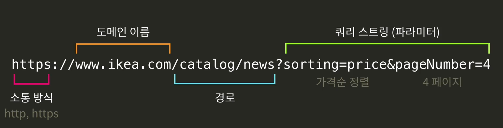

# Making Data

### 데이터를 모으는 방법

1. 기본 데이터 활용

   #### 국내 사이트

   서울열린데이터광장   https://data.seoul.go.kr/

   공공데이터포털   [https://www.data.go.kr](https://www.data.go.kr/)

   e-나라지표   http://www.index.go.kr/

   국가통계포털   [http://kosis.kr](http://kosis.kr/)

   서울특별시 빅데이터 캠퍼스   https://bigdata.seoul.go.kr/

   통계청   http://kostat.go.kr/

   각 사이트를 보면, 여러 분야의 데이터를 다운로드 받을 수 있습니다.   혹은 원하는 데이터를 신청하면 제공해주기도 합니다.

   그 외에도 데이터를 제공하는 여러 해외 사이트들이 있습니다.

   #### 해외 사이트

   구글 데이터 검색   https://toolbox.google.com/datasetsearch

   캐글   https://www.kaggle.com/datasets

   Awesome Public Datasets Github   https://github.com/awesomedata/awesome-public-datasets

   Data and Story Library   https://dasl.datadescription.com/

   데이터허브   https://datahub.io/

   구글 등의 검색 엔진을 활용하면, 더 다양한 데이터를 찾을 수 있습니다.

2. 센서 활용: 센서란 물리적인 현상을 감지해서 전기 신호로 변환해 주는 장치. 사람 들어오면 불이 켜지는 등. 사람이 오면 움직이는 에스컬레이터, 빛 있는 곳에 나오면 화면이 밝아지는 휴대폰 등 모두 센서가 있기 때문에 가능한 것. 이와 같은 센서들. 요즘 아두이노나 라즈베리 파이 등으로 센서 다양하게 활용할 수 있음. 

3. 웹에서 모으기: 가장 빠르게 데이터를 모을 수 있는 방법. 유저를 모을 수 있다면 데이터를 만들어 낼 수 있음. 그게 아니라면 크롤링. 

   - 웹스크랩핑 : 하나의 특정 웹사이트에서 원하는 정보를 얻어 오는 것. 
   - 웹 크롤링 : 컴퓨터가 자동으로 여러 웹페이지를 자동으로 수집하게 하는 것. 

   

    디버깅이라는 이름 가진 곳으로 가라는 것. 

   예 ) [위키피딩아 문서 #사회적거리두기](https://ko.wikipedia.org/wiki/코로나19/범유행/사회적_거리두기)

   **파싱이란?**

   '파싱'이란 문자의 구조를 분석해서 원하는 정보를 얻어내는 걸 말합니다.   복잡한 HTML 코드에서 정보를 뽑아내는 것도 파싱의 일종이죠.

   아래의 HTML 코드에서 '커피', '녹차', '우유'라는 텍스트 데이터를 추출한다고 해 봅시다. 물론 짧은 HTML 코드에서는 눈으로 확인하고 옮겨적을 수 있겠지만, 우리가 원하는 데이터는 훨씬 클테니 수작업을 할 수 없겠죠.

   이럴 때 파싱이 필요합니다.

   