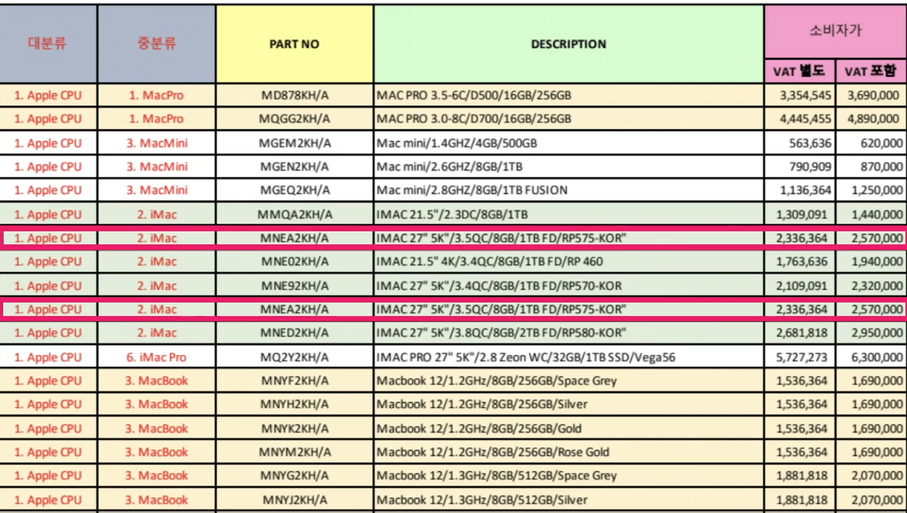
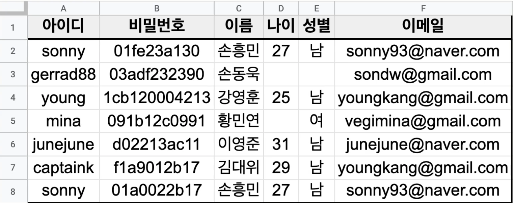
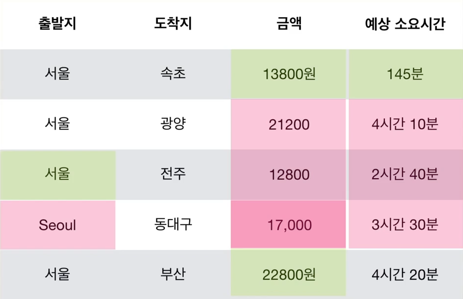
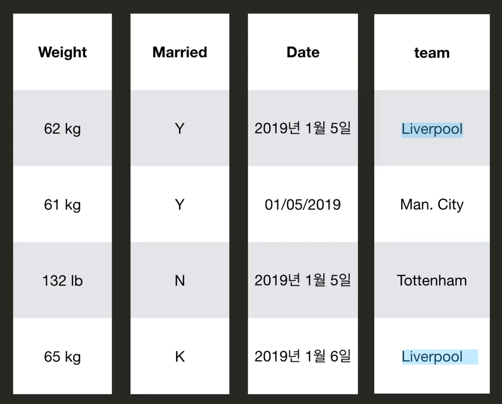

# Data Quality & Data Cleaning

- 일단 좋은 데이터가 가장 중요함. 대부분의 데이터는 그렇게 마음에 들지 않음. 
- Garbage In, Garbage Out

### 좋은 데이터란 무엇인가?

#### 좋은 데이터의 기준

1. **완결성 Completeness**

   *필수적인 데이터는 모두 기록되어 있어야 함.* 

   예를 들어, 어떤 사이트에 회원가입을 하는데 필수항목과 선택항목이 있음. 

   

   필수항목이 비어 있으면, 완결성이 없는 것. 선택항목은 비어있어도 괜찮음. 

   

   보통 회원가입 할때, 필수항목이 비어 있으면, 뒤로 넘어가지를 않음. 데이터의 완결성을 위해 검사를 하는 것. 

   그럼 우리 데이가 완결성이 있는지 어떻게 확인할 수 있을까?

   **결측값(채워져야 하는데 비어 있는 값)**이 있는지 확인하여야 함. 

   Pandas DataFrame에서 결측값은 NaN(Not A Number)으로 확인할 수 있음. 

2. **유일성 Uniqueness**

   동일한 데이터가 불필요하게 중복되어 있으면 안됨. 

   예를 들어

   애플 제품들의 가격표가 있는데, 여기에 동일한 제품들이 2번 나오면? 이 데이터는 유일성이 없는 것. 

   

   그런데 유일성이 없응면 왜 문제가 생길까? 어떤 제품 가격 수정해야 하는데, 하나만 수정하고 실수로 하나 까먹으면? 그럼 수정 안된 데이터는 틀린 데이터가 되는 것. 

   또한 어떤 곳에 5년 전에 회원가입을 하고, 다시 회원가입을 sonny로 하면? 로그인 처리 어떻게 될꺼야? 이멩일, 주민등록번호, 휴대폰 번호 등이 중복되어 있으면 문제가 발생할 수 밖에 없음. 

   

3. **통일성 Conformity** 

   데이터가 동일한 형식(데이터타입, 단위, 포맷)으로 저장되어 있어야 함. 

   하단의 데이터를 보면, 출발지는 영어와 한글, 금액은 원과 쉼표, 예상 소요시간은 분과 시간 등 통일성이 어긋남. 

   

   그 외에도 무게의 단위, 뜬금없는 글자(K), 날짜 형식, 띄어쓰기 등 굉장히 많은 방식으로 통일성을 어길 수 있음. 

   

4. **정확성 Accuracy**

   데이터가 정확해야 한다는 것. 주로 데이터를 모으는 과정에서 문제 발생함. 예를 들어, 키를 측정하는데 한 그룹은 신발을 신고 측정, 다른 그룹은 신발을 벗고 측정 이런 방식으로 문제가 발생함. 

   이상점(Outlier) 등을 보면 확인해볼 필요가 있음. 