# Visualization

#### Matplotlib
```python
f%matplotlib inline
```


#### Line Graph

- 선 그래프. 내부 값들이 숫자일 때 그릴 수 있음. 변화를 보기 위함. 

| methods                                           | roles                                                        |
| ------------------------------------------------- | ------------------------------------------------------------ |
| `df.plot()`                                       | 그냥 판다스 데이터프레임에도 그래프 그리는 기능이 내장되어 있음. parameter로  kind를 넘겨줘야 함. `df.plot(kind='line')` 기본 디폴트값이 line chart. |
| `df.plot(y='KBS)` or `df.plot(y=['KBS', 'JTBC'])` | 특정 하나 혹은 특정 여러개만 그리고 싶을 때.                 |
|                                                   |                                                              |


#### Bar Chart

- 항목들에 대한 수치비교. 

| methods                             | roles                                                   |
| ----------------------------------- | ------------------------------------------------------- |
| `df.plot(kind='bar')`               |                                                         |
| `df.plot(kind='barh')`              | 가로로 눕히기                                           |
| `df.plot(kind='bar', stacked=True)` | 두 종류의 막대가 쌓이게 됨.                             |
| `df['Female'].plot(kind='bar')`     | 특정행을 뽑아서 쓸 수 있음. 시리즈에도 plot함수가 있음. |


#### Pie Graph

- 비율을 보여주기에 적합함

`df.plot(kind='pie')`

- index가 x가 됨. 기준을 잡고 싶으면, set_index를 사용해야 함. 


#### Histogram

- 각각 범위로 묶어서 보게 됨. 묶어서 세는 것. 	

| methods                                     | roles                                                        |
| ------------------------------------------- | ------------------------------------------------------------ |
| `df.plot(kind='hist', y='Height')`          | y데이터를 히스토 그램으로 보고 싶다는 것. 따로 설정 안하면 범위가 전체를 10개로 나누는 범위가 됨. |
| `df.plot(kind='hist', y='Height', bins=15)` | 범위를 15개로 나누고 싶으면, 이렇게 됨.                      |

#### Box Plot

- 시각적으로 통계 정보 보기 위해 사용. 총 5개의 통계값을 보기 위해 사용됨. 

  

  - 가운데 사각형 부분은 Box, 맨 위 아래 짝대기는 Whisker라고 부름. 
  - Box와 Whisker바깥 지점은 이상점(outlier)라고 부름. 이상점을 정하는 기준은 조금씩 다름. 

| methods                                                      | roles                                                        |
| ------------------------------------------------------------ | ------------------------------------------------------------ |
| `df['math score'].describe()`                                | 박스플롯에서 볼 수 있는 모든 정보는, 사실 describe에 다 있음. describe를 시각화 하는 것이 박스 플롯이라고 생각하면 됨. |
| `df.plot(kind='box', y='math score')`                        | 박스 플롯 그리기.                                            |
| `df.plot(kind='box', y=['math score', 'reading score', 'writing score'])` | 여러 박스 플롯 동시에 보기.                                  |


#### Scatter Plot

- 연관성을 보기 위해 사용함. 뿌려진 점들의 모양을 보고 연관성을 찾을 수 있음. 

| methods                                                      | roles |
| ------------------------------------------------------------ | ----- |
| `df.plot(kind='scatter', x='math score', y='reading score')` |       |
|                                                              |       |


## Seaborn

[Seaborn 예시 Docs](http://seaborn.pydata.org/examples/index.html])

- Statistical Data Visualization 

#### 확률밀도 함수

- PDF -> Probability Density Function, 확률 밀도 함수. **히스토그램의 막대 수를 무한대로 늘린 것**. 

- 연속확률변수에 대한 확률분포 - 연속확률분포. 이산확률변수는 **유한한** 값들만을 가질 수 있는, 확률변수. 예를 들어, 동전 두개를 던졌을 때, 앞면이 나온 갯수를 확률변수 X로 본다면, X는 0, 1, 2 세개만 가질 수 있음.  Countable. 확률변수가 연속확변수는 어떤 구간안에 있는 모든 실수값을 가질 수 있는 경우.  예를 들어, 고등학교 남학생들의 키를 확률변수로 든다면? 키는 161.93 뭐 이런게 다 되잖아. 모든 실수값을 이론적으로는 다 가질 수 있음. 예를 들어 전국 중학생 1000명을 골라서 얘네의 키의 범위가 160~190cm라고 가정하면, 이거로 도수분포표를 그리잖아. 구간을 쪼개. 상대도수가 간단히 말하면, 학생이 이 구간안에 들어올 확률이 됨. 

  |         | 도수 | 상대도수           |
  | ------- | ---- | ------------------ |
  | 160~170 | a명  | a/(a+b+c) = a/1000 |
  | 170~180 | b명  | b/(a+b+c) = b/1000 |
  | 180~190 | c명  | c/(a+b+c) = c/1000 |

  이제 여기서 한단계 더 나아감. 우리가 보려는 값은 (**상대도수/계급의 크기**). 현재 계급의 크기 10. 다시 나눠준다면 아래와 같음. 
	|         | 도수 | 상대도수 | 상대도수/계급의 크기 |
  | ------- | ---- | -------- | -------------------- |
  | 160~170 | a명  | a/1000   | a/10000              |
  | 170~180 | b명  | b/1000   | b/10000              |
  | 180~190 | c명  | c/1000   | c/10000              |
  
  이제 그러면 x축은 키 범위 써놓고, y축은 상대도수/계급의 크기 해놓고 히스토그램 그리는거야. 그리고 그 히스토그램의 중간을 이어 보는 것. 근데 이렇게 보니깐, 너무 단순해. 구간을 훨씬 더 자세히 보고 싶다면? 구간을 더 쪼개봐. 계급의 크기를 2로 봐. 그 다음 점을 찍고 그려. 그리고 계속 쪼개봐. 매끈한 곡선을 얻을 때 까지. 
  
  **결국 계급의 크기를 줄여서 0에 가깝게 만들고, 히스토그램 그린거야. 그리고, 막대의 중간점을 쭉 연결한거야**.이 막대의 중간을 이은 곡선이 나타내는게 연속확률분포의 확률밀도함수. 
  
  근데 이걸 놓고 고민해보면, 계속 구간에 대한 얘기를 하고 있음. 예를 들어, 170~170.0001일때의 구간은 있고 거기에 히스토그램 사진을 찍은거지만, 딱 그 점에서 뭐냐? 그거는 몰라. **특정한 값에 대한 얘기를 하고 있지는 않음**. 아무리 막대의 폭이 좁아져서 0으로 수렴해도 0이 되는건 아니야. 여전히 구간에 대한 얘기를 할 수 밖에 없어. 연속확률분포에서는 어떤 특정한 값을 가질 때의 확률을 논하지 않음.  
  
  그럼 구간의 확률은 뭘까? 해당 구간을 적분하면 되지. Why? 막대의 높이는 '**상대도수/계급의 크기**'. 그럼 막대들의 넓이의 합이라는 것은, 
  
  계급의 크기 * 막대의 높이 = ~~계급의 크기~~ * (상대도수/~~계급의 크기~~) = 상대도수 
  
  그럼 이 구간 안에 들어오는 상대도수들의 총 합이 되네. 그럼 확률이지. 
  
  정확히 170일때 확률이 몇이냐? 계속 좁아지는 데, 정확히 170 딱을 구하려면, 막대 밑변이 0이라는거 아냐. 그래서 그런걸 논하지를 않는거야. 


#### Kernel Density Estimation

- 우리가 뭔가 데이터를 모아도 무한개의 데이터는 아님. 우리가 모은 데이터로 곡선을 그리면, 대부분은 굴곡이 많은 곡선. 우리가 모은 데이터로는 무한으로 쪼개더라도 삐죽빼죽 하겠지. 
- Kernel Density Estimation는 우리가 가진 데이터로 어느정도 추측을 해서, 곡선의 그래프를 그려 줌. 

```python
# jupyter notebook에서 그냥 이렇게 치면 됨. 
!pip install seaborn==0.9
```

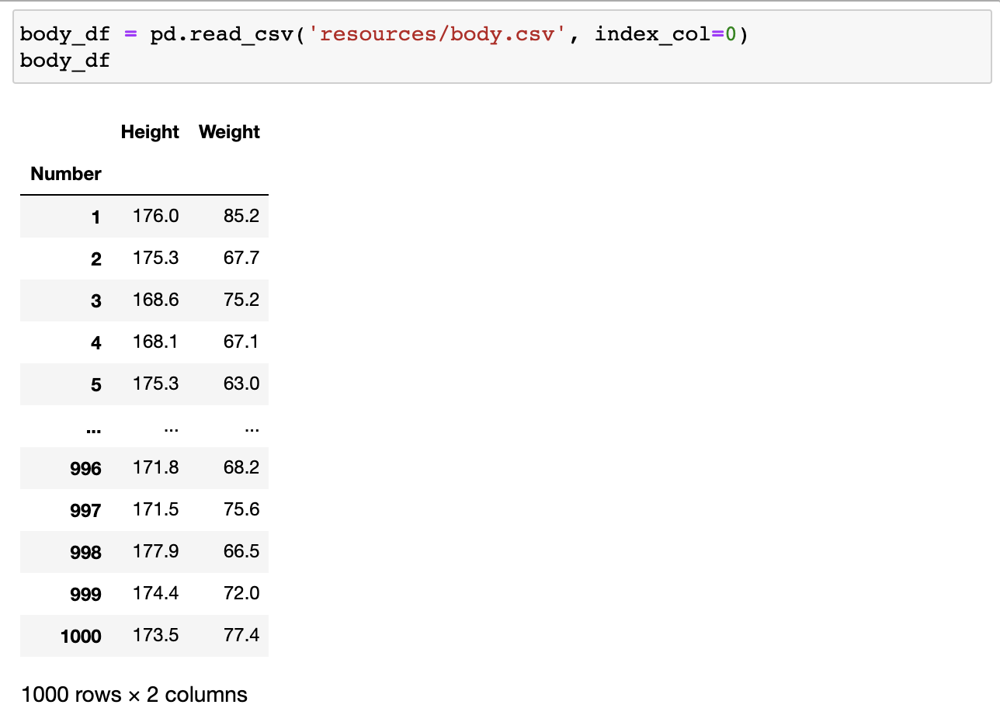

​	

| methods                                                      | roles                                                        |
| ------------------------------------------------------------ | ------------------------------------------------------------ |
| ``body_df['Height'].value_counts().sort_index()``            | 각 키별로 갯수 세본다음에, 작은 값부터 배열.                 |
| `body_df['Height'].value_counts().sort_index().plot()`       | 실제로 그려보기. 그러면 하단처럼 삐죽빼죽하게 됨(*하단 첨부1*). |
| `sns.kdeplot(body_df['Height'])`                             | 그냥 height만 넘겨 주면 이렇게 알아서 됨(*하단 첨부2*). 이게 바로 확률밀도 함수의 그래프. 다만, 당연히 실제 분포랑 달라. |
| `sns.kdeplot(body_df['Height'], bw=0.05)`or `sns.kdeplot(body_df['Height'], bw=0.5)` | 실제 분포랑 다르고 estimation값이잖아. 이제 그 추측을 어느 정도로 해 줄지를 bw파라미터로 결정하게 됨. **커질수록 추축을 많이 하게되고, 더 부드럽게 그려짐**. bw를 굳이 말하자면, 히스토그램을 몇구간으로 나누냐 이런거랑 비슷한 듯. |


##### KDE는 생각보다 굉장히 많은 곳에 사용됨. 

- `body_df.plot(kind='hist', y='Height', bins=15)`

  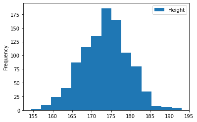

  `sns.distplot(body_df['Height'], bins=15)`히스토그램 위에 그대로, KDE를 얹어서 같이 살펴볼 수 있음. 

  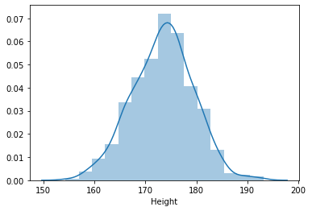

- `body_df.plot(kind='box', y='Height')`

  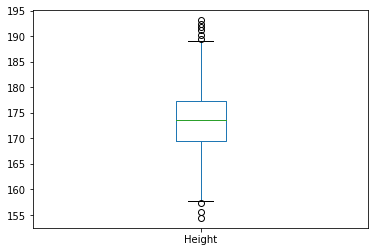

  `sns.violinplot(y=body_df['Height'])`이거를 90도 돌려서 보면, 이 모양이 위에서 봤던,  KDE그래프임. 이걸 예쁘게 만들기 위해서 대칭되게 그린 것. 위 박스플롯이 통계 요약본이라면, violinplot은 통계 전체의 분포를 예쁘게 보여줌. 

  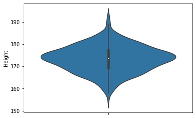

  

- ` body_df.plot(kind='scatter',x='Height', y='Weight')`

  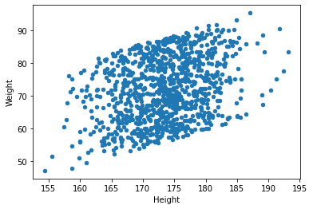

  `sns.kdeplot(body_df['Height'], body_df['Weight'])` 

  `sns.kdeplot(body_df['Height'], body_df['Weight'], shade=True)` (밀도를 색으로 표현해줌)

  이건 뭘까? 등고선. 높낮이를 표현하는 방식. 가운데가 산의 꼭대기 이고, 바깥쪽으로 갈수록 내려가는 것.  몸무게와 키의 각각의 분포를 보면서 이해해야 함. X축에는 키에 대한 KDE를 그리고, Y축에는 몸무게에 대한 KDE를 그려서 그걸 3차원으로 만든 것. 선이 가까울수록 가파르고 멀수록 평평하다는 것. 하단에 x, y의 분포와 같이 보면 알 수 있음. x축은 왼쪽에서 오른쪽으로 갈 때, 사이가 멀다가 가까움. 비교적 완만히 올라가다가 뚝 떨어진다는 것. Y는 처음이랑 끝날때 엄청 가파르다가, 중간에서 편평해. 

  이 KDE플롯은 연관성을 보면서, 분포도 같이 보는 것이 목표임. 

  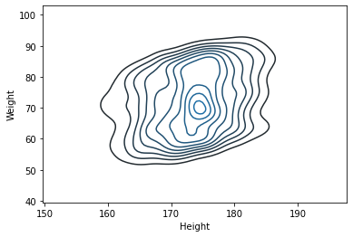

  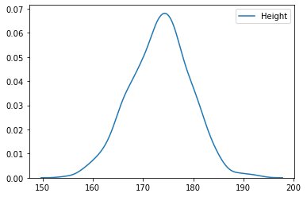

  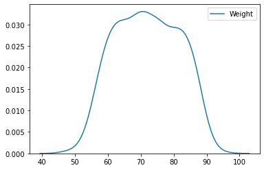


#### LM Plot

- 한 학생의 키가 주어졌을 때, 몸무게를 예측할 수 있을까요? 어느 정도 예측은 가능함. 

- **Regression Line**. 

  

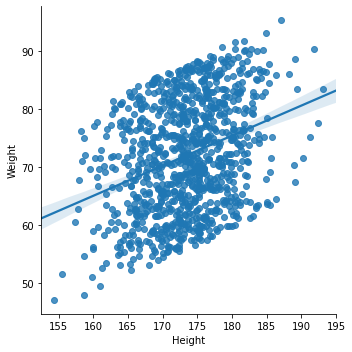


#### 카테고리별 시각화

- 하단 **laptops_df**의 데이터프레임에서 ***os***별로 데이터를 비교해 보고 싶다면? 카테고리 별로, 하나씩 그려서 비교하는 것 보다 좋은 방법이 있음. 

  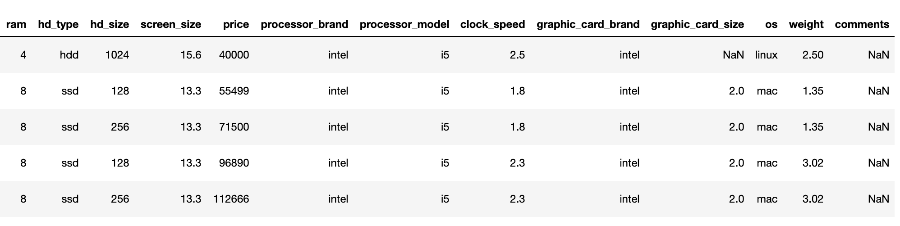

| methods                                                      | roles                                                        |
| ------------------------------------------------------------ | ------------------------------------------------------------ |
| `laptops_df['os'].unique()`                                  | 일단 *os*에 어떤 것들이 있는지 확인                          |
| `sns.catplot(data=laptops_df, x='os', y='price', kind='box')` | **data**에는 데이터프레임을, **x**에는 비교하고 싶은 카테고리를, **y**는 비교하고 싶은 항목을, **kind**는 비교하고 싶은 그래프의 종류를 쓰면 됨. |
| `sns.catplot(data=laptops_df, x='os', y='price', kind='strip', hue='processor_brand')` | 이제 위의 상태에서, 각각이 어떤 프로세서 쓰는지 알고 싶음. intel과 amd밖에 없는 것을 unique로 확인한 상태. 프로세서 브랜드에 따라, 색을 다르게 해줌. |
| `sns.catplot(data=laptops_df, x='os', y='price', kind='swarm', hue='processor_brand')` | 점들이 모여 있는 부분들은 보기가 불편함. 이런 경우 swarm을 쓰면 좋음. |

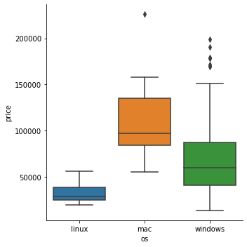

```python
sns.catplot(data=laptops_df, x='os', y='price', kind='violin')
```

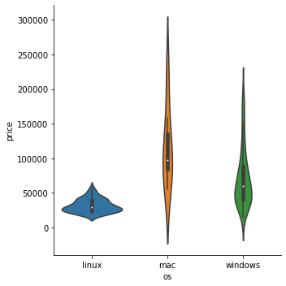

근데 지금 각 데이터가 얼만큼 있는지를 모르니깐, 인사이트가 별로 없어. 이거는 strip를 쓰면 좋음. 

```python
sns.catplot(data=laptops_df, x='os', y='price', kind='strip')
```

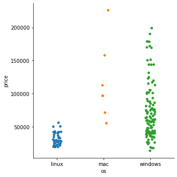

```python
sns.catplot(data=laptops_df, x='os', y='price', kind='strip', hue='processor_brand')
```

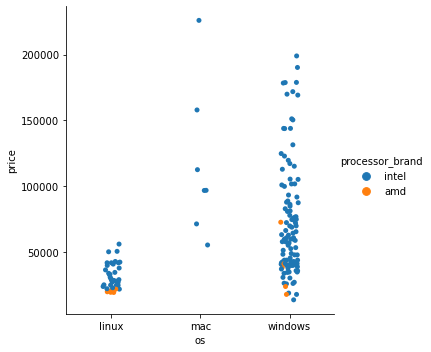

```python
sns.catplot(data=laptops_df, x='os', y='price', kind='swarm', hue='processor_brand')
```


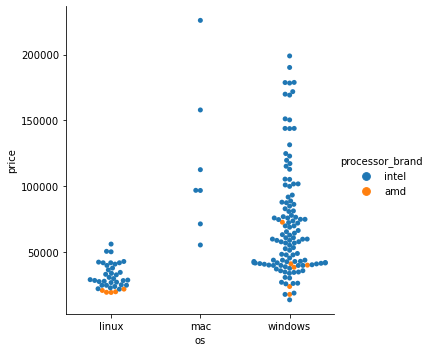

