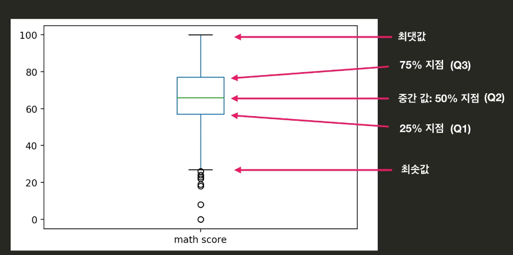

# Visualization

#### Matplotlib
```python
f%matplotlib inline
```


#### Line Graph

- 선 그래프. 내부 값들이 숫자일 때 그릴 수 있음. 변화를 보기 위함. 

| methods                                           | roles                                                        |
| ------------------------------------------------- | ------------------------------------------------------------ |
| `df.plot()`                                       | 그냥 판다스 데이터프레임에도 그래프 그리는 기능이 내장되어 있음. parameter로  kind를 넘겨줘야 함. `df.plot(kind='line')` 기본 디폴트값이 line chart. |
| `df.plot(y='KBS)` or `df.plot(y=['KBS', 'JTBC'])` | 특정 하나 혹은 특정 여러개만 그리고 싶을 때.                 |
|                                                   |                                                              |


#### Bar Chart

- 항목들에 대한 수치비교. 

| methods                             | roles                                                   |
| ----------------------------------- | ------------------------------------------------------- |
| `df.plot(kind='bar')`               |                                                         |
| `df.plot(kind='barh')`              | 가로로 눕히기                                           |
| `df.plot(kind='bar', stacked=True)` | 두 종류의 막대가 쌓이게 됨.                             |
| `df['Female'].plot(kind='bar')`     | 특정행을 뽑아서 쓸 수 있음. 시리즈에도 plot함수가 있음. |


#### Pie Graph

- 비율을 보여주기에 적합함

`df.plot(kind='pie')`

- index가 x가 됨. 기준을 잡고 싶으면, set_index를 사용해야 함. 


#### Histogram

- 각각 범위로 묶어서 보게 됨. 묶어서 세는 것. 	

| methods                                     | roles                                                        |
| ------------------------------------------- | ------------------------------------------------------------ |
| `df.plot(kind='hist', y='Height')`          | y데이터를 히스토 그램으로 보고 싶다는 것. 따로 설정 안하면 범위가 전체를 10개로 나누는 범위가 됨. |
| `df.plot(kind='hist', y='Height', bins=15)` | 범위를 15개로 나누고 싶으면, 이렇게 됨.                      |

#### Box Plot

- 시각적으로 통계 정보 보기 위해 사용. 총 5개의 통계값을 보기 위해 사용됨. 

  

  - 가운데 사각형 부분은 Box, 맨 위 아래 짝대기는 Whisker라고 부름. 
  - Box와 Whisker바깥 지점은 이상점(outlier)라고 부름. 이상점을 정하는 기준은 조금씩 다름. 

| methods                                                      | roles                                                        |
| ------------------------------------------------------------ | ------------------------------------------------------------ |
| `df['math score'].describe()`                                | 박스플롯에서 볼 수 있는 모든 정보는, 사실 describe에 다 있음. describe를 시각화 하는 것이 박스 플롯이라고 생각하면 됨. |
| `df.plot(kind='box', y='math score')`                        | 박스 플롯 그리기.                                            |
| `df.plot(kind='box', y=['math score', 'reading score', 'writing score'])` | 여러 박스 플롯 동시에 보기.                                  |


#### Scatter Plot

- 연관성을 보기 위해 사용함. 뿌려진 점들의 모양을 보고 연관성을 찾을 수 있음. 

| methods                                                      | roles |
| ------------------------------------------------------------ | ----- |
| `df.plot(kind='scatter', x='math score', y='reading score')` |       |
|                                                              |       |


## Seaborn

[Seaborn 예시 Docs](http://seaborn.pydata.org/examples/index.html])

- Statistical Data Visualization 
- PDF -> Probability Density Function, 확률 밀도 함수. **히스토그램의 막대 수를 무한대로 늘린 것**. 

- 연속확률변수에 대한 확률분포 - 연속확률분포. 이산확률변수는 **유한한** 값들만을 가질 수 있는, 확률변수. 예를 들어, 동전 두개를 던졌을 때, 앞면이 나온 갯수를 확률변수 X로 본다면, X는 0, 1, 2 세개만 가질 수 있음.  Countable. 확률변수가 연속확변수는 어떤 구간안에 있는 모든 실수값을 가질 수 있는 경우.  예를 들어, 고등학교 남학생들의 키를 확률변수로 든다면? 키는 161.93 뭐 이런게 다 되잖아. 모든 실수값을 이론적으로는 다 가질 수 있음. 예를 들어 전국 중학생 1000명을 골라서 얘네의 키의 범위가 160~190cm라고 가정하면, 이거로 도수분포표를 그리잖아. 구간을 쪼개. 상대도수가 간단히 말하면, 학생이 이 구간안에 들어올 확률이 됨. 

  |         | 도수 | 상대도수  |
  | ------- | ---- | --------- |
  | 160~170 | a명  | a/(a+b+c) |
  | 170~180 | b명  | b/(a+b+c) |
  | 180~190 | c명  | c/(a+b+c) |

  

- 

