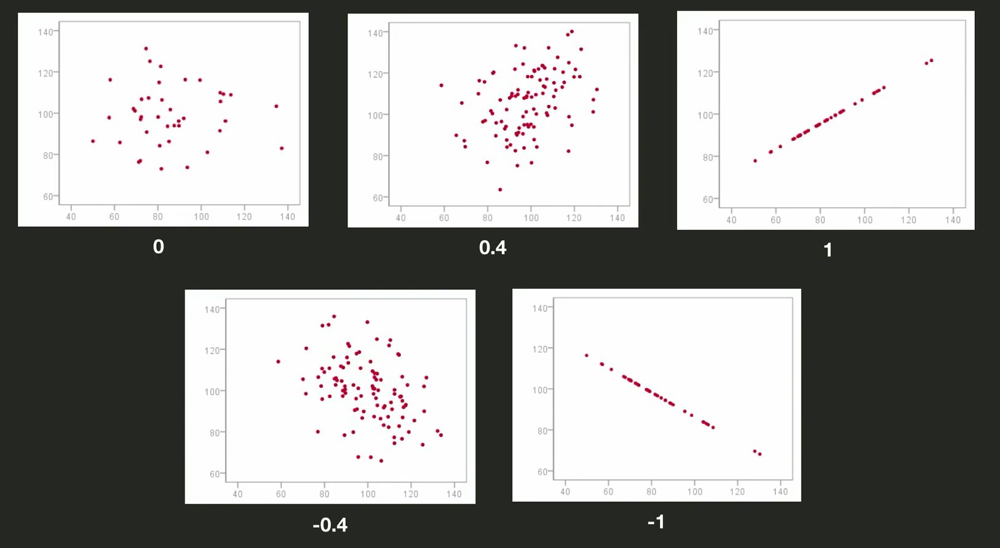

# Basic Statistics


1. 평균(Mean) : 모든 데이터들의 합을 데이터들의 갯수로 나눈 것. 
2. 중간값(Median) :   데이터셋에서 딱 중간에 있는 값. 크기 순으로 정렬이 되고 가운데 값을 찾으면 됨. 
   - 홀수이면 바로 중간에 있는것을 찾으면 됨. 
   - 짝수인 경우는, 가운데 있는 두개의 딱 중간. 두 값을 더해서 2를 나누면 됨.

##### 평균값 vs 중간값

- 평균값은 잘못된 데이터 한두개로 이상해 질 수 있지만, 중간값은 영향이 적음. outlier에 대한 영향이 적은 것이 중간값. 아웃라이어가 말도 안되게 크면 평균값은 극단적으로 차이가 나지만, 중간값은 별로 영향이 없음. 

- 아래와 같은 경우, 중간값은 똑같이 4로 나옴. 하지만, A는 전반적으로 점수가 높고 B는 덜해. 이런 경우 좀 차이가 있음. 평균을 구해보면, A는 4.18 B는 3.0 C는 3.55가 나옴. 

  


3. 상관계수(Correlation Coefficient)

   산점도를 그려 보면, 뚜렷한 연관성을 보이면 산점도만 봐도 딱 알아. 하지만 수치로 표현하는 방법은 없을까? 여러 상관게수 중, 가장 널리 쓰이는 것이 피어슨 상관계수

   0이면 연관 아예 X, -1 혹은 1에 가까워질수록 연관성이 커지는 것. 

   

   #### Visualization of Correlation Coefficient

   ```python
   df.corr()
   ```
   
   
   
   
   
   ```python
   sns.heatmap(df.corr()) #색이 밝을수록, 상관계수가 높음
   ```
   
   
   
   ```python
   sns.heatmap(df.corr(), annot=True) # annot=True 추가해주면 숫자도 보여줌
   ```
   
   

