# Exploratory Data Analysis

##### 데이터셋을 다양한 관점에서 살펴보고 탐색하면서 인사이트를 찾는 것. 

- 각 row는 무엇을 의미하는가?
- 각 column은 무엇을 의미하는가?
- 각 column은 어떤 분포를 보이는가?
- column들 간의 연관성이 있는가?

설문조사라고 생각하면

- 몇명이 참여?
- 연령대는?
- 가족관계는?
- 관심사는?

등으로 데이터의 의미를 파헤쳐 나가는 과정. 

*여기서 이제 더 나아가서, 시각화나 통계를 이용해서 데이터를 이리저리 살펴보는 것을 **EDA**라고 말함.*  어떠한 공식이나 정해진 방법은 없다. 말 그대로 **다양한 방식으로 데이터를 살펴보는 것**.

 

####  실제 과정

- 설문조사 시행
- 147개의 항목(columns)에 대해 조사하였고, 총 997명(row)이 참여.

- 147개 중
  - 0~18 : 음악취향
  - 19~30 : 영화취향
  - 31~62 : 취미/관심사
  - 63~72 : 공포증
  - 73~75 : 건강 습관
  - 76~132 : 성격, 인생관 등
  - 133~139 : 소비습관
  - 140~146 : 기본정보

1. 일단 기본 정보부터 탐색 - 뒤 7개의 컬럼. `basic_info` 에 담기

   ```python
   basic_info = df.iloc[:, 140:]
   basic_info
   ```

   

   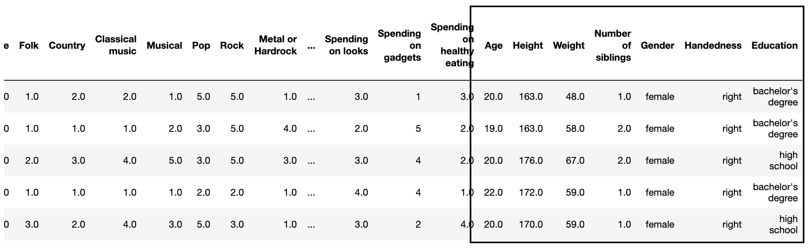

   ```python
   basic_info.describe() # 기본 정보 확인. 
   ```

   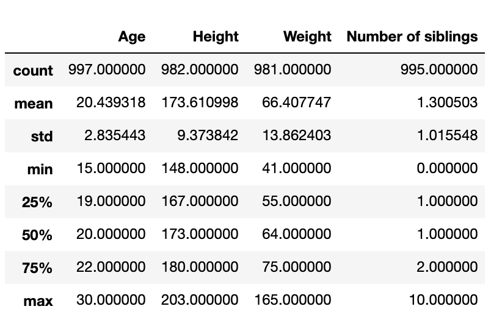

   참고로 마지막 3개, Gender/Handedness/Education은 숫자 정보가 아니라서 안나옴. 직접 살펴보기. 

   ```python
   basic_info['Gender'].value_counts()
   basic_info['Handedness'].value_counts() 
   basic_info['Education'].value_counts()
   ```

   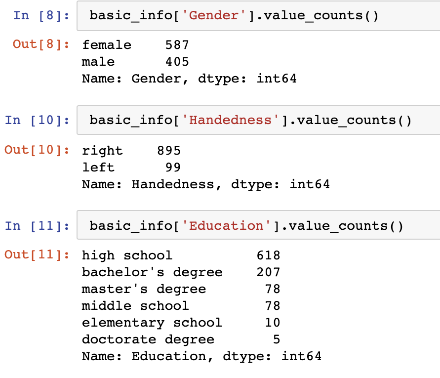

   ```
   sns.violinplot(data=basic_info, y='Age')
   ```

   전반적으로 10대 후반에서, 20대 초반의 젊은 사람들에 많이 몰려 있음. 

   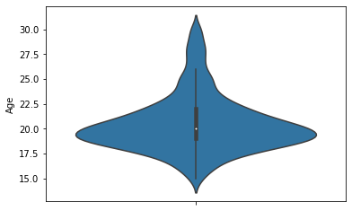

   

   ```python
   sns.violinplot(data=basic_info, x='Gender', y='Age')
   ```

   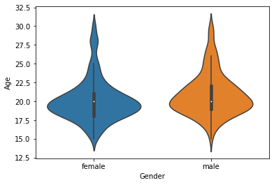

   ```python
   sns.violinplot(data=basic_info, x='Gender', y='Age', hue='Handedness')
   ```

   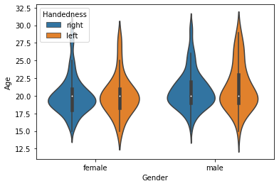

   ```
   sns.jointplot(data=basic_info, x='Height', y='Weight')
   ```

   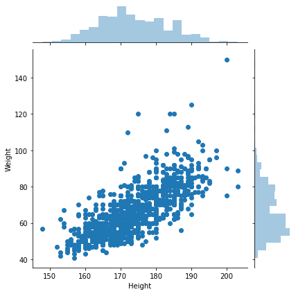

##### 본격적인 분석 시작

-  일단 음악 관련 변수들. 다 1부터 5점 까지 들어가 있음. 물어봐서 1점부터 5점까지 평가하라고 한 것. 

  ```python
  music = df.iloc[:, :19]
  ```

  각 음악 장르 사이의 연관성 파악해 보자. 연한 색일수록 연관성 높은 것. 진할수록 연관성 낮거나, 반대되는 항목. 오페라와 힙합을 보면 거의 검은색에 가까움. 오페라와 클래식은 강해 보임. 

  ```
  sns.heatmap(music.corr())
  ```

  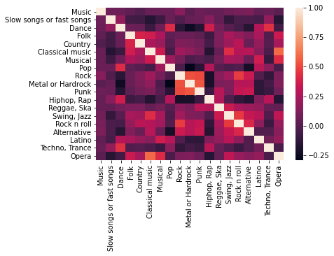

  나이와 관련된 상관계수를 조사해 보자. 나이 자신 다음, 몸무게와 가장 연관성 높음. 그 다음은 투표하고자 하는 의지(Elections). 

  ```
  df.corr()['Age'].sort_values(ascending=False)
  ```

  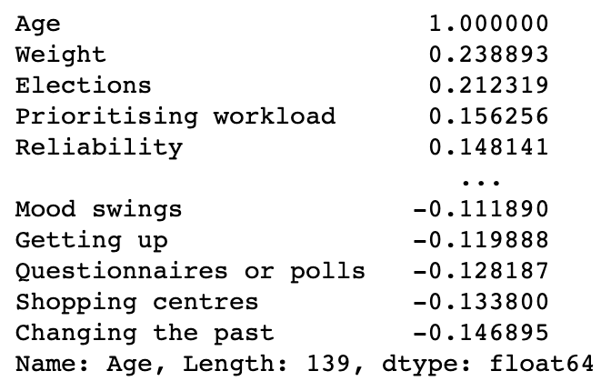


#### Cluster Analysis

클러스터 분석이란, 데이터를 몇가지 **무리(Cluster)**로 나누는 것.

관심사에 관련된 컬럼만 뽑아보기. 

```python
interests = df.loc[:, 'History': 'Pets']
interests.head()
```

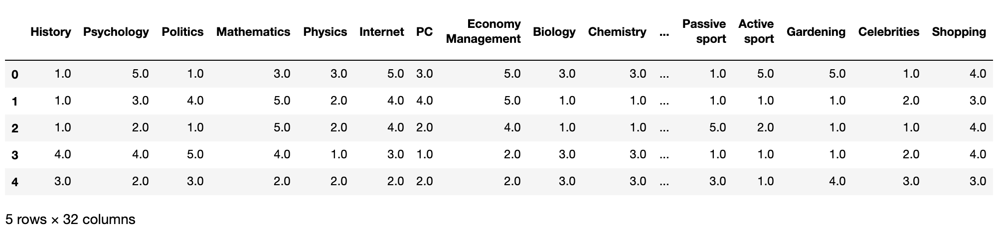

```python
corr = interests.corr()
corr
```


이제 질문을 던져보는 것. 역사를 좋아하는 사람은 어떻게 묶어야 할까? 역사와 가장 연관 깊은것들을 찾아봄. 대충 아래처럼 나옴. 

```python
corr['History'].sort_values(ascending=False)
```

> ```
> History                   1.000000
> Politics                  0.400845
> Geography                 0.327354
> Law                       0.298363
> Psychology                0.281493
> Reading                   0.262948
> Religion                  0.203840
> Art exhibitions           0.200643
> Theatre                   0.185301
> Writing                   0.164617
> ```

**근데 한 컬럼마다 이렇게 보면, 너무 오래 걸림. 그래서 이걸 좀 더 편하게 해주는 것이 있음**.

히트맵과 굉장히 비슷한데, 위의 사다리 토너먼트 같은 것은 연관성 있는 관심사들끼리 묶어 놓은 것. 

예를 들어서, Biology와 Medicine이 연결되어 있음. Chemistry도 그 다음으로 연결되어 있음. 

 ```
sns.clustermap(corr)
 ```

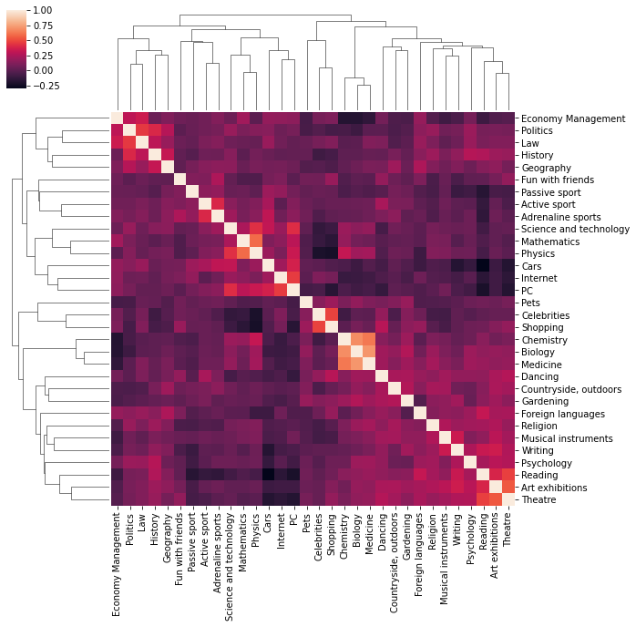


