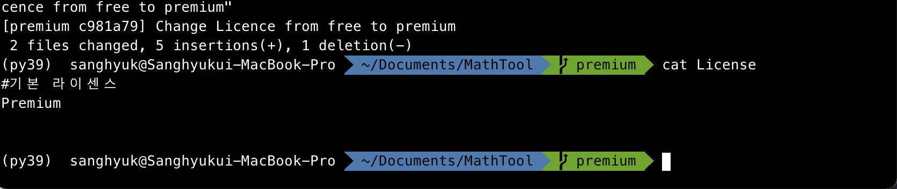
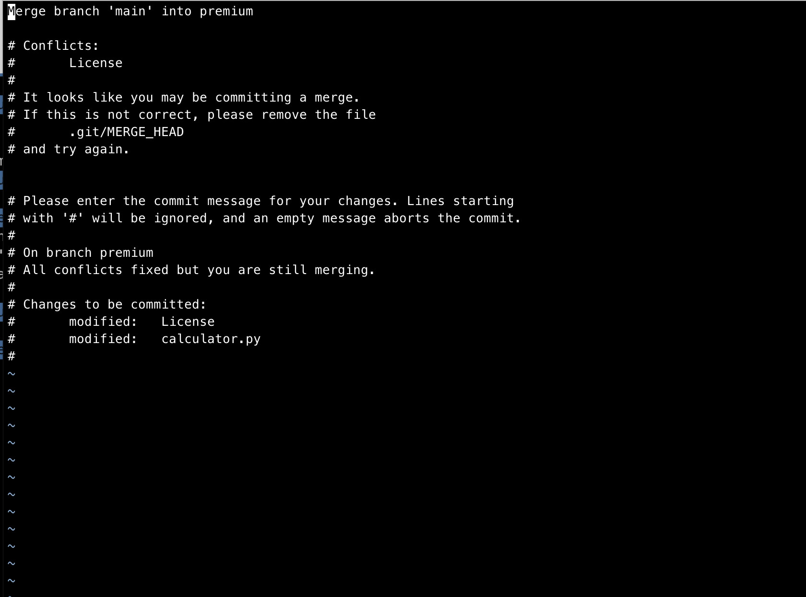
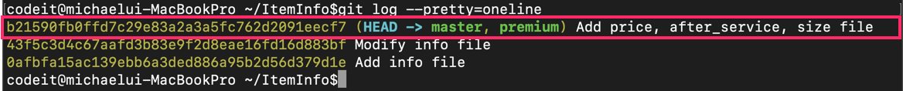
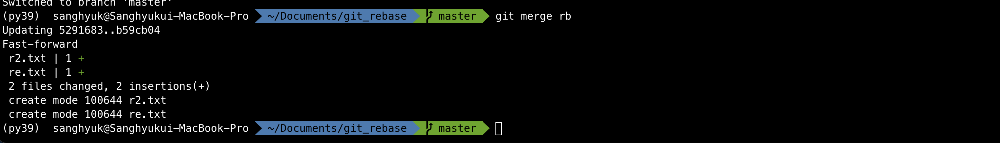

# Branch

| command                                       |                                                |                                                              |
| --------------------------------------------- | ---------------------------------------------- | ------------------------------------------------------------ |
| `git branch <name of new branch>`             | 브랜치 새로 생성                               | 지금까지 작업한 내용 모두, 새로운 브랜치에도 속하게 된다. 브랜치는 현재 HEAD(현재 working directory) 기준으로 만들어 지게 된다. |
| `git checkout <branch name>`                  | 브랜치 이동                                    |                                                              |
| `git branch`                                  | 브랜치 조회                                    | 현재 레포지토리의 모든 브랜치 조회, 현재 위치한 브랜치 옆에는 *표시 |
| `git branch -d <삭제할 브랜치 이름>`          | 브랜치 삭제                                    |                                                              |
| `git checkout -b test`                        |                                                | 만들면서 바로 해당 브랜치로 이동                             |
| `git checkout <branch_name or commit name>`   |                                                | head를 움직이게 하는 명령어이다. HEAD가 어떤 브랜치를 가리키게 할지에 대한 명령어. HEAD가 직접적으로 commit을 가리키게 할 수도 있다. |
| `git merge master`                            | 현재 있는 브랜치에서 master 브랜치를 합치겠다. | 충돌나는 경우, 충돌나는 부분을 수정하고, `git commit`을 하면 자동으로 message가 써 있다. 그 상태로 :wq하면, 그대로 커밋이 되는 것.<br>중요한 것은 merge는 항상 **Commit**이 된 것을 기준으로 한다. [생활코딩](https://www.youtube.com/watch?v=xE8rFAzP3y0)<br> [3-way merge 자세히 이해하기](####3-way-merge)<br>[fast-forward-merge 이해하기](####fast-forward-merge) |
| `git merge --abort`                           | 머지 취소                                      | 머지 해서 conflict일어났을 때, 막 코드에 ===이런거 많이 써있잖아. 그때, 지금 머지 하기 애매할 때 있음. 그때 머지 취소할 수 있음. <br>[여러개의 충돌이 나는 경우 체크하기](#many_conflicts) |
|                                               | remote repository origin/master의 이해         | [origin/master가 무슨 뜻일까?](###origin_master)             |
| `git rebase`                                  |                                                | [생활코딩](https://www.youtube.com/watch?v=VPb-MKwowHY), [정리](###git_rebase의_의미) |
| ` git log --decorate --all --oneline --graph` |                                                | 모든 브랜치를 원라인으로 그래프로 표현하겠다.                |
| `git checkout <commit name>`                  |                                                | HEAD는 원래 브랜치를 통해 간접적으로 커밋을 가리키지만, 해당 명령어를 통해 HEAD가 직접 커밋을 가리키게 할 수 있다. 이런 커밋을 detached commit 이라고 부른다. 하단에 내려가서 설명을 보자. [설명보러 내려가기](####detached_head) |


- #### 브랜치란?

  깃은 루트 커밋을 시작으로 가지가 갈라지는 나무 모양을 하고 있음. 이 가지 하나하나를 브랜치라고 하는 것. 

  

  프로젝트를 하다 보면, 딱 하나의 코드 관리 흐름으로만 순조롭게 진행할 수 있는 경우는 많지 않다. 예를 들어 하나의 서비스여도 무료버전, 유료버전이 있을 수 있다. 이런 경우, 아예 다른 두 개의 프로젝트를 만들기 보다는, 하나의 프로젝트 내에서 브랜치를 두개로 만드는 것. 

  

  지금까지는 계속 마스터 브랜치 위에서 하고 있었던 것. 마스터는 **기본으로 셋팅되는 브랜치.** 

  

  지금부터는 마스터브랜치에서는 무료 버전 작업만 한다고 가정하자. 

  

  브랜치 만드는 법은 간단함. 

  `git branch premium` **지금까지 작업한 내용 모두, 프리미엄 브랜치에도 속하게 된다.** 

  그리고 만든 브랜치로 이동 `git checkout premium`

  현재 상태를 다시 보면, 프리미엄 브랜치에 있음. 

  

  지금부터 작업을 하면, 프리미엄 브랜치에만 반영이 된다. 마스터 브랜치와는 상관이 없다. 

  프리미엄 브랜치 위에서 LIcence파일 고치고, **add -> commit** 

  `cat License` 해보자. 

  

  지금 MathTool Directory의 작업이 두개로 분리된 것. 하나는 무료버전, 하나는 유료버전. 

  

  

- #### 브랜치 다뤄보기

  현재 레포지토리의 모든 브랜치 조회

  `git branch`

  브랜치 삭제

  `git branch -d test`

  

  만들면서 바로 해당 브랜치로 이동 `git checkout -b test`

  


- #### 브랜치 머지 하기

  현재 브랜치 2개를 가지고 있음. 

  

  마스터 브랜치에서 calculator.py를 조금 바꿔보자. 

  

  근데 이때, 무료 버전에 있는 기능은 유료 버전에도 모두 있어야 한다는 공문이 내려옴. 

  

  방금 추가한 divide는 프리미엄 브랜치에도 넣어야돼. 

  그런데 깃에서는 바로 반영이 가능함. 다시 premium으로 가보고 cat하면, 

  현재 Premium branch의 calculator.py에는 당연히 divide가 없어. 

  

  **branch merge**가 가능함. 

  현재 있는 premium에다가 master를 합치겠다는 뜻. 

  `git merge master` 

  

  머지를 하면서 새롭게 커밋을 해야 되서, 자동으로 커밋 메세지를 쓰는 곳이 생긴 것. 

  

  지금 강의에서는 이런데, 내꺼는 조금 다르게 나옴. 

  머지를 하면, +a된거는 합쳐지는데, 

  충돌하는거는 내가 수정을 해줘야 머지가 가능한 것 같음. 

  

  충돌되는 부분 수정하고, 

  커밋 메세지 안쓰고, git commit 이라고 쓰면 자동으로 커밋메세지가 써있음. 

  


- #### merge 할 때 conflict가 나는 경우

  premium 브랜치에서 *divide_premium* 수정하고, 마스터로 이동해보자. 

  

  마스터로 이동해서, 이번에는 마스터 브랜치의 divide함수는 *divide_free*로 바꿔보자. 

  

  이제 프리미엄 브랜치로 가보자. 

  이 상태에서 마스터 브랜치를 머지하면?

  

  충돌이 발생함. 

  파일을 열어보니깐 아래처럼 되어 있다. 

  

  선을 기준으로 각 브랜치에서 어떻게 수정했는지 보여준다. 

  

  git은 Conflict가 발생하면 어떻게 해결해야 하는지를 몰라. 

  사용자에게 물어본다. 

  

  한번 아예 새로운 이름으로 바꿔보자. 

  아예 새로운 이름으로 써봤음. 

  

  그 다음에, add 후 커밋을 하면 된다. 

  자동으로 커밋메세지 나옴. 

  


- #### Conflict가 났을 때 merge 자체를 취소해도 됩니다. 

  이전 영상에서는 premium 브랜치에서 master 브랜치를 **머지(merge)**하다가 **Conflict가 발생**했고, 저는 그것을 해결하고 머지에 성공했습니다.

  하지만 꼭 이렇게 Conflict를 해결하지 않고, 일단 merge 자체를 취소하는 방법도 있습니다. 

  이전 영상에서 머지하려다가 아래 그림처럼 Conflict가 났을 때 

  

  **calculator.py 파일**의 모습은 이랬습니다. 

  

  저는 이전 영상에서 이때 

  - Conflict가 발생한 빨간 박스 부분을 다 삭제하고
  - 제가 머지의 결과로 원하는 모습대로 코드를 수정한 다음(divide_new 함수 추가) 
  - 커밋을 함으로써 문제를 해결했는데요. 

  꼭 이렇게 Conflict를 해결하지 않아도 됩니다.

  **머지를 시도하기 이전의 상태로 돌아가고 싶다면 그냥 머지 자체를 취소하는 방법도 있는데요.** 

  머지 작업을 취소하려면

  > **git merge --abort**

  라고 쓰면 됩니다. **--abort**는 우리말로 '버리다, 취소하다'라는 뜻입니다.

  아래 그림처럼 이 커맨드를 실행하고 

  

  다시 calculator.py 파일을 보면

  

  Conflict 표시가 말끔히 사라지고 **premium 브랜치에 있던 calculator.py의 원래 모습 그대로 즉, 머지를 시도하기 이전 모습**으로 돌아옵니다.

  자, 정리할게요! 만약 꼭 머지를 해야하는 상황이라면 이전 영상에서 봤던 것처럼 Conflict를 해결하고 커밋을 하는 게 정석입니다. 

  하지만 

  - Conflict가 발생한 파일들이 너무 많아서 Conflict를 최소화할 수 있는 방식으로 파일들을 다시 수정하고 커밋한 다음에 머지를 하고 싶다거나
  - 그냥 좀더 나중에 머지하고 싶을 때라면

  방금처럼 그냥 머지 자체를 취소해도 됩니다.


- #### 여러 파일에서 conflict가 났을 때는?

  #many_conflicts 

  

  이전 영상에서는 **파일 하나에서** conflict가 발생하는 상황을 봤습니다. 하지만 개발 실무에서는 파일 여러 개를 수정하는 경우가 많다보니 머지할 때 **conflict도 파일 여러 개에서** 나는 경우가 많습니다. 이럴 땐 어떻게 해야할까요? 원리는 파일 하나일 때와 같습니다.

  일단 아래 그림과 같은 프로젝트가 있다고 해볼게요.

  

  지금 빨간색 박스 안의 커밋(세번째 커밋)에서 어떤 상품의 정보를 담기 위한 **파일 3가지(price, after_service, size)**를 만들었습니다. 

  지금은 master 브랜치나, premium 브랜치나 그 히스토리가 같죠?

  이제 여기서부터 각 브랜치에서 서로 다르게 커밋을 해볼게요. 

  master 브랜치와 premium 브랜치에서 **3가지 파일을 각각 서로 다르게 수정**하고 커밋하겠습니다. 그 과정은 별도로 보여드리지 않고 생략할게요. 

  그 다음 master 브랜치에서 premium 브랜치를 머지하려고 하면 

  

  위 그림처럼 3가지 파일 모두에서 conflict가 발생합니다. 꼭 이런 출력 결과가 아니더라도 이전에 우리가 배운 **git status** 커맨드를 사용하면 현재 conflict가 발생한 파일들의 목록을 언제든지 확인할 수 있습니다. 

  

   자, 각 파일에서 conflict가 어떻게 났는지 하나씩 살펴볼까요? 

  **price 파일** 

  

  **after_service 파일** 

  

  **size 파일**

  

  ======= 기호를 기준으로

  - master 브랜치에서 했던 커밋이 위쪽에,
  - premium 브랜치에서 했던 커밋이 아래쪽에 

  보이는 상태입니다.

  **일단 price 파일에서만** conflict를 해결해볼게요.

  

  이렇게 conflict를 해결하고, 

  - **git add price** 

  를 실행하고, 

  다시 **git status**로 확인을 해보면 

  

  price 파일은 conflict를 해결하고 staging area에 올려주었기 때문에 커밋할 수 있는 파일이라는 걸 확인할 수 있습니다. 이렇게 conflict가 해결된 상태를 **resolved(해결된) 상태**라고 말하기도 합니다.

  자, 이제 나머지 두 파일(after_service, size)도 모두 conflict를 해결하고 나서, 늘 하던대로 

  - **git add .**

  를 실행하고 커밋해주면 됩니다.

  

  그럼 머지가 정상적으로 마무리됩니다! 

  자, 여러 개의 파일에서 conflict가 발생했을 때도 앞으로 잘 해결할 수 있겠죠? 파일 여러개가 conflict가 났을 때는

  - 파일 하나씩 conflict를 해결하고 **git add [파일 이름]** 커맨드로 하나씩 staging area에 올리거나(중간중간에 git status 커맨드로 현재 상태 확인하면서)
  - 모든 파일들의 conflict를 다 해결하고, **git add .** 커맨드로 한번에 staging area에 올리고

  커밋을 하면 됩니다.


- #### Remote Repository의 브랜치는 이렇게 보입니다!

  ###origin_master

  이번에는 브랜치(branch)에 대해 좀더 많은 것들을 배워보겠습니다.

  여러분, 혹시 [**3. GitHub 시작하기 챕터의 '02. Local Repository의 내용을 Remote Repository로 보내기' 레슨**](https://www.codeit.kr/learn/2897)에서 했던 작업, 기억나시나요?

  저는 그때

  1. GitHub에서 Math_Box라는 리모트 레포지토리(remote repository)를 만들고
  2. 로컬 레포지토리(local repository)의 내용을 그 리모트 레포지토리에 보내기위해 아래와 같은 커맨드 2개를 실행한 적이 있습니다. 

  > **git remote add origin https://github.com/kyuri-dev/Math_Box.git**

  > **git push -u origin master** 

  그 때는 이 2개의 커맨드를 그냥 복사-붙여넣기해서 실행만 하고 정확한 의미에 대해서 설명하지 않았는데요. 이번 노트에서는 그 의미를 알아보겠습니다. 

  **1. origin이란?**

  먼저 첫 번째 커맨드를 봅시다. 

  > **git remote add origin https://github.com/kyuri-dev/Math_Box.git**

  이 커맨드에서 **remote**는 리모트 레포지토리에 관한 작업을 할 때 쓰는 커맨드입니다. 

  그리고 그 뒤의 **add**는 새로운 리모트 레포지토리를 등록하겠다는 뜻입니다. 

  그 다음에는 **origin** **https://github.com/kyuri-dev/Math_Box.git**이라고 써있죠?

  이 표현은 **https://github.com/kyuri-dev/Math_Box.git** 리모트 레포지토리를

  **origin**이라는 이름으로 등록하겠다는 뜻입니다.

  그러니까 이 커맨드를 실행하고 나면 **https://github.com/kyuri-dev/Math_Box.git**를 **origin**으로 간단하게 나타낼 수 있게 되는 거죠.

  그럼 왜 하필 **origin**이라고 하는 걸까요? origin이 아닌 여러분이 원하는 다른 단어를 입력해도 큰 상관은 없습니다. 하지만 Git에서는 리모트 레포지토리를 최초로 추가할 때 origin이라는 이름으로 가리키는 것이 관례화되어 있습니다. 

  origin은 ‘근원’, ‘기원’이라는 뜻을 가집니다. 아마도 다른 사람의 리모트 레포지토리를 자신의 컴퓨터로 가져와서 작업을 하는 사람의 입장에서는 리모트 레포지토리가 프로젝트의 근원이 되는 존재이기 때문에 그런 관습이 생긴 것으로 추측됩니다. 

  사실

  >  git remote add **hello** https://github.com/kyuri-dev/Math_Box.git

  처럼 origin 대신 우리가 원하는 단어(hello)를 써도 상관은 없지만, 되도록 관례에 따라 origin을 써주는 게 좋겠죠?

  **2. Remote Repositoy에 있는 브랜치**

  이제 두 번째 커맨드를 설명해드릴게요. 

  > **git push -u origin master**

  이 커맨드의 뜻은 

  - 현재 로컬 레포지토리에 있는 master 브랜치의 내용(=master 브랜치와 관계된 모든 커밋들)을
  - **origin**이라는 리모트 레포지토리로 보낸다는 뜻입니다.

  이때 같은 이름의 브랜치로 전송하게 되는데 만약 origin이라는 리모트 레포지토리에 master 브랜치가 **없으면 master 브랜치를 새로 생성하고 푸시합니다.** 

  그런데 여기서 옵션 **-u**는 무슨 뜻일까요? **-u**는 **--set-upstream**이라는 옵션의 약자입니다. 

  이렇게 **--set-upstream(-u) 옵션**을 주면 

  - 로컬 레포지토리에 있는 master 브랜치가 
  - origin에 있는 master 브랜치를 **tracking(추적)**하는 걸로 설정됩니다. 

  **tracking이라는 건 로컬 레포지토리의 한 브랜치가 리모트 레포지토리의 한 브랜치와 연결되어 그것을 계속 바라보는 상태가 되는 것**이라고 생각하시면 됩니다. 이렇게 맺어진 연결 상태를 **tracking connection**이라고 합니다. 

  만약 

  - 로컬 레포지토리에 A라는 브랜치가 있고,
  - 리모트 레포지토리에 B라는 브랜치가 있을 때 
  - 이런 **tracking connection**이 서로 맺어진 경우,
  - B 브랜치를 A 브랜치의 **upstream branch**라고 합니다. 
  - 지금은 구별하기 위해서 A와 B라고 표현했지만 보통은 같은 이름인 경우가 대부분입니다.

  이렇게 **tracking connection**이 한번 설정되고 나면,

  사용자가 현재 master 브랜치에 위치해있을 때,

  ```
  git push
  ```

  라고만 써도 자동으로 리모트 레포지토리의 master 브랜치를 대상으로 git push가 동작하고,

  ```
  git pull 
  ```

  라고만 써도 리모트 레포지토리의 master 브랜치를 대상으로 git pull이 동작합니다. 

  사실 **--set-upstream(-u)** 옵션을 주지 않아도 그 후에 git push와 git pull을 할 수 있기는 합니다. 하지만 맨 처음에 이 옵션을 주지 않으면 tracking connection이 없기 때문에 나중에 git push를 하고 싶을 때

  ```
  git push origin master:master 
  ```

  이런 식으로 적어줘야 합니다. 여기서

  - origin은 리모트 레포지토리를 나타내고,
  - master:master에서 더 먼저 나오는 **master는 로컬 레포지토리의 master 브랜치(~에서)/더 뒤에 나오는 master는 리모트 레포지토리의 master 브랜치(~으로)를 나타냅니다.**

  그러니까 tracking connection이 없으면 매번 이런 식으로 git push를 해줘야 합니다. git pull도 마찬가지로 이런 식의 복잡한 표현이 필요하게 됩니다.

  그러니까 그냥 처음부터 tracking connection을 설정하고 그 이후부터는 git push, git pull이라고만 써서 편하게 푸시와 풀을 하는 게 좋겠죠? 이게 바로 제가 맨 처음에 로컬 레포지토리의 내용을 리모트 레포지토리로 보낼 때 -u라는 옵션을 썼던 이유입니다.

  **3. origin/master의 의미**

  자, 이제 

  - 로컬 레포지토리의 master 브랜치 
  - 리모트 레포지토리의 master 브랜치 

  이렇게 같은 이름이지만, 서로 다른 2개의 브랜치가 있다는 걸 알겠죠? 

  그럼 리모트 레포지토리에 있는 master 브랜치는 어떻게 볼 수 있을까요? GitHub 페이지에서 보면 될 겁니다.

  하지만 제 컴퓨터에서도 확인할 수 있는 방법이 있습니다. 잠깐 커밋 히스토리를 살펴보면

  

  위 그림에서

  - **master**가 로컬 레포지토리의 master 브랜치를 나타내고
  - **origin/master**가 리모트 레포지토리의 master 브랜치를 나타냅니다. 

  이때까지 로컬 레포지토리의 master 브랜치에서 여러 커밋을 했지만 그러고나서 git push를 해준 적은 없었습니다. 그래서 위 그림처럼 **origin/master**가 **master**보다 이전의 커밋을 가리키고 있는 겁니다.

  다음 영상에서는 master, premium 브랜치 둘 다에서 리모트 레포지토리로 **git push** 하겠습니다. 그러고 나면 이제 origin/master도 master와 같은 커밋을 가리키게 될 것입니다.


###git_rebase의_의미

- commit을 했어. 또 한번 커밋, 그럼 다시 M이 바뀜. 그 상태에서 feature Branch를 땃음. 그리고 새로 피쳐에서 커밋. 그리고, 다시 피쳐에서 커밋. 

  그 다음 master에서 2번 더 커밋. 그럼 아래와 같은 상태. 

  

  

m를 f로 가지고 오고 싶다. 

`git checkout feature`

`git merge master` 

이렇게 하면, 두개의 최신 커밋을 공통의 조상으로 하는 새로운 커밋이 만들어 진다. 그리고, 이 커밋은 공통의 조상인 검은박스 커밋이랑 비교해가면서, 3-way 머지라는 기법으로 자동으로 비교하면서 자동으로 병합해주고, 그럴 수 없는 경우는 conflict를 발생시켜 준다. 


그리고 이제 feature는 새로 머지된 커밋을 가리키게 되겠지. 


그렇다면 rebase는?

feature입장에서 베이스는 아래 검은 박스와 같다. 튀어나오게 된 공통 조상이 되겠지. 


Rebase? feature의 베이스를 master branch의 최신 커밋으로 바꾸겠다는 것. 

 

`git checkout feature`

`git rebase master`

이렇게 해주면, temp같은 임시저장소에, feature가 만들어놓은 두개의 커밋이 들어간다. 그리고, feature는 마스터의 최신 커밋을 가리키게 되고, 아까 임시저장소에 들어간 2개는 사라진다. 


그리고, 이 Temp에 저장됬던 애들을 patch라고 부르는데, 이것을 master branch의 최신 커밋과 병합을 시킨다. 그리고 patch는 지워진다. 

이 임시저장소에는 패치라는 이름으로 base와 각각 feature의 커밋들의 소스코드 차이점을 가지고 있는 애들이 저장되는 것. 

구체적으로 말하자면, base와 a의 차이, a와 b의 차이가 각각 저장되는 것.  


그리고 feature는 그 첫번째 병합한 부분으로 간다. 


그리고, 최신 커밋 하나 더 남았잖아. 그걸 또 병합시켜서 Feature는 거기로 가는 것. 


이것이 rebase. 

결국 머지를 했을때랑 커밋은 같은 내용을 가지고 있음(아래 두 검은 박스 내용 같음). 결국은 피쳐가 master/feature에서 작업한 내용을 다 가지고 있으니깐. 


머지는 병렬로 히스토리가 나아가서 보기가 어려운 반면, 리베이스는 히스토리가 일렬로 나아간다. 버전 역사 파악하기가 좋다. 

다만, 리베이스는 조금 어렵고 위험하다. 

실습(생활코딩 rebase 2강)

아래 상태로 만들었음.


R1의 베이스를 마스터의 최신 커밋인 m2로 바꾸고 싶은 거야. 


First, rewinding head to replay your work on top of it : 

다시 그래프 그려보면 아래처럼 나온다. 


R2의 조상은 원래 1 이였는데, R2의 조상이 m2라는 마스터의 최신 커밋이 됬음. 

따져보면, R2는 원래, M1/M2랑 상관이 없었어. M1/M2는 1에서 나갔던 애들이고, R2는 애초에 1에서 분리되서 나온 애들이였으니깐. 

그런데, 사실상 머지랑 결과는 같게 나옴. 


현재 Master는 M2에 머물러 있는 상태인데, master도 r1, r2를 병합하고 싶다면?



그냥 master상태에서 merge rb만 해도 패스트포워딩에 의해서 빠르게 이동되지. 위에도 fast forward라고 써있잖아. 

그리고 로그를 다시 살펴보면, 


(참고) 패스트포워딩이란, master가 아래처럼 분기를 따준 이후로 따로 변경된게 없다면, 그대로 빠르게 적용된다는 것. 별거 아님. 


- 이제 충돌의 상황 만들어서 해보자. rebase의 핵심. 충돌을 내보고, 리베이스를 어떻게 이해할지를 생각해 볼 수 있다. 

  **가장 중요한 것은 리베이스는 내가 다른 사람과 공유하지 않은 커밋들에 대해서만 리베이스를 해야 한다. **

  pull을 했으면, 그 뒤에 내가 혼자서 만들고 그런 것들만 rebase하는 거야. 

  `git init .` 현재 디렉토리 일단 초기화 시킨다. 

  아래와 같이 진행했다. rb는 master의 1을 베이스로 한다. 

  

  

  그리고 마스터로 돌아와서 다시 f1.txt를 수정하고 커밋함 

  

  현재 아래와 같은 상태 

  

  이제는 머징을 하면 충돌이 나는 상황을 만들었지. 

  그러고 rb에서 커밋 몇번 더한 상태 

  

  

  그럼 이제 여기에서 rb브랜치를 마스터 브랜치로 리베이스를 한다는 것은?

  r1, r2, r3를 M1으로 가져다가 붙이겠다는 거야. 

  `git rebase master`

  그 과정에서 일어나는 일은? 1과 R1의 소스코드 차이점만을 가지고 있는 패치라는 형태의 정보가 임시정보소에 저장됨. 

  그리고, R1과 R2의 차이점이 저장됨. **패치라는 이름으로**

  그리고 R2와 R3의 차이점이 저장됨. 

  그리고, 그 R1의 패치(1과 R1의 차이)가 M1에 머지가 된다. 

  일단 해보자. 

  `git rebase master`

  

  읽어보면, R1을 applying을 했는데, conflict가 났다는 말. 그것을 해결하라고 요구하는 것. 

  `git status`

  f1.txt conflict 확인

  

  f1.txt열면 아래처럼 나온다. 

  

  이게 무슨 말일까? 

  1 커밋에서는 A가 추가되었는데, 현재 비교중인, M1이란 커밋(head)은 M1을 추가함. 그리고 R1이라는 커밋도 R1을 똑같이 두번째 줄에 추가함. 이게 같은 줄이 수정되서, 자동으로 머지가 안됬던 거야. 

  수정했음. 

  

  이제 여기부터 신기한게, 바꾼거 add 한다음에, git status 치면, 

  충돌난거 해결 됬으니깐 rebase continue하라고 나온다. 

  

  `git rebase --continue`

  또 충돌 났다고 알려줌 

  

  현재까지 상태는? 아래까지 된거야. **M1과 R1**을 병합한 것 까지 한거야. 

  

  **R2의 패치를 지금, R1과 M1에 병합한 결과에다가 저장하려고 시도하는거니깐, 충돌이 나지.**

  

  다시 수정 해주고, add . 진행하라고 나오지. 

  

  continue하면 또 충돌이 나지. 

  

  현재까지 상태는 다음과 같음. R2까지 와서 붙었음. 

  

  이제 마지막 R3 충돌 까지 고쳐주고, 다시 Continue하면, 더이상 에러 안남. 

  

  최종 결과 

  

다 끝나니깐, 원래 브랜치로 뻗어나가던 R1, R2, R3는 사라졌네. 

그 상태에서 master가서 merge rb해주면, **패스트포워딩**. 

`git rebase --abort`  참고로 중간에 어디서든, 해당 명령어 쓰면, 맨 처음 git rebase 라고 아예 치기 전으로 돌아감. 아예 맨처음 건들기 전 브랜치 상태로. 


- ### master 브랜치와 premium 브랜치 둘다 push 하기 

  각각의 브랜치에서 push를 하면 각 브랜치로 올라감. 

  premium branch를 처음 푸쉬 하려고 하니깐, 아래와 같은 에러가 나옴. 

  

  맨처음에는 upstream 설정을 해야 함. 

  

  그 다음 해당 브랜치에서 푸쉬하면 됨. 


- #### HEAD와 브랜치의 관계

  현재 커밋 히스토리 살펴보면, 헤드가 마스터 브랜치를 가리키고 있다. 그런데 **-> 화살표는 무슨 뜻일까?**

  

  

  브랜치는 프로젝트에서 코드를 관리하는 하나의 흐름이다. 

  **사실 브랜치도 어떤 커밋을 가리키는 존재이다.** 앞으로 이렇게 커밋을 가리키는 존재를 포인터라고 하겠다. 

  

  우리가 커밋을 하게 되면, 마스터브랜치가 첫번째 커밋부터 시작해서 매번 새로운 커밋을 가리키게 된다. 

  이때 이 마스터가 최신 커밋을 가리키고 있다고 해도, 지난 커밋들에 대한 정보를 다 가지고 있다. 때문에, 이전 커밋으로 하나씩 돌아갈 수 있다. 때문에, 이때까지 어떻게 프로젝트가 변해 왔는지 추적할 수 있는 것. 그래서 브랜치라는 것이 어떤 코드의 관리 흐름이라는 것이 성립하는 것. 

  

  

  그럼 HEAD는 뭘까? HEAD도 커밋을 가리키는 포인터 이다. 그리고 head가 가리키는 커밋의 내용으로 워킹디렉토리가 바뀐다. 

  

  하지만, 정확히 말하자면, HEAD는 커밋을 직접적으로 가리키는 것이 아니다. HEAD는 브랜치를 가리킨다. 즉, 헤드는 브랜치를 통해 간접적으로 커밋을 가리키게 된다. 

  

  

  이제 이 상태에서 새로운 커밋을 하면, 마스터 브랜치는 5번째 커밋을 가리키게 된다. 그리고, HEAD는 마스터 브랜치를 가리키게 되지. 그래서 결국 HEAD도 5번째 커밋을 가리키게 되는 것. 

  

  이 상태에서 프리미엄 브랜치를 만들면 어떻게 될까? **HEAD가 가리키던 커밋을 프리미엄 브랜치**가 가리키게 된다. checkout 이라는게 결국은 그냥 이렇게 HEAD가 가리키던 브랜치를 변경할 뿐이였던 것. 

  

  이 상태에서 `git checkout` 을 해서 옮기면, HEAD가 프리미엄 브랜치를 가리키게 된다. 

  

  이 상태에서 커밋을 또 하면, premium 브랜치는 여섯번째 커밋을 가리키고, HEAD는 프리미엄 브랜치를 따라 가니깐, 같이 바뀌는 것. 

  

  이 상태에서 다시 마스터 브랜치로 체크아웃 하면, HEAD가 다시 master branch 로 가게 되겠지. 

  여기서 마스터가 또 커밋을 하면, 분기하겠지. 

  

  이 상태에서 각각 브랜치에서 몇번 더 커밋 하고 마스터, 프리미엄 브랜치를 머지하면? 마스터에서 프리미엄 브랜치 머지 하면, 아래처럼 되는 것. 

  

  이때의 이 A+B커밋을 머지커밋 이라고 한다. 

  

  결국 머지라는 것은, 헤드가 가리키던 커밋에 다른 브랜치를 합쳐서 새로운 커밋을 만드는 작업이였던 것. 

  

  


- #### git reset의 비밀

  이전 영상에서는

  - 사실 **브랜치(branch)**는 커밋을 가리키는 존재(포인터)이고, 
  - **HEAD**는 이런 브랜치를 통해 커밋을 간접적으로 가리키는 존재(포인터)

  라고 배웠습니다.

  자, 이제 이 사실을 안다면 우리가 이전에 배운

  > **git reset**

  커맨드의 동작 원리를 더욱 정확하게 알 수 있는데요.

  **1. git reset을 할 때 HEAD의 변화는?**

  지금 총 4개의 커밋을 한 아래와 같은 상황이라고 가정합시다.

  

  현재 각 박스 안에 있는 텍스트는 각 커밋의 커밋 아이디 앞 부분입니다.

  이 상태에서

  > **git reset [--hard 또는 --soft 또는 --mixed] 9033**

  을 실행한다면 어떻게 될까요? 이전에 git reset을 배울 때를 떠올려보면 HEAD가 9033.. 커밋을 가리키게 되겠죠? 그럼 정확히 어떤 모습으로 가리키게 되는 건지 보여드리겠습니다. 어떤 옵션을 쓰든 아래 그림과 같은 결과가 됩니다.

  

  지금 HEAD는 여전히 master 브랜치를 가리킵니다. 대신 master 브랜치가 가리키던 커밋이 바뀌었네요. 그래서 결과적으로 HEAD가 **9033.. 커밋**을 가리키게 된 겁니다.

  방금 발생한 일을 정리하면 다음과 같습니다. **git reset 커맨드를 사용하면** 

  1. HEAD는 여전히 같은 브랜치를 가리키고, 
  2. HEAD가 가리키는 브랜치가 다른 특정 커밋을 가리키게 됩니다.
  3. 이 때문에 결국 HEAD가 간접적으로 가리키던 커밋도 바뀌게 되는 겁니다.

  git reset을 했을 때 HEAD가 가리키던 커밋이 바뀐다는 말이 정확히 무슨 뜻인지, 이제 아시겠죠? 바로 이런 원리가 있었던 겁니다. 그리고 이전에 배운대로 각 옵션(--soft/--mixed/--hard)에 따라 과거의 커밋처럼 working directory나 staging area도 리셋되는지가 결정되는 거구요.

  하지만 한 가지 더 알아야할 git reset의 비밀이 있는데요.

  **2. git reset을 한다고 그 이후의 커밋이 사라지는 건 아닙니다.**

  git reset을 한다고 하면 그 이후의 커밋이 삭제되는 것으로 착각하기 쉽습니다. 그러니까 위 상황에서 **네 번째 커밋인 43kf.. 커밋**이 사라진다고 오해하실 수도 있는데요. **전혀 그렇지 않습니다**. 43kf.. 커밋은 계속 남아있습니다.

  그리고 git reset은 꼭 과거의 커밋으로만 할 수 있는 것도 아닙니다. 현재 HEAD가 가리키고 있는 커밋 이후의 커밋으로도 리셋할 수 있죠.

  - 지금처럼 HEAD가 3번째 커밋인 9033.. 커밋을 가리키고 있는 상태에서 

  > **git reset 43kf**

  를 실행하면 master 브랜치가 다시 **43kf.. 커밋**을 가리키게 됩니다. 아래 그림처럼요.

  

  그러니까 git reset에 관해서 분명하게 아셔야할 게

  1. **과거의 커밋으로 git reset을 한다고 그 이후의 커밋들이 삭제되는 게 절대 아닙니다.** 계속 남아있습니다. 
  2. git reset은 과거의 커밋뿐만 아니라 현재 HEAD가 가리키는 커밋 이후의 커밋으로도 할 수 있습니다. 

  이 사실을 확실히 알고 나면 앞으로 git reset을 사용해서 커밋 사이를 자유자재로 이동할 수 있을 겁니다.


- #### git reset과 git checkout의 차이점

  ####detached_head

  *이 부분은 Git을 사용할 때 꼭 알아야하는 내용은 아닙니다. 하지만 Git의 내부 동작 원리에 대해 더 깊게 알고 싶다면 한번 읽어보는 게 좋습니다. 

  **1. 이전 노트의 내용(git reset) 복습**

  이전 노트에서는 아래 그림과 같은 상태에서

  

  > **git reset 9033**

  를 실행하면 

  

  이 그림과 같은 결과가 된다고 했습니다. 이렇게 HEAD는 **보통** 본인이 직접 커밋을 가리키는 게 아니라 브랜치를 통해서 **간접적으로 커밋을 가리킵니다.** 

  **2. git checkout이 하는 일**

  하지만 HEAD 자체가 가리키던 것을 바꿀 수도 있습니다. 사실 HEAD가 아예 커밋을 직접적으로 가리키게 하는 것도 가능한데요.

  바로 **git checkout** 커맨드를 쓰면 됩니다.

  

  원래의 이 상태에서

  > **git checkout 9033**

  를 실행하면 아래 그림처럼 바뀝니다. 

  

  이 그림을 자세히 보세요. 이제 HEAD가 master 브랜치를 가리키는 게 아니라 본인이 직접 **9033.. 커밋**을 가리키고 있죠?

  이렇게 브랜치를 통해서 커밋을 가리키는 게 아니라 본인이 직접 커밋을 가리키고 있는 상태의 HEAD를 특별히 가리키는 말이 있습니다.

  바로 **Detached HEAD**입니다. Detached는 우리말로 ‘~로부터 떨어진, 분리된’이라는 뜻을 갖는데요. 브랜치로부터 떨어진 상태이기 때문에 이렇게 부르는 겁니다. 

  이렇게 HEAD가 특정 커밋을 직접 가리키게 하는 이유는 여러가지가 있을 수 있는데요.

  그 중에서 주된 이유 한 가지는 바로 과거의 특정 커밋에서 새로운 브랜치를 만들고 싶을 때입니다. 

  예를 들어 지금 위의 그림과 같이 Detached HEAD인 상태에서

  > **git branch premium**

  으로 premium 브랜치를 새로 만들면 아래 그림과 같은 결과가 됩니다. 

  

  1. 지금 premium이라는 브랜치가 새로 생성되었고
  2. premium 브랜치는 HEAD가 가리키던 커밋을 똑같이 가리키게 됩니다. 

  자, 그리고 여기서 새로운 사실을 하나 알려드릴게요.

  git checkout 커맨드로는

  - HEAD가 커밋을 직접적으로 가리키게 할 수도 있을 뿐만 아니라
  - 브랜치를 직접 가리키게 만들 수도 있습니다.

  HEAD가 브랜치를 가리키도록 해볼게요. 이렇게 쓰면

  > **git checkout premium**

  HEAD가 premium 브랜치를 가리키게 됩니다.

  그러니까 아래 그림과 같이 이제 HEAD가 premium 브랜치를 가리키게 되는 겁니다. 그리고 이것은 곧 Detached HEAD 상태에서 벗어나 HEAD가 브랜치를 가리키는 정상적인 상태로 돌아오는 거죠.

  

  그리고 이렇게 HEAD가 premium 브랜치를 가리키는 상태일 때 **새 커밋**을 하면

  

  **이제 premium 브랜치로 master 브랜치와 다른 새로운 코드 관리 흐름을 가져갈 수 있게 되는 겁니다.**

  방금 한 것처럼 특정 커밋을 시작점으로 하는 새로운 브랜치를 만들고 싶을 때 HEAD를 잠시 Detached HEAD 상태로 두는 경우가 많습니다.

  이 내용을 정리하면

  - git checkout 커맨드로는 HEAD가 직접적으로 가리키는 것을 바꿀 수 있고
  - git checkout 뒤에는 커밋 아이디 또는 브랜치의 이름을 줘서
  - HEAD가 직접 커밋을 가리키거나, 브랜치를 가리키도록 할 수 있다는 뜻입니다.

  그런데 사실 git checkout 뒤에 브랜치의 이름이 오는 경우는 이미 우리가 배웠습니다. 우리가 어떤 브랜치로 가고 싶을 때

  ```
  git checkout [가고 싶은 브랜치 이름]
  ```

  형식의 커맨드를 쓴다고 배웠죠?

  이제 이 커맨드가 좀 새로운 시각에서 느껴지지 않나요? 자, 그림으로 바로 보여드릴게요.

  지금 위 그림과 같은 상태에서

  > **git checkout master** 

  를 실행하면

  

  이렇게 HEAD가 master 브랜치를 가리키게 됩니다. 바로 이게 우리가 이전에 **git checkout 커맨드를 사용해서 다른 브랜치로 이동할 때 벌어지는 일**이었던 겁니다.

  이렇게

  - HEAD가 다른 브랜치가 가리키던 커밋을 가리키게 되면
  - 그에 맞게 working directory 내부도 바뀌게 되고,
  - 그 결과 우리는 브랜치가 변경되었다는 걸 실감할 수 있었던 겁니다.

  이해하기 쉽게 다시 한번 풀어서 말하자면

  ```
  git checkout master
  ```

  이 커맨드의 뜻은 다음과 같이 해석됩니다.

  = master 브랜치로 이동하라

  = HEAD가 master 브랜치를 가리키도록 하라

  = HEAD가 master 브랜치가 가리키던 커밋을 간접적으로 가리키게 됨으로써

  = working directory의 내부도 그 커밋에 맞게 변함으로써

  = master 브랜치로 이동한 것을 사용자는 실감하게 됨

  이렇게 되는 거죠.

  자, git checkout의 비밀을 이제 알겠죠?

  **3. git reset vs git checkout**

  마지막으로 git reset과 git checkout의 차이점을 짚고 넘어갈게요.

  둘의 차이점은 아래 표와 같습니다.

  |                          git reset                           |                         git checkout                         |
  | :----------------------------------------------------------: | :----------------------------------------------------------: |
  |     HEAD가 가리키던 브랜치가 다른 커밋을 가리키도록 한다     |      HEAD 자체가 다른 커밋이나 브랜치를 가리키도록 한다      |
  | HEAD도 결국 간접적으로 다른 커밋을 가리키게되는 효과가 생긴다 | 브랜치를 통하지 않고, 커밋을 직접적으로 가리키는 HEAD를 Detached HEAD라고 한다 |

  

- #### 새로운 커밋을 만들지 않는 머지도 있습니다. 

  ####fast-forward-merge

  **머지(merge)**에 관한 좀더 깊은 이야기를 해볼게요. 머지를 하면 새로운 커밋이 생긴다고 했습니다.

  그리고 머지를 통해서 생겨난 커밋을 **머지 커밋(merge commit)**이라고 부른다고 했는데요.

  

  이 그림을 보면 지금 **master 브랜치에서 premium 브랜치를 머지**해서 검은색의 머지 커밋이 생긴 것을 알 수 있습니다.

  하지만 머지를 한다고 항상 이렇게 새로운 커밋이 생기는 건 아닙니다.

  아래 그림를 보세요.

  

  지금 저는 master 브랜치에 있죠? HEAD가 master 브랜치를 가리키고 있으니까요. 이 상태에서

  > **git merge premium**

  을 실행하면 어떻게 될까요? 

  그럼 이렇게 됩니다. 

  

  premium 브랜치가 가리키던 커밋을, master 커밋도 똑같이 가리키게 되는데요. 지금 총 커밋 수는 그대로죠?

  이렇게 새로운 커밋이 생기는 게 아니라 단지 브랜치가 이동하게 되는 머지를 **Fast-forward 머지**라고 합니다. Fast-forward는 어떤 영상이나 소리를 **빨리감기**(앞으로 감기)한다는 뜻인데요. 지금 master 브랜치가 더 최신 커밋으로 이동하는 모습이 꼭 빨리감기같죠?

  어떤 경우에 이렇게 되는 걸까요?

  커밋 히스토리에서 같은 선(line) 상에 있는 브랜치를 머지할 때 Fast-forward 머지가 이루어집니다. 방금 전에는 master 브랜치와 premium 브랜치가 둘다 같은 선 상에 있었죠? 바로 이런 경우입니다.

  하지만 노트 초반부에서 봤던

  

  이 그림처럼 두 브랜치가, 커밋 히스토리 상에서 분리된 2개의 선에 각각 존재할 때 머지를 하면 머지 커밋이 새롭게 생기는 거구요. . 

  그리고 이런 머지는 **3-way merge**라고 합니다. **이름이 3-way인 이유는 지금 1, 2, 3 표시한 3가지 커밋을 고려해서 머지를 하기 때문입니다.** 지금 각각

  - (1)번 : 두 갈래로 갈라지기 전 공통 조상이 되는커밋
  - (2)번 : 한 브랜치가 가리키는 커밋
  - (3)번 : 다른 브랜치가 가리키는 커밋

  인데요. **3-way merge는 자신만의 방식을 갖고 이 3가지 커밋을 기준으로 머지 커밋을 자동으로 만들어냅니다.** 

  그 방식에 대해서 간단하게 알려드릴게요. 아래 표에는 master 브랜치와 premium 브랜치를 머지했을 때 다양한 상황별로 그 결과가 정리되어 있는데요.

  

  | 경우  |  base   |   master   | premium  |      |   머지 결과    |
  | :---: | :-----: | :--------: | :------: | :--: | :------------: |
  | case1 |    A    |     A      |    B     |  ->  |       B        |
  | case2 |    1    |     2      |    1     |  ->  |       2        |
  | case3 | "hello" |   (공백)   | "hello"  |  ->  |     (공백)     |
  | case4 |  "bye"  | "fighting" | "please" |  ->  | Conflict 발생! |

  ####3-way-merge - 변화우선주의를 꼭 기억, 둘다 변화했으면 충돌

  각 컬럼(column, 열)에 대해서 설명할게요. 지금 모든 커밋에 sample.txt 파일이 있다고 가정할게요.

  1. **base** : 두 브랜치의 공통 부모 커밋의 sample.txt 파일의 내용 중 일부 = 위 그림 (1)번
  2. **master** : 마스터 브랜치의 최신 커밋의 sample.txt 파일의 내용 중 일부 = 위 그림 (2)번 
  3. **premium** : 프리미엄 브랜치의 sample.txt 파일의 내용 중 일부 = 위 그림 (3)번
  4. **머지 결과** : master 브랜치에서 premium 브랜치를 머지했을 때의 최종 결과 

  자, 각각의 경우에 왜 표와 같은 머지 결과가 생기는 건지 설명해드릴게요.

  **case1** 

  지금 base가 A이고, master는 A, premium은 B죠? 그럼 base를 기준으로 볼 때, master에서는 변화가 없었지만, premium에서는 A가 B로 변경된 상태입니다. **3-way merge는 base에서 변화가 발생한 것을 우선 채택**합니다. 그래서 머지 결과는 'B'가 됩니다.

  **case2**

  지금 base가 1이고, master는 2, premium은 1이죠? 이 경우에도 base에서 변화가 발생한 2가 머지 결과가 됩니다.

  **case3**

  지금 base가 "hello"이고, master는 "hello"를 삭제한 공백 상태, premium은 "hello"입니다. "hello"를 삭제해서 공백 상태가 된 것이 변화가 더 발생한 것이기 때문에 머지 결과는 공백이 됩니다.

  **case4**

  지금 base가 "bye", master가 "fighting", premium이 "please" 인데요. 지금은 이전 경우들과 좀 다르네요. 둘 다 base 때와는 다른 변화가 일어났는데요. 이렇게 두 브랜치에서 다 변화가 있을 때 Git은 어떤 변화를 선택해야할까요? 정답은 바로 '**Git도 모른다!**' 입니다. 사실, 바로 이런 경우에 여러분이 배운 **Conflict가 발생**합니다. 이전에 Conflict가 발생했을 때 그것을 해결하고 머지를 마무리했던 거 기억나시죠? 바로 이런 경우였던 겁니다.

  3-way merge가 어떤 방식으로 이루어지는지 아시겠죠?

  - **base때의 내용과 비교했을 때 달라진 부분이 있는 것이 우선시되고,**
  - **두 브랜치에서 둘다 변화가 일어났을 때는 Conflict를 발생시켜서 사용자가 스스로 선택하게끔 한다는 걸 기억하시면 됩니다.**

  자, 이때까지 머지에 대해서 좀 깊게 배워봤습니다. 방금 배운 내용을 다 기억하지 못하더라도

  머지의 종류에는 크게

  - **Fast-forward 머지**
  - **3-way 머지** 

  이렇게 두 가지 종류가 있다는 사실만큼은 꼭 기억하세요.