# Git 

- #### Git이란?

  

  과제 등을 할 때, 이전 완성본이 필요할까봐 이전 완성본을 남겨두고 작업하는 경우가 많음. 

  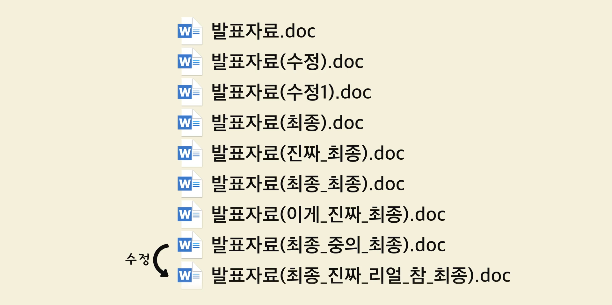

  근데 문제가 있음. 파일 중에 어떤 내용이 수정됬는지 알 수가 없음. 중간 내용을 보고 싶어도 이중에 어떤 파일을 봐야 하는지 알 수가 없음. 아마도 모든 파일을 열어봐야 함. 

  

  이런 일을 방지하려면 버전관리를 해야 함. 

  **버전관리란?** 파일의 변화를 시간에 따라서 기록했다가, 나중에 특정 시점의 버전을 다시 꺼내올 수 있는 시스템. 

  

  버전관리 안하고 계속 같은 파일 수정하고 있으면 잘못되기 이전으로 돌아갈 수가 없음. 

  git은 아주 편리하게 버전관리를 해줌. 매번 작성했던 코드의 모습을 하나의 모습으로 저장할 수 있게 해준다 .

  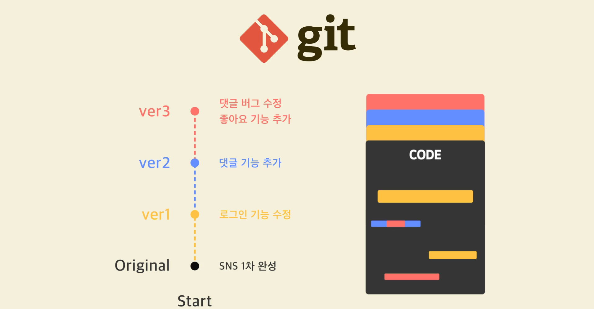

  

- #### Git의 역사

  깃은 누가 만들었을까요? 바로 [리누스 토발즈(Linus Torvalds)](https://ko.wikipedia.org/wiki/리누스_토르발스)라는 사람이 만들었습니다. 

  리누스 토발즈는 리눅스(Linux)라고 하는 운영 체제를 만든 사람인데요.

  혹시 운영 체제가 뭔지, 리눅스가 뭔지 모르는 분은 코드잇의 다음 레슨들을 참고하세요.

  - 운영 체제 : https://www.codeit.kr/learn/courses/intro-to-computer/2600
  - 리눅스 : https://www.codeit.kr/learn/courses/unix-command-line/2668

  리누스 토발즈는 리눅스를 만든 이후에 BitKeeper라고 하는 툴(Tool)로 리눅스의 각 버전들(ver1, ver2, ver3 ...)을 관리하고 있었습니다.

  그런데 리눅스 커뮤니티의 개발자 한 명이 BitKeeper의 내부 동작 원리를 분석하려고 했던 일을 계기로 리눅스 커뮤니티와 BitKeeper 측의 사이가 틀어지게 되었습니다. 이때문에 리눅스 커뮤니티 측에 대해서 BitKeeper는 유료화되었고, 리누스 토발즈는 BitKeeper를 대신할 다른 버전 관리 시스템을 찾아보기 시작했죠. 하지만 자신의 마음에 드는 버전 관리 툴을 찾지 못했고, 그래서 리누스 토발즈는 본인이 직접 버전 관리 프로그램을 만들어버렸습니다. 정말 대단한 사람이죠? 이렇게 만들어진 버전 관리 프로그램이 바로 깃입니다.

  깃은 당시에 아래와 같은 목표를 갖고 설계 및 제작되었는데요.

  - 빠른 속도 
  - 단순한 디자인
  - 비선형적 개발 지원(수천 개의 브랜치를 병행할 수 있음, 브랜치가 뭔지는 나중 챕터에서 배웁니다.)
  - 완전 분산형 시스템 
  - 리눅스와 같은 거대한 프로젝트도 속도 저하의 문제없이 관리할 수 있는 시스템

  깃은 버전 관리(Version Control), 협업(Cooperation)에 필요한 여러 요소들이 고려되었기 때문에, 사용성이 굉장히 좋은 프로그램이 될 수 있었습니다. 

  그럼 왜 깃(git)이라는 이름이 붙었을까요? 리누스 토발즈가 깃을 맨 처음 만들었을 때 남겼던 기록을 보면 힌트를 얻을 수 있는데요. 그 기록은 아래 그림과 같습니다. 

  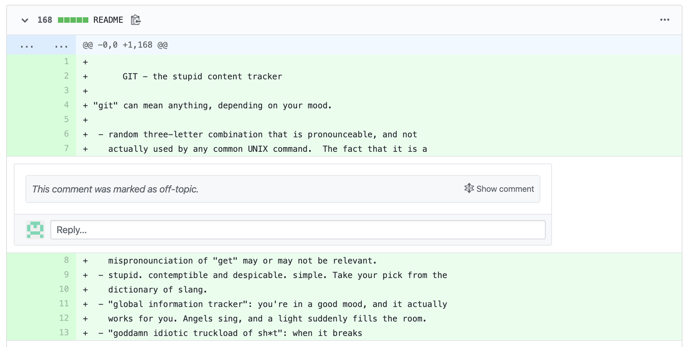

  위 그림의 내용을 간단히 번역하면 다음과 같습니다. 

  "깃은 당신의 마음에 따라 그 어떤 것으로도 해석될 수 있습니다. 

  \1. [유닉스 커맨드](https://www.codeit.kr/courses/unix-command-line/topics/unix-commands)에서 사용되는 명령어 이름을 제외한 랜덤한 알파벳 3글자의 조합

  \2. 멍청하고 단순한(이런 특성을 지닌 아무 단어로 해석되어도 좋다는 의미)

  \3. global information tracker의 약자

  \4. goddamn idiotic truckload of sh*t 이라는 욕설의 약자"

  이렇게 깃이라는 이름은 처음 만들어질 때부터 다양한 의미로 해석될 가능성을 갖고 탄생했습니다. 뭔가 리누스 토발즈의 독특함이 느껴지는 부분인데요. 혹시 이 기록을 직접 살펴보고 싶으신 분은 [이 링크](https://github.com/git/git/commit/e83c5163316f89bfbde7d9ab23ca2e25604af290)를 클릭해보세요. 

- #### Github란?

  깃을 사용하면, 다른 컴퓨터로 코드를 보낼 수 있음. 즉, **백업본을 만들 수 있다는 것**. 근데 다른 컴퓨터는 그러면 어딨어?

  내가 직접 준비하려면 번거로워. 

  

  

  이 외부 컴퓨터를 따로 사용하지 않아도, 작업한 내용을 저장하게 해주는 가장 대표적인 서비스가 **깃허브**. 

  

  **깃은 버전관리를 하는 프로그램.**

  **깃으로 관리하는 프로젝트를 올려둘 수 있는 사이트가 깃허브 인 것.** 깃허브는 외부의 컴퓨터를 대신 만들어 주는 서비스로, 즉, 원격저장소를 제공하는 서비스이다. 

  

   또한 작업물을 다른 컴퓨터로 보내는 것의 또다른 장점은, 다른 사람과의 협업이 가능해 진다는 것. 

  

  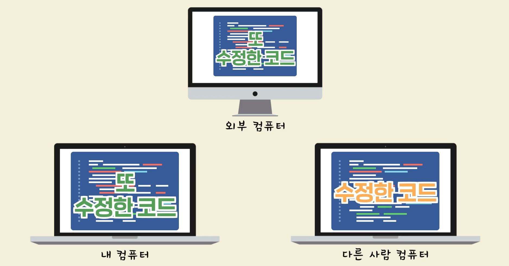

- #### git 설치하기. 

  자, 이제 맥에서 Git을 설치해보겠습니다. 

  일단, 자신의 맥에 **Xcode**라는 프로그램이 이미 설치된 경우에는 이미 Git도 함께 설치되어 있습니다. 이런 경우에는 아래 설명 중 가장 마지막 단계인 터미널을 실행하고 git이라고 치고 실행하는 부분만 따라하시면 됩니다. 

  만약 Xcode가 설치되어 있지 않다면 Git을 직접 설치해줘야 하는데요.

  그 전에 brew라고 하는 ‘맥에서 외부 프로그램을 설치해주는 프로그램’을 먼저 설치해봅시다. 

  **1. brew 설치하기**

  brew라는 프로그램을 설치해보겠습니다. 사실 이 부분은 코드잇의 [‘유닉스 커맨드’ 토픽의 ‘**02. macOS에서 homebrew 사용하기’** 영상](https://www.codeit.kr/learn/courses/unix-command-line/2724)에서 해본 적이 있는데요. 그 영상 또는 아래 내용을 따라해서 brew를 설치해보세요. 

  1. brew는 사실 **Homebrew**의 줄임말인데요. [Homebrew 설치 페이지](https://brew.sh/)로 갈게요. 그럼 이런 화면을 볼 수 있습니다.

     

  2. 여기서 Install Homebrew 밑에 있는 길다란 커맨드를 복사하세요. 

     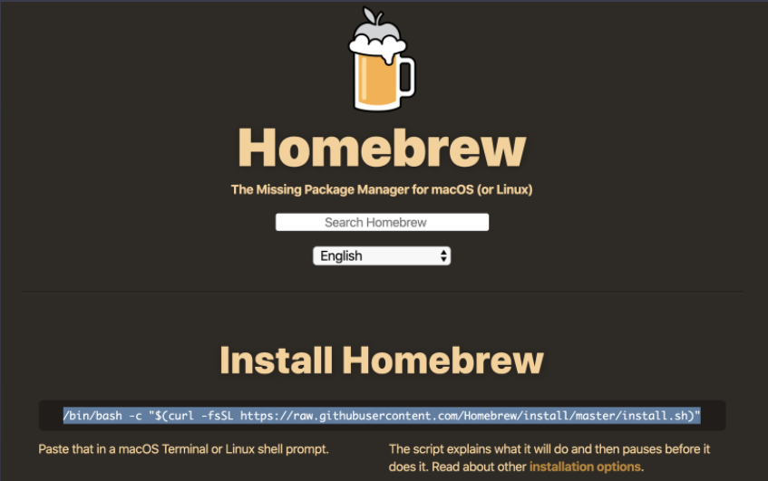

  3. 그런 다음 맥에서 **terminal**이라고 검색해서 나오는 검은색 창 아이콘을 클릭하세요. 

     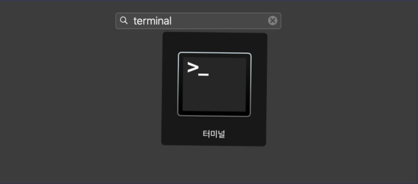

  4. 터미널 화면이 보이죠?

     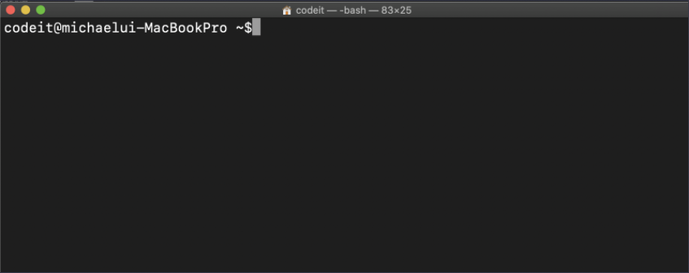

  5. 여기서 방금 복사했던 커맨드를 붙여넣기하세요. 그리고 엔터를 치세요.

     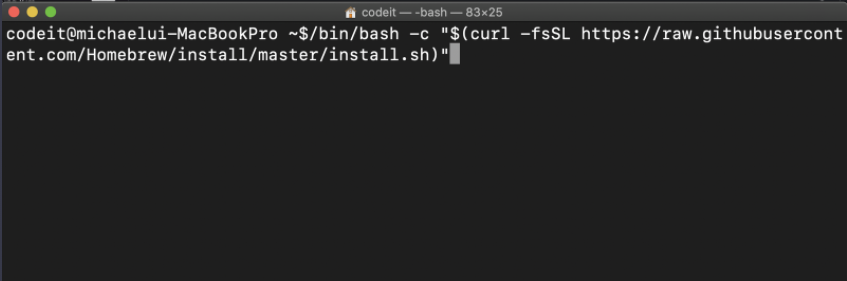

  6. 이 단계에서 다시 엔터를 치세요. 

     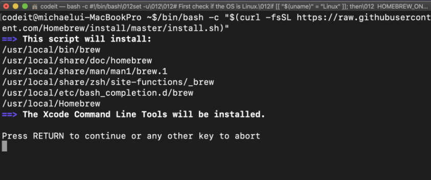

  7. 그 다음 뜨는 Password 부분에 여러분의 맥 사용자 비밀번호를 입력하고 엔터를 치세요.

     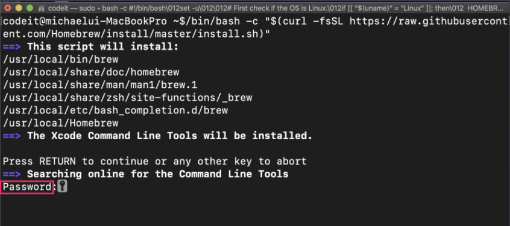

  8. 조금 기다리고 나면 아래와 같은 화면이 뜨면서 설치가 완료됩니다. brew가 잘 설치된 겁니다. 

     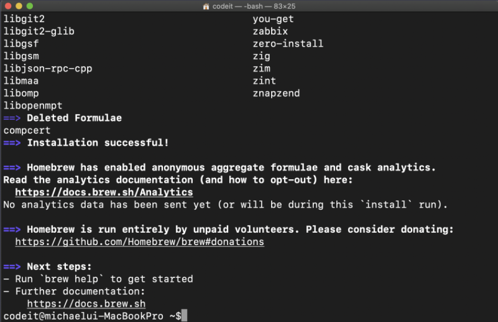

# 2. brew로 git 설치하기 

1. brew로 git을 설치하려면 **brew install git**이라고 쓰고 실행하면 됩니다. 

   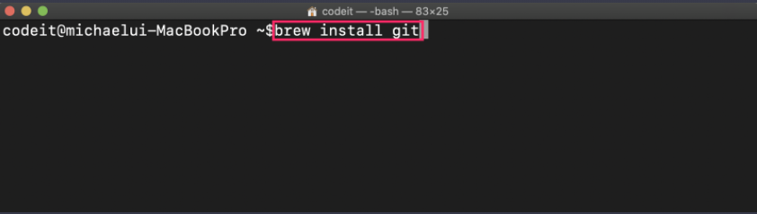

2. 조금 기다리면 아래와 같은 화면이 뜨면서 git 설치가 완료됩니다. 

   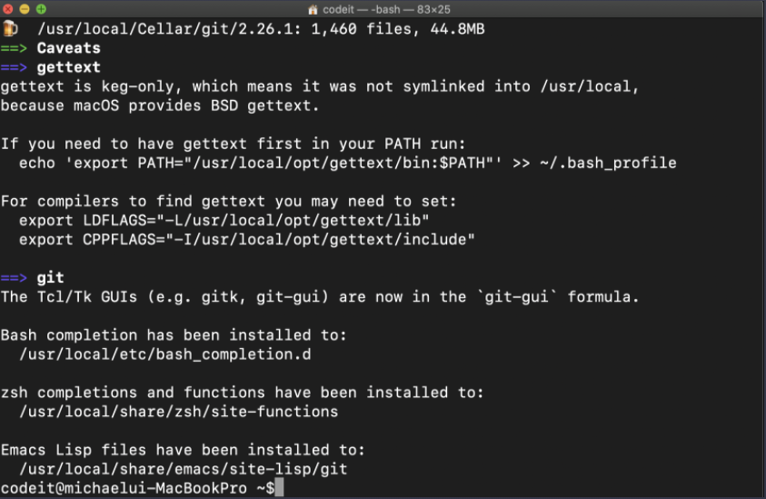

3. git이 정상 설치되었는지 확인하려면, 터미널에 **git**이라고 쓰고 엔터를 쳐보면 됩니다. 그 때 아래와 같이 git의 사용법이 출력된다면, 잘 설치된 겁니다. 

   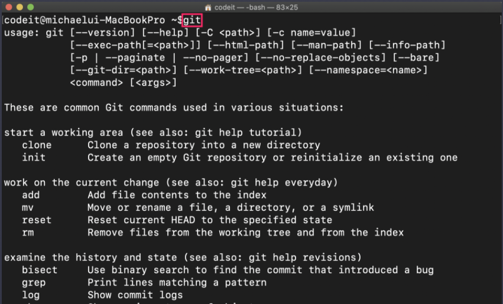

   앞으로 이 터미널 화면에서 Git을 배울 건데요. Git 토픽은 선이수 과목으로 코드잇의 '[유닉스 커맨드' 토픽](https://www.codeit.kr/courses/unix-command-line/topics/unix-commands)을 가집니다. 그래서 기본적인 유닉스 커맨드는 여러분이 알고 있다고 가정하고 내용이 진행되는데요. 혹시 영상의 내용을 보다가 이해가 안 되는 커맨드가 있다면 유닉스 커맨드 토픽에서 관련 부분을 다시 보고 와주세요.

# 3. git 정보 예쁘게 보이도록 사전 세팅

자, 본격적으로 git 공부를 시작하기 전에 한 가지 작업만 더 하겠습니다. 사실 지금 바로 터미널로 git을 배워도 됩니다. 하지만 

- 터미널에 표시되는 사용자 정보, 현재 경로가 조금 더 잘 드러나게 하고,
- 나중에 git에 관해서 배울 개념인 브랜치(branch)라는 것의 이름이 터미널에서 보이도록 설정을 해주면 git을 배울 때 더 손쉽게 이해할 수 있는데요. 

이런 설정을 자동으로 해주는 파일을 코드잇에서 준비했습니다. 다음 단계에 따라서 터미널을 예쁘게 꾸며봅시다. 

1. 첨부된 아래 파일을 다운로드받으세요.(파일 이름 : git-bash-for-mac.sh)

- [git-bash-for-mac.sh](https://bakey-api.codeit.kr/files/2883/yMIl2O?name=git-bash-for-mac.sh)

2. 그 다음 다운로드받은 파일을 실행해볼건데요. 

   이때 어떤 사용자는 약간의 추가 작업을 더 해줘야 합니다. 터미널에서 아래 그림과 같이 **echo $SHELL** 이라고 쓰고 실행해보세요.

   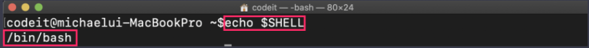

   이때 위 그림처럼 **/bin/bash** 라고 출력된다면 바로 다음 단계로 넘어가세요.

   그런데 만약

   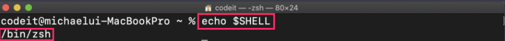

   이런 식으로 **/bin/bash**가 아닌 다른 결과가 출력된다면 다음 작업을 수행해줘야 합니다.

   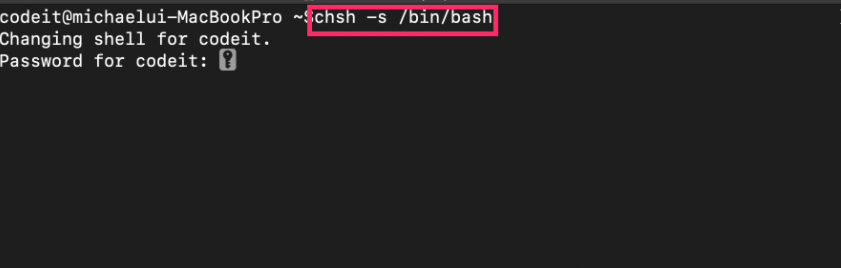

   터미널에 **chsh -s /bin/bash** 라고 쓰고 엔터를 치세요. 

   방금 저는 사용자가 사용하는 기본 쉘을 바꾼 건데요. **터미널을 완벽하게 종료하고 다시 실행하세요.** 그리고 다음 단계로 넘어가세요.

   *우리가 터미널을 사용하는 것은 결국 '쉘(shell)'이라고 하는 컴퓨터 내의 핵심 프로그램과 대화하는 과정인데요. 지금 **git-bash-for-mac.sh** 파일은 zsh이 아니라 bash라고 하는 종류의 쉘로 실행해야해서 이런 단계가 필요한 겁니다. 아직 여러분이 쉘에 대해 확실하게 이해하기는 어려운 단계이기 때문에 일단은 이렇게 이해하고 넘어가주세요.

   

3. 그 다음 아래 그림과 같이 git-bash-for-mac.sh 파일을 다운로드받은 위치로 가서, **source git-bash-for-mac.sh** 라고 쓰고 실행하세요.

   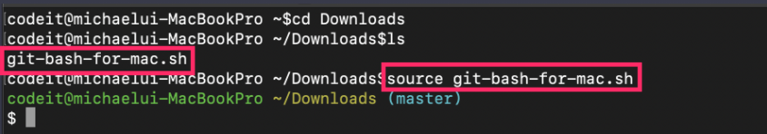

4. 아래처럼 터미널 창에 색이 입혀진다면 성공입니다! 지금 예쁘게 색이 입혀진 부분을 보통 '명령 프롬프트 라인(command prompt line)'이라고 합니다. 이렇게 예쁘게 보인다는 건 **git-bash-for-mac.sh** 파일이 잘 실행됐다는 증거입니다.)

   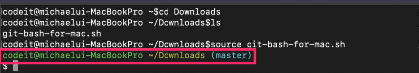

5. 그리고 나서 **git-bash-for-mac.sh** 파일을 home 디렉토리(~)로 옮겨주세요.

   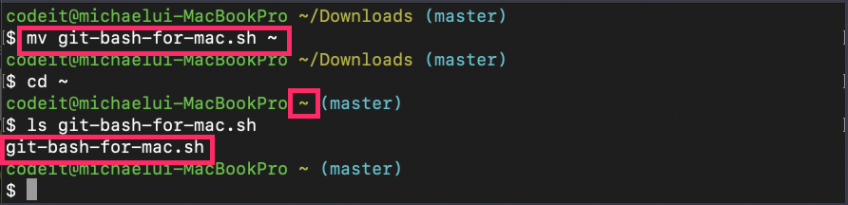

6. 그리고 나서 터미널 > 환경설정 메뉴로 들어가주세요.

   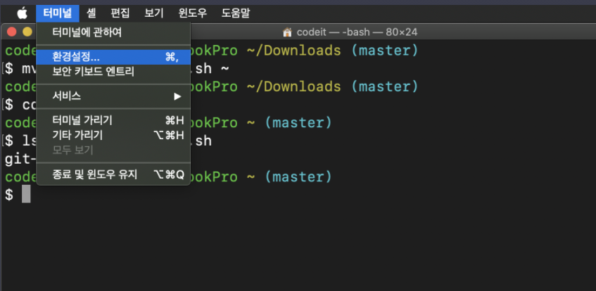

7. 환경 설정의 프로파일 탭을 눌러주신 후, 메뉴 하단의 + 버튼을 클릭해주세요.

   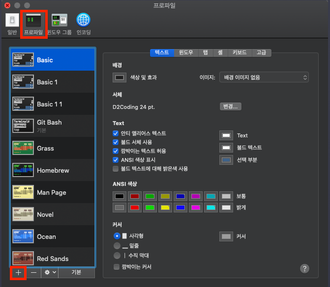

8. 그리고 새로운 프로파일에다가 "Git bash"라고 적어준 뒤, 기본 버튼을 눌러주시면 됩니다. 그럼 이 설정이 이제 터미널의 기본 설정이 됩니다.

   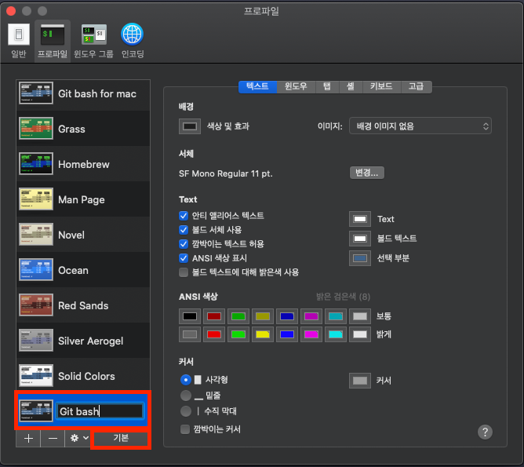

   9.  그리고 오른쪽에 쉘 탭을 클릭하시고, 명령어 실행 칸에 `**source git-bash-for-mac.sh**`를 적어주세요. 방금 실행해봤던 커맨드죠? 이제 터미널이 열릴 때마다 이 명령어가 자동으로 실행되도록 설정하는 것입니다.

      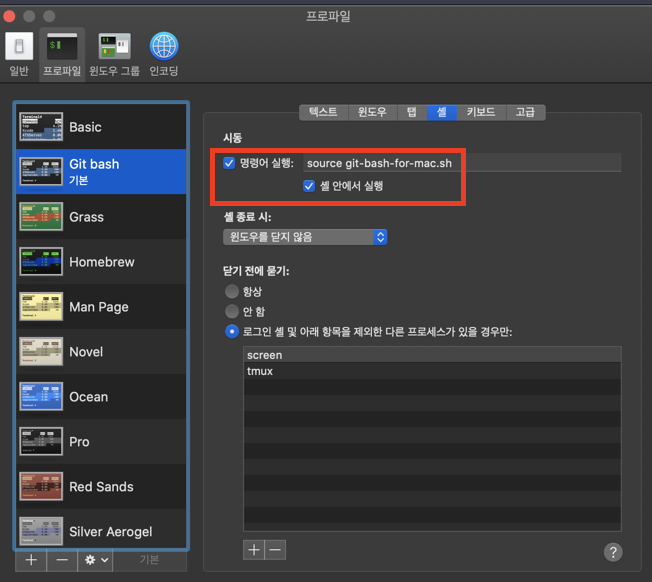

      10. 이제 터미널을 껐다 켜도 명령 프롬프트 라인이 이쁘게 꾸며집니다.

          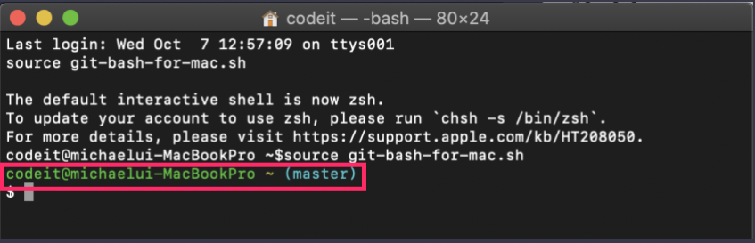

   이제 Git을 배울 때, 최적화된 터미널 UI를 준비했습니다. 열심히 Git을 배워봅시다. 

