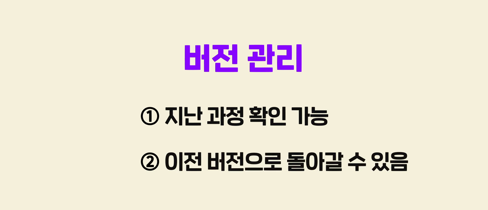
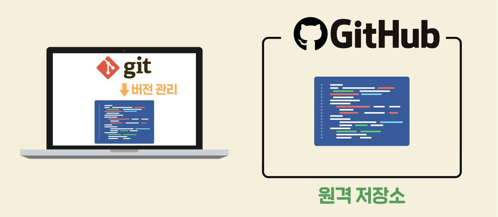
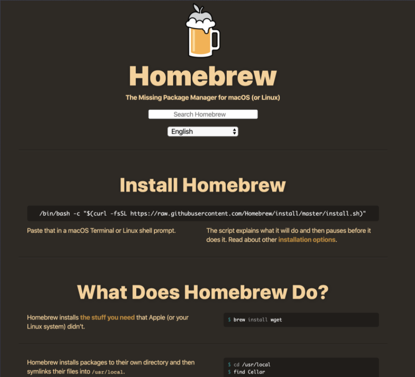
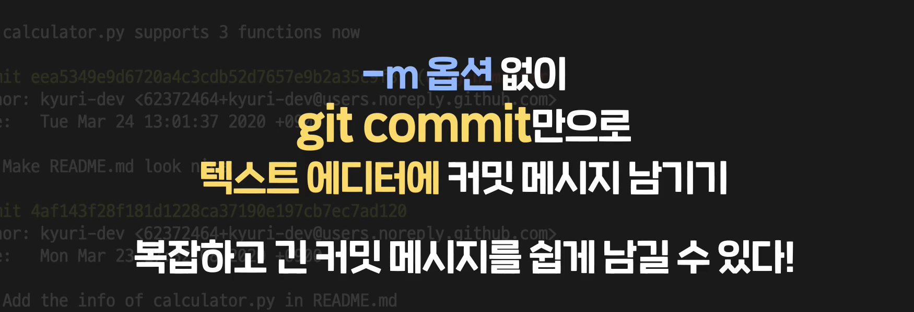
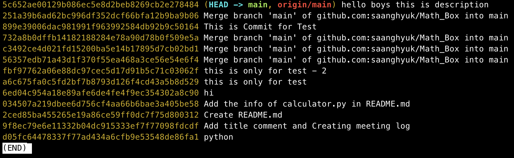

# Git 

| Command                                                      | 기능                                                         | 비고 |
| ------------------------------------------------------------ | ------------------------------------------------------------ | ---- |
| git init                                                     | git 시작하기                                                 |      |
| git status                                                   | Untracked/Modified/Unmodified/Staged 상태 확인               |      |
| **git add [파일 이름]**<br>**git add [디렉토리명]**          | **staged** 상태로 만들기. stating area에 올리기              |      |
| git commit -m "msg"                                          | **staging area** -> repository 로 옮기기. <br>m옵션안주고 그냥 커밋 한다음에, # 위에다가 커밋 메세지랑 설명 쓰면 된다. |      |
| git config user.email "email" <br>git config user.name "name" | 처음 커밋 하려면, 커밋하는 사람의 정보가 필요하다. 해당 정보를 입력해 줘야 한다. |      |
| git reset "파일이름"                                         | staging area에 올렸던 파일을 취소하는 것. working directory에는 그대로 남아있다. |      |
| **git help** [알고 싶은 커맨드의 이름]<br>**man git-**[알고 싶은 커맨드] | 특정 명령어가 궁금할 때                                      |      |
| git push                                                     | local repository에서 Remote repositry로 .git파일을 보내는 것. |      |
| git pull                                                     | Remote repositry의 수정사항을 local repository로 반영하는 것. |      |
| git clone                                                    | 다른 프로젝트 통으로 가져오기.                               |      |
| git log                                                      | commit history `git log --pretty=oneline` online은 한줄에 하나씩 보겠다는 옵션 |      |
| git show 커밋아이디                                          | 특정 커밋에 무슨 일이 있었는지를 볼 수 있음. 커밋 아이디는 4자리만 쓰면 탭도 필요없이 알아서 가져옴. 빨간색이 과거, 초록색이 해당 커밋. |      |
| git commit --amend                                           | 가장 최근 커밋을 수정하는 방법. 누르면, VI이 뜨는데 거기서 커밋 메세지 수정하면 됨(물론 수정 안해도 됨. 저장하면 커밋이 수정되는 형태). 첫줄은 커밋 메세지, 아래로 한줄 띄고 쓰는 것은 description<br>git commit --amend 이후에 Push 에러가 남 `git push --force`로 하면 됨 |      |
| git config alias.history 'log --pretty=oneline'              | alias정할 수가 있다. git log --prety=online을 git history로 쓰겠다는 것. |      |
| gif diff 이전커밋 이후커밋                                   | 빨간색이 이전 커밋의 모습, 초록색이 이후 커밋의 모습         |      |
| git reset --hard 커밋아이디(옵션 3가지 하단 참조)            | 해당 커밋으로 돌아가기. working directory도 싹다 거기로 돌아간다. <br> **HEAD~x**는 현재 HEAD가 가리키는 커밋보다 **x****단계 전에 있는 커밋**을 말합니다. <br> HEAD^를 쓰면 바로 이전 커밋을 나타낸다. |      |
| **git tag [태그 이름] [커밋 아이디]**                        | c중요한 부분에서는 커밋 매세지 뿐만이 아니라 태그를 남겨놓기도 한다. git tag하면 태그달아놓은 애들이 보인다. 추후에 보고 싶으면, **git show 태그명** 이렇게 쓰면 된다. 이 태그를 추후에 아이디 대신 쓸 수 있는 것. |      |
| git commit -am "Commit Message"                              | 커밋하면서 같이 add                                          |      |
|                                                              |                                                              |      |


- #### Git이란?

  

  과제 등을 할 때, 이전 완성본이 필요할까봐 이전 완성본을 남겨두고 작업하는 경우가 많음. 

  

  근데 문제가 있음. 파일 중에 어떤 내용이 수정됬는지 알 수가 없음. 중간 내용을 보고 싶어도 이중에 어떤 파일을 봐야 하는지 알 수가 없음. 아마도 모든 파일을 열어봐야 함. 

  

  이런 일을 방지하려면 버전관리를 해야 함. 

  **버전관리란?** 파일의 변화를 시간에 따라서 기록했다가, 나중에 특정 시점의 버전을 다시 꺼내올 수 있는 시스템. 

  

  버전관리 안하고 계속 같은 파일 수정하고 있으면 잘못되기 이전으로 돌아갈 수가 없음. 

  git은 아주 편리하게 버전관리를 해줌. 매번 작성했던 코드의 모습을 하나의 모습으로 저장할 수 있게 해준다 .

  

  

- #### Git의 역사

  깃은 누가 만들었을까요? 바로 [리누스 토발즈(Linus Torvalds)](https://ko.wikipedia.org/wiki/리누스_토르발스)라는 사람이 만들었습니다. 

  리누스 토발즈는 리눅스(Linux)라고 하는 운영 체제를 만든 사람인데요.

  혹시 운영 체제가 뭔지, 리눅스가 뭔지 모르는 분은 코드잇의 다음 레슨들을 참고하세요.

  - 운영 체제 : https://www.codeit.kr/learn/courses/intro-to-computer/2600
  - 리눅스 : https://www.codeit.kr/learn/courses/unix-command-line/2668

  리누스 토발즈는 리눅스를 만든 이후에 BitKeeper라고 하는 툴(Tool)로 리눅스의 각 버전들(ver1, ver2, ver3 ...)을 관리하고 있었습니다.

  그런데 리눅스 커뮤니티의 개발자 한 명이 BitKeeper의 내부 동작 원리를 분석하려고 했던 일을 계기로 리눅스 커뮤니티와 BitKeeper 측의 사이가 틀어지게 되었습니다. 이때문에 리눅스 커뮤니티 측에 대해서 BitKeeper는 유료화되었고, 리누스 토발즈는 BitKeeper를 대신할 다른 버전 관리 시스템을 찾아보기 시작했죠. 하지만 자신의 마음에 드는 버전 관리 툴을 찾지 못했고, 그래서 리누스 토발즈는 본인이 직접 버전 관리 프로그램을 만들어버렸습니다. 정말 대단한 사람이죠? 이렇게 만들어진 버전 관리 프로그램이 바로 깃입니다.

  깃은 당시에 아래와 같은 목표를 갖고 설계 및 제작되었는데요.

  - 빠른 속도 
  - 단순한 디자인
  - 비선형적 개발 지원(수천 개의 브랜치를 병행할 수 있음, 브랜치가 뭔지는 나중 챕터에서 배웁니다.)
  - 완전 분산형 시스템 
  - 리눅스와 같은 거대한 프로젝트도 속도 저하의 문제없이 관리할 수 있는 시스템

  깃은 버전 관리(Version Control), 협업(Cooperation)에 필요한 여러 요소들이 고려되었기 때문에, 사용성이 굉장히 좋은 프로그램이 될 수 있었습니다. 

  그럼 왜 깃(git)이라는 이름이 붙었을까요? 리누스 토발즈가 깃을 맨 처음 만들었을 때 남겼던 기록을 보면 힌트를 얻을 수 있는데요. 그 기록은 아래 그림과 같습니다. 

  

  위 그림의 내용을 간단히 번역하면 다음과 같습니다. 

  "깃은 당신의 마음에 따라 그 어떤 것으로도 해석될 수 있습니다. 

  \1. [유닉스 커맨드](https://www.codeit.kr/courses/unix-command-line/topics/unix-commands)에서 사용되는 명령어 이름을 제외한 랜덤한 알파벳 3글자의 조합

  \2. 멍청하고 단순한(이런 특성을 지닌 아무 단어로 해석되어도 좋다는 의미)

  \3. global information tracker의 약자

  \4. goddamn idiotic truckload of sh*t 이라는 욕설의 약자"

  이렇게 깃이라는 이름은 처음 만들어질 때부터 다양한 의미로 해석될 가능성을 갖고 탄생했습니다. 뭔가 리누스 토발즈의 독특함이 느껴지는 부분인데요. 혹시 이 기록을 직접 살펴보고 싶으신 분은 [이 링크](https://github.com/git/git/commit/e83c5163316f89bfbde7d9ab23ca2e25604af290)를 클릭해보세요. 


- #### Github란?

  깃을 사용하면, 다른 컴퓨터로 코드를 보낼 수 있음. 즉, **백업본을 만들 수 있다는 것**. 근데 다른 컴퓨터는 그러면 어딨어?

  내가 직접 준비하려면 번거로워. 

  

  

  이 외부 컴퓨터를 따로 사용하지 않아도, 작업한 내용을 저장하게 해주는 가장 대표적인 서비스가 **깃허브**. 

  

  **깃은 버전관리를 하는 프로그램.**

  **깃으로 관리하는 프로젝트를 올려둘 수 있는 사이트가 깃허브 인 것.** 깃허브는 외부의 컴퓨터를 대신 만들어 주는 서비스로, 즉, 원격저장소를 제공하는 서비스이다. 

  

   또한 작업물을 다른 컴퓨터로 보내는 것의 또다른 장점은, 다른 사람과의 협업이 가능해 진다는 것. 

  

  


- #### git 설치하기. 

  자, 이제 맥에서 Git을 설치해보겠습니다. 

  일단, 자신의 맥에 **Xcode**라는 프로그램이 이미 설치된 경우에는 이미 Git도 함께 설치되어 있습니다. 이런 경우에는 아래 설명 중 가장 마지막 단계인 터미널을 실행하고 git이라고 치고 실행하는 부분만 따라하시면 됩니다. 

  만약 Xcode가 설치되어 있지 않다면 Git을 직접 설치해줘야 하는데요.

  그 전에 brew라고 하는 ‘맥에서 외부 프로그램을 설치해주는 프로그램’을 먼저 설치해봅시다. 

  **1. brew 설치하기**

  brew라는 프로그램을 설치해보겠습니다. 사실 이 부분은 코드잇의 [‘유닉스 커맨드’ 토픽의 ‘**02. macOS에서 homebrew 사용하기’** 영상](https://www.codeit.kr/learn/courses/unix-command-line/2724)에서 해본 적이 있는데요. 그 영상 또는 아래 내용을 따라해서 brew를 설치해보세요. 

  1. brew는 사실 **Homebrew**의 줄임말인데요. [Homebrew 설치 페이지](https://brew.sh/)로 갈게요. 그럼 이런 화면을 볼 수 있습니다.

     

  2. 여기서 Install Homebrew 밑에 있는 길다란 커맨드를 복사하세요. 

     

  3. 그런 다음 맥에서 **terminal**이라고 검색해서 나오는 검은색 창 아이콘을 클릭하세요. 

     

  4. 터미널 화면이 보이죠?

     

  5. 여기서 방금 복사했던 커맨드를 붙여넣기하세요. 그리고 엔터를 치세요.

     

  6. 이 단계에서 다시 엔터를 치세요. 

     

  7. 그 다음 뜨는 Password 부분에 여러분의 맥 사용자 비밀번호를 입력하고 엔터를 치세요.

     

  8. 조금 기다리고 나면 아래와 같은 화면이 뜨면서 설치가 완료됩니다. brew가 잘 설치된 겁니다. 

     

# 2. brew로 git 설치하기 

1. brew로 git을 설치하려면 **brew install git**이라고 쓰고 실행하면 됩니다. 

   

2. 조금 기다리면 아래와 같은 화면이 뜨면서 git 설치가 완료됩니다. 

   

3. git이 정상 설치되었는지 확인하려면, 터미널에 **git**이라고 쓰고 엔터를 쳐보면 됩니다. 그 때 아래와 같이 git의 사용법이 출력된다면, 잘 설치된 겁니다. 

   

   앞으로 이 터미널 화면에서 Git을 배울 건데요. Git 토픽은 선이수 과목으로 코드잇의 '[유닉스 커맨드' 토픽](https://www.codeit.kr/courses/unix-command-line/topics/unix-commands)을 가집니다. 그래서 기본적인 유닉스 커맨드는 여러분이 알고 있다고 가정하고 내용이 진행되는데요. 혹시 영상의 내용을 보다가 이해가 안 되는 커맨드가 있다면 유닉스 커맨드 토픽에서 관련 부분을 다시 보고 와주세요.

# 3. git 정보 예쁘게 보이도록 사전 세팅

자, 본격적으로 git 공부를 시작하기 전에 한 가지 작업만 더 하겠습니다. 사실 지금 바로 터미널로 git을 배워도 됩니다. 하지만 

- 터미널에 표시되는 사용자 정보, 현재 경로가 조금 더 잘 드러나게 하고,
- 나중에 git에 관해서 배울 개념인 브랜치(branch)라는 것의 이름이 터미널에서 보이도록 설정을 해주면 git을 배울 때 더 손쉽게 이해할 수 있는데요. 

이런 설정을 자동으로 해주는 파일을 코드잇에서 준비했습니다. 다음 단계에 따라서 터미널을 예쁘게 꾸며봅시다. 

1. 첨부된 아래 파일을 다운로드받으세요.(파일 이름 : git-bash-for-mac.sh)

- [git-bash-for-mac.sh](https://bakey-api.codeit.kr/files/2883/yMIl2O?name=git-bash-for-mac.sh)

2. 그 다음 다운로드받은 파일을 실행해볼건데요. 

   이때 어떤 사용자는 약간의 추가 작업을 더 해줘야 합니다. 터미널에서 아래 그림과 같이 **echo $SHELL** 이라고 쓰고 실행해보세요.

   

   이때 위 그림처럼 **/bin/bash** 라고 출력된다면 바로 다음 단계로 넘어가세요.

   그런데 만약

   

   이런 식으로 **/bin/bash**가 아닌 다른 결과가 출력된다면 다음 작업을 수행해줘야 합니다.

   

   터미널에 **chsh -s /bin/bash** 라고 쓰고 엔터를 치세요. 

   방금 저는 사용자가 사용하는 기본 쉘을 바꾼 건데요. **터미널을 완벽하게 종료하고 다시 실행하세요.** 그리고 다음 단계로 넘어가세요.

   *우리가 터미널을 사용하는 것은 결국 '쉘(shell)'이라고 하는 컴퓨터 내의 핵심 프로그램과 대화하는 과정인데요. 지금 **git-bash-for-mac.sh** 파일은 zsh이 아니라 bash라고 하는 종류의 쉘로 실행해야해서 이런 단계가 필요한 겁니다. 아직 여러분이 쉘에 대해 확실하게 이해하기는 어려운 단계이기 때문에 일단은 이렇게 이해하고 넘어가주세요.

   

3. 그 다음 아래 그림과 같이 git-bash-for-mac.sh 파일을 다운로드받은 위치로 가서, **source git-bash-for-mac.sh** 라고 쓰고 실행하세요.

   

4. 아래처럼 터미널 창에 색이 입혀진다면 성공입니다! 지금 예쁘게 색이 입혀진 부분을 보통 '명령 프롬프트 라인(command prompt line)'이라고 합니다. 이렇게 예쁘게 보인다는 건 **git-bash-for-mac.sh** 파일이 잘 실행됐다는 증거입니다.)

   

5. 그리고 나서 **git-bash-for-mac.sh** 파일을 home 디렉토리(~)로 옮겨주세요.

   

6. 그리고 나서 터미널 > 환경설정 메뉴로 들어가주세요.

   

7. 환경 설정의 프로파일 탭을 눌러주신 후, 메뉴 하단의 + 버튼을 클릭해주세요.

   

8. 그리고 새로운 프로파일에다가 "Git bash"라고 적어준 뒤, 기본 버튼을 눌러주시면 됩니다. 그럼 이 설정이 이제 터미널의 기본 설정이 됩니다.

   

   9.  그리고 오른쪽에 쉘 탭을 클릭하시고, 명령어 실행 칸에 `**source git-bash-for-mac.sh**`를 적어주세요. 방금 실행해봤던 커맨드죠? 이제 터미널이 열릴 때마다 이 명령어가 자동으로 실행되도록 설정하는 것입니다.

      

      10. 이제 터미널을 껐다 켜도 명령 프롬프트 라인이 이쁘게 꾸며집니다.

          

   이제 Git을 배울 때, 최적화된 터미널 UI를 준비했습니다. 열심히 Git을 배워봅시다. 


- #### Repository와 Commit

  레포지토리는 저장소. 우리가 어떤 프로젝트를 하면, 어떤 디렉토리를 만들고 거기에 관련된 파일 등을 다 모아 놓겠지. 이때 깃으로 **프로젝트 디렉토리의 버전을 관리하기 시작하면**, 원하는 시점마다 그 디렉토리 안에 어떤 것들이 있는지 그것들의 내용이 어떻게 변해가는지를 기록할 수 있음. 

  깃이 이런 정보들을 기록하는 곳을 **레포지토리**라고 한다. 

  즉, 레포지토리 안에는 프로젝트의 초창기 모습부터 최근 모습까지가 다 들어 있지. 

  

  깃을 쓰면, 프로젝트 디렉토리 안에, .git이라는 **디렉토리**가 만들어진다. 이 .git 디렉토리가 바로 레포지토리임. 

  어떤 사람들은 프로젝트 디렉토리 자체를 레포지토리라고 하는 경우도 있다. 정확히 말하면, 프로젝트의 변경사항들이 저장되 있는 **.git** 디렉토리가 **레포지토리**이다. 

  

  **두번째는 커밋.**

  프로젝트 디렉토리에서 이런저런 작업을 하다 보면, "지금 모습이 하나의 버전으로 남겨지면 좋겠다"는 순간이 있음. 

  

   이때 프로젝트 디렉토리의 모습을 하나의 버전으로 남기는 그 모습을 "**커밋한다**"라고 말한다. 커밋을 하면, 딱 그때의 모습이 사진처럼 담긴다. 그 고정된 결과물 자체도 커밋이라고 한다. 

  

  

  이런 커밋을 통해서 우리가 버전관리를 할 수 있게 되는 것. 

  


- #### Repository 만들기

  일단 새로운 디렉토리를 만듬. 

  

  **Initialized empty Git repository**

  ```
  git init
  ```

  

  git이 여기서 뭔가 복잡한 작업을 하면서 버전을 관리하는구나 하면 됨. 

  

  이제 아래를 첫번째 버전으로 추가해 보자. 

  

  바로 이럴 때 Commit을 하면 된다. 그러나, 첫 Commit을 하기 전에 꼭 해줘야 하는 것이 있다. 바로 git에게 내가 누군인지 알려주기. Commit은 항상 누가 했는지 기록되야 함. 

  

  

  이제 Commit 해보자. 

  그런데 Commit에는 또 Commit message가 필요하다. 

  

  commit을 하기 위해 add 된게 하나도 없다고 나옴. 그리고 unstracked된 파일들이 있다고 나옴.  아직 git으로 뭘 한적이 없어서, **버전관리 대상이 아닌 것**. 

  

  

  **Commit을 하기 전에는 항상 Commit 할 파일을 지정해 줘야 한다. 이게 매우 핵심이다** 

  

  이런 사전 작업을 add라고 한다. add를 함으로써, 이 파일들을 커밋 할 것이라 지정하는 것. 

  

  Root Commit 이라는 말은 프로젝트의 첫번째 커밋이라는 뜻. 

  

  


- #### Git의 3가지 작업영역

  이전 영상에서는 내용을 수정한 파일 중에서 커밋에 반영하고 싶은 파일은 **git add**를 해야한다고 했습니다. 그런데 사실 이것과 관련해서 꼭 알아야할 사실이 하나 있습니다. 이 사실을 확실히 이해하고 암기해야 앞으로 깃을 사용할 때 어려움이 없습니다. 자, 그럼 설명할게요.

  Git은 내부적으로 크게 3가지 종류의 작업 영역을 두고 동작합니다.

  각 작업 영역의 이름은

  1. **working directory**
  2. **staging area**
  3. **repository**

  입니다. 순서대로 하나씩 설명해드릴게요.

  첫 번째 작업 영역인 **working directory**는 작업을 하는 프로젝트 디렉토리를 말합니다. 그러니까 지금 상황에서는 **MathTool 디렉토리**가 working directory입니다.

  두 번째 작업 영역인 **staging area**는 **git add**를 한 파일들이 존재하는 영역입니다. 커밋을 하게되면 **staging area**에 있는 파일들만 커밋에 반영됩니다.

  세 번째 작업 영역인 **repository**는 working directory의 변경 이력들이 저장되어 있는 영역입니다. 그러니까 커밋들이 저장되는 영역이라는 뜻인데요. 조금 풀어서 설명해볼게요.

  - working directory에서 뭔가 작업을 하고,
  - 작업한 파일들을 **git add** 해주고,
  - 커밋을 하면 staging area에 있던 파일들의 모습이 마치 영화의 한 장면, 스냅샷(snapshot)처럼 이 repository에 저장되는 겁니다.

  그리고 ['02. repository 만들기' 영상](https://www.codeit.kr/learn/2886/)에서 본 것처럼 실제로는 MathTool 디렉토리 안에 숨겨져 있던 **.git 디렉토리**가 repository입니다.

  3가지 작업 영역이 잘 이해되시나요? 좀더 잘 이해하기 위해 다음 그림을 봅시다.

  

  왼쪽부터 순서대로 working directory, staging area, repository가 있습니다. 다음과 같은 작업을 한 상태를 나타내는 그림인데요.

  1. working directory에서 A.txt 파일과 B.txt 파일을 작성하고 
  2. **git add A.txt**와 **git add B.txt**를 실행해서 A.txt, B.txt 둘다 staging area에 올렸습니다.
  3. 그 다음 **git commit -m "Ver_1"**를 실행해서 **staging area에 있는 파일들을 가져와 커밋으로 남겼습니다.** 

  Git에서 커밋을 할 때 어떤 식으로 일이 진행되는 건지 좀 이해되시죠?

  자, 작업을 좀더 해볼까요?

  

  이전 그림에서 작업을 좀더 하고 나서의 모습인데요. 다음과 같은 작업을 추가적으로 했습니다.

  1. working directory에서 A.txt 파일 내용에 Python~이라는 단어를 추가, B.txt 파일 내용에 Morning!이라는 단어를 추가했습니다. 
  2. 그런데 이번에는 **git add B.txt**만 실행해서 B.txt 파일만 staging area에 올렸습니다. 
  3. 그 다음 **git commit -m "Ver_2"**로 두 번째 커밋을 했습니다. 

  **이전 그림과 다른 점은 A.txt는 staging area에 올리지 않고, B.txt만 staging area에 올렸다는 점입니다.** 그랬더니 지금 repository에서 그 결과가 어떤가요? Ver_2 커밋을 보면 지금

  - A.txt는 staging area에 있던 모습, 그러니까 **수정하기 이전의 모습**이 Ver_2 커밋에 반영되었고
  - B.txt도 staging area에 있던 모습, 하지만 A.txt와는 달리 **수정한 이후의 모습**이 Ver_2 커밋에 반영되었습니다.

  A.txt, B.txt 둘다 working directory에서 수정했다는 사실은 같지만, **staging area에 올렸는지 여부에 따라 그 최신 모습이 커밋에 반영되는지가 달라지는 겁니다.** 바로 이 점이 Git을 사용할 때 잘 알고 기억해야하는 부분입니다.

  그런데 staging area가 굳이 왜 필요할까요? working directory에서 작업을 하고 git add할 필요없이 바로 커밋해버리는 구조가 더 편할 것 같은데 말이죠. 하지만 꼭 그렇지는 않습니다. 방금처럼 A.txt와 B.txt 파일을 둘다 수정했더라도 두 파일 모두 그 최신 모습을 다음 커밋에 반영하고 싶지 않을 수도 있습니다. 방금처럼 B.txt의 최신 모습만 그 다음 커밋에 반영하고 싶을 수도 있는 거죠. 이런 상황은 실제로 꽤 자주 있습니다. 만약 staging area가 없다면 원하는 것들만 선별적으로 커밋에 반영할 수 없게 됩니다. 그럼 좀더 세밀한 버전 관리를 할 수 없게 되는 거죠. 왜 staging area가 필요한지 알겠죠?

  자, 이때까지 Git의 3가지 작업 영역과 그 관계에 대해서 알아봤는데요. 이 부분은 몇 번을 강조해도 지나치지 않을만큼 중요한 핵심 개념입니다. 이 개념을 완벽히 이해해야 나머지 내용을 배우는데 어려움이 없습니다. 꼭 제대로 이해하고 넘어가세요.

  참고로 working directory는 working tree라고 하기도 하고, staging area는 index라고 할 때도 있습니다. 혹시 다른 곳에서 working tree, index 이런 단어를 쓰더라도 결국 다 우리가 배운 작업 영역들이니까 당황하지 마세요!


- #### Git add 더 자세히 알아보기

  수정은 License, calculator.py 둘다 해줬는데, Add는 calculator 파일만 해준 상태 

  

  

  

  이상태에서 커밋을 하면, License는 수정했어도 레포지토리에는 원래대로 저장되겠지 

  한번에 할때는, 

  `git add .`


- #### git이 보는 파일의 4가지 상태 

  이전 노트에서 Git의 3가지 작업 영역을 배웠습니다. 

  작업 영역과 관련해서 한 가지 더 알아두면 좋은 내용이 있는데요.

  그건 바로 Git으로 관리되는 파일은 일종의 '상태(status)'라는 걸 가진다는 사실입니다. 

  일단 Git에서 파일들은 크게 다음 2가지 상태를 가집니다.

  - *Untracked* 상태
  - *Tracked* 상태 

  그리고 **Tracked 상태는 다시 아래와 같은 3가지 상태로 나눌 수 있구요.** 

  - Staged 상태
  - Unmodified 상태
  - Modified 상태

  각 상태를 순서대로 설명해드릴게요.

  **1. Untracked 상태**

  Untracked는 '추적되지 않고 있는'이라는 뜻입니다. 이 상태는 파일이 Git에 의해서 그 변동사항이 전혀 추적되고 있지 않는 상태를 뜻합니다. 예를 들어, 파일을 새로 생성하고 그 파일을 **한 번도 git add** 해주지 않았다면 이 상태입니다.

  **2. Tracked 상태**

  파일이 Git에 의해 그 변동사항이 추적되고 있는 상태입니다. 이 상태는 다시 그 특성에 따라 3가지 상태로 나뉩니다. 하나씩 설명할게요.

  (1) Staged 상태

  파일의 내용이 수정되고나서, staging area에 올라와있는 상태를 Staged(스테이징된, stage area에 올려진) 상태라고 합니다.

  > 새로 생성한 파일에 내용을 쓰고 git add를 해주거나

  > 한 번이라도 커밋에 포함됐었던 파일이라도 내용을 수정하고 git add를 해주면 이 상태입니다.

  (2) Unmodified 상태

  현재 파일의 내용이 최신 커밋의 모습과 비교했을 때 전혀 바뀐 게 없는 상태면 그 파일은 Unmodified(수정되지 않은, 변한 게 없는) 상태입니다. 커밋을 하고 난 직후에는 working directory 안의 모든 파일들이 이 상태가 됩니다.

  (3) Modified 상태

  최신 커밋의 모습과 비교했을 때 조금이라도 바뀐 내용이 있는 상태면 그 파일은 Modified(수정된) 상태입니다.

  이렇게 Git에서 파일은 매 순간 4가지 상태 중 하나의 상태에 있게 됩니다. 이 내용을 그림으로 정리하면 아래와 같습니다.

  

  어떤 경우에, 어떻게 상태 전환이 발생하는지 주의깊게 살펴보세요. 각 경우를 설명하자면 아래 내용과 같습니다.

  - Add the file : Untracked 상태의 파일을 처음으로 git add 해주면 Staged 상태가 됩니다.
  - Edit the file : 최신 커밋과 비교했을 때 차이가 없는 Unmodified 상태의 파일의 내용을 수정하면 Modified 상태가 됩니다.
  - Stage the file : Modified 상태의 파일을 git add 해주면 Staged 상태가 됩니다. 
  - Remove the file : 파일을 삭제하면 당연히 Git에서 더이상 인식하지 않겠죠?
  - Commit : 커밋을 하면 staging area에 있던 파일들이 커밋에 반영되고, 이제 모든 파일들은 최신 커밋과 차이가 없게 되니까 Unmodified 상태가 됩니다. 

  이전에 본  ['05. Git의 3가지 작업 영역' 노트](https://www.codeit.kr/learn/2889/)의 내용과 이 노트의 내용을 잘 기억한다면 앞으로 Git을 더 잘 사용할 수 있게 될 겁니다. 


- #### Git add 취소하기

  git reset "파일이름". git 취소된다. 

  

  

  

  


- #### 특정 git 커맨드의 사용법을 알고 싶다면?

  이때까지 계속 git add, git commit처럼 **git**으로 시작하는 커맨드를 배우고 있죠? 앞으로도 계속 git으로 시작하는 커맨드들을 배울 겁니다. 

  그런데 새롭게 커맨드를 배울 때마다 그 의미나 사용법을 좀더 자세히 알고 싶다면 어떻게 해야할까요?

  그럴 때는 **git help**라는 커맨드를 쓰면 됩니다. 

  > **git help** [알고 싶은 커맨드의 이름]

  의 형식으로 쓰면 되는데요. 예를 들어, git add라는 커맨드의 의미와 사용법을 좀더 자세히 알고 싶다고 해봅시다. 

  그럴 때는 위 그림처럼 작성하고 엔터를 치면, 아래와 같이 Git의 공식 매뉴얼 중에서 해당 커맨드에 관한 내용이 출력됩니다.

  

  또는

  > **man git-**[알고 싶은 커맨드]

  형식으로 입력하고 실행해도 같은 결과가 출력됩니다. 그러니까 이렇게 입력해도

  

  위와 같은 결과가 출력되는 겁니다. 

  

  이렇게 출력되는 공식 메뉴얼에는 해당 git 커맨드에 대한 설명이 아주 자세하게 나와있습니다. 만약 이 공식 메뉴얼 화면에서 나가고 싶으면 영어 단어 quit(나가다)의 줄임말인 **q**를 입력하면 됩니다.

  앞으로 커맨드를 새로 배울 때마다 더 자세하게 알고 싶은 게 있으면 위에서 배운대로 해보세요. 각각의 커맨드에 대해서 자세하게 알게 될수록 Git을 능숙하게 쓸 수 있게 될 겁니다. 모든 커맨드를 다 이렇게 자세히 알아보는 건 힘들겠지만 중요하거나 관심이 가는 커맨드는 이런 공식 메뉴얼을 활용해보세요.


# 커밋 다루기

- #### 커밋 히스토리 살펴보기

  이때까지 했던 커밋들이 커밋 히스토리. 

  `git log`라고 치면 된다. 

  가장 오래된 커밋이 가장 아래에 있다. 

  

  아래 부분은 각 커밋의 아이디 이다. 깃은 각 커밋을 구분하기 위해 각각 아이디를 부여한다. **커밋 아이디**를 **커밋 해시**라고도 한다. 

  

  잘 보면, 커밋 아이디, autor, 시간, Message까지 나옴. 

  

  그런데 커밋 하나가 차지하는게 너무 많아서 조금 불편함. 

  pretty 옵션 쓰면 된다. oneline옵션은 커밋당 한줄씩 출력하라는 말. 

  

  

  이제 구체적으로 커밋에 무슨 일이 일어났는지를 보고 싶다면?

  `git commit 커밋아이디` 커밋 아이디 그냥 앞에 4자리 정도 치면, 알아서 나옴. 텝도 필요 없음. 

  빨간색이 이전 커밋, 초록색이 현재 커밋 

  

  


- #### -m 없이 커밋 메세지 쓰기

  꼭 m옵션 아니여도 커밋메세지 남길 수 있다 

  

  


- #### 최신 커밋 수정하기

  커밋 하고 나서 다시 수정하고 싶을 때 당연히 있지. 최신 커밋은 수정이 가능하다. 

  일단 수정하고 싶은 코드 수정한 다음, 

  

  커밋 메세지 그냥 서도 되고, 바꿔도 됨. 

  

  


- #### 커밋 생성, 커밋 메세지 작성 가이드라인

  **커밋(commit)**은 Git에서 가장 핵심적인 개념입니다. 커밋은 staging area의 현 상태를 그대로 하나의 버전으로 남기는 작업, 또는 그 결과물을 가리키는 말이라고 했는데요.

  커밋에는 크게 다음과 같은 3가지 정보가 있습니다.

  (1) 커밋을 한 사용자 아이디 

  (2) 커밋한 날짜, 시간

  (3) 커밋 메시지

  특정 프로젝트 디렉토리가 어떻게 변해왔는지를 한 눈에 잘 파악하기 위해서는 커밋의 이런 정보들이 아주 중요합니다. 그런데 (1), (2)는 커밋을 할 때 Git에서 자동으로 기록해주지만, **(3) 커밋 메시지**는 커밋을 하는 사람이 매번 직접 작성하는 것이기 때문에 사람마다 그 분량이나 스타일이 제각각일 수 있습니다.

  개인 프로젝트의 경우에는 커밋 메시지를 어떻게 작성하든 큰 상관이 없을 수 있지만, 회사에서 여러 명이 참여하는 프로젝트의 경우에는 이 커밋 메시지가 아주 중요합니다. 그래서 커밋 메시지를 어떻게 작성해야하는지에 대한 규칙이 정해져있는 경우가 많은데요.

  그 규칙들은 회사마다 전부 다르겠죠? 그래도 커밋 메시지를 어떻게 작성하면 좋은지에 대한 일반론적인 가이드라인은 있습니다. 잠깐 살펴보자면 다음과 같습니다.

  **1. 커밋 메시지 작성 가이드라인**

  **(1) 커밋 메시지의 제목과 상세 설명 사이에는 한 줄을 비워두세요.**

  

  이전 영상에서 커밋 메시지를 남길 때 봤던 장면인데 기억나시나요? 지금 1번이 커밋 메시지의 **제목(title)**, 2번이 커밋 메시지의 **상세 내용(body)**이라고 생각하시면 됩니다. 뭔가 상세한 설명이 필요한 커밋인 경우에는 커밋 메시지 한 줄보다는 이런 식으로 제목과 상세 내용으로 구분해서 적어주면 좋은데요. 이럴 때 제목과 상세 내용 사이에 한 줄을 띄워놓아야 나중에 커밋 메시지를 볼 때 좀더 편하게 볼 수 있습니다. **그리고 이렇게 비어있는 한 줄을 두는 것이 [Git에서 공식적으로 권장하는 사항](**https://git-scm.com/docs/git-commit#_discussion)(예를 들어, 특정 명령어가 이 한 줄을 기준으로 제목과 상세 내용을 구분해서 사용한다고 합니다)이기도 하니까 꼭 지켜주세요.

  **(2) 커밋 메시지의 제목 뒤에 온점(.)을 붙이지 마세요.**

  **(3) 커밋 메시지의 제목의 첫 번째 알파벳은 대문자로 작성하세요.**

  **(4) 커밋 메시지의 제목은 명령조로 작성하세요.(Fix it / Fixed it / Fixes it)**

  **(5) 커밋의 상세 내용에는 이런 걸 적으면 좋습니다.**

  - 왜 커밋을 했는지
  - 어떤 문제가 있었고
  - 적용한 해결책이 어떤 효과를 가지는지

  **(6) 다른 사람들이 자신의 코드를 바로 이해할 수 있다고 가정하지 말고 최대한 친절하게 작성하세요.** 

  어떤가요? 이런 것들을 신경쓰면서 커밋 메시지를 남겨야 남들이 여러분이 한 커밋에 대해 더 잘 이해할 수 있겠죠?

  그런데 사실 커밋 메시지를 작성하는 방법뿐만 아니라 커밋을 남기는 것 자체에 관해서도 일종의 가이드라인이 있습니다. 그것들을 정리해보면 아래와 같은데요.

  **2. 커밋할 때 알아야할 가이드라인**

  **(1) 하나의 커밋에는 하나의 수정사항, 하나의 이슈(issue)를 해결한 내용만 남기도록 하세요. 다양하게 수정을 하고나서 하나의 커밋으로 남기는 것은 좋지 않습니다. 하나의 커밋이 하나의 사실만을 갖고 있어야 나중에 이해하기 쉽습니다.** 

  이 말은 결국 최대한 작은 단위의 변화를 기준으로 커밋을 하라는 뜻입니다. 예를 들어 여러분이 A라는 파일에서 기존 함수를 3개 삭제하고, B라는 파일에서 기존 함수 2개를 삭제, C라는 파일에서 기존 함수를 1개 삭제했다고 합시다. 그 다음 프로그램을 실행해봤는데 오류가 생겼다면 과연 A, B, C 파일 중 무엇때문에 문제가 생긴건지 일일이 확인해보지 않는 이상 알 수 없겠죠? 이처럼 다양한 종류의 수정을 다 하고나서야 커밋을 하면 바로 그 다음에 프로그램에 문제가 생겼을 때 그 원인을 파악하는데 시간이 더 오래 걸립니다. 그리고 이렇게 하면 커밋 간의 독립성이 사라져서 나중에 프로젝트의 이력을 파악하는 일도 어려워지기도 하죠.

  하지만 어느 정도의 수정사항을 하나의 단위로 볼 것인지는 상황에 따라 조금씩 다를 수 있습니다. 회사의 규칙에 따라 다를 수도 있구요. 어찌 됐든 너무 많은 작업의 결과를 하나의 커밋으로 담지 않아야겠다는 생각을 하면서 커밋을 해야합니다.

  **(2) 현재 프로젝트 디렉토리의 상태가 그 내부의 전체 코드를 실행했을 때 에러가 발생하지 않는 상태인 경우에만 커밋을 하도록 하세요. 나중에 동료 개발자가 특정 커밋의 코드로 실행했을 때 에러가 발생한다면 혼란을 줄 수 있습니다.**

  커밋으로 보관된 특정 시점의 전체 코드는 항상 문제없이 실행되는 상태여야 합니다. 이미 과거의 커밋이 되어버렸다고 우리에게 쓸모없는 커밋이 되는 건 절대 아닙니다. 과거의 커밋이라도

  - 과거 버전의 프로그램을 사용해야하거나
  - 과거 커밋을 시작점으로 한 다른 방향의 별도 프로젝트를 시작하거나
  - 아예 그 커밋으로 현재 프로젝트를 리셋할 수도 있습니다.

  따라서 매 커밋의 코드들은 항상 정상 실행되는 상태의 코드여야 합니다. 그렇지 않으면 나중에 그 커밋을 위와 같은 용도로 사용하려고 할 때 문제가 생길 수 있습니다. 그리고 협업하는 상황을 생각해봐도 내가 남긴 커밋을 동료 개발자가 실행해봤는데 에러가 나고 실행이 되지 않는다면 좀 민망하겠죠? 따라서 커밋을 하기 전에 프로그램이 정상 실행되는지 점검하고 커밋하는 것이 좋습니다. 

  자, 이때까지 커밋에 관한 가이드라인들을 살펴봤습니다. 사실 이런 가이드라인은 회사마다 다를 수 있고, 절대적인 규칙이 있는 것도 아닙니다. 어떤 경우든지 본인이 다니는 회사의 가이드라인을 잘 준수하는 것이 좋겠죠? 혹시 가이드라인이 없다고 할지라도

  - 나중에 다시 봤을 때 이해하는데 어려움이 없도록
  - 다른 동료 개발자와 협업하는 데 방해가 되지 않도록

  커밋을 남기고, 그 때마다 커밋 메시지를 잘 작성하는 것이 중요합니다.


- #### 긴 커맨드에 alias 설정하기

  이때까지 영상에서 계속 커밋 히스토리를 보기위해

  > **git log** 

  커맨드를 사용해왔습니다.

  그리고 커밋 하나당 한 줄씩 보기 위해

  > **--pretty=oneline**

  이라는 옵션을 붙여서 사용하고 있죠.

  그런데 옵션이 좀 길죠? 이렇게 긴 옵션을 매번 붙여서 사용하는 건 좀 힘들 것 같은데요. 

  Git에는 이렇게 길이가 긴 경우의 커맨드 전체에 별명을 붙여서 그 별명을 사용할 수 있도록 해주는 기능이 있습니다.

  이 때 붙이는 별명을 **alias**라고 하고, 별명을 붙이는 행위를 **aliasing**이라고 합니다.

  그럼 한번 aliasing을 해보겠습니다.

  - **git log --pretty=oneline**을
  - **git history**라는 별명으로

  aliasing해보겠습니다. 어떻게 하면 될까요?

  혹시 예전에 Git으로 가장 첫 번째 커밋을 하기 전에 이런 설정을 했던 거 기억나시나요?

  ```
  git config user.name 'codeit'
  git config user.email 'codeit@codeit.kr'
  ```

  누가 커밋을 남기는지 그 사용자 정보를 저장하기 위해 했던 설정으로 사용자의 아이디와 이메일 주소를 설정하는 커맨드였습니다.

  aliasing을 할 때도 이렇게

  > **git config**

  커맨드를 사용하면 되는데요. 바로 보여드릴게요. 이렇게 적으면 됩니다.

  ```
  git config alias.history 'log --pretty=oneline'
  ```

  이렇게 쓰고 실행하고 나면 **앞으로 git histroy라고만 써도 자동으로 git log --pretty=oneline을 실행**하게 됩니다.

  다음 영상부터는 **git log --pretty=oneline 대신** **git history**를 사용하도록 하겠습니다. history는 원래 git에 있는 커맨드가 아니라 단지 제가 만든 alias라는 걸 기억하세요. 

  그리고 앞으로 여러분도 여러 커맨드와 옵션들을 배울 때 길이가 너무 길어서 짧게 나타내고 싶은 것이 생기면 방금 배운 **aliasing**을 활용해보세요.

9f8ec

2ced


- #### 두 커밋간의 차이 보기

  

  `git diff 이전커밋아이디 이후커밋아이디`

  d05fc

  899e

  

  


- #### head의 의미

  지금까지 계속 나왔는데 head가 대체 뭘까?

  head는 보통 어떤 한 커밋을 가리킨다. 상황에 따라서 다르지만 보통은 가장 최근에 한 커밋을 가리킨다. 우리가 커밋을 할 때 마다 매번 새로운 커밋이 생기고 head는 그것을 가리키게 되는 것. 

  

  근데 head가 왜 필요할까? 

  우리가 지금 작업하고 있는 **working directory(working tree)**는 head가 가리키는 커밋에 따라 다르게 구성된다. 

  

  아 그러니깐, 현재 내 디렉토리가 가장 최근의 커밋을 한 현재의 모습으로 나타내는 이유는 head가 바로 가장 최신의 커밋을 가리키고 있기 때문. 

  

  그러나, head가 다른 것을 가리키면 working directory안에 있는 것들은 언제든지 다르게 변할 수 있다. 

  

  하나만 기억하면 된다. 

  **HEAD는 어떤 커밋 하나를 가리키고, head가 가리키는 커밋에 따라 Working directory가 구성된다는 것만 기억하면 된다.**

   

- #### git reset

  

  현재 head가 가장 최신 커밋을 가리키고 있다. 더 이전을 가리키게 해볼까?

  `git reset --hard 커밋아이디`

  

  

  실제 워킹 디렉토리가 싹다 없어졌음. 저 당시로 돌아갔음. 

  multiply함수가 사라짐. 

  

  


- #### git reset 옵션을 배우기 전에 확실히 알아야 할 부분

  자, 이제부터는 **git reset** 커맨드에 대해서 좀더 깊게 배워볼 건데요. 그 전에 꼭 확실하게 알고 넘어가야할 사실 2가지를 말씀드리겠습니다. 

  **1. git reset을 쓸 때 --hard는 뭐였을까?**

  이전 영상에서 git reset을 했더니 

  - HEAD가 과거의 커밋을 가리키게 되었고
  - working directory의 내부도 그 과거 커밋의 모습처럼 바뀌었습니다. 

  그런데 여기서 중요한 사실이 하나 있습니다. 그건 바로 제가 git reset 뒤에 **--hard**라는 옵션을 썼다는 사실입니다. 

  사실 git reset과 함께 쓸 수 있는 옵션에는 **--hard 말고도 --soft, --mixed라는 옵션들도** 있습니다. 

  그리고 이 3가지 옵션들의 정확한 차이점을 다음 영상부터 자세히 배워볼 겁니다. 

  여기서 한 가지만 짚고 넘어가자면 이전 영상에서 봤던 결과인

  - HEAD가 과거의 커밋을 가리키게 되는 결과는 git reset에서 어느 옵션을 쓰든 항상 똑같습니다. 
  - 하지만 working directory의 내부도 그 과거 커밋의 모습처럼 바뀌는 건 --hard 옵션을 썼기 때문에 그런 겁니다.--soft, --mixed 옵션을 쓰면 그렇지 않은데요. 다음 영상에서 자세히 알아볼게요.

  **2. staging area에 있던 것들은 커밋하고 나면 어떻게 될까?**

  우리는 프로젝트 디렉토리 안의 **파일을 수정하고 git add를 해서 staging area에 올린 다음 커밋을 합니다**. 그런데 커밋을 하고 나면 staging area에 있던 파일들은 어떻게 될까요? 사라지는 걸까요? 

  그건 아닙니다. 그냥 그 상태 그대로 남아있습니다. 그러니까 커밋을 했다고 staging area가 초기화되거나 하지는 않는 겁니다.

  **계속 git add를 할 때마다 staging area에서는 새로운 파일이 추가되거나** **원래 있던 파일이 더 새로운 버전의 것으로 교체되거나 할** **뿐입니다.** 

  원래 있던 게 사라지는 게 아니라요.

  (이 말이 어떤 의미인지는 사실 Git의 내부 작동 원리를 잘 알아야 정확히 이해할 수 있습니다. 일단은 이렇게 이해하고 넘어가세요.) 

  이 사실을 확실히 기억하고 넘어가야 다음에 배울 git reset의 옵션에 관한 내용들을 잘 이해할 수 있습니다.

  **staging area에 있던 것들은 커밋을 하더라도 그것과 상관없이 계속 남아있다는 점**, 잘 기억하세요!


- #### Git reset의 3가지 옵션 1

  사실 reset에는 아래와 같은 3가지 옵션이 있다. 이것을 이해하려면, git의 3가지 영역을 확실히 알고 있어야 한다. 

  

  

  hard옵션을 쓰면, repository에서 head가 eea5(커밋아이디)를 가리키는 것 뿐만 아니라, staging area, working directory 다 바뀜. hard를 쓰면 커밋 eea5 이후로 한 작업이 싹다 사라지는 것. 

  

  mixed옵션은 워킹디렉토리는 가장 최근에 작업 한 모습 그대로라는 소리. 

  

  

  해당 커밋이후로 했던 내용을 그냥 싹다 날리고 싶다? hard옵션을 쓰면 된다. 

  그게 아니고, head의 위치만 과거로 돌리고 working directory는 내비두고 싶으면, mixed나 soft 옵션으로 가면 된다. 

  **hard는 복구가 안된다. 권장되지 않는다.** 


- #### git reset의 세가지 옵션 2

  세가지 옵션을 직접 봐보자. Calculator.py에 수정을 했다 그리고, add . 를 했다. 

  그러면, 일단 지금 상태는 워킹디렉토리에서는 수정이 되있는 상태고 staging area에도 추가가 되어 있다.

   

  git history를 통해 보니 현재 5번커밋이 최신 커밋이다. head는 5번 커밋을 가리키고 있다. 

  

  soft 옵션으로 4번의 커밋 아이디 적어보면?

  `git reset --soft 4af1`

  지금 **soft option** 사용했음. 잘 보면, head는 4번으로 갔는데, working directory랑 staging area는 하기 전과 동일함. 

  

  

  

  근데 이상한게 **calculator.py**만 아까 수정했었는데, 왜 readme.md도 staging area에 같이 있을까?

  아까 돌아오기 전 5번 커밋을 하면서, readme.md를 추가해 놓은 거잖아. 

  

  이렇게 한번 staing area에 올려진 파일은 그 상태 그대로 남아 있다. reset을 하기 전에는 5번 커밋의 readme 파일과, staging area이 똑같았음. 그래서 영상 초반에 status했을 때는 calculator.py만 보였던 것. 하지만 리셋 후에는, 4번 커밋의 readme파일과 staging area의 리드미파일이 달라져서 staging area에서 보이게 되는 것. 

  

  #### 

  3번 커밋으로 mixed옵션으로 리셋 해보자. 

  mixed는 repo와 staging area가 둘다 

  

  소프트 옵션때와 달리 staging area도 리셋한 것. 

  

  설명하자면, 일단 head는 3번으로 갔고, working directory는 그대로임. 

  그럼 staging area는? 그니깐 staging area가 그 당시로 reset 됬다는 말은, 딱 그 커밋 하던 당시의 staging area. 즉, **nothing to commit, working tree clean** 인 그 장면으로 간다는 거야. 

  

  

  그럼 마지막으로 hard 옵션은?

  working directoryt 고 뭐고 싹다 바뀜 

  

  

  참고로 다시 예전으로 가고 싶으면 git pull해서 깃허브에 있는거 가져오면 되지. 

  

  

- #### HEAD를 기준으로 git reset하기

  

  **git reset**을 할 때는 보통 아래와 같은 형식으로 쓰는데요.

  > **git reset [옵션] [커밋 아이디]**

  그런데 이렇게 커밋 아이디를 쓰려면 매번 커밋 아이디를 찾아야한다는 불편함이 조금 있습니다. 사실 **[커밋 아이디]** 자리에 다른 걸 써줘도 되는데요.

  예를 들어 이런 커밋 히스토리가 있다고 합시다. 

  

  지금 가장 오래된 첫 번째 커밋부터 최신 커밋인 여섯 번째 커밋까지 번호를 붙인 상태입니다.**(1 -> 2 -> 3 -> 4 -> 5 -> 6)**

  지금처럼 **HEAD가 6번 커밋를 가리키는 상태에서, 만약 5번 커밋으로 --hard 옵션과 함께 git reset하고 싶다면** 이렇게 써야겠죠?

  > **git reset --hard 7f3d**

  하지만 이렇게 쓰지 않고 이렇게 써도 됩니다.

  > **git reset --hard HEAD^**

  **HEAD^**는 현재 HEAD가 가리키고 있는 커밋의 바로 이전 커밋을 나타냅니다. 즉, 이 상황에서는 **5번 커밋**을 나타내죠.

  실제로 실행해보면 아래와 같이 HEAD가 이제 5번 커밋을 가리키는 것을 알 수 있습니다.

  

  만약 '바로 이전'보다 좀더 이전에 있는 커밋을 나타내고 싶다면 아래와 같이 쓰면 됩니다.

  > **git reset --hard HEAD~2**

  여기서 **HEAD~2**는 현재 HEAD가 가리키는 커밋보다 2단계 전에 있는 커밋을 나타냅니다. 지금 HEAD가 5번 커밋을 가리키고 있죠? 이 상태에서 위 커맨드를 실행해보면 

  

  HEAD가 이제 3번 커밋을 가리킵니다.

  방금 본 표기처럼 **HEAD~x**는 현재 HEAD가 가리키는 커밋보다 **x****단계 전에 있는 커밋**을 말합니다. 

  앞으로 git reset을 할 때 커밋 아이디를 써주기 귀찮다면,

  **HEAD가 현재 가리키는 커밋을 기준으로 한 상대적인 표현법인**

  - HEAD^
  - HEAD~2

  같은 것들을 쓰는 게 더 편합니다. 참고하세요.


- #### 커밋에 tag달기

  우리는 커밋을 할 때 해당 커밋에 관한 정보를 커밋 메시지로 남기는데요. 그런데 커밋 중에서는 다른 것들보다 좀더 중요한 의미가 있는 커밋들도 있습니다. 이런 중요한 커밋에는 커밋 메시지뿐만 아니라 **태그(tag)**라는 것을 추가적으로 달기도 합니다.

  **보통 프로젝트에서 주요 버전의 시작점이 되는 커밋에 이렇게 태그를 다는데요.** 잠깐 아래 그림을 봅시다. 아래 그림에서 첫 번째 커밋에는 **Version 1**이라는 태그를 달고, 여섯 번째 커밋에는 **Version 2**라는 태그를 달고 싶다고 해봅시다.

  

  아래와 같은 형식으로 태그를 달아줄 수 있는데요. 

  > **git tag [태그 이름] [커밋 아이디]**

  한번 해볼게요.

  

  총 2개의 태그를 달았습니다.

  그 다음에 이 프로젝트 디렉토리에 있는 모든 태그를 조회해볼게요.

  > **git tag**

  라고 쓰면 됩니다. 실행해보면

  

  제가 추가했던 Version1, Version2 태그들이 보이죠?

  그 다음 각 태그와 연결된 커밋이 보고 싶으면,

  > **git show [태그 이름]**

  의 형식으로 실행해주면 됩니다. 저는 Version_1 태그가 가리키는 커밋을 살펴볼게요.

  

  Version_1 태그에 연결된 커밋의 정보가 잘 보이죠? 이렇게 새 버전의 시작점이 되는 커밋처럼, 특히 그 의미가 중요한 커밋들은 이렇게 태그를 달아주면 나중에 프로젝트의 이력을 파악할 때 도움이 됩니다.


- #### 정리 

  이번 챕터에서 배운 커맨드들을 정리해볼게요.

  - **git log** : 커밋 히스토리를 출력

  - **git log --pretty=oneline** : --pretty 옵션을 사용하면 커밋 히스토리를 다양한 방식으로 출력할 수 있습니다. --pretty 옵션에 oneline이라는 값을 주면 커밋 하나당 한 줄씩 출력해줍니다. --pretty 옵션에 대해 더 자세히 알고싶으면 [이 링크](https://git-scm.com/docs/pretty-formats)를 참고하세요. 

  - **git show [커밋 아이디]** : 특정 커밋에서 어떤 변경사항이 있었는지 확인

  - **git commit --amend** : 최신 커밋을 다시 수정해서 새로운 커밋으로 만듦

  - **git config alias.[별명] [커맨드]** : 길이가 긴 커맨드에 별명을 붙여서 이후로 별명으로 해당 커맨드를 실행할 수 있도록 설정

  - **git diff [커밋 A의 아이디] [커밋 B의 아이디]** : 두 커밋 간의 차이 비교

  - **git reset [옵션] [커밋 아이디]** : 옵션에 따라 하는 작업이 달라짐(옵션을 생략하면 --mixed 옵션이 적용됨) 

  ​		(1) HEAD가 특정 커밋을 가리키도록 이동시킴(--soft는 여기까지 수행)

  ​		(2) staging area도 특정 커밋처럼 리셋(--mixed는 여기까지 수행)

  ​		(3) working directory도 특정 커밋처럼 리셋(--hard는 여기까지 수행)

  ​		그리고 이때 커밋 아이디 대신 HEAD의 위치를 기준으로 한 표기법(예 : HEAD^, HEAD~3)을 사용해도 됨

  - **git tag [태그 이름] [커밋 아이디]** : 특정 커밋에 태그를 붙임