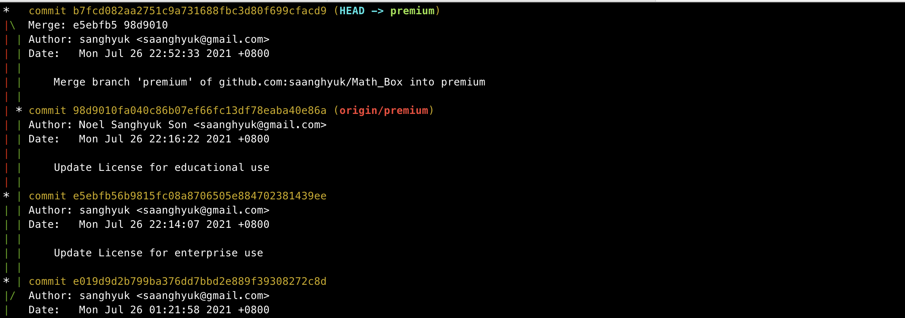
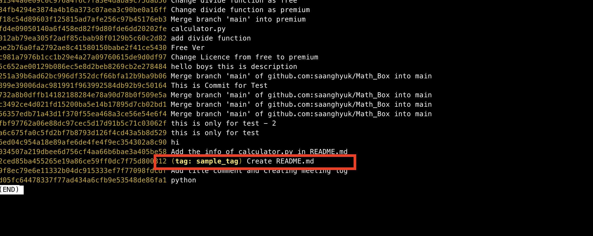

# Git Collaboration



|                                             |                                                              |
| ------------------------------------------- | ------------------------------------------------------------ |
| `git log -p`                                | 해당 커밋에 바뀐 코드들까지도 보여줌.                        |
| `git fetch`                                 | pull로 땡기면, 아예 머지가 되버려. 머지되기 전에 살짝 의심스럽거나 그런 경우 fetch로 체크가 가능하다. `git diff premium origin/premium` fetch 이후 로컬/리모트 두 브랜치의 차이 보고 싶으면 이런 명령어를 쓴다.  git fetch 하고 해당 파일 vi켜보면, fetch 이전과 동일하다. fetch 이후에 diff 명령어로 확인이 가능하다. 그 확인 후에, 차이 살펴본 후에 `git merge origin/premium`  실제 머지 하고, 다시 푸쉬 하면 된다. |
| `git diff commit1 commit2`                  |                                                              |
| `git diff premium origin/premium`           | 두 브랜치간의 차이를 볼때도 쓸 수 있다. 현재는, local premium branch **vs** origin premium branch의 차이를 보는 명령어이다.  앞에 있는 것이 기준으로 뒤랑 비교 하는 것. +나 -가 있으면, 그게 앞에 쓴 local premium이 기준인 것. |
| `git pull`                                  | `git fetch` + `git merge` = `git pull`                       |
| `git blame <file name>`                     | 해당 코드가 어떤 커밋으로 누가 탄생시켰는지를 볼 수 있다.    |
| `git show <commit_id>`                      | 그 blame 이후에 더 구체적으로 궁금하면 show                  |
| `git revert <작업 되돌리고 싶은 commit id>` | git reset말고 revert는 왜 쓸까? 리모트에 푸쉬가 되 있는 상태에서 내가 reset을 하고 다시 푸쉬를 하면, 다시 풀을 땡겨서 머지 한 다음에 다시 푸쉬 해야돼. 근데 revert를 하면 이전꺼랑  새로 커밋이 하나 더 생김. 로컬 레포가 더 최신이니깐 푸쉬가 되는 것. [revert 생활코딩](https://opentutorials.org/course/3839/22597)  `git revert HEAD~3`(3개 전으로 revert) |
| `git revert <commit id>..<commit_id>`       | 범위를 지정해서 Revert할 수 있다. 앞에꺼가 더 과거고, 뒤에꺼가 더 최신 커밋이다. 단, 앞에 커밋을 포함되지 않는다. 그 안에 있는 커밋 수 만큼 그 반대 순서로 현재 최신 커밋 앞으로 커밋이 생긴다. `git revert HEAD~5..HEAD~1` 커밋을 다 포함시키고 싶으면 이렇게 하면 된다. 근데 이렇게 multi revert하는 것은 잘 쓰지 않는다. 여러개 한번에 되면서 머징되면 진짜 난리 난다. **위에 명령어로 one by one으로 해라.** |
|                                             |                                                              |

cb1d9e6de0937465339f33ac5a0d0a068f14da9d.

3382876df516289db07978d752e0eda004a662c0.

- #### git push 전에 git pull을 해야하는 경우가 많을 겁니다

git push를 쓸때 자주 만나게 되는 상황

프리미엄 브랜치에서 License 파일 수정 

그리고 커밋

그리고, 이제 remote repository의 프리미엄 페이지로 가보자. 

거기서 또 License 바꿨음. 

이렇게 하면 현재, local repository와 remote repository의 최신 커밋이 서로 다름. 

다른 개발자가 자기 로컬에서 premium 추가하고 푸쉬 한거지. 

이 상태에서 로컬 레포지토리에서 git push를 하면 어떻게 될까?

그냥 반영해 버릴 수가 없잖아. 다른 개발자가 한것도 있는데. 

이렇게 내가 로컬 레포지토리 수정하는 동안, 리모트 레포지토리에 수정사항이 생겼다면, 바로 푸쉬가 안된다. 

이때는 일단 **git pull**을 해야 한다. 

pull을 해도 에러가 나네. 

근데 이거 merge할때 컨플릭트가 난거 메세지야. 

git pull의 원리를 보면, 리모트 레포지토리의 변화사항에 대한 커밋을 로컬로 가져오고 그대로 머지한다. 

보면 실제로 커밋이 그렇잖아. 

이렇게 리모트 레포지토리의 최신 커밋을 가져와서 머지하는 과정 까지가 `git pull`

그냥 똑같이 conflict해결해 주면 됨.

commit 하면 자동으로 메세지 있음.

이제 `git push`가능.w

즉 요약하자면, git pull로 리모트 레포지토리 땡겨오고, 그 다음에 충돌 해결. 그 후 다시 푸쉬하면 된다. 

- #### git pull말고 git fetch도 있어요

  pull로  브랜치를 가져온다는 것은, 브랜치가 가리키고 있는 커밋 이전의 모든 커밋들을 가져온다는 것. 

  

  이때 머지는 하지 않고, 딱 가져오는 단계까지만 해주는 커맨드가 있다. 

  

  

  신입개발자가 내 calculator.py를 바꿨다. 

  **say_hello** 함수를 추가했음. 

  

  터미널로 돌아가서 Git pull을 하면, 자동으로 이 함수도 머지되버려. 

  Fetch 하면 

  아래 표시 자체가, 리모트 브랜치의 내용이 로컬 브랜치로 왔다는 소리임. 

  

  확인 해보자. 이때 `git diff`를 쓴다. git diff는 커밋만의 차이 뿐만 아니라, 브랜치 간의 차이를 볼때도 쓸 수 있다. 

  

  

  이제 리모트 브랜치의 premium블갠치에 뭔가 문제가 있다는 것을 발견함. 

  

  해결방법은?

  

  

  즉 `git fetch` + `merge`가 `git pull` 이였던 것.

  

- #### 이 코드는 누가 작성했을까?

  파일이 뭐가 어떻게 변해 왔는지 확인을 해야 한다. 

  

  `git blame calculator.py`

  

  이제 여기서 더 자세히 알고 싶으면, 

  `git show <commit_id>`  치면 된다. 

  

- #### 이미 Remote Repository에 올라간 커밋을 취소해야 한다면?

  푸쉬 했어. 근데, 다시 빠꾸해야돼. 나 이미 푸쉬 했는데?

  여기서 이 최신 커밋에 대한 작업을 되돌리고, 다시 커밋을 하고 싶어. 

  

  `git revert <작업 되돌리고 싶은 commit id>`

  Revert를 하면 해당 커밋의 내용을 다시 되돌리고 그것을 다시 커밋하게 된다. 

  

  하니깐, 되돌리고 알아서 커밋 하나 만들어주네. 

  

  

  여기서 당연히 궁금해야 되는게, reset하는거 아닌가? 

  revert전에 이 상태였겠지?

  

  **이 상태에서 리셋을 하면?**

  헤드가 가르키던게 그 전으로 가겠지. 여기까지는 좋아. 그런데, 이 상태에서는 git push가 불가능해. 리모트에 있는게 더 최신이잖아. 

  git pull하고 나서, 푸쉬가 가능해. 

  

  근데 revert를 하면, 로컬에서 하나의 커밋이 더 생기는 거야. 이제 여기서, 로컬의 커밋이 더 앞에 있으면 푸쉬를 해도 문제가 없다. 푸쉬 하면, 리모트에도 한단계 더 커밋 생기겠지. 

  

  

  4번째와 6번째는 결과는 같아. 근데 어쩔 수 없어.

- #### 여러 커밋 취소하기

  더 과거를 대상으로, 여러개를 대상으로 한번에 revert도 가능하다. 

  readme.md를 돌려 볼꺼야. 

  

  git revert하고 어느 커밋부터 어느 커밋까지 revert할지 써줘야 함. 

  

  

  

  그 안에 껴있는 수 만큼 revert커밋이 나옴. 

  실제 커밋 순서와는 거꾸로 revert가 되어 있다. 

  

  

2ced85ba45..fbf97762a0
