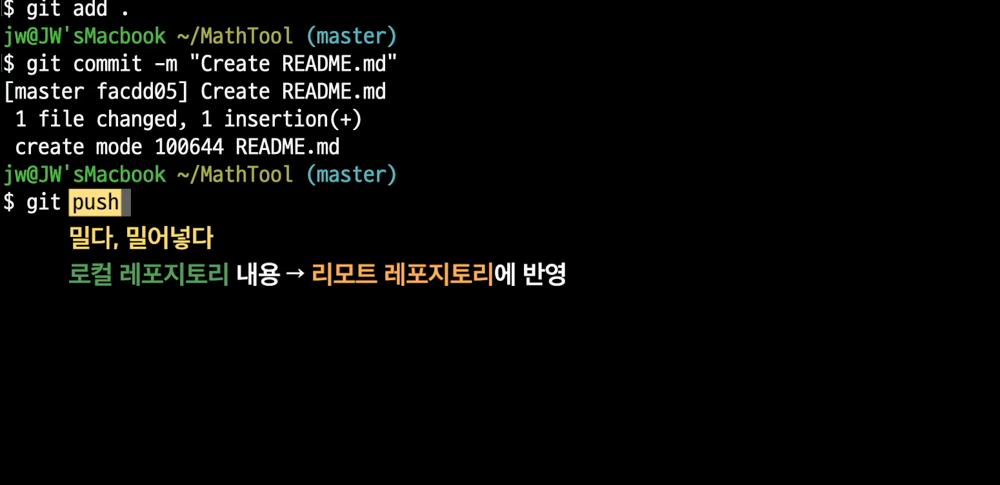
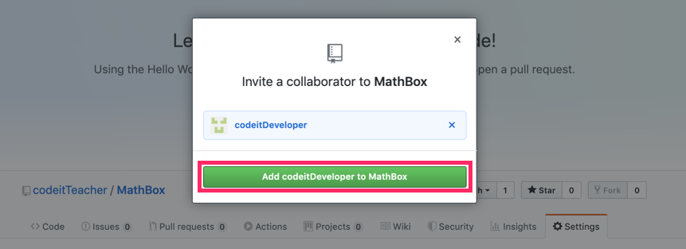

# Github

- #### Github

  프로젝트 디렉토리에서 작성하던 내용을 그대로 외부로 전송할 수 있음. 작업하던 내용을 전송한다는 것은 레포지토리를 전송한다는 것. 

  

  레포지토리에는 모든 것들의 변경 이력이 담겨 있음. 

  이것을 그대로 외부 컴퓨터로 전송하면, 그 컴퓨터에서도 내 컴퓨터처럼 작업을 할 수 있고, 마찬가지로 버전 관리도 할 수 있는 것. 이때 이 외부의 컴퓨터를 Github라는 서비스에서 제공해 주고 있는 것. 

  

  무료플랜에서는 최대 3명까지 Collaborator설정 가능 하지만, 유료에서는 무제한의 사람 협력 가능. 용량 차이도 있음. 

  

  

  **로컬 컴퓨터의 디렉토리를 그대로 깃허브로 옮겨보자.**

  깃허브에서 레포지토리 생성 하면 아래 화면이 나온다. 

  

  ​	 

  이렇게 깃허브에서 만든 레포지토리를 **원격레포지토리** Or **리모트레포지토리** 라고 부른다. 

  

  **내 MathTool 디렉토리 안에 있던 .git이 로컬 레포지토리이다.** 

  

  로컬을 원격에 올리는 건 그냥 아래 따라하기만 하면 됨. 

  

  바로 직전 커밋에 비해 어떻게 달라졌는지도 보인다. 

  

- #### Local Repository에서 바뀐 내용을 Remote Repository에 반영하기

  다시 로컬 레포지토리를 수정해보자. 지금 수정하고 커밋까지 했음. 

  그런데 아직은 이게 리모트 레포지토리에는 없다. 보낼려면 푸쉬를 해줘야함. 

  

  

  

  

- #### Remote Repository에서 바뀐 내용을 Local Repository에도 반영하기

  반대로 리모트 레포지토리에서 로컬 레포지토리보다 더 최신 내용을 가지고 있으면 어떻게 해야 할까?

  

  깃허브에서 바로 README.md를 수정하고, 커밋했음. 

  

  ​	

  이제 이것을 로컬에서도 가져와야지. 로컬 레포지토리가 뒤쳐져 있음. 

  

  

  

  근데 리모트는 왜써?

  1. **백업, 안전성.** 

     

  2. **협업가능**

     

- #### 아무나 git push를 할 수 있는 것은 아닙니다. 

  로컬 레포지토리(Local Repository)의 최신 내용을 리모트 레포지토리(Remote Repository)에도 반영하려면 

  > **git push**

  를 해야한다고 배웠습니다. 그런데 여기서 잠깐 궁금한 점이 하나 생깁니다.

  그렇다면 아무나 git push라고만 쓰면 자신이 작업한 내용을 저의 리모트 레포지토리에 반영할 수 있는 걸까요?

  **그건 아닙니다.** 

  이게 만약 가능하다면 저도 모르는 사이에 제 리모트 레포지토리의 내용이 맘대로 바뀌어 버릴 수도 있겠죠? 사실 git **push는 리모트 레포지토리의 주인,** 그러니까 본인만 할 수 있습니다. 만약 본인이 아닌 다른 사용자도 git push를 할 수 있게 하려면 GitHub에서 추가 작업을 해줘야 합니다. 

  일단 GitHub 페이지에서 저(**codeitTeacher**)의 **리모트 레포지토리인 MathBox의 설정**을 살펴보겠습니다.

  상단의 여러 탭 중에서 **Settings 탭**을 클릭하세요. 그 다음 화면 왼쪽의 **Manage access 탭**을 클릭하면 되는데요. 

  

  화면에 **PUBLIC REPOSITORY**라는 표현이 보이죠? 이 말은 지금 누구나 제 리모트 레포지토리의 주소만 알면, 그 내용을 살펴볼 수 있다는 뜻입니다. 그리고 누구든지 제 레포지토리를 자기 컴퓨터로 가져갈 수도 있다는 뜻이구요. 그리고 자기 컴퓨터에서 추가 작업을 할 수도 있죠? 하지만 그래도 본인이 아닌 이상 그 내용을 git push할 수 없기 때문에 리모트 레포지토리에 반영할 수는 없습니다.

  그럼 저 말고 이제 다른 사용자도 git push할 수 있도록 설정을 조금 바꿔볼게요. 아래 그림을 보세요.

  

  화면 하단에서 **Invite a collaborator** 버튼이 보이시나요? collaborator를 초대한다는 뜻인데요. 다른 사용자를 collaborator로 초대하면 그 사용자는 제 리모트 레포지토리에 git push할 수 있는 권한을 가질 수 있습니다. 버튼을 클릭해볼게요.

  

  그 다음 뜨는 창에서 위 그림과 같이 GitHub의 **codeitDeveloper**라고 하는 사용자를 검색해서 클릭할게요.(**codeitDeveloper**는 제가 미리 따로 준비해둔 다른 사용자 계정입니다.)

  

  그리고 codeitDeveloper에게 “내 레포지토리의 collaborator가 되어달라”는 초대장을 보낼게요.

  그럼 이제 codeitDeveloper에 대해서 **Pending invite 상태**가 됩니다. 

  

  그럼 이제 **codeitDeveloper**는 아래와 같은 초대장을 받게 됩니다.

  

  여기서 **View Invitation** 버튼을 클릭해서 초대장을 살펴보면

  

  그럼 이렇게 저 **codeitTeacher**가 **codeitDeveloper**를 초대한 내용을 확인할 수 있습니다. **codeitDeveloper**가 **Accept invitation** 버튼을 클릭하면 이제

  > **codeitDeveloper는 codeitTeacher가 소유한 MathBox 레포지토리의 collaborator가 됩니다.** 

  

  그리고 다시 원래 **codeitTeacher** 계정에서 확인해보면 codeitDeveloper가 정말 collaborator가 된 것을 확인할 수 있는데요. 이제 codeitDeveloper는 MathBox 레포지토리를 자신의 컴퓨터로 가져가서 수정한 후 **git push**를 해서 저의 리모트 레포지토리를 수정할 수 있습니다. 

  자, 정리해볼게요.

  1. 원칙적으로 자신의 리모트 레포지토리에는 자신만 git push를 할 수 있습니다. 
  2. 만약 다른 사용자도 git push를 할 수 있게 해주려면 그 사용자를 해당 리모트 레포지토리의 collaborator로 지정하면 됩니다. 

- #### 다른 프로젝트 가져오기

  외부 프로젝트 가져오려면, 일단 이 주소 복사. 

  

  터미널 와서, 

  `git clone https://github.com/numpy/numpy.git`

  

- #### 오픈 소스 프로젝트란?

  GitHub에는 훌륭한 프로젝트들이 많습니다. 그리고 이런 프로젝트는 대부분 그 소스 코드가 공개되어 있습니다. 이렇게 소스 코드가 공개되어 있는 프로젝트를 **'오픈 소스 프로젝트(open source project)'**라고 하는데요. ‘오픈 소스’가 뭘까요? 간단히 설명하자면 프로그램의 **소스 코드가 대중에 공개된 상태**일 때 오픈 소스라고 합니다. 오픈 소스라는 용어의 의미는 그것이 생겨난 역사적 배경을 살펴보면 좀더 잘 이해할 수 있습니다. 

  아주 오래 전에 프로그램이라고 하는 건 그 소스 코드를 공개하고, 공유하고, 그 원리를 아는 사람이 모르는 사람에게 가르쳐주는 게 당연한 존재였습니다. 하지만 컴퓨터 프로그램 시장이 발전하면서 특정 회사가 어떤 프로그램을 만들고 그 사용료 등을 받는 것이 일반화되기 시작했는데요. 이런 변화와 함께 프로그램의 소스 코드들은 점점 그 프로그램을 만든 회사만 갖고 있고 공개되지 않기 시작했습니다. 그러니까 내가 고객으로서 어떤 회사의 프로그램을 쓰더라도 그 프로그램의 소스 코드를 볼 수는 없게 된 겁니다.

  하지만 이런 움직임에 반해 1983년 [‘**리차드 스톨만(Richard Stallman)**’](https://ko.wikipedia.org/wiki/리처드_스톨먼)이라고 하는 MIT의 연구원이 '자유 소프트웨어 운동'이라는 걸 시작했습니다. 아주 오래 전 소스 코드를 공유하던 문화로 돌아가자는 취지의 운동이었는데요. 그는 곧이어 ['**자유 소프트웨어 재단(Free Software Foundation)**'](https://ko.wikipedia.org/wiki/자유_소프트웨어_재단) 이라는 걸 세우고 이러한 운동을 조직화했습니다. 자유 소프트웨어 재단에서 소프트웨어는

  \- 그 소스 코드가 공개되어야 하고

  \- 누구나 코드를 자유롭게 가져다가 사용할 수 있고

  \- 원래의 코드를 자신이 원하는 대로 수정할 수 있어야한다 

  는 정신이 강조되었고, 그러한 정신에 부합하는 프로그램들이 그 운동 속에서 많이 만들어졌습니다. 그 중 대표적인 프로그램은 바로 '**GNU 리눅스**'라고 하는 운영체제입니다. GNU 리눅스에 대한 이야기는 [유닉스 커맨드 토픽의 이 영상](https://www.codeit.kr/learn/courses/unix-command-line/2668)을 참고하세요.

  그런데 이런 자유 소프트웨어(Free Software)라는 명칭에 대해서는 그 의미가 확실하지 않다는 몇몇 논란이 있었고, 이러한 성격의 소프트웨어를 가리키기 위한 다른 용어로 ‘**오픈 소스 소프트웨어**’가 제시되었습니다.(자유 소프트웨어와 오픈 소스 소프트웨어가 조금은 다르다고 보는 의견도 있지만 여기서는 일단 같다고 보겠습니다.)

  이런 역사적 흐름을 거쳐 오픈 소스 소프트웨어라는 개념이 생기고 정착하게 된 것인데요.

  요즘 여러분이 들어봤을 수도 있는 유명한 오픈 소스 소프트웨어에는

  \- numpy(이전 영상에서 살펴본 파이썬 수치 계산용 라이브러리, https://github.com/numpy/numpy)

  \- Linux(위에서 말한 리눅스, https://github.com/torvalds/linux)

  \- MySQL Server(데이터베이스 프로그램, https://github.com/mysql/mysql-server)

  \- WordPress(설치형 블로그 프로그램, https://github.com/WordPress/WordPress)

  \- React Native(페이스북에서 만든 모바일 UI 프레임워크, https://github.com/facebook/react-native)

  \- Vue.js(웹 UI 프레임워크, https://github.com/vuejs/vue)

  \- Tensorflow(머신러닝 프레임워크, https://github.com/tensorflow/tensorflow )

  등이 있습니다. 많은 유명 프로그램들이 사실은 이런 오픈 소스 프로젝트로 개발되고 있는 경우가 꽤 많습니다.

  하지만 오픈 소스라고 해서 사용할 때 항상 아무런 제약이 없는 것은 아닙니다. 왜냐하면 사실 오픈 소스에도 다양한 종류의 라이센스(**open source license**)들이 있기 때문입니다. 예를 들어 어떤 오픈 소스 라이센스 중에는

  \- 오픈 소스가 활용된 부분이 있는 코드라면 그 코드도 마찬가지로 오픈 소스로 공개해야 한다.

  \- 기존의 오픈 소스 내용 중 조금 수정해서 사용한 부분이 있다면 그것을 표시하고 써야 한다.

  같은 제약이 있는 것들도 있습니다. 사실 오픈 소스 라이센스의 종류와 그 특징은 그 자체로 하나의 토픽이 될 정도로 많은 내용이 있기 때문에 궁금하신 분들은 [이 링크](https://www.olis.or.kr/license/compareGuide.do)를 참조하세요.

  그럼 오픈 소스 프로젝트는 어떤 장점이 있을까요? 아래와 같은 장점이 있습니다.

  \- 무료로 사용할 수 있다.

  \- 여러 개발자들이 참여하기 때문에 폐쇄적으로 코드를 관리할 때보다 코드의 신뢰도가 더 높다.(이 부분은 사람마다 의견이 다를 수 있습니다)

  \- 오픈 소스 프로젝트에 참여 중인 다른 개발자들에게 질문을 할 수 있다.

  \- 어떤 프로그램을 개발할 때 특정 분야에서 사실상 표준처럼 사용되는 오픈 소스 프로그램을 많이 활용할수록 전체 개발 속도를 단축시킬 수 있다.

  반면에 단점은

  \- 참여자 수가 많지 않거나, 참여자의 실력이 좋지 않으면 소스 코드의 신뢰성을 보장하기 어렵다. 

  \- 해당 오픈 소스를 사용해서 문제가 생겼을 때 보상을 해주거나, 책임을 질 주체가 없다.

  등이 있습니다. 오픈 소스라고 무조건 좋은 것은 아니기 때문에 충분히 공신력 있는 오픈 소스 프로젝트인지를 따져보고 사용하는 게 좋습니다.

  **GitHub**는 이러한 오픈 소스 프로젝트들이 많이 있는 사이트입니다. 여기서 어느 정도 공신력이 있는 오픈 소스 프로젝트의 경우에는 Facebook이나 Google같은 세계적인 IT 회사의, 실력있는 개발자들이 만든 코드를 자유롭게 살펴볼 수 있고 공부할 수 있습니다. 그래서 사실 개발자들에게 GitHub만큼 좋은 공부 장소가 없습니다. 자신이 관심있는 분야의 오픈 소스 프로젝트의 코드를 분석하거나, 좀더 나아가 오픈 소스 수정에 기여할 수 있다면 그 중에 이루어지는 성장은 대단할 겁니다. 이런 흔적은 GitHub의 본인 계정 정보에도 다 표시되기 때문에 그 자체로도 개발자에게는 훌륭한 이력이 됩니다. 

  이번 토픽을 통해 Git과 GitHub를 사용하는 법에 능숙해지고난 후에는 GitHub의 오픈 소스에 기여하는 방법도 따로 배워보시면 좋을 것 같네요!

- #### README.md를 더 예쁘게

  이전 영상에서 **Numpy 프로젝트**를 살펴볼 때 아래 그림과 같은 **README.md 파일**을 봤습니다. 

  

  보통 README.md 파일에는 

  \- 이 프로젝트가 어떤 프로젝트인지 설명하거나

  \- 프로그램의 주요 사용법을 알려주거나

  \- 프로그램을 실행시키려면 어떤 사전 작업이 필요한지를 알려주는 

  내용들이 적혀있습니다. GitHub에서는 README.md 파일을 프로젝트의 메인 화면에 보여주기 때문에 README.md 파일의 내용을 가독성있게 작성하는 것이 중요한데요.

  그러고보니 저도 MathTool 디렉토리에 README.md 파일을 추가했었죠? 잠깐 저의 README.md 파일을 살펴볼게요. 

  

  그런데 저의 README.md 파일은 Numpy 프로젝트의 README.md 파일에 비해 뭔가 좀 초라하네요. 물론 내용 자체가 많지 않아서 그런 것도 있겠지만 딱히 뭔가 꾸며진 효과가 없어서 더 그렇게 보이는 건데요. 어떻게 하면 좀더 예쁘게 꾸밀 수 있을까요? 그 답은 README.md 파일의 확장자인 **.md**에 있습니다. 이 확장자는 markdown이라는 단어의 줄임말입니다.

  markdown은 이 파일에 마크다운으로 내용을 작성할 수 있다는 걸 나타냅니다. 마크다운이란 특정 규칙에 맞게, 간단한 텍스트만으로 어떤 표시를 해두면, 그것이 자동으로 HTML 태그로 전환되도록 약속된 문법입니다. 그래서 단지 텍스트만으로도 내용의 디자인을 예쁘게 만들 수 있는데요. 마크다운이 정확히 뭔지 알고 싶으시면 [이 링크](https://ko.wikipedia.org/wiki/마크다운)를 참조하세요.

  저는 마크다운을 활용해서 담백하게 생긴 저의 README.md 파일을 좀더 화려하게 만들어볼게요. 지금 저의 README.md 파일의 내용을 편집기로 보면 아래 그림과 같습니다.

  

  사실 ###(샵 3개)도 마크다운 중 하나입니다. 저렇게 쓰면 그 줄의 텍스트를 **제목처럼** 보이게 만들어주는 효과가 생기죠. 이렇게요.

  

  자, 또다른 마크다운들도 추가해서 더 제대로 꾸며볼게요. 원래 내용을 아래 그림처럼 수정할게요.

  

  그리고 이렇게 이 상태에서 **"Make README.md look nice"**라는 커밋 메시지로 커밋을 할게요. 

  

  다시 README.md 파일을 보면

  

  뭔가 미세하게 달라진 부분들이 생겼습니다. README.md 파일이 좀더 보기 편해졌죠? 제가 작성했던 **#**, *****, **-** 이런 기호들이 마크다운에서 이미 정해진 의미를 갖고 있고, 그 의미에 맞게 시각적 효과가 더해진 건데요. 어떤 기호가 어떤 시각적 효과를 만들어냈는지는 여러분이 직접 비교해보면 좋을 것 같습니다.

  그리고 GitHub에서 사용되는 이런 마크다운 언어의 규칙은 [이 링크](https://guides.github.com/features/mastering-markdown/)에 있으니, 관심이 있으신 분은 잘 읽어보세요. 코드잇에 있는 [마크다운 관련 노트](https://www.codeit.kr/learn/courses/data-science/975)도 참고하시구요. 그리고나서 저와는 또다른 방식으로 README.md 파일을 화려하게 만들어도 좋습니다.

  자, 방금 GitHub의 리모트 레포지토리에서 커밋을 했으니 이제 어떻게 해야할까요? 제 컴퓨터의 로컬 레포지토리에도 반영시켜야겠죠? 이전 영상에서 배운 **git pull** 커맨드를 실행할게요.

  

  이렇게 하면 리모트 레포지토리의 최신 커밋이 로컬 레포지토리에도 잘 반영됩니다. 바로 다음 레슨으로 가봅시다.

