# AdaBoost

부스팅이라는 앙상블 기법을 말할 것. 

**Bagging(Bootstrap Aggregating)**  : 임의로 bootstrap 데이터 셋들을 만듬.  Bootstrap DataSets를 활용해서 수 많은 모델들을 만듬. 이 모델들의 결정을 종합(Aggregating)함. Bootstrap으로 만든 모델들을 합쳤다고 해서 Bagging이라고 하는 것. 

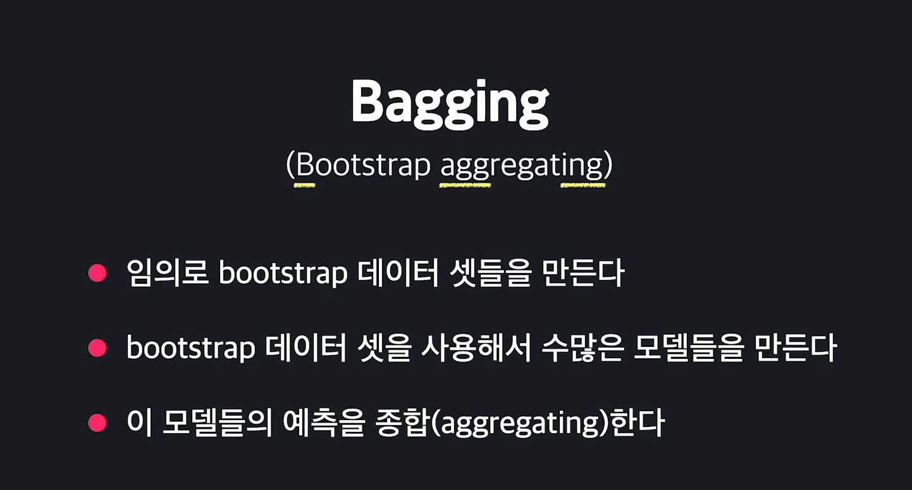

**Boosting**:  ~전보다 더 크거나 높게 하다. 부스팅도 앙상블 기법이기 때문에 여러개를 합치는 것은 마찬가지. 부스팅의 특징은 일부러 성능이 안좋은 모델들을 사용함. 그리고, Bagging과 마찬가지로 조금씩 다른 데이터 셋을 사용함. 하지만, 임의로 만드는 것이 아니라 더 먼저 만든 모델들의 성능이, 뒤에 있는 모델이 사용할 데이터셋을 바꿈. 그리고, 모델들의 예측을 종합할 때, 단순 다수결이 아닌 성능이 더 좋은 모델의 예측을 더 반영함. **부스팅의 핵심은 성능이 안 좋은 학습자(Week Learner)들을 합쳐서 성능을 극대화 하는 것.** 

부스팅을 사용하는 알고리즘도 엄청 많지만, 이번 챕터에서는 그 중에 AdaBoost에 대해 배우는 것. 

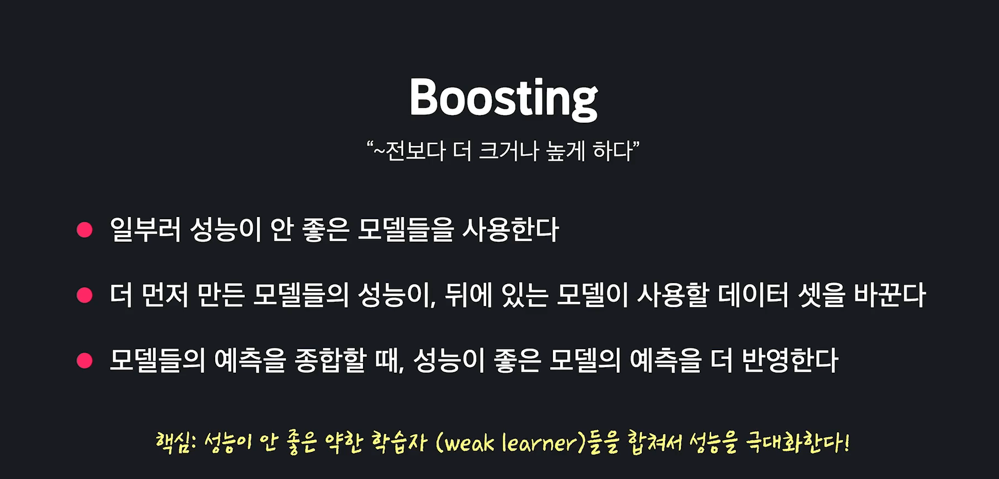


- #### 에다부스트(AdaBoost)

  랜덤포레스트와 마찬가지로 에다부스트에서도 수 많은 결정트리들을 만듬. 랜덤포레스트에서 만드는 알고리즘들을 깊이가 조금 있었음. 에다부스트에서는 깊은 결정트리가 아닌 얕은 루트노드 하나와 분류노드 두개를 갖는 결정트리를 만듬.

  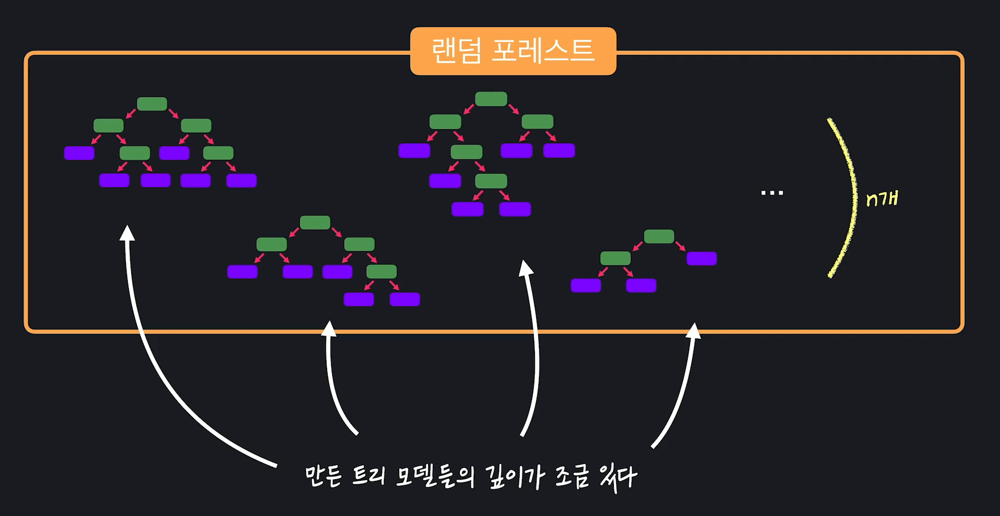

  예를 들어 교통사고 데이터를 분류하고 싶다고 한다면 뿌리노드 "속도가 시속 50km 넘었나요?" **딱 이렇게만 하는 굉장히 단순한 트리**. 이렇게 하나의 질문으로 바로 분류하는 결정트리를 나무의 그루터기를 의미하는 스텀프(Stump)라고 부름. 

  이런식으로 스텀프를 만들면, 동정던지기 보다 조금 나은 정도임.  Boosting 기법 자체가 성능이 안좋은 **weak learner를 사용하는 기법임**. 일부터 스텀프를 사용하는 것. 

  그리고, 부스팅기법 답게 각 모델이 사용하는 데이터셋을 임의로 만들지 않음. 

  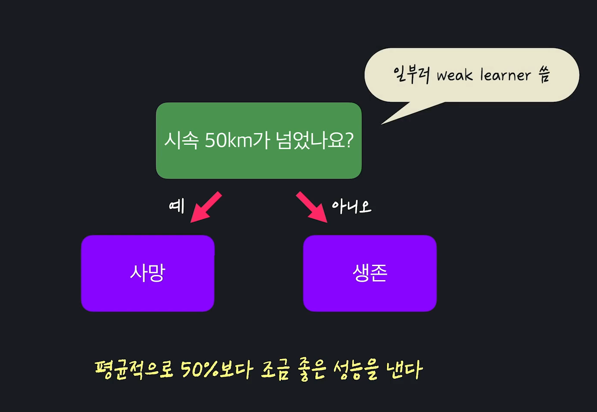

  하단처럼 데이터로 스텀프 하나를 만들었다고 해보자. 그럼 이 결정스텀프가 맞게 분류하는 애들이 있고, 틀리게 분류하는 애들이 있음. 그럼 다음 데이터셋을 만들때는, 이 전 스텀프가 틀리게 분류한 애들의 중요도를 올리고 예측을 맞은 데이터의 중요도는 낮춰줌. 중요도가 높은 데이터들은 뒤에 있는 스텀프들이 더 우선적으로 맞출 수 있도록 집중함. 중요도 낮은 데이터는 좀 덜 신경쓰게 해줌. 그렇게 또 스텀프를 만듬. 

  그 다음 스텀프를 만들때도, 예측 틀린 데이터들과 예측이 맞은 데이터들의 중요도를 조절함. 이렇게 전에 틀렸던 애들을 좀 더 잘 에측하는 스텀프들을 만들어 가는 것. 이런식으로 가면서 뒷 스텀프들은 앞 스텀프들의 실수를 더 잘 맞추고 바로잡는 방향으로 만들어짐. 

  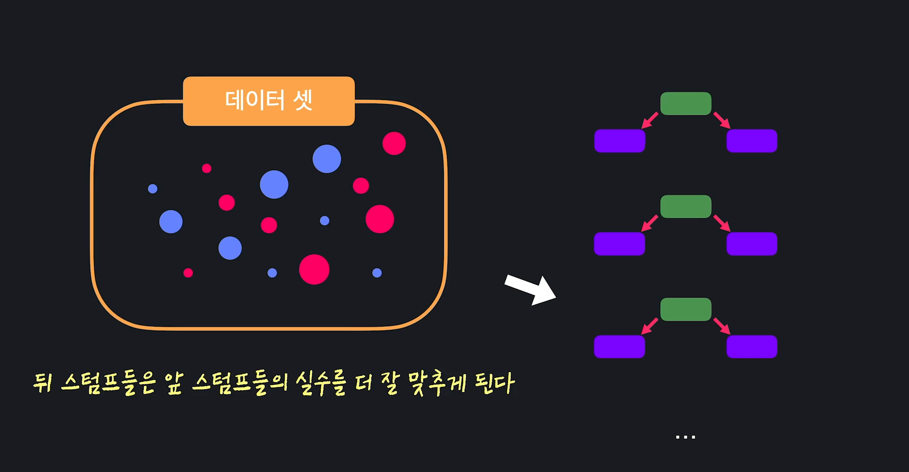

  이걸 미리 정해놓은 만큼 반복해서 엄청 많은 스텀프들을 만들어 주는 것. 

  이렇게 100개 200개 300개 정해진 만큼 반복을 한 뒤, 앙상블 기법이니깐 이제 종합적인 예측을 해야겠지. 이때 **에다부스트는 다수결의 원칙이 아닌 성능주의적 원칙**으로 함. 

  각각의 스텀프의 성능이 2, 1, 3, 5라면 이 네 스텀프가 최종 결정에 다른 영향력을 갖게 됨. 

  **데이터 딱 하나를 보고 예측을 하는 상황**을 가정하면, 4개의 스텀프가 있었는데 2개는 일반감기로 예측하고, 2개는 독감으로 예측했다면 그 성능의 합이 높은 쪽으로 판단한다는 것. 

  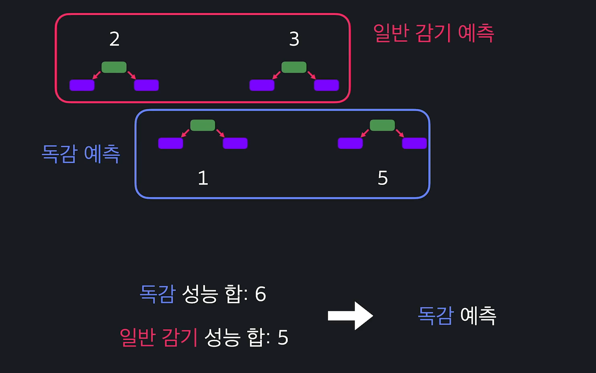

  정리하자면, 

  1. 에다부스트는 성능이 좋지 않은 결정 스텀프들을 많이 만든다(Weak Learners).

  2. 각 스텀프는 전에 왔떤 스텀프들이 틀린 데이터들을 더 중요하게 맞춘다. 
  3. 최종 결정을 내릴 때, 성능이 좋은 스텀프들의 의견의 비중을 더 높게 반영함. 

  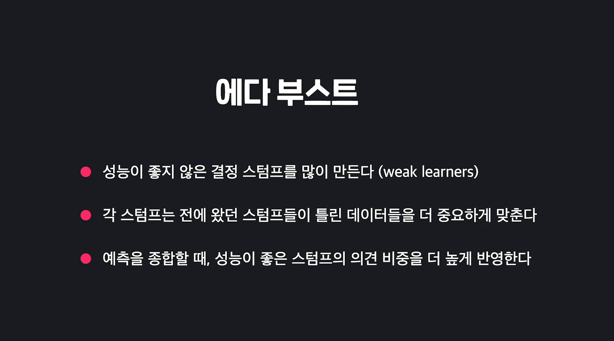


- #### 에다부스트 알고리즘 자세히 알아보기

  독감 데이터. **중요도**는 실제로 feature에 추가하는 것은 아님. 다만, 에다부스트는 전에 있던 스텀프들이 틀리게 예측한 데이터들을 조금 더 잘 맞추려고 하는 알고리즘. 그렇기 때문에 스텀프를 만들 때는 전에 예측에 실패했던 데이터들을 더 중요하게 취급해야 함. 그걸 의미하는 것. 처음에는 틀리게 예측한 데이터가 아직 없으니깐, 틀리게 예측한 데이터를 모두 같게 설정함. **중요도의 합은 항상 1로 유지시켜줌**. 

  일단 여기서 첫 스텀프를 만들어야 하는데 첫 스텀프는 전에 만든 스텀프가 없기 때문에, 있는 그대로 만듬. 각 분류/질문들의 **지니불순도**를 비교해서 스텀프를 만들면 됨. 지니불순도가 가장 낮은, 즉 성능이 가장 좋은, 노드를 골라서 만든다. 

  근데 여기서 스텀프는 질문이 하나밖에 없으니깐, 그거로 질문을 쓴 다음에, 바로 판단하는 거지. 

  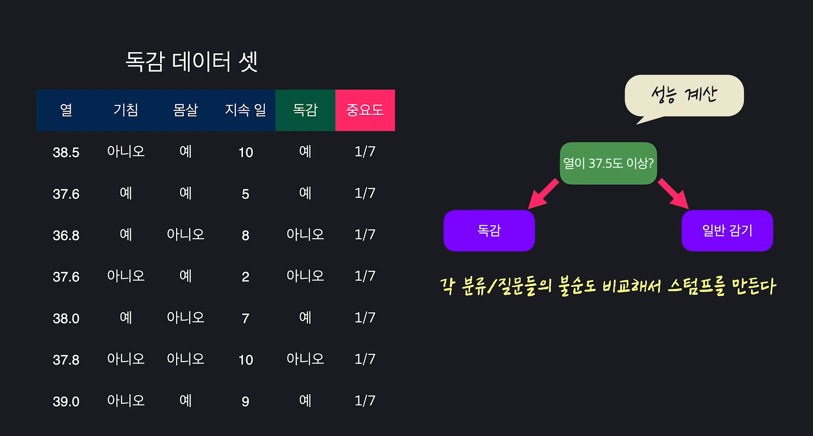

  그런데 에다부스트에서 중요한거는 스텀프를 만들때 마다 각 성능을 계산해야 함. 마지막에 종합할때 성능을 반영하니깐. 

  total_error 잘못 예측한 데이터 중요도의 합. 지금 열 37.5도를 기준으로 분류하니깐 2개의 데;이터가 틀렸음. 이 데이터의 중요도들이 각각 1/7씩 이니깐 대입만 하면 됨. **넣어서 계산하면 이게 그냥 이 데이터의 성능**. 

  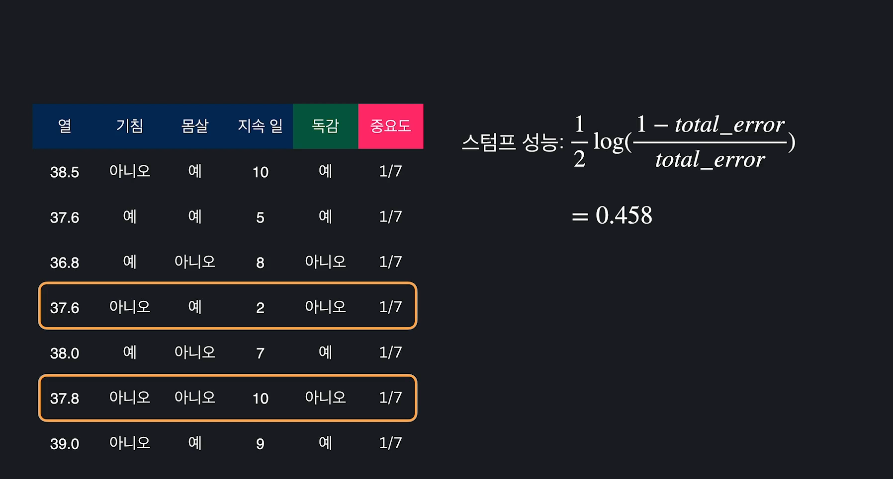

  근데 이식을 왜 쓸까? 그래프로 그려보면 이해할 수 있음. total error는 1에 가까울수록 작아지고, 0에 가까울수록 커짐. total_error가 1이면 모든 데이터 다 틀리게 예측한 경우. 토탈에러가 0이면 모든 데이터 다 맞게 예측한 경우, 성능 무한히 크게 만들어 줌. total_error가 0.5면 모든 중요도의 합중 딱 반만 맞은 것(**중요도 기준**). 이때는 성능이 아무 의미가 없으니깐 0으로 만들어 주는 것. 

  ***잘 맞출수록, 또는 잘 못 맞출수록 성능을 기하급수적으로 늘리고 줄여준다.*** 

  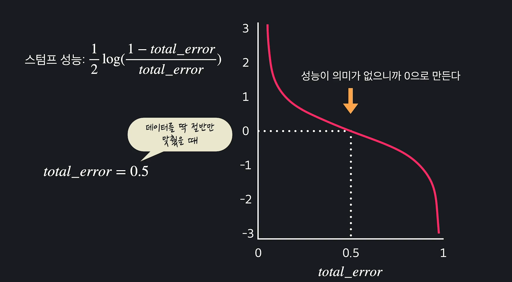

  정리해보자면, 

  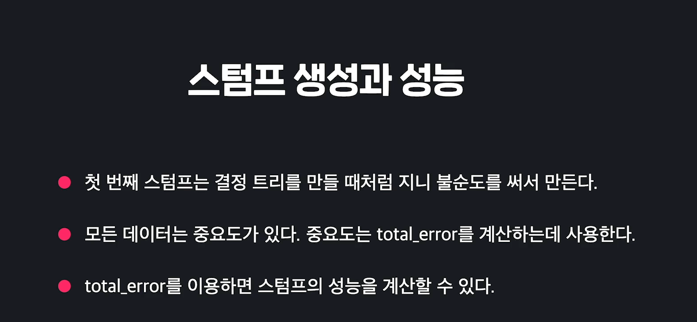


- #### 데이터 중요도 바꾸기

  틀리게 예측한 데이터의 중요도는 높여주고, 맞게 예측한 데이터의 중요도는 낮춰주는 방법. 

  아래가 첫번째 스텀프 였음. 현재 각 데이터의 중요도는 전부 다 1/7씩 됨. 

  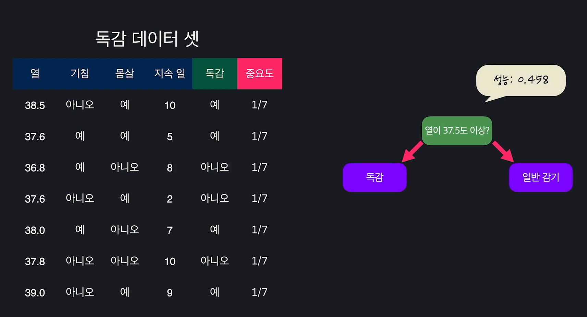

  여기서 이제 틀리게 예측한 데이터의 중요도는 높여주고, 맞게 예측한 데이터의 중요도는 낮춰줘야 함. 

  **Weight_Old = 새로운 중요도, Weight_Old = 예전 중요도, P_tree = 스텀프의 성능**

  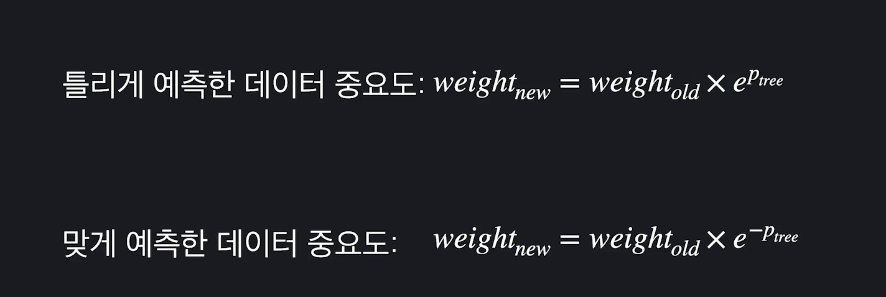

  그래프만 보더라도, 이해가 됨. *그냥 지수함수잖아.* 

  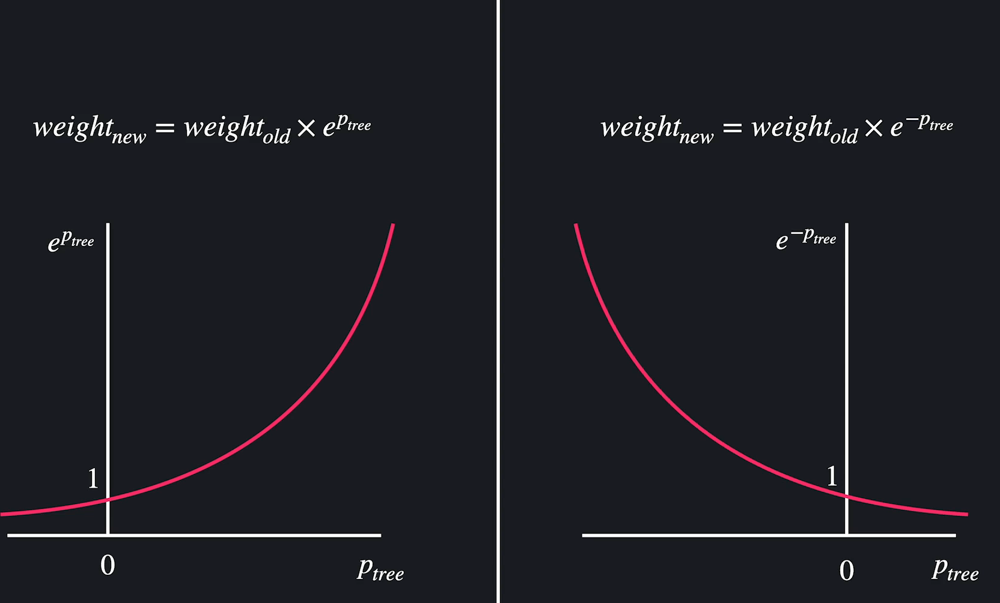

  중요도 그래프 다시 보면 아래와 같음. 스텀프가 데이터를 절반 이상만 맞추면, 0보다 커지니깐, 맞춘 데이터의 중요도는 1보다 낮은 값을 곱하게 되서 떨어지고, 틀린 데이터의 중요도는 1보다 큰 값을 곱하게 되니깐 내려감. 

  반대로, 반도 못맞추면? 스텀프 성능이 0이 안됨. 그러면 맞춘 애들의 중요도는 1보다 큰 값을 곱하게 되서 올라가고, 못맞춘 애들의 중요도는 1보다 작은 값을 곱하면서 떨어지게 됨. 

  

  하던 독감 데이터로 다시 들어가서 해보면, 

  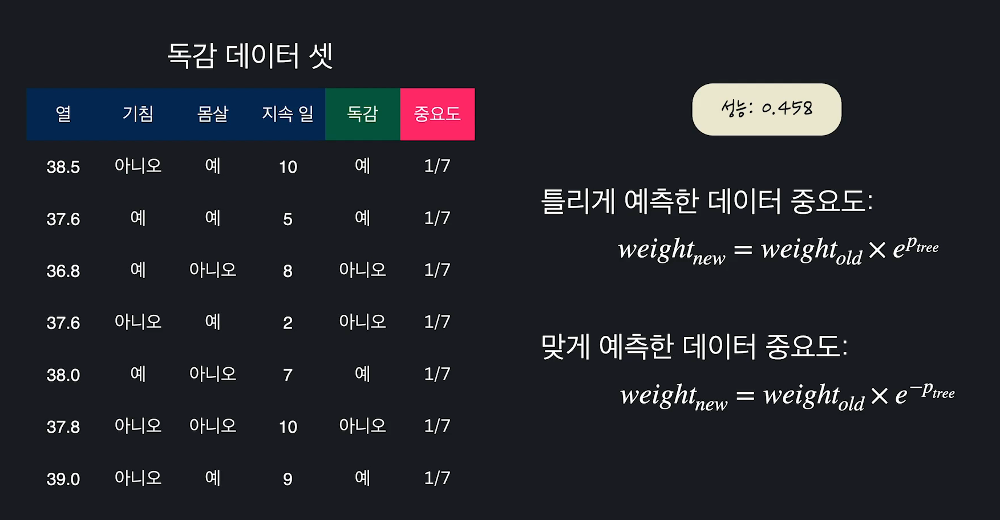

  새로운 중요도를 구할 수 있음. 틀리게 분류한 데이터들의 중요도는 0.226, 맞게 분류한 데이터들의 중요도는 0.09가 되었음. **언제나 까먹으면 안되는 건 중요도는 항상 다 더해서 1이 나옴.** 지금은 다 더하면 1보다 작음. **1보다 작거나 크면 비율적으로 조절을 해 줘야 함.** 

  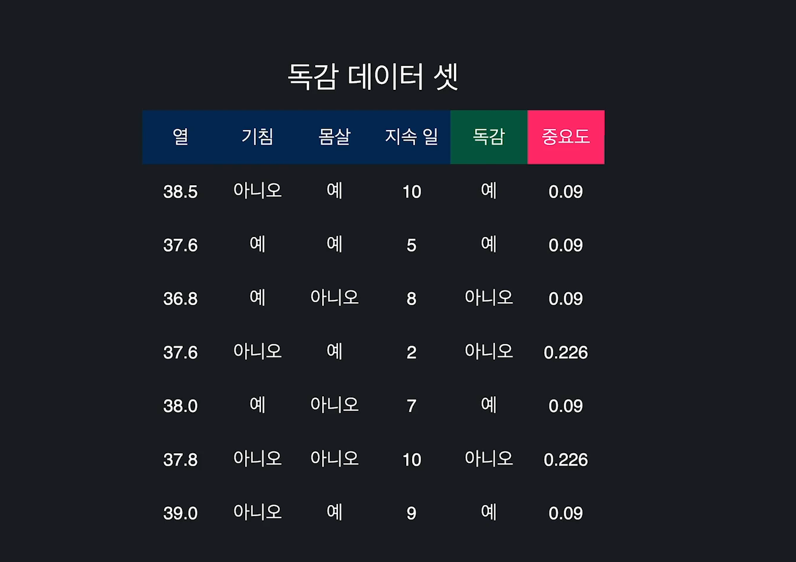

  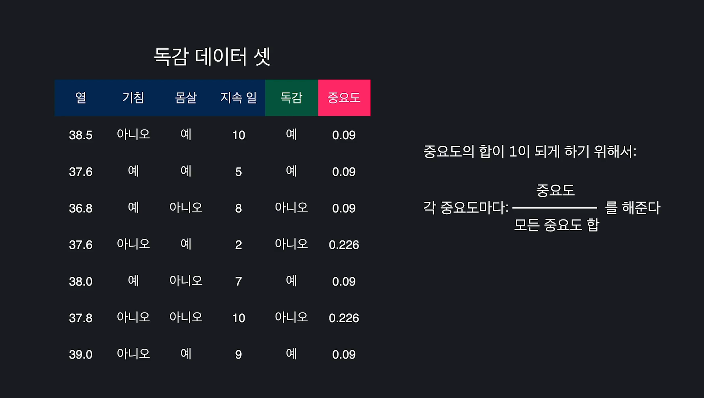
  비율 조절 해 보면 아래처럼 나옴. 
  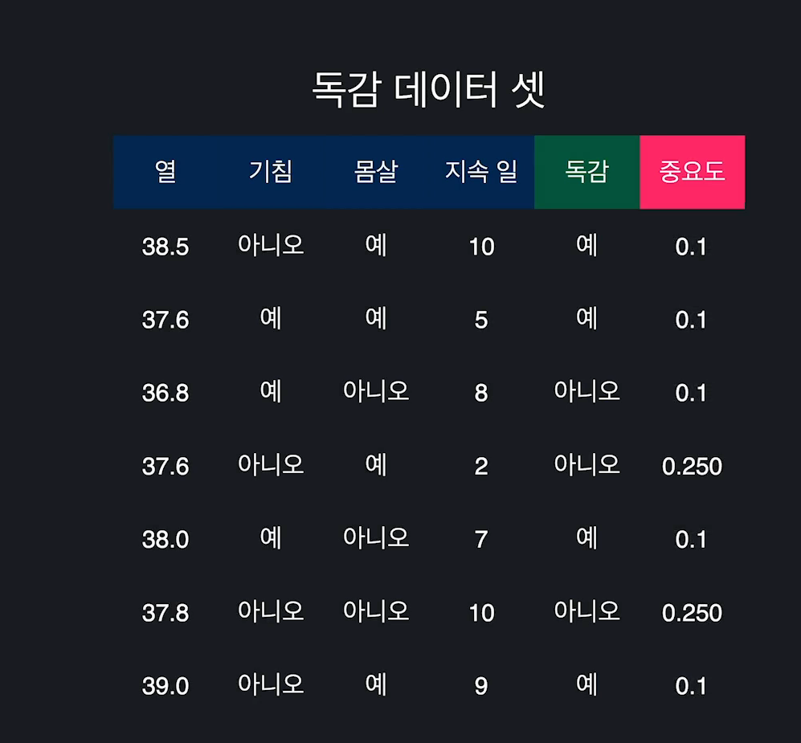


- #### 스텀프 추가하기

  이번 레슨에서는 중요도가 바뀐 데이터셋을 이용해서 그 다음 스탬프를 추가해보자. 

  새로 만들 데이터셋은 기존에 만들 데이터셋과 동일함. 

  1. 중요도를 이용해서 각 데이터에 범위를 줌(그낭 누적으로 중요도 더해가면서 범위 주는 것, 단순한 작업). 

  2. 그 후에 0에서 1 사이 임의의 숫자를 고른다. 
  3. 그 범위를 갖는 데이터를 골라서 새로운 데이터셋에 추가해준다. 예를 들어 0.4012라는 수를 임의로 고르면 현재 0.3~0.55의 범위를 갖는 데이터를 새 데이터셋에 추가해줌. **중요도가 높은 데이터는 범위가 크기 때문에 고를 확률이 높다.**
  4. 이걸 원래 데이터셋의 크기 만큼 반복해서 새로운 데이터셋을 만든다. 
  5. 즉, **중요도가 크다는 것은 다음 데이터에서 쓸 확률(골라질 확률)이 높다는 것.**  

  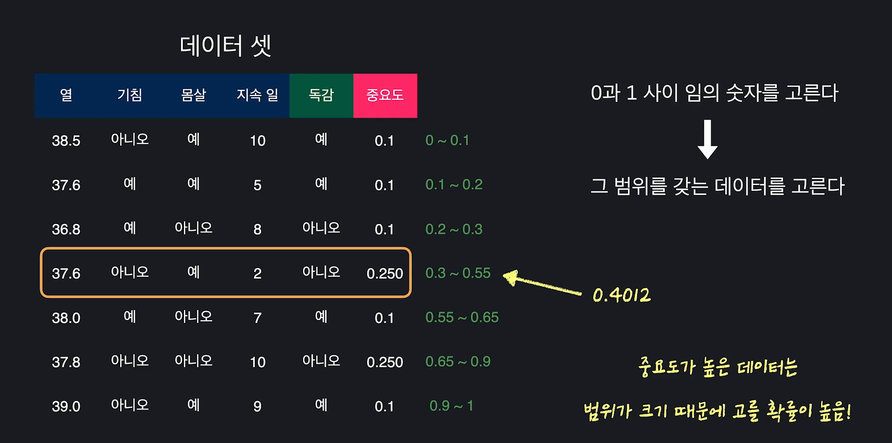

  실제로 살펴보면 중요도가 높은 데이터들은 여러번 들어갔고, 중요도가 낮은 애들은 아예 추가가 안된 애들도 있음. 이렇게 되기를 원했던 것. 처음부터 이 스텀프는 전 스텀프가 틀렸던 애들은 좀 더 잘 맞추게 하기 위함이였음. 

  새로운 데이터셋에는 확률적으로 전 스텀프가 틀린 애들이 더 많이 들어있기 때문에, 새로 만들 스텀프가 decision tree를 만들면서 얘네들의 정보를 더 많이 반영하게 되고 더 잘 맞출 수 있게 되는 것. 

  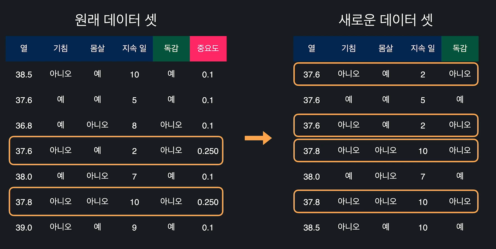

  이제 이 데이터를 써서 처음 만들때랑 똑같이 함. 지니 불순도 낮은 질문을 골라서 스텀프 만듬. 이후에 성능 계산하고, 중요도 업데이트 해줌. 이렇게 계속 반복하는 것. 

  정리하자면, 

  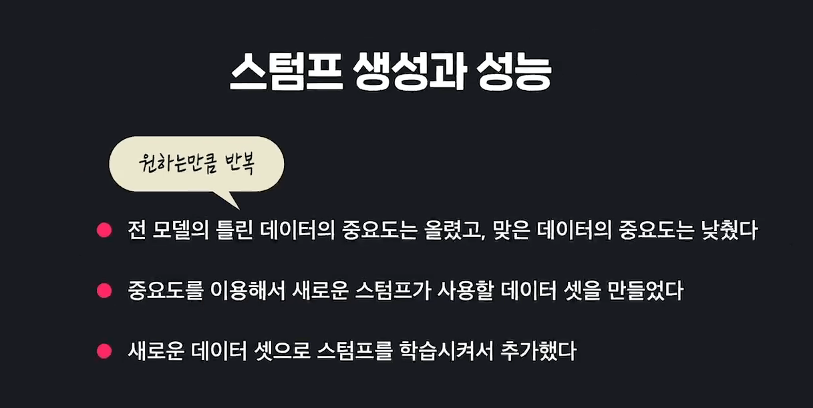

  이런식으로 해 가면, 첫번째 스텀프가 틀린 데이터들을 다음 스텀프가 조금 더 집중하게 되고, 이게 계속 반복됨. 


- #### 예측하기

  이제는 마지막으로 최종 예측을 하면 됨. 

  에다부스트를 이용해서 4개의 스텀프를 만들었다고 해보자. 스텀프 위의 숫자는 성능을 나타냄. 예측을 하려는 데이터에 대해서 2개는 독감, 2개는 일반감기로 예측함. 

  이때 독감 환자를 예측하는 스텀프들의 성능을 더하고, 일반감기를 예측하는 스텀프들의 성능을 더하면 됨. 

  스텀프의 다수결로 따지면 반반이여도 성능이 더 좋은 애들의 가중치를 더 높게 주는 것. 의견을 더 중요하게 듣는 것. 

  수 많은 스텀프들이 있어도 똑같이 하면 됨. 

  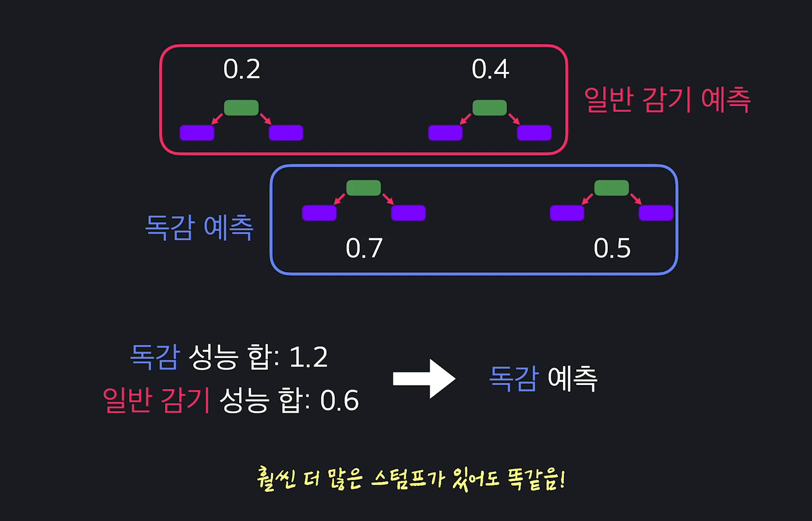


- #### Adaboost with Sklearn 

  ```python
  from sklearn.datasets import load_iris
  from sklearn.model_selection import train_test_split
  from sklearn.ensemble import AdaBoostClassifier
  import matplotlib.pyplot as plt
  import numpy as np
  
  import pandas as pd
  
  iris_data = load_iris()
  
  X = pd.DataFrame(iris_data.data, columns=iris_data.feature_names)
  y = pd.DataFrame(iris_data.target, columns=['class'])
  
  X_train, X_test, y_train, y_test = train_test_split(X, y, test_size = 0.2, random_state = 5)
  y_train = y_train.values.ravel()
  ```

  fitting

  ```python
  # n_estimators = 결정스텀프를 몇개를 만들것인가? 기본값은 10
  model = AdaBoostClassifier(n_estimators= 100)
  model.fit(X_train, y_train)
  
  model.predict(X_test)
  
  model.score(X_test, y_test)
  ```

  Feature Importance Visualization

  ```python
  # Adaboost도 결정트리를 이용하기 때문에 속성중요도를 계산할 수 있음.
  importances = model.feature_importances_
  
  indices_sorted = np.argsort(importances)
  
  plt.figure()
  plt.title("Feature Importances")
  plt.bar(range(len(importances)), importances[indices_sorted])
  plt.xticks(range(len(importances)), X.columns[indices_sorted], rotation=90)
  plt.show()
  ```

  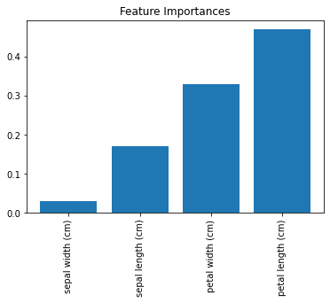

  

