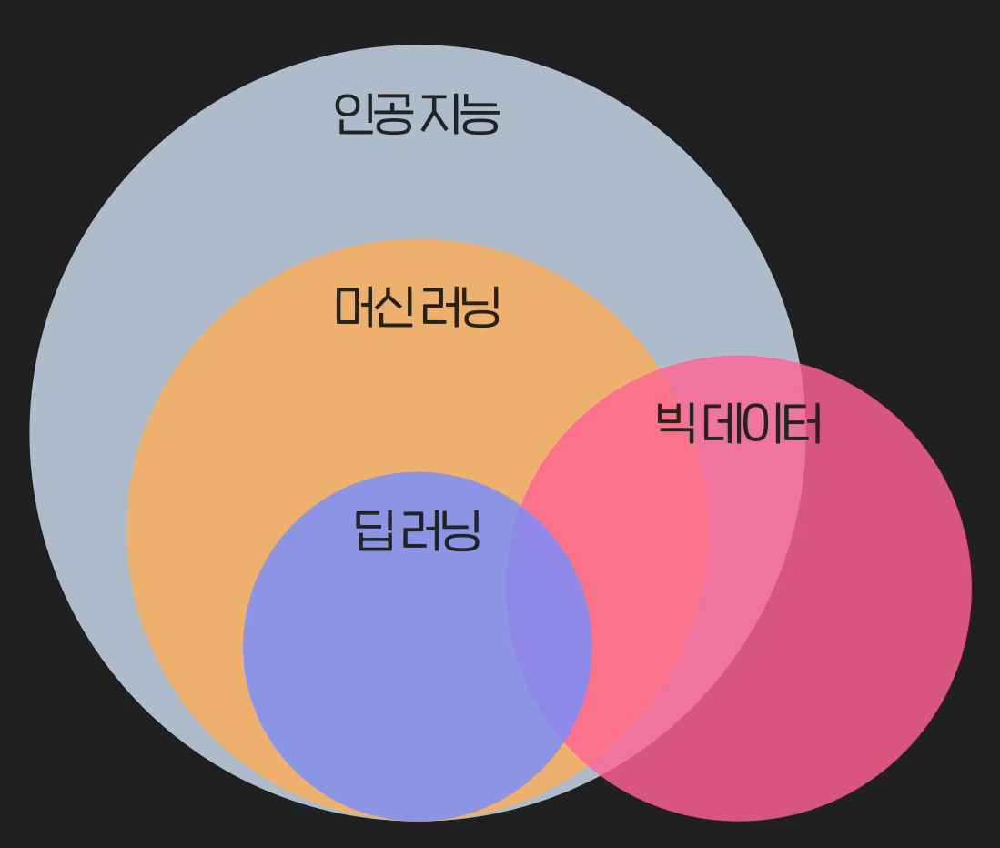
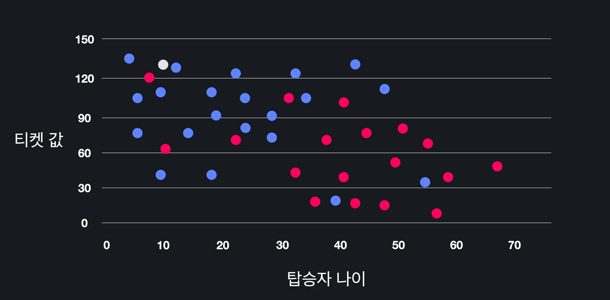
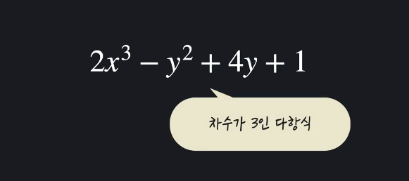
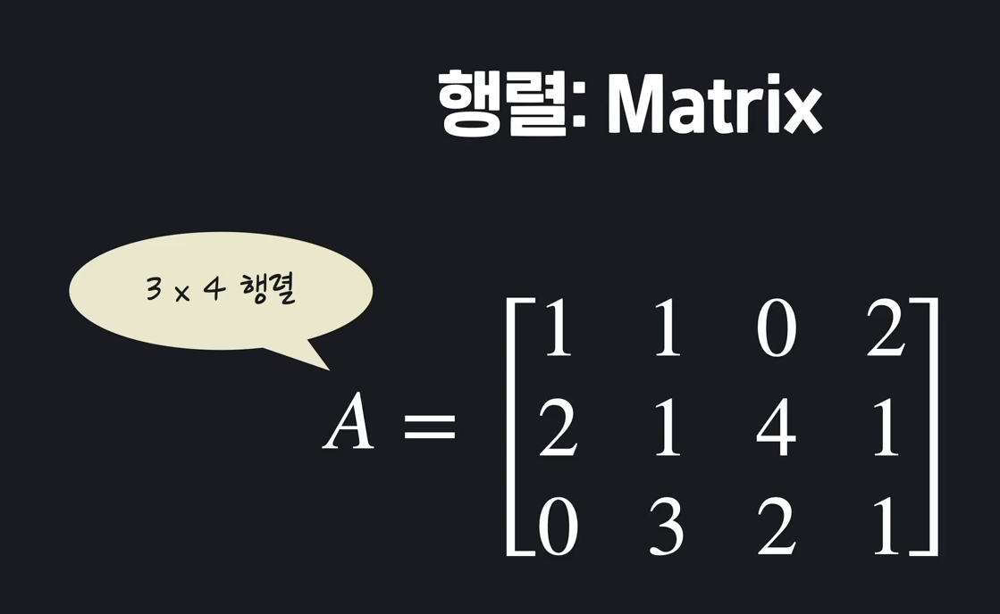
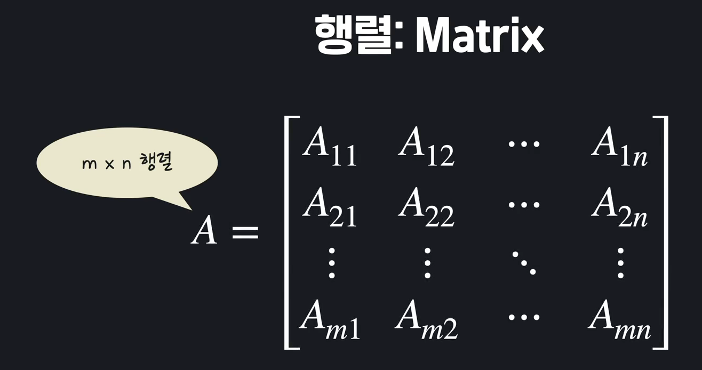
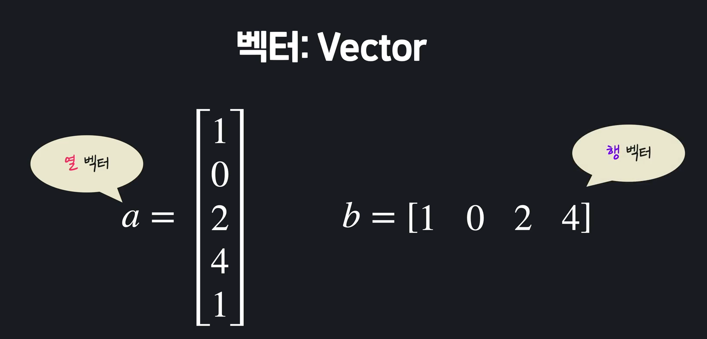
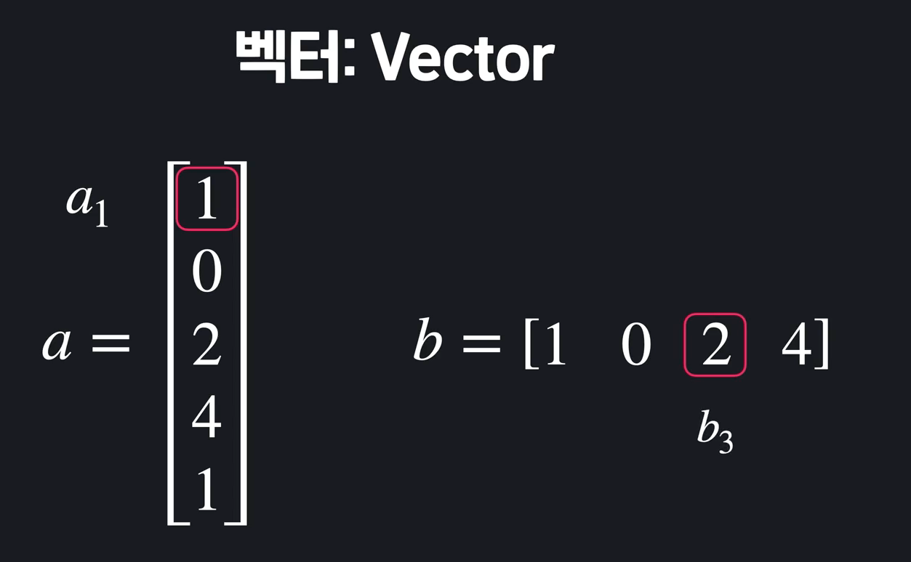

# Machine Learning

#### 머신러닝이란?

- 기계가 학습을 통해 발전하는 것. 경험을 통해서 스스로 업무 능력을 키운다. 
- 프로그램이 스스로 규칙을 찾는다. 데이터를 통해 컴퓨터가 스스로 규칙을 찾도록 하게 해준다. 
- 기계가 학습한다는 건, 프로그램이 특정 작업(T)을 하는 데 있어서 경험(E)을 통해 작업의 성능(P)을 향상시키는 것.  by Tom Mitchell 
- 머신러닝은 수십년 전부터 연구되어 왔으나, 사용가능한 데이터가 많아지면서, 컴퓨터 성능이 좋아지면서, 활용성이 증명되면서(예를 들어 유튜브는 머신러닝을 통해 사용자의 만족도와 광고주의 만족도를 동시에 높였음) 화두가 되었음. 

| 용어     | 설명                                                         |
| -------- | ------------------------------------------------------------ |
| 빅데이터 | 엄청나게 많은 데이터를 다루는 분야. 효율적인 보관과 처리, 분석방법 등. |
| 인공지능 | 프로그램이 인간처럼 생각/행동하게 하는 학문. 머신러닝이나 딥러닝은 인공지능이라는 최종 목표를 달성하게 해줄 것이라 기대하는 수단 중 하나. |
| 딥러닝   | 머신러닝의 기법 중 하나. 기계를 학습시키는 많은 방법들 중 하나. '층'이 깊어지는 방법. |
| 머신러닝 | 프로그램이 직접 학습을 통해 발전하는 것.                     |




#### 학습의 유형(지도학습, 비지도학습, 강화학습 3가지로 나뉘어짐)

1. 지도학습(Supervised Learning) : **답**이 있고, 이 답을 맞추는게 학습의 목적. 예) 스팸 분류. 지도학습도 크게 2 가지로 나뉘어짐. 학습 데이터의 답을 꼭 알려줘야 함. "프로그램에게 수 많은 문제와 그 문제에 대한 답을 가르쳐준다(지도한다)"

   - *분류(Classification)* : 몇 가지 옵션중에 고르는 것. 스팸인지 아닌지 둘 중 하나를 고른다. 
   - *회귀(Regression)*: 결과값 무수히 많고 연속적. 아파트 가격 예측. 1억일 수도 있고, 1억 2만 3500원일 수도 있음. 

2. 비지도학습(Unsupervised Learning) : **답**이 없음. 수 많은 article들 중 비슷한 article을 묶고 싶다면? 비슷한 article 이라는 것 자체가 정해진 답이 없음. 날짜?주제?글 길이? 등 기준이 너무 많아. 이 기준 자체를 프로그램이 만들게 하는 것(정치/경제 등의 분야를 알려주고, 새로운 기사를 준다음에 어디 분야냐고 물어본다면 그것은 지도학습). 비지도학습은 "너 나름대로 한번 묶어봐!" 이런 것. 

3. 강화학습

   

#### 맛보기 KNN(K-Nearest Neighbors Algorithm)

- 타이타닉 탑승자들의 데이터를 보고, 탑승자의 생존 여부를 예측하려고 한다(답이 있음. **지도학습**). 생존/사망 둘 중에 정하는 것이기 때문에 **분류문제**. 

- 그래프를 그려본다. 하단 그래프에서 생존했으면 파란색, 죽었으면 빨간색으로 칠함. 이때, 이 하얀 점의 새로운 데이터가 생존했을지 죽었을 지 예측해 보는 것. 

  

- kNN이 하는 것은 굉장히 간단함. 이 하얀색(노란색) 점에서 가장 가까운 K개를 찾는다.  k=5라고 가정하면, 가장 가까운 5개 중에 4개가 파란색. 이 노란 점은 생존자로 예측 하는 것. 

  

- 더 데이터가 많을 수록, 능력이 좋아지면 머신러닝 알고리즘. 데이터가 조금 밖에 없으면 주변 5개를 찾아도 신뢰가 안갈 수 있지만, 데이터가 엄청 많다면? 점점 믿음직스러워 질 수 있음. 


#### 머신러닝의 수학

- 알고리즘 선택과 코드 최적화를 위해서는 최소한의 수학 공부가 필요하다. 
- 선형대수, 미분, 통계, 확률
  - 선형대수학 : 행렬은 정보를 사각형 형태로 묶어 놓은 것. 행렬을 사용하면 많은 정보를 하나로 묶을 수 있음. 그리고, 그 개별적인 값들이 묶여서 효율적으로 계산이 됨. 주로 머신러닝에서 행이 사용됨. 
  - 미적분학: 최적화를 할때 사용됨. 
  - 통계학 : 많은 데이터들의 특징을 파악하기 위해 사용되어 짐. 데이터에서의 큰 흐름을 잘 파악한다면 더욱 데이터 분석이 간단해짐. 
  - 확률 : 가능성을 공부하는 학문. 생존 vs 사망확률을 가지고 예측을 해보는 것. 


#### 선형 대수학 

- 일차식(**가장 높은 차수가 1인 다항식**)이나 일차함수를 공부하는 학문. 2x + <u>3y</u> + <u>5z^2</u> 밑줄 하나 하나가 **항**. 각 항은 어떤 숫자와 변수를 곱한 형태. 이 항들이 여러 개인 것이 다항식. 2x^3에서 2가 계수이고, x가 변수. x가 몇번 곱해져 있는지를 이 항의 차수라고 함. just 3에서(**상수항** 이라고 부름)는 계수 1, 변수는 없고, 차수는 0. 하단 식에서, 가장 차수가 큰 항은 2x^3이고 이때의 차수는 3. 그러면 이 다항식은 **차수가 3인 다항식**이 된다. 

  

  하단 식은 가장 큰 차수가 1. 차수가 1인 다항식이라고 할 수 있음. 

  

  일차 함수는? 다항식과 똑같은데 **함수**라는 것이 유일한 차이. 수학에서 함수란 x에 어떤 값을 넣느냐에 따라 y의 값이 정해지는 것들. y = 3x+6, f(x) = 3x+6, 차수가 1인 함수!

  

- 일차식 표기법

  - 선형대수학을 하다 보면 다양한 변수가 등장하지만, 그냥 1차 식이랑 똑같음. 변수와 항이 많아질 뿐, 최대 차수가 1인 함수 혹은 다항식인 것은 변하지 않음.  

    


- 행렬과 벡터(행렬은 주로 대문자로, 벡터는 주로 소문자로 나타냄ㄴ)

  **행렬**

  - 행렬은 수를 직사각형 형태로 나열한 것. A 행렬 내부의 하나하나를 **행렬 A의 원소**라고 부름. 행렬의 가로줄을 row, 세로줄을 column 이라고 부름. 하단 A는 총 3행 4열의 행렬. 3x4 행렬. 혹은 이 행렬의 차원이 3x4이다 라고도 말함. 

    

    원소를 표현하려면? 

    - A21 => A의 2행 1열 => 2

    - A23 => A의 2행 3열 => 4

      

  - 그래서 i행 j열인 행렬이 있다면, 하단과 같이 원소들을 표기할 수 있음. 

    

  **벡터**

  - 행 혹은 열이 하나 밖에 없는 행렬. 행이 있으면 행벡터, 열이 있으면 열벡터 라고 부름. 열 벡터를 사용하는 경우가 훨씬 더 많음. 그냥 **벡터라고 하면 열 벡터를 말하는 것**. 

    

  - 벡터의 차원은? 벡터는 무조건 열 1개 혹은 행 1개 뿐임. 벡터의 차원을 얘기 할때는, 굳이 a x b 이렇게 얘기 안하고, a는 5차원의 열벡터, b는 4차원의 행벡터이다 라고 말함. 

  - 그리고, 벡터의 원소를 나타낼 때도 간단함. a1, b3 이렇게만 하면됨. 

    

  - 일반화 하자면, 

    


#### Numpy로 행렬 사용하기

**행렬 만들기**

- 리스트 안에 리스트 넣으면, 넘파이가 행렬을 만들어줌. 

  ```python
  A = np.array([
      [1, -1 , 2],
      [3, 2, 2], 
      [4, 1, 2], 
      [7, 5, 6]
  ])
  A
  ```

- 랜덤으로 만들기도 가능함

  ```python
  C = np.random.rand(3, 5)
  ```

  ```
  array([[0.20113022, 0.54288952, 0.24307198, 0.45813479, 0.64387165],
         [0.55765454, 0.73003153, 0.58749877, 0.33367469, 0.93243762],
         [0.54403612, 0.38963453, 0.00603929, 0.67140204, 0.147982  ]])
  ```

  ```python
  D = np.zeros((2, 4))
  D
  ```

  ```python
  array([[0., 0., 0., 0.],
         [0., 0., 0., 0.]])
  ```


**행렬에서 값 가져오기.** 

- 값 가져올때는, 리스트 처럼 0에서 시작한다는 것을 잊으면 안됨. 

  ```python
  array([[ 1, -1,  2],
         [ 3,  2,  2],
         [ 4,  1,  2],
         [ 7,  5,  6]])
  ```

  ```python
  A[0][2] # 2
  ```


**행렬 연산 1(덧셈, 스칼라곱)**

- 행렬의 덧셈과 뺄셈은 그냥 같은 자리끼리 더하고 빼면 끝. **더하고 빼기 위해서는 두 행렬의 차원이 같아야 함.** 


- 스칼라곱 : 행렬*숫자. 선형대수학에서는 **행렬의 원소가 아닌 일반 수를 스칼라 라고 부름**. 

  스칼라 곱은 그냥 해당 스칼라를 행렬 내부의 모든 원소에 곱하면 끝. 

  

 

**행렬 연산 1(두 행렬의 곱)**