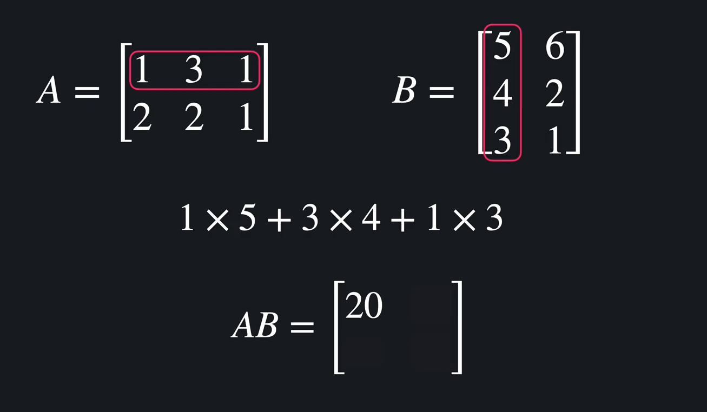
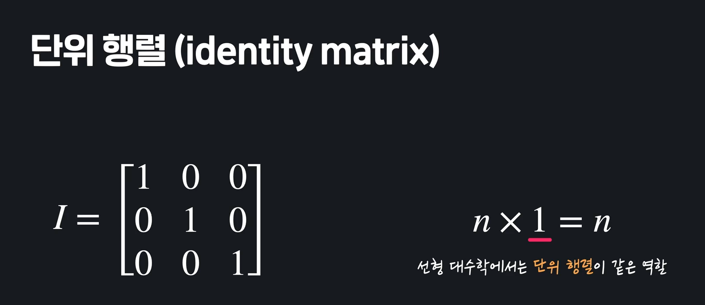
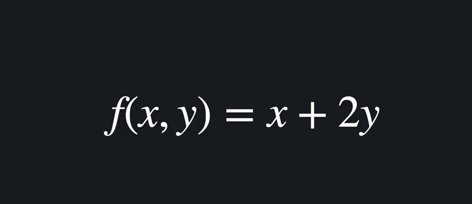

# Machine Learning

#### 머신러닝이란?

- 기계가 학습을 통해 발전하는 것. 경험을 통해서 스스로 업무 능력을 키운다. 
- 프로그램이 스스로 규칙을 찾는다. 데이터를 통해 컴퓨터가 스스로 규칙을 찾도록 하게 해준다. 
- 기계가 학습한다는 건, 프로그램이 특정 작업(T)을 하는 데 있어서 경험(E)을 통해 작업의 성능(P)을 향상시키는 것.  by Tom Mitchell 
- 머신러닝은 수십년 전부터 연구되어 왔으나, 사용가능한 데이터가 많아지면서, 컴퓨터 성능이 좋아지면서, 활용성이 증명되면서(예를 들어 유튜브는 머신러닝을 통해 사용자의 만족도와 광고주의 만족도를 동시에 높였음) 화두가 되었음. 

| 용어     | 설명                                                         |
| -------- | ------------------------------------------------------------ |
| 빅데이터 | 엄청나게 많은 데이터를 다루는 분야. 효율적인 보관과 처리, 분석방법 등. |
| 인공지능 | 프로그램이 인간처럼 생각/행동하게 하는 학문. 머신러닝이나 딥러닝은 인공지능이라는 최종 목표를 달성하게 해줄 것이라 기대하는 수단 중 하나. |
| 딥러닝   | 머신러닝의 기법 중 하나. 기계를 학습시키는 많은 방법들 중 하나. '층'이 깊어지는 방법. |
| 머신러닝 | 프로그램이 직접 학습을 통해 발전하는 것.                     |


#### 학습의 유형(지도학습, 비지도학습, 강화학습 3가지로 나뉘어짐)

1. 지도학습(Supervised Learning) : **답**이 있고, 이 답을 맞추는게 학습의 목적. 예) 스팸 분류. 지도학습도 크게 2 가지로 나뉘어짐. 학습 데이터의 답을 꼭 알려줘야 함. "프로그램에게 수 많은 문제와 그 문제에 대한 답을 가르쳐준다(지도한다)"

   - *분류(Classification)* : 몇 가지 옵션중에 고르는 것. 스팸인지 아닌지 둘 중 하나를 고른다. 
   - *회귀(Regression)*: 결과값 무수히 많고 연속적. 아파트 가격 예측. 1억일 수도 있고, 1억 2만 3500원일 수도 있음. 

2. 비지도학습(Unsupervised Learning) : **답**이 없음. 수 많은 article들 중 비슷한 article을 묶고 싶다면? 비슷한 article 이라는 것 자체가 정해진 답이 없음. 날짜?주제?글 길이? 등 기준이 너무 많아. 이 기준 자체를 프로그램이 만들게 하는 것(정치/경제 등의 분야를 알려주고, 새로운 기사를 준다음에 어디 분야냐고 물어본다면 그것은 지도학습). 비지도학습은 "너 나름대로 한번 묶어봐!" 이런 것. 

3. 강화학습

   

#### 맛보기 KNN(K-Nearest Neighbors Algorithm)

- 타이타닉 탑승자들의 데이터를 보고, 탑승자의 생존 여부를 예측하려고 한다(답이 있음. **지도학습**). 생존/사망 둘 중에 정하는 것이기 때문에 **분류문제**. 

- 그래프를 그려본다. 하단 그래프에서 생존했으면 파란색, 죽었으면 빨간색으로 칠함. 이때, 이 하얀 점의 새로운 데이터가 생존했을지 죽었을 지 예측해 보는 것. 

  

- kNN이 하는 것은 굉장히 간단함. 이 하얀색(노란색) 점에서 가장 가까운 K개를 찾는다.  k=5라고 가정하면, 가장 가까운 5개 중에 4개가 파란색. 이 노란 점은 생존자로 예측 하는 것. 

  

- 더 데이터가 많을 수록, 능력이 좋아지면 머신러닝 알고리즘. 데이터가 조금 밖에 없으면 주변 5개를 찾아도 신뢰가 안갈 수 있지만, 데이터가 엄청 많다면? 점점 믿음직스러워 질 수 있음. 


#### 머신러닝의 수학

- 알고리즘 선택과 코드 최적화를 위해서는 최소한의 수학 공부가 필요하다. 
- 선형대수, 미분, 통계, 확률
  - 선형대수학 : 행렬은 정보를 사각형 형태로 묶어 놓은 것. 행렬을 사용하면 많은 정보를 하나로 묶을 수 있음. 그리고, 그 개별적인 값들이 묶여서 효율적으로 계산이 됨. 주로 머신러닝에서 행이 사용됨. 
  - 미적분학: 최적화를 할때 사용됨. 
  - 통계학 : 많은 데이터들의 특징을 파악하기 위해 사용되어 짐. 데이터에서의 큰 흐름을 잘 파악한다면 더욱 데이터 분석이 간단해짐. 
  - 확률 : 가능성을 공부하는 학문. 생존 vs 사망확률을 가지고 예측을 해보는 것. 


# 선형 대수학 

- 일차식(**가장 높은 차수가 1인 다항식**)이나 일차함수를 공부하는 학문. 2x + <u>3y</u> + <u>5z^2</u> 밑줄 하나 하나가 **항**. 각 항은 어떤 숫자와 변수를 곱한 형태. 이 항들이 여러 개인 것이 다항식. 2x^3에서 2가 계수이고, x가 변수. x가 몇번 곱해져 있는지를 이 항의 차수라고 함. just 3에서(**상수항** 이라고 부름)는 계수 1, 변수는 없고, 차수는 0. 하단 식에서, 가장 차수가 큰 항은 2x^3이고 이때의 차수는 3. 그러면 이 다항식은 **차수가 3인 다항식**이 된다. 

  

  하단 식은 가장 큰 차수가 1. 차수가 1인 다항식이라고 할 수 있음. 

  

  일차 함수는? 다항식과 똑같은데 **함수**라는 것이 유일한 차이. 수학에서 함수란 x에 어떤 값을 넣느냐에 따라 y의 값이 정해지는 것들. y = 3x+6, f(x) = 3x+6, 차수가 1인 함수!

  

- 일차식 표기법

  - 선형대수학을 하다 보면 다양한 변수가 등장하지만, 그냥 1차 식이랑 똑같음. 변수와 항이 많아질 뿐, 최대 차수가 1인 함수 혹은 다항식인 것은 변하지 않음.  

    
    
    

- 일차식과 행렬/벡터는 무슨 상관이 있는 걸까?

  선형 시스템을 행렬과 벡터를 이용해서 표현할 수 있음. 행렬로 선형 시스템이 굉장히 간단하게 표현이 됨. 

  

- 그럼 선형대수학이 머신러닝에 왜 필요할까?

  아파트 가격을 예측해 본다고 하자. 집값은 크기, 지하철 역 거리, 층수에 영향을 받는다고 가정해보자. 크기가 주는 영향력은 *a1*, 지하철역과의 거리가 주는 영향력은 *a2*, 층수가 주는 영향력은 *a3*. 그래서 아래와 같은 식이 나왔음. 공식에 대입하면 가격은 다 나옴. 모두 일차식. 

  

  여기서 더 나가서 1차식을 행렬과 벡터로 정리할 수 있음. 이 행렬에서 각 행은 하나의 아파트를 나타냄. 각 열은 특징을 나타냄. 옆 벡터에는 각 특징이 끼치는 영향력이 들어있음. 

  

  ***요약하자면, 머신러닝을 할 때에는 데이터를 일차식에 사용하는 경우가 많다.*** 

  ***행렬을 이용하면 훨씬 더 정돈된 형태로 계산할 수 있다.*** 

  ***선형 대수학은 일차식, 일차함수, 행렬, 벡터를 다루는 학문이기 때문에 필수인 것.*** 

  

### 행렬과 벡터(행렬은 주로 대문자로, 벡터는 주로 소문자로 나타냄ㄴ)

**행렬**

- 행렬은 수를 직사각형 형태로 나열한 것. A 행렬 내부의 하나하나를 **행렬 A의 원소**라고 부름. 행렬의 가로줄을 row, 세로줄을 column 이라고 부름. 하단 A는 총 3행 4열의 행렬. 3x4 행렬. 혹은 이 행렬의 차원이 3x4이다 라고도 말함. 

  

  원소를 표현하려면? 

  - A21 => A의 2행 1열 => 2

  - A23 => A의 2행 3열 => 4

    

- 그래서 i행 j열인 행렬이 있다면, 하단과 같이 원소들을 표기할 수 있음. 

  

**벡터**

- 행 혹은 열이 하나 밖에 없는 행렬. 행이 있으면 행벡터, 열이 있으면 열벡터 라고 부름. 열 벡터를 사용하는 경우가 훨씬 더 많음. 그냥 **벡터라고 하면 열 벡터를 말하는 것**. 

  

- 벡터의 차원은? 벡터는 무조건 열 1개 혹은 행 1개 뿐임. 벡터의 차원을 얘기 할때는, 굳이 a x b 이렇게 얘기 안하고, a는 5차원의 열벡터, b는 4차원의 행벡터이다 라고 말함. 

- 그리고, 벡터의 원소를 나타낼 때도 간단함. a1, b3 이렇게만 하면됨. 

  

- 일반화 하자면, 

  


#### Numpy로 행렬 사용하기

**행렬 만들기**

- 리스트 안에 리스트 넣으면, 넘파이가 행렬을 만들어줌. 

  ```python
  A = np.array([
      [1, -1 , 2],
      [3, 2, 2], 
      [4, 1, 2], 
      [7, 5, 6]
  ])
  A
  ```

- 랜덤으로 만들기도 가능함

  ```python
  C = np.random.rand(3, 5)
  ```

  ```
  array([[0.20113022, 0.54288952, 0.24307198, 0.45813479, 0.64387165],
         [0.55765454, 0.73003153, 0.58749877, 0.33367469, 0.93243762],
         [0.54403612, 0.38963453, 0.00603929, 0.67140204, 0.147982  ]])
  ```

  ```python
  D = np.zeros((2, 4))
  D
  ```

  ```python
  array([[0., 0., 0., 0.],
         [0., 0., 0., 0.]])
  ```


**행렬에서 값 가져오기.** 

- 값 가져올때는, 리스트 처럼 0에서 시작한다는 것을 잊으면 안됨. 

  ```python
  array([[ 1, -1,  2],
         [ 3,  2,  2],
         [ 4,  1,  2],
         [ 7,  5,  6]])
  ```

  ```python
  A[0][2] # 2
  ```


**행렬 연산 1(덧셈, 스칼라곱)**

- 행렬의 덧셈과 뺄셈은 그냥 같은 자리끼리 더하고 빼면 끝. **더하고 빼기 위해서는 두 행렬의 차원이 같아야 함.** 


- 스칼라곱 : *행렬*숫자*. 선형대수학에서는 **행렬의 원소가 아닌 일반 수를 스칼라 라고 부름**. 

  스칼라 곱은 그냥 해당 스칼라를 행렬 내부의 모든 원소에 곱하면 끝. 

  

 

**행렬 연산 1(두 행렬의 곱)**

- **내적곱** 행렬 A와 B를 곱하려면, A의 열 수와 B의 행 수가 같아야 함. **행렬은 AB와 BA가 같지 않음**. 

  

  

  

***행렬 연산 numpy로 해보기***

```python
A = np.array([
    [1, -1 , 2],
    [3, 2, 2], 
    [4, 1, 2]
])
B = np.random.rand(3, 3)
```

- 행렬의 덧셈

  ```python
  A+B
  ```

- 스칼라곱

  ```python
  5*A
  ```

- 행렬의 곱셈

  ```python
  np.dot(A, B)
  ```

  혹은

  ```python
  A @ B
  ```

-  복합 연산 : 우리가 아는 사칙연산의 순서대로 계산됨. 

  ```python
  A @ B + (A + 2 * B)
  ```

  

  - **참고**

    ##### 요소별 곱하기

    영상에서는 두 행렬을 곱하는 방법은 두 가지, 외적곱과 내적곱이 있다고 했는데요. 저희는 내적곱에 대해서만 알아봤잖아요? 근데 사실 머신 러닝을 하면서 내적곱과 함께 유용하게 쓰이는 행렬 곱셈 연산이 하나가 더 있습니다.

    바로 **요소별 곱하기, 영어로는 Element-wise Multiplication**이라고 부르는 연산인데요. 행렬 덧셈 연산과 거의 똑같은 성질을 갖는 연산입니다. 바로 예시를 볼게요.

    

    이렇게 두 행렬이 있다고 할게요. 이걸 요소별 곱하기를 한다는 표기는 동그라미(\circ∘)를 써서 이렇게 표현합니다.

    

    요소별 곱하기는 이름 그대로 같은 행과 열에 있는 요소들끼리 곱해서 새로운 행렬을 만드는 연산입니다. A*A*의 행과 열에 있는 요소들과 B*B*의 행과 열에 있는 요소들을 서로 곱해서 새로운 행렬을 만드는 거죠. 실제로 계산을 하면 이렇게 되겠죠?

    

    조금 당연할 수도 있는 얘기인데요. 행렬 덧셈과 마찬가지로 **같은 차원을 갖는 행렬 사이에만 연산이 가능합니다**. 차원이 다르면 어떤 요소들이 곱할 다른 요소가 없는 거니까 말이 되죠? 지금은 두 행렬 모두 2 x 2 행렬이기 때문에 요소별 곱하기가 가능합니다.

    ##### numpy로 요소별 곱하기 하기

    사실 데이터 사이언스 입문 코스에서 이미 numpy를 이용해서 요소별 곱하기를 하는 방법을 봤는데요([바로 가기](https://www.codeit.kr/learn/courses/data-science/987)). 이번 노트에서 다시 한 번 볼게요.

    먼저 이렇게 두 개의 행렬을 정의하고 요소별 곱하기를 해보겠습니다.

    ```
    import numpy as np
    
    A = np.array([
        [1, 2, 3],
        [4, 5, 6],
        [7, 8, 9]
    ])
    
    B = np.array([
        [0, 1, 2],
        [2, 0, 1],
        [1, 2, 0]
    ])
    ```

    두 행렬 사이에 `*` 연산자를 쓰면 됩니다.

    ```
    A * B
    ```

    결과를 확인해보면 이렇게 나오는데요.

    ```
    arrray([0, 2, 6]
           [8, 0, 6]
           [7, 16, 0])
    ```

    각 요소들이 잘 곱해진 걸 확인할 수 있죠?


**전치행렬, 단위행렬, 역행렬**

- 전치행렬(traspoosed matrix) : 행과 열을 바꾼 행렬 2x3 -> 3x2

  

  왜 사용할까? 행렬 계산을 할때, 모양을 맞춰야 할 때가 있음. 기존 행렬에서 모양이 안맞으면 전치 행렬을 사용해서 맞춤. 

  

- 단위행렬(Identity Matrix): 항상 정사각형, 대각선만 1. 수학 계산 할때, 어떤 수든 1을 곱하면 그 수가 그대로 나옴. 선형대수학에서는 단위행렬이 그 역할을 함. 어떤 행렬이든 단위행렬을 곱하면, 그 상태 그대로 나옴. 

  

- 역행렬(Inverse Matrix) : 자기 자신과 곱했을 때, 단위행렬이 나오게 하는 것. A의 차수로 -1 써서 **A^-1**로 표현함. 그리고 역행렬은 정사각형 이여야 함. 그리고 모든 행렬에 역행렬이 있는 것은 아님. <span style="color:green">뭘 곱해줘도 I 가 절대로 안나오는 경우도 있음. </span>

  

   

- Numpy로 해보기

  ```python
  A = np.array([
      [1, -1 , 2],
      [3, 2, 2], 
      [4, 1, 2]
  ])
  ```

  **전치행렬**

  ```python
  A_transpose = np.transpose(A)
  A_transpose
  
  # result
  array([[ 1,  3,  4],
         [-1,  2,  1],
         [ 2,  2,  2]])
  ```

  or 

  ```python
  A.T
  
  # result
  array([[ 1,  3,  4],
         [-1,  2,  1],
         [ 2,  2,  2]])
  
  ```

  **단위행렬**

  ```python
  I = np.identity(3)
  I
  
  # A@I 해보면 그대로 나오는것 확인 가능. 
  ```

  **역행렬** pinv함수는 역행렬이 없는 경우에도 뭔가를 리턴해줌. 역행렬과 최대한 비슷한 효과를 낼 수 있는 **행렬을 만들어서 리턴해줌**. 

  ```python
  A_inverse  = np.linalg.pinv(A)
  A_inverse
  
  A_inverse @ A
  
  # result
  array([[ 1.00000000e+00, -3.33066907e-16, -2.22044605e-16],
         [ 4.44089210e-16,  1.00000000e+00,  0.00000000e+00],
         [-8.88178420e-16,  1.11022302e-16,  1.00000000e+00]])
  ```

  > `numpy.linalg.pinv` 함수는 파라미터로 받은 행렬이 역행렬이 있으면 역행렬을 리턴하고, 역행렬이 존재하지 않을 경우 Moore-Penrose inverse라는 걸 계산해서 리턴해줍니다.
  >
  > 행렬 A*A* 에 대한 pseudo-inverse 행렬은 A+(A밑 첨자 +) 이렇게 표현합니다. 역행렬과 마찬가지로 두 행렬의 곱 **A x A+** 은 **I** 가 나오죠. 행렬 A 가 정사각행렬이 아니여도, 또는 다양한 이유로 역행렬을 계산하는 게 불가능해도, 단순히 **A** 에 곱해서 **I** 가 되는 아무 행렬이나 찾아주는 거죠 (하나의 행렬에 대해서 여러 개의 pseudo-inverse가 있을 수 있습니다. unique하지 않을 거죠).
  >
  > 진짜 역행렬은 단순히 원래 행렬에 곱해서 I*I* 가 나오는 것 이외에 여러 가지 특성들이 있는데요. pseudo-inverse는 역행렬이 갖는 모든 특성들을 보장하지는 않습니다.
  >
  > 1. 역행렬이 존재하지 않음에도 pseudo-inverse 행렬를 사용하는 건 수학적으로 의미가 있습니다. (일반 역행렬이 존재하지 않는 경우 같은 효과를 낼 수 있는 행렬을 쓸 수 있기 때문)
  > 2. 행렬 A가 정사각행렬이 아니거나 역행렬을 계산할 수 없을 때 사용합니다. (역행렬이 없을 때 역행렬과 같은 효과를 내는 행렬이 필요할 때)


# 미분

- 함수와 그래프를 확실히 알아야 미분을 이해할 수 있음. 


#### 함수

- 함수: input을 받아서, 무엇인가 계산을 해서  ouput을 냄. y = 3x + 6. y는 x에 대한 함수. 

  **하나의 인풋에 대해서 하나의 아웃풋만 있어야 함**. 아래의 식에서 x가 인풋이고 y가 아웃풋이라고 하면, 하나의 인풋에 대해서 여러개의 아웃풋이 존재함. 

  

  

- **f(x) = y = 3x+6**

  함수는 고차함수일 수도 있고, 인풋값이 몇개씩(*다변수 함수* 라고 함) 될 수도 있음. 

  

  

- 현실 세계에서의 함수

  

  

#### 그래프

- 그래프는 수학식을 시각적으로 표현하는 방법. 그래프를 그리는 이유는 "**함수의 특징들을 간편하게 보기 위해서**" x의 변화에 따라 y가 어떻게 움직이는지를 쉽게 알 수 있음. 

  **함수 안에 들어가는 모든 점을 찍으면 됨**. 선 위의 모든 점은, 이 함수 f(x)에 부합하는 점. 

  

  


#### 평균변화율

- 

  위의 그래프는 무엇을 보여주는가? x가 변하면서 y가 어떻게 변하는지를 보여줌. 

  **기울기란 : x가 변화할 떄, y는 얼마나 빠르게 변하는지**. 기울기가 크면,  y의 변화가 빠르고, 기울기가 작으면 y의 변화가 느려짐. 위 그래프는 x가 1만큼 커질 때, y는 2만큼 커짐. 

- 하단의 그래프에서는 x가 커질수록 기울기도 커짐. 

  

- 그런데 위 그래프에서는 기울기를 어떻게 구할까? 그 점에 딱 맞닿아 있는 직선을 그린다. 이 선의 기울기가 x가 그 점일 때의 기울기값. 이 기울기를 계산하기 위해서는 **순간변화율** 이라는 것을 계산하게 됨. 그리고 순간변화율을 이해하기 위해서는 **평균변화율**을 알아야 함. 

  a와 b에서의 평균변화율을 알고 싶다면, 해당 두 점을 선으로 그어서 그 기울기를 구하면 됨. 

  평균변화율을 구하는 것은 **(f(b) - f(a) / b - a)**하면 끝. 

  


### **순간변화율**

- 직선이 아니면, 위치마다 기울기가 다름. 가파른 부분도 있고, 평평한 부분도 있음. 

  평균변화율 공식을 응용해서 순간변화율을 구할 수 있음.

  h를 극한으로 줄여서 0에 가깝게 만들면 됨. 

  

  ​			

  

#### 미분 

- 순간 변화율 공식에 특정 값 대신, x를 넣은 것. 그냥 x를 넣고 계산해보자. 이것도 함수로 표현함. f'으로 표현. 

  

  이 식이 나왔으면, 특정 점에서 기울기 알고 싶으면 이 식에 그냥 대입만 하면됨. 

  

  **미분은 별개 아니다. 그냥 f'(x)는 f(x)의 x라는 점에서의 기울기를 구해주는 함수**일 뿐. 

- 미분을 쉽게 구하는 법. 

  

  


#### 가장 가파른 방향(2차원)

- 2차함수 에서는 **기울기**는 음수든 양수든 **0에서 멀어질수록 가파라지고, 0에 가까울수록 평평해짐**. 

- 기울기가 음수라는 것은 해당 지점에서  x가 커질수록 y가 작아진다는 것. 0에 가까울수록 비교적 평평해 진다는 것. 

  

  기울기가 양수라는 것은, X가 커지면 y도 같이 커지는 것. 여기도 0에서 멀어질수록 비교적 평평해지고, 0에서 멀어질수록 가파라짐. 

- 하단 점에서의 기울기가 -2라고 한다면, 음수이기 때문에 왼쪽으로 가야 더 큰 y값으로 갈 수 있고,  오른쪽으로 가면 더 작은 y값으로 갈 수 있다. 

  해당 지점에서 기울기가 양수라면, 오른쪽으로 가야 더 큰 y값으로, 왼쪽으로 가면 더 작은 y값으로 갈 수 있다는 뜻. 

  

- **즉 기울기는 해당 지점에서 얼마나 기울어져 있는지도 보여주지만, 어떤 방향으로 가야 가장 가파르게 올라갈 수 있는지도 보여준다**. 


#### 극대점과 극소점

- 순간변화율이 양수라는 것은, 해당 지점에서 x가 늘어나면 y도 커진다는 것. 반대로 순간변화율이 음수라는 것은 해당 지점에서 x가 증가하면 y는 줄어든다는 것. 

- 그런데 순간변화율이 0인 지점은 조금 특별함. **해당 지점에서 x가 변해도 y가 그대로 라는 것**. 

  - **극소점**은 아래로 볼록한 경우. 해당 경우에서는 기울기가 **왼쪽은 음수, 오른쪽은 양수가 됨**. 기울기가 음수에서 양수로 변하면서 0을 찍고가는 점. 하지만, 극소점이라고 꼭 최소점은 아님. 그래서 극소점은 **local minimum**, 진짜 최소점은  **global minimum**이라고 부름. 

  

  - 반대로 **극대점**은 위로 볼록한 경우. 기울기가 양수에서 음수로 전환되는 그 점.  극대점 중 가장 큰 점을 global maximum, 나머지 극대점들은 local maximum이라고 부름. 

    

  - **안장점(Saddle Point)**인 경우가 있음. 

    기울기는 계속 + -> + 혹은 - -> -로 가는데 중간에 기울기 0을 찍고 간 경우. 

    


#### 고차원에서의 미분(편미분)

- 인풋변수가 여러개라면?  이제부터는 x와 y 이상이 필요함. 머릿속으로 상상하는 것도 불가능함. 그냥 숫자로 나타낼 수만 있을 뿐. 

  

  

- 다변수함수에서는 어떻게 미분할까? 이럴때는 **편미분** 이라는 것을 해야함. **편미분이란** 함수는 변수 하나에 대해서만 미분하는 것. 

  - **x에 대해서 편미분** 한다면? 기호도 꼬부라진 d로 써야 함. x를 제외한 나머지는 다 상수인 것으로 취급하면 됨. 

    

  - **y에 대해서 편미분**하면? 

    

  - 이제 이 두 편미분의 결과를 합쳐서 **벡터**를 만들어 보자. 이 벡터가 바로 이 함수의 기울기이고, 아래처럼 역세모 기호를 사용함. 

    

    이제 쉽지, x와 y가 1인 지점의 기울기를 알고 싶다면? 그 값을 대입만 하면 됨. 

    

    위에서 f(x, y)일때의 편미분 벡터의 의미 자체가 x의 미분값은 **y를 고정했을때**, y의 미분값은 **x를 고정했을때**라는 전제가 깔려 있는 것. 

    **기울기가 벡터 2, 4라는 것**. 근데 이게 대체 무슨의미일까?

    이 2라는 값을 구하기 위해서 x에 대해 편미분을 했고, 이때  y를 상수로 가정했었음. 2라는 값은 y = 1 가 고정되어 있고, x가 1일때의 f의 기울기가 2라는 것.  

    더 쉽게 말하자면, y를 1로 고정하면 변수는 하나가 됨. f(x, 1) 이 2차원 그래프에서 x = 1 에서의 기울기가 2 라는 것. 

    

    그리고 4를 구하기 위해서는 y에 대해 편미분했음. 이것도 마찬가지로  x를 1로 고정했을 떄,  y는 1에서의 기울기가 값이 4라는 것. 

    

#### 가장 가파른 방향(고차원)

- 아래 함수에 대해 편미분을 하고, 벡터를 만들었음. 이 벡터는 또 하나의 유용한 정보를 알려 줌. 우리가 해당 그래프(함수)위에 딱 놓였다고 해보자. 여기서 어떤 방향으로 가냐에 따라 더 낮은 곳으로 내려갈수도 있고, 더 높은곳으로 가게 될 수도 있음. 그리고, 조금 더 가파르게 올라갈 수도 있고, 조금 덜 가파르게 올라갈 수도 있음. 기울기 벡터가 바로 그것을 알려줌. 

  

  **고차원 그래프에서도 기울기가 그 방향을 알려주게 됨**. 대신 고차원그래프에서는 기울기가 벡터인 것. 예를 들어 현재 (1, 1) 지점에 놓여 있다면, 그럼 기울기 벡터는 [2, 4]. 이 벡터를 표시하면, x방향으로 2칸 y방향으로 4칸 가서 대각선 방향으로 그려짐. 기 대각선 방향으로 움직이면 가장 가파르게 올라갈 수 있는 것. 

   

  가장 가파르게 내려가고 싶다면, 그냥 이 기울기벡터에 -를 붙여주면 됨. 

  

- 인풋변수가 3개가 넘어가면 그때부터는 사실상 시각적으로 이해하는 것은 불가능. 하지만 이것은 인풋변수가 아무리 많아져도 똑같이 적용됨. 편미분을 통해 기울기 벡터를 그리고, 이 기울기 벡터는 함수에서 가장 가파르게 올라가는 방향을 알려주게 됨. 

  


#### 머신러닝에 미분이 필요한 이유

- 순간변화율 이라는 것을 통해서, 우리는 함수의 최소/최대지점, 증가, 감소지점 등을 알아낼 수 있음. 

- 머신러닝은 특정 작업에 대한 성능이 좋아지는 프로그램. 머신러닝의 성능을 어떻게 평가하고 어떻게 최적화 할 수 있을까? 그 성능을 평가하는 기준도 결국은 함수로 표현하는 것. 

- 아래 식이 특정 모델의 성능을 평가하는 함수라고 해보자. 구체적으로는 이 함수는 이 모델의 성능이 얼마나 안좋은지를 평가한다고 해보자. output이 작을수록 성능이 좋다. 그럼 당연히 이 함수에서 제일 낮은 지점으로 향하고 싶겠지. 제일 낮은 지점을 찾으면, 이 머신러닝 모델이 최적화가 제일 잘 된 것. 

  즉 머신러닝 모델의 최적화를 위해서는 결국은 함수의 극대점이나 극소점을 찾아야 함. 그걸 하기 위해서는 순간변화율, 미분, 기울기 등의 개념이 필요했던 것. 

  


### 정리 with 현우


-  