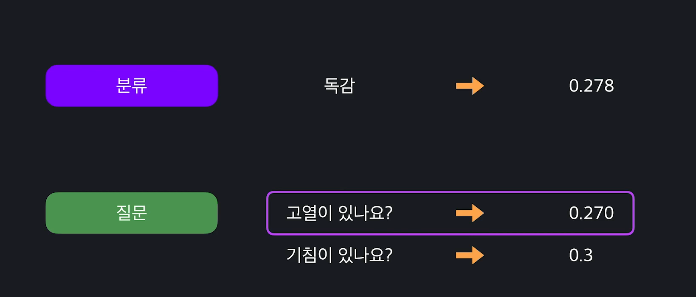
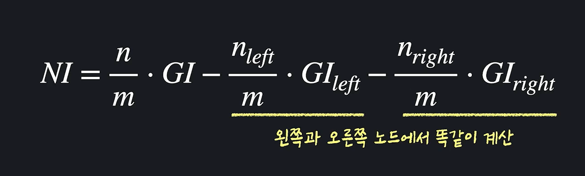

# Decision Tree

결정트리는 예/아니오로 답할 수 있는 질문들이 있고, 그 질문들을 답해나가면서 분류하는 알고리즘. 


그 외에도, 시속 100km가 넘었나요? 등의 다양한 질문이 가능함. 


**그리고 중요한 것은 한 속성을 딱 한번만 사용해야 하는 것도 아님.** 100km넘냐고 묻고, 다른 분류 후에 다시 시속 60km넘었냐고 묻고 있음. 


컴퓨터 과학에서는 이렇게 한 점에서 시작해서 점점 넓게 퍼져나가는 것을 트리라고 함.

1. 하나의 시작 지점에서 퍼져나가는 모습이 마치 나무와 비슷하고,
2. 그리고 한 단계 내려갈 때마다 왼쪽으로 갈지 오른쪽으로 갈지 선택하는

알고리즘 이기 때문에 이름이 **Decision Tree**인 것. 

이 박스 하나하나를 **노드**라고 함. 조금 더 구체적으로는 맨 위에 있는 노드를 **root노드** 트리의 맨 끝에 있는 노드들을 **leaf노드** 라고 부름. 

*leaf노드는 항상 사망/생존과 같은 예측값들을 가지고 있고, 나머지 노드들은 예/아니오 라고 대답할 수 있는 질문을 가지고 있음.* 


- #### 지니불순도(Gini Impurity)

  *각 노드에 어떤 질문 혹은 분류가 들어갈지 어떻게 결정하는 거지?*

  머신러닝이 결정트리를 만들때는, 미리 질문들이 다 정해져 있는 것이 아니라, 경험을 통해 정해나가는 것. 여러 데이터를 분류해보면서 각 위치에서 어떤 노드가 제일 좋을 지, 고르는 것. 이걸 제대로 하려면 어떻게 분류하거나 질문하는 것이 좋은지 혹은 안좋은지에 대한 기준이 있어야 함. 즉, **손실함수** 같은 개념이 필요하지. 

  결정트리에서는 이 기준이 지니불순도. 

  

  지니불순도는 데이터셋 안에 서로 다른 분류들이 얼만큼 섞여있는 지를 나타냄. 한 데이터셋 안에 한가지만 쭉 있으면 순수한 데이터셋, 반반 씩 있으면 100% 불순한 데이터셋임. 그리고 지니불순도는 데이터셋이 얼마나 불순한지를 숫자로 표현해줌. **지니불순도가 낮을수록 데이터는 순수함.** 가장 순수한 데이터는 지니불순도가 0. 

  

  

  

  


- #### 분류 노드 평가하기

  지니불순도를 이용해서 노드를 정해보자. 실제로 만들어보자. 

  

  **일단 루트노드를 만들어야 함.** 

  바로 만들 수 있는 것들이 있지 아래처럼.  

  

  1. **질문 노드를 만들지 않고 바로 분류 노드를 만들 수 있습니다. 예를 들어 바로 모든 데이터는 모두 독감이다, 아니면 일반 감기다. 이렇게요(그냥 정말로 질문노드가 없이, 한방에 분류하는 경우를 말하는 것).** 

  2. **“고열이 있나요?”, “기침이 있나요?”, “몸살이 있나요?” 이 세 질문 중 하나를 노드로 만들 수 있습니다.**

     

  

  근데 이 중에 어떤걸 골라야 할까? 이때 좋다 안좋다를 결정하는게 지니불순도. 

  학습에 사용되는 총 데이터 갯수는 현재 90개임. 

  루트노드는 모든 데이터가 거쳐야 하는 노드. 그렇기때문에 이 90개를 모두 사용함. 좋은 분류노드는 최대한 많은 학습데이터 예측을 맞춰야 함. 그럴려면, 이 모든 데이터를 하나로 분류로 예측했을 때 최대한 많이 맞아야 함. 

  *분류 노드를 만들 때는 항상 데이터 셋에서 가장 많은 분류로 만듭니다. 지금 같은 경우 독감 데이터가 일반 감기 데이터보다 많기 때문에 독감 노드를 고릅니다.*

  지금은 독감이 일반감기보다 많기 때문에 **독감**으로 고름. 한명이라도 더 확률적으로 많이 맞아야 되니깐. 

  

  *그럼 이 독감 노드는 정확히 얼마나 좋은 걸까요?*

  

  지금은 불순도가 꽤 높음. 불순도가 높다는 말은 독감과 일반감기 데이터가 많이 섞여있다는 뜻. 데이터가 불순할때 위처럼 분류노드를 만들면 별로 성능이 안좋음. 분류노드 만드는 경우에 이 데이터의 불순도를 계산하면 어느정도 맞게 분류할 수 있는지를 한번에 알 수 있는 것. 

- #### 질문노드 평가하기

  질문노드가 얼마나 좋은지 평가해보자. 결정트리에서 좋은 질문은 데이터를 잘 나누는 질문. 고열이 있나요를 물어봤더니, 고열이 있는 데이터는 모두 독감이고, 아닌 데이터는 모두 일반감기면 엄청 잘 나눈 것.  

  

  질문으로 데이터를 나눴는데, 막 섞여있으면? 좋지 않은 질문이지. 

  

  **즉, 좋은 질문은 데이터를 잘 나눠서 아래 노드들이 점점 더 분류하기 쉽게 만들어 줘야 함.** 

  *고로, 질문노드의 성능을 평가할때는, 하단에 나뉜 두 데이터셋의 불순도를 평가함. 불순도가 낮을수록 좋음.* 

  

  예를 들어서, 고열이 있냐고 물어봤는데 아래처럼 나오는 경우.

  하단의 나뉜 데이터의 불순도를 구한 다음에 **데이터수 만큼 가중평균 치면 됨**. **낮을수록 좋고, 높을수록 안좋은 것.** 

  


> ​		계산했더니 루트노드에서 분류노드의 불순도가 가장 작으면? 1 layer로 끝나는 거야. 이런 경우는 Decision Tree를 이용할 의미가 없다는 것. 독감이 있나요? 고열이 있나요 물어봐서 나누는 것 보다, 독감입니다 하고 한 번호로 미는게 더 좋다는 의미. 이러면 Decision Tree를 왜 써.  


- #### 노드고르기

  지난 번 수업에서 말했던 여러 질문들의 불순도를 모두 계산해 보자. 그리고 노드를 고르는 건 간단하지. 그냥 여기서 부순도 제일 낮은거 고르면 됨. Why? 그게 가장 잘 분류하고 있는 거니깐. 분류노드의 불순도가 작으면 이미 데이터가 잘 나뉘어 있으니깐, 그대로 하면 된다는 것. 질문노드의 불순도가 더 낮으면, 질문을 통해서 불순도를 더 낮출 수 있다는 뜻. 

  


- #### 모든 노드 만들기

  지금까지는 본거는 모두 루트노드 만드는 것을 배운 것. 근데 나머지도 똑같이 하면 돼. 루트노드의 왼쪽, 오른쪽을 가지고 학습데이터를 보며 가장 좋은 노드를 찾아보면 되는 것. 

  만약 루트노트가 **몸살이 있나요?** 였다면, 이제 남은 노드들 중에서 좋은걸 골라야겠지. 데이터가 숫자면, 위에서 '*시속 50km이상입니다*' 가 있어도 아래서 '100km 이상입니다. ' 이게 가능함. 그런데, 여기서는 그렇게는 안되겠지. 

  

  분류로 먼저 해보자. 

  

  이제 나머지 지금까지 했던거랑 똑같이 지니불순도 계산해 보면 됨. 

  

  **제일 불순도 낮은 것 골라서 이렇게 두번째 노드를 완성한 것.** 

  

​		**방금 이 과정들을 트리의 맨 마지막 leaf node들이 모두 분류노드가 될 때까지 반복하면 됨.** 반복하면 아래처럼 결정트리를 만들 수 있음. 

​			

**TIP: 분류 노드인 독감! 이게 계속 껴 있어야, 마지막이 분류 노드가 될때 까지 진행이 되지. 그게 아니면 계속해서 질문 노드만 고르게 됨. 지금 위 결정 		트리는 결국 해당 칸에서 마지막 제일 불순도 작은 놈이 분류노드가 될 때 까지 하고, 분류노드가 나오면 멈춘 거야.** 

​		*트리가 몇층까지 내려가는지를 깊이 라고 하는데, 깊이 3 이상은 내려가지 마라 이렇게 정해줄 수도 있음.* 최대깊이제한이 3으로 걸려 있으면 그 3까지 내려오면, 더 이상 불순도 비교를 멈추고 그냥 분류노드를 넣으면 됨. 


- #### 속성이 숫자형일 때 질문노드

  지금까지 본 속성들은 모두 참 거짓으로 바탕한 불린형 데이터였습니다. 그렇기 때문에 그냥 “고열이 있나요?” 이렇게 할 수 있는 질문이 하나밖에 없었는데요.

  데이터가 가장 왼쪽 속성처럼 (체온이 몇 도인지 나타내는 데이터) 숫자형으로 있는 경우에는 만들 수 있는 질문이 엄청 많습니다.

  

  예를 들어 체온이 “37.1도를 넘나요?”, 체온이 “37.2도를 넘나요?”, 체온이 “37.3도를 넘나요?” 이렇게 끝도 없이 질문이 많을 수 있는데요. 이번 레슨에서는 이렇게 하나의 속성에서 만들 수 있는 수많은 질문들 중, 하나를 고르는 법을 볼게요.

  **가장 먼저는 체온 데이터를 정렬시킵니다. 그럼 작은 순서부터 큰 순서대로 데이터가 있겠죠? 그 다음에는 각 연속된 체온 데이터의 평균을 계산합니다.** 그리고 이 평균들을 이용해서 질문들을 하나씩 만드는 거죠.

  그 다음에 모든 평균 체온에 대해서 지니 불순도를 계산합니다. 그러니까 그 평균을 기준으로 삼았을 때 데이터가 얼마나 잘 분류됐는지를 전부다 계산해 주는 겁니다. **2개씩 모든 평균을 계산해서 다 각각의 불순도를 구하라는 것. 0_0** 

  

  그렇게 해서 이 중에서 가장 지니 불순도가 낮은 질문이 있을 텐데요. 예를 들어서 체온이 37.5를 기준으로 나눴을 때가 가장 지니 불순도가 낮다고 할게요. 그럼 체온 속성 관련 질문 노드를 만들 때 대표로 “**체온이 37.5가 넘나요?**”를 사용하면 됩니다.

  체온을 기준으로 사용할 때 기준이 “37.5가 넘나요?”긴 해도 몸살이 있는지 없는지가 더 좋은 기준이 될 수 있는 거잖아요?

  그러니까 **“37.5가 넘나요?”, “몸살이 있나요?”, “기침이 있나요?” 이 세 질문과 “독감” 분류 노드들 중 가장 지니 불순도가 낮은 거를 선택하면 됩니다.**

  그리고 다음 노드를 만들 때도 자동으로 똑같이 체온 질문을 “37.5가 넘나요?”로 사용하는 건 아니고요. 매번 노드를 만들 때마다 위에서 했던 거처럼 해당 노드까지 오는 학습 데이터에 대해서 가장 좋은 체온 질문을 찾아내야 합니다.

  이렇게 하면 데이터가 불린형이든 숫자형이든 상관 없이 결정 트리 노드들을 만들어 나갈 수 있습니다.


- #### 속성중요도(Feature Importance)

  결정트리는 수 많은 머신러닝 알고리즘들 중, 데이터를 분류하는 방법이 직관적이라는 것 외에도 또 다른 장점이 있음. "**쉽게 해석할 수 있다**"는 것. 즉, 해석할 수 있다는 것은 어떤 속성이 더 중요하게 사용됐는지 알 수 있다는 것. 

  

  

  이번 레슨에서는 만들어 놓은 트리를 이용해서 Feature Importance를 계산하는 방법을 알아보자. 

  속성 중요도를 계산하기 위해서는 각 노드 하나하나의 중요도(Node Importance)를 알아야 함. 

  

  **n= n(left) + n(right) 이것도 가중치를 주는 것.** 

  

  1. 일단 계산하려고 오는 노드까지 오는 데이터 수와, 불순도를 곱한 후 총 데이터 수로 나눈다. 
  2. 이거를 왼쪽/오른쪽 노드에서 똑같이 계산한다. 

  예를 들자면, 

  루트노드까지 오는 데이터의 수는 **90**개, 이 노드의 불순도는 **0.333**(*질문노드 였으니깐, 아래 나눠지는 두개 노드의 불순도 평균친거*). 

  그리고 그 왼쪽 오른쪽이 있을텐데, 질문노드면 다시 그 아래의 두개의 불순도 평균쳐서 불순도 구할 수 있고, 분류노드면 그 자체로 불순도 구할 수 있지. 그 세개만 있으면 계산 가능함. 

  

  **근데 이 중요도가 뭘 수치화 한 것일까?**

  > 위 노드까지 오는 데이터 셋의 지니 불순도가 있고, 왼쪽 노드까지 오는 데이터 셋의 불순도, 그리고 오른쪽 노드까지 오는 데이터 셋의 불순도가 있습니다. **위 노드의 불순도에서 아래 노드들의 불순도를 뺀 거잖아요? 여기에 그냥 각 노드들까지 가는 데이터의 비율을 맞춰준 겁니다.**
  >
  > 생각해보면 이건 한 노드에서 데이터를 두 개로 나눴을 때, **데이터 수에 비례해서 불순도가 얼마나 줄어들었는지를 계산하는 겁니다.** 지니 불순도는 낮을수록 좋은 건데요.
  >
  > 특정 노드가 얼마나 중요한 노드인지를 판단할 때, 이 노드 전후로, 불순도가 얼마나 낮아졌다. 이걸 사용하는 거죠. 불순도가 낮아질수록 나눠지는 데이터 셋들이 점점 독감 또는 일반 감기 데이터 중 하나가 많아지고 있는 거잖아요? 나눠지는 데이터 셋들에 대해서 점점 더 알아간다, 또는 “더 많은 정보를 얻는다”라고 해서 이 수치를 정보 증가량, 영어로는 information gain이라고도 부릅니다.

  각 노드들의 데이터 수 다 빼고 보면, 해당 노드까지 오는 데이터 불순도와 왼쪽/오른쪽 노드의 데이터 불순도가 있음. 

  위 불순도에서 아래 불순도를 빼면서, 각 데이터들의 수를 맞춰서 가중평균 쳐준 것. 

  **불순도가 점점 낮아질수록, 해당 노드에 독감/일반감기 중에 하나로 계속 몰리고 있는 거니깐.** 

  나눠지는 데이터 셋들에 대해서 점점 더 알아간다, 점점 더 많은 정보를 얻어간다는 점에서, 이 수치를 **정보 증가량, Information gain**이라고도 부름. 

  

  이렇게 모든 노드의 중요도를 싹다 계산해줌.

  

  이제 이걸로 특정 Feature가 얼마나 중요한지 알 수가 있음. 		

  이걸 해석해 보자면, 질문노드들은 데이터를 양갈래로 나누고 나누면서 지니불순도를 낮추게 되는데, 전체적으로 낮춰진 불순도에서 특정 속성 하나가 낮춘 불순도가 얼마나 되는지를 찾아본 것. 특정 속성을 갖는 노드들의 중요도 평균을 구한 것과 비슷해서 속성 평균 지니 감소**(Mean Gini Decrease라고도 부름)**. 속성 중요도를 계산하면 특정 변수가 얼마나 불순도를 낮췄는지를 알 수 있고, 그 변수가 얼마나 중요한지도 알 수 있음. 

  > 고열이 얼마나 중요한지 알고 싶다고 할게요. 고열 질문을 갖는 모든 노드의 중요도를 더합니다. 트리 안에 모든 노드의 중요도의 합으로 나눠줍니다.
  >
  > 기침이 얼만큼 중요한지 알고 싶으면, 기침 질문을 갖는 모든 노드의 중요도를 더합니다. 그리고 트리 안에 모든 노드의 중요도 합으로 나눠줍니다.
  >
  > 몸살이 얼마나 중요한지 알고 싶으면 몸살 노드들의 중요도를 더해서 모든 노드의 중요도 합으로 나누면 됩니다.
  >
  > 쉽게 생각하면, 모든 노드가 데이터를 양 갈래로 나누면서 나누는 데이터 셋들의 지니 불순도를 낮추는데요. 전체적으로 낮춰진 불순도에서, 특정 속성 하나가 낮춘 불순도가 얼마나 되는지를 계산한 겁니다.
  >
  > 특정 속성을 질문으로 갖는 노드들의 중요도의 평균을 구한 거랑 비슷한데요. 그렇기 때문에 이렇게 최종적으로 구한 값을 속성의 평균 지니 감소 (Mean Gini decrease)라고 부르기도 합니다.
  >
  > 각 속성의 평균 지니 감소를 이용하면, 특정 속성이 결정 트리 안에서 평균적으로 얼마나 불순도를 낮췄는지를 계산할 수 있고, 이게 있으면 결정 트리 안에서 그 속성이 얼마나 중요한지를 판단할 수 있는 거죠.


참고로 루트 노드에서 종류별로 불순도 싹다 계산 해봤는데, 그냥 분류 노드가 제일 크다면? 그 데이터 자체가 엄청 문제가 있는거야. 어떻게 한 번호로 찍는것만도 못한 데이터로 뭔가를 하겠어? 처음부터 다시 생각해 봐야함. 


- 현우정리: Decision Tree는 그냥 Feature로 만드는 질문만 생각하면 됨. 애초에 실전에서 독감인지를 몰라서 돌리는건데, 독감인지를 물어보는게 무슨의미야? 아무의미가 없음. 그냥 우리는 Feature만 생각하면서 질문을 만들고, 다 분류될때까지 계속 진행만 하면 됨. 만약 Depth가 제한되있으면 지금까지 한 것 중에 제일 많은걸로 고르면 끝. 


- #### sklearn으로 Decision Tree 해보기

  Preparing Data

  ```python
  from sklearn.datasets import load_iris
  import pandas as pd
  
  iris_data = load_iris()
  print(iris_data.DESCR)
  
  X = pd.DataFrame(iris_data.data, columns=iris_data.feature_names)
  y = pd.DataFrame(iris_data.target, columns=['class'])
  
  ```
  **X**

  | sepal length (cm) | sepal width (cm) | petal length (cm) | petal width (cm) |      |
  | ----------------: | ---------------: | ----------------: | ---------------: | ---- |
  |                 0 |              5.1 |               3.5 |              1.4 | 0.2  |
  |                 1 |              4.9 |               3.0 |              1.4 | 0.2  |
  |                 2 |              4.7 |               3.2 |              1.3 | 0.2  |
  |                 3 |              4.6 |               3.1 |              1.5 | 0.2  |
  |                 4 |              5.0 |               3.6 |              1.4 | 0.2  |
  |               ... |              ... |               ... |              ... | ...  |

  ```
  
  ```

  **y**
  
  |      | class |
  | ---: | ----- |
  |    0 | 0     |
  |    1 | 0     |
  |    2 | 0     |
  |    3 | 0     |
  |    4 | 0     |
  |  ... | ...   |
  
  ```python
  from sklearn.model_selection import train_test_split
  from sklearn.tree import DecisionTreeClassifier
  
  X_train, X_test, y_train, y_test = train_test_split(X, y, test_size = 0.2, random_state = 5)
  
  # max_depth = 최대 깊이
  model = DecisionTreeClassifier(max_depth = 4)
  
  model.fit(X_train, y_train)
  model.predict(X_test)
  model.score(X_test, y_test) # 결과값 90 나옴. 90% 확률로 제대로 분류한다는 뜻. 
  ```
  
  또한 중요한 것은 모델을 학습시키면 각 중요도가 자동으로 변수(***model.feature_importances_***)로 저장됨. 
  
  Visualization 
  
  ```python
  importances =  model.feature_importances_
  
  indices_sorted = np.argsort(importance)
  
  plt.figure()
  plt.title("Feature Importances")
  plt.bar(range(len(importances)), importances[indices_sorted])
  plt.xticks(range(len(importances)), X.columns[indices_sorted], rotation=90)
  plt.show()
  ```
  
  