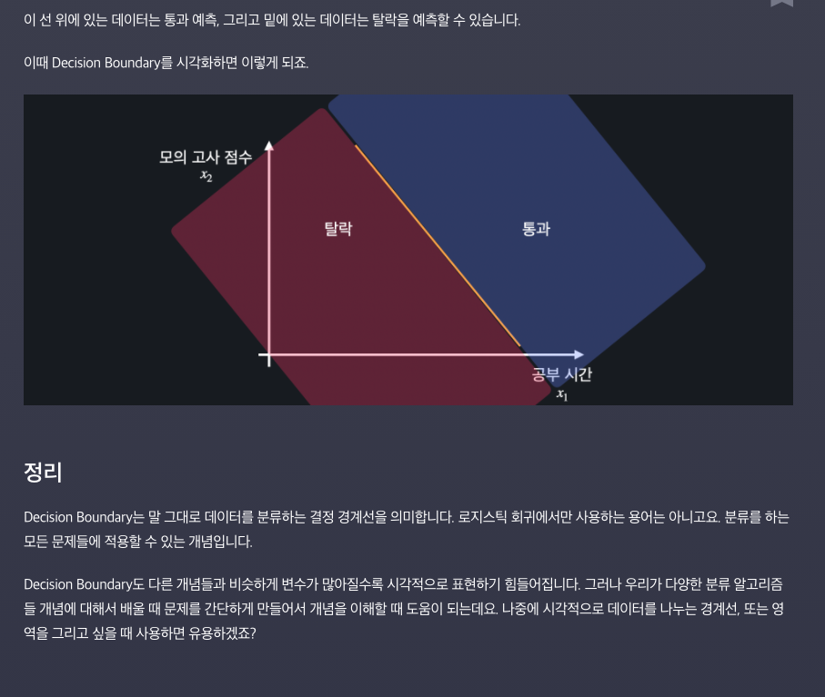

# Logistic Regression

- 머신러닝은 지도학습과 비지도학습으로 나뉨. 그리고 지도학습은 회귀와 분류로 나뉨. 회귀는 연속적인 값을 예측하고, 분류는 정해진 몇 개의 값 중 예측. 이번에는 분류 문제를 볼것. 어떤 이메일이 스팸인지 아닌지, 기사가 스포츠/정치/연애 기사중 어떤 것인지. 

  

  분류문제는 각 결과값에 어떤 숫자를 지정해줌. 

  

  사실은 선형회귀로도 분류를 할 수는 있음. 하단처럼 데이터가 있다면, 탈락은 0, 통과는 1로 나타냄. 그리고, 그 점들을 나타내는 가장 최적의 선을 찾음. 그 다음에 0.5를 넘으면 통과, 0.5 못넘으면 탈락 이런식으로 하면 됨. 

  

  ​	이렇게 간단하게 되는데도, 우리는 분류 문제를 풀 때, 선형회귀를 잘 사용하지 않음. 

  ​	왜냐하면, 위 데이터에서 갑자기 1000시간을 공부한 친구가 한명 있다고 해보자. 그러면 **이 데이터 딱 하나로 인해서 최적선이 갑자기 확 달라져버림**. 200시간이 아웃풋 0.5가 되는 지점이 되어 버림. 고작 데이터 하나 추가됬다고 100시간에서 200시간으로 늘어남. 선형회귀는 **이런 outlier에 너무 민감하게 반응함.** 보통 데이터 분류할때 잘 사용 안함. 

  


- #### Logistic Regression

   로지스틱 회귀. 선형회귀랑 어떻게 다를까? 선형회귀는 데이터에 가장 잘 맞는 1차함수를 찾는 것. 로지스틱 회귀는 **데이터에 가장 잘 맞는 시그모이드 함수를 찾는 것**. 

  시그모이드의 가장 중요한 특징은 0과 1 사이의 값을 리턴한다는 것. x에 무한대를 대입해도, 1로 접근함. x에 마이너스 무한대를 대입하면, 0에 접근함. 

  

  결과가 0과 1사이 라는것이 어떤 의미일까?

  - 선형회귀는 결과가 범위 없이 얼마든지 크거나 작아질 수 있기 때문에 분류를 하기에 부적합함. 
  - 시그모이드 함수는 항상 0과 1사이로 떨어지기 때문에 분류하기 편함. 아웃라이어 하나에 민감하게 변하지도 않음. 많이 동떨어진 데이터 하나가 있어도 그냥 1에 더 가까울 뿐 비슷함. 

  

  **그런데 로지스틱 회귀는 회귀가 아니고, 분류를 하는 것인데 왜 이름이 회귀일까?**

  사실 시그모이드의 결과값도 0과 1사이의 연속적인 값이기 때문에 회귀라고 볼 수 있음. 그것을 주로 0.5보다 큰지 작은지 보고 분류를 하는 것. 

  


- #### 로지스틱 회귀 가설함수

  가설함수란? 아래는 선형회귀에서의 가설함수. 

  

  선형회귀 가설함수를 조금만 발전시키면 로지스틱에서의 가설함수가 나옴. 

  선형회귀에서의 가설함수를 **h**, 로지스틱회귀에서의 가설함수를 **g**라고 놓는다. 

  

  함수 h안에 g를 대입하네?

  함수 g는 일차함수. 아웃풋이 엄청 클수도, 엄청 작을 수도 있음. 그런데 로지스틱 회귀를 할때에는 우리는 항상 아웃풋이 0과 1사이에 들어가야 함. 그러기 위해서, 시그모이드에 넣는 것. 시그모이드에는 어떤 인풋을 넣던 간에 아웃풋이 반드시 0과 1 사이로 떨어짐. 

  

  **그럼 우리가 0과 1사이의 값으로 뭘 하는 걸까?**

  0은 통과 못하는 것, 1은 통과 하는 것. x라는 벡터가 있을때, x1은 항상 1이니깐 무시하면 되고 x=50은 학생이 50시간 공부했다는 것을 의미. 대입했더니 0.9가 나왔다면?

  목표 변수가 1일 확률이 90% 라는 뜻. 즉 50시간을 공부할 학생이 시험을 통과할 확률이 **90%** 라는 것. 확률이 50%가 넘으니깐 분류를 하자면, 이 학생은 통과한 것으로 분류하자는 것. 아웃풋이 0.4라면 통과 못한 것으로 분류하자는 것. 

  


- 로지스틱 회귀에서 하려는 것도, 최적의 세타를 찾아내는 것. 

  단순화해서 입력 변수가 하나라고 생각해보겠습니다. 영상에서 봤듯이, 저희가 하려는 건 이런 식으로 주어진 데이터에 **가장 잘 맞는 시그모이드 모양의 곡선을 찾아내는 겁니다**. 선형회귀에서도 똑같았지. 

  만약 변수가 딱 하나라면, h(x)는 아래와 같이 나타남. 

  

  *θ*의 값을 늘리면 곡선이 왼쪽 움직이고, 줄이면 오른쪽으로 움직이는 거고요.

  

  *θ*의 값을 늘리면 S 모양의 곡선이 조여지고, 줄이면 늘어지고 이렇게 됩니다.

  

  선형 회귀와 똑같이 이렇게  theta_0과 theta_1의 값들을 바꿔가면서 갖고 있는 학습 데이터에 가장 잘 맞는 시그모이드 모양의 곡선을 찾아내는 게 로지스틱 회귀의 목적인 거죠.

​		

- #### **결정경계(Decisioon Boundary)**

  변수가 하나일때는 쉬워. 시그모이드에 넣어서 0.5가 되는 x값을 찾고, 거기를 경계로 통과와 탈락을 결정하면 됨. 

  

  그런데 변수가 2개일때는 어떻게 할까?

  

  

  


- #### 로그손실

  선형회귀에서 하던 것도 가장 잘 맞는 세타 값을 찾아 최적의 가설함수를 찾는 것. 가설함수를 평가하기 위한 기준이 필요함. 선형회귀에서의 손실함수는 데이터의 오차를 하나하나 제곱해서 그 평균을 내는 것. 

  그 기준이 되는 것이 **손실함수**.

   

  로그손실을 사용함(**Cross Entropy / Log - Loss**). 

  로그손실함수는 예측값이 실제 값이랑 얼마나 괴리가 있는지 알려줌. 

  로지스틱회귀는 분류함수이기 때문에 실제 값이 0과 1인 경우밖에 없음. 실제 아웃풋이 1일 때와 0인 경우 다름. 

  

  

  만약 h(x)가 1이면, 100%의 확률로 y=1이라고 예측한 것. 실제 y=1이였기 댸문에 이 가설함수는 완벽하게 맞춘 것. 그렇다면 손실이 0. 하단의 그래프를 잘 이해해야함. 

  실제 y=1인 경우에 적용되는 그래프를 보면, h(x)=1, 즉 100%로 1을 예측했을 때, 손실을 0으로 잡음. 만약 h(x)가 0.8정도면 80% 확률로 아웃풋이 1이라고 예측 한 것. 실제 결과는 1이였으니깐, 손실이 좀 있긴 하지만, 그렇게 크지는 않음. 아래 그래프를 보면 왼쪽으로 갈수록 손실이 점점 커지는데, 천천히 커지다가 급격히 가파라짐. 

  

  

  그럼 이번에는 실제 아웃풋이 0인 경우.

  h(X)가 0으로 예측했으면, 100%확률로 0이라고 한것. 고로 손실이 0이여야지. 

  h(x)가 0.2였으면, 0.8의 확률로 0이라고 한 것. 손실이 약간 있으나 그렇게 크지는 않음. 

  h(x)가 1이라면, 손실이 엄청 커야지. 

  여기도 손실 처음에는 천천히 올라가다가 후로 가면 엄청 급격하게 커짐. 

  

  


#### 로지스틱 회귀 손실 함수

- 로그손실은 경우를 두가지로 나눠서 계산함. 실제  y가 1인 경우와 실제 y가 0인경우. 

  

  

  이걸 가지고 로지스틱 회귀의 손실함수를 쓰면 됨. 하단의 식은 위에서 한거랑 완전히 동일함. 

  목표변수는 0 아니면 1 둘 중 하나. 

  

  

  


​		**우리가 하는 것은 각 데이터에 대해 손실을 구한 뒤 평균을 내는 것.**		


- #### 로지스틱 회귀의 경사하강법

  우리가 하는 것은 손실을 최소화 하는 것. 경사하강법은 손실을 최소화 하기 위한 방법 중 하나. 기준. 경사하강법을 하는 방법은 거의 똑같음. 처음에는 세타 값들을 다 0이나 임의의 값으로 지정(어디선가 시작은 해야 하니깐). 

  

  

  편미분을 해보면, 아래와 같이 나옴. 신기한게, J가 다른데 편미분값이 선형회귀에서랑 똑같이 나옴. 

  

  

  **증명 : https://pierceh89.github.io/wiki/logistic-regression/**

  

- #### 로지스틱 회귀의 표현

  

  

  

  

  


- #### 실제 구현

  ```python
  import numpy as np
  
  def sigmoid(x):
      """시그모이드 함수"""
      return 1 / (1 + np.exp(-x))
      
      
  def prediction(X, theta):
      """로지스틱 회귀 가정 함수"""
      # 지난 과제에서 작성한 코드를 갖고 오세요
      return sigmoid(X @ theta)
  
  def gradient_descent(X, theta, y, iterations, alpha):
      """로지스틱 회귀 경사 하강 알고리즘"""
      m = len(X)  # 입력 변수 개수 저장
  
      for _ in range(iterations):
          # 코드를 쓰세요
           theta = theta - (alpha/m) * (X.T @ (prediction(X, theta) - y))
              
      return theta
      
      
  # 입력 변수
  hours_studied = np.array([0.2, 0.3, 0.7, 1, 1.3, 1.8, 2, 2.1, 2.2, 3, 4, 4.2, 4, 4.7, 5.0, 5.9])  # 공부 시간 (단위: 100시간)
  gpa_rank = np.array([0.9, 0.95, 0.8, 0.82, 0.7, 0.6, 0.55, 0.67, 0.4, 0.3, 0.2, 0.2, 0.15, 0.18, 0.15, 0.05]) # 학년 내신 (백분률)
  number_of_tries = np.array([1, 2, 2, 2, 4, 2, 2, 2, 3, 3, 3, 3, 2, 4, 1, 2])  # 시험 응시 횟수
  
  # 목표 변수
  passed = np.array([0, 0, 0, 0, 0, 0, 0, 0, 1, 1, 1, 1, 1, 1, 1, 1])  # 시험 통과 여부 (0: 탈락, 1:통과)
  
  # 설계 행렬 X 정의
  X = np.array([
      np.ones(16),
      hours_studied,
      gpa_rank,
      number_of_tries
  ]).T
  
  # 입력 변수 y 정의
  y = passed
  
  theta = [0, 0, 0, 0]  # 파라미터 초기값 설정
  theta = gradient_descent(X, theta, y, 300, 0.1)  # 경사 하강법을 사용해서 최적의 파라미터를 찾는다
  theta
  ```

  

- #### 분류가 3개 이상 일땐?

  이메일이 **일반 vs  스팸**이 아니라, 예를 들어 **직장관련 vs 친구 관련 vs 스팸** 이렇게 분류하려면? 각 분류를 0, 1, 2로 나타내고 점으로 찍어본다. 

  

  처음에는 문제를 단순화해서 어떤 메일이 직장메일인지 아닌지만 분류. 두가지 옵션으로만 분류하는 거니깐, 지금까지 했던 것 과 동일. 하나씩 이렇게 가설함수를 만듬. 

  

  세개의 가설함수를 구한 후에, 주어진 입력 변수를 3개의 가설함수에 각각 넣는다. 그러면 우리는 이 데이터가 각각의 가설함수에서 직장메일일 확률, 친구메일일 확률, 그리고 스팸메일일 확률을 구할 수 있음. 예시로 보자면 직장메일일 확률 60%, 친구메일일 확률 45% 스팸메일일 확률 78%가 나옴. 

  **스팸메일일 확률이 가장 높으니깐 스팸메일로 분류하면 됨.** 

  


- #### Logistic Regression의 정규방정식

  **로지스틱회귀에서는 정규방정식의 해가 존재하지 않음(풀어보면 존재하지 않음)**. 다만, 비용함수가 Convex이기 때문에  Gradient Descent를 이용한 최솟값은 보장함. 


- #### 정리 및 증명

  [Logistic Gradient 증명 1](https://medium.com/analytics-vidhya/derivative-of-log-loss-function-for-logistic-regression-9b832f025c2d)
	
	[Logistic Gradient 증명 2](https://pierceh89.github.io/wiki/logistic-regression/)
	
	
	
	
	
	
	
	


- #### 실습해보기

  ```python
  from sklearn.datasets import load_iris
  from sklearn.model_selection import train_test_split
  from sklearn.linear_model import LogisticRegression
  
  
  import pandas as pd
  
  iris_data= load_iris()
  print(iris_data.DESCR)
  
  X = pd.DataFrame(iris_data.data, columns=iris_data.feature_names)
  y = pd.DataFrame(iris_data.target, columns = ['class'] )
  
  X_train, X_test, y_train, y_test = train_test_split(X, y, test_size = 0.2, random_state = 5)
  
  # y값을 하나로 쭉 펴주는 함수 안해주면, y값을 쭉 펴라고 경고가 나옴. 
  y_train.values.ravel()
  
  # solver은 모델 최적화에서 어떤 알고리즘 쓸지 결정 
  # max_iter은 최적화를 할때 그 과정을 몇번 반복할지, 다만 2000으로 쓴다고 무조건 2000번 하는 것은 아님. 그 전에 충분히 최적화 되었다고 판단하면 알아서 멈춤
  # 학습률 알파는 자동으로 최적화가 되어 있음.
  model = LogisticRegression(solver = 'saga', max_iter = 2000) 
  
  
  model.fit(X_train, y_train)
  model.predict(X_test)
  
  model.score(X_test, y_test) # 96% 확률로 제대로 분류한다는 뜻. 
  ```

- #### 실습 

  ```python
  # 필요한 라이브러리 import
  from sklearn import datasets
  from sklearn.model_selection import train_test_split
  from sklearn.linear_model import LogisticRegression
  
  import pandas as pd  
  
  wine_data = datasets.load_wine()
  """ 데이터 셋을 살펴보는 코드
  print(wine_data.DESCR)
  """
  
  # 입력 변수를 사용하기 편하게 pandas dataframe으로 변환
  X = pd.DataFrame(wine_data.data, columns=wine_data.feature_names)
  
  # 목표 변수를 사용하기 편하게 pandas dataframe으로 변환
  y = pd.DataFrame(wine_data.target, columns=['Y/N'])
  
  # 코드를 쓰세요
  X_train, X_test, y_train, y_test = train_test_split(X, y, test_size = 0.2, random_state = 5)
  logistic_model = LogisticRegression(solver = 'saga', max_iter = 7500) 
  y_train.values.ravel()
  logistic_model.fit(X_train, y_train)
  y_test_predict = logistic_model.predict(X_test)
  
  
  
  # 테스트 코드
  score = logistic_model.score(X_test, y_test)
  y_test_predict, score
  ```

  

