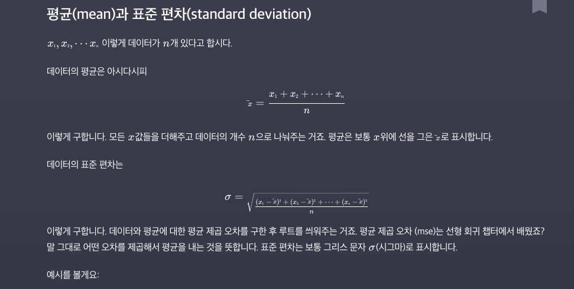

# Pre_Processing

머신러닝 알고리즘의 속도와 정확도를 높이는 법

이 이론들을 scikit-learn과 pandas라이브러리에서 적용하는 법. 

- #### Feature Scaling : Normalization

  **데이터 전처리** : 데이터를 그대로 사용하지 않고, 가공해서 모델을 학습시키는데 좀 더 좋은 형식으로 만들어 주는 것.

  그 중에서 먼저 Feature Scaling이라는 것을 본다. 

  **Feature Scaling** : 입력변수의 크기를 조정. 즉, 머신러닝 모델에 사용할 입력변수들의 크기를 조정해서 일정 범위 내에 떨어지도록 바꾸는 것. **Why?** Gradient Descent를 조금 더 빨리 할 수 있게 도와준다.  

  연봉과 나이의 차이가 너무 커서, 입력변수의 크기가 모두 일정 범위 내에 들어오도록 하게 하는 것. 

  

   How? Feature Scaling 하는 방법은 여러가지가 있음. 그 중 가장 직관적인 것은 **min-max normalization**.

  **min-max normalization** : 최솟값과 최댓값을 이용해서 데이터의 크기를 0과 1 사이로 바꿔준다(normalization의 뜻 자체가 숫자의 크기를 0과 1 사이로 만든다는 뜻). 

  가장 큰 210과 140의 차이를 구한 후 모든 값들을 돌면서 그 값에서 최솟값을 빼고 70으로 나눠줌. 왜 0과 1사이로 나올까? 최소와 최대의 차이가 70이니깐, 최대값을 1 최솟값을 0으로 잡고 도는 것. 당연하잖아. 

  **나와 최솟값의 차이 / 최댓값과 최솟값의 차이의 비율**

  

  

  #### 실습

  ```python
  import pandas as pd
  import numpy as np
  
  from sklearn import preprocessing
  
  NBA_FILE_PATH = '../resources/NBA_player_of_the_week.csv'
  nba_player_of_the_week_df = pd.read_csv(NBA_FILE_PATH)
  ㄴ
  nba_player_of_the_week_df.describe()
  ```

  

  ```python
  height_weight_age_df = nba_player_of_the_week_df[['Height CM', 'Weight KG', 'Age']]
  height_weight_age_df.head()
  
  scaler = preprocessing.MinMaxScaler()
  normalized_data = scaler.fit_transform(height_weight_age_df)
  normalized_data
  
  normalized_df = pd.DataFrame(normalized_data, columns=['Height', 'Weight', 'Age'])
  normalized_df.describe()
  
  ```

  


- #### Feature Scaling과 Gradient Descent

  입력변수들의 크기를 조정해서 일정 범위 내에 떨어지도록 바꿔주는 것이 Feature Scaling. 

  **근데 이게 어떻게 경사하강법을 좀 더 빨리할 수 있게 도와줄까?**

  세타1, 세타2, 그리고 높이는 J(손실). 가장 적합한 세타를 찾기 위한 과정이 경사하강법. 경사하강법은 특정 지점에서 경사가 가장 가파른 방향으로 한걸음씩 내려가는 것. 

  

  3차원의 그래프를 위에서 내려다 본다면 같은 높이의 값들끼리 연결이 가능함. 이런 것을 등고선이라고 함. 

  

  그리고 하단 그래프에서 빨간점이 최소점인데, 이 점을 찾기 위한 과정이 경사하강법을 쓰는 것. 

  

  **그리고, 특정 지점에서 경사가 가장 가파른 방향은 등고선과 수직인 방향이 됨.** 

  **미적분학 등위곡선으로 증명 가능함.** 

  

- 예를 들어서 연봉으로 나이를 예측한다고 해보자. 이 데이터에 가장 잘맞는 선을 찾는게 목표.		  

  근데 여기서 문제는 세타1은 천만단위인 연봉과 곱해지기 때문에 세타1의 값이 조금만 바뀌어도, 가설함수의 아웃풋이 엄청난 차이가 남. 하지만 세타0은 항상 1과 곱해지기 때문에 많이 바뀌어도 큰 영향이 없음. 아웃풋이 크게 바뀐다는 것은 손실함수에도 엄청 큰 영향을 준다는 것. 

  **그래프로 보자면, 아래와 같음.** 그냥 그래프(왼쪽)에서는 세타1이 조금만 바뀌어도 손실이 팍팍 바뀜. 그에 비해 세타0은 평이함

  Feature Scaling 뒤 바뀐 그래프는 일정함.   

  

  이거로 경사하강을 해보자. 최대경사는 그래프에 수직이 되는 방향이라는 것을 기억하자. 왼쪽그래프는 빨간점에서 시작했을 때 그래프에서 수직인 지점을 따라 내려가면 지그재그 모양으로 내려가게 됨. 

  그런데, Feature Scaling한 것 보면 반듯하게 내려감. 훨씬 더 빨리 최소점으로 가게 됨. 

  > 딥러닝을 하다보면 원래는 전체데이터를 다 보고  Gradient Descent를 해야 하는데, 그러면 너무 연산이 계속 무거워지고 여러 문제가 있어서 데이터 일부만 보고 대충 Gradient Descent를 하는 경우가 많음. 그래서 애초에 완전히 정확한 방향이 아닌데 Features가 스케일이 저렇게 달라져버리면 방향이 약간만 틀어져도 이상한 방향으로 확 가버림. 

  

  

  **당연하지만, 선형회귀 말고도, 경사하강법을 사용하는 모든 것들에 적용됨.** 

  


- #### 평균과 표준편차

  

  

  

  

  평균에서 떨어진 거리를 표준편차로 나타내는 것. 

  

  **Scikit-Learn으로 Standardize하기**

  ```python
  from sklearn import preprocessing
  import pandas as pd
  import numpy as np
  
  
  NBA_FILE_PATH = '../resources/NBA_player_of_the_week.csv'
  nba_player_of_the_week_df = pd.read_csv(NBA_FILE_PATH)
  
  
  # 소수점 5번째 자리까지만 출력되도록 설정
  pd.set_option('display.float_format', lambda x: '%.5f' % x)
  
  nba_player_of_the_week_df = pd.read_csv(NBA_FILE_PATH)
  
  
  # 데이터를 standardize 함
  scaler = preprocessing.StandardScaler()
  standardized_data = scaler.fit_transform(height_weight_age_df)
  standardized_df = pd.DataFrame(standardized_data, columns=['Height', 'Weight', 'Age'])
  
  
  standardized_df.describe()
  ```

  


- #### One-hot Encoding

  머신러닝에서 사용하는 데이터는 크게 두 종류가 있음. **수치형데이터(Numerical, 나이 몸무게 키 등),  범주형데이터(Categorical, 혈액형 성별 등)**.

  많은 부분에서는 수치형 데이터를 사용하고 Gradient Decsent로 해를 구함. 그런데 범주형 데이터일때는? **범주형 데이터는 수치형 데이터로 바꿔 주면 됨**. How? 아래처럼 해볼 수 있겠지. 그러면 수치형데이터처럼 사용은 가능함. 

  

  **하지만 이렇게 하는 순간, 혈액형에 우리가 원치 않았던 크고작다 라는 개념이 생겨버림.** 

  A형은 작고, O형은 크다? 이상한 편견이 붙어버려. 이 관계까지 머신러닝은 학습해버려. 

  그래서 사용하는 것이 **One-Hot Encoding**. *각 카테고리를 하나의 새로운 열로 만들어 주는 것*. 각 카테고리별로 열을 만들고, 해당 그 해당되는 row는 1, 아니면 0으로 셋팅한다. 그렇게 하면, 각 컬럼별로 0과 1이 생기기 때문에 범주형 데이터에 수치를 부여할 때 처럼 크고 작은 관계가 생기는 것을 막을 수 있음. 즉 **One-Hot Encoding은 범주형 데이터에 엉뚱한 관계를 만들지 않으면서 수치형 데이터로 바꿀 수 있다.** 

  

- 실습

  ```python
  import pandas as pd
  
  TITANIC_FILE_PATH = '../resources/titanic.csv'
  titanic_df = pd.read_csv(TITANIC_FILE_PATH)
  
  # 원하는 열만 따로 뺴서 one-hot 인코딩
  titanic_sex_embarked = tatanic_df[['Sex', 'Embarked']]
  one_hot_encoding_df.head()
  ```

  

  ```python
  # 나머지 열은 그대로 두고, 원하는 열만 one-hot-encoding
  one_hot_encoded_df = pd.get_dummies(data=titanic_df, columns=['Sex', 'Embarked'])
  one_hot_encoded_df.head()
  ```

  


- #### Standardization(표준화 )

  