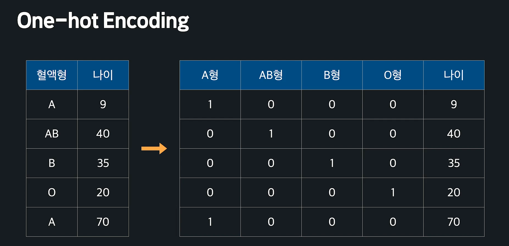
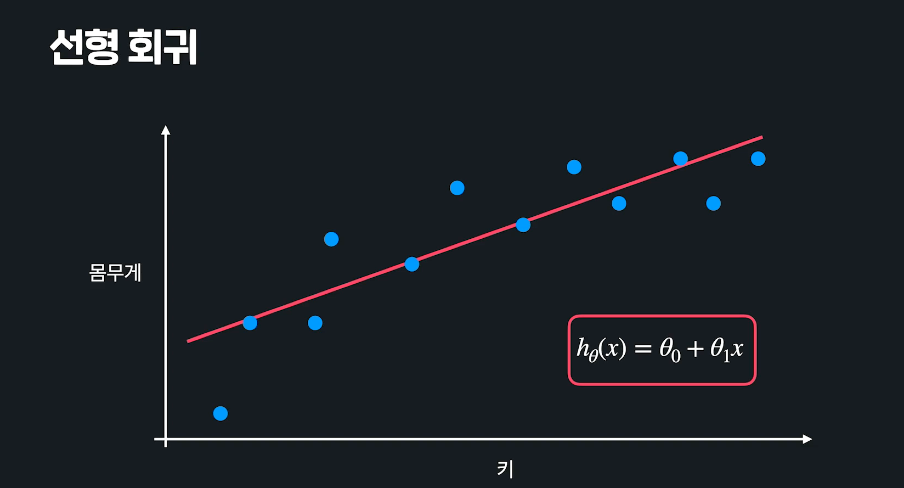
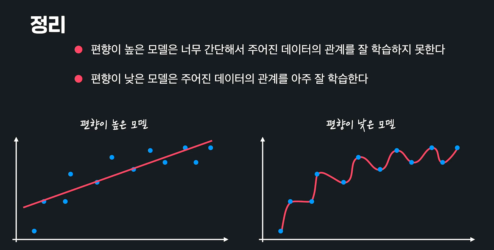
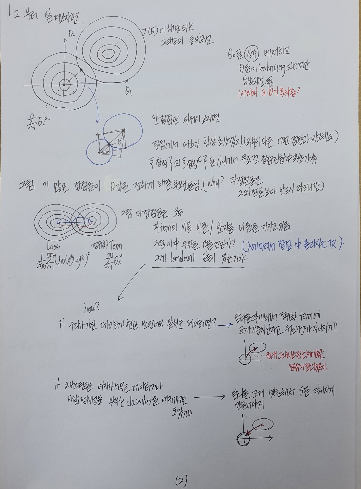

# Pre_Processing

머신러닝 알고리즘의 속도와 정확도를 높이는 법

이 이론들을 scikit-learn과 pandas라이브러리에서 적용하는 법. 

- #### Feature Scaling : Normalization

  **데이터 전처리** : 데이터를 그대로 사용하지 않고, 가공해서 모델을 학습시키는데 좀 더 좋은 형식으로 만들어 주는 것.

  그 중에서 먼저 Feature Scaling이라는 것을 본다. 

  **Feature Scaling** : 입력변수의 크기를 조정. 즉, 머신러닝 모델에 사용할 입력변수들의 크기를 조정해서 일정 범위 내에 떨어지도록 바꾸는 것. **Why?** Gradient Descent를 조금 더 빨리 할 수 있게 도와준다.  

  연봉과 나이의 차이가 너무 커서, 입력변수의 크기가 모두 일정 범위 내에 들어오도록 하게 하는 것. 

  

   How? Feature Scaling 하는 방법은 여러가지가 있음. 그 중 가장 직관적인 것은 **min-max normalization**.

  **min-max normalization** : 최솟값과 최댓값을 이용해서 데이터의 크기를 0과 1 사이로 바꿔준다(normalization의 뜻 자체가 숫자의 크기를 0과 1 사이로 만든다는 뜻). 

  가장 큰 210과 140의 차이를 구한 후 모든 값들을 돌면서 그 값에서 최솟값을 빼고 70으로 나눠줌. 왜 0과 1사이로 나올까? 최소와 최대의 차이가 70이니깐, 최대값을 1 최솟값을 0으로 잡고 도는 것. 당연하잖아. 

  **나와 최솟값의 차이 / 최댓값과 최솟값의 차이의 비율**

  

  

  #### 실습

  ```python
  import pandas as pd
  import numpy as np
  
  from sklearn import preprocessing
  
  NBA_FILE_PATH = '../resources/NBA_player_of_the_week.csv'
  nba_player_of_the_week_df = pd.read_csv(NBA_FILE_PATH)
  ㄴ
  nba_player_of_the_week_df.describe()
  ```

  

  ```python
  height_weight_age_df = nba_player_of_the_week_df[['Height CM', 'Weight KG', 'Age']]
  height_weight_age_df.head()
  
  scaler = preprocessing.MinMaxScaler()
  normalized_data = scaler.fit_transform(height_weight_age_df)
  normalized_data
  
  normalized_df = pd.DataFrame(normalized_data, columns=['Height', 'Weight', 'Age'])
  normalized_df.describe()
  
  ```

  


- #### Feature Scaling과 Gradient Descent

  입력변수들의 크기를 조정해서 일정 범위 내에 떨어지도록 바꿔주는 것이 Feature Scaling. 

  **근데 이게 어떻게 경사하강법을 좀 더 빨리할 수 있게 도와줄까?**

  세타1, 세타2, 그리고 높이는 J(손실). 가장 적합한 세타를 찾기 위한 과정이 경사하강법. 경사하강법은 특정 지점에서 경사가 가장 가파른 방향으로 한걸음씩 내려가는 것. 

  

  3차원의 그래프를 위에서 내려다 본다면 같은 높이의 값들끼리 연결이 가능함. 이런 것을 등고선이라고 함. 

  

  그리고 하단 그래프에서 빨간점이 최소점인데, 이 점을 찾기 위한 과정이 경사하강법을 쓰는 것. 

  

  **그리고, 특정 지점에서 경사가 가장 가파른 방향은 등고선과 수직인 방향이 됨.** 

  **미적분학 등위곡선으로 증명 가능함.** 

  

- 예를 들어서 연봉으로 나이를 예측한다고 해보자. 이 데이터에 가장 잘맞는 선을 찾는게 목표.		  

  근데 여기서 문제는 세타1은 천만단위인 연봉과 곱해지기 때문에 세타1의 값이 조금만 바뀌어도, 가설함수의 아웃풋이 엄청난 차이가 남. 하지만 세타0은 항상 1과 곱해지기 때문에 많이 바뀌어도 큰 영향이 없음. 아웃풋이 크게 바뀐다는 것은 손실함수에도 엄청 큰 영향을 준다는 것. 

  **그래프로 보자면, 아래와 같음.** 그냥 그래프(왼쪽)에서는 세타1이 조금만 바뀌어도 손실이 팍팍 바뀜. 그에 비해 세타0은 평이함

  Feature Scaling 뒤 바뀐 그래프는 일정함.   

  

  이거로 경사하강을 해보자. 최대경사는 그래프에 수직이 되는 방향이라는 것을 기억하자. 왼쪽그래프는 빨간점에서 시작했을 때 그래프에서 수직인 지점을 따라 내려가면 지그재그 모양으로 내려가게 됨. 

  그런데, Feature Scaling한 것 보면 반듯하게 내려감. 훨씬 더 빨리 최소점으로 가게 됨. 

  > 딥러닝을 하다보면 원래는 전체데이터를 다 보고  Gradient Descent를 해야 하는데, 그러면 너무 연산이 계속 무거워지고 여러 문제가 있어서 데이터 일부만 보고 대충 Gradient Descent를 하는 경우가 많음. 그래서 애초에 완전히 정확한 방향이 아닌데 Features가 스케일이 저렇게 달라져버리면 방향이 약간만 틀어져도 이상한 방향으로 확 가버림. 

  

  

  **당연하지만, 선형회귀 말고도, 경사하강법을 사용하는 모든 것들에 적용됨.** 

  


- #### 평균과 표준편차

  

  

  

  

  평균에서 떨어진 거리를 표준편차로 나타내는 것. 

  

  **Scikit-Learn으로 Standardize하기**

  ```python
  from sklearn import preprocessing
  import pandas as pd
  import numpy as np
  
  
  NBA_FILE_PATH = '../resources/NBA_player_of_the_week.csv'
  nba_player_of_the_week_df = pd.read_csv(NBA_FILE_PATH)
  
  
  # 소수점 5번째 자리까지만 출력되도록 설정
  pd.set_option('display.float_format', lambda x: '%.5f' % x)
  
  nba_player_of_the_week_df = pd.read_csv(NBA_FILE_PATH)
  
  
  # 데이터를 standardize 함
  scaler = preprocessing.StandardScaler()
  standardized_data = scaler.fit_transform(height_weight_age_df)
  standardized_df = pd.DataFrame(standardized_data, columns=['Height', 'Weight', 'Age'])
  
  
  standardized_df.describe()
  ```

  


- #### One-hot Encoding

  머신러닝에서 사용하는 데이터는 크게 두 종류가 있음. **수치형데이터(Numerical, 나이 몸무게 키 등),  범주형데이터(Categorical, 혈액형 성별 등)**.

  많은 부분에서는 수치형 데이터를 사용하고 Gradient Decsent로 해를 구함. 그런데 범주형 데이터일때는? **범주형 데이터는 수치형 데이터로 바꿔 주면 됨**. How? 아래처럼 해볼 수 있겠지. 그러면 수치형데이터처럼 사용은 가능함. 

  

  **하지만 이렇게 하는 순간, 혈액형에 우리가 원치 않았던 크고작다 라는 개념이 생겨버림.** 

  A형은 작고, O형은 크다? 이상한 편견이 붙어버려. 이 관계까지 머신러닝은 학습해버려. 

  그래서 사용하는 것이 **One-Hot Encoding**. *각 카테고리를 하나의 새로운 열로 만들어 주는 것*. 각 카테고리별로 열을 만들고, 해당 그 해당되는 row는 1, 아니면 0으로 셋팅한다. 그렇게 하면, 각 컬럼별로 0과 1이 생기기 때문에 범주형 데이터에 수치를 부여할 때 처럼 크고 작은 관계가 생기는 것을 막을 수 있음. 즉 **One-Hot Encoding은 범주형 데이터에 엉뚱한 관계를 만들지 않으면서 수치형 데이터로 바꿀 수 있다.** 

  

- 실습

  ```python
  import pandas as pd
  
  TITANIC_FILE_PATH = '../resources/titanic.csv'
  titanic_df = pd.read_csv(TITANIC_FILE_PATH)
  
  # 원하는 열만 따로 뺴서 one-hot 인코딩
  titanic_sex_embarked = tatanic_df[['Sex', 'Embarked']]
  one_hot_encoding_df.head()
  ```

  

  ```python
  # 나머지 열은 그대로 두고, 원하는 열만 one-hot-encoding
  one_hot_encoded_df = pd.get_dummies(data=titanic_df, columns=['Sex', 'Embarked'])
  one_hot_encoded_df.head()
  ```

  


- #### Standardization(표준화 )

  머신러닝 모델이 제대로 예측을 못하는 경우도 많음. 이런 문제를 해결하는 방법들에 대해 보자. 

  키를 이용해서 몸무게를 예측하고 싶다고 해보자. 과연 아래 선이 잘 예측하고 있다고 말할 수 있을까?

  

  지금 데이터로는 어느정도까지는 잘 예측하는 것 같은데 곡선이 더 정확하게 표현하는거 아닌가?

  

  직선모델은 뭐가 문제일까? **그 자체가 너무 간단해서 아무리 학습을 해도 복잡한 곡선 관계를 학습할 수가 없다.** 모델에 한계가 있는 것. 

  이렇게 모델이 너무 간단해서 데이터를 잘 표현하지 못하는 경우 **편향이 높다** 라고 말함. Bias가 높다 라고 말함. 

  

  그럼 이번에는 편향이 낮은 모델을 봐보자. 높은 차원의 회귀를 이용. 모델이 거의 완벽하게 학습했음. Training Data를 완전히 학습함. 

  

  **근데 편향이 낮은 모델은 편향이 높은 모델보다 언제나 좋을까?**

  

  두가지를 가지고 처음보는 test데이터에서의 몸무게를 예측해보자. Training Data의 관계를 거의 완벽하게 학습했지만, Test데이터에는 잘 안맞음. 심지어 Training Data와 Test Data가 패턴도 비슷한데도 잘 안맞아. 너무 복잡해서 문제가 생김. 어떤 느낌이냐면, 학습할때 그 관계를 학습한 게 아니라 그냥 아예 외운 정도임. 

  

  <u>데이터셋 별로 모델이 얼마나 일관된 성능을 보여주는지를 **분산** 이라고 말함.</u> 데이터셋별로 성능 차이가 많이 나면 **분산이 높다**. 성능차이가 많이 안나면 **분산이 낮다** 라고 말함. 

  *위 복잡한 모델 같은 경우는 편향은 낮고, 분산도 높음.* 

  직선을 보면 Trainig Set과 Test Set을 사용했을 때, 성능에 큰 차이가 없음. 아래 데이터의 경우는 *편향은 높고 분산은 낮음.* 

  

  정리하자면 다음과 같다. 

  

  


  편향이 높은 머신 러닝 모델은 너무 간단해서 주어진 데이터의 관계를 잘 학습하지 못하고 편향이 낮은 모델은 주어진 데이터의 관계를 아주 잘 학습합니다. 첫 번째로 본 직선 모델은 편향이 높고, 두 번째로 본 복잡한 곡선 모델은 편향이 낮습니다.

  분산은 다양한 테스트 데이터가 주어졌을 때 모델의 성능이 얼마나 일관적으로 나오는지를 뜻합니다. 직선 모델은 어떤 데이터 셋에 적용해도 성능이 비슷하게 나오지만, 복잡한 곡선 모델은 데이터 셋에 따라 성능의 편차가 굉장히 크기 때문에 직선 모델은 분산이 작고, 곡선 모델은 분산이 큽니다.


- #### Bias-Variance Tradeoff

  

  

  모델이 트레이닝 데이터를 잘 나타내지 못하면 **Underfit**, 관계를 지나치게 잘 나타내면 **Overfit**이라고 함. 

  일반적으로 편향과 분산은 하나가 줄어들수록 다른 하나가 늘어나는 관계가 있음. 하나를 줄이려면 다른 하나는 포기해야 하는 것. 

  

- #### OverFit Problem with Scikit-Learn

  과소적합을 방지하려면? 모델이 너무 간단해서 데이터를 잘 학습하지 못하는 문제를 해결해야 함. 간단함 충분히 복잡한 모델을 쓰면 됨. 일반적인 경우 선형회귀 보다는 다항 회귀를 쓰는게 낫지. 	

  ```python
  from sklearn.linear_model import LinearRegression
  from sklearn.model_selection import train_test_split
  from sklearn.metrics import mean_squared_error
  from sklearn.preprocessing import PolynomialFeatures
  
  from math import sqrt
  
  import numpy as np
  import pandas as pd
  
  ADMISSION_FILE_PATH = '../resources/admission_data.csv'
  admission_df = pd.read_csv(ADMISSION_FILE_PATH).drop('Serial No.', axis=1)
  
  admission_df.head()
  ```

  

  ```python
  X = admission_df.drop(['Chance of Admit '], axis=1)
  
  # Poly용 Features 만들기
  polynomial_transformer = PolynomialFeatures(6)
  polynomial_features = polynomial_transformer.fit_transform(X.values)
  features = polynomial_transformer.get_feature_names(X.columns) 
  
  # X 데이터 준비 완료
  X = pd.DataFrame(polynomial_features, columns=features) 
  
  # y 데이터 준비 완료
  y=admission_df[['Chance of Admit ']]
  y.head()
  ```

  ```python
  X_train, X_test, y_train, y_test = train_test_split(X, y, test_size=0.3, random_state = 5)
  
  model = LinearRegression()
  model.fit(X_train, y_train)
  
  y_train_predict = model.predict(X_train)
  y_test_predict = model.predict(X_test)
  
  mse = mean_squared_error(y_train, y_train_predict)
  
  print("Training Set에서의 성능")
  print("-------------------")
  print(sqrt(mse))
  
  mse = mean_squared_error(y_test, y_test_predict)
  
  print("Test Set에서의 성능")
  print("-------------------")
  print(sqrt(mse))
  
  #거의 비슷하게 나오네. 강의랑 결과가 다름. 
  ```

  보통은 이렇게 차원이 높은 것에 그대로 적합시키면 과적합이 되버림. Training Data에 대한 MSE는 엄청 낮은데,  Test Data에 대한 MSE는 엄청 높아버림. 


- #### 정규화(Regularization)의 개념

  > Normalization은 목표가 입력변수를 일정 어느정도 조정해서, 등고선의 크기를 너무 왜곡되지 않게 만들고 Gradient Descent를 조금 더 빠르게 하려는 것. Regularization같은 경우는 세타 값이 너무 크지 않게 만드는 것이 목표(세타값이 너무 크면 와리가리가 심해져서 Overfit 될 가능성이 높기 때문).

  복잡한 모델이 학습데이터에 과적합 되는 현상을 봤음. 이런 현상을 방지해 주는 방법중 하나가 정규화. 굉장히 과적합되었다고 해보자. 보통 과적합된 함수는 위아래로 엄청 왔다갔다 함. 굴곡을 이용해서 함수가 트레이닝데이터를 최대한 많이 통과하게 만들기 때문. 함수가 급격하게 변하는 이유는 세타값들이 굉장히 크다는 의미. **정규화는 세타값들이 너무 커지는 것을 방지해주는 방법**. 

  

  세타값들이 너무 커지는 것을 방지하면, 오차는 조금 커 질 수 있어도 위아래 변동이 심한 가설함수를 좀더 완만하게 만들 수 있음. 이렇게 해놓으면 여러 데이터셋에서 일관된 성능이 어느정도 올라가기 때문에 과적합을 막을 수 있는 것. 

  

  **한줄로 요약하자면, 정규화는 가설함수의 세타값들이 너무 커지는 걸 방지해서 과적합을 예방하는 방법.** 


- #### L1, L2정규화

  **머신러닝에서 정규화는 손실함수에 정규화항 이라는 것을 더해서 세타값들이 너무 커지는 것을 방지해 주는 기법.** 

  언제나 우리의 목표는 평균 제곱 오차를 최소화해서, 해당 데이터셋에 가장 잘 맞는 h(X)를 찾는 것. 다항회귀는 MSE를 손실함수로 쓰지. 

  

  지금 위 같은 경우는 MSE는 굉장히 작았지만, **세타 값들이 너무 커서 성능이 별로였던 것(Overfitting 됬던 것)**. 

  이 문제를 해결하기 위해서 우리는 좋은 가설함수의 기준을 조금 바꿔주려고 하는 것. 

  **새로운 기준: Traning Data에 대한 오차도 작고, 세타 값들도 작아야 좋은 가설 함수.** 

  세타0은 과적합과 상관이 없기 때문에 포함하지 않음. WHY? 세타0은 애초에 상수항이잖아. 높다고 막 크게 움직이고 그런거에 영향을 주는 것이 아님. 

  이렇게 되면 세타값들이 커질수록 손실함수도 커지기 때문에 가설함수가 안좋아진다는 것. 

  이렇게 뒤에 새로운 변수 항이 붙었는데도 Gradient Descent가 된다는 것은? 얘네도 Convex를 만족한다는 뜻이네. 

  

  

  예를 들어서 5차항 가설함수가 2개가 있다고 해보자. 가설함수 g는 평균제곱오차항은 h보다 크지만 세타값들이 작아서 총 손실은 더 적다고 평가하는 것. 

  

  그런데 현업에서는 세타시그마 항에 람다도 더함. 

  

  지금까지 본 정규화 방식을 **L1정규화** 라고 함. 그리고 L1 정규화를 적용하는 모델을 **Lasso Regression, Lasso**모델 이라고 부름. 

  

  L2정규화도 개념은 동일함. 세타값의 절대값이 아닌 제곱값을 더해주는 것. L1과 마찬가지로 세타값들이 커지면 손실함수가 커지기 때문에 세타값들이 커지는 것을 방지해줌. L2 정규화를 적용하는 모델을 Ridge Regression, Ridge 모델 이라고 부름. 

  

  정리하자면 다음과 같음. 정규화는 머신러닝 모델을 학습시킬 떄 세타 값들이 너무 커지는 것을 방지해 주는 기법. 너무 와리가리 치지 못하게 하려는 것. 그러기 위해서 손실함수에 정규화 항을 더해주는 것. 가설함수를 평가하는 기준을 바꿔주는 것. 데이터에 대한 오류와 세타값 둘 중에 어떤 것을 줄이는 것이 더 중요한지는 **람다**라는 상수가 결정하는 것. 람다가 클수록 세타값들을 줄이는 것이 중요하고, 람다가 작을수록 오차를 줄이는 것이 중요하다는 것. 

  

- Lasso와 Ridge 실습해보기

  ```python
  from sklearn.linear_model import Lasso
  from sklearn.model_selection import train_test_split
  from sklearn.metrics import mean_squared_error
  from sklearn.preprocessing import PolynomialFeatures
  
  from math import sqrt
  
  import numpy as np
  import pandas as pd
  
  ADMISSION_FILE_PATH = '../resources/admission_data.csv'
  admission_df = pd.read_csv(ADMISSION_FILE_PATH).drop('Serial No.', axis=1)
  s
  
  X = admission_df.drop(['Chance of Admit '], axis=1)
  polynomial_transformer = PolynomialFeatures(6)
  polynomial_features = polynomial_transformer.fit_transform(X.values)
  features = polynomial_transformer.get_feature_names(X.columns) 
  
  X = pd.DataFrame(polynomial_features, columns=features)
  y=admission_df[['Chance of Admit ']]
  
  X_train, X_test, y_train, y_test = train_test_split(X, y, test_size=0.3, random_state = 5)
  ```

  위 부분까지는 다 똑같음. 

  ```python
  # Params : lambda=alpha & 경사하강 최대 몇번 할지 & 자체적으로 Feature Scaling도 해줌(0과 1사이 숫자로)
  # Ridge쓰고 싶으면 이 부분만 그냥 Ridge로 쓰면 됨. Params도 똑같음. 
  model = Lasso(alpha=0.001, max_iter = 1000, normalize=True) 
  model.fit(X_train, y_train)
  
  ```

  

  ```python
  y_train_predict = model.predict(X_train)
  y_test_predict = model.predict(X_test)
  
  mse = mean_squared_error(y_train, y_train_predict)
  
  print("Training Set에서의 성능")
  print("-------------------")
  print(sqrt(mse))
  
  mse = mean_squared_error(y_test, y_test_predict)
  
  print("Test Set에서의 성능")
  print("-------------------")
  print(sqrt(mse))
  
  #거의 비슷하게 나오네. 강의랑 결과가 다름. 
  ```

  - 이렇게 복잡한 6차원을 써도, 세타값이 커지는 것을 방지하니깐 과적합이 꽤 많이 방지됨. 고로 Test와 Training에서의 MSE의 차이가 줄어듬. 


- #### L1, L2 정규화 일반화

  

  **LogisticRegressioon은 사실 자동으로 L2 정규화를 적용한다.  Penalty를 주기만 하면 됨.**

   ```python
  LogisticRegression(penalty='none')  # 정규화 사용 안함
  LogisticRegression(penalty='l1')  # L1 정규화c 사용
  LogisticRegression(penalty='l2')  # L2 정규화 사용
  LogisticRegression()  # 위와 똑같음: L2 정규화 사용
   ```

  


- #### L1, L2 정규화의 차이점

  

  ##### L1과 L2 정규화의 차이점

  L1과 L2의 차이점은 아래와 같습니다:

  - L1 정규화는 여러 ***θ***값들을 0으로 만들어 줍니다. 모델에 중요하지 않다고 생각되는 속성들을 아예 없애주는 거죠.
  - L2 정규화는 ***θ***값들을 0으로 만들기보다는 조금씩 줄여 줍니다. 모델에 사용되는 속성들을 L1처럼 없애지는 않는 거죠.

  아마 그림으로 보면 더 쉽게 이해되실 텐데요:

  각 막대는 어떤 모델의 ***θ***값을 나타냅니다. 가장 위 그래프는 정규화를 사용하지 않고 찾은 ***θ***값들, 중간 그래프는 L1 정규화를 사용해서 찾은 ***θ***값들, 마지막 그래프는 L2 정규화를 사용해서 찾은 ***θ***값들입니다.

  보시다시피 L1 정규화는 여러 ***θ***값들을 아예 0으로 만들어 버리고, L2 정규화는 전체적으로 ***θ***값들을 조금씩 줄여 줍니다.

  

  

  

  

  

  

  


모델 평가와 하이퍼파라미터 고르기

- #### Summary of Regularization

  **정리하자면 간단함. 우리는 이 Regularization이라는 과정이 어느쪽엔가 치우쳐 있는 세타를 (0,0)쪽으로 몰아 준다는 것을 이해하면 됨. 얼마나 몰아줄지는 람다가 결정하게 됨. 그 람다를 정하면 나머지는 Gradient Descent가 찾아 주는 것.** 
  
  *세타0는 상수로서 일정하니깐, 정규화 텀이 들어간 새로운 비용함수를 두가지 텀으로 분리해서 원 두개 혹은 원가 마름모로 놓고 해석해 본 것. 그리고 그 만나는 접점들이 다른 접점이 아닌 집합들보다 반드시 더 최소가 되게 되어 있음. 그럼 그 접점들 중에 어디가 정말 최소일지, 우리가 어느 세타를 쓸 지는 람다를 통해서 결정하게 되는 것. 이것을 머릿속으로 그릴 수 있으면 됨.*
  
  람다를 크게 하면 점점 원점 쪽에 가깝게 해주고, 람다를 작게 하면 점점 원래 정규화텀이 없던 J의 최솟값 쪽으로 붙게 되겠지. 
  
  마지막으로  L1은 기하학적으로 람다를 점점 크게 해서 다가올수록 features들이 없어질 수 있음. 접점이 x, y, z 등 축에서 생길 가능성이 높기 때문. 그래서 람다를 키워가면서 GD를 돌리고 특정 수의 세타가 남을때까지 반복하며 세타를 없애는 용도로도 많이 사용함. 원점이라는거는 모든 세타가 0이라는 것이고, 그 의미는 이 모든 데이터와 컬럼들 자체가 다 의미없다는 거잖아. 그러면 원점으로 다가오며 하나씩 사라질수록, 필요없는 것 부터 머신러닝이 없앨 수 밖에 없지. 
  
  
  
  
  
  


- #### k겹 교차 검증(k-fold cross validation)

  *모델을 만들었는데, 딱 해당 Test Set에만 잘 맞거나, 해당 Training Set에만 잘 맞거나, 그 반대로 딱 그 Test Set에만 안맞거나 Training Set에만 안맞는 상황일 수 있음. Test의 신뢰도를 조금이라도 높이기 위해 사용함.* 

  지금까지 모델 만들 때 생각하면 가장 먼저 데이터를 traning set/test set으로 나눔.  Training Set은 학습시키는데 사용했고, Test Set은 학습된 모델이 얼마나 예측을 잘 하는지(모델의 성능이 얼마나 좋은지) 평가하는데 사용했음. 

  근데 이렇게 만들면, 운좋게 딱 이 데이터셋에서만 엄청 성능이 좋은 모델이나 혹은 딱 여기서만 성능이 안좋은 모델이 나올 수 있음. 이런 경우 모델의 실제 성능을 제대로 파악하지 못한 것. 모델이 엄청 좋은 줄 알고 썻더니 실전에서 엄청 안좋으면 어떻게해?

  K겹 교차검증은 이런 문제들을 해결하고자 등장한것. 먼저 데이터를 K개의 같은 사이즈로 나눔. 

  예를 들어, k=5, m=1000. 총 데이터셋은 1000개가 있고 이를 5개의 그룹으로 나누면 200개씩의 그룹이 됨. 제일 먼저, 첫번째 데이터셋을 test set, 나머지 4개를 training set으로 사용하고, 이렇게 했을때 80%라고 해보자. 그 다음에 두번째 데이터셋을 테스트셋으로 활용. 이렇게 하나씩 돌아가면서 test set으로 하는 것. 그러면 총 5개의 모델에 대한 성능이 나오지. 이 5개의 평균 성능을 확인하는 것. 

  **이렇게 하면, 모델의 성능을 여러번 다른 데이터로 검증하기 때문에 평가에 대한 신뢰도가 올라감.** 

  

  **k-겹** 교차검증에서의 k는 데이터를 총 몇개의 그룹으로 나눌 것이냐? 임. 일반적으로는 5라고 많이 사용함. 

  

- #### Scikit-Learn으로 K-Fold validation해보기 

  ```python
  from sklearn import datasets
  from sklearn.model_selection import cross_val_score
  from sklearn.linear_model import LogisticRegression
  
  import numpy as np
  import pandas as pd
  
  import warnings
  warnings.simplefilter(action='ignore', category=FutureWarning)
  
  iris_data = datasets.load_iris()
  X = pd.DataFrame(iris_data.data, columns=iris_data.feature_names)
  y = pd.DataFrame(iris_data.target, columns=['Class'])
  
  
  logistic_model = LogisticRegression(max_iter = 2000)
  # 보통은 이제 여기에서 train_test_split을 하는데
  # 이번에는 여기서 k-fold를 할꺼라서 그럴 필요가 없음. 
  cross_val_score(logistic_model, X, y.values.ravel(), cv = 5) # 5겹 교차검증
  
  
  # 이제 이 성능의 평균을 내면, 이게 우리가 만든 로지스틱 모델의 성능
  np.average(cross_val_score(logistic_model, X, y.values.ravel(), cv = 5))
  ```

  


- #### Grid Search(그리드서치)

  머신러닝에서 **하이퍼파라미터(HyperParameter)**란? 학습을 하기 전에 미리 정해 줘야 하는 변수 또는 파라미터들.  예를들어 Lasso는 람다(alpha)와 max_iter을 정해줘야 했었음. 이 두개는 우리의 모델이 직접 학습해서 배우는 것이 아니라, 모델을 만들 때 정해줘야 하는 값임. 

  

  하이퍼파라미터에 어떤 값을 넣어주느냐에 따라 성능에 큰 차이가 나곤 하기 때문에, 모델에 가장 잘 맞는 하이퍼파라미터를 구해 주는 것이 굉장히 중요함. 

  좋은 하이퍼파라미터를 고르는 방법 중 하나가 ***그리드서치***. 

  **그리드서치란** *먼저, 정해줘야 하는 하이퍼파라미터를 후보들을 정하고, 모든 후보들의 조합으로 성능이 가장 좋았던 하이퍼파라미터 조합을 고르는 것.*

  Lasso를 예로 본다면, 두 하이퍼파라미터를 후보값들을 먼저 정한다. 근데 **여기서!** 후보값들은 어떻게 정하는 것? **이럴때 팁을 주자면, 구글링을 해서  sklearn에서 사용하는 Default Value를 확인한다.** 그리고 그 디폴트 값을 중심으로 확인한다. 성능이 가장 좋게 나오는 값을 선택하면 됨. 

  

  이렇게 표를 그리드로 만들고, 여기서 가장 성능이 좋은 값을 찾기 때문에 **그리드서치**라고 부르는 것. 

- **Scikit-Learn with Grid Search**

  ```python
  from sklearn.linear_model import LinearRegression
  from sklearn.model_selection import train_test_split
  from sklearn.metrics import mean_squared_error
  from sklearn.preprocessing import PolynomialFeatures
  from sklearn.model_selection import GridSearchCV
  
  from math import sqrt
  
  import numpy as np
  import pandas as pd
  
  # 데이터준비
  ADMISSION_FILE_PATH = '../resources/admission_data.csv'
  admission_df = pd.read_csv(ADMISSION_FILE_PATH)
  
  X = admission_df.drop(['Chance of Admit '], axis=1)
  polynomial_transformer = PolynomialFeatures(2)
  polynomial_features = polynomial_transformer.fit_transform(X.values)
  
  features = polynomial_transformer.get_feature_names(X.columns) 
  
  X = pd.DataFrame(polynomial_features, columns=features)
  y = admission_df[['Chance of Admit ']]
  ```

  이제 여기부터가 GridSearch

  ```python
  hyper_parameter = {
      'alpha': [0.01, 0.1, 1, 10],
      'max_iter': [100, 500, 1000, 1500, 2000]
  }
  
  lasso_model = Lasso()
  
  # CV는 각 하이퍼파라미터로 검증할때 k-fold를 몇으로 어떻게 할지. 
  hyper_parameter_tuner = GridSearchCV(lasso_model, hyper_parameter, cv = 5) 
  hyper_parameter_tuner.fit(X, y)
  # 여기서 나오는 에러들은 보통, 100번이나 500번의 max_iter로는 충분하지 않다는 에러. 
  ```

  ```python
  hyper_parameter_tuner.best_params_
  ```

  ```
  # 출력결과 
  {'alpha': 1, 'max_iter': 100}
  ```

  