#  다중선형회귀

- 사실 머신러닝일때, 입력변수 하나인 경우는 거의 없음. 여러 입력변수로 선형 회귀를 하는 경우가 훨씬 많지. 

- 입력변수가 두개 이상이면 시각적으로 표현하기 굉장히 힘듦. 하지만, 시각화만 어려울 뿐 개념은 완전히 동일함. 

#### 표현

- 입력변수  - 속성(**Features**)

  **x1, x2, x3** 이렇게 입력변수의 갯수가 늘어날 뿐. 입력변수의 갯수는 **n**이라는 용어로 나타내고 목표변수는 똑같이 **y**로 나타냄. 학습데이터의 갯수는 똑같이 **m**으로 표현함. 

   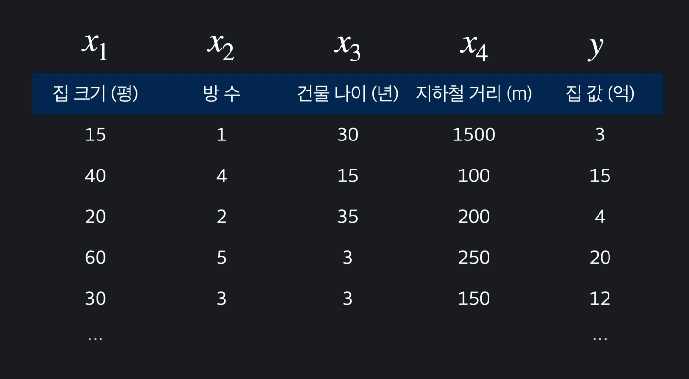

  그리고, 이제부터는 n번째 데이터를 나타내던 x와 윗첨자 (1)은 하나의 벡터. x(3)안에도 집 크기, 방수, 건물나이, 지하철 거리가 모두 들어 있는 **벡터**. 

  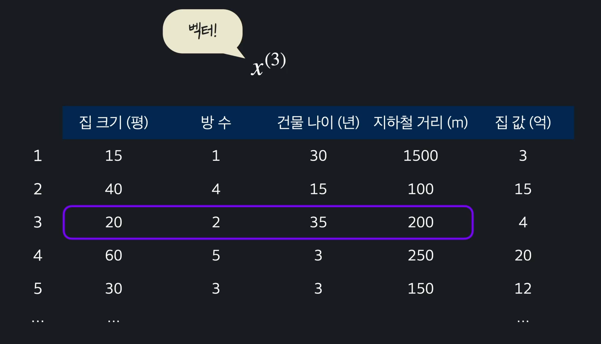

  3번째 데이터의 2번째 데이터인 방 수를 나타내려고 한다면? 

  i번째 데이터의 j번째 속성은?

  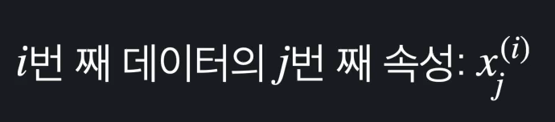

- #### 다중 선형회귀 가설 함수

  가설함수? Simple 선형회귀 복습. 입력변수를 받아, 에측값을 돌려주는 함수. 선형회귀의 목적은 이 세타값들을 바꿔주면서 학습값들에 최대한 잘 맞는 세타 값을 찾는 것. 

  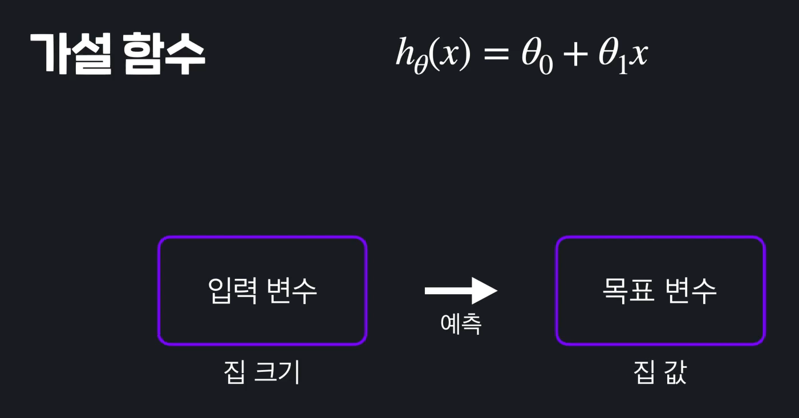

  다중선형회귀는? 똑같지 그냥. 1차함수야. 항만 많아진 것. 그 각각의 변수들의 영향력이 얼만큼 되는지를 찾는 것. 여기서도 목적은 그냥 세타값들을 조율하면서 최적의 값을 찾는 것. 

  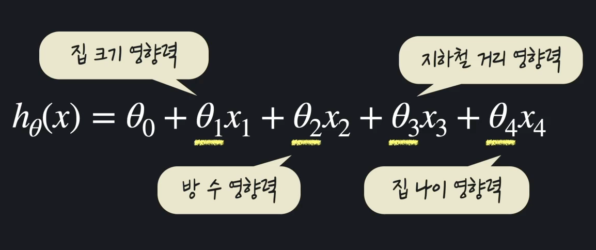

  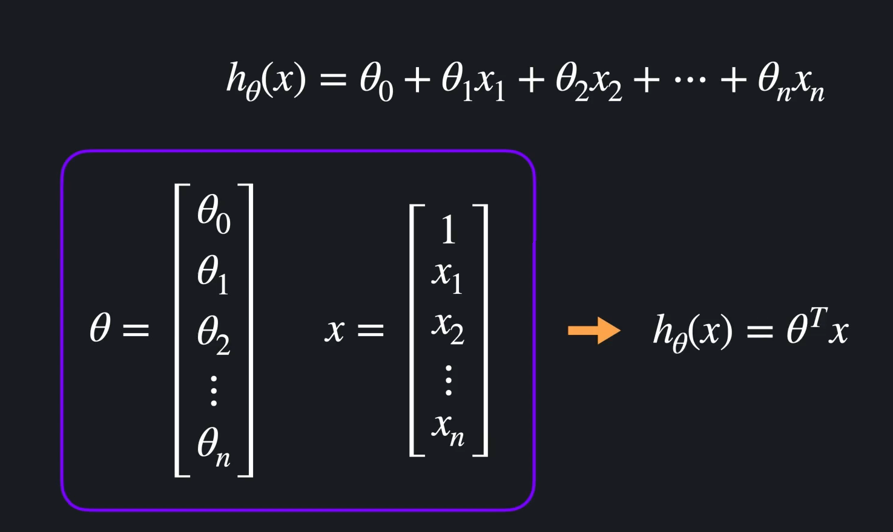

- #### 다중선형회귀 경사하강법

  가설함수가 얼마나 좋은지 알아보기 위한 방법으로 했던 것이 **Cost Function**(Loss Function). 모든 선형회귀에서 우리가 하려는 것은 손실함수를 최소화 하는 것. 

  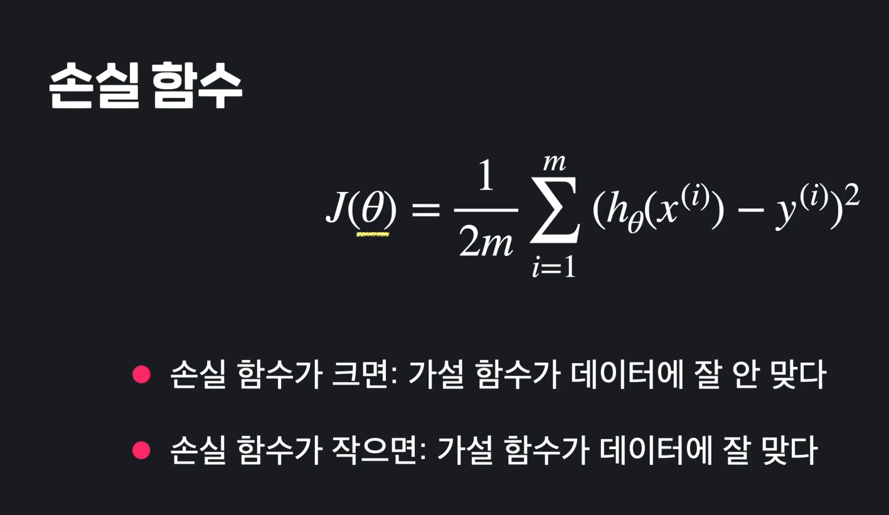

  손실함수를 최소화 하기 위한 방법으로 우리는 경사하강법을 사용했음. 손실을 가장 빠르게 줄이는 방법으로 세타 값들을 수정해 가는 것. 

  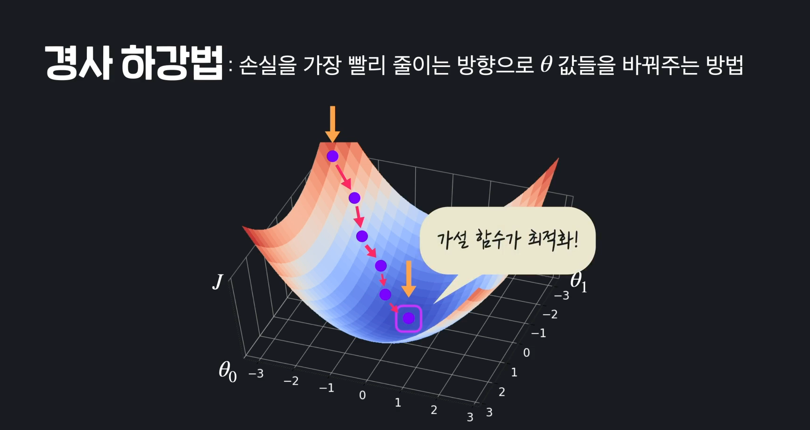

  다중회귀도 똑같음. 손실함수 똑같이 생겼음. 

  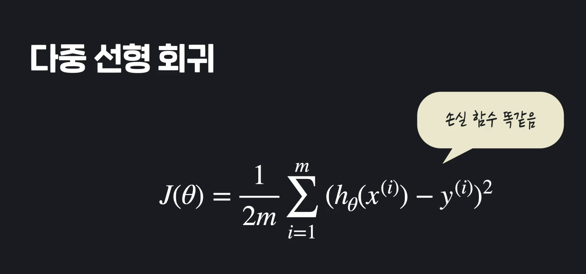

  다만, 입력변수가 1개 일때는 세타0과 세타1만 업데이트 하면 됨. 

  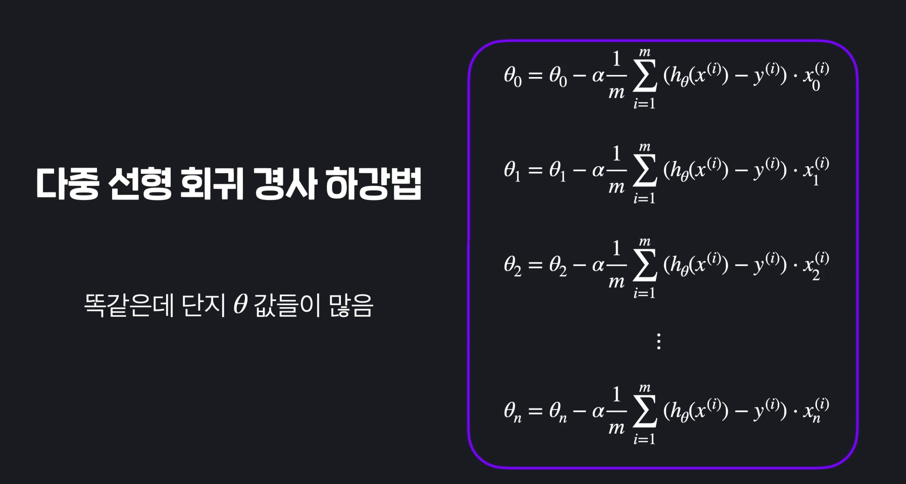

  단순화 해서 표현하자면, 

  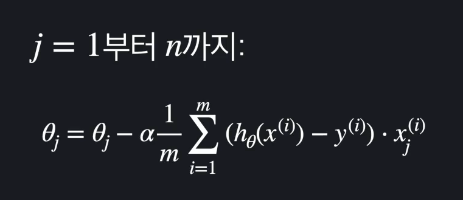

  