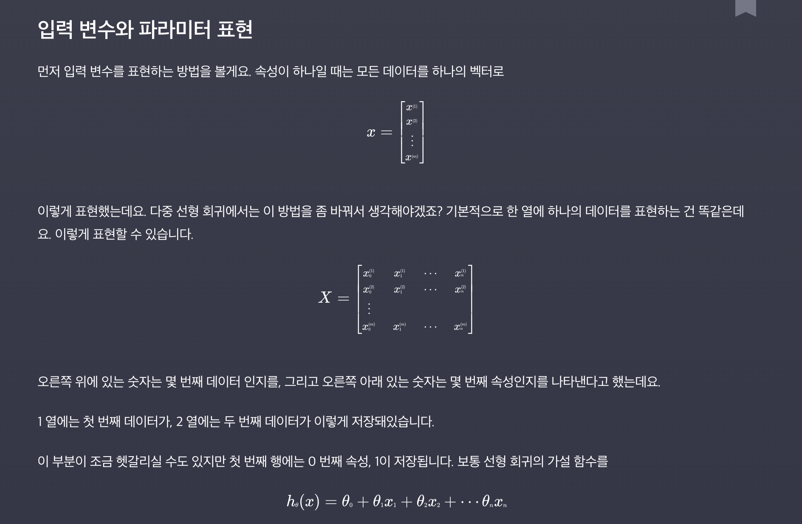
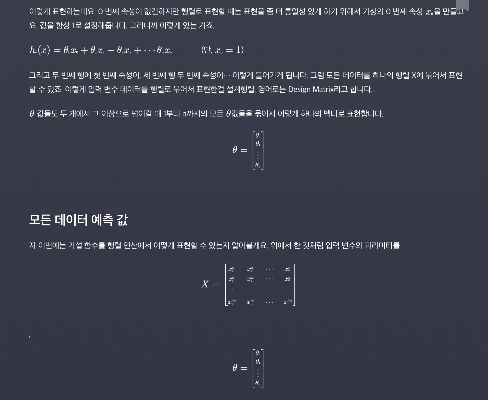
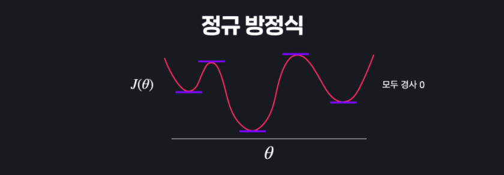

#  다중선형회귀

- 사실 머신러닝일때, 입력변수 하나인 경우는 거의 없음. 여러 입력변수로 선형 회귀를 하는 경우가 훨씬 많지. 

- 입력변수가 두개 이상이면 시각적으로 표현하기 굉장히 힘듦. 하지만, 시각화만 어려울 뿐 개념은 완전히 동일함. 


#### 표현

- 입력변수  - 속성(**Features**)

  **x1, x2, x3** 이렇게 입력변수의 갯수가 늘어날 뿐. 입력변수의 갯수는 **n**이라는 용어로 나타내고 목표변수는 똑같이 **y**로 나타냄. 학습데이터의 갯수는 똑같이 **m**으로 표현함. 

   

  그리고, 이제부터는 n번째 데이터를 나타내던 x와 윗첨자 (1)은 하나의 벡터. x(3)안에도 집 크기, 방수, 건물나이, 지하철 거리가 모두 들어 있는 **벡터**. 

  

  3번째 데이터의 2번째 데이터인 방 수를 나타내려고 한다면? 

  i번째 데이터의 j번째 속성은?

  


- #### 다중 선형회귀 가설 함수

  가설함수? Simple 선형회귀 복습. 입력변수를 받아, 에측값을 돌려주는 함수. 선형회귀의 목적은 이 세타값들을 바꿔주면서 학습값들에 최대한 잘 맞는 세타 값을 찾는 것. 

  

  다중선형회귀는? 똑같지 그냥. 1차함수야. 항만 많아진 것. 그 각각의 변수들의 영향력이 얼만큼 되는지를 찾는 것. 여기서도 목적은 그냥 세타값들을 조율하면서 최적의 값을 찾는 것. 

  

  


- #### 다중선형회귀 경사하강법

  가설함수가 얼마나 좋은지 알아보기 위한 방법으로 했던 것이 **Cost Function**(Loss Function). 모든 선형회귀에서 우리가 하려는 것은 손실함수를 최소화 하는 것. 

  

  손실함수를 최소화 하기 위한 방법으로 우리는 경사하강법을 사용했음. 손실을 가장 빠르게 줄이는 방법으로 세타 값들을 수정해 가는 것. 

  

  다중회귀도 똑같음. 손실함수 똑같이 생겼음. 

  

  다만, 입력변수가 1개 일때는 세타0과 세타1만 업데이트 하면 됨. 

  

  단순화 해서 표현하자면, 

  

  

- #### 식으로 표현하기
  
  
  
  
  
  


- #### 내 방식으로 정리 

  

  

  

  


- For Example

  ```python
  import numpy as np
  
  def prediction(X, theta):
      """다중 선형 회귀 가정 함수. 모든 데이터에 대한 예측 값을 numpy 배열로 리턴한다"""
      return X @ theta
      
      
  # 입력 변수
  house_size = np.array([1.0, 1.5, 1.8, 5, 2.0, 2.5, 3.0, 3.5, 4.0, 5.0, 6.0, 7.0, 8.0, 8.5, 9.0, 10.0])  # 집 크기
  distance_from_station = np.array([5, 4.6, 4.2, 3.9, 3.9, 3.6, 3.5, 3.4, 2.9, 2.8, 2.7, 2.3, 2.0, 1.8, 1.5, 1.0])  # 지하철역으로부터의 거리 (km)
  number_of_rooms = np.array([1, 1, 1, 1, 2, 2, 2, 2, 3, 3, 3, 3, 4, 4, 4, 4])  # 방 수
  
  # 설계 행렬 X 정의
  X = np.array([
      np.ones(16),
      house_size,
      distance_from_station,
      number_of_rooms
  ]).T
  
  # 파라미터 theta 값 정의
  theta = np.array([1, 2, 3, 4])
  
  prediction(X, theta)
  ```

  ```python
  import numpy as np
  
  def prediction(X, theta):
      """다중 선형 회귀 가정 함수. 모든 데이터에 대한 예측 값을 numpy 배열로 리턴한다"""
      # 전 과제 코드를 갖고 오세요
      return X @ theta
  
  def gradient_descent(X, theta, y, iterations, alpha):
      """다중 선형 회귀 경사 하강법을 구현한 함수"""
      m = len(X)  # 입력 변수 개수 저장
      
      for _ in range(iterations):
          # 코드를 쓰세요
          error = prediction(X, theta) - y
          theta = theta - (alpha/m)*(X.T.dot(error))
          
      return theta
      
  
  # 입력 변수
  house_size = np.array([1.0, 1.5, 1.8, 5, 2.0, 2.5, 3.0, 3.5, 4.0, 5.0, 6.0, 7.0, 8.0, 8.5, 9.0, 10.0])  # 집 크기
  distance_from_station = np.array([5, 4.6, 4.2, 3.9, 3.9, 3.6, 3.5, 3.4, 2.9, 2.8, 2.7, 2.3, 2.0, 1.8, 1.5, 1.0])  # 지하철역으로부터의 거리 (km)
  number_of_rooms = np.array([1, 1, 1, 1, 2, 2, 2, 2, 3, 3, 3, 3, 4, 4, 4, 4])  # 방 수
  
  # 목표 변수
  house_price = np.array([3, 3.2, 3.6 , 8, 3.4, 4.5, 5, 5.8, 6, 6.5, 9, 9, 10, 12, 13, 15])  # 집 가격
  
  # 설계 행렬 X 정의
  X = np.array([
      np.ones(16),
      house_size,
      distance_from_station,
      number_of_rooms
  ]).T
  
  # 입력 변수 y 정의
  y = house_price
  
  # 파라미터 theta 초기화
  theta = np.array([0, 0, 0, 0])
  
  # 학습률 0.01로 100번 경사 하강
  theta = gradient_descent(X, theta, y, 100, 0.01)
  
  theta
  ```

  


- ### 정규방정식

  지금까지는 손실을 줄이기 위해서, 경사하강법을 사용했음. 경사하강법 이외에도 다른 방법들도 있음. 손실함수가 2차 함수라고 가정해 보자. 경사하강법에서 했던 것은 특정 지점에서 시작해서 조금씩 아래로 향해서 극소점을 향해 가는 것. **그런데 한번에 바로 갈 방법은 없을까?** 생각해보면, 극소점은 기울기가 0. 기울기가 0인 지점을 찾아보자. 미분계수가 0이 되는 지점을 찾으면 되겠지. 세타가 1이겠네. 

   

  그럼 선형회귀에서 우리의 손실함수는 다음과 같이 생김. 이것도 간단히 말하면, 방정식만 풀면 돼. 이렇게 방정식을 풀어서 푸는 방식을 정규방정식(**Nomal Equation**)이라고 함. 

  

  그런데 매번 방정식을 푸는 것은 번거로움. 

  

- #### 정규방정식 증명

  	

  

  예시 코드

  ```python
  import numpy as np
  
  def normal_equation(X, y):
      """설계 행렬 X와 목표 변수 벡터 y를 받아 정규 방정식으로 최적의 theta를 구하는 함수"""
      # 코드를 쓰세요
      return np.linalg.pinv(X.T @ X) @ X.T @ y
    
  # 입력 변수
  house_size = np.array([1.0, 1.5, 1.8, 5, 2.0, 2.5, 3.0, 3.5, 4.0, 5.0, 6.0, 7.0, 8.0, 8.5, 9.0, 10.0])  # 집 크기
  distance_from_station = np.array([5, 4.6, 4.2, 3.9, 3.9, 3.6, 3.5, 3.4, 2.9, 2.8, 2.7, 2.3, 2.0, 1.8, 1.5, 1.0])  # 지하철역으로부터의 거리 (km)
  number_of_rooms = np.array([1, 1, 1, 1, 2, 2, 2, 2, 3, 3, 3, 3, 4, 4, 4, 4])  # 방 수
  
  # 목표 변수
  house_price = np.array([3, 3.2, 3.6 , 8, 3.4, 4.5, 5, 5.8, 6, 6.5, 9, 9, 10, 12, 13, 15])  # 집 가격
  
  # 입력 변수 파라미터 X 정의
  X = np.array([
      np.ones(16),
      house_size,
      distance_from_station,
      number_of_rooms
  ]).T
  
  # 입력 변수 y 정의
  y = house_price
  
  # 정규 방적식으로 theta 계산
  theta = normal_equation(X, y)
  theta
  
  ```

  


- #### 경사하강법 VS 정규방정식

  이번 챕터에서는 선형 회귀의 손실 함수 J(*θ*)를 최소화하는 \theta*θ*를 찾는 두 가지 방법, 경사 하강법과 정규 방정식을 봤는데요. 이 두 가지 방법을 표로 만들어서 비교해보도록 하겠습니다.

  |                        경사 하강법                         |                         정규 방정식                          |
  | :--------------------------------------------------------: | :----------------------------------------------------------: |
  |           적합한 학습율 α를 찾거나 정해야 한다.            |                학습율 α*를 정할 필요가 없다.                 |
  |                  반복문을 사용해야 한다.                   |                한 단계로 계산을 끝낼 수 있다.                |
  | 입력 변수의 개수 n*n*이 커도 효율적으로 연산을 할 수 있다. | 입력 변수의 개수 n*n*이 커지면 커질수록 월등히 비효율적이다. (행렬 연산을 하는 비용이 경사 하강법을 하는 것보다 크다) |
  |                                                            | 역행렬이 존재하지 않을 수도 있다 (이때는 pseudo inverse를 이용해서 다르게 계산하는 방법이 있기 때문에 큰 문제는 안 됨) |

  이런 차이가 있습니다.

  그렇다면 둘 중 어떤 걸 선택해야 되는 걸까요?

  절대적으로 정해진 건 없긴한데요. 입력 변수(속성)의 수가 엄청 많을 때는(1000개를 넘느냐를 기준으로 사용할 때가 많습니다) 경사 하강법을, 그리고 비교적 입력 변수의 수가 적을 때는 정규 방정식을 사용합니다.


- #### CONVEX함수

  저번과 이번 챕터에서는 경사 하강법, 그리고 정규 방정식을 이용해서 선형과 다중 회귀 손실 함수를 최소화시키는 방법을 배웠는데요.

  손실 함수 J(*θ*)의 경사를 구한 뒤에 이걸 이용해서 최솟값을 갖는 θ를 찾았습니다. 근데 단순히 경사 하강법과 정규 방정식만 이용하면 항상 손실 함수의 최소 지점을 찾을 수 있을까요?

  이런 함수에서 경사 하강법을 한다고 해볼게요.

  

  이 지점에서 시작을 해서 경사를 따라 쭉 내려갑니다. 내려가다가 보면 어느 순간 여러 극소값 중 하나에 오겠죠? 그럼 여기서는 경사가 0이어서 경사 하강이 종료가 될 텐데요. 그럼 손실 함수의 최저점을 찾아갈 수가 없습니다(Gradient Descent는 현재 지점 기준으로 가장 가파르게 내려가는 지점을 찾아줌. 그런데, 지금 보라색 점 같은데서 걸리면 최저점을 찾아도 사실상 Global 최저점이 아님. ). 

  정규 방정식도 마찬가지입니다.

  

  이렇게 수많은 극소값들과 극대값들이 있으면 아무리 방정식을 해결해도 **구한 수많은 지점 중에서 어떤 지점이 최소점인지를 알 수가 없죠.** 이 모든 지점들이 경사가 0일테니까요. **세타의 벡터를 구한다고 해도, 이 중에 누군지를 알 수가 없음.** 

  그러니까 함수가 이런 식으로 생긴 경우에는 경사 하강법과 정규 방정식을 통해서 구한 극소 지점이 손실 함수 전체에서 최소 지점이라고 확실하게 얘기할 수가 없는 건데요.

  반대로 손실 함수가 이렇게 생겼다고 합시다.

  

  이 함수는 어떤 지점에서 경사 하강을 시작해도 항상 손실 함수의 최소 지점을 찾을 수 있고, 정규 방정식을 이용해서 최소점을 구할 수 있겠죠?

  아래와 같은 함수를 **convex 함수(아래로 볼록한 함수)**라고 부릅니다.

  **convex 함수에서는 항상 경사 하강법이나 정규 방정식을 이용해서 최소점을 구할 수 있는 반면, 노트 위에서 봤던 non-convex 함수에서는 구한 극소점이 최소점이라고 확신할 수 없죠.**
  
  **선형 회귀의 평균 제곱 오차**
  
  선형 회귀에서는 가정 함수의 예측값들과 실제 목표 변수들의 평균 제곱 오차(MSE)를 손실 함수로 사용했는데요. 다행히 선형 회귀 손실 함수로 사용하는 **MSE는 항상 convex(항이 몇개이든 Convex임)** 함수입니다. 그러니까 선형 회귀를 할 때는 경사 하강법을 하거나 정규 방정식을 하거나 항상 최적의 θ 값들을 구할 수 있는 거죠. 고로 사용해도 된다는 것. 
  
  > 그런데 왜 MSE는 항상 Convex가 나오는가?
  >
  > 가장 간단한 케이스로 최적선의 상수항이 0인,   y_predict=θx 인 경우를 생각해보면요.
  >
  > error의 제곱은 (θx-y)^2 이니까 2차식이죠.
  >
  > 2차식인 경우 이차항의 계수가 양수일 경우 반드시 아래로 볼록한 (convex) 그래프가 나오죠.
  >
  > 그런데 (y-θx)2 은 전개할 경우 반드시 θ2 의 계수가 양수가 나오게 됩니다.
  >
  > MSE는 단순히 위의 error제곱을 모두 모아서 평균낸 것 뿐입니다.
  >
  > 이 것은 θ의 최대 차항의 차수를 바꾸지 못하니 결국 그대로 이차항이고요.
  >
  > 따라서 그래프가 **convex**하기 때문에 항상 최소값이 존재합니다.
  >
  > 다항선형회귀의 경우에도 행렬로 생각하면 계산 결과가 같습니다.
  >
  > 아래 강의 노트를 참고하시면 될 것 같습니다.
  >
  > https://www.codeit.kr/learn/courses/machine-learning/3049
  >
  > J(쎄타) 의 최대차항이 쎄타T쎄타 이기때문에 결국 행렬로 표현된 2차다항식이다라고 이해해도 될 것 같아요.
  >
  > 
  >
  > **최대차항의 계수가 하나는 음수, 하나는 양수인 경우**
  >
  >  
  >
  > **최대차항의 계수가 둘다 양수인 경우.** 
  >
  > 
  >
  > **최대차항의 계수가 하나는 둘다 음수인 경우.** 
  >
  >  
  
  


