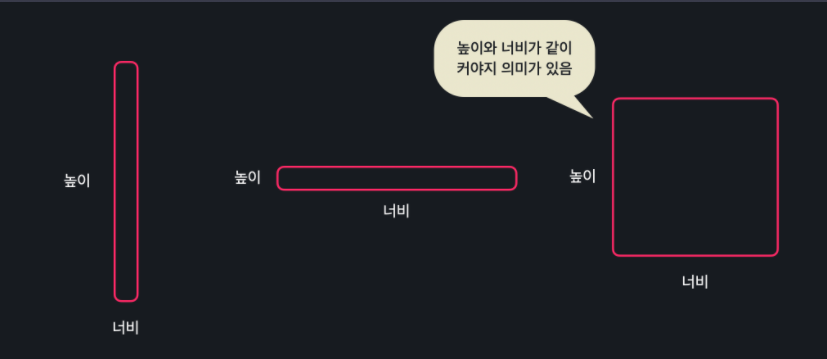

# Polynomial Regression

- 지금까지는 선형회귀로 직선을 찾아왔음. 그러나, features와 target의 관계를 가장 잘 설명하는게 직선이 아닐 수도 있음. 

  **차수가 더 높을수록 더 굴곡이 많은 곡선이 나옴.** 

  우리가 데이터를 보면서 적합할 것 같은 모양을 골라야 함. 이렇게 데이터에 가장 잘 맞는 직선이 아닌 다항식이나 곡선을 만들어 가는 것을 다항회귀(Polynomial Regression)이라고 함. 

   

  

  


- #### 단일 속성 다항회귀

  다항회귀도 사실 두가지로 나뉨. 속성이 하나인 경우와 속성이 많은 경우. 속성이 많은 경우의 다항회귀를 "**다중다항회귀** 라고 부름. 우리는 일단 간단한 것 부터 살펴본다(속성이 1개인 경우).

  

  집 크기로 가격을 예측해보자. 선형회귀에서 하려고 했던 것은 **최적의 세타들을 찾는 것**. 단일 속성 다항회귀에서는 만약 2차함수라면 다음과 같이 생겼음. 여기서도 하려는 것은 **단지 세타0, 세타1, 세타2를 찾는 것.** 더 높은 차수여도 마찬가지임. 

  **근데 생각을 해보면, 다중 선형회귀처럼 풀어갈 수 있음. x, x^2, x^3을 x1, x2, x3으로 취급하면 됨.** 

  

  

​							

​	원래 집 크기라는 feature과 집 가격이라는 target만 있었다면, 그걸 그냥 제곱, 세제곱 한 값이니깐 실제로 x가 여러개라고 생각하고 그냥 하면 돼. 

​	그냥 앞에서 열심히 했던, 그 **Multi Linear Regression이랑 똑같은 공식으로 다중 선형 회귀를 하면 된다는 것.**

#### 

- ###  다중 다항 회귀

  입력 변수가 여러개인데 다항회귀를 하려고 하면 어떻게 할까?

  

  이제 여기에서 가설함수가 **2차함수**(제일 큰 항이 2차항)라고 가정한다면? 그럼 가설함수에 **"상수항 + 일차항 + 이차항"**이 있다는 뜻. 

  이차항은 변수 두개가 곱해진 것.  *x1^2*과 *x1*x2* 둘다 2차항임. 3개의 변수로 가능한 모든 2차항을 보면, 다음과 같음. 그리고 그 때의 가설함수는 아래와 같이 생김. 

  

  그럼 이제 단순해, 이 모든 가능한 변수에 대해서 가상의 열을 추가해서 만드는 거야. 그리고 그냥 입력변수가 9개인 다중선형회귀라고 생각하고 풀면 되는거야. 

  ​			

- **다항회귀의 힘**

  선형 회귀는 학습 데이터에 가장 잘 맞는 일차식을 찾아서 예측을 하는 알고리즘인 반면, 다항 회귀는 고차식을 찾아서 예측하는 알고리즘이라고 했는데요.이번 노트에서는 다항 회귀를 사용하면 단순히 복잡한 고차식에 데이터를 맞추는 거를 넘어서 어떻게 모델의 성능을 극대화할 수 있는지 알아보겠습니다.

  **속성 사이의 복잡한 관계**

  지금까지 영상으로 내내 봤던 집 값 예측 문제를 생각해볼게요.

  저희는 항상 집의 크기라는 변수가 주어진다는 가정을 했고요. 이걸 하나의 속성으로 이용했는데요. 사용하는 데이터가 항상 이렇게 하나만 사용해도 의미가 있는 완벽한 변수일 수는 없습니다. 예를 들어 집이 사각형이라고 가정하고 집 크기 대신 **집의 높이와 너비 데이터**만 있다고 합시다.

  사실 아무리 너비가 커도 높이가 작거나, 높이만 크고 너비만 작으면 크기가 작고 구조가 효율적이지 않기 때문에 집 값이 높지 않을 텐데요. 사실 이 두 변수들보다 집값을 예측하는 데 훨씬 좋은 수치는 이 둘을 곱한 값, 집의 넓이잖아요?

  

  단순 선형 회귀를 사용하면 **이 두 변수가 서로 독립적이기 때문에** 프로그램은 “높이와 너비가 같이 커야지만 집 값도 커진다”라는 관계를 학습할 수 없습니다. 쉽게 생각하면 "높이"라는 속성이 집 값에 미치는 영향, 그리고 "너비"라는 속성이 집 값에 미치는 영향을 **따로 찾아내는 거죠.**

  너비와 높이처럼 이렇게 딱 맞아떨어지지는 않더라도, 집이 아무리 커도, 높은 층이 아니거나 지하철에서 아무리 가까워도 지은지 20년이 넘었으면 집 값이 낮을 수 있습니다. 이런 경우들에도 마찬가지로 단순 선형 회귀를 쓰면 속성 하나하나가 다 독립적이기 때문에 이런 변수들 사이의 관계를 최종 예측 결과에 반영하지 못하는 거죠.

  **속성들을 서로 곱해서 차항을 높여주면,** 그러니까 선형 회귀 문제를 다항 회귀 문제로 만들어주면 속성들 사이에 있을 수 있는 복잡한 관계들을 프로그램에 학습시킬 수 있습니다.

  

  **기본적으로 다중다항회귀 학습 시킬때, 서로 곱할 수 있는 모든 경우의 수는 데이터로 다 표현되게 되어 있음. 그러나, 곱 이외에도 혹시라도 서로 사용할 수 있는 다른 컬럼들이 있다면, 새로운 컬럼으로 추가해주고 데이터로 만들어 주는 것이 좋다는 뜻.**


- #### 정리

  

  

  

- #### SKLEARN 으로 해보기

  polynomial에서 중요한건 가상의 열들을 추가하는 것. 그런데 그거는 sklearn이 다 해줌. 

  데이터 준비 과정

  ```python
  from sklearn.datasets import load_boston
  from sklearn.preprocessing import PolynomialFeatures
  from sklearn.model_selection import train_test_split
  from sklearn.linear_model import LinearRegression
  from sklearn.metrics import mean_squared_error
  
  
  import pandas as pd
  
  boston_dataset = load_boston()
  boston_dataset.data.shape
  boston_dataset.feature_names
  
  polynomial_transformer = PolynomialFeatures(2) #차수 써주면 됨. 자동으로 Poly에 맞는 데이터 만들어 주는 변환기
  polynomial_data = polynomial_transformer.fit_transform(boston_dataset.data)
  
  polynomial_data.shape # 가상의 열들이 추가된 것. 가상의 열들이 추가되어 열이 훨씬 많아짐. 
  polynomial_feature_names = polynomial_transformer.get_feature_names(boston_dataset.feature_names)
  polynomial_feature_names # 보면 가능한 모든 2차 조합이 다 있음
  
  X = pd.DataFrame(polynomial_data, columns = polynomial_feature_names)
  ```

  ```python
  # 이제부터는 그냥 다중선형회귀랑 완벽히 동일함. 
  
  y = pd.DataFrame(boston_dataset.target, columns=['MEDV'])
  X_train, X_test, y_train, y_test = train_test_split(X, y, test_size = 0.2, random_state = 5)
  
  
  model = LinearRegression()
  model.fit(X_train, y_train)
  model.coef_
  model.intercept_
  
  
  y_test_prediction = model.predict(X_test)
  mean_squared_error(y_test, y_test_prediction) ** 0.5
  ```

  