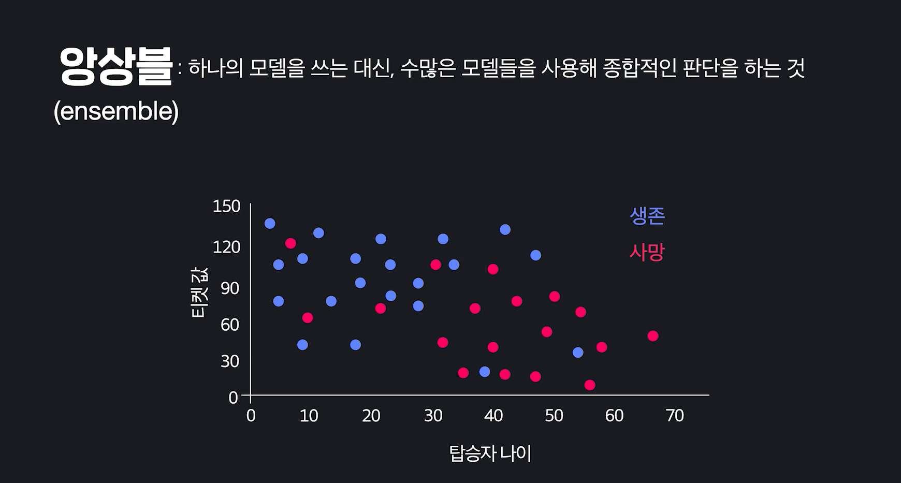
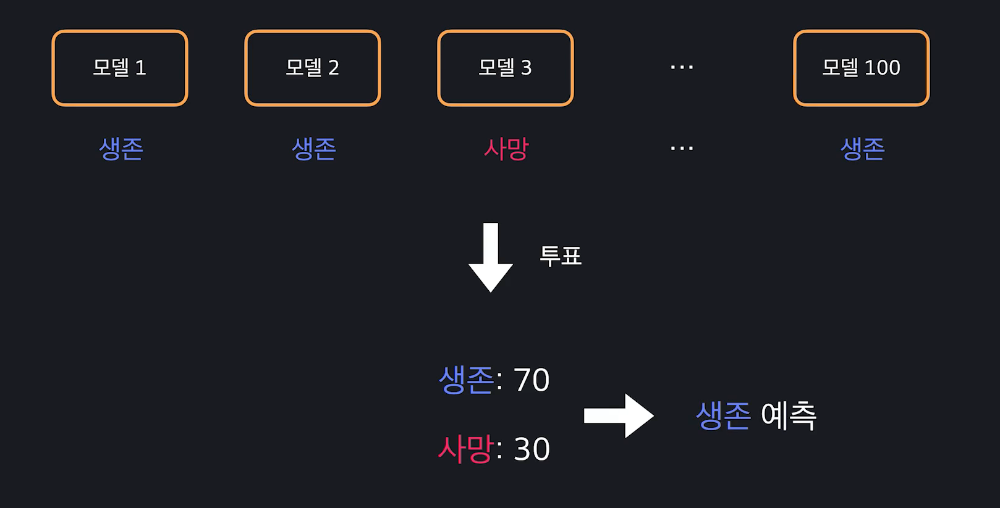
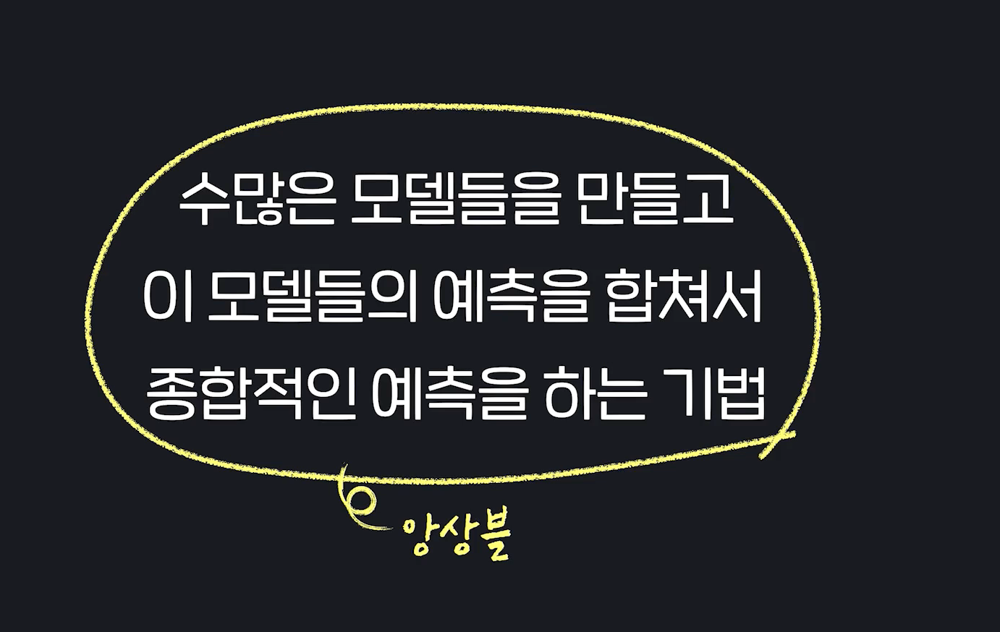
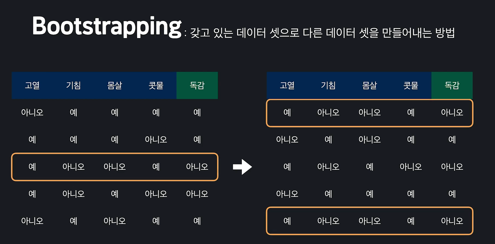
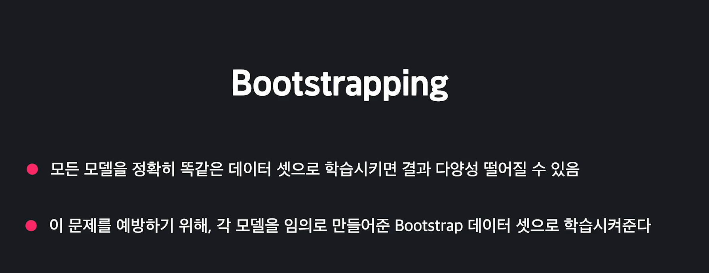
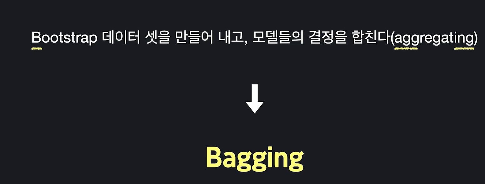
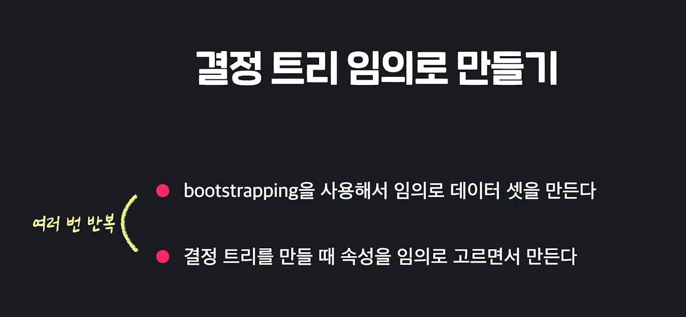
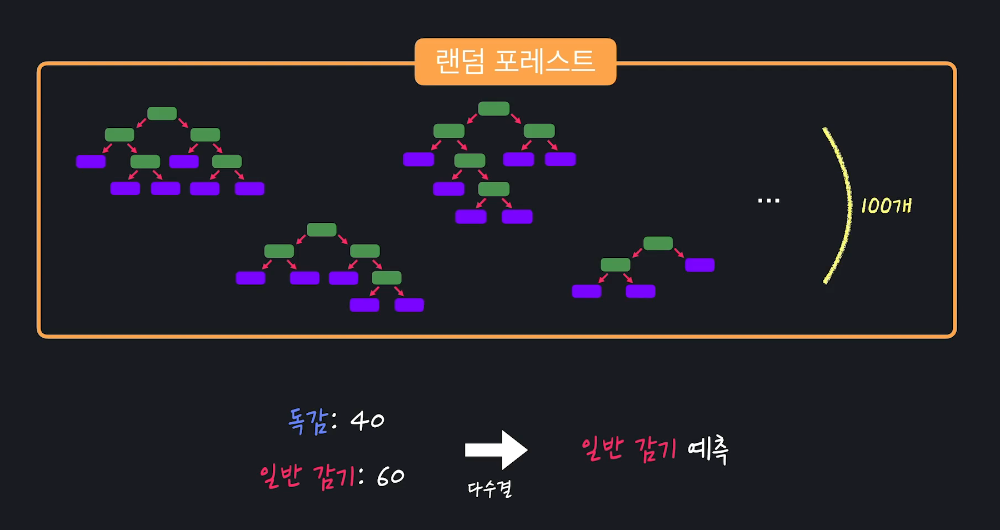
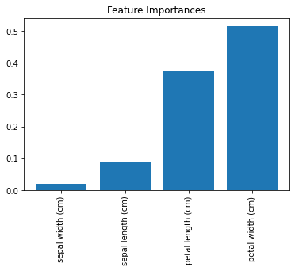

# Random Forest

결정트리에는 큰 단점이 있음. 


쉽게 말해서 다른 모델들에 비해서 성능이 안좋다는 말. 그럼 결정트리를 왜 했을까?

**결정트리를 응용하면 다른 성능이 좋은 모델들을 만들 수 있기 때문.**

결정트리를 응용하는 가장 대표적인 방법이 바로 **앙상블(Ensemble)**. 앙상블 자체는 *여러개의 독립적인 객체들이 만들어내는 조화로운 단체를 의미함* 

***단순히 하나의 모델을 쓰는 대신 수 많은 모델들을 사용해 종합적인 판단을 하는 것***.

예시를 들어 보자면, 타이타닉 탑승자가 생존했는지, 사망했는지를 예측한다고 해보자. 학습데이터



그럼 이제 이걸로 학습데이터를 이용해서 100개의 모델을 만듬. 그럼 해당 탑승자가 죽을지 살지 각 모델마다 예측이 총 100개가 있을 것. 그럼 이떄, 예측값을 투표를 통해 결정하는 것. 70개의 모델이 생존을 예측, 30개의 모델이 사망을 예측하면 생존으로 분류하겠다는 것. 



이렇게 다수결 투표는 앙상블의 한 예시. 하나의 모델을 사용하는 대신, 수 많은 모델을 만들고 이 모델들의 예측을 합쳐서 종합적인 예측을 하는 기법을 모두 앙상블 이라고 말함. 



결정트리와 앙상블을 합치면 하나의 결정트리를 사용하는 것 보다 훨씬 더 좋은 모델을 만들 수 있음. 


**랜덤포레스트는 수 많은 트리 모델들을 임의로 많이 만들어서 다수결 투표로 결과를 종합하는 알고리즘.** 

랜덤포레스트에서 임의성을 더하는 방법은 2가지가 있음. 

- #### 랜덤포레스트 Bagging

  갖고 있는 데이터셋으로 다른 데이터셋을 만들어내는 방법. 

  독감 환자 데이터가 있다고 하면, 원래 있던 데이터셋에서 임의로 한 데이터셋을 고름. 그리고 얘를 새로운 데이터셋에 추가해줌. 이렇게 하나씩 새로운 데이터셋에 추가해줌. 보면, ***3번째 행의 데이터가 2번 추가되었고, 두번째 행의 데이터는 한번도 추가가 안됨 나머지는 다 한번씩 추가되었고*** . 상관없음 원래 하고싶었던게, 같은 크기의 데이터셋을 임의로 만들고 싶었던 것. 이런식으로 원래 데이터셋에서 새로운 데이터를 만들어 내는 방식이 **Bootstraping**. 그리고 이렇게 만들어낸 데이터셋을 **Bootstrap Dataset**이라고 부름. 

  

  그런데 Bootstrap Dataset을 만드는 이유가 뭘까? 앙상블은 수 많은 모델을 만들고 이 모델들을 기반으로 예측을 하는 기법. 모델들을 정확히 다 똑같은 데이터셋으로 학습시키면 결과 다양성이 떨어질 수 있음. 이걸 방지해주기 위해서 모델을 만들 때 마다 똑같은 데이터셋으로 만들어 주는 것이 아닌 임의로 만들어준 Bootstrap Dataset으로 학습시켜 주는 것. 

  

  모든 앙상블 알고리즘들이 Bootstraping을 하는 것은 아님. 이렇게 Bootstrap Dataset을 만들고, 모델들의 결정을 조합해서 예측을 하는 앙상블 기법을 Bootstrap Aggregating, 줄여서 Bagging이라고 부름. 

  


- a

  결정트리를 그냥 만들때는, 각 속성들을 사용한 질문들의 지니불순도를 구하고, 가장 낮은애를 골라서 사용했음. 랜덤포레스트를 만들 때는 이 속성들 중 2개를 임의로 고름. 속성이 더 많으면 임의로 3~4개를 고를 수도 있음. 그럼 이 딱 2개만 사용해서 불순도 비교해서 루트노드의 질문을 만듬. 그 다음 똑같이 다른 2개를 골라서 불순도 비교해서 낮은 것을 질문으로 선택. 결정트리를 만드는 것 자체는 그 동안 했던 것과 크게 다르지 않으나, 어느정도는 임의로 만드니깐 수 많은 결정트리들이 나올 수 있음. 

  

  결국 종합해보면 결정트리를 임의로 만들기 위해,  Bootstrap Data를 사용하고, 속성도 임의로 고르면서 만듬. 그리고는 이 두 단계를 엄청나게 반복함. 그럼 서로 조금씩 다른 수 많은 결정트리를 만들 수 있음. 

  

  **이렇게 수 많은 결정트리들을 임의로 만들고 다수결 투표로 종합하는 것이 랜덤포레스트.** 

  


- #### Sklearn으로 Random Forest 사용하기

  **데이터 준비**

  ```python
  from sklearn.datasets import load_iris
  from sklearn.model_selection import train_test_split
  from sklearn.ensemble import RandomForestClassifier
  import matplotlib.pyplot as plt
  import numpy as np
  
  
  import pandas as pd
  
  iris_data = load_iris()
  
  X = pd.DataFrame(iris_data.data, columns=iris_data.feature_names)
  y = pd.DataFrame(iris_data.target, columns = ['Class'])
  
  X_train, X_test, y_train, y_test = train_test_split(X, y, test_size=0.2, random_state=5)
  y_train= y_train.values.ravel()
  ```

  **랜덤포레스트 모델 학습**

  ```python
  # n_estimators = 기본값은 10, 결정트리 몇개 사용할 것인가
  model = RandomForestClassifier(n_estimators=100, max_depth = 4)
  
  model.fit(X_train, y_train)
  
  model.predict(X_test)
  
  # 90% 확률로 분류
  model.score(X_test, y_test)
  ```

  **시각화해보기**

  ```python
  # 랜덤포레스트도 결정트리를 이용하기 떄문에 속성중요도를 알 수 있음. 
  importances = model.feature_importances_
  
  indices_sorted = np.argsort(importances)
  plt.figure()
  plt.title("Feature Importances")
  plt.bar(range(len(importances)), importances[indices_sorted])
  plt.xticks(range(len(importances)), X.columns[indices_sorted], rotation = 90)
  ```

  