#  기본 지도 학습 알고리즘

## Linear Regression 

- 집 가격 예측 알고리즘을 만들고자 함. 문제를 단순화 하기 위해서, 오직 집값을 가지고 만들고자 함. 데이터를 그래프에 찍으면 아래와 같음. 이 집 데이터를 프로그램에게 학습시키고자 함. 그 후에 이 프로그램이 어떤 새로운 데이터(집 크기)를 받았을 때 가격을 예측하도록 만들고자 함. 

  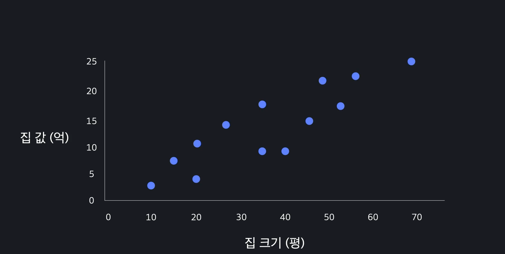

- **선형회귀는 여기 있는 데이터를 가장 잘 대변해 주는 선을 찾는 것**. 이 선을 **최적선(line of best fit)**이라고 함.  이 선에서 이제 그냥 크기를 넣으면 가격이 예측 되는 것. 꽤 합리적인 예측이 가능함. 

  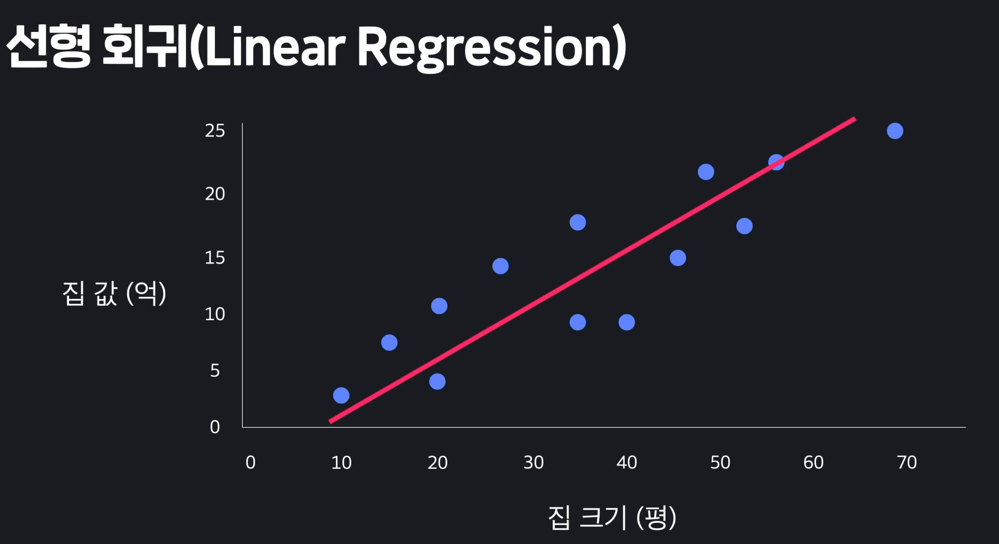

- #### 선형회귀 용어

  머신러닝은 **지도학습**, **비지도학습, 강화학습** 세가지로 나뉨. 이 셋중에 선형회귀는 **지도학습** 알고리즘(답이 존재하니깐). 그리고 지도학습은 분류와 회귀로 나뉘게 됨. 이 중에, **회귀**. 연속적인 어떤 값 중에 마추는 거니깐. 만약 이 집이 오피스텔인지, 아파트인지, 주택인지 알아내야 하는 것이라면 그것은 분류겠지. 

  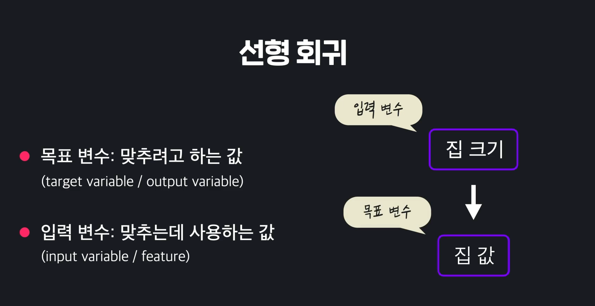

- #### 데이터 표현법. 

  프로그램 학습시키기 위한 데이터는 **학습데이터.** 학습데이터의 갯수를 **m**이라는 문자로 표현함. **입력변수는 x, 목표변수는 y라는 문자로 표현함.** 

  데이터가 50개 있으면, 이것은 각각 어떻게 표현할까? 그냥 features는 x위에 괄호 1, 괄호 2 이렇게 쓰는 것. 목표변수는 y위에 괄호1, 괄호 2 쓰면 됨. 

  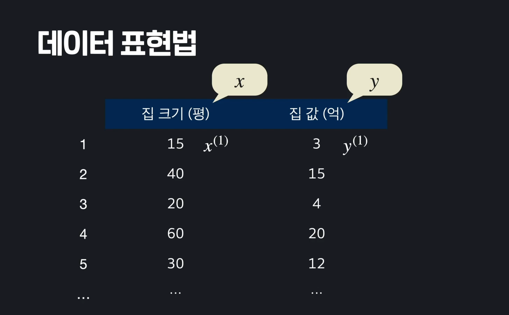

- #### 가설함수

  선형회귀에서 하려는 것은 최적선을 찾고자 하는 것. 최적선을 찾아내기 위해 다양한 함수를 시도 해봐야 함. 시도하는 이 함수 하나하나를 가설함수(Hypothesis Function)이라고 부름. 결국 (변수가 하나일 때) **선형회귀**의 의무는 **계수 a와 상수 b**를 찾아내는 것. 

  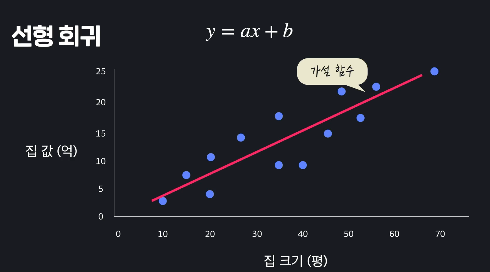

  일반적으로 가설함수를 쓸때는 a, b를 쓰지 않고 h(x)와 세타를 씀. 왜 이렇게 쓸까? 이번 함수에서는 입력변수가 한개니깐 그냥 a, b 이렇게 되니깐 하다 보면 이 변수가 보통은 몇십개 몇백개씩 됨. 그러면 다 어떻게 쓸꺼야? 그런 경우 일관성있게 쓰기 위해 아래와 같이 사용하는 것. **선형회귀의 임무는 결국 이 세타 값들을 찾아내는 것**.  

  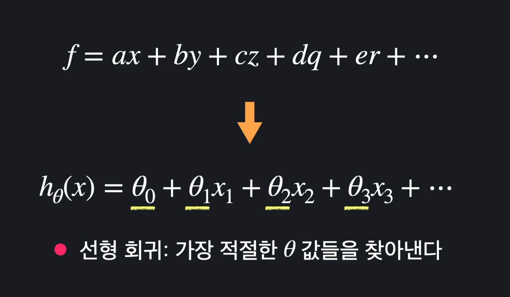

  

- #### 평균제곱오차(MSE)

  입력변수 하나인 상황을 가정 중. 세개의 선 아무거나 그어봤음. 어떤게 가장 적합할까? 뭔가 두번째가 잘 맞는것 같은데 기준이 뭐야? 평가하는 방법이 뭐야. 그게 바로 **평균제곱오차 : Mean Squared Error**임. 이 데이터들과 가설함수가 평균적으로 얼마나 떨어져있는지를 나타내는 방식. 

  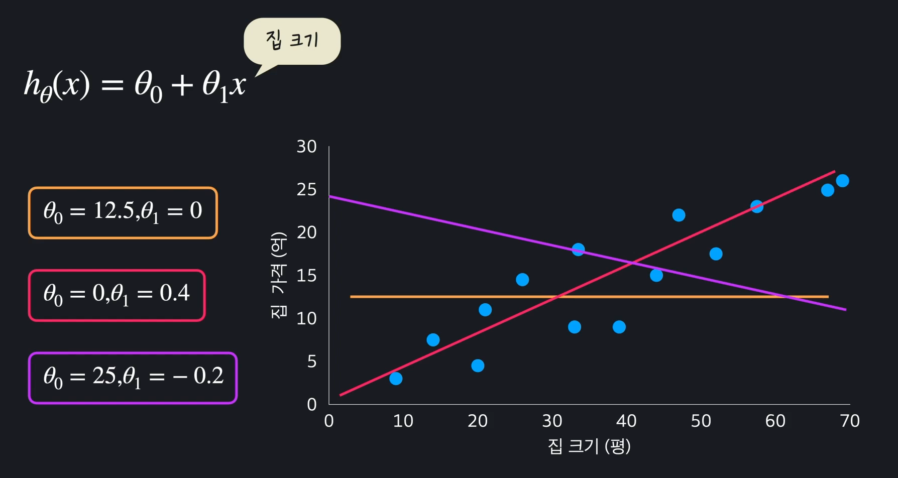

  각 데이터의 값고, 가설함수가 예측한 값이 조금씩 차이가 남. 지금 하단의 보라색 점을 가설함수에 넣어보면, 집 가격은 18.8억으로 예측되지만, 실제로는 22억으로 예측됨. **차이는 -3.2억.** 이런 식으로 오차를 다 구할 수 있음.  이 오차들을 싹다 제곱하고 제곱한 값들을 더함. 그리고 총 데이터 갯수만큼 나눔. 이게 평균제곱오차. 이게 가장 작은 놈을 구하자는 것. 

  굳이 왜 제곱을 해서 더할까? 당연하지. 양수일때도 있고, 음수로 올때도 있는데, 차이는 엄청 많이 나는데 그게 서로 다 상쇄되서 차이가 0되면? 그걸 방지하기 위해서 ***양수와 음수를 '차이'라는 기준으로 똑같이 취급***하는거야. 절대값처럼. 그리고 두번째 이유는 ***오차가 커질수록 더 부각시키기 위해서***. 더 큰 오차에 대해서는 더 큰 패널티를 주기 위함. 

  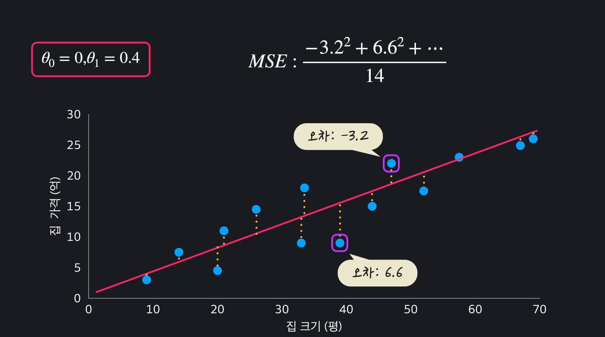

  이제 처음 계산하려고 했던 것의 평균제곱오차를 찾아보면 아래와 같음. 이런 기준으로 구할 수 있다는 것. 가장 작은 것을 픽. 

  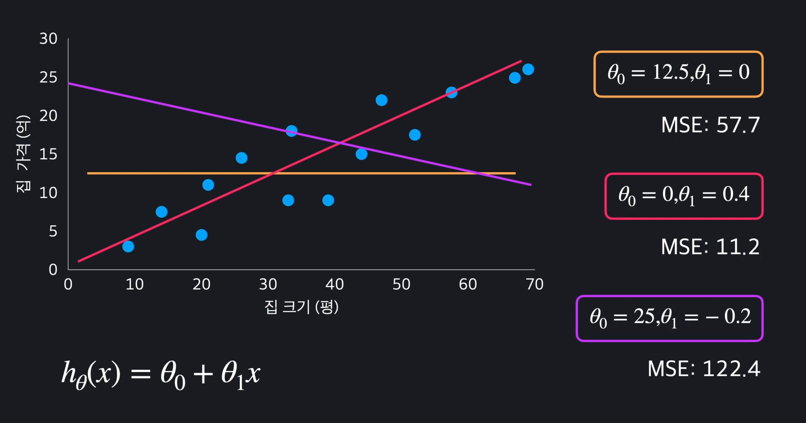


-  **이제 일반화 해보자.**

  가설함수에 x를 넣은 것을 실제 값에서 뺀 후 제곱. 그걸 싹다 m개 시그마 해서 더하고, 전체 갯수로 나눔. 		 			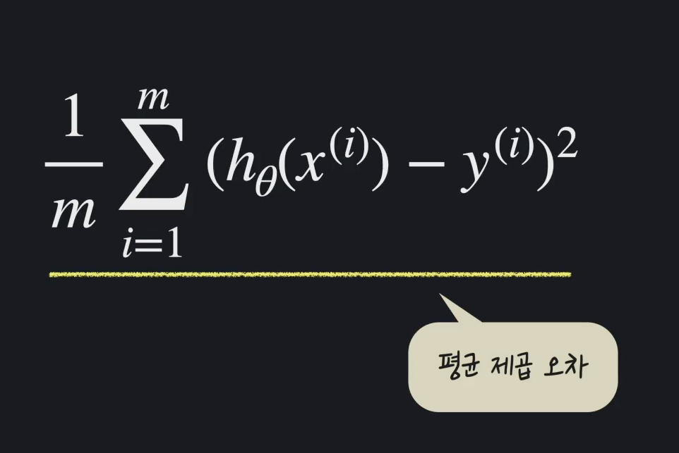


- #### 손실함수(Loss Function)  = 비용함수(Cost Function)

  선형회귀는 단순히 그냥 데이터에 가장 잘 맞는 선을 찾아내는 것. 이 선을 line of best fit이라고 하고. 이 선을 찾기 위해서는 다양하게 시도를 해 보면서 가장 잘 맞는 것을 골라야 함. 그 중 한가지 방법으로 MSE가 가장 작은 값들을 찾아내는 과정이였음. 그 시도해보는 하나하나의 선이 **가설함수**였음. 

  **평균제곱오차가 크다는 것은 가설함수가 데이터에 잘 안 맞는다는 것이고 평균제곱오차가 작다는 것은 가설함수가 데이터에 잘 맞다는 것.** 

  

  손실함수는 가설함수의 성능을 평가하는 함수. 손실함수의 아웃풋이 작을 수록 가설함수가 데이터에 잘 맞다는 것. 

  손실함수는 보통 J라는 문자를 쓰며, 선형회귀에서는 보통 평균제곱오차를 손실함수로 사용함. m대신 2m을 쓴것은 계산을 편하게 하기 위한 장치임. 어차피 2로 나누면, 순위 결과는 변함이 없음. 

  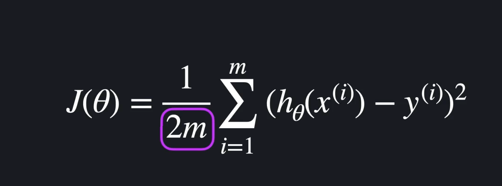

  여기서 중요한 것은 **손실함수 J의 인풋은 세타가 됨.** 당연히 세타일수 밖에 없지. 각 세타들일때, 마다 MSE라는 손실함수를 구하는 거니깐. 애초에 여기서 지금 세타 말고 아무런 변수가 없잖아. **i**는 다 대입되는 값이고.  


- #### 경사하강법(Gradient Descent)

  결국 세타를 찾아가는 과정이 선형회귀를 풀어가는 과정. 그 기준으로서 손실함수를 쓰고 있었던 것. 그 손실함수를 세타 값들을 바꿔가면서, 가장 좋은 선형회귀선을 찾는게 우리가 하고 있는 과정. 

  **손실함수는 변수가 세타라는 것을 잊지 말자. 우리는 적절한 세타를 찾아가는 과정임.** 이제 그럼 세타라는 변수를 가진 J라는 함수가 있겠지. 

  단지 손실함수가 아래와 같다고 가정을 한다면(실제 1변수 1개짜리로 해보면 2차식이 나옴), 가장 작은 극소값을 찾고 싶다는 것. 랜덤한 세타값으로 가설함수를 정했다고 해보자. 현재 지점이 기울기가 -2라면, 오른쪽 방향으로 가면 되겠지. 오른쪽으로 움직여 가는 것. 이렇게 극소법을 찾아가는 것이 극소점을 향해 내려가는 것. 

  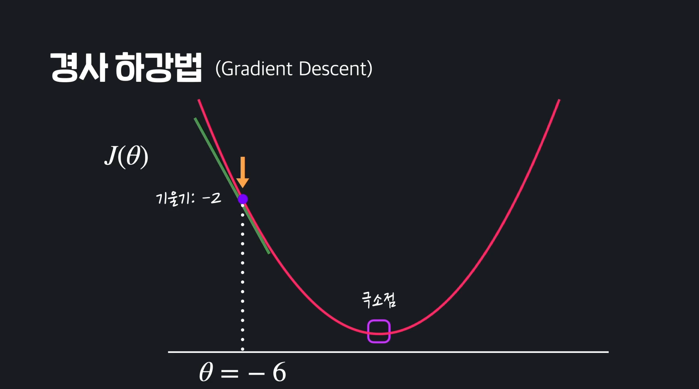

  근데 위 식은 지금 세타를 하나만 가정했음. 손실함수는 변수 2개에 대한 함수인데, 변수 한개에 대한 함수만을 그린 거야. 

  근데 변수 2개로 해도 똑같아. 여기서 어떻게 내려갈래? 보라색 점에서의 기울기는, 각 인풋변수에 대해서 편미분을 하면 됨. 편미분한 결과식에 현재 위치의 좌표값을 대입하고, 이걸 벡터로 만들면 이게 바로 이 위치에서의 내려가야 하는 기울기. J라는 함수를 편미분한 벡터를 만들고, 그 벡터에 이 각각의 좌표값을 대입하면 그 방향으로 가는게 가장 빠르게 내려가는 방향이라는 것(-를 붙이면). 살짝 내려가고 다시 그 지점에서의 내려가는 벡터를 구해서 그 방향으로 가고 이걸 반복하는 게 그냥 Gradient Descent임. 

  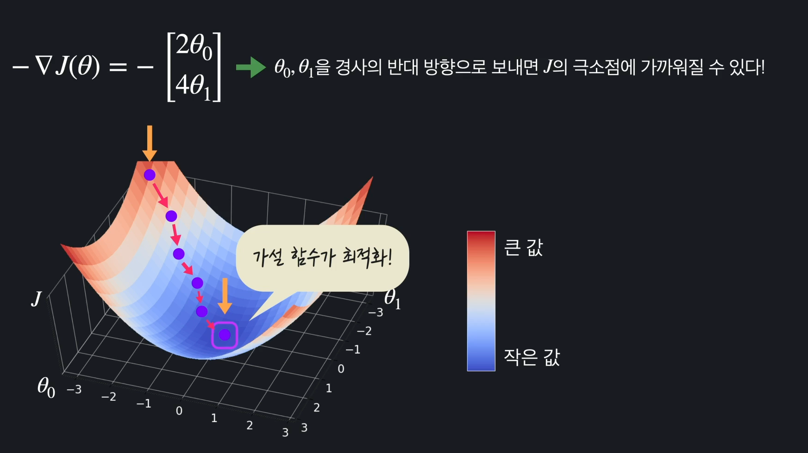

  

  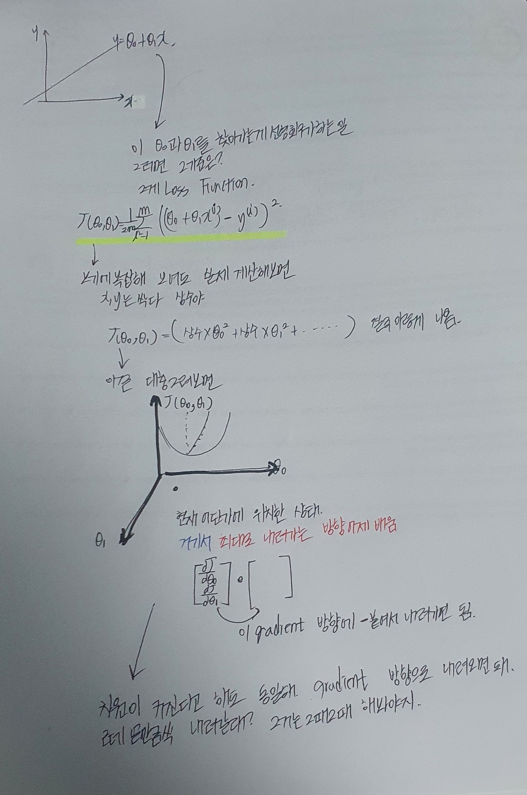


- #### 경사하강법 테크닉

  계속해서 아래로 내려가면 됨. 현재 Gradient Function(편미분 벡터)가 나와있고, 현재 세타0가 -3이고, 세타 1도 -3이라면 이제 어떻게 내려가면 될까? 

  가장 가파르게 내려가는 방향은 알았어. 

  이제 세타0과 세타1에 각각 그 움직이는 방향으로 움직이면 끝이야. 

  새로운 세타0는 **-3 - 학습률a * (-6)**  -> 학습률 알파를 넣는 이유는 얼마나 많이/적게 움직일지에 대해서 말하기 위함. 학습률을 0.1이라고 하면 식은 아래와 같음. 세타1도 똑같아.

  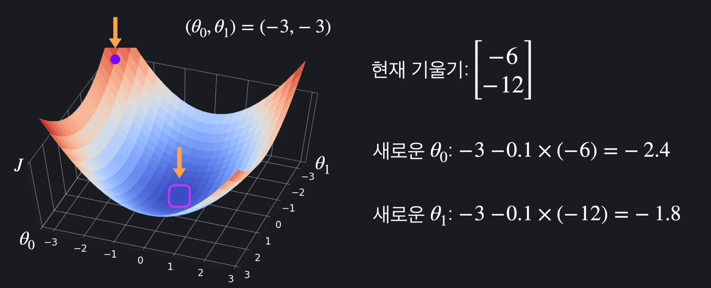

  경사하강 한번 하니깐, 세타0과 세타1의 값이 바뀜. 근데 여기서 주의해야 되는 문제가, 세타0을 업데이트 한 다음에 세타1을 업데이트 하려고 하면, 세타 1을 구하면서, **J에 업데이트된 세타0을 넣을 수가 있음**. **반드시 바뀌기 전 값을 넣어야 한다는 것을 기억하자**. 

  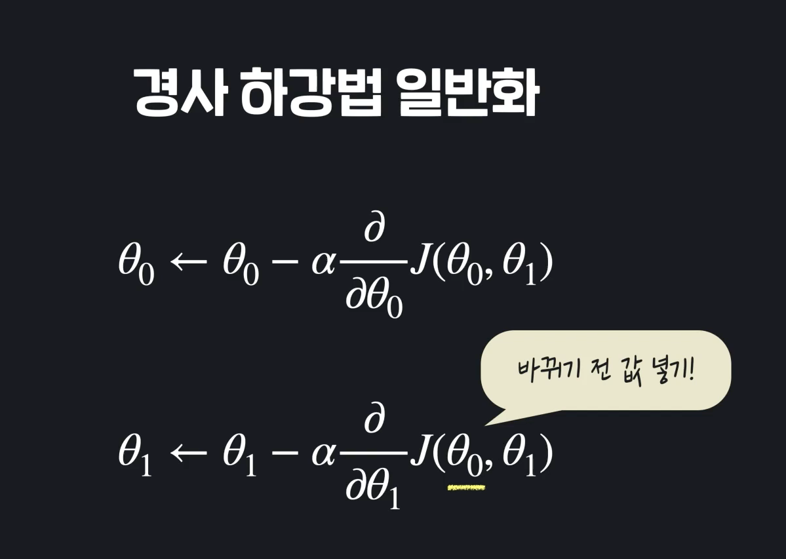

  이걸 반복하다 보면, 손실함수의 극소점에 가까이 갈 수 있고 최적의 세타 값들을 찾을 수 있게 되는 것. 

  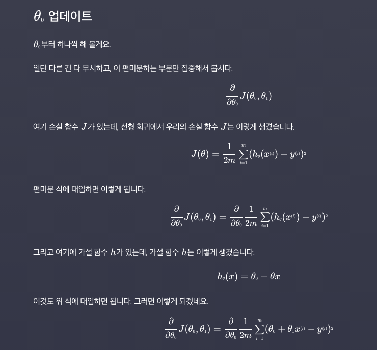

  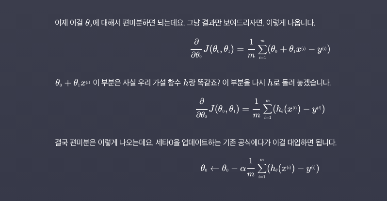

  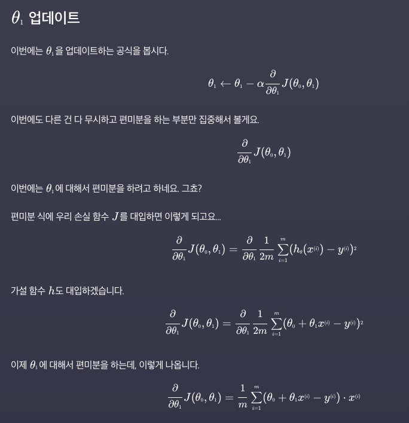	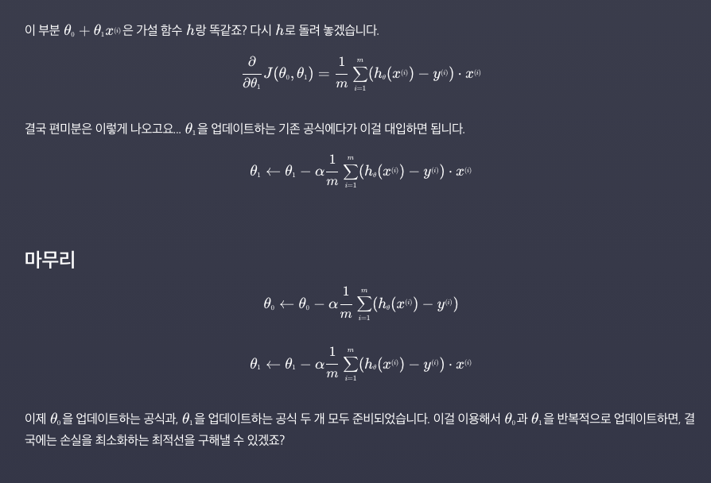


- 선형회귀 구현하기 쉽게 표현하기

  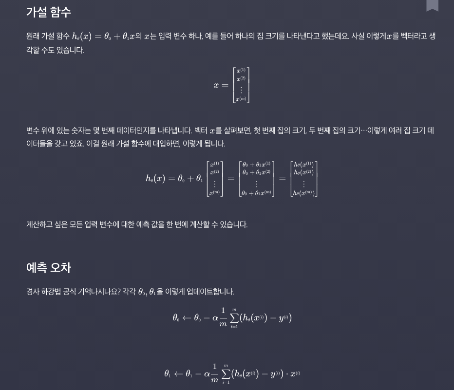

  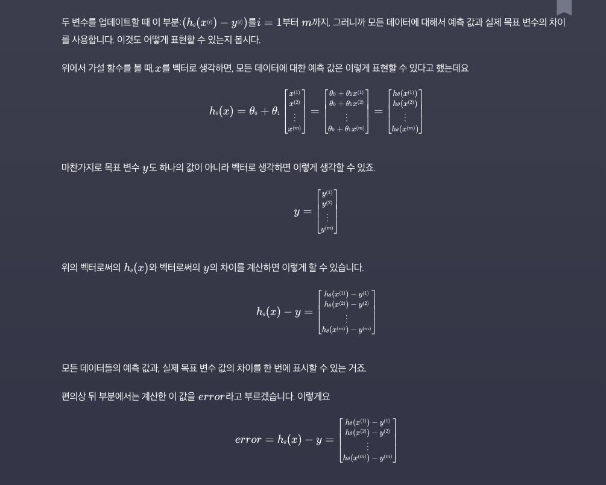

  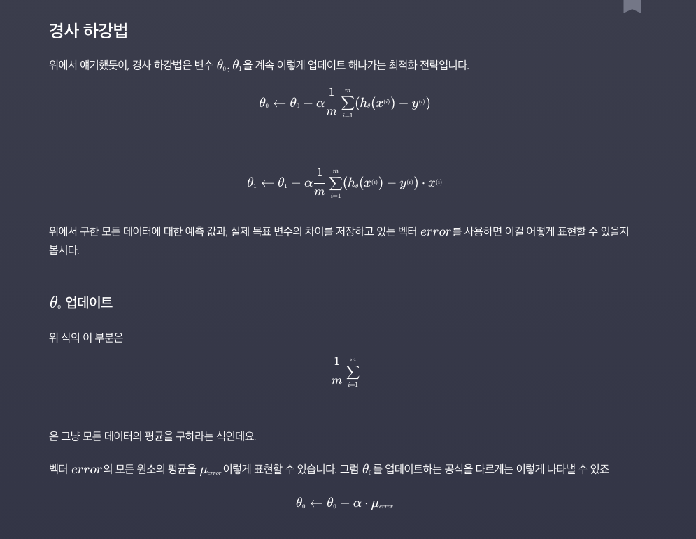

  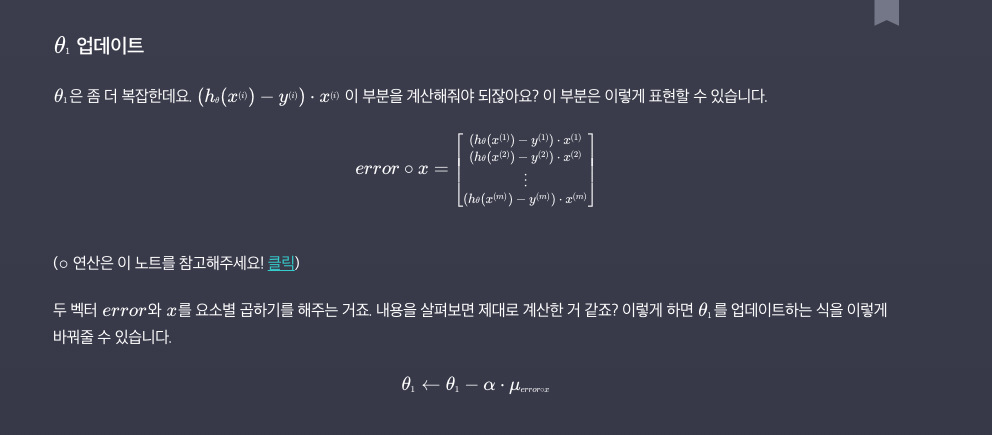

  


- 절대 어렵지 않다. 우리가 하고자 하는것은 **Θ**를 구하는 것. X와 Y의 행렬은 모두 주어진 상수이다. J(Θ) 함수 또한 사전에 미리 약속되어 있는 것. X와  y가 주어져 있다는 말은 곧, J(Θ)는 바로 Θ에 대한 식으로 정리가 가능하다는 것 이다(X 행렬과 y 벡터는 단지 쉽고 편리하게 보기 위한 수단일 뿐, 계산이 모두 가능하다). 그럼 J라는 함수가 바로 세타에 대한 식으로 정리된다는 것은 편미분 벡터도 바로 계산이 가능하다는 것. 편미분 벡터가 계산이 바로 가능하면, 현재 아무 세터나 넣어서 셋팅을 한 후에 Gradient Descent를 하면서 값을 찾아가기만 하면 된다. 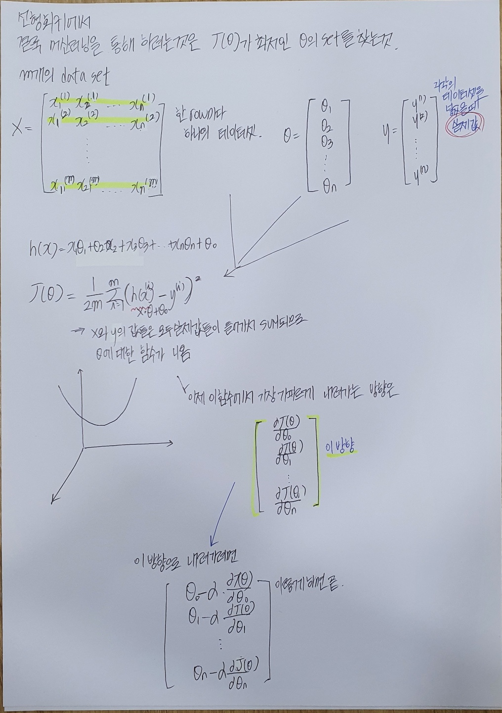


- 실행은 정말 매우 간단하다 

  ```python
  import numpy as np
  
  def prediction(theta_0, theta_1, x):
      """주어진 학습 데이터 벡터 x에 대해서 모든 예측 값을 벡터로 리턴하는 함수"""
      return theta_0 + x * theta_1
      
  def prediction_difference(theta_0, theta_1, x, y):
      """모든 예측 값들과 목표 변수들의 오차를 벡터로 리턴해주는 함수"""
      return prediction(theta_0, theta_1, x) - y    
      
  def gradient_descent(theta_0, theta_1, x, y, iterations, alpha):
      """주어진 theta_0, theta_1 변수들을 경사 하강를 하면서 업데이트 해주는 함수"""
      for _ in range(iterations):  # 정해진 번만큼 경사 하강을 한다
          error = prediction_difference(theta_0, theta_1, x, y)  # 예측값들과 입력 변수들의 오차를 계산
          theta_0 = theta_0 - alpha*(error.mean()) 
          theta_1 = theta_1 - alpha*((error*x).mean())
          
      return theta_0, theta_1
      
      
  # 입력 변수(집 크기) 초기화 (모든 집 평수 데이터를 1/10 크기로 줄임)
  house_size = np.array([0.9, 1.4, 2, 2.1, 2.6, 3.3, 3.35, 3.9, 4.4, 4.7, 5.2, 5.75, 6.7, 6.9])
  
  # 목표 변수(집 가격) 초기화 (모든 집 값 데이터를 1/10 크기로 줄임)
  house_price = np.array([0.3, 0.75, 0.45, 1.1, 1.45, 0.9, 1.8, 0.9, 1.5, 2.2, 1.75, 2.3, 2.49, 2.6])
  
  # theta 값들 초기화 (아무 값이나 시작함)
  theta_0 = 2.5
  theta_1 = 0
  
  # 학습률 0.1로 200번 경사 하강
  theta_0, theta_1 = gradient_descent(theta_0, theta_1, house_size, house_price, 200, 0.1)
  
  theta_0, theta_1
      
  ```

  

- **Simple Linear Regression Visualization.ipyn** 파일 확인해서 cost줄어드는 시각화 한번 체크해보기.

- #### **학습률 알파**

  영상에서는 학습률  *α*를 그냥 작은 숫자라고만 하고,“*경사를 내려갈 때마다 얼마나 많이 그 방향으로 갈 건지를 결정하는 변수*”라고 했는데요.

  이번 노트에서 학습률 알파를 잘 못 고를 때 생기는 문제점에 대해서 알아볼게요.

  좀 더 이해를 간단하게 하기 위해서 이렇게 손실 함수 **J**가 하나의 변수, ***θ***로만 이뤄졌다고 가정할게요.

  - **학습률이 너무 큰 경우**

    먼저 학습률이 크다고 해볼게요. 알파가 크면 클수록 경사 하강을 한 번을 할 때마다 \theta*θ*의 값이 많이 바뀔 텐데요. 그럼 이렇게 되겠죠? 왼쪽과 오른쪽으로 성큼성큼 왔다갔다 하면서 진행이 됩니다. 심지어 **α***가 너무 크면 경사 하강법을 진행할수록 손실 함수 **J**의 최소점에서 멀어질 수도 있습니다.

    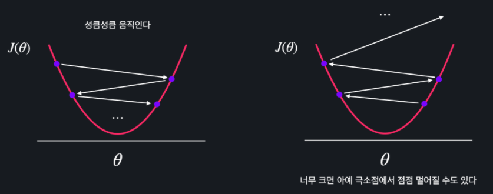

  - **학습률이 너무 작은 경우**

    반대로 알파가 작으면 어떨까요? ***θ***가 계속 엄청 찔끔찔끔 씩 움직일텐데요. 너무나도 작게 되면 최소 지점을 찾는 게 너무 오래 걸리겠죠? 1분 만에 할 수 있는 작업이 5 분 10 분, 또는 그거보다 더 오래 걸릴 수도 있게 되는 거죠.

    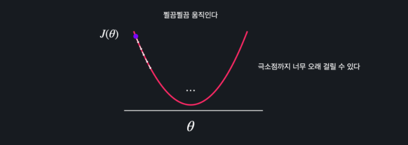

  - 적절한 학습률

    그렇기 때문에 알파를 적당한 크기로 정하는 게 중요한데요. 빠르고 정확하게 최소점까지 도달하는 학습률이 가장 좋다고 할 수 있죠.

    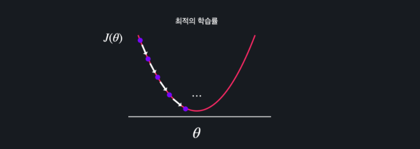

    가장 “적절한” 학습률은 상황과 문제에 따라 다릅니다. 경사 하강법 코드 시각화 레슨에서 경사 하강을 하면서 손실이 줄어들고 있는 걸 그래프로 표현했었는데요. 이런식으로 나왔었죠? 일부러 적절한 학습률을 골라서 이렇게 나왔던 거고요.

    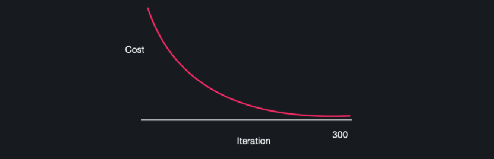

    학습률이 너무 크면 경사 하강법을 할수록 손실 그래프가 이렇게 계속 커질테고요.

    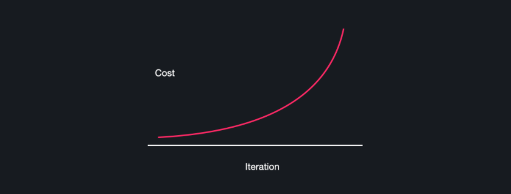

    작을 때는 이렇게 `iteration`수가 너무 많아집니다.

    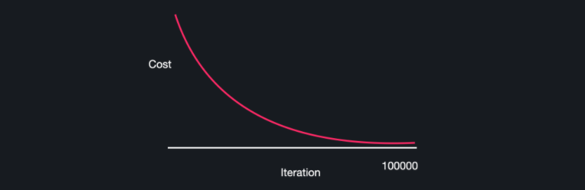

    일반적으로 1.0 ~ 0.0 사이의 숫자로 정하고(1,0.1, 0.01, 0001 또는 0.5, 0.05, 0.005 이런 식으로), 여러 개를 실험해보면서 경사 하강을 제일 적게 하면서 손실이 잘 줄어드는 학습률을 선택합니다.

  


- #### 모델 평가하기

  우리는 계속해서 세타 값을 조율하면서 더 좋은 가설함수를 만들려고 노력하고 있음. 그리고 결국에는 데이터에 가장 잘 맞는 최적선을 찾으려고 함. 이런 가설함수는 세상에 일어나는 일을 수학적으로 표현한다는 의미에서 **모델**이라고 부른다. 데이터를 이용해서 모델을 개선해가는 과정을 모델을 학습시킨다고 말해왔던 것. 

  학습시켜서 아래와 같은 선이 나왔다고 하자. 학습시킨 후에 이 모델이 얼마나 좋은지 평가를 해야 함. 이때 많이 쓰는게 **평균 제곱근 오차**임. 영어로는 **Root Mean Squred Error(RMSE)**임. 지난 번에 배웠던 평균제곱오차에 그냥 루트를 한 것. 루트는 왜 할까? 우리가 집 가격을 예측한다고 하면 목표변수의 단위는 원.  그런데 오차 제곱을 하면, 단위가 원 제곱이 됨. 와닿지 않는 단위. 그래서 마지막에 루트를 써서 단위를 다시 원으로 만들어 주는 것. 

  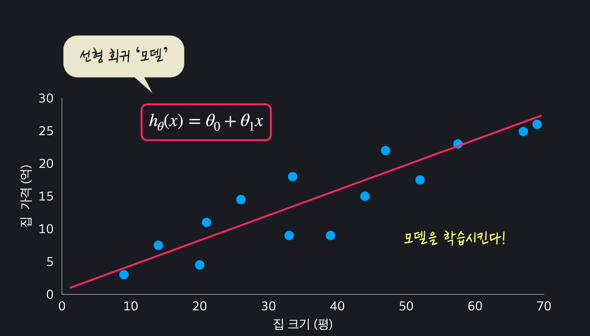

  그런데 여기서 문제가 뭐냐면, 우리는 이 데이터에 맞게 평균제곱오차로 학습을 시켰으니깐, 당연히 **이 모델이 평균제곱근 오차가 제일 낮을 수 밖에 없잖아**. 그렇다면 어떻게 해야 더 신빙성이 있을까?

  **보통은 모델을 학습시키기 위한 데이터와 모델을 평가하기 위한 데이터를 나눈다.** Training Set과 Test Set

  과정을 보자면, 

  	1. Training Set으로 모델을 학습시켜서 최적선을 구한다. 
  	2. 그 모델을 가지고 Test Set으로 놓고 테스트 한다. 평균제곱근 오차로 평가. 

  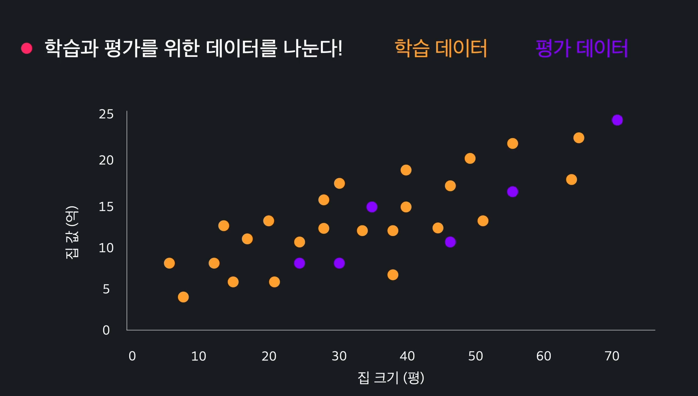


### Scikit Learn으로 구현하기 

- 구현 자체는 엄청 쉬움

  ```python
  from sklearn.datasets import load_boston
  from sklearn.model_selection import train_test_split
  from sklearn.linear_model import LinearRegression
  from sklearn.metrics import mean_squared_error
  
  import pandas as pd
  ```

  ```python
  # 데이터 불러오기
  boston_dataset = load_boston()
  print(boston_dataset.DESCR) # Describe
  boston_dataset.feature_names
  boston_dataset.data.shape # 506행 13열
  boston_dataset.target.shape
  ```

  ```python
  x = pd.DataFrame(boston_dataset.data, columns = boston_dataset.feature_names)
  x
  
  # 지금 변수 하나만 보고 있음.
  x = x[['AGE']]
  x
  
  y = pd.DataFrame(boston_dataset.target, columns=['MEDV'])
  y
  ```

  ```python
  # 모델 학습시키는 데이터, 평가 데이터 나누기
  # test_size = 0.2 20%만 테스트 데이터로 사용하겠다. 
  # random_state는 그 20%를 어떻게 고를지 말해주는 파라미터. Optional이라 안넘겨도 됨. 안넘겨주면 실행할때마다 20개씩 새로운 거 랜덤으로 골라주고, 
  # 어떤 정수값을 넣어주면, 계속 똑같은 값 고름. 아무 정수나 써도 됨. 
  
  x_train, x_test, y_train, y_test = train_test_split(x, y, test_size=0.2, random_state = 5)
  ```

  ```python
  model = LinearRegression()
  model.fit(x_train, y_train)
  print(model.coef_) # theta 1
  print(model.intercept_) # theta 0
  
  # f(x) = 31.04617413 - -0.12402883x 라는 뜻
  
  
  y_test_prediction = model.predict(x_test)
  y_test_prediction # 예측값들. 
  
  # 평균제곱근 오차로 평가
  mean_squared_error(y_test, y_test_prediction) ** 0.5
  # 오차가 8.23정도 나오는것 보니 대략 이 모델로 집값 예측하면 8천달러 정도의 오차가 있다는 뜻. 
  
  ```

  

