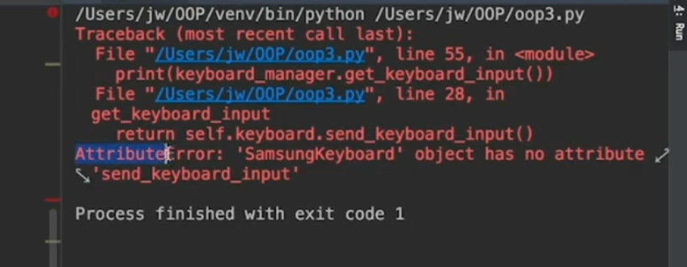
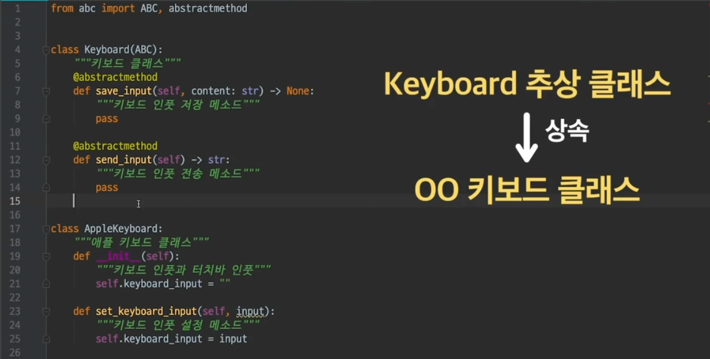

# Open-Closed Principle

- #### 개방 폐쇄 원칙

  **개방 폐쇄 원칙 : 클래스는 확장에 열려 있어야 하며, 수정에는 닫혀 있어야 한다.** 

  

  

  

  

  클래스의 기능을 수정하려면, 기존 코드를 수정해야 할 것 같은데 어떻게 이게 가능한거지?

  **애플 키보드 클래스가 있다고 해보자.** 

  ```python
  class AppleKeyboard:
      """애플 키보드 클래스"""
  
      def __init__(self):
          """키보드 인풋과 터치바 인풋"""
          self.keyboard_input = ""
  
      def set_keyboard_input(self, input):
          """키보드 인풋 저장 메소드"""
          self.keyboard_input = input
  
      def send_keyboard_input(self):
          """키보드 인풋 전송 메소드"""
          return self.keyboard_input
  
  
  class KeyboardManager:
      def __init__(self):
          """키보드 관리 클래스"""
          self.keyboard = None
  
      def connect_to_keyboard(self, keyboard):
          """키보드 교체 메소드"""
          self.keyboard = keyboard
  
      def get_keyboard_input(self):
          """유저가 키보드로 입력한 내용을 받아오는 메소드"""
          return self.keyboard.send_keyboard_input()
  
  ```

  `KeyboardManager`클래스는, `connect_to_keyboard`에서 위 `AppleKeyboard`처럼 `keybord 객체`를 받는 것. 

  ```python
  keyboard_manager = KeyboardManager()
  apple_keyboard = AppleKeyboard()
  keyboard_manager.connect_to_keyboard(apple_keyboard)
  apple_keyboard.set_keyboard_input("안녕하세요")
  print(keyboard_manager.get_keyboard_input())
  ```

  > 안녕하세요

  그런데 지금 이 keyboard_maanger클래스는 문제가 하나 있음. 개방폐쇄원칙을 어긴다는 것. 

  왜 그런 걸까? 

  키보드에는 애플 외에도 삼성 키보드도 있음. 삼성 키보드를 만들어 보자. 

  ```python
  class SamsungKeyboard:
      """삼성 키보드 클래스"""
      def __init__(self):
          """키보드 인풋과 터치바 인풋"""
          self.user_input = ""
  
      def save_user_input(self, input):
          """키보드 인풋 저장 메소드"""
          self.user_input = input
  
      def give_user_input(self):
          """키보드 인풋 전송 메소드"""
          return self.user_input
  ```

  그 다음 실행시켜봐. 

  ```python
  keyboard_manager = KeyboardManager()
  samsung_keyboard = SamsungKeyboard()
  keyboard_manager.connect_to_keyboard(samsung_keyboard)
  samsung_keyboard.save_user_input("안녕하세요")
  print(keyboard_manager.get_keyboard_input())
  ```

  

  삼성 키보드는 send_keyboard_input이라는 메소드가 없다고 나와있음. 

  당연하지, 애초에 키보드매니져의 `get_keyboard_input`은 키보드의 `send_keyboard_input`함수를 실행시키고 리턴하도록 설계되어 있기 때문. 이 키보드매니져를 통해서 삼성키보드의 인풋값을 가져오고 싶으면, `KeyboardManager`를 변경해야 함.  

  

  변경 하려면? 아래처럼 `get_keyboard_input`을 변경해야 함. 

  ```python
  class KeyboardManager:
      def __init__(self):
          """키보드 관리 클래스"""
          self.keyboard = None
  
      def connect_to_keyboard(self, keyboard):
          """키보드 교체 메소드"""
  
          self.keyboard = keyboard
  
      def get_keyboard_input(self):
          """유저가 키보드로 입력한 내용을 받아오는 메소드"""
          if isinstance(self.keyboard, AppleKeyboard):
              return self.keyboard.send_keyboard_input()
          elif isinstance(self.keyboard, SamsungKeyboard):
              return self.keyboard.give_user_input()
  ```

  근데 이렇게 새로운 키보드 등장할때마다, keyboard_maanger를 수정해야 되는 것은 **개방 폐쇄 원칙을 위반하는 것.** 

  


- #### 개방폐쇄원칙 적용

  개방폐쇄원칙을 적용해 보자. 

  일단, 추상메소드를 만든다. 

  ```python
  from abc import ABC, abstractmethod
  
  class Keyboard(ABC):
      """키보드 클래스"""
      @abstractmethod
      def save_input(self, content:str) -> None:
          """키보드 인풋 저장 메소드"""
          pass
      @abstractmethod
      def send_input(self) -> str:
          """키보드 인풋 전송 메소드"""
          pass
  ```

  이제 모든 회사의 키보드 클래스를 만들때는, 추상메소드 keyboard클래스를 상속 받으면 된다. 

  

  그 후에 `save_input`과 `send_input`을 오버라이딩 하면됨. 

  이제 같은 기능을 하면 같은 이름을 받게 됨. 

  ```python
  class AppleKeyboard(Keyboard):
      """애플 키보드 클래스"""
  
      def __init__(self):
          """키보드 인풋과 터치바 인풋"""
          self.keyboard_input = ""
  
      def save_input(self, input):
          """키보드 인풋 저장 메소드"""
          self.keyboard_input = input
  
      def send_input(self):
          """키보드 인풋 전송 메소드"""
          return self.keyboard_input
  
  
  class SamsungKeyboard(Keyboard):
      """삼성 키보드 클래스"""
      def __init__(self):
          """키보드 인풋과 터치바 인풋"""
          self.user_input = ""
  
      def save_input(self, input):
          """키보드 인풋 저장 메소드"""
          self.user_input = input
  
      def send_input(self):
          """키보드 인풋 전송 메소드"""
          return self.user_input
  ```

  키보드 매니져 클래스도 send_input쓰도록 바꿔주기만 하면 된다. 

  ```python
  class KeyboardManager:
      def __init__(self):
          """키보드 관리 클래스"""
          self.keyboard = None
  
      def connect_to_keyboard(self, keyboard):
          """키보드 교체 메소드"""
  
          self.keyboard = keyboard
  
      def get_keyboard_input(self):
          """유저가 키보드로 입력한 내용을 받아오는 메소드"""
          return self.keyboard.send_input()
  ```

  그 이후에 실제로 사용해 보면 문제없이 작동

  ```python
  
  keyboard_manager = KeyboardManager()
  
  apple_keyboard = AppleKeyboard()
  samsung_keyboard = SamsungKeyboard()
  
  keyboard_manager.connect_to_keyboard(apple_keyboard)
  apple_keyboard.save_input("안녕하세요")
  print(keyboard_manager.get_keyboard_input())
  
  keyboard_manager.connect_to_keyboard(samsung_keyboard)
  samsung_keyboard.save_input("안녕하세요")
  print(keyboard_manager.get_keyboard_input())
  ```

  키보드매니져 클래스는 확장에 열려있음. 추상클래스 키보드를 상속받는 키보드기만 하면, 언제든지 연결해서 사용이 가능함. 그리고, 수정에 닫혀있음. 

  

  게다가 심지어, keyboard_manager에 연결하는 키보드는 여러가지 키보드일 수 있음. 

  

  즉, 다형성을 갖는 것. 

  이런식으로 여러가지 키보드가 추상클래스 Keyboard를 상속받게만 만들어 줄 수 있으면, keyboard_manager classs는 개방 폐쇄 원칙을 지킬 수 있다. 

  isinstance를 사용하는 것 보다, 위처럼 개방 폐쇄 원칙을 사용하는 것이 훨씬 더 좋다. 

  

  키보드 매니져와 키보드들을 서로 다른 개발자들이 개발할 텐데, 개방폐쇄 원칙을 적용하면, 각자 다 추상클래스만 보고 짜면 됨. 서로 간의 약속이 있으니깐, 쉬운 것. 새로운 키보드가 생기더라도 쉬움. 

  

  이렇게 안하면 A개발자는 B가 모든 키보드 만들 때까지 기다려야함. 심지어 새로운 키보드 만들면 그걸 또 수정해 줘야함. 

  

  


- #### 개방 폐쇄 원칙 정리노트

  이번 챕터에서 배운 **개방 폐쇄 원칙**을 정리해보겠습니다. 개방 폐쇄 원칙의 뜻은 "클래스는 **확장**에 열려있어야 하며, **수정**에는 닫혀있어야 한다." 입니다.

  그러니까 기존 클래스의 코드를 수정하지 않고도 기능을 확장할 수 있어야 한다는 뜻입니다. 영상에서 우리는 어떻게 이걸 했었죠?  네, 바로 **추상 클래스**(abstract class)를 사용했었는데요.

  1. 개방-폐쇄 원칙을 적용했던 `KeyboardManager` 클래스는 내부에서 사용할 인스턴스를 `Keyboard`라는 추상 클래스의 (자식 클래스의) 인스턴스로 제한했습니다.
  2. 그리고 다양한 종류의 키보드 클래스는 `Keyboard` 추상 클래스를 상속받도록 했죠.

  이렇게 추상 클래스로 일종의 제약을 두면 `KeyboardManager` 클래스는

  1. 코드를 수정하지 않고도(수정에는 닫힘),
  2. 기능의 확장(확장에는 열림)이 가능하게 됩니다.

  그러니까 `KeyboardManager` 클래스에는 `Keyboard` 추상 클래스의 자식 클래스의 인스턴스만 들어갈 수 있다는 제한이 생겼고, 그럼 `KeyboardManager` 클래스는, 그 인스턴스가 `Keyboard` 추상 클래스의 메소드를 오버라이딩해서 갖고 있을 것이라고 **믿고 사용**할 수 있습니다.

  만약 이런 제한이 없다면 `KeyboardManager` 클래스에 키보드로 어떤 클래스의 인스턴스가 들어올지 모릅니다. 이렇게 되면 새로운 종류의 키보드가 생길 때마다 그것에 맞게 `KeyboardManager` 클래스를 수정해야 합니다. 왜냐하면 인스턴스가 어떤 클래스의 것인지를 매번 `isinstance` 함수로 체크해서 그 클래스가 갖고 있는 메소드를 호출해야 하기 때문입니다. 이건 그만큼 프로그램의 유지보수가 힘들어진다는 뜻입니다.

  왜 개방-폐쇄 원칙을 지켜야하는지 느낌이 오시죠?