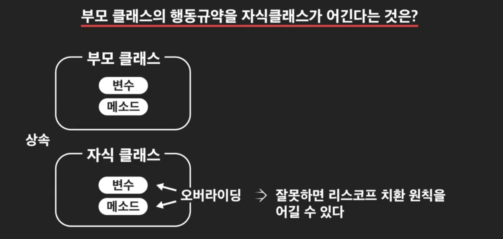

# Liskov Substitution Principle

- #### 리스포크 치환 원칙 이해하기

  

  이 원칙의 의미는, 

  **부모 클래스의 인스턴스를 사용하는 위치에, 자식 클래스의 인스턴스를 대신 사용했을 떄, 코드가 원래 의도대로 작동해야 한다는 것. **

  

  자식 클래스의 인스턴스는, 부모 클래스의 인스턴스 이기도 함. 

  

  이런 성질 떄문에, 부모 클래스의 인스턴스가 들어갈 자리에, 자식 클래스의 인스턴스를 넣을 수도 있음. 

  리스코프 치환원칙은, 자식 클래스의 인스턴스가 부모 클래스의 인스턴스가 행동하는 범위 내에서 행동해야 한다는 원칙. 

  **즉, 부모클래스의 행동규약을 자식클래스가 위반하지 말것.** 

  

  그런데, 부모클래스의 행동 규약을 자식클래스가 어긴다는 것이 무슨 말이지? 자식 클래스가 부모클래스의 변수와 메소드를 물려받기만 한다면, 부모 클래스의 행동규약을 어길 일이 없음. 

  

  그런데 오버라이딩 한다면 또 얘기가 달라짐. 

  

  이 오버라이딩을 할때, *잘못하면 리스코프 치환 원칙을 어길 수가 있음.*

  

  이렇게 오버라이딩 잘못하는 경우는 크게 2가지 경우가 있음. 

  

  이번에는 첫번째 경우 먼저 보자.

  ```python
  class Employee:
      """직원 클래스"""
      company_name = "코드잇 버거"
      raise_percentage = 1.03
  
      def __init__(self, name, wage):
          self.name = name
          self._wage = wage
  
      def raise_pay(self):
          """직원 시급을 인상하는 메소드"""
          self._wage *= self.raise_percentage
  
      @property
      def wage(self):
          return self._wage
  
      def __str__(self):
          """직원 정보를 문자열로 리턴하는 메소드"""
          return Employee.company_name + " 직원: " + self.name
  
  
  class Cashier(Employee):
      """리스코프 치환 원칙을 지키지 않는 계산대 직원 클래스"""
      burger_price = 4000
  
      def __init__(self, name, wage, number_sold=0):
          super().__init__(name, wage)
          self.number_sold = number_sold
  
      def raise_pay(self, raise_amount):
          """직원 시급을 인상하는 메소드"""
          self.wage += self.raise_amount
  
      @property
      def wage(self):
          return "시급 정보를 알려줄 수 없습니다"
  
  ```

  ```python
  employee_1 = Employee("손상혁", 7000)
  employee_2 = Employee("이미영", 9500)
  
  cashier_1 = Cashier("김대위", 9000)
  
  employee_list = []
  employee_list.append(employee_1)
  employee_list.append(employee_2)
  employee_list.append(cashier_1)
  
  for employee in employee_list:
      total_wage += employee.raise_pay()
  
      
  total_wage = 0
  for employee in employee_list:
      total_wage += employee.wage
  
  print(total_wage)
  ```

   이런 상황이 문제라는 거야. 

  ```python
  for employee in employee_list:
      total_wage += employee.raise_pay()
  ```

  여기서 에러 터짐.

  

  `    total_wage += employee.raise_pay()` 여기서 에러가 난거야. 이 부분은 지금 Employee Class의 함수를 쓸꺼라고 가정하고 쓴건데, cashier class는 함수의 파라미터 자체가 다름. 

  

  이 캐셔 클래스가 문제인거야. 오버라이딩 하면서 자기 멋대로, 파라미터를 추가했음. 

  이런게 바로 **리스코프 치환 원칙 위배**. 

  ```python
  for employee in employee_list:
      total_wage += employee.wage
  ```

  또 다른 에러도 남. 

  

  이거는 이유가 뭐냐면, cashier의 getter가 그냥 문자열만 리턴함 

  ```python
  @property
  def wage(self):
    return "시급 정보를 알려줄 수 없습니다"
  ```

  이제 말의 의미를 알것 같음. 

  **부모 클래스의 인스턴스(Employee) 사용하는 위치에, 자식 클래스의 인스턴스(Cashier)를 대신 사용했을 때, 코드가 원래 의도대로 작동해야 한다.** 이 말인 즉슨, 자식 클래스의 인스턴스는 부모 클래스의 행동규약을 어기면 안된다는 것. 

   

  

  


- #### 리스코프 치환 원칙을 지키는 코드

  이제 리스코프 치환 원칙에 맞게 `Cashier` 클래스를 수정해봅시다. 리스코프 치환 원칙을 지키는 것은 부모 클래스의 규칙을 지키기만 하면 되니까 그리 어렵지 않습니다.

  **직원(`Employee`) 클래스**

  ```python
  class Employee:
      """직원 클래스"""
      company_name = "코드잇 버거"
      raise_percentage = 1.03
      
      def __init__(self, name, wage):
          """인스턴스 변수 설정"""
          self.name = name
          self._wage = wage
  
      def raise_pay(self):
          """직원 시급을 인상하는 메소드"""
          self._wage *= self.raise_percentage
  
      @property
      def wage(self):
          """_wage 변수 getter 메소드"""
          return self._wage
  
      def __str__(self):
          """직원 정보를 문자열로 리턴하는 메소드"""
          return Employee.company_name + " 직원: " + self.name
  ```

  **계산대 직원(`Cashier`) 클래스**

  ```python
  class Cashier(Employee):
      """계산대 직원 클래스"""
      raise_percentage = 1.05
      burger_price = 4000
  
      def __init__(self, name, wage, number_sold=0):
          super().__init__(name, wage)
          self.number_sold = number_sold
  
      def take_order(self, money_received):
          """손님이 낸 돈을 받아 주문 처리를 하고 거스름돈을 리턴한다"""
          if Cashier.burger_price > money_received:
              print("돈이 충분하지 않습니다. 돈을 다시 계산해서 주세요!")
              return money_received
          else:
              self.number_sold += 1
              change = money_received - Cashier.burger_price
              return change
  
      def __str__(self):
          return Cashier.company_name + " 계산대 직원: " + self.name
  ```

  수정한 `Cashier` 클래스의 코드에는 `raise_pay` , `wage` 메소드가 없군요. 리스코프 치환 원칙을 지키려면 부모 클래스의 메소드를 그냥 물려받는 것이 가장 안전하고 빠른 해결책이겠죠? 만약 오버라이딩을 하고 싶다면 메소드의 **파라미터**와 **리턴값**의 **타입과 개수**를 맞춰서 오버라이딩하면 됩니다. `take_order` 메소드는 `Employee` 클래스에는 없고, `Cashier` 클래스에서 아예 새로 추가한 메소드이므로 자유롭게 정의해도 상관없습니다.

  이전 영상의 코드를 다시 실행해볼까요?

  **테스트**

  ```python
  # Employee 인스턴스들 생성
  employee_1 = Employee("성태호", 7000)
  employee_2 = Employee("강영훈", 6500)
  
  # Cashier 인스턴스 생성
  cashier = Cashier("김대위", 9000)
  
  # 생성한 모든 직원 인스턴스들을 리스트에 추가
  employee_list = []
  employee_list.append(employee_1)
  employee_list.append(employee_2)
  employee_list.append(cashier)
  
  # 모든 직원들의 시급 인상
  for employee in employee_list:
      employee.raise_pay()
  
  # 모든 직원들의 총 시급 구하기
  total_wage = 0
  
  for employee in employee_list:
      total_wage += employee.wage
  
  print(total_wage)
  ```

  **실행 결과**

  ```
  23355.0
  ```

  이제 에러없이 잘 실행됩니다. 리스코프 치환 원칙을 지키니까 문제없이 다형성을 적용할 수 있네요~!


- #### 행동 규약을 어기는 자식 클래스

  이번에는 리스코프 치환 원칙을 어기는 두번째 케이스를 보자. 

  

  이 경우는, 실제로 리턴값의 타입이나 갯수 등은 지켰지만, **메소드의 내용이 부모클래스의 의도와 너무 달라지는 경우.**

  코드를 실행해도 당장 에러는 안나서 더 문제가 되곤 함. 

  아래 코드를 봐보자. 정사각형은 직사각형의 한 종류 이기 때문에, 정사각형은 직사각형이다. 라는 말이 성립함. 

  ```python
  class Rectangle:
      """직사각형 클래스"""
  
      def __init__(self, width, height):
          """세로와 가로"""
          self.width = width
          self.height = height
  
      def area(self):
          """넓이 계산 메소드"""
          return self.width * self.height
  
      @property
      def width(self):
          """가로 변수 getter 메소드"""
          return self._width
  
      @width.setter
      def width(self, value):
          """가로 변수 setter 메소드"""
          self._width = value if value > 0 else 1
  
      @property
      def height(self):
          """세로 변수 getter 메소드"""
          return self._height
  
      @height.setter
      def height(self, value):
          """세로 변수 setter 메소드"""
          self._height = value if value > 0 else 1
  
  
  class Square(Rectangle):
      def __init__(self, side):
          super().__init__(side, side)
  
      @property
      def width(self):
          """가로 변수 getter 메소드"""
          return self._width
  
      @width.setter
      def width(self, value):
          """가로 변수 setter 메소드"""
          self._width = value if value > 0 else 1
          self._height = value if value > 0 else 1
  
      @property
      def height(self):
          """세로 변수 getter 메소드"""
          return self._height
  
      @height.setter
      def height(self, value):
          """세로 변수 setter 메소드"""
          self._width = value if value > 0 else 1
          self._height = value if value > 0 else 1
  ```

  Rectangle클래스의 width setter를 보면, 가로의 길이만 설정하고 있음. 그런데, 스퀘어 클래스의 width setter메소드는 가로와 세로를 둘다 설정하고 있음(정사각형은 두개가 같으니깐, 같이 설정해 버리는 거야). height도 마찬가지. 

  정사각형 특징에 맞게 잘 오버라이딩 한거 같긴 한데, 진짜 그런건지 한번 사용해 보자. 

  아래 코드를 실행해 보자. 

  ```python
  rectangle_1 = Rectangle(4, 6)
  rectangle_2 = Square(2)
  
  rectangle_1.width = 3
  rectangle_1.height = 7
  print(rectangle_1.area())
  
  rectangle_2.width = 3
  rectangle_2.height = 7
  print(rectangle_2.area())
  ```

  

  Square에서는 가로, 세로 다 마지막에 7로 설정된 거야. 

  `rectangle_2`는 square의 인스턴스 이면서, 동시에 rectangle의 인스턴스 이기도 함. 그러면 여기서 리스코프 치환 원칙을 지키려면, `rectangle_2`를 rectangle클래스의 인스턴스라고 생각해도 문제가 없어야 함. 

  부모 클래스의 인스턴스를 사용하는 위치에, 자식 클래스의 인스턴스를 대신 사용해도, 코드가 원래 의도대로 작동해야 함. 

  

  그럼 여기서는, square클래스가 리스코프 치환 원칙을 위반한 것. 

  > 정리하자면, 
  >
  > 정사각형은 직사각형이다. 그러면, 정사각형 클래스를 직사각형이라고 생각하고 코딩을 해도 결과는 21이 나오기를 기대했던 것. 

  그럼 스퀘어 클래스도 리스코프 치환 원칙 지키도록 하려면? 아래처럼 남겨야 함. 

  ```python
  class Square(Rectangle):
      def __init__(self, side):
          super().__init__(side, side)
  ```

  근데 이렇게만 하면, 지금 아래에서 가로와 세로를 각각 3, 7로 다르게 설정하니깐 이번에는 정사각형이 아니야. 

  오버라이딩을 하니깐, 리스코프 치환 원칙을 어기게 되고, 오버라이딩을 안하니깐 정사각형의 정의 자체를 벗어날 수도 있음. How?

  애초에 정사각형은 직사각형의 행동 규약을 지키기 어려운 객체. 아예 상속을 하면 안됨. 

  

  이전에 했던거 생각하면, **"A는 B다"**라는 관계가 생기면 상속 관계를 설정할 수 있다고 배웠었음. 그런데, 사실 거기다가 +로 A가 B의 행동규약을 지킬 수 있는가 까지 확인해야 함. 

  

  그러면, 상속을 아예 제거하고 코드를 다시 써보자. 

  ```python
  class Square():
      def __init__(self, side):
          self.side = side
  
      def area(self):
          return self.side*self.side
  
      @property
      def side(self):
          """가로 변수 getter 메소드"""
          return self._side
  
      @side.setter
      def side(self, value):
          """가로 변수 setter 메소드"""
          self._side = value if value > 0 else 1
  
  
  print(dir(Square))
  
  
  rectangle_1 = Rectangle(4, 6)
  square = Square(2)
  
  rectangle_1.width = 3
  rectangle_1.height = 7
  print(rectangle_1.area())
  #
  square.side = 10
  print(square.area())
  ```


- #### 리스코프 치환 원칙의 중요성

  리스코프 치환 원칙을 지키는 것은, 특히 개발자끼리 협력할 때 매우 중요하다. 

  개발자 A와 B가 음악재생프로그램을 만든다고 해보자. 

  

  각 장르별로, 플레이어를 만들고, 사용자가 실행하면 해당 장르의 play 함수를 호출하면 됨. 

  

  

  개발자 A와 B가 각각 아래 부분을 만들고 있음. 

  

  근데 코드 실행해보니 마지막에 -1이 등장함. 

  

  그 이유는 바로, RapPlayer클래스가 리스코프 치환 원칙을 위배했기 때문. 

  

  Play Method는 노래 가사를 문자열로 리턴해야 하는데, RapPlayer가 해당 부분을 엉뚱하게 -1을 리턴함. 

  

  

  


- #### 리스코프 치환 원칙 정리노트 

  이번 챕터에서 배운 **리스코프 치환 원칙**의 내용을 한번 정리해보겠습니다. 이 원칙의 정의는

  "부모 클래스의 인스턴스를 사용하는 위치에 자식 클래스의 인스턴스를 대신 사용했을 때 **코드가 원래 의도대로** 작동해야 한다" 입니다.

  이 정의에 있는 내용대로 자식 클래스의 인스턴스가 부모 클래스의 인스턴스 대신 사용되어도 문제가 없으려면 2가지 조건을 만족해야 합니다.

  첫번째는, **형식적인 측면**에서 자식 클래스가 오버라이딩하는 변수와 메소드가 부모 클래스에 있는 형식과 일치해야 합니다. 변수의 경우에는 그 타입, 메소드의 경우에는 파라미터와 리턴값의 타입 및 개수가 그 형식입니다. 이런 형식적인 측면을 지키지 않으면 프로그램 실행 시에 에러가 발생하게 됩니다.

  두번째는, **내용적인 측면**에서 자식 클래스가 부모 클래스의 메소드에 담긴 의도, 그러니까 부모 클래스의 행동 규약을 위반하지 않는 겁니다. 이전 영상들에서 본

  - **정사각형-직사각형 예시**
  - **음악 플레이어 예시**

  처럼 이 경우에는 프로그램을 실행해도 에러가 나지는 않습니다. 하지만 예상했던 결과와는 전혀 다른 결과를 프로그램이 내놓게 됩니다.

  에러는 안 나는데 프로그램의 동작이 우리의 예상을 벗어난다는 것은 좀 무서운 일인데요. 예시로 봤던 코드들은 모두 내용이 짧았어서 이런 문제를 쉽게 발견했을 수도 있습니다. 하지만 만약 코드의 양이 많고 여러 객체 간의 관계가 복잡한 프로그램에서 이런 문제가 발생한다면 보이지 않는 치명적인 모순이 프로그램에 오랫동안 숨어있을 수 있습니다. 이런 일이 발생하지 않도록 하려면 자식 클래스를 설계할 때 부모 클래스의 행동 규약을 벗어나지 않도록 유의해야겠죠?

  이전 영상에서 본 것처럼 리스코프 치환 원칙은 협업하는 개발자 사이의 **신뢰를 위한 원칙**이기도 합니다.

  - 부모 클래스의 코드, 다양한 자식 클래스의 인스턴스들을 가져다 쓰는 코드를 작성하는 개발자 A와,
  - 실제로 다양한 자식 클래스의 내용을 작성하는 개발자 B가 있다고 합시다.

  개발자 A는 개발자 B가 **리스코프 치환 원칙을 지키면서**(부모 클래스의 행동 규약을 위반하지 않으면서) 자식 클래스를 작성할 것이라고 믿고, 코드를 짤 텐데요. 개발자 B가 이 믿음을 깨버린다면 나중에 최종 완성된 프로그램을 실행할 때

  1. 에러가 나거나,
  2. 에러가 나지는 않더라도 프로그램이 원래 의도와는 달리 비정상적으로 실행되는 현상

  이 발생할 수 있겠죠? 그러니까 상속 관계를 적용할 때는 리스코프 치환 원칙을 늘 머릿속에 갖고 있어야 합니다.


- 