# OOP8_Interface-Segragation-Principle

- #### 인터페이스 분리 원칙

  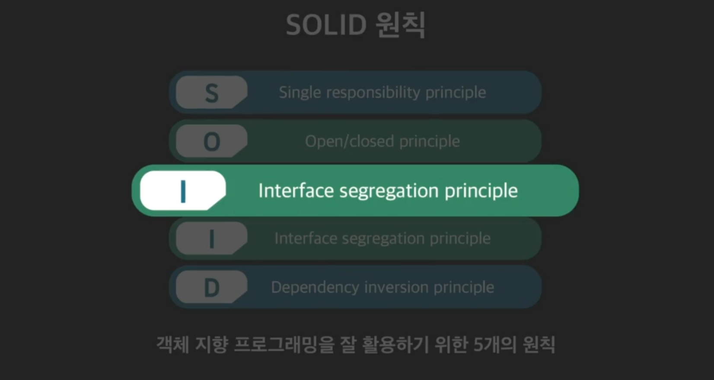

  인터페이스란?

  **추상 클래스 중에서, 추상 메소드만 있고, 일반 메소드는 없는 것이 인터페이스.**

  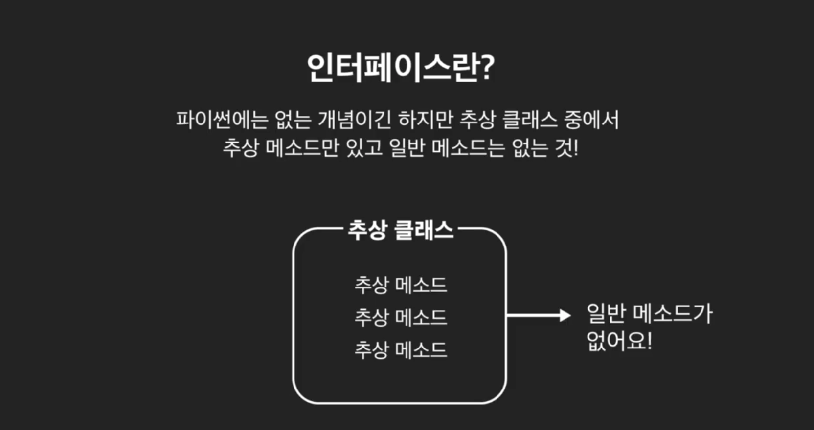 

  인터페이스 분리 원칙이란, 클래스가 사용하지 않을 메소드에 의존할 것을 강제하면 안된다는 것. 즉, 클래스가 나중에 사용하지도 않을 메소들르 가지도록 강제하지 말라는 뜻. 

  추상클래스를 상속받으면, 자식 클래스는 추상 메소드들을 반드시 오버라이딩 해야 한다. 

  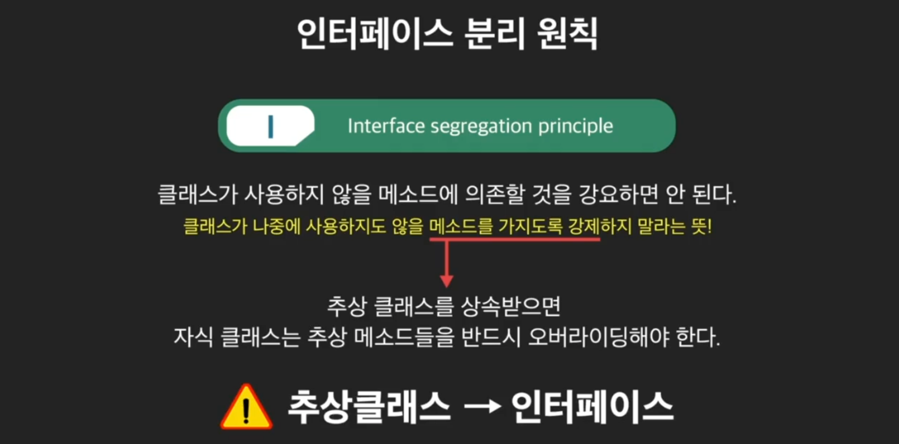

  이제부터는 추상 클래스를 인터페이스라고 부르겠다. 

  ```python
  from abc import ABC, abstractmethod
  
  
  class IMessage(ABC):
      @property
      @abstractmethod
      def content(self):
          """추상 getter 메소드"""
          pass
  
      @abstractmethod
      def edit_content(self, new_content: str) -> None:
          """작성한 메시지를 수정하는 메소드"""
          pass
  
      @abstractmethod
      def send(self, destination: str) -> bool:
          """작성한 메시지를 전송하는 메소드"""
          pass
  
  
  class Email(IMessage):
      def __init__(self, content, owner_email):
          """이메일은 그 내용과 보낸 사람의 이메일 주소를 인스턴스 변수로 가짐"""
          self._content = content
          self.owner_email = owner_email
  
      @property
      def content(self):
          """_content 변수 getter 메소드"""
          return self._content
  
      def edit_content(self, new_content):
          """이메일 내용 수정 메소드"""
          self._content = self.owner_email + "님의 메일\n" + new_content
  
      def send(self, destination):
          """이메일 전송 메소드"""
          print("{}에서 {}로 이메일 전송!\n내용: {}").format(self.owner_email, destination, self._content)
          return True
  
  
  class TextMessage(IMessage):
      def __init__(self, content):
          """문자 메시지는 그 내용을 인스턴스 변수로 가짐"""
          self._content = content
  
      @property
      def content(self):
          """_content 변수 getter 메소드"""
          return self._content
  
      def edit_content(self, new_content):
          """문자 메시지 내용 수정 메소드"""
          self._content = new_content
  
      def send(self, destination):
          """문자 메시지 전송 메소드"""
          print("{}로 문자 메시지 전송!\n내용: {}").format(destination, self._content)
  
  
  class TextReader:
      """인스턴스의 텍스트 내용을 읽어주는 클래스"""
  
      def __init__(self):
          self.texts = []
  
      def add_text(self, text: IMessage):
          """인스턴스 추가 메소드, 파라미터는 IMessage 인터페이스를 상속받을 것"""
          self.texts.append(text)
  
      def read_all_texts(self):
          """인스턴스 안에 있는 모든 텍스트 내용 출력"""
          for text in self.texts:
              print(text.content)
  
  
  ```

  ```python
  email = Email("안녕, 오랜만이다", "saanghyuk@gmail.com")
  text_message = TextMessage("내일 시간 가능? 한시 쯤 만나자")
  text_reader = TextReader()
  text_reader.add_text(email)
  text_reader.add_text(text_message)
  text_reader.read_all_texts()
  ```

  실행 해보면, 메세지는 잘 출력이 됨. 

  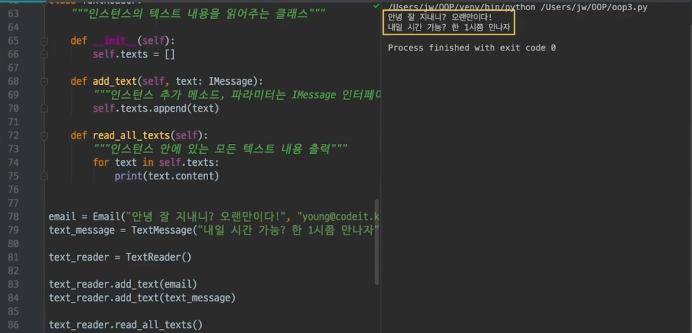

  그런데 여기서 어떤 사용자들이, 포스트잇에서 쓰는 메모를 나타내는 클래스가 필요하다고 했다고 해보자. 

  memo class를 만들어 보자. 

  ```python
  class Memo(IMessage):
      def __init__(self, content):
          """메모는 그 내용을 인스턴스 변수로 가짐"""
          self._content = content
  
      @property
      def content(self):
          """_content 변수 getter 메소드"""
          return self._content
  
      def edit_content(self, new_content):
          """문자 메시지 내용 수정 메소드"""
          self._content = new_content
  
     	def send(self, destination):
          """문자 메시지 전송 메소드"""
          print("메모는 아무데도 보낼 수 없습니다")
          return False
  
  ```

  근데 추상 클래스 상속하고 보니깐, 이상한게. 메모에 무슨 send가 있어?

  일단 send가 필요가 없어. 그런데, 나중에 TextReader에 추가될 수 있도록, imessage를 상속받은 상태. 그래서, send를 오버라이딩 할 수 밖에 없는 상태. 이런 상태가 바로, 사용하지도 않을 메소드를 상속받도록 강제받고 있는 상태. 

  ```python
  email = Email("안녕, 오랜만이다", "saanghyuk@gmail.com")
  text_message = TextMessage("내일 시간 가능? 한시 쯤 만나자")
  memo = Memo("내일 2시까지 숙제 끝낼 것!")
  
  text_reader = TextReader()
  text_reader.add_text(email)
  text_reader.add_text(text_message)
  text_reader.add_text(memo)
  
  text_reader.read_all_texts()
  ```

  실행을 해보면 문제는 없음. 

  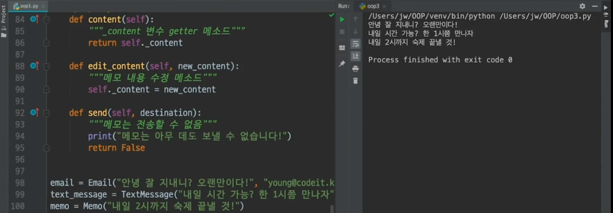

  이제 인터페이스 분리 원칙을 다시 봐보자. 

  클래스가 사용하지도 않을 메소드에 의존할 것을 강요하면 안된다. 즉, send를 사용하지도 않는데 갖도록 강요하면 안된다는 것. 

  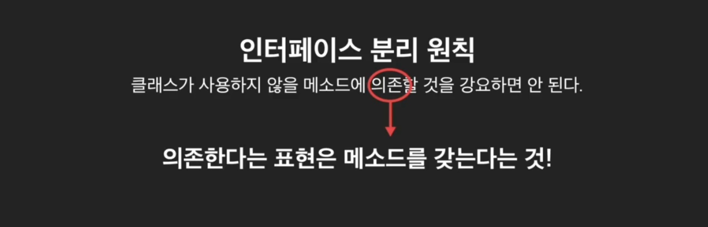

  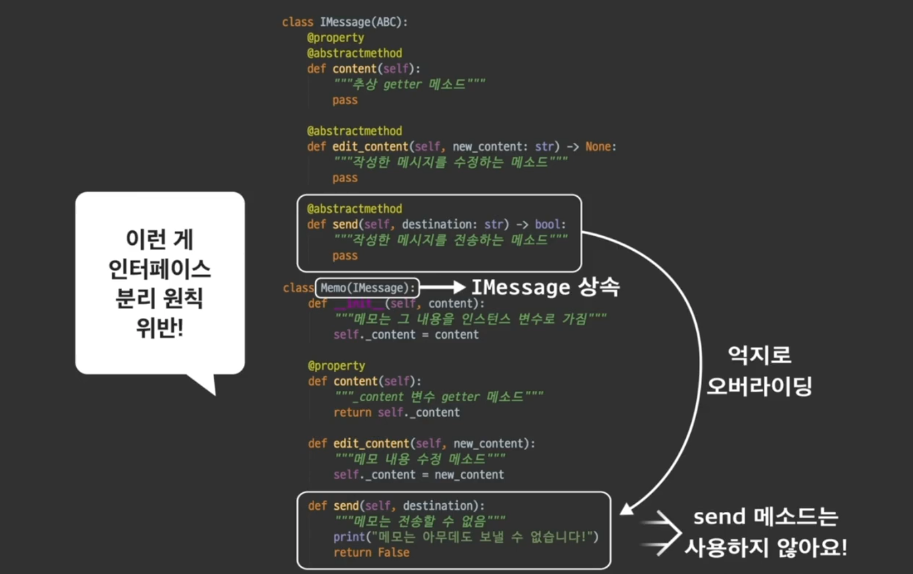

  해결책은 인터페이스를 분리하는 것. imessage를 더 작게 분리해 줘야 함. imessage처럼 너무 많은 메소드를 한번에 가지고 있는 인터페이스를 **뚱뚱한 인터페이스** 라고 말한다. 뚱뚱한 인터페이스가 있으면, 인터페이스 분리 원칙을 위반하기가 쉽다. 

  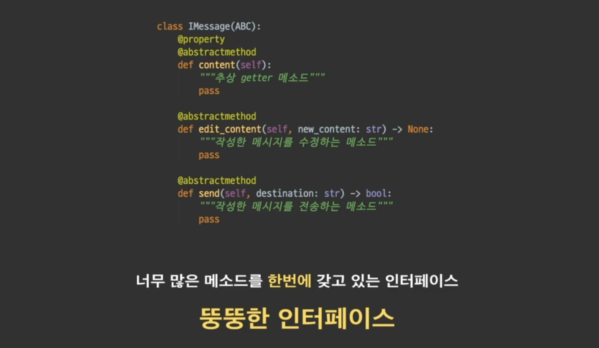


- #### 인터페이스 분리 원칙 적용

  **인터페이스 분리 원칙을 위반하지 않는 방법은, 인터페이스를 더 작은 인터페이스로 나누는 것.**

  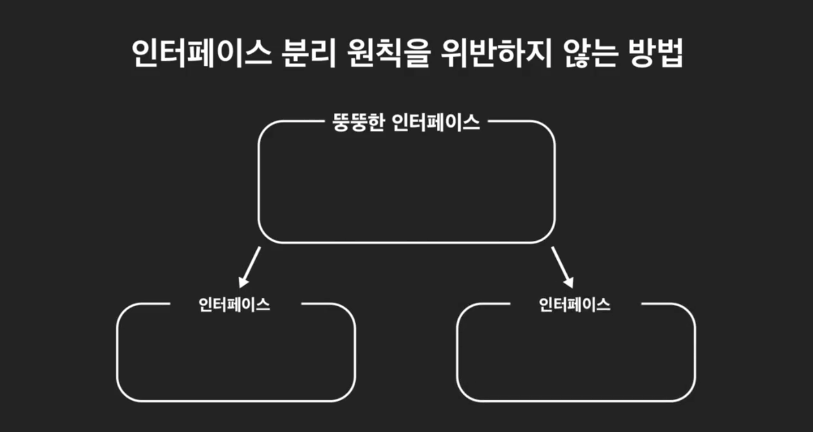

  이렇게 해서 나눈 작은 인터페이스를 role interface라고 부른다. 

  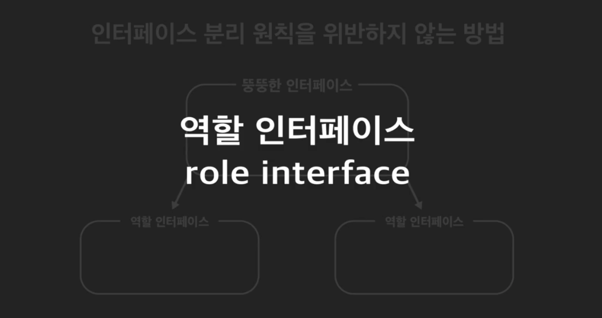

  기존 imessage 인터페이스를 2개의 인터페이스로 나눠보자. 

  ```python
  from abc import ABC, abstractmethod
  
  class IText(ABC):
      @property
      @abstractmethod
      def content(self):
          """추상 getter 메소드"""
          pass
  
      @abstractmethod
      def edit_content(self, new_content: str) -> None:
          """작성한 메시지를 수정하는 메소드"""
          pass
  
  class ISendable(ABC):
      @abstractmethod
      def send(self, destination: str) -> bool:
          """작성한 메시지를 전송하는 메소드"""
          pass
  ```

  이제 상속받던 애들을 수정하면 됨. 

  ```python
  class Email(IText, ISendable):
  class TextMessage(IText, ISendable):
  class Memo(Itext):
  ```

  나누니깐 이제 불필요하게, send를 오버라이딩 할 필요가 없어짐. 

  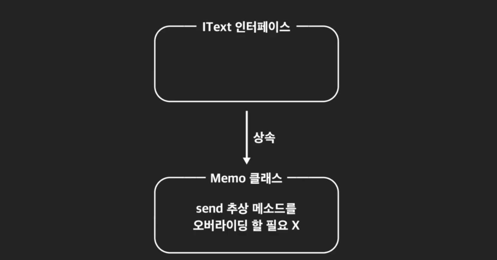

  **인터페이스를 만들 때는, 항상 더 작게 쪼갤수는 없는지 고민해 봐야 함.** 

  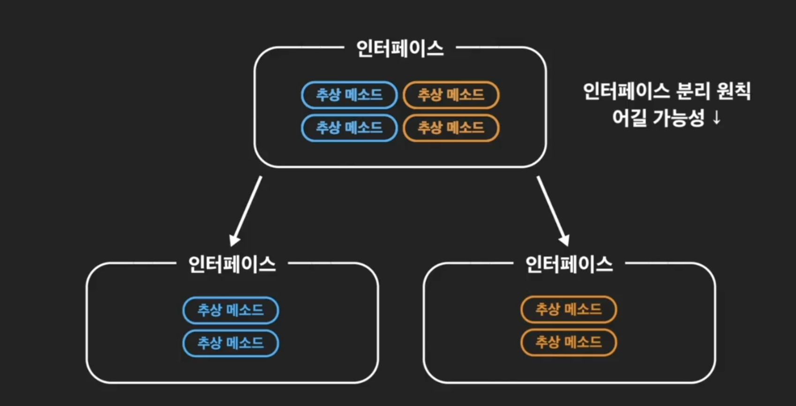

  그렇다고 모든 메소드 별로 다 쪼개면, 너무 복잡해짐. 서로 기능이나 역할을 고려해서 관련있는 애들끼리 묶으면 됨. 


- #### 인터페이스 분리 원칙 정리

  이번 시간에 배운 **인터페이스 분리 원칙**(Interface Segregation Principle)을 정리해보겠습니다.

  이 원칙은 지나치게 많은 추상 메소드를 가진 거대한 인터페이스 하나를, 관련된 추상 메소드들만 모여있도록 작은 크기의 인터페이스로 분리하라는 뜻입니다. 이렇게 해야 하는 이유는 지나치게 큰 인터페이스는 그걸 상속하는 클래스가 자신에게 필요하지도 않은 메소드를 **굳이 오버라이딩**하도록 만들기 때문입니다.

  인터페이스가 서로 관련성이 높은, 적절한 개수의 추상 메소드들을 포함하게 될 때 그걸 **역할 인터페이스**(role interface)라고 하는데요. 큰 인터페이스 하나가 있는 것보다는 작은 역할 인터페이스 여러 개가 있으면 각 클래스가 본인에 해당하는 인터페이스만 적절히 상속받게 됩니다. 그럼 각 클래스가 어떤 기능을 갖는지 더 세밀하게 파악할 수 있게 해준다는 장점도 있습니다.

  인터페이스를 분리할 때 어떤 기준으로 나눌지는 상황에 따라 당연히 다를 겁니다. 하지만 중요한 건 관련있는 기능끼리 한 인터페이스에 모으고 한 인터페이스가 지나치게 커지지 않도록 하겠다는 생각을 갖고 인터페이스를 설계하는 겁니다.


- **참고로 인터페이스를 다중 상속 받는 것은 괜찮음.**  