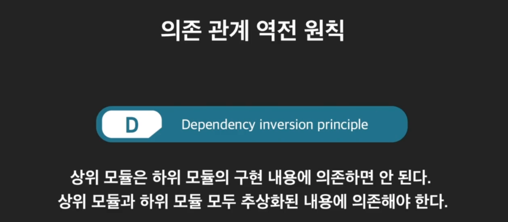
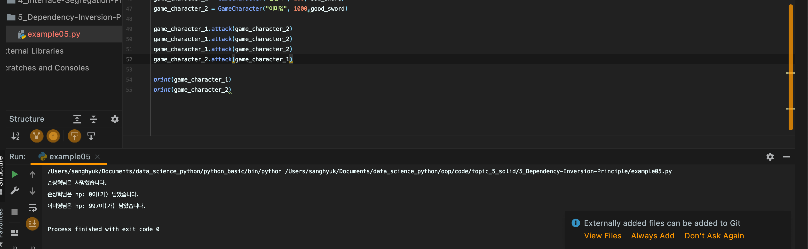
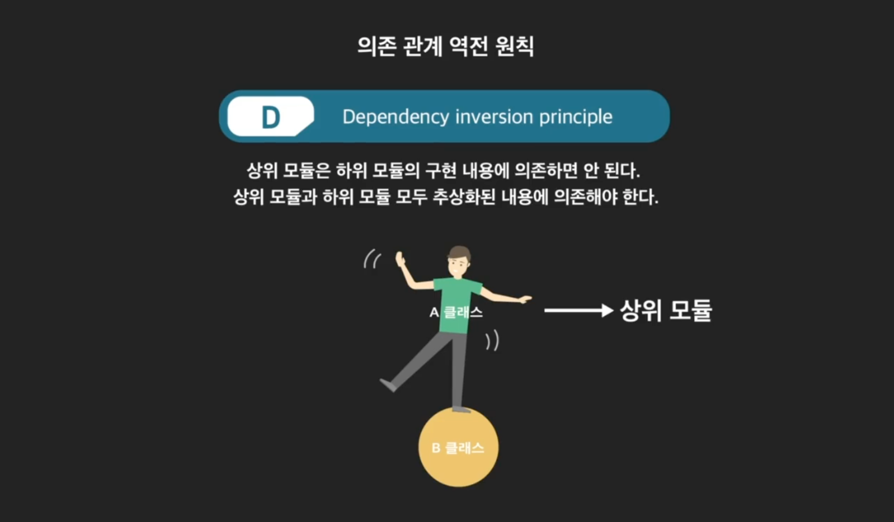
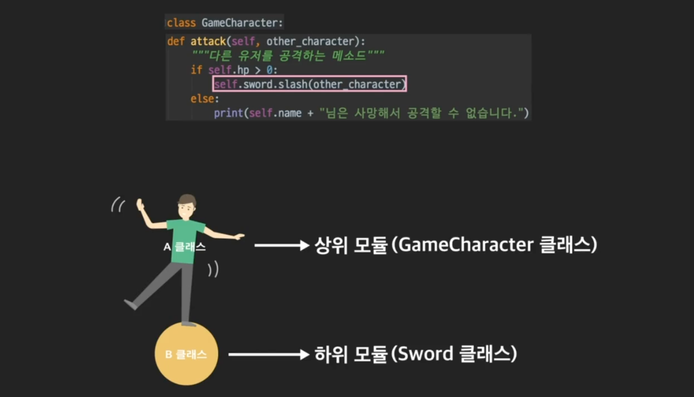
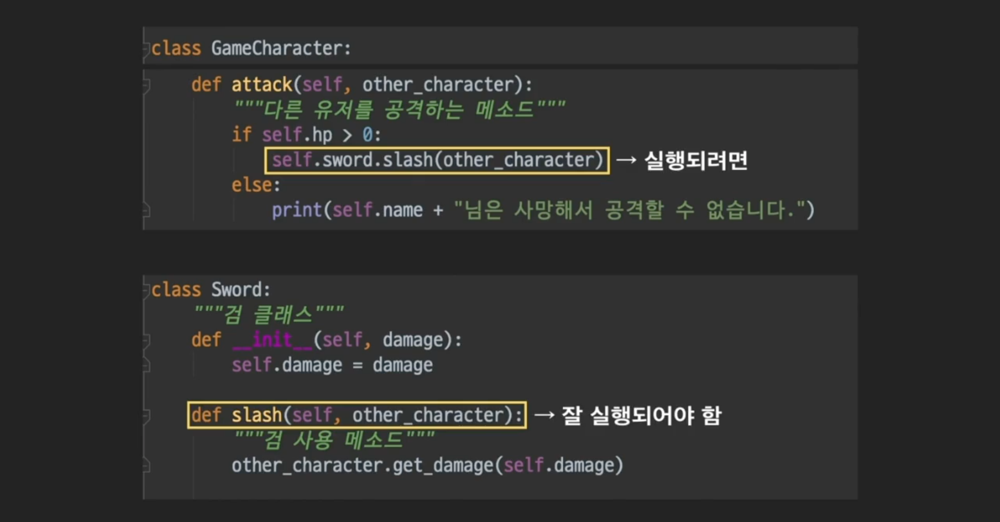
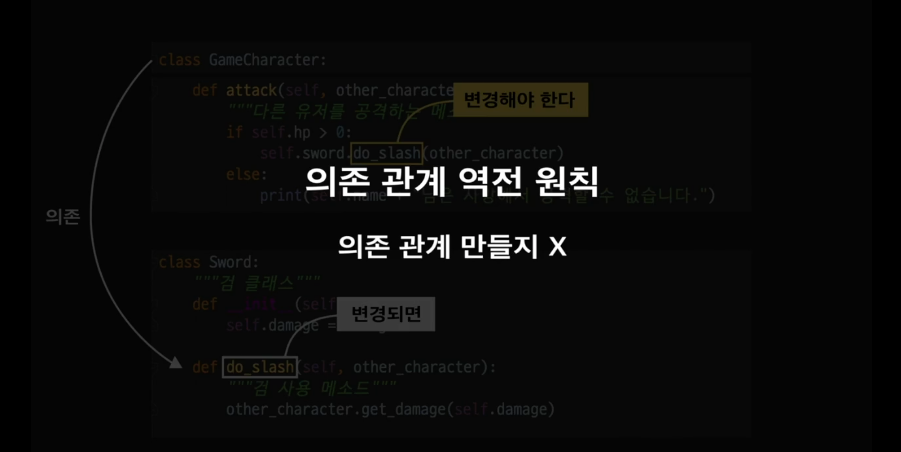
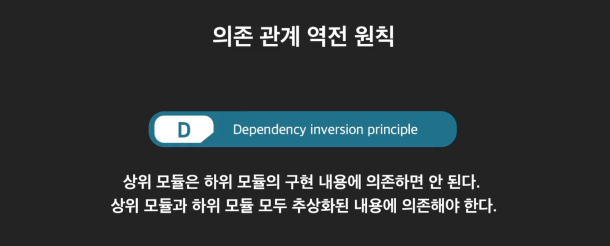

# OOP9_Dependency-Inversion-Principle

- #### 의존 관계 역전 원칙

  의존관계 역전 원칙이란, 상위 모듈은 하위 모듈의 구현 내용에 의존하면 안된다는 것. 상위 모듈과 하위 모듈 모두 추상화된 내용에 의존해야 한다는 것. 

  

  코드를 보면서 이해해보자. 

  ```python
  class Sword:
      """검 클래스"""
      def __init__(self, damage):
          self.damage = damage
  
      def slash(self, other_character):
          """검 사용 메소드"""
          other_character.get_damage(self.damage)
  
  
  class GameCharacter:
      """게임 캐릭터 클래스"""
      def __init__(self, name, hp, sword: Sword):
          self.name = name
          self.hp = hp
          self.sword = sword
  
      def attack(self, other_character):
          """다른 유저를 공격하는 메소드"""
          if self.hp > 0:
              self.sword.slash(other_character)
          else:
              print(self.name + "님은 사망해서 공격할 수 없습니다.")
  
      def change_sword(self, new_sword):
          """검을 바꾸는 메소드"""
          self.sword = new_sword
  
      def get_damage(self, damage):
          """캐릭터가 공격받았을 때 자신의 체력을 깎는 메소드"""
          if self.hp <= damage:
              self.hp = 0
              print(self.name + "님은 사망했습니다.")
          else:
              self.hp -= damage
  
      def __str__(self):
          """남은 체력을 문자열로 리턴하는 메소드"""
          return self.name + "님은 hp: {}이(가) 남았습니다.".format(self.hp)
  ```

  ```python
  bad_sword = Sword(1)
  good_sword = Sword(100)
  
  game_character_1 = GameCharacter("손상혁", 100, bad_sword)
  game_character_2 = GameCharacter("이미영", 1000,good_sword)
  
  game_character_1.attack(game_character_2)
  game_character_1.attack(game_character_2)
  game_character_1.attack(game_character_2)
  game_character_2.attack(game_character_1)
  
  print(game_character_1)
  print(game_character_2)
  ```

  

  **사실 이 코드는 의존관계 역전원칙을 위반했음.**

  사용 하는 클래스를 **상위모듈**, 사용 당하는 클래스를 **하위모듈**이라고 부른다.  

  

  attack method에서 sword클래스의 인스턴스를 사용하고 있음. 그러면, 현재 game_character클래스가 상위모듈, sword클래스가 하위모듈 인 것. 

  

  

  attack메소드가 잘 실행되려면, slash메소드가 잘 실행된다는 보장이 되어야 함. 

  

  즉 현재, attack 메소드가 slash에 의존하고 있는 것. slash 가 이름이라도 바뀌면, attack이 에러가 터질 것. 하위 모듈의 구현 내용이 바뀌면, 이에 의존하고 있는 상위 모듈의 코드도 수정해야 함. 이러면 유지보수가 점점 힘들어짐. 의존관계역전원칙은 이런 것을 만들지 말라는 것. 

  


- #### 의존관계 역전원칙 적용

  어떻게 해결할까? 정의를 다시 보자면, 상위모듈과 하위모듈 둘 다 **추상화에 의존하라고 했음.** 

  

  추상 클래스 하나 만들어 보자. 

  ```python
  from abc import ABC, abstractmethod
  
  class IWeapon(ABC):
      """무기클래스"""
      @abstractmethod
      def use_on(self, other_character):
          pass
  ```

  그리고, Sword가 이것을 상속하게 하고, gun도 하나 만들어 보자. 

  ```python
  class Sword(IWeapon):
      """검 클래스"""
      def __init__(self, damage):
          self.damage = damage
  
      def use_on(self, other_character):
          """검 사용 메소드"""
          other_character.get_damage(self.damage)
  
  class Gun(IWeapon):
      def __init__(self, damage, num_rounds):
          self.damage = damage
          self.num_rounds = num_rounds
  
      def use_on(self, other_characters):
          """총 사용 메소드"""
          if self.num_rounds>0:
              other_characters.get_damage(self.damage)
              self.num_rounds -= 1
          else:
              print("총알이 없어 공격할 수 없습니다.")
  ```

  이제 **game_character** class를 수정해 보자. 

  ```python
  class GameCharacter:
      """게임 캐릭터 클래스"""
      def __init__(self, name, hp, weapon: IWeapon):
          self.name = name
          self.hp = hp
          self.weapon = weapon
  
      def attack(self, other_character):
          """다른 유저를 공격하는 메소드"""
          if self.hp > 0:
              self.weapon.use_on(other_character)
          else:
              print(self.name + "님은 사망해서 공격할 수 없습니다.")
  
      def change_sword(self, new_weapon):
          """검을 바꾸는 메소드"""
          self.weapno = new_weapon
  
      def get_damage(self, damage):
          """캐릭터가 공격받았을 때 자신의 체력을 깎는 메소드"""
          if self.hp <= damage:
              self.hp = 0
              print(self.name + "님은 사망했습니다.")
          else:
              self.hp -= damage
  
      def __str__(self):
          """남은 체력을 문자열로 리턴하는 메소드"""
          return self.name + "님은 hp: {}이(가) 남았습니다.".format(self.hp)
  
  
  ```

  실행해보자. 

  ```python
  bad_sword = Sword(1)
  gun = Gun(100, 10)
  
  game_character_1 = GameCharacter("손상혁", 100, bad_sword)
  game_character_2 = GameCharacter("이미영", 1000, gun)
  
  game_character_1.attack(game_character_2)
  game_character_1.attack(game_character_2)
  game_character_1.attack(game_character_2)
  game_character_2.attack(game_character_1)
  
  print(game_character_1)
  print(game_character_2)
  ```

  

- #### 의존관계 역전 원칙 정리 

  ***정리하자면, 하위 모듈의 인스턴스를 직접 가져다가 쓰지 말라는 것.*** 

  SOLID 원칙 중 마지막 원칙인 **의존 관계 역전 원칙**(Dependency Inversion Principle)을 정리해보겠습니다.  의존 관계 역전 원칙의 정의는  "**상위 모듈**은 **하위 모듈**의 구현 내용에 의존하면 안 된다. 상위 모듈과 하위 모듈 모두 **추상화된 내용에 의존해야** 한다." 입니다.

  여기서 상위 모듈이란 다른 클래스를 사용하는 주된 클래스, 하위 모듈은 사용되는 클래스를 나타낸다고 생각하면 됩니다. 상위 모듈은 보통 프로그램의 메인 흐름에 좀더 가깝고 하위 모듈은 상대적으로 좀더 멀리 있습니다.

  의존 관계 역전 원칙은 **상위 모듈이 하위 모듈을 사용할 때 직접 인스턴스를 가져다가 쓰지 말라는 뜻입니다.** 왜냐하면 인스턴스를 바로 가져다가 쓴다는 말은 하위 모듈의 구체적인 내용에 상위 모듈이 의존하게 되어 하위 모듈에 변화가 있을 때마다 상위 모듈의 코드를 자주 바꿔줘야 하기 때문입니다. 이에 대한 해결책은  **추상 클래스**로 상위 모듈과 하위 모듈 사이에 **추상화 레이어**를 만드는 것입니다. 이렇게 되면

  1. **상위 모듈에는 추상 클래스의 자식 클래스의 인스턴스를 사용한다는 가정 하에 그 하위 모듈을 사용하는 코드를 작성해두면 되고,**
  2. **하위 모듈은 추상 클래스의 추상 메소드들을 구현(오버라이딩)만 하면 됩니다.**

  그럼 상위 모듈은 새로운 하위 모듈이 생겨도 기존 코드를 수정하지 않고 새 하위 모듈을 자유롭게 가져다 쓸 수 있습니다. 그만큼 코드를 유지보수하기 편해지는 것이죠. 어, 그런데 이 내용 뭔가 한번 봤던 것 같지 않나요? 바로 **개방-폐쇄 원칙**(Open-closed Principle)에서 배웠던 내용입니다.

  클래스의 기존 기능을 확장하면서 기존 코드를 수정하지 않아도 되는 상태, 기억나시죠? 사실, 이 의존 관계 역전 원칙은 개방-폐쇄 원칙을 지키는 하나의 방법입니다. 두 원칙 사이에 이런 관계가 있었다니 신기하죠? SOLID 원칙은 이렇게 각각이 별도의 것이 아니라 서로 긴밀한 관계를 갖고 있습니다.