# OOP_1

- #### 수강 가이드

  "객체 지향 프로그래밍" 수업은 크게 세 개의 토픽으로 이루어져 있습니다. 각 토픽은 몇 개의 챕터로 이루어져 있고, 각 챕터는 여러 개의 레슨(영상, 노트, 과제, 퀴즈)으로 구성되어 있습니다.

  "객체 지향 프로그래밍" 수업의 목차를 간단하게 살펴봅시다.

  **Unit 1: 객체 지향 프로그래밍이란?**

  > 객체 지향 프로그래밍을 위한 준비!

  객체 지향 프로그래밍이 무엇이고 왜 중요한지를 알아가는 시간입니다. 객체와 클래스의 개념을 이해하고 파이썬에서 클래스를 어떻게 정의하고 사용하는지 공부합니다.

  - Chapter 1: 객체 지향 프로그래밍 시작하기
  - Chapter 2: 객체를 만드는 법
  - Chapter 3: 미리 알고가야 할 것들
  - Chapter 4: 객체 만들기 연습
  - Chapter 5: 객체 지향 프로그래밍 직접 해보기

  **Unit 2: 객체 지향 프로그래밍의 4가지 기둥**

  > 객체 지향 프로그래밍을 하기 위한 필수 개념 익히기!

  객체 지향 프로그래밍을 하기 위해 꼭 알아야할 4가지 개념을 배우고 실습합니다.

  - Chapter 1: 추상화(Abstraction)
  - Chapter 2: 캡슐화(Encapsulation)
  - Chapter 3: 상속(Inheritance)
  - Chapter 4: 다형성(Polymorphism)

  **Unit 3: 견고한 객체 지향 프로그래밍: SOLID 원칙**

  > 유지보수하기 쉬운 코드를 만들자!

  이제 객체 지향 프로그래밍을 어떻게 하는지는 배웠습니다. 하지만 단순히 할 줄 아는 것만으로는 부족합니다. 객체 지향 프로그래밍을 할 때 어떻게 유지보수하기 쉬운 코드를 만들 수 있는지를 알아야 합니다. 이를 위한 대표적인 객체 설계의 원칙 5가지를 설명합니다.

  - Chapter 1: 단일 책임 원칙 (Single Responsibility Principle)

  - Chapter 2: 개방 폐쇄 원칙 (Open-closed Principle)

  - Chapter 3: 리스코프 치환 원칙 (Liskov Substitution Principle)

  - Chapter 4: 인터페이스 분리 원칙 (Interface Segregation Principle)

  - Chapter 5: 의존 관계 역전 원칙 (Dependency Inversion Principle)

    

- #### 객체란?

  객체란 속성과 행동으로 이루어져 있음. 우리가 살아가면서 보는 모든 존재랑 객체라고 생각하면 됨. 

  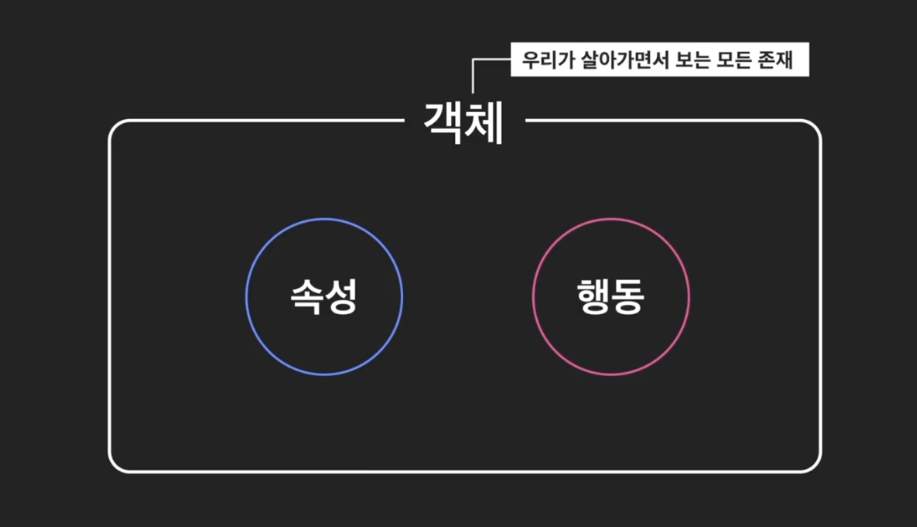

  자동차를 보더라도, 속성과 행동을 가지고 있음. 객체임. 

  

  

  또 다른 예시로는?

  

  **즉, 현실에 존재하든, 가상에 존재하든 속성과 행동을 떠올릴 수만 있다면, 그것은 객체라고 할 수 있음.**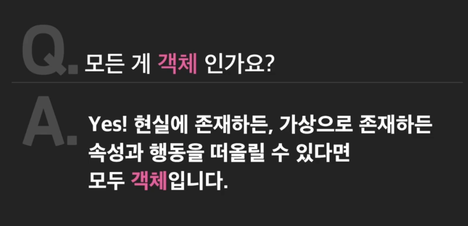

  


- #### 객체 지향 프로그래밍 이란?

  **객체지향 프로그래밍** 이란? 프로그램을 여러 개의 독립된 개체들과 그 객체들 간의 상호작용으로 파악하는 프로그래밍 접근법을 의미한다. 즉, 객체지향 프로그래밍은 **프로그램을 객체들과 객체들 간의 소통으로 바라보겠다는 것.**

  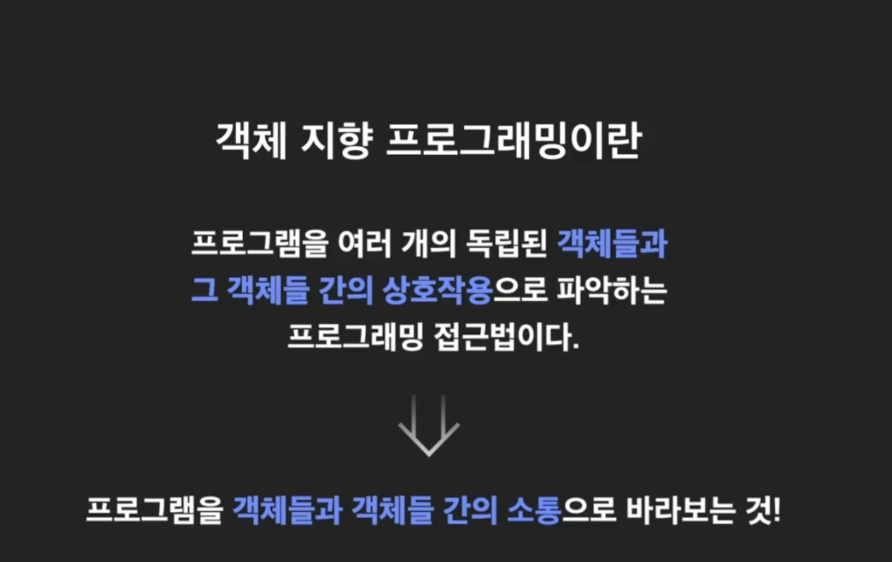 

  총게임을 만든다고 해보자. 

  

  

  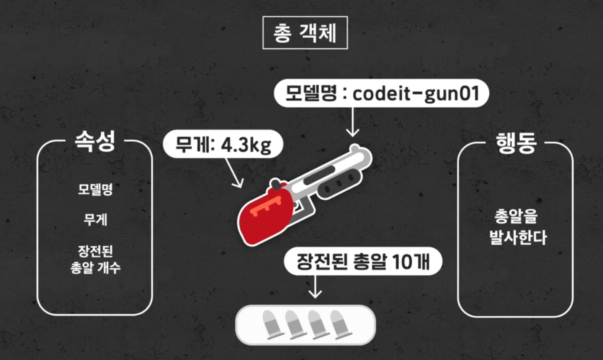

  

  **각 객체의 속성과 행동을 정리했다면, 이제 각 객체들이 서로 어떻게 소통할지를 정해야 한다.**

  1. 게임 캐릭터 객체가 총 객체에게 발사하라고 신호를 보낸다. 

  2. 총 객체는 장전된 총알 중 하나를 발사한다(그러면서 자신의 속성 중, 장전된 총알 갯수 -= 1).

  3. 총알 다른 캐릭터 객체에 닿으면 캐릭터 객체에게 신호를 보낸다. 

  4. 신호를 받은 총알맞은 캐릭터 객체는, 그 공격력만큼 해당 자신의 체력을 깎는다(이때 깎고 난 후의 체력이 0 이하라면 죽어야 한다, 만약 죽으면 목숨 수 -1을 해야 한다). 

  

  

  객체 지향 프로그램을 만든다는 것은. 

  1. **프로그램에 어떤 객체가 필요한지를 정한다.** 
  2. **객체들의 속성과 행동을 정한다.** 
  3. **객체들이 서로 어떻게 소통할지 정한다.** 

  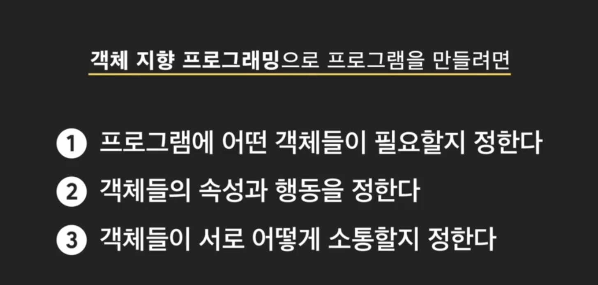


## 객체 만드는 법

- #### 클래스와 인스턴스

  인스타 그램 같은 SNS를 만들려고 한다. 이 중에 User객체를 만들려고 한다. 일단 User객체가 어떤 모습일지 상상을 해봐야지. 

  속성과 행동을 상상해보기. 

  

  이걸 정한 것은 모든 users가 가지고 있어야 하는 틀을 정한 것. 

  앞으로 user를 만들 때는 이 틀을 기반으로 만들게 되는 것.

  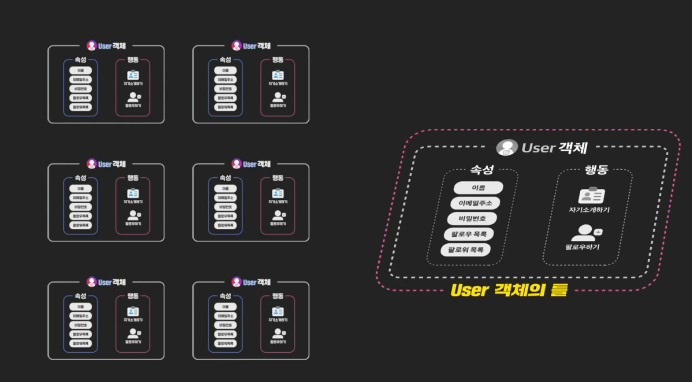

  

  **비유를 해보자면, 붕어빵 틀을 만든 것.**

  더 주문을 하면, 같은 틀로 계속 붕어을 만들어 줄 수 있음.  

  

  파이썬에선 이런 틀을 **클래스** 라고 하고, 이 틀을 가지고 만든 결과물을 **객체**라고 부른다. 

  클래스로 객체를 만든다. 혹은 클래스로 인스턴스를 만든다. 라고 말함. 

  **객체와 인스턴스는 일단은 같은 의미로 이해하자.** 

  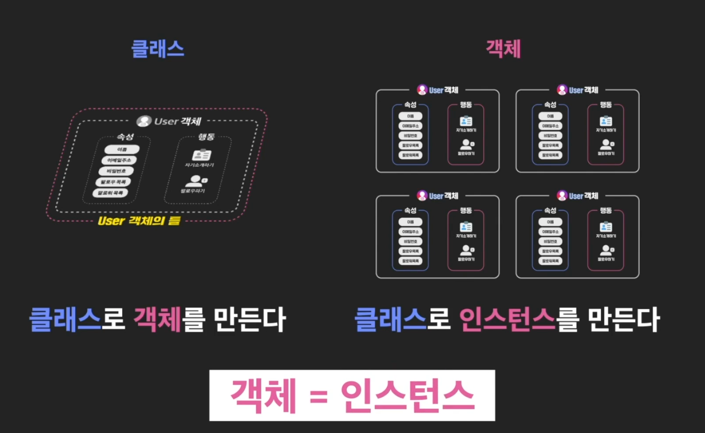

  파이썬 코드로 직접 클래스를 만들어 보자. 

  ```python
  class User:
      pass
  
  user1 = User()
  user2 = User()
  user3 = User()
  ```

  위의 3가지 user1, user2, user3는 모두 User인스턴스 이기는 하지만, 서로 다른 존재. 


- #### 인스턴스 변수

  인스턴스 변수 추가하는 방법은 굉장히 간단함. 

  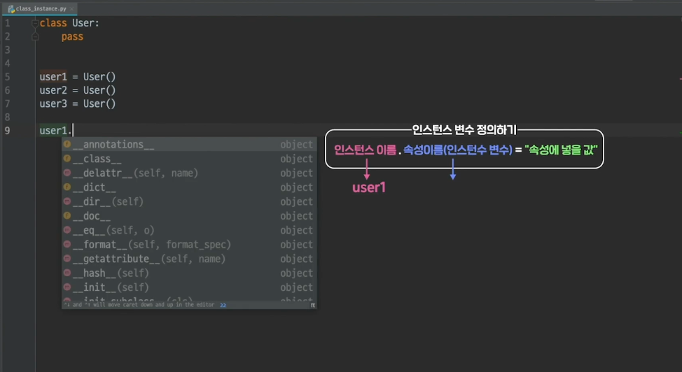

  인스턴스가 개별적으로 가지고 있는 변수를 **인스턴스 변수** 라고 말한다. 

  ```sql
  class User:
      pass
  
  user1 = User()
  user2 = User()
  user3 = User()
  
  user1.name = "김대위"
  print(user1.__dir__())
  user1.email = "captain@gmail.com"
  user1.password = "12345"
  
  user2.name = "손상혁"
  user2.email = "captain2@gmail.com"
  user2.password = "6493"
  
  user1.name = "이미영"
  user1.email = "myoung@gmail.com"
  user1.password = "115215"
  ```

  인스턴스 변수를 사용해 보자. 

  ```sql
  print(user1.email)
  print(user2.password)
  print(user3.name)
  ```


- #### 인스턴스 메소드

  앞에서 했던 속성이 변수였다면, 행동은 함수로 정의된다. 그 중에서 객체의 행동을 나타내는 함수를 특별히 **메소드** 라고 부른다. 

  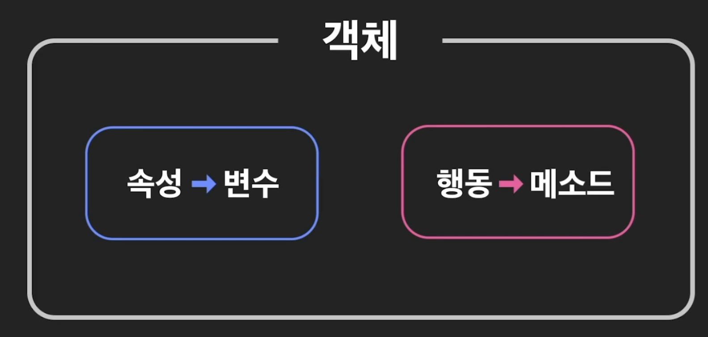

  메소드에는 크게 **3가지** 종류가 있다. 이번에는 그 중 인스턴스 메소드 먼저. 

  

  

  ```python
  class User:
      def say_hello(some_user):
          # 인사 메세지 출력 메소드
          print("안녕하세요 저는 {} 입니다.".format(some_user.name))
  ```

  some_user에는 user instance를 넣어주면 된다. 

  ```python
  #Instance Method
  User.say_hello(user1)
  User.say_hello(user2)
  User.say_hello(user3)
  ```

  ```python
  user1.say_hello() # 이렇게 출력도 가능하다. 	
  ```

- #### 인스턴스 메소드의 특별한 규칙

  인스턴스 메소드를 사용하는 방법은 2가지가 있음. 

  ```python
  User.say_hello(user1)
  ```

  ```python
  user1.say_hello()
  ```

  근데 생각해보면, 

  ```python
  class User:
      def say_hello(some_user):
          # 인사 메세지 출력 메소드
          print("안녕하세요 저는 {} 입니다.".format(some_user.name))
  
  ```

  파라미터를 넘겨준 적이 없는데 왜 되는거지?

  **이게 바로 인스턴스 메소드의 특별한 규칙**

  `User.say_hello(user1)` : 클래스의 메소드를 호출

  `user1.say_hello()` : 인스턴스의 메소드를 호출. **아래처럼 인스턴스의 메소드를 호출하면, user1인스턴스가 say_hello의 첫번째 파라미터로 자동으로 들어가게 되는 것.** 파라미터를 따로 써줄 필요가 없는 것.

  그럼 여기에 파라미터를 넣으면 어떻게 될까?

  ```sql
  user1.say_hello(user1)
  ```

  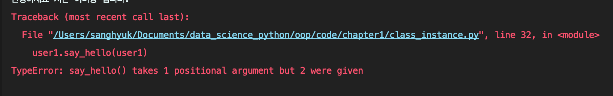

  즉, 내가 넣은 파라미터는 두번째 파라미터로 들어간 것. 그런데, 애초에 함수 정의 자체가 파라미터 하나만 받게 되있음. 그래서 에러가 나는 것. 

  즉, `User.say_hello(user1, user1)` 이렇게 쓴거랑 같은 것. 

  *인스턴스 메소드 하나 추가해 보자.*

  ```python
  class User:
      def say_hello(some_user):
          # 인사 메세지 출력 메소드
          print("안녕하세요 저는 {} 입니다.".format(some_user.name))
  
      def login(some_user, my_email, my_password):
          # 로그인 메소드
          if (some_user.email == my_email and some_user.password == my_password):
              print("로그인 성공, 환영합니다. ")
          else:
              print("로그인 실패, 없는 아이디 이거나 잘못된 비밀번호입니다.")
  
  ```

   아래가 중요함. 

  인스턴스 메소드에서는 user1.login()으로 쓰는 경우에 맨 앞에 객체를 넣으면 안됨. 그럼 총 4개의 파라미터를 넣은 형태가되버림. 

  ```python
  user1.login(user1, "captain@gmail.com", "12345") # 총 4개의 파라미터를 보낸 것. *ERROR*
  user1.login("captain@gmail.com", "12345")
  ```

  


- #### self를 사용합시다

  클래스 내부에서 인스턴스 메소드를 정의할 때는, 첫번째 파라미터로 항상 받을 객체를 넣어줘야 함. 위에서는 `some_user`라고 했던 것. 

  중요한 규칙이 있음. 파이썬에서는 인스턴스 메서드의 첫번째 파라미터를 **self**로 쓸 것을 권장함. 

  위처럼 self 대신 다른 파라미터를 써도 아무 문제가 없음. 그러나, 자기 자신을 지칭하는 self를 쓰기로 약속하자. 

  ```sql
  class User:
      def say_hello(self):
          # 인사 메세지 출력 메소드
          print("안녕하세요 저는 {} 입니다.".format(self.name))
  
      def login(self, my_email, my_password):
          # 로그인 메소드
          if (self.email == my_email and self.password == my_password):
              print("로그인 성공, 환영합니다. ")
          else:
              print("로그인 실패, 없는 아이디 이거나 잘못된 비밀번호입니다.")
  
  ```

  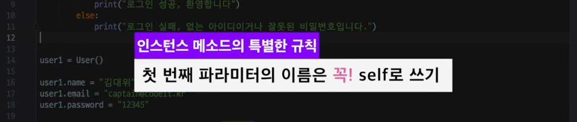


- #### 인스턴스 변수와 같은 이름을 갖는 파라미터

  *check_name 메소드 추가*

  ```sql
  class User:
      def say_hello(self):
          # 인사 메세지 출력 메소드
          print("안녕하세요 저는 {} 입니다.".format(self.name))
  
      def check_name(self, name):
          # 파라미터로 받는 Name이 유저의 이름과 같은지 불린으로 리턴해 주는 메소드
          return self.name == name
  ```

  이 코드에서 보면, 

  `self.name == name` 둘다 이름이 Name이야. 코드는 아무 문제가 없어. 인스턴스가 가진 값의 이름과 함수 내부에서 사용하는 파라미터 이름일 뿐. **심지어 이렇게 하는게 꽤나 일반적이기도 함.** 

  ```python
  print(user1.check_name("김대위"))
  
  ## TRUE로 리턴
  ```

  ```python
  print(user1.check_name("손상혁"))
  
  ## FALSE 리턴
  ```


- #### __init__ 메소드

  새 인스턴스를 만들 때 마다, 코드 두 줄만 쓰면 됨. 과제에서는 `initialize`메소드를 따로 정의했음. 

  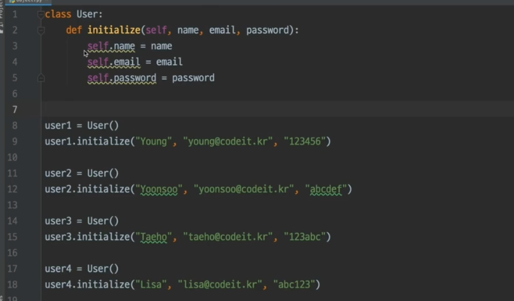

  나쁘지 않긴 한데, 아예 한줄로 줄이는 방법도 있음. 

  **init으로 바꿔 주면 됨**

  이렇게 앞뒤로 언더바가 두개씩 있는 메소드를 **Magic Method** 혹은 **Special Method**라고 부른다. 

  한국어로는 **특수메소드**라고 말함. 특수메소드란 "**특정 상황에서 자동으로 호출되는 메소드를 의미함**"

  이 이닛메소드 또한 **매직메소드**임. 

  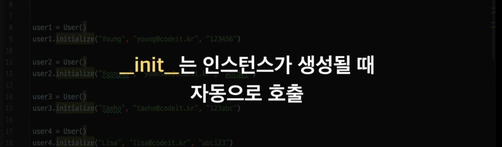

  지금까지는 인스턴스가 생성될 때, 

  `User = User()` 

  괄호 안이 비어있었음. 

  ```python
  class User:
      # initialize 메소드를 여기 쓰세요
      def __init__(self, name, email, password):
          self.name = name
          self.email = email
          self.password = password
  
  
  user1 = User("Young", "young@codeit.kr", "123456")
  user2 = User("Yoonsoo", "yoonsoo@codeit.kr", "abcdef")
  user3 = User("Taeho", "taeho@codeit.kr", "123abc")
  user4 = User("Lisa", "lisa@codeit.kr", "abc123")
  ```

  왜 될까?

  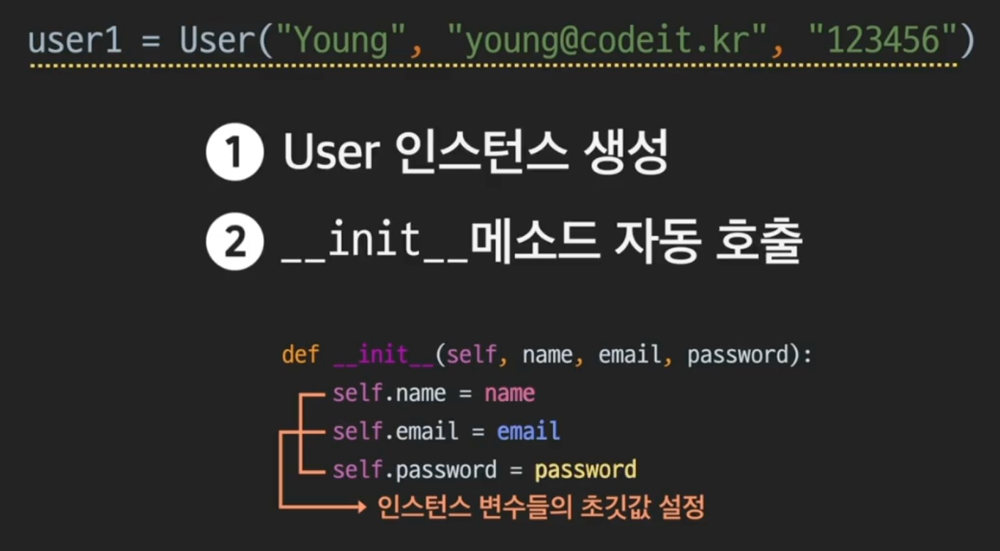

  

- #### Str 메소드

  ```python
  class User:
      # initialize 메소드를 여기 쓰세요
      def __init__(self, name, email, password):
          self.name = name
          self.email = email
          self.password = password
  
  
  user1 = User("Young", "young@codeit.kr", "123456")
  user2 = User("Yoonsoo", "yoonsoo@codeit.kr", "abcdef")
  user3 = User("Taeho", "taeho@codeit.kr", "123abc")
  user4 = User("Lisa", "lisa@codeit.kr", "abc123")
  
  print(user1)
  print(user2)
  print(user3)
  ```

  현재는 객체 자체를 프린트 하면, **객체 위치 정보만 출력됨.** 

  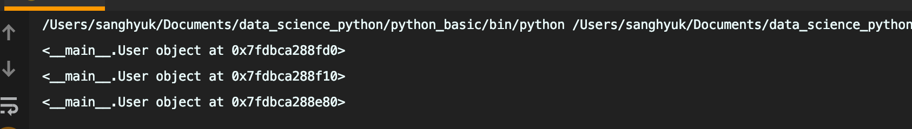

  어떤 클래스 인지와 메모리 주소가 출력된 것. 근데 이런식으로 나오면 큰 의미가 없지. 

  ```python
  class User:
      # initialize 메소드를 여기 쓰세요
      def __init__(self, name, email, password):
          self.name = name
          self.email = email
          self.password = password
  
      def __str__(self):
          return "사용자 : {}, 이메일 : {}, 비밀번호 : ******".format(self.name, self.email)
  
  ```

  str도 **magic mathod**. 특수 메소드는 양쪽에 under score가 두개씩 있으니깐, **dou**ble un**der**score. **dunder** 메소드라고 부른다. *str이면 던더str 이라고 부른다.* 

  특수 메소드는 특정 상황에서 자동으로 실행되는 메소드라고 했음. dunder str메소드는 프린트함수로 호출할 때 자동으로 불러짐. 

  


- #### Class 변수

  지금까지는 인스턴스 자신의 속성을 나타내는 인스턴스 변수를 배웠음. 그런데, 여러 인스턴스들이 공유하는 속성이 있을 수 있음. 예를 들어, user class로 만들어진 인스턴스의 총 갯수를 나타내는 속성을 만들고 싶다면?

  이 속성은 인스턴스가 가지고 있는 값들이 아니고, 다같이 공유하는 값들. 어떤 유저 인스턴스여도 똑같은 값들을 가지고 있어야 한다. 

  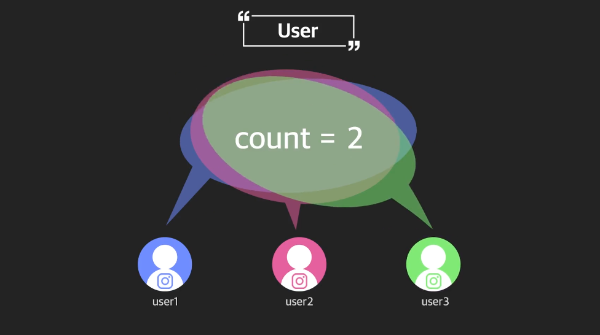

  매우 간단함

  ```python
  class User:
      count = 0
      
      def __init__(self, name, email, password):
          self.name = name
          self.email = email
          self.password = password
  ```

  쓰는 것은 더 간단함. 

  ```python
  User.count = 1
  print(User.count)
  ```

  **만약 클래스 변수 count가 유저 인스턴스 갯수를 정확히 나타내도록 하려면?**

  ```python
  class User:
      count = 0
  
      def __init__(self, name, email, password):
          self.name = name
          self.email = email
          self.password = password
          User.count += 1
  
  user1 = User("Young", "young@codeit.kr", "123456")
  user2 = User("Yoonsoo", "yoonsoo@codeit.kr", "abcdef")
  user3 = User("Taeho", "taeho@codeit.kr", "123abc")
  user4 = User("Lisa", "lisa@codeit.kr", "abc123")
  
  print(User.count)
  ```

  그런데 클래스 변수에 접근할 때, 인스턴스 변수로도 접근이 가능함. 

  ```python
  print(User.count)
  print(user1.count)
  print(user2.count)
  print(user3.count)
  ```

  그런데 설정도 이렇게 할 수 있을까?

  **여기서 엄청 신기한 부분이 있음.**

  ```python
  user1.count = 5
  
  print(User.count)
  print(user1.count)
  print(user2.count)
  print(user3.count)
  ```

  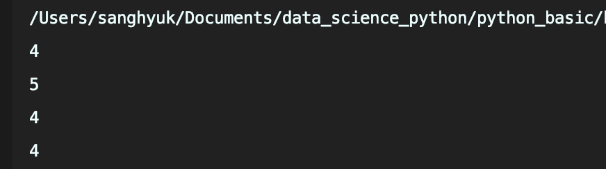

  user1.count만 5로 출력이 되고, 나머지는 그대로 됨. 

  왜 그런지 알지?

  일단, user2.count를 쓸 때는, user2 객체 메모리를 먼저 찾아보고 없으니깐, 클래스 변수를 찾으러 간거야. 그런데 user1같은 경우는 `user1.count`를 써서, user1 메모리 내부에 count가 있으니깐 그걸 먼저 찾아봤고 있으니깐 출력을 한거지. 

  같은 이름의 클래스 변수와, 같은 이름의 인스턴스 변수가 있으면 **인스턴스 변수가 읽어짐**. 

  애초에 이런 상황을 방지하는게 좋지. 클래스 변수에 값을 설정할때는 꼭 클래스 이름으로만 쓰자. 

  클래스 변수 count를 고치고 싶으면 아래처럼 고쳐야지. 

  ```python
  User.count = 5
  
  print(User.count)
  print(user1.count)
  print(user2.count)
  print(user3.count)
  ```

  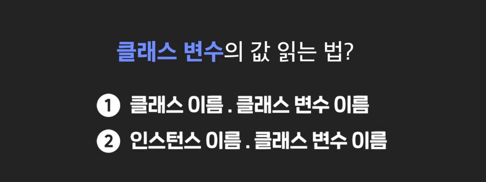

  

  


- #### 데코레이터

  데코레이터란 뭘까?

  

  ```python
  
  def print_hello():
      print("hello")
  
  def add_print_to(original):
      def wrapper():
          print("함수 시작")
          original()
          print("함수 끝")
      return wrapper
  ```

  **`add_prin_to` 는 파라미터로 어떤 함수를 받아서, 또 다른 함수를 리턴하는**

   ```python
   add_print_to(print_hello)
   ```

  앞 뒤로 다른 부가기능을 추가한 것. 

  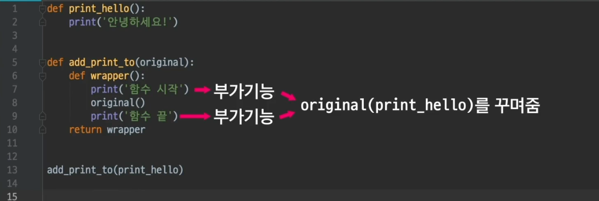

  add_print_to는 정의내렸던 wrapper함수를 **return**만 해줌. 실행시켜 주는 것이 아님. 

  ```python
  add_print_to(print_hello)()
  ```

  ```python
  
  def print_hello():
      print("hello")
  
  def add_print_to(original):
      def wrapper():
          print("함수 시작")
          original()
          print("함수 끝")
      return wrapper
  
  print_hello = add_print_to(print_hello)
  print_hello()
  ```

  정리 하자면, add_print_to함수가 하는 일은 파라미터로 어떤 함수를 받아서 데코레이팅 한 다음 넘겨주는 것. 그리고 그 함수를 리턴시켜 주는 것이 역할이였음. 

  그래서 이 함수는 **add_print_to** 함수는 다른 함수를 꾸며주는 함수이기 때문에, 이를 데코레이터 함수라고 부른다. 

- #### 데코레이터 2

  사실 `print_hello = add_print_to(print_hello)` 이 줄을 쓰지 않고도, print_hello함수를 꾸미는 방법이 있음. 

  ```python
  # 데코레이터 쉽게 활용하는 방법
  def add_print_to(original):
      def wrapper():
          print("함수 시작")
          original()
          print("함수 끝")
      return wrapper
  
  @add_print_to
  def print_hello():
      print("hello")
  
  
  print_hello = add_print_to(print_hello)
  print_hello()
  ```

  ***@ add_print_to* 를 *print_hello*위에 쓴다는 것은. print_hello함수를 add_print_to로 꾸며주라는 의미**

  즉, decorator의 의미는, `print_hello = add_print_to(print_hello` 이거야. 

  add_print_to의 인자로, 아래의 함수를 넣고, 그 리턴된 함수를 다시 원래 함수에 할당하는 것. 

  그래서 그 아래서 

  ```python
  print_hello()
  ```

  그냥 이렇게 함수 실행만 시켜도 알아서, 이렇게 나옴. 

  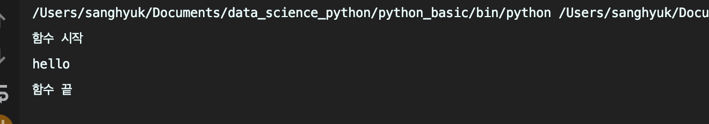

  데코레이터는 어떤 쓸모가 있을까?

  비슷한 함수에 일일이 같은 기능을 추가하려는 경우가 많음. 

  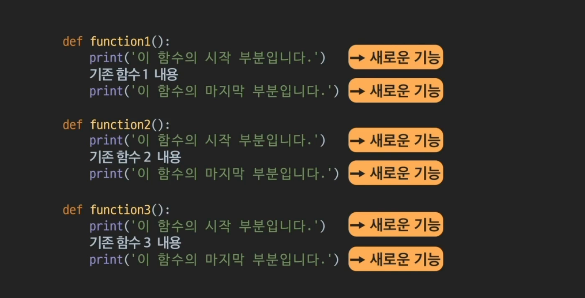

  이럴때 중복되는 부분을 모두 데코레이터에 넣고, 위에 @만 붙여주면 됨. 

  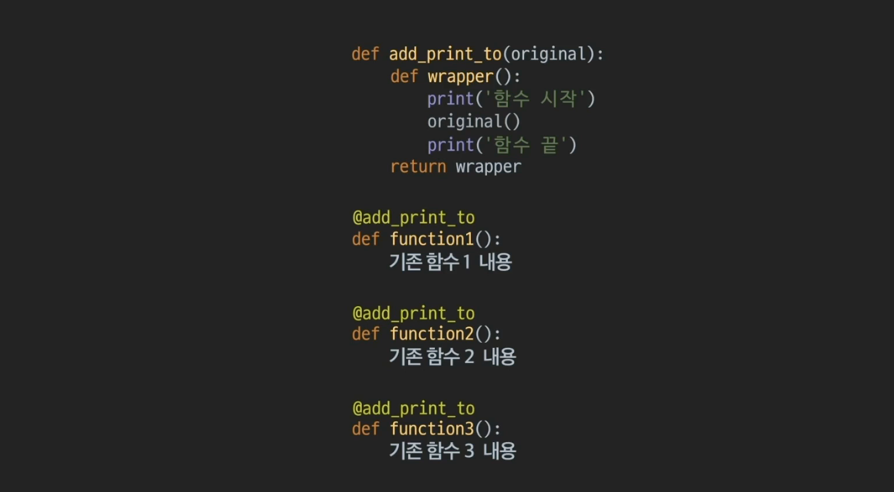

  **매우 간단해짐. 데코레이터 객체지향에서 자주 보게 됨.**

  데코레이터를 보면, 함수를 다른 함수로 꾸며서 기능을 추가해줬구나 라고만 생각하면 됨. 


- #### 클래스 메소드(Class Method)

  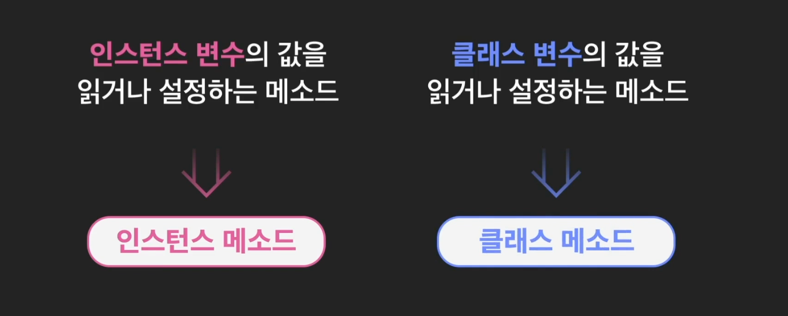

  나는 User의 Count를 출력하는 메소드를 만들고 싶음. 

  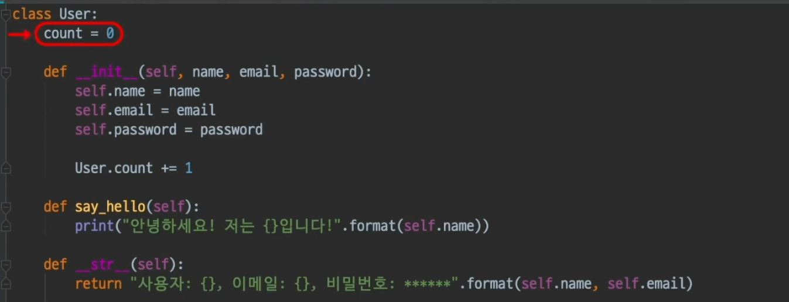

  class method는 `@classmethod` 데코레이터를 써서 파이썬에게 이게 클래스 메소드임을 알려준다. 

  다른 뭔가 기능을 추가한거겠지. 

  **클래스 메소드에서는, 첫번째 파라미터로 클래스가 자동전달됨.** 

  그니깐 파이썬의 구조 자체가, 클래스 내부에서 def가 보이면, 디폴트로 self라는 자기자신 객체를 리턴하되, @classmethod라는 데코레이터가 보이면 첫번째 인자로 class를 전달하게 해 놓은 것. 즉, 이 데코레이터 자체가 꾸며주면서 추가한 기능이 "*class를 첫번째 인자로 리턴하라*" 이것이였던 것. 

  **첫번째 파라미터 이름 cls로 하는 것은 파이썬 사용자들의 약속**

  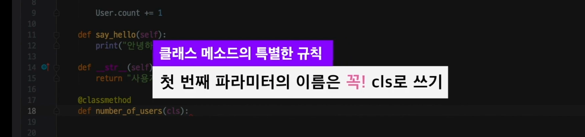

  ```python
  
  class User:
      count = 0
  
      def __init__(self, name, email, password):
          self.name = name
          self.email = email
          self.password = password
  
      def say_hello(self):
          print("안녕하세요! 저는 {} 입니다.".format(self.name))
  
      def __str__(self):
          return "사용자 : {}, 이메일 : {}, 비밀번호 : ******".format(self.name, self.email)
  
      @classmethod
      def number_of_users(cls):
          print("총 유저 수는 : {} 입니다.".format(cls.count))
  
  
  user1 = User("Young", "young@codeit.kr", "123456")
  user2 = User("Yoonsoo", "yoonsoo@codeit.kr", "abcdef")
  user3 = User("Taeho", "taeho@codeit.kr", "123abc")
  
  User.number_of_users()
  user1.number_of_users()
  ```

  여기서도 마찬가지로

  ```python
  User.number_of_users()
  user1.number_of_users()
  ```

  인스턴스와 클래스로 동시에 호출 가능. 여기서도 똑같겠지. user1이라는 객체 내부에서 찾다가 없으니깐 클래스 범위로 가서 함수를 찾는 거겠지. 

  **차이를 한번 다시 짚고 가자면,**

  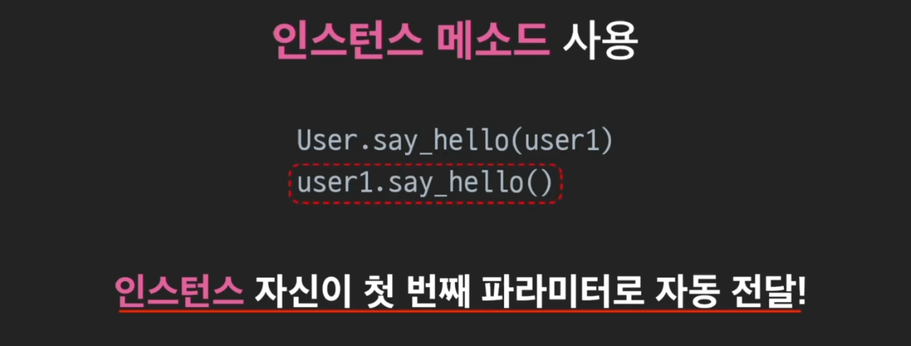

  *위의 두가지 호출에서 2번째 케이스에는 인스턴스로 자기 자신을 자동으로 전달하게 됨.*

  하지만 클래스 메소드에서는 두 가지 방법 모두 첫번째 파라미터로 자기 자신이 직접 전달됨. 

   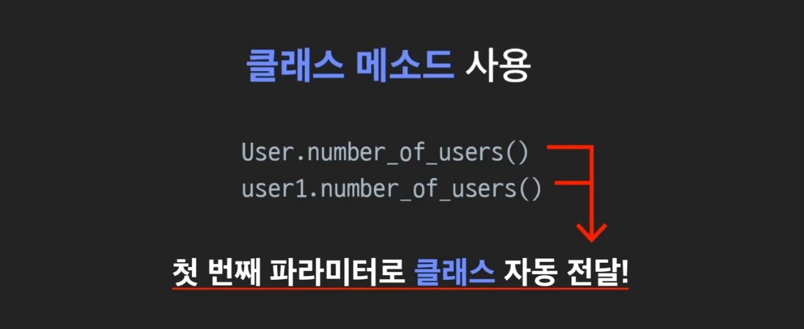

  **class가 자동 전달되는 이유는 데코레이터에서 해주고 있는 것.** 

  근데 사실 class method로 작성했던, **number_of_users**메소드는 그냥 **instance method**로 작성해도 됨. 

  ```python
  class User:
      count = 0
  
      def __init__(self, name, email, password):
          self.name = name
          self.email = email
          self.password = password
  
  
      # @classmethod
      # def number_of_users(cls):
      #     print("총 유저 수는 : {} 입니다.".format(cls.count))
  
      def number_of_users(self):
          print(self.count)
          print(User.count)
  ```

  ```python
  User.number_of_users(user1)
  user1.number_of_users()
  ```

  결과 실행 시키는 것에 아무 문제가 없음. 

  **그러면 애초에 왜 클래스 메소드로 만들었을까?**

  그거는 number_of_users가 인스턴스 변수를 사용하지 않기 때문. 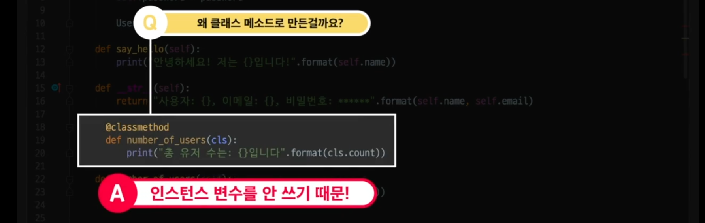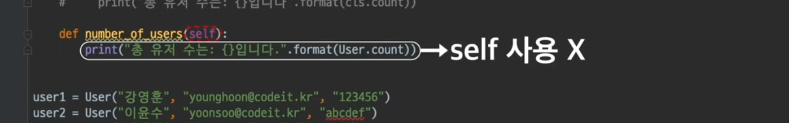

  **이처럼 인스턴스 변수는 사용 안하고, 클래스 변수만 사용하는 메소드라면 클래스 메소드로 작성하자.** 

  

  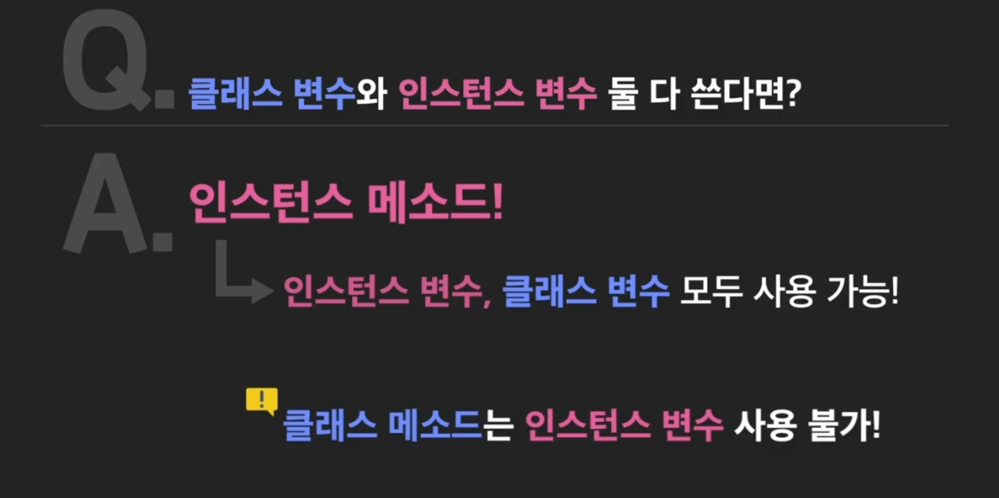

  아예 현재 인스턴스 자체가 없는데 클래스에 함수가 필요하면, 당연히 클래스 메소드를 사용해야지. 

  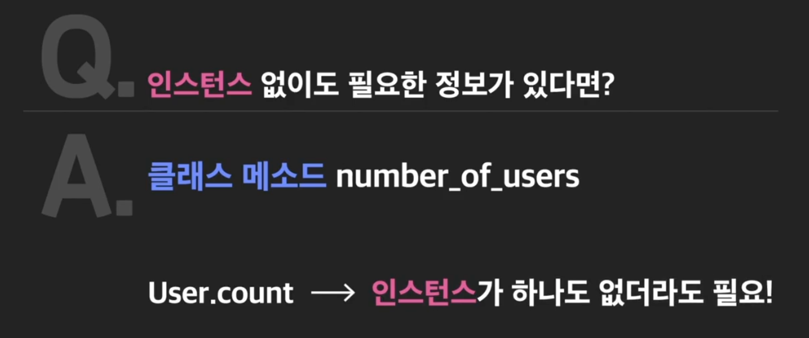

  인스턴스 아예 없이 그냥 아래처럼 해도 실행이 됨. 

  이렇게 인스턴스가 하나도 없어도 실행할 가능성이 있으면 클래스 메소드로 사용해야 함. 

  ```python
  class User:
      count = 0
  
      def __init__(self, name, email, password):
          self.name = name
          self.email = email
          self.password = password
          User.count += 1
  
      def say_hello(self):
          print("안녕하세요! 저는 {} 입니다.".format(self.name))
  
      def __str__(self):
          return "사용자 : {}, 이메일 : {}, 비밀번호 : ******".format(self.name, self.email)
  
      @classmethod
      def number_of_users(cls):
          print("총 유저 수는 : {} 입니다.".format(cls.count))
  
  
  User.number_of_users()
  ```

  


- #### 정적 메소드

  이때까지

  - **인스턴스 메소드**
  - **클래스 메소드**

  를 배웠습니다. 메소드의 종류는 총 3가지라고 했죠? 아직 하나가 더 남았습니다.

  바로 **정적 메소드**(static method)입니다. **정적 메소드는 인스턴스 변수, 클래스 변수를 전혀 다루지 않는 메소드입니다.**  아래 코드를 볼까요?

  ```python
  class User:
      count = 0
      
      def __init__(self, name, email, pw):
          self.name = name
          self.email = email
          self.pw = pw
      
          User.count += 1
      
      def say_hello(self):
          print("안녕하세요! 저는 {}입니다!".format(self.name))
      
      def __str__(self):
          return "사용자: {}, 이메일: {}, 비밀번호: ******".format(self.name, self.email)
      
      @classmethod
      def number_of_users(cls):
          print("총 유저 수는: {}입니다".format(cls.count))
      
      @staticmethod
      def is_valid_email(email_address):
          return "@" in email_address
  ```

  지금 `User` 클래스에서 `is_valid_email` 메소드가 정적 메소드입니다. 정적 메소드는 메소드 정의 위에  **`@staticmethod`** 데코레이터를 표시해야 합니다. `is_valid_email` 메소드는 파라미터 `email_address`로 받은 문자열에  `@`가 들어있는지 체크합니다.

  정적 메소드는

  - 인스턴스 메소드의 `self`
  - 클래스 메소드의 `cls`

  같은 자동 전달되는 파라미터가 없습니다.

  그리고 정적 메소드는 아래 코드처럼 **인스턴스, 클래스 두 가지 모두를 통해 사용 가능합니다.**

  ```python
  print(User.is_valid_email("taehosung"))
  print(User.is_valid_email("taehosung@codeit.kr"))
      
  print(user1.is_valid_email("taehosung"))
  print(user1.is_valid_email("taehosung@codeit.kr"))
  False
  True
  False
  True
  ```

  **정적 메소드는 언제 사용할까요?**

  ```python
  # 인스턴스 메소드
  def __str__(self):
      return "사용자: {}, 이메일: {}, 비밀번호: ******".format(self.name, self.email)
  
  # 클래스 메소드    
  @classmethod
  def number_of_users(cls):
      print("총 유저 수는: {}입니다".format(cls.count))
  
  # 정적 메소드    
  @staticmethod
  def is_valid_email(email_address):
      return "@" in email_address
  ```

  `User` 클래스에는 인스턴스 메소드, 클래스 메소드, 정적 메소드가 있습니다.

  1. 인스턴스 메소드 `__str__`는 인스턴스 변수인 `self.name`, `self.email`을 사용하고,
  2. 클래스 메소드 `number_of_user`는 클래스 변수인 `cls.count`를 사용합니다.
  3. 하지만 `is_valid_email` 메소드에선 아무 변수도 사용하고 있지 않네요.

  **인스턴스 변수나 클래스 변수 중 아무것도 사용하지 않을 메소드라면 정적 메소드로 만들면 됩니다.** 그러니까 어떤 속성을 다루지 않고, 단지 기능(행동)적인 역할만 하는 메소드를 정의할 때 정적 메소드로 정의하면 됩니다. 이제 여러분은 메소드의 종류에는

  - 인스턴스 메소드
  - 클래스 메소드
  - 정적 메소드

  이 3가지가 있다는 것을 기억해주세요.


## 미리 알고 갑시다

- #### 파이썬은 순수 객체 지향 언어?

  

  우리가 파이썬에서 본 단순한 숫자부터 모든 것이 모두 어떤 클래스의 인스턴스 였다는 것. 

  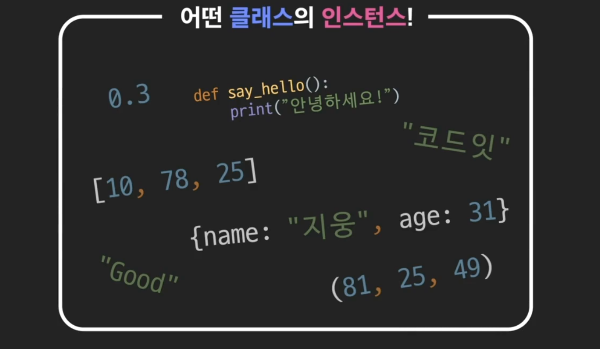

  dunder main표시는 지금 실행되고 있는 파일을 나타냄. 

  즉, **__main__.user라고 써 있는거는, 지금 실행되고 있는 그 파일에 정의되있는 User class**이다. 라는 뜻. 

  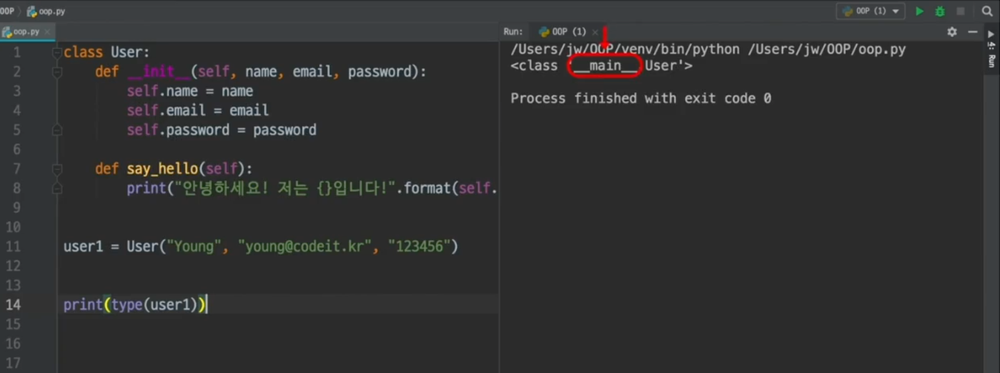

  ```python
  print(type(1))
  print(type("string"))
  print(type([]))
  print(type({}))
  print(type(()))
  
  def print_hello():
      print("hi")
  
  print(type(print_hello))
  ```

  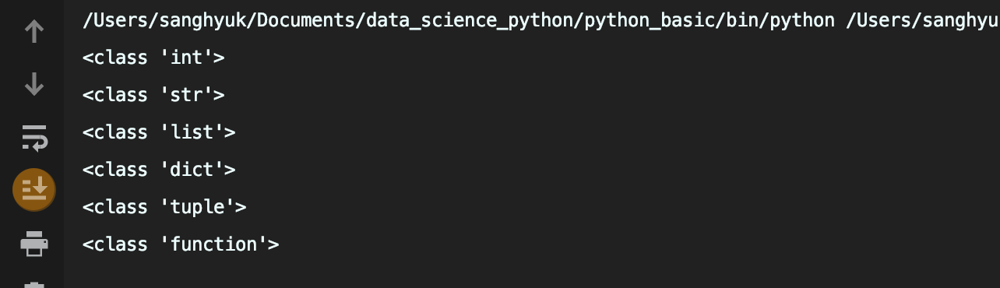

  파이썬에서 기본적으로 제공하는 클래스 이름이 적혀 있는 것. 이 모든 것들은 파이썬의 **어떤 클래스의 인스턴스** 였던 것. 

  *이 클래스들은 파이썬을 만든 개발자들이 미리 클래스도 만들어 놓은 것.* "만들어 놨으니깐 자유롭게 쓰세요!"

  ```python
  1
  ```

  이렇게 딱 치는 순간, int class로 만든 인스턴스 하나가 생성되도록 파이썬이 프로그래밍 되어 있는 것. 

   ```python
   ""
   ```

  이렇게 치면, str클래스의 인스턴스가 생성된 것. 

  ```python
  def hello():
  		pass
  ```

  이렇게 함수를 정의하는 것도 function이라는 클래스의 인스턴스를 만든 것. 

  ```python
  int_list = []
  int_list.append(1)
  int_list.append(3)
  int_list.append(7)
  
  print(int_list)
  ```

  이거는 파이썬을 만든 개발자들이, list라는 클래스에  append라는 메소드를 미리 정의해 놓은 것이지. 아마도 인스턴스 메소드겠지. 

  파이썬의 모든 것은 객체임으로, 파이썬으로 뭔가를 친 순간 객체 생성되고 사용하고 있던 것.

  그래서 파이썬은 **순수객체지향언어**

  

- #### 가변 vs 불변타입

  
  
  두 타입은 어떻게 다를까?
  
  예를 들어, list class가 가변타입. tuple class가 불변타입. 
  
  ```python
  mutable_object = [1, 2, 3]
  immutable_object = (1, 2, 3)
  mutable_object[0] = 4
  print(mutable_object)
  ```
  
  ```python
  immutable_object[0] = 4
  print(immutable_object)
  ```
  
  > Traceback (most recent call last):
  >   File "/Users/sanghyuk/Documents/data_science_python/oop/code/topic_1/python_basic.py", line 25, in <module>
  >     immutable_object[0] = 4
  > TypeError: 'tuple' object does not support item assignment
  
  
  
  **다만 튜플일지라도 변수가 가리키는 객체 자체는 바꿀 수 있음.**
  
  ```python
  tuple_x = (6, 4)
  tuple_x[0] = 4
  tuple_x[1] = 1
  ```
  
  이미 생성된 객체의 속성을 바꾸는 것은 에러가 남. 
  
  ```python
  tuple_x = (4, 1)
  tuple_x = (4, 1, 7)
  ```
  
  ***이처럼 아예 새로운 instance를 지정하는 것은 문제가 없음.***
  
   튜플의 값을 바꾸고 싶으면, 기존 생성된 객체의 속성을 바꾸는 것이 아니고(불가능하니깐), 객체를 새로 생성해서 변수가 새로운 객체를 가리키도록 해야함. 
  
  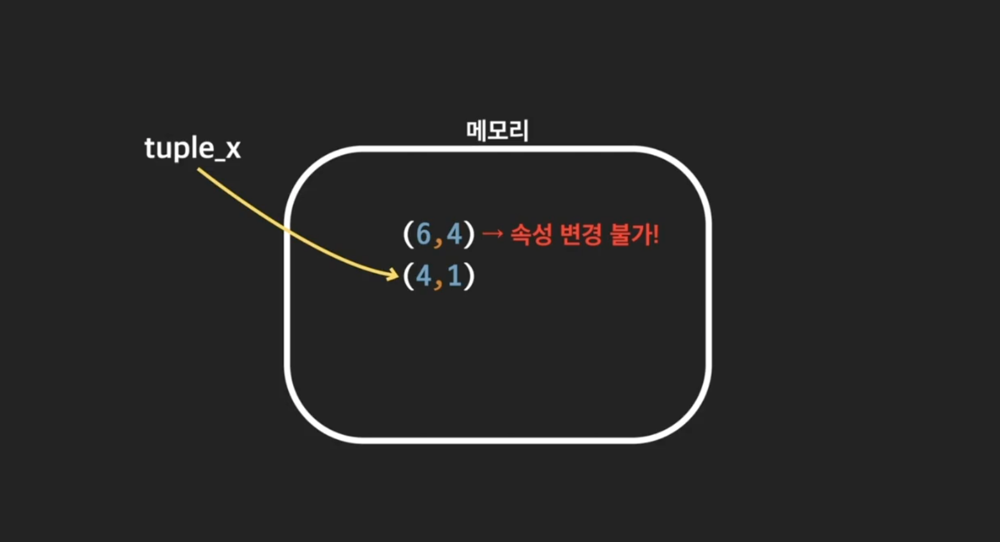
  
  리스트는 당연히 바꿀 수 있음. 
  
  ```python
  list_x = []
  list_x.append(4)
  list_x.append(1)
  list_x.append(7)
  ```
  
  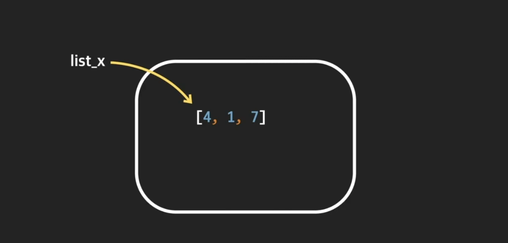
  
  **파이썬의 가변/불변 표는 다음과 같음.**
  
  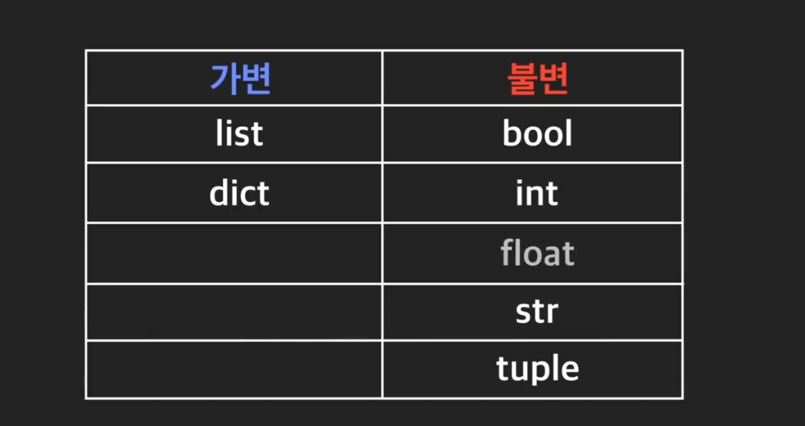
  
   직접 만드는 클래스는 모두 가변타입. 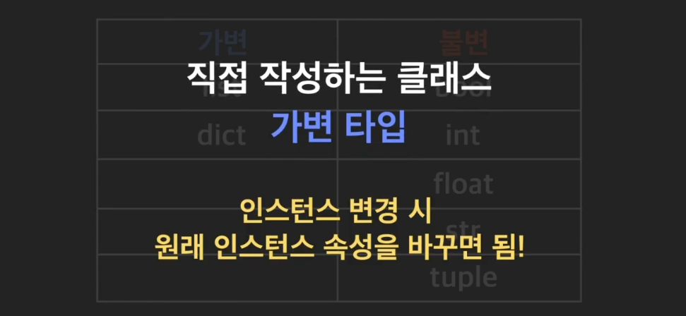


- #### 절차 지향 프로그래밍 vs 객체 지향 프로그래밍

  우리는 지금 **객체 지향 프로그래밍**을 배우고 있습니다. 그런데 객체 지향 프로그래밍이 있다면 객체 지향이 아닌 프로그래밍도 있지 않을까요? 맞습니다. 다른 프로그래밍도 있습니다.

  **절차 지향 프로그래밍이란?**

  객체 지향 프로그래밍이 등장하기 이전에 **절차 지향 프로그래밍**이 있었습니다. 절차 지향 프로그래밍은 객체 지향 프로그래밍과 달리 ‘객체’라는 개념이 없습니다. 대신 절차 지향 프로그래밍에도 ‘함수’라는 개념은 있습니다. ‘함수’는 순서대로 특정 명령어들을 실행하는 부분을 하나로 묶은 것입니다. 절차 지향 프로그래밍으로 작성된 프로그램을 한번 봅시다. 

  **절차 지향 프로그래밍 예시**

  ```python
  # 절차 지향 프로그래밍
  # 반복적으로 사용하는 코드를 함수로 정의한다
  def print_person_info(person_name, person_age, person_gender):
      # 사람의 이름, 나이, 성별을 파라미터로 받으면 받은 정보를 이해할 수 있는 문자열로 출력해주는 함수
      print("사람 한 명을 소개합니다")
      print("{}님은 {}살이고 {}입니다".format(person_name, person_age, person_gender))
      
  def is_underage(person_age):
      # 사람의 나이를 파라미터로 받아서 미성년자인지를 리턴해주는 함수
      return person_age < 20
      
  # 영훈이의 정보
  young_name = "영훈"
  young_age = 10
  young_gender = "남자"
      
  # 윤수의 정보
  yoonsoo_name = "윤수"
  yoonsoo_age = 20
  yoonsoo_gender = "남자"
      
  # 영훈/윤수 정보 출력
  print_person_info(young_name, young_age, young_gender)
  print_person_info(yoonsoo_name, yoonsoo_age, yoonsoo_gender)
      
  # 영훈/윤수가 미성년자인지 출력
  print(is_underage(young_age))
  print(is_underage(yoonsoo_age))
  사람 한 명을 소개합니다
  영훈님은 10살이고 남자입니다
  사람 한 명을 소개합니다
  윤수님은 20살이고 남자입니다
  True
  False
  ```

  `print_person_info` 함수와 `is_underage` 함수가 있네요. 이렇게 **프로그램에 필요한 동작을 함수라는 단위로 묶어서 사용하는 것이 절차 지향 프로그래밍**입니다. 같은 프로그램을 객체 지향 프로그래밍으로 작성하면 다음과 같습니다.

  **객체 지향 프로그래밍 예시**

  ```python
  # 객체 지향 프로그래밍
  # 속성과 행동을 갖는 객체들이 행동을 하는 방식으로 작성한다
  class Person:
      # 사람을 나타내는 클래스
      def __init__(self, name, age, gender):
          # 사람은 이름, 나이, 성별을 속성으로 갖는다
          self.name = name
          self.age = age
          self.gender = gender
      
      def print_info(self):
          # 자신의 정보를 출력하는 메소드
          print("사람 한 명을 소개합니다")
          print("{}님은 {}살이고 {}입니다".format(self.name, self.age, self.gender))
      
      def is_underage(self):
          # 사람의 나이를 파라미터로 받아서 미성년자인지를 리턴해주는 메소드
          return self.age < 20
      
  # 영훈/윤수을 나타내는 객체 생성
  young = Person("영훈", 10, "남자")
  yoonsoo = Person("윤수", 20, "남자")
      
  # 영훈/윤수 정보 출력
  young.print_info()
  yoonsoo.print_info()
      
  # 영훈/윤수가 미성년자인지 출력
  print(young.is_underage())
  print(yoonsoo.is_underage())
  사람 한 명을 소개합니다
  영훈님은 10살이고 남자입니다
  사람 한 명을 소개합니다
  윤수님은 20살이고 남자입니다
  True
  False
  ```

  객체 지향 프로그래밍은 필요한 동작 뿐만 아니라 아예 **연관된 데이터도** 객체로 묶어서 하나의 클래스로 나타냅니다. 즉,

  - *절차 지향 프로그래밍에서는 프로그램 안에서 서로 관련된 동작들만을 묶어서 관리하는데*
  - *객체 지향 프로그래밍에서는 관련된 동작들을 관련된 데이터와도 함께 묶어서 관리하는 거죠.*

  **절차 지향 프로그래밍과 객체 지향 프로그래밍의 차이**

  절차 지향 프로그래밍이 객체 지향 프로그래밍과 다른 점은 크게 2가지입니다.

  1. 절차 지향 프로그램은 프로그램에 필요한 데이터를 관련있는 함수와 묶어서 관리하기 힘듭니다. 그렇다면 객체 지향 프로그래밍은? 서로 관련있는 데이터와 함수를 객체로 묶어서 사용할 수 있습니다. 클래스라는 것이 있으니까요!
  2. 절차 지향 프로그래밍은 프로그램을 단지 명령어들을 순서대로 실행하는 것으로 봅니다. 그렇다면 객체 지향 프로그래밍은? 프로그램을 객체 간의 소통으로 봅니다. 즉, 객체가 프로그램의 기본 단위가 되고 이 객체 속을 들여다보면 서로 관련된 데이터(객체의 속성)와 동작(객체의 행동)이 모여있습니다. 그리고 프로그램을 이 객체들이 순서대로 소통하는 과정으로 간주합니다.

  이 두 가지의 차이를 표로 나타내볼까요?

  | 절차 지향 프로그래밍                                 | 객체 지향 프로그래밍                                 |
  | ---------------------------------------------------- | ---------------------------------------------------- |
  | 프로그램을 만들 때 데이터와 함수를 합칠 수 없다.     | 프로그램을 만들 때 데이터와 함수를 합칠 수 있다.     |
  | 프로그램을 명령어들을 순서대로 실행하는 것으로 본다. | 프로그램을 객체들이 순서대로 소통하는 과정으로 본다. |

  두 방식 중 어느 한 가지가 더 좋다고 할 수는 없습니다. 프로그램의 용도에 따라 적합한 방식이 다르기 때문입니다. 만약 데이터와 동작의 연관성이 높고 이걸 객체라는 단위로 묶는 것이 낫겠다는 생각이 들면 객체 지향 프로그래밍을 하는 것이 좋습니다. 보통 복잡한 프로그램일수록 객체 지향 프로그래밍으로 하는 것이 더 나은 경우가 많습니다.

- #### 유용한 함수들

  앞으로 자주 마주치게 될 함수들을 미리 살펴봅시다.

  **`max`, `min` 함수**

  ```python
  print(max(2, 5))             # => 5
  print(max(2, 7, 5))          # => 7
  print(min(2, 5))             # => 2
  print(min(2, 7, 5, 11, 6))   # => 2
  ```

  `max` 함수는 파라미터 중 가장 큰 값을, `min` 함수는 파라미터 중 가장 작은 값을 리턴합니다. 두 함수 모두 원하는 개수만큼의 파라미터들을 넘겨줄 수 있습니다.

  **`sum` 함수**

  ```python
  int_list = [1, 2, 3, 4, 5]
  int_tuple = (4, 3, 6, 1, 2)
  int_dict = {1: "one", 2: "two", 3: "three"}
      
  print(sum(int_list))         # => 15
  print(sum(int_tuple))        # => 16
  print(sum(int_dict))         # => 6
  ```

  `sum` 함수는 리스트, 튜플, 딕셔너리에 있는 숫자형 요소들의 합을 리턴합니다. `sum` 함수에 딕셔너리를 파라미터로 넘기면 key들의 합을 리턴합니다.

  **ternary expression**

  ```python
  condition = True
      
  if condition:
      condition_string = "nice"
  else:
      condition_string = "not nice"
      
  print(condition_string)      # => nice
  condition = True
      
  condition_string = "nice" if condition else "not nice"
      
  print(condition_string)      # => nice
  ```

  위의 코드와 아래의 코드는 같은 내용입니다. `"nice" if condition else "not_nice"` 이 구문은

  1. `condition`이 `True` 일 때는 `"nice"`가 되고
  2. `False` 일 때는 `"not_nice"`가 된다는 뜻입니다.

  이렇게 불린(Boolean) 값에 따라 다른 값을 리턴하는 구문을 **ternary expression**이라고 합니다. ternary expression을 사용하면 if, else로 복잡하게 표현해야 하는 구문을 간단하게 나타낼 수 있습니다.

  **list comprehension**

  ```python
  int_list = [1, 2, 3, 4, 5, 6]
  squares = []
      
  for x in int_list:
      squares.append(x**2)
      
  print(squares)               # [1, 4, 9, 16, 25, 36]
  int_list = [1, 2, 3, 4, 5, 6]
  squares = [x**2 for x in int_list]
      
  print(squares)               # [1, 4, 9, 16, 25, 36]
  ```

  위 코드와 아래 코드는 같은 뜻입니다. **list comprehension**은 새로운 리스트를 만드는 간편한 방법입니다. 특정 리스트나 튜플을 바탕으로 리스트를 생성할 때

  1. `[]` 안에 원하는 값을 리턴하는 식 (`x**2`) 뒤에
  2. for문을 써줍니다(`for x in int_list`).

  이렇게 쓰면 `int_list` 의 각 요소들을 제곱해준 값들로 이루어진 새로운 리스트가 생성됩니다.  `x**2` 부분에 여러분이 원하는 식을 쓰면 되겠죠?

  **`zfill` 메소드**

  이 메소드는 문자열을 최소 몇 자리 이상을 가진 문자열로 변환시켜줍니다. 이때 만약 모자란 부분은 왼쪽에 “0”을 채워주는데요. 예를 들어 만약 `"1".zfill(2)`을 하면 "01"을 리턴합니다. 그리고 설정된 자릿수보다 이미 더 긴 문자열이라면 그 문자열을 그대로 출력합니다. 그러니까 `"333".zfill(2)` 와 같이 하면 문자열 그대로 “333”을 리턴합니다. 아래 코드를 보면 더 쉽게 이해할 수 있습니다. 이 메소드는 문자열을 예쁘고 통일감있게 출력하고자 할 때 자주 사용되니까 꼭 기억해주세요.

  ```python
  print("1".zfill(6))
  print("333".zfill(2))
  print("a".zfill(8))
  print("ab".zfill(8))
  print("abc".zfill(8))
  ```

  **실행 결과**

  ```
  000001
  333
  0000000a
  000000ab
  00000abc
  ```

- #### 모듈(Module)

  **모듈**(module)이란 변수, 함수, 클래스 등을 모아놓은 파일입니다. 이런 모듈은 다른 곳에서 가져다 쓸 수 있습니다. `calculator.py`라는 모듈을 만들고, 다른 파일에서 이 모듈을 가져다 써봅시다.

  ```python
  # calculator.py
  # calculator 모듈
      
  
  # 합
  def sum(x, y):
      return x + y
      
  # 차이
  def difference(x, y):
      return x - y
        
  # 곱
  def product(x, y):
      return x * y
      
  # 제곱
  def square(x):
      return x * x
  ```

  `test.py`라는 파일을 만들어 `calculator.py` 모듈을 사용해봅시다. 모듈 안에 있는 변수, 함수, 클래스를 사용하려면 `test.py` 파일 위에 다음과 같이 적어야 합니다.

  ```python
  from 모듈의 이름 import 불러올 변수/함수/클래스 이름
  ```

  이때 모듈의 이름에는 파일명에서 확장자명(`.py`)을 뺀 이름을 적으면 됩니다. `calculator.py`에 정의된 `sum`이라는 함수를 호출해봅시다.

  ```python
  # test.py
  
  # calculator.py에서 sum 함수 불러오기
  from calculator import sum
      
  print(sum(3, 5))
  8
  ```

  만약 `calculator.py`모듈에 정의된 모든 것들을 사용하려면 어떻게 선언해야 할까요?

  ```python
  from calculator import sum, difference, product, square
  ```

  위와 같이 하면 되겠죠? 하지만 모듈에서 가져오려는 하는 것이 100개 이상이라면? 100개의 이름을 모두 쓰기는 힘들겠죠? 이럴 땐 `*`를 쓰면, 모듈 안에 정의된 모든 변수/함수/클래스를 사용할 수 있습니다.

  ```python
  from calculator import *
      
  print(sum(3, 5))
  print(difference(3, 5))
  print(product(3, 5))
  print(square(3))
  8
  -2
  15
  9
  ```

  **`randint` 함수와 `uniform` 함수**

  파이썬에 기본으로 내장된 모듈에서 함수를 가져다 써봅시다. 파이썬에 기본 내장된 `random`이라는 모듈에는 `randint`라는 함수가 있습니다. 이 함수는 두 정수 사이에서 랜덤한 정수(난수)를 리턴하는 함수입니다. 한번 사용해볼까요? 아래 코드처럼 하면 됩니다.

  다음을 실행하면 1부터 20 사이의 정수 중 랜덤으로 한 가지 수가 출력됩니다.

  ```python
  from random import randint
  # 1 <= N <= 20를 만족하는 랜덤한 정수(난수) N을 리턴한다.
  x = randint(1, 20)
  print(x)
  ```

  `uniform`도 `random` 모듈에 있는 함수인데요, 두 수 사이의 랜덤한 소수(난수)를 리턴하는 함수입니다.

  다음을 실행하면 `0`과 `1`사이의 소수 중 랜덤으로 한 가지 수가 출력됩니다.

  ```python
  from random import uniform
  # 0 <= N <= 1을 만족하는 랜덤한 소수(난수) N을 리턴한다.
  x = uniform(0, 1)
  print(x)
  ```